# VCS Add/Edit/Remove NSX-T Networks

## Table of Contents

- [VCS Add/Edit/Remove NSX-T Networks](#vcs-addeditremove-nsx-t-networks)
  - [Table of Contents](#table-of-contents)
- [Changelog](#changelog)
  - [Introduction](#introduction)
    - [Purpose](#purpose)
    - [Audience](#audience)
    - [Scope](#scope)
  - [Create Network Segment - Routed](#create-network-segment---routed)
  - [Create Network Segment - Bridged](#create-network-segment---bridged)
  - [Create Network Segment - Switched](#create-network-segment---switched)
- [Working on Distributed Firewall](#working-on-distributed-firewall)
  - [Exclude bridged logical segments from Distributed Firewall](#exclude-bridged-logical-segments-from-distributed-firewall)
- [Working with IPAM](#working-with-ipam)
  - [Register IP address in IPAM (Infoblox)](#register-ip-address-in-ipam-infoblox)
- [Working with VRA](#working-with-vra)
  - [logging to the VRA and navigating to the Network Profiles](#logging-to-the-vra-and-navigating-to-the-network-profiles)
  - [Creation of the Network Profile](#creation-of-the-network-profile)
  - [Add Network to the network profile](#add-network-to-the-network-profile)
  - [Remove Network from the network profile](#remove-network-from-the-network-profile)
  - [Edit/remove tag on the network within network profile](#editremove-tag-on-the-network-within-network-profile)
  - [Remove Network profile](#remove-network-profile)

# Changelog

| Version | Date       | Description              | Author          |
| ------- | ---------- | ------------------------ | --------------- |
| 0.1 | 09/05/2022 | Draft version creation       | Marcin Rakoca |
| 0.2 | 11/05/2022 | Translate document to Markdown and modify some sections | Radoslaw Dabrowski |
| 0.3 | 15/07/2024 | Adjust VRA part to address all activities required for CNT team to work | Radoslaw Dabrowski |
| 0.4 | 09/04/2026 | Add switched segment addition steps | Adam Szymczak |

## Introduction

NSX-T provides an option to create three types of networks.

- **Routed** - This network assumes that NSX-T Logical Router is a gateway for the network and there is L3 connectivity between VM and Data Center resources
- **Switched** - This network assumes that NSX-T is providing L2 technology toward physical infrastructure where a physical Gateway is used. Apart from that, there is no real plan to transform this network later to the routed one.
- **Bridged** - This network assumes that NSX-T is providing L2 technology toward the physical infrastructure where a physical Gateway is used. Apart of that, there is a plan to transform this network later to the routed one once migration or other activities are done.

### Purpose

Create NSX Networks and register subnets in vRA Cloud.

### Audience

- VCS Operations

### Scope

- Create Network Segments on NSX
- Exclude segments from Firewall
- Register IP in Infoblox
- Register new subnets in vRA

## Create Network Segment - Routed

1. Login to NSX-T Manager GUI

2. Navigate to **Networking** -> **Segments** -> **ADD SEGMENT**

3. Enter **Segment Name**

4. Set **Connected Gateway** to define where segment should be connected

5. Set **Transport Zone** to overlay transport zone

6. Define **Subnets** field with the IP address (CIDR notation) that will be used as a default gateway for this segment

    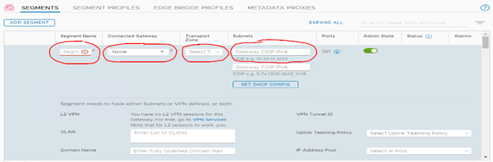

7. Click **Save**

## Create Network Segment - Bridged

1. Login to NSX-T Manager GUI

2. Navigate to **Networking** -> **Segments** -> **ADD SEGMENT**

3. Enter **Segment Name**

4. Set **Connected Gateway** to None

5. Set **Transport Zone** to overlay transport zone

   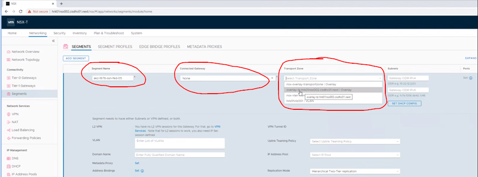

6. Once created, edit the segment

    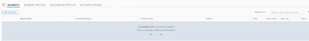

7. Click on **Set** button next to "Edge Bridges" option

    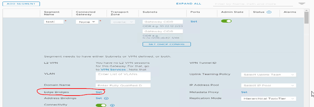

8. Click on **ADD EDGE BRIDGE**

    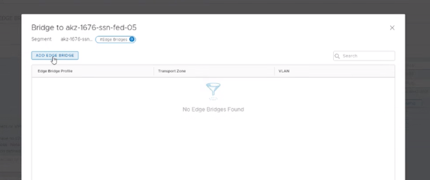

9. Pick **Edge Bridge Profile** (it contains NSX Edges designated for bridging only)

10. Choose VLAN type **Transport Zone**

11. Enter **VLAN ID** in VLAN section

12. Click **ADD** followed by **APPLY** and **SAVE** configuration of the segment

  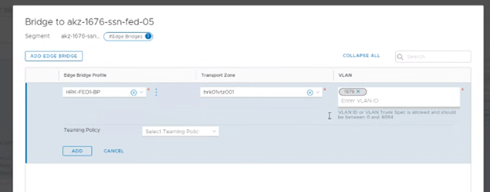

## Create Network Segment - Switched

1. Login to NSX-T Manager GUI

2. Navigate to **Networking** -> **Segments** -> **ADD SEGMENT**

3. Enter **Segment Name**

4. Set **Connected Gateway** to None

5. Set **Transport Zone** to VLAN transport zone

6. Define **Subnets** field with the IP address (CIDR notation) that will be used as a default gateway for this segment

7. Open **Additional Settings** dropdown and input VLAN number for the network

8. Click **Save**

# Working on Distributed Firewall

If necessary, the firewall ruleset might be set for all networks including bridging and switching. For that, use a Work Instruction wiAddEditRemoveSecurityGroupsAndFwRules. Otherwise, when the ruleset cannot be set, networks should be excluded from the Distributed Firewall on NSX-T instead to not filter traffic on those.

## Exclude bridged logical segments from Distributed Firewall

1. Login to NSX-T Manager GUI

2. Navigate to **Security** -> **Distributed Firewall** -> **Actions** -> **Exclusion List**

    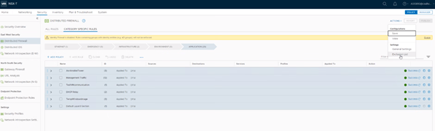

3. Find the desired exclusion list and click on the three vertical dots to edit it (this example refers to ExclusionList-Migration)

    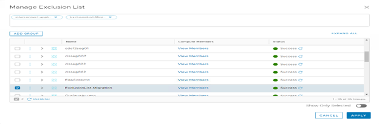

4. Once you edit the exclusion list, you can manipulate the Compute Members to add bridged logical segments in there

    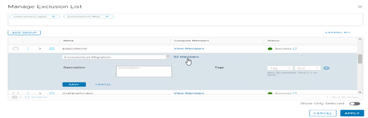

5. Find newly created logical segments on this list and select them. Click **APPLY** and then **APPLY** once more to confirm configuration change of the exclusion list

    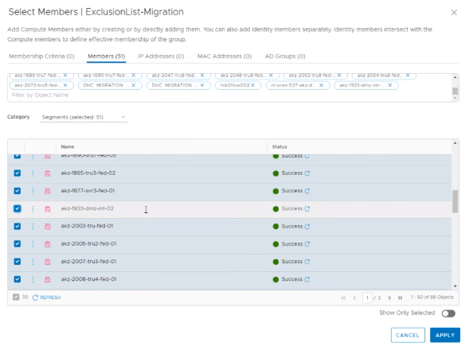

# Working with IPAM

## Register IP address in IPAM (Infoblox)

1. Login to the Infoblox GUI

2. Select the proper tenant and navigate to **Data Management** -> **IPAM**

3. Click the blue ‘+’ symbol to Add the IPv4 Network

    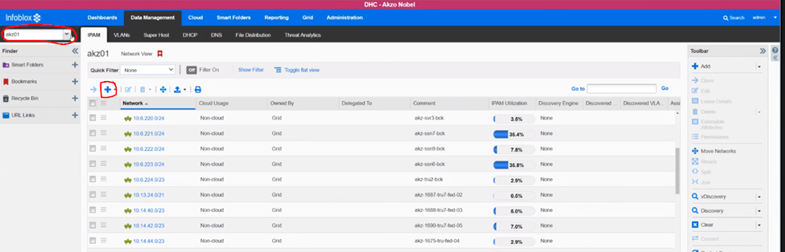

4. Select **Add Network** and **Manually** then click **Next**

    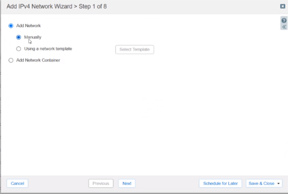

5. Enter **Netmask** and click the blue ‘+’ symbol on **Networks** to input the IP address of the network

6. Fill **Comment** section with VLAN name

    

7. Step 3 remains as is - click **Next**

8. Step 4 remains as is - click **Next**

9. Click the **Override** button located in the right of each section which needs to be defined to enter:
    - Router (default gateway of the subnet)
    - Domain Name (i.e. d30.intra for AKZ customer)
    - DNS Servers (i.e. 10.218.8.157 & 10.218.8.158 for AKZ customer)

    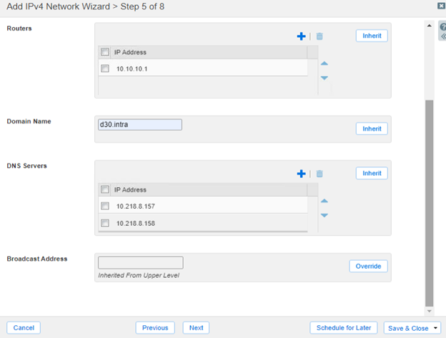

10. Click **Save & Close**.

11. Navigate to **Data Management** -> **IPAM** -> **IP MAP**

12. Find the newly created entry and click on it

13. Select the first available (white) circle and click the downwards pointing arrow at the **Add** button on the right-hand side Toolbar

    > **Note:** Please make sure what is the reservation done on each and every network respectively with owner of the networks to define if there are any good practices (i.e. DCLAN in The Netherlands is reserving first 10 addresses of each the networks).

    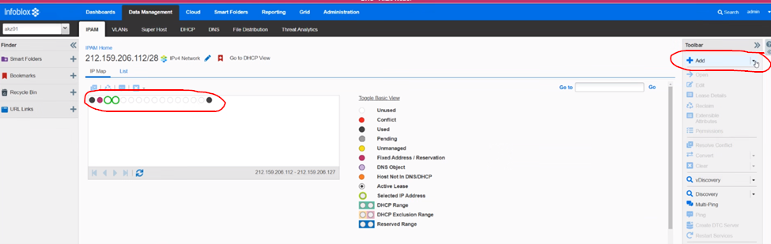

14. Click on **IPv4 Reservation**

    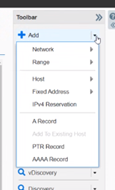

15. Select **Add Reservation** and click **Next**

    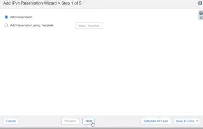

16. Make sure the proper circle (cell) is selected by verifying the IP Address and fill in Name as Router HSRP (if it’s a bridged network) or Tier-1 Gateway (if it’s an NSX routed network)

17. Click **Save & Close**

18. Repeat above two steps for all IP reservation needed. (i.e. for bridged network, usually first 3 IP addresses in the network are used to form HSRP routers)

    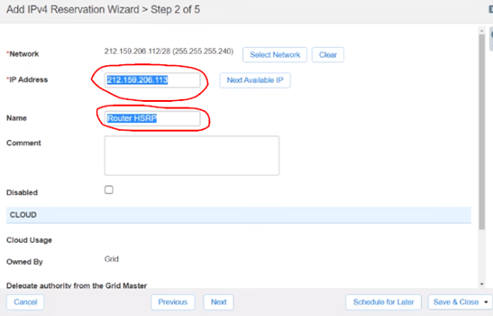

19. Navigate to **Data Management** -> **IPAM** -> **List**

20. Output visible on the Infoblox should be similar to the following

    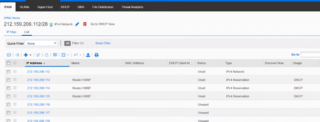

# Working with VRA

## logging to the VRA and navigating to the Network Profiles

1. Login to https://\<Location Code\>vra001.\<Domain Name\>

   NOTE: in case of multitenant environment, please use instead:

   https://\<Tenant code\>.\<Location Code\>vra001.\<Domain Name\>

2. Click on **Services**
3. Click **Open** button on the **VMware Cloud Assembly** tile
4. Navigate to **Infrastructure** -> **Network Profiles**
5. Click on the **New Network Profile**

## Creation of the Network Profile

Each network profile should be requested by the requestor. Requestor should be fully aware about all details of the Network profile, otherwise network profiles should not be created.

1. Click on the **New Network Profile**
2. Pick **Account / region** as VCS002, define **Name** and **Description** as well as **Capability tags** (gather all information from the requestor)
3. Navigate to the **Networks**
4. Click on the **Add Network**
5. Select network (already existing in the NSX-T) according to the request
6. Click on the network name and fill in all details requested:
    - Domain
    - IPv4 CIDR
    - IPv4 Default Gateway
    - DNS servers
    - DNS search domains
    - Tags
    - checkbox (If its supporting public IP)

    NOTE: Some of the customers like BTN do require some of these for their blueprints to work properly. In BTN they do require DNS servers and search domain as well as Tag.
7. Click **Save**
8. Select network and click on the **Tags** button if there were no tags set before
9. Select network and click **Manage IP Ranges**
10. Click **New IP range**
11. Select **Source** as **External**
12. Select **Provider** as infoblox (named differently on all sites, but should be just single option to pick)
13. Select **Address space** pick tenant name or VCS
14. Pick from table network IP address according to the request
15. Confirm by clicking on the **Add**
16. Redo the points 4-15 for each network needed within the network profile.
17. Click **Create**
18. Redo the points 1-17 for each Network Profile needed.

## Add Network to the network profile

1. Select existing network profile by clicking on **Open** or their Name.
2. Navigate to the **Networks**
3. Click on the **Add network**
4. Select network (already existing in the NSX-T) according to the request
5. Click on the network name and fill in all details requested:
    - Domain
    - IPv4 CIDR
    - IPv4 Default Gateway
    - DNS servers
    - DNS search domains
    - Tags
    - If its supporting public IP
6. Click **Save**
7. Select network and click on the **Tags** button if there were no tags set before
8. Select network and click **Manage IP Ranges**
9. Click **New IP range**
10. Select **Source** as **External**
11. Select **Provider** as infoblox (named differently on all sites, but should be just single option to pick)
12. Select **Address space** pick tenant name or VCS
13. Pick from table network IP address according to the request
14. Confirm by clicking on the **Add**
15. Redo the points 3-14 for each network needed within the network profile.
16. Click **Save**

## Remove Network from the network profile

1. Select existing network profile by clicking on **Open** or their Name.
2. Navigate to the **Networks**
3. Select network you want to remove and click **Remove** button
4. Click **Save**

## Edit/remove tag on the network within network profile

1. Select existing network profile by clicking on **Open** or their Name.
2. Navigate to the **Networks**
3. Select network you want to change tag for and click **Tag** button
4. To add tag just start typing there new tag or remove old one by clicking **X** symbol next to it.
5. Click **Save**
6. Click **Save**

## Remove Network profile

1. Delete existing network profile by clicking on **Delete** on the network profile itself.
