# VCS Add/Edit/Remove Security Group and Firewall Rules

# Changelog

| Date | TOS | Issue | Author | Description |
| --- | --- | --- | --- | --- |
| 09/05/2022 | | DHC-3586 | Marcin Rakoca | Draft version creation |
| 10/05/2022 | | DHC-3586 | Radoslaw Dabrowski | Translate document to Markdown and modify some sections |

## Introduction

### Purpose

Create or modify Security groups and Firewall rules on NSX.

### Audience

- VCS Operations

### Scope

- Create Security Groups
- Create Firewall rules

# Working with Security Groups and Services

## Validate existing objects

1. Login to NSX-T Manager GUI

2. Navigate to **Security** -> **Distributed Firewall** -> **CATEGORY SPECIFIC RULES** -> **Application**

3. Check whether requested flow is already allowed by clicking on the **Filter** field and selecting desired criteria

    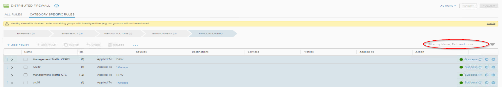
    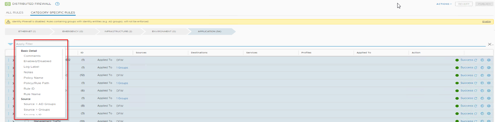

    > **Note:** It is possible to use multiple filters, just keep clicking **Filter** field to pick more options. You can remove all filters at once by clicking **CLEAR** on the right.
    > **Note:** Be careful, as for NSX-T version 3.0.2, filters might not evaluate rules with statements ‘any’, so you will not see such rules in results although they may match search criteria. ‘Any’ is categorized as Group object, so searching via IP, service, protocol with port, etc, will not display rules containing ‘any’.

    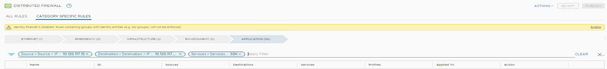

4. Check whether requested **IP address** is already configured as Group in NSX, click on the **Search** icon on the top bar and type in the IP address

    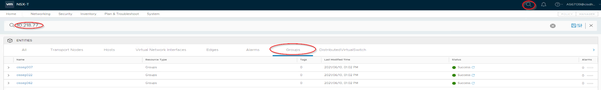

5. Select Groups within **ENTITIES** to filter out the unwanted objects

6. Once click on the **Name** of found object, you will be navigated to **Inventory** -> **Groups**

7. Click **View Members** -> **IP addresses** to confirm what is defined within the Group

    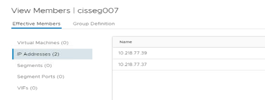

8. Navigate to **Inventory** -> **Services** and filter objects by Destination Ports to determine whether requested ports need to be created as objects within NSX

    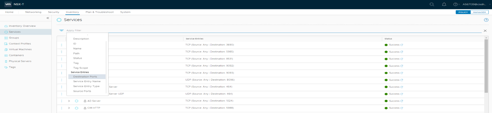

***

## Create Security Group (IP membership)

This section shall be executed to create Security Group in case it is not existing.

1. Login to NSX-T Manager GUI

2. Navigate to **Inventory** -> **Groups**

3. Click **ADD GROUP**

4. Fill **Name** and click on **Set Members** to continue with configuration

    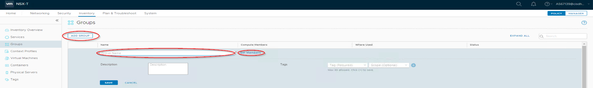

5. In newly popped out window navigate to **IP Addresses**

6. Type in desired **subnet** and/or **IP address** and/or **IP range**

    > **Note:** It is possible to list multiple entries in one Group if required (just keep clicking on text Enter IP Address).

7. Click **APPLY** and **SAVE**

    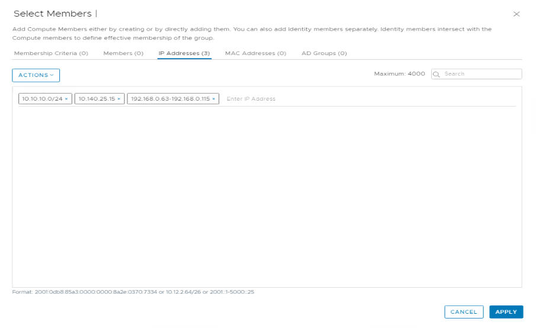

***

## Create Service

This section shall be executed to create Service/s in case it/they do not exist.

1. Login to NSX-T Manager GUI

2. Navigate to **Inventory** -> **Services**

3. Click **ADD SERVICE**

4. Fill the **Name**

5. Click on **Set Service Entities**

    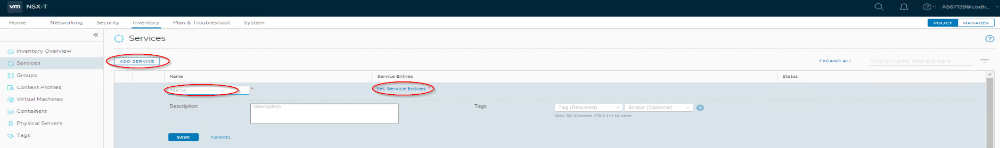

6. Click the **ADD SERVICE ENTRY** and populate displayed fields

    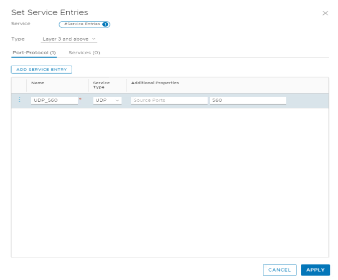

    > **Note:** There are a lot of already created services, please discover if needed one is not already there. In order to add existing services, click on **Services** and filter or select desired objects.

    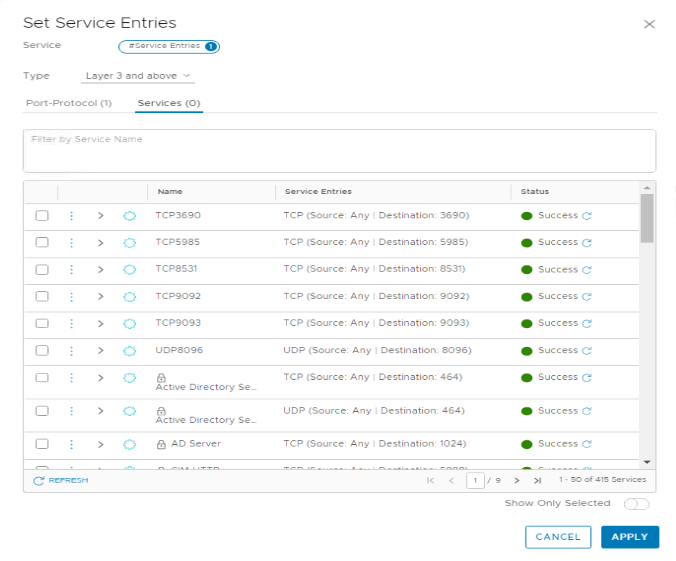

7. Click **APPLY** and **SAVE** afterwards

***

# Working with Distributed Firewall Rules

## Create Distributed Firewall rule

1. Login to NSX-T Manager GUI

2. Navigate to **Security** -> **Distributed Firewall** -> **CATEGORY SPECIFIC RULES** -> **Application**

3. Rules are grouped into Policies and if there is no Policy name matching requested flow type, a new Policy may be created by clicking **ADD POLICY**. New Policy will be created on top

4. Change Policy **Name** to desired one

5. Leave Policy's field **Apply to** filled with **DFW**. If needed, use FW rule's field **Apply to** instead

    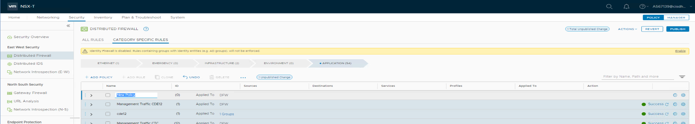

6. Once Policy is found or created, click on three vertical blue dots and select **Add Rule**

    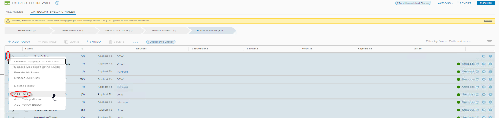

    > **Note:** Existing policies will most likely have some rules already configured. Expand the Policy by clicking on ">" icon to have better recognition and control of firewall rules order.

7. Hover mouse cursor over **Name**, **Source**, **Destination**, **Services**, **Profile**, **Applied To** fields of the firewall rule to interact and populate them with requested data.

    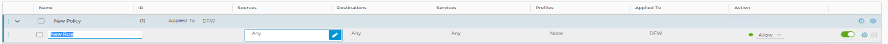

8. Select **Action** from drop-down menu and click on the gear icon to setup additional settings (e.g. logging).

9. Once all changes are done, click on **PUBLISH** to execute configuration changes

    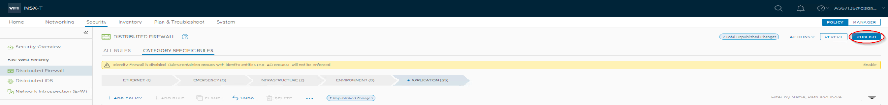

10. Click **REVERT** if you wish to discard the changes

    > **Note:** Once configuration gets pushed successfully, section and rule status should state as **Success**.

***

# Working with Logical Router's Firewall Rules

## Create Logical Router's (Gateway) Firewall rule

If requested traffic needs to traverse through **Tier-1 Gateway Uplink** interface (North-South traffic between VCS Segment and Data Center or flows between Segments connected to different Tier-1 Gateway) there is a need to apply firewall rule there. Uplink interface connects Tier-1 with Tier-0 Gateway.

There is no need to configure firewall rule on Tier-1 Gateway when requested traffic is going to traverse just through Tier-1 Gateway’s Downlink interfaces (East-West traffic). Downlink interface connects Segment with Tier-1 Gateway.

***

### Checking if requested IP Address/es belongs to Segment connected to NSX-T Gateway

1. Login to NSX-T Manager GUI

2. Navigate to **Networking** -> **Segments** and filter the list via Gateway

    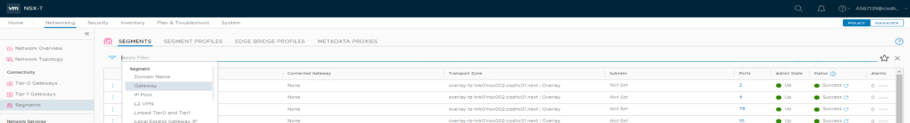

3. Search through existing items. These are addresses of default gateways created as Layer3 interfaces on VCS Tier-0 and Tier-1 Gateways. Once find matching entry, select it and click **APPLY**

    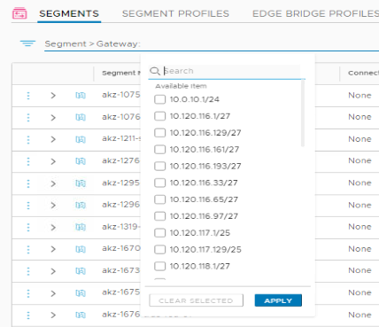

4. Note the **name** of Connected Gateway as firewall rule is required there

***

### Create Gateway Firewall rule

1. Login to NSX-T Manager GUI

2. Navigate to **Security** -> **Gateway Firewall** -> **GATEWAY SPECIFIC RULES**

3. Select proper Gateway using drop-down menu

    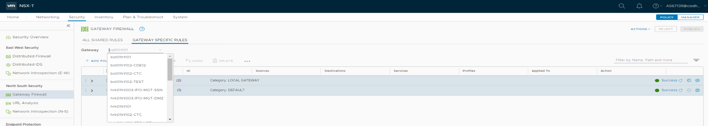

4. In order to configure firewall rule, you should then proceed similarly to what was described in [Create Distributed Firewall rule](#create-distributed-firewall-rule)
