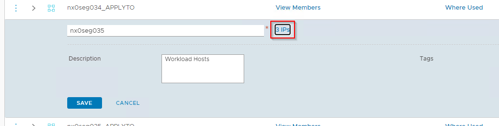
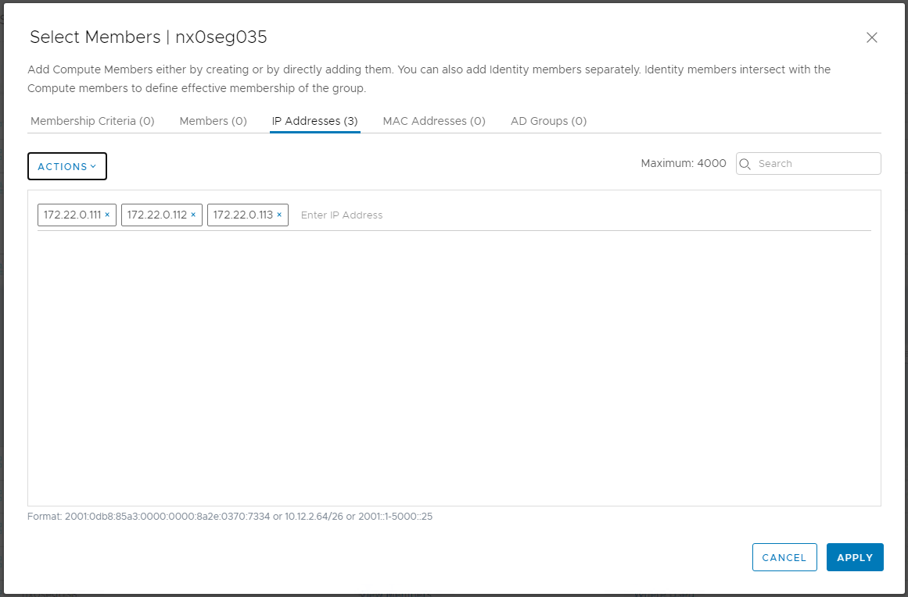

# Add Host to Cluster

# Changelog

| Date       | Issue     | Author             | TOS | Description                                 |
|------------|-----------|--------------------|-----|---------------------------------------------|
| 27/8/2021  |           | Piotr Lewandowski  |     | Initial version                             |
| 09/12/2021 |           | Radoslaw Dabrowski |     | Add requirement regarding versions required |
| 08/07/2022 |           | Marcin Gala        |     | Added chapter about license requirements    |
| 11/03/2026 | VCS-17684 | Adam Szymczak      |     | Add description of pre and post checks      |

## Introduction

### Purpose

Add a new host to an existing VCF cluster.

### Audience

- DevSecOps engineers

### Scope

Adding a new host to the existing cluster includes the 2 main areas:

- Commissioning ESXi hosts that will be added to the cluster.
- Adding a host to either a standalone or an Active/Passive DR cluster

# Related Documents

| Document                                                 |
|----------------------------------------------------------|
| [VCS Infrastructure LLD](../design/lldInfrastructure.md) |

# Assumptions

There is an assumption that the engineers following this process have an understanding of VMware VCF.  
The assumption is that the ESXi hosts are already prepared and ready to be commissioned.  
All playbooks mentioned in this document are located in the *manage* folder in the GIT repository.

**DISCLAIMER!** All screenshots are for illustrative purposes only.

# Infrastructure Requirements

Minimum 4 ESXi hosts are required for a RAID-1 vSAN cluster. This applied to both Hybrid and All-Flash option.  
Minimum 5 ESXi hosts are required for RAID-5 SPBM policies.  
All-Flash vSAN nodes are required for enabling Compression and Deduplication.

# Software Requirements

ESXi hosts build number needs to match the current VCF Workload Domain level.
Newly added host should match same Firmware and drivers version as other hosts within cluster.

# License Requirements

Before adding ESXi hosts to the cluster make sure that VMware licenses with proper capacity are available.

- For vSAN license, existing license needs to be merged with the license acquired for newly added hosts so the new merge license will cover both existing and newly added ESXi hosts. In vSphere there is no option to license vSAN cluster with two separate licenses. Take into consideration that if only one vSAN license was provided for two different cluster, before adding the clusters, the license will need to be split into two new licenses that will cover both ESXi host clusters capacity separately.

**NOTE:** Not having vSAN licenses correctly prepared in front of adding ESXi hosts activity is showstopper. Make sure that correct vSAN licenses with enough capacity are available before adding new hosts to VCF cluster.

- For NSX-T license existing license needs to be merged with the license acquired for newly added host. For Workload Domain, NSX-T Manager can be licensed only with single license. The new license capacity should cover all the existing ESXi hosts in all the clusters in workload domain and the ESXi hosts that will be added to the clusters.

**NOTE:** NSX-T license capacity is not enforced and is honour-based. NSX-T license with not enough capacity won't block new ESXi hosts to be added. The newly added ESXi hosts will run NSX-T correctly. However (from VMware licensing perspective), please make sure that correct NSX-T license with enough capacity is available before adding new hosts to the VCF cluster.

- For vSphere license newly added hosts can be licensed using separate licenses

- For vROps licensing newly acquired licensed can be added to vROps license inventory

- For VCF / SDDC Manager licensing newly acquired license can be added to SDDC Manager license inventory

- For vRealize Network Insight there is one license to cover all the ESXi hosts in both Management and Workload domain. Please make sure that correct vRealize Network Insight license with enough capacity is available before adding new hosts to the VCF cluster.

**NOTE:** Not having vRealize Network Insight license with enough capacity prepared in front of adding ESXi hosts activity is showstopper. Make sure that correct vRealize Network Insight license with enough capacity is available before adding new hosts to VCF cluster.

To merge or split VMware licenses, please contact Global Contract Team at `contract-administration@atos.net`

# Network Requirements

The ESXi hosts need to be located in the same Management network as the vCenter and SDDC Manager. SSH and HTTPS connectivity from the Ansible host to ESXi, vCenter, SDDC Manager, Hashivault and vRA Cloud needs to be available.

In the stretched cluster scenario, additional traffic is required (i.e. ESXi hosts to Witness host). Please refer to the **[lldSoftwareDefinedNetworks.md](../design/lldSoftwareDefinedNetworks.md)** document for details regarding network requirements.

## Step 1 - Commission ESXi hosts

First step of adding a new host to the cluster is to on-board ESXi hosts into SDDC Manager so that it can be consumed by the VCF workflow.  
Hosts are specified in addVcfHostsVars.yml file located in /home directory of a user that runs the playbook.  
The addVcfHostsVars.yml file should be placed in the user home directory and needs to have a dictionary variable containing information about the name and the octet for all new ESXi hosts.

**NOTE:** In a stretched-cluster case, the hosts from different Availability Zones should be commissioned separately.

For adding a host to either a standalone cluster or the primary site of a stretched cluster, please refer to the example below:

```yaml
esxiHost:
  cmp006:
    name: "gre32cmp008"
    octet: 116
    cidr: "172.22.40"
  cmp007:
    name: "gre32cmp009"
    octet: 117
    cidr: "172.22.40"
```

A different naming convention is used for the secondary site of a stretched cluster. Please refer to the following example:

```yaml
esxiHost:
  drcmp008:
    name: "gre32cmp008"
    octet: 118
    cidr: "172.22.40"
  drcmp009:
    name: "gre32cmp009"
    octet: 119
    cidr: "172.22.40"

```

### Pre-checks

Before commissioning a host in SDDC Manager, validate the following:

1. Ensure host management console is reachable and can be logged in to.
2. Check host management dashboards to ensure there are no hardware alerts.
3. Ensure that both host power supply cables are connected.
4. Ensure that both network uplink cables are connected.

### Commissioning hosts using automation

The playbook *addVcfHosts.yml* is commissioning a set of hosts to vCF inventory using SDDC Manager REST API.

The playbook contains 3 main parts:

1. Updating DNS entries for new ESXi hosts and gather appropriate input variables (file addVcfHostsVars.yml and user prompts about ESXi root password)
2. Update the inventory (hosts) and "group_vars/all" files with the new entries for the additional hosts.
3. Commission the new ESXi hosts to SDDC manager

Apart from the username and password required for accessing Hashivault, the *addVcfHosts.yml* playbook requires the following inputs:

| Input/Variable | Description                                                                                                                                                                                             |
|----------------|---------------------------------------------------------------------------------------------------------------------------------------------------------------------------------------------------------|
| esxPass        | Password for the ESXi hosts. It needs to be uniform across all hosts in the addVcfHostsVars.yml file                                                                                                    |
| hostSite       | The Site/Availability Zone for the new hosts. For a Standalone cluster or AZ1 in a Stretched cluster, the value should be set to "primary". For AZ2 in a stretched cluster it should be set to Secondary |
| hostType       | The ESXi host type - either Compute or Management. Possible values - cmp/mgt                                                                                                                            |

## Step 2 - Add the host to the cluster

### Pre-checks

To ensure newly committed host is healthy perform following checks:

1. Ensure vCenter doesn't report any alerts for host.
2. Check Skyline Health status for host in vCenter.

In addition, ensure the cluster that will have host(s) added is also healthy:

1. Ensure no alerts are reported by vCenter.
2. Check Skyline Health status and run test.
3. For vSAN cluster run `VM creation test` proactive test - found under `Monitor -> vSAN -> Proactive Tests` tab.

If above checks are successful move on to basic connectivity checks and vSAN health check (if vSAN is used).
Pick 2 random hosts from cluster perform following steps for them (for larger clusters it is advised to pick more hosts).

1. On host page on vCenter collect vmk IPs for vSAN and vMotion.
2. Enable SSH on one of the hosts and connect to it.
3. Run following command to check basic vSAN connectivity:

    `vmkping -I vmk2 <peer host vSAN vmk IP>`

4. Test vSAN jumbo frames if MTU 9000 is configured:

    `vmkping -I vmk2 -d -s 8972 <peer host vSAN vmk IP>`

5. Validate vMotion connectivity:
    `vmkping -I vmk1 <peer host vMotion vmk IP> -S vmotion`

6. Validate general vSAN health

    `esxcli vsan health cluster list`

If cluster is stretch cluster it is advised to repeat the check using hosts from different locations and witness host.
If at any point health checks report issues postpone host addition to cluster.

### Add host to cluster using automation

Once the ESXi hosts have been successfully commissioned in VCF and are visible as Unassigned in SDDC Manager, the playbook *addHostToCluster.yml* needs to be run in order to add a given host to an existing cluster (either Compute or Management).
The playbook performs the following actions:

- Add the host to a given cluster and an appropriate fault domain (stretched cluster only)
- rotates the password of the new ESXi host
- Adds the host to the Active Directory domain

The playbook requires a number of inputs in order to add a host to a cluster according to the requirements. Apart from the username and password required for accessing Hashivault, the following inputs are required:

| Input/Variable       | Description                                                                                                                                           |
|----------------------|-------------------------------------------------------------------------------------------------------------------------------------------------------|
| workloadDomainNumber | At the moment only a single Workload Domain is supported in VCS. This value is set by default to "01". This is applicable only to a CMP cluster type  |
| clusterNumber        | By default it's set to "02" because the first cluster is deployed during the initial build. This is applicable only to a CMP cluster type             |
| clusterType          | Either a Compute or a Management cluster. Possible values: cmp/mgt. Default value: cmp                                                                |
| esxiName             | The hostname of the ESXi host (without FQDN)                                                                                                          |
| licenseKey           | A valid vSphere license key. By default the value is taken from group vars. Make sure that it's a valid one before accepting the default value        |
| firstVmNicNumber     | The 1st VMnic number that will be used in the distributed switch. By default this is set to 0. It needs to be uniform across all hosts in the cluster |
| secondVmNicNumber    | The 2nd VMnic number that will be used in the distributed switch. By default this is set to 1. It needs to be uniform across all hosts in the cluster |
| clusterDrType        | The DR type of the cluster being expanded. Possible values: none/active-active. Default value: none                                                   |
| faultDomain          | Fault Domain for the ESXi host. This will place a host in one of the Fault Domains. Possible values: primary/secondary                                |

## Step 3 - Run Compliance Check and Remediation

In order to make sure that the new hosts are compliant with the security policy, run **manageESXiCompliance.yml** playbook, also described in **wiHardening.md** document.
**NOTE:** This step is necessary for allowing the ESXi hosts to send their syslog to Log Insight using SSL.

Description:
This playbook remediates the vulnerabilities which are found on the ESXi servers. These vulnerabilities are identified by their TSS measure ids. The playbook and its supporting role is an evolving piece of work and newer measure ids would be added to the playbook as and when found. Please refer to the role's README file at the path - "manage/roles/dhc-manageESXiCompliance/README.md" for the list of measure ids that are getting remediated.

Requirements:
The playbook requires the user to provide the target ESXi host names as extra vars during runtime (while executing the playbook).

Execute:
ansible-playbook manageESXiCompliance.yml -e "HOSTS=locXXmgt003,locXXcmp003,locXXcmp005"

## Step 4 - Add hosts to the DFW security group

The new hosts need to be able to send their logs to vRealize Log Insight. To make it possible, the Syslog security group in NSX-T needs to be updated with the new IP addresses.

| Sub-Step |                                                                     Action                                                                      |                    Screenshot                    |
|:---------|:-----------------------------------------------------------------------------------------------------------------------------------------------:|:------------------------------------------------:|
| 1.       |                       Log in to the NSX-T Manager, go to the Inventory tab, then navigate to the Groups in the left pane                        |  |
| 2.       |                            Locate the desired security group on the list, click the 3 vertical dots and select Edit.                            |  |
| 3.       |                                                 In the Compute Members column click on the IPs                                                  |  |
| 4.       | Click on the IP Addresses tab and enter the management IP addresses of the ESXi hosts that were added to the Workload Domain. Then click Apply. |  |

## Cluster health post-checks

To ensure cluster with added host is healthy:

1. Ensure no alerts are reported by vCenter.
2. Check Skyline Health status and run test.
3. For vSAN cluster run `VM creation test` proactive test - found under `Monitor -> vSAN -> Proactive Tests` tab.

If above checks are successful move on to basic connectivity checks and vSAN health check (if vSAN is used).
Pick 2 hosts from cluster (one of them should be added host) and perform following steps for them (for larger clusters it is advised to pick more hosts).

1. On host page on vCenter collect vmk IPs for vSAN and vMotion.
2. Enable SSH on one of the hosts and connect to it.
3. Run following command to check basic vSAN connectivity:

    `vmkping -I vmk2 <peer host vSAN vmk IP>`

4. Test vSAN jumbo frames if MTU 9000 is configured:

    `vmkping -I vmk2 -d -s 8972 <peer host vSAN vmk IP>`

5. Validate vMotion connectivity:
    `vmkping -I vmk1 <peer host vMotion vmk IP> -S vmotion`

6. Validate general vSAN health

    `esxcli vsan health cluster list`

If cluster is stretch cluster it is advised to repeat the check using hosts from different locations and witness host.
If any of post addition checks fail put host in maintenance mode for further troubleshooting.
In case cluster health is affected by newly added host proceed to roll back the change and remove host from cluster.
