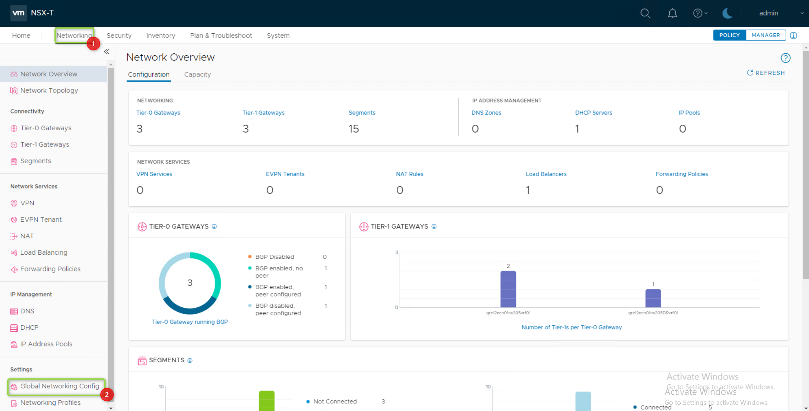
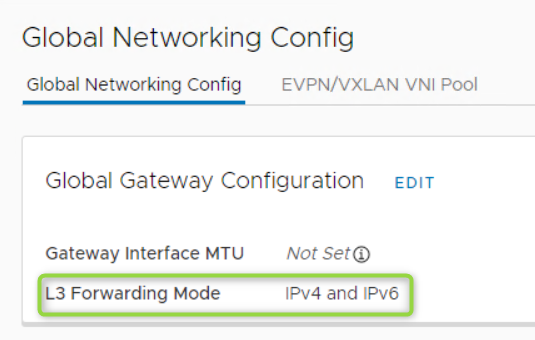
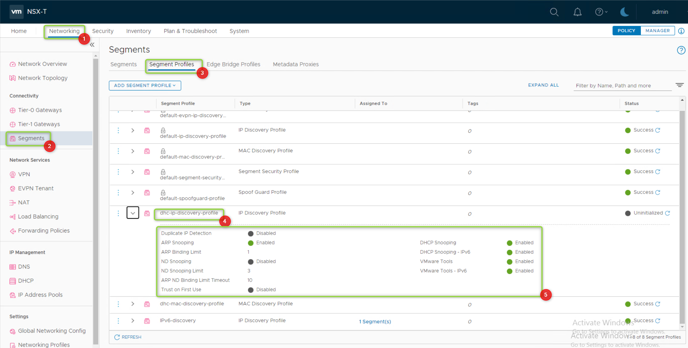
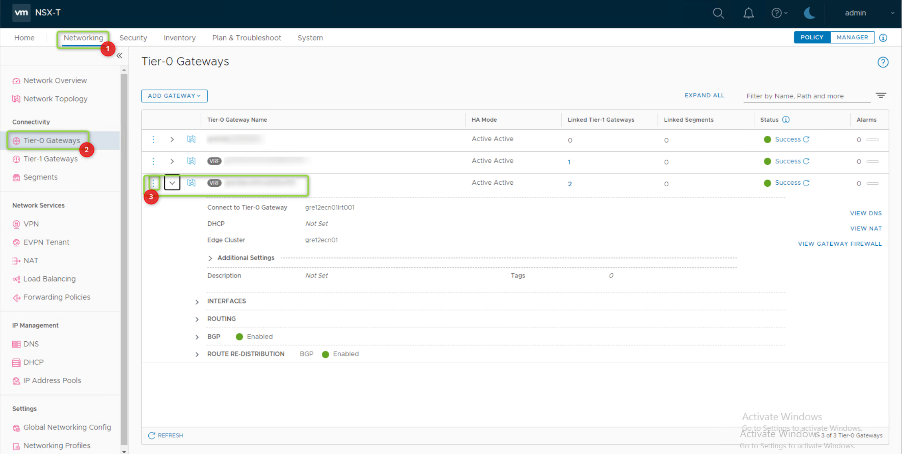
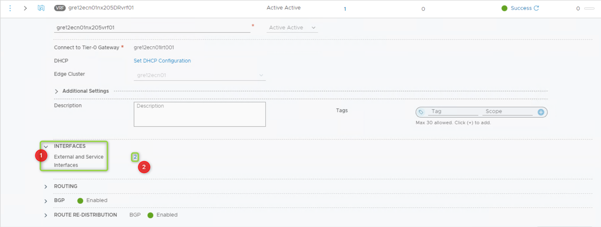
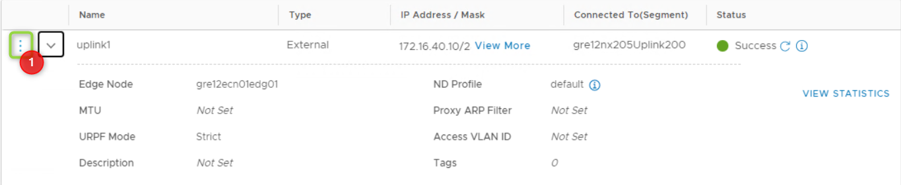
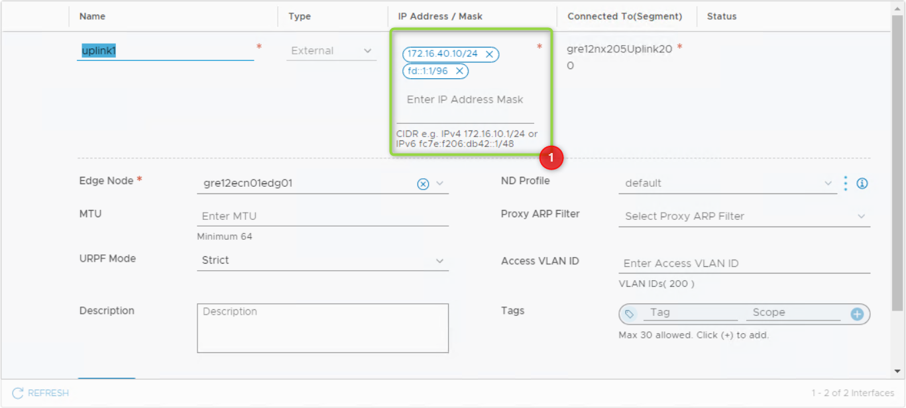
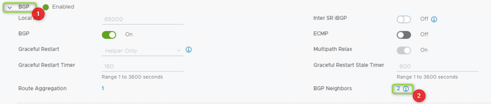
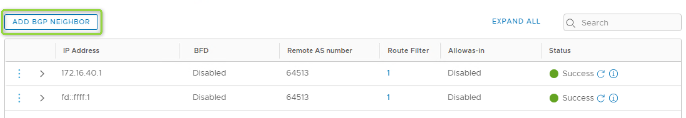
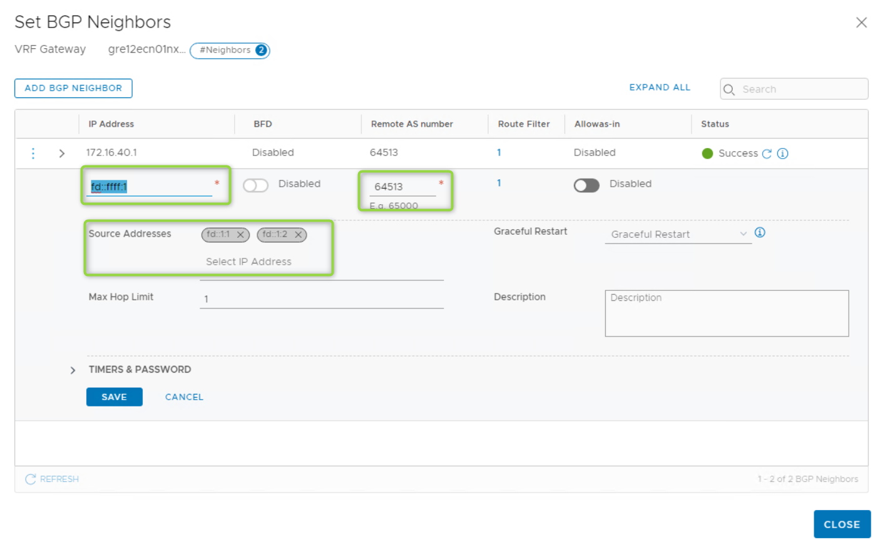

# VCS Add IPv6 BGP Peer

## Table of Contents

- [VCS Add IPv6 BGP Peer](#vcs-add-ipv6-bgp-peer)
  - [Table of Contents](#table-of-contents)
- [Changelog](#changelog)
  - [Introduction](#introduction)
    - [Purpose](#purpose)
    - [Audience](#audience)
    - [Scope](#scope)
- [Create IPv6 BGP Peer](#create-ipv6-bgp-peer)
  - [Enable IPv6 Forwarding Mode](#enable-ipv6-forwarding-mode)
  - [Allow for DHCPv6 Snooping and VMware Tools IPv6](#allow-for-dhcpv6-snooping-and-vmware-tools-ipv6)
  - [Add IPv6 BGP Peer](#add-ipv6-bgp-peer)

# Changelog

| Version | Date       | Description              | Author          |
| ------- | ---------- | ------------------------ | --------------- |
| 0.1 | 05.05.2023 | Draft version creation       | Paweł Żurawski |

## Introduction

### Purpose

Create an IPv6 BGP Peer.

### Audience

- VCS Engineers
- VCS Operations

### Scope

- Create IPv6 BGP Peer

# Create IPv6 BGP Peer

## Enable IPv6 Forwarding Mode

***

1. Login to NSX-T Manager GUI

2. Navigate to **Networking** -> **Global Networking Configuration**

3. EDIT **L3 Forwarding Mode**

4. Change to **IPv4 and IPv6**

5. Save

***

## Allow for DHCPv6 Snooping and VMware Tools IPv6

1. Login to NSX-T Manager GUI

2. Navigate to **Networking** -> **Segments** -> **Segment Profiles**

3. EDIT **dhc-ip-discovery-profile**

4. Change **DHCP Snooping - IPv6** to Enabled

5. Change **VMware Tools - IPv6** to Enabled

6. Save

***

## Add IPv6 BGP Peer

1. Login to NSX-T Manager GUI

2. Navigate to **Networking** -> **Tier-0 Gateways**

3. Edit T0/VRF where BGP neighbour needs to be added

4. Expand **INTERFACES** menu

5. Go to interface number

6. EDIT interface

7. Add IPv6 address, without deleting IPv4 address

8. Repeat for other interfaces

9. Back to T0/VRF router menu

10. Expand **BGP** configuration

11. Go to **BGP Neighbors**

12. **ADD BGP NEIGHBOUR**

13. Provide BGP information

14. Save

