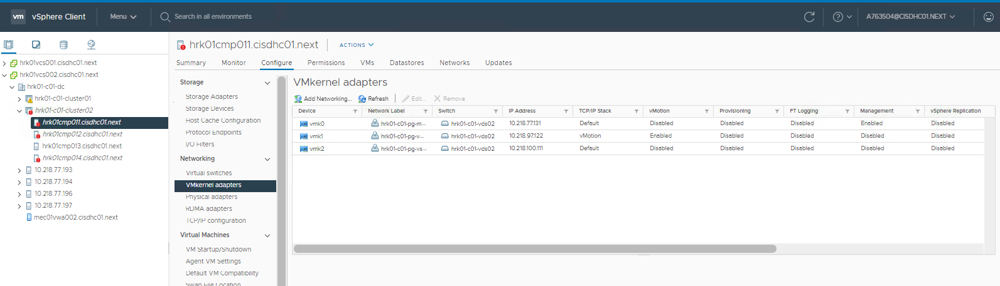
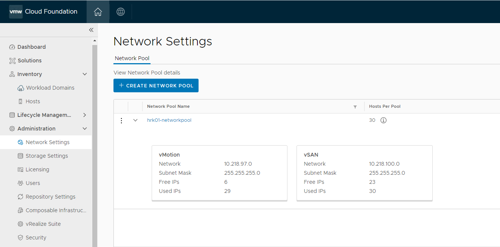
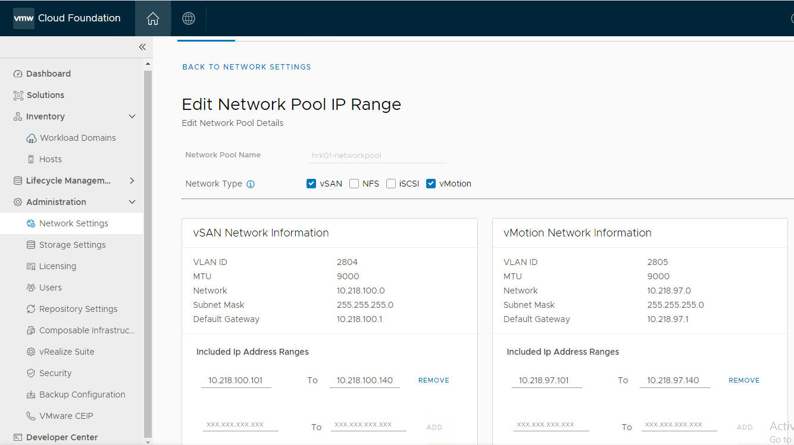
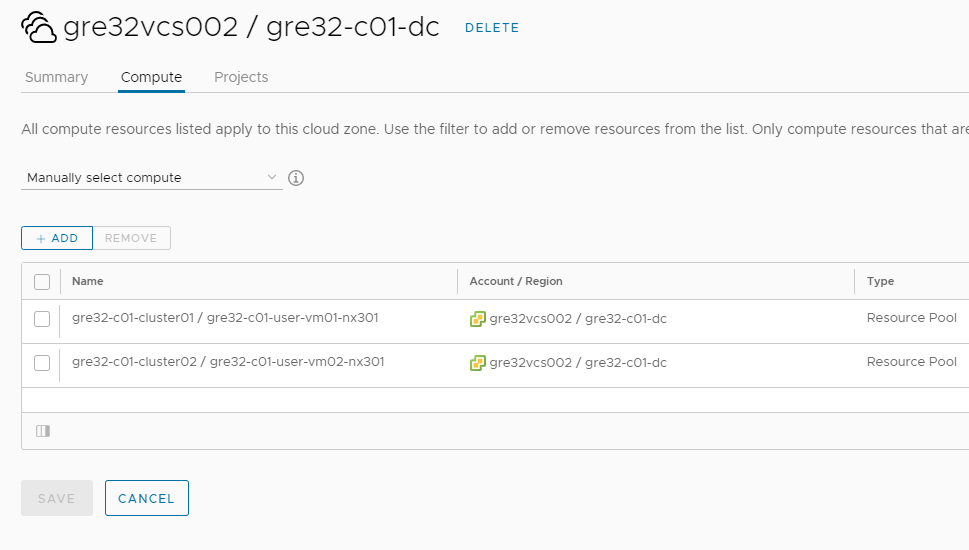
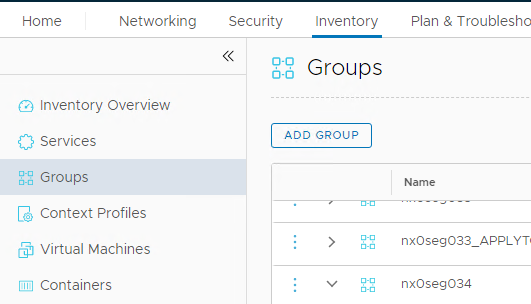
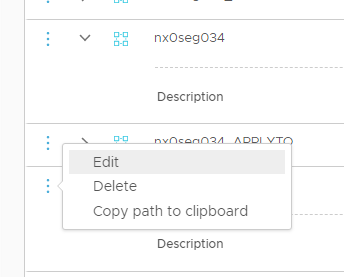

# Add VCF Cluster

# Changelog

| Date       | Issue       | Author            | TOS | Description                                        |
|------------|-------------|-------------------|-----|----------------------------------------------------|
| 21/5/2021  |             | Piotr Lewandowski |     | Initial draft version                              |
| 16/7/2021  | DHC-2284    | Piotr Lewandowski |     | Update for a stretched cluster                     |
| 27/8/2021  | DHC-2794    | Piotr Lewandowski |     | Post-testing update                                |
| 02/09/2021 | DHC-2587    | Shilpa Arote      |     | added custom iops prompt for vSAN storage policies |
| 17/11/2021 | DHC-3416    | Piotr Lewandowski |     | Post-testing updates                               |
| 05/01/2022 | DHC-3718    | Margo Piliukh     |     | Added Pre-implementation Check List section        |
| 01/04/2022 | DHC-4372    | Prajacta Cerejo   |     | Changed Default RAID value to 5                    |
| 08/07/2022 |             | Marcin Gala       |     | Added chapter about license requirements           |
| 14/12/2022 | CESDHC-4949 | Michał Sobieraj   |     | Added new point about EVC Mode                     |

## Introduction

### Purpose

Add a new vSphere cluster to the existing Workload Domain.

### Audience

- VCS operations

### Scope

Creating and adding a new cluster to the existing Workload Domain includes the 3 main areas:

- Commissioning ESXi hosts that will be used as the building blocks of the new cluster in SDDC Manager.
- Creating a new cluster in SDDC Manager
- Enabling the new cluster for a given tenant. Most of the steps are done in vRA Cloud
- Integrating the new cluster with Avamar backup (optional)

The following activities are out of scope as they are currently not supported in VCS:

- Enabling Active-Passive DR functionality for the new cluster

# Related Documents

| Document                                                                     |
|------------------------------------------------------------------------------|
| [VCS Infrastructure LLD](../design/lldInfrastructure.md)                     |
| [VCS Cloud Automation Services LLD](../design/lldCloudAutomationServices.md) |

# Assumptions

There is an assumption that the engineers following this process have an understanding of VMware VCF and vRA Cloud/Cloud Assembly products.  
The assumption is that the ESXi hosts used for forming the new cluster are already prepared and ready to be commissioned.  
All playbooks mentioned in this instruction are located in the *manage* section in the VCS repository.

**DISCLAIMER!** All screenshots are for illustrative purposes only.

# Infrastructure Requirements

Minimum 4 ESXi hosts are required for a RAID-1 vSAN cluster. This applied to both Hybrid and All-Flash option.  
Minimum 5 ESXi hosts are required for RAID-5 SPBM policies.  
All-Flash vSAN nodes are required for enabling Compression and Deduplication.

# Software Requirements

ESXi hosts build number needs to match the current VCF Workload Domain level.

# License Requirements

Before adding new ESXi hosts cluster make sure that VMware licenses with proper capacity are available.

- For vSAN license, separate license needs to be available for newly added clusters. The license needs to cover all the newly added ESXi hosts. Take into consideration that if only one vSAN license was provided for two different clusters, before adding the clusters, the license will need to be split into two new licenses that will cover both ESXi host clusters capacity separately. In case of stretched cluster setup, there should be one license available that covers entire stretched cluster. Separate vSAN licenses for each fault domain are invalid. Please make sure also that in case of stretched cluster vSAN license needs to have stretching functionality included.

**NOTE:** Not having vSAN licenses correctly prepared in front of adding new clusters activity is showstopper. Make sure that correct vSAN licenses with enough capacity are available before adding new cluster to VCF.

- For NSX-T license existing license needs to be merged with the license acquired for newly added cluster. For Workload Domain, NSX-T Manager can be licensed only with single license. The new license capacity should cover all the existing ESXi hosts in all the clusters in workload domain and the ESXi hosts that will be added to the clusters.

**NOTE:** NSX-T license capacity is not enforced and is honour-based. NSX-T license with not enough capacity won't block new ESXi hosts to be added. The newly added ESXi hosts will run NSX-T correctly. However (from VMware licensing perspective), please make sure that correct NSX-T license with enough capacity is available before adding new hosts to the VCF cluster.

- For vSphere license newly added hosts can be licensed using separate licenses

- For vROps licensing newly acquired licensed can be added to vROps license inventory

- For VCF / SDDC Manager licensing newly acquired license can be added to SDDC Manager licence inventory

- For vRealize Network Insight there is one license to cover all the ESXi hosts in both Management and Workload domain. Please make sure that correct vRealize Network Insight license with enough capacity is available before adding new hosts to the VCF cluster.

**NOTE:** Not having vRealize Network Insight license with enough capacity prepared in front of adding ESXi hosts activity is showstopper. Make sure that correct vRealize Network Insight license with enough capacity is available before adding new hosts to VCF cluster.

To merge or split VMware licenses, please contact Global Contract Team at `contract-administration@atos.net`

# Network Requirements

The ESXi hosts need to be located in the same Management network as the vCenter and SDDC Manager. SSH and HTTPS connectivity from the Ansible host to ESXi, vCenter, SDDC Manager, Hashivault and vRA Cloud needs to be available.

In the stretched cluster scenario, additional traffic is required (i.e. ESXi hosts to Witness host). Please refer to the **lldSoftwareDefinedNetworks.md** document for details regarding network requirements.

# Pre-Implementation Check List

In order to ensure a successful addition of a new cluster a number of pre-checks must be performed.

### IP address uniqueness

Make sure the IP addresses for the management (vmk0) interfaces do not overlap with the IP addresses of the existing hosts.

This is a manual check on vCenter level done through GUI by selecting a host and navigating to **Configure** tab -> **Networking** -> **VMkernel adapters**; or using PowerCLI to obtain the vmk0 IP information for each host.



### IP address availability

Check whether the network pool has sufficient number of free IP addresses in order to add new hosts.

Log into SDDC Manager in the environment. Navigate to *Network Settings* under **Administration** section. Check the appropriate network pool for vMotion and vSAN Network Type. Expand the tab for more information. A number of free IP's for each network type will be displayed.



Click on **three dots** before a network pool name and select **Edit Network Pool IP Range** to see the IP address ranges.



### Firmware version appropriateness

Check whether the firmware version of the new hosts matches the firmware of the already present hosts.

This can be done manually by following the VMware KB article - [Determining Network/Storage firmware and driver version in ESXi (1027206)](https://kb.vmware.com/s/article/1027206).

Depending on the vendor, such information might need to be obtained in a different way. Please verify vendor documentation how to check firmware and driver for specific hardware component.

# Procedure

Depending on the cluster DR type, the amount and the order of the steps is different.

**Before starting the below procedure an access token for each Tenant organization must be added to Hashivault.**

To add a token to Hashivault, run the playbook **createVraCloudToken.yml**

**Note: Additional Active-Passive DR clusters are not supported in the current release**

## Step 1 - Commission ESXi hosts

First step of adding a new cluster is to on-board ESXi hosts into SDDC Manager so that they can be consumed by the Workflow creating the cluster.  
Hosts are specified in addVcfHostsVars.yml file located in /home directory of a user that runs the playbook.  
The addVcfHostsVars.yml file should be placed in the user home directory and needs to have a dictionary variable containing information about the name and the octet for all new ESXi hosts.  
Please refer to the example below:

```yaml
esxiHost:
  cmp006:
    name: "gre32cmp008"
    octet: 116
    cidr: "172.22.40"
  cmp007:
    name: "gre32cmp009"
    octet: 117
    cidr: "172.22.40"
```

**NOTE:** In a stretched-cluster case, only the hosts from a primary Availability Zone (AZ1) should be commissioned in this step, as we are creating a standalone cluster first. The hosts will be placed in an appropriate inventory group.

The playbook *addVcfHosts.yml* is commissioning a set of hosts to vCF inventory using SDDC Manager REST API.

The playbook contains 3 main parts:

1. Updating DNS entries for new ESXi hosts and gather appropriate input variables (file addVcfHostsVars.yml and user prompts about ESXi root password)
2. Update the inventory (hosts) and "group_vars/all" files with the new entries for the additional hosts.
3. Commission the new ESXi hosts to SDDC manager

Apart from the username and password required for accessing Hashivault, the *addVcfHosts.yml* playbook requires the following inputs:

| Input/Variable | Description                                                                                                                                                                                                |
|----------------|------------------------------------------------------------------------------------------------------------------------------------------------------------------------------------------------------------|
| esxPass        | Password for the ESXi hosts. It needs to be uniform across all hosts in the addVcfHostsVars.yml file                                                                                                       |
| hostSite       | The Site/Availability Zone for the new hosts. For a Standalone cluster or AZ1 in a Stretched cluster, the value should be set to "primary". For AZ2 in a stretched cluster it should be set to "secondary" |
| hostType       | The ESXi host type - either Compute or Management. Possible values - cmp/mgt. In this case, only "cmp" is a valid value, as we are creating a Compute cluster. It is the default value in the playbook     |

## Step 2 - Create a cluster

Once the ESXi hosts have been successfully commissioned in VCF and are visible as Unassigned in SDDC Manager, the playbook *addVcfCluster.yml* needs to be run in order to form a new cluster using these hosts.
The playbook performs the following actions:

- Creates a new cluster in SDDC Manager based on the input
- rotates passwords of the ESXi hosts belonging to the new cluster
- Adds hosts to the Active Directory domain
- Creates vSAN SPBM policies as defined in the dhc-createSpbmPolicy role

The playbook requires a number of inputs in order to create the cluster according to the requirements.

- Refer work instruction [Create Custom IOPS Limits](./wiCreateCustomIopsLimitsPolicy.md) to prepare and upload custom iops limits values and custom policy names when user wants to continue with custom iops limits.
- Apart from the username and password required for accessing Hashivault, the following inputs are required:

| Input/Variable                    | Description                                                                                                                                                                                                                                                                              |
|-----------------------------------|------------------------------------------------------------------------------------------------------------------------------------------------------------------------------------------------------------------------------------------------------------------------------------------|
| workloadDomainNumber              | At the moment only a single Workload Domain is supported in VCS. This value is set by default to "01"                                                                                                                                                                                    |
| clusterNumber                     | By default it's set to "02" because the first cluster is deployed during the initial build.                                                                                                                                                                                              |
| numberOfHostsForAdditionalCluster | Number of ESXi hosts that will be used to create the cluster. The number needs to match the number of hosts commissioned in the previous step. By default this variable is set to 4.                                                                                                     |
| availabilityZone                  | By default this variable is set to match the locationCode. It ensures that only the unassigned hosts from a given location are taken into account.                                                                                                                                       |
| clusterDrType                     | the type of DR that this cluster will be enabled with. Default is *none*, which is a standalone cluster. The other possible value is *active-active*. **Active-Passive DR Type is not supported in the current release**                                                                 |
| vSANStorageType                   | the type of vSAN storage, which can either be Hybrid (SSD for cache, HDD for capacity) or all-flash (fully based on SSD). Make sure to select the appropriate type based on the hardware specs of the ESXi hosts selected for the cluster. By default this variable is set to all-flash. |
| raidValue                         | RAID value for storage policies (either 1 or 5). This value, together with the vSANStorageType is used or creating SPBM policies in vCenter. By default it's set to 5. RAID-5 policy requires at least 5 ESXi hosts in the cluster.                                                      |
| dedupAndCompression               | A switch to Enable Deduplication and Compression (only for an All-flash cluster). Default value is set to "false" which disables this feature.                                                                                                                                           |
| vmnic1Id                          | The 1st VMnic number that will be used in the distributed switch. By default this is set to 0. It needs to be uniform across all hosts in the cluster                                                                                                                                    |
| vmnic2Id                          | The 2nd VMnic number that will be used in the distributed switch. By default this is set to 1. It needs to be uniform across all hosts in the cluster                                                                                                                                    |
| esxiLicenseKey                    | A valid vSphere license key. By default the value is taken from group vars. **Make sure that it's a valid one before accepting the default value**                                                                                                                                       |
| vsanLicenseKey                    | A valid VSAN license key. By default the value is taken from group vars. **Make sure that it's a valid one before accepting the default value**                                                                                                                                          |
| csvFile                           | A csv file to provide inputs for custom iops limit values and policy names. It will be used to create new additional custom storage policies for the newly created cluster. It's optional                                                                                                |

## Step 3 - Configure a stretched cluster

If a target configuration is a stretched cluster with an Active/Active DR protection, a few additional steps need to be performed in order to enable this functionality. They will be covered in the subsequent sections.

**If the cluster is supposed to be a standalone one (not DR protected), skip the whole step 3.**

### Step 3a - Commission ESXi hosts for the secondary Availability Zone

Repeat the procedure described in Step 1, but make sure to fill in the addVcfHostsVars.yml file using the naming convention for the DR, as in the following example:

```yaml
esxiHost:
  drcmp008:
    name: "gre92cmp006"
    octet: 118
    cidr: "172.22.40"
  drcmp009:
    name: "gre92cmp007"
    octet: 119
    cidr: "172.22.40"
```

When running the addVcfHosts.yml playbook, make sure to select the secondary site for the AZ2 hosts.

### Step 3b - Configure a Witness host

Every stretched cluster requires a dedicated witness host.

Deploy a witness host from the OVA file in the 3rd location. Please refer to the **dhcVsanWitnessAppliance.md** document to get more details about the deployment prerequisites and steps for the witness host.

Once it's deployed, run the playbook configureVsanWitnessCmp.yml to perform the post-deployment configuration.

### Step 3c - Create a stretched cluster

 Stretching a standalone cluster is done using the **createStretchClusterCmpDomain.yml** playbook, which will be expanding the cluster created in step 2 with the unassigned hosts commissioned to the VCF inventory in step 3a. This playbook will perform the following actions:

- expand and stretch the standalone cluster
- configure Availability Zones (create DRS group, rules and dummy VMs)
- modify the existing spbm storage policies to update the **Site disaster tolerance** setting
- rotate the passwords of the new ESXi hosts
- add ESXi hosts to Active Directory domain

The playbook requires a number of inputs in order to stretch the cluster according to the requirements. Apart from the username and password required for accessing Hashivault, the following inputs are required:

| Input/Variable                    | Description                                                                                                                                                                                                       |
|-----------------------------------|-------------------------------------------------------------------------------------------------------------------------------------------------------------------------------------------------------------------|
| workloadDomainNumber              | At the moment only a single Workload Domain is supported in VCS. This value is set by default to "01"                                                                                                             |
| clusterNumber                     | By default it's set to "02" because the first cluster is deployed during the initial build.                                                                                                                       |
| numberOfHostsForAdditionalCluster | Number of ESXi hosts that will part of the 2nd Availability Zone in the stretched cluster. The number needs to match the number of hosts commissioned in the previous step. By default this variable is set to 4. |
| vmnic1IdVar                       | The 1st VMnic number that will be used in the distributed switch. By default this is set to 0. It needs to be uniform across all hosts in the cluster                                                             |
| vmnic2IdVar                       | The 2nd VMnic number that will be used in the distributed switch. By default this is set to 1. It needs to be uniform across all hosts in the cluster                                                             |
| esxiLicenseKeyVar                 | A valid vSphere license key. By default the value is taken from group vars. **Make sure that it's a valid one before accepting the default value**                                                                |
| witnessServer                     | Witness name in format vwa00x. The default value is "vwa003" as it's the next available number after the initial build                                                                                            |

### Step 4d - Enable EVC Mode

Every new cluster needs to have EVC mode enabled.

Choose the newly created cluster and go into the config. From here you choose configuration and go to VMware EVC. Enable mode at level of oldest CPU in the cluster.

## Step 4 - Enable the cluster for a given tenant

Once the new cluster is created it needs to be enabled for either the default tenant (in a single-tenant VCS instance) or multiple tenants. The playbook *addClusterForTenant.yml* is used for enabling the new cluster for a given tenant. It performs the followings actions:

- Create a tenant-dedicated Resource Pool in the vSphere cluster
- Assign tags to the Resource Pool and Cluster in vRA
- Create vRA Storage Profiles in the tenant organization
- Update the blueprint in a given project
- Update the Service Broker form in a given project

The following inputs are used by the playbook:

| Input/Variable       | Description                                                                                                                                                                                                                                                                              |
|----------------------|------------------------------------------------------------------------------------------------------------------------------------------------------------------------------------------------------------------------------------------------------------------------------------------|
| casTenantIdVar       | Tenant organization name - it's used by the playbook to fetch the Access Token of a given tenant organization, create a Resource Pool based on the tenant name and create the Storage Profile for the new cluster                                                                        |
| casCloudAccountName  | Cloud Assembly Account name which represents an vCenter endpoint in vRA Cloud. By default it's vcs002, which is the vcenter in the first Workload Domain                                                                                                                                 |
| casProjectName       | The project name that needs to match the project in a given Tenant organization in order to update the blueprint (Cloud Template) and the Service Broker form with the new cluster                                                                                                       |
| workloadDomainNumber | At the moment only a single Workload Domain is supported in VCS. This value is set by default to "01"                                                                                                                                                                                    |
| clusterNumber        | By default it's set to "02" because the first cluster is deployed during the initial build.                                                                                                                                                                                              |
| vSANStorageType      | This variable is used by the dhc-createStorageProfileCloudAssembly role to map the storage profile with an spbm policy created by the previous playbook. NOTE: Currently multiple storage classes are not supported and this variable is not used                                        |
| raidValue            | RAID value for storage profiles in vRA (either 1 or 5). This value, together with the vSANStorageType is used for mapping Storage profiles with spbm policies created by the previous playbook. NOTE: Currently multiple storage classes are not supported and this variable is not used |
| clusterDrType        | Possible values are *none* and *active-active*. Based on the selection the cluster will be tagged appropriately in vRA as either a non-DR protected or an Active-Active DR protected cluster.                                                                                            |
| csvFile              | Provide same csv file which you used in 'Step 2 - Create a cluster' to maintain consistency of policy names and iops values. It will be mapped with vRA custom storage profiles for newly created cluster.                                                                               |

**NOTE:** Repeat this step for each tenant that will be consuming the new cluster.

## Step 5 - Update the cloud zone

The cloud zone of each tenant needs to be updated to include the new Resource Pool. In order to do that follow below steps:

1. log into the vRA Cloud and switch to the tenant organization for which the cloud zone will be updated.
2. Open Cloud Assembly service and navigate to the Infrastructure tab.
3. Select Cloud Zones in the left pane and open the appropriate Cloud Zone.
4. Within the Cloud Zone go to the Compute tab
5. Make sure that **Manually select compute** option is selected in the drop-down menu and click the **Add** button
6. Select the new Resource Pool from the list and click **Add**

The end result should look like this:



**NOTE:** Repeat the above steps for all tenants that require the new cluster.

## Step 6 - Deploy and Configure KMS - Optional

**NOTE:** This step is optional. It is only to be done if KMS was not deployed during the initial build (vSAN Encryption was not required for the first cluster). This step needs to be done only if vSAN Encryption is required for the additional cluster. If KMS is already deployed and integrated, go directly to step 7.

There are 2 playbooks that need to be run in this order:

1. createCloudlinkKms.yml
2. configureCloudlinkKms.yml

The first playbook performs the following actions:

- Creates KMS service account in AD
- Creates KMS admins resource group in AD
- Adds the *Platform Administators* role group to the new the resource group
- Add DNS A records for the KMS appliances
- Deploys the Cloudlink KMS appliances in the Management cluster

The second playbook performs the following actions:

- Creates API users and adds credentials to Hashivault
- Sets the secadmin password and adds it to Hashivault
- Configures the hostname
- Uploads the license
- Configures the KMS cluster
- Configures KMS backup on SDM001
- Configures VCS NTP and Syslog server address on both appliances
- Configures Windows domain on both appliances
- Implements RBAC and adds KMS AD group
- Adds KMS to vCenter

### License update

Initial Cloudlink (KMS) deployment is using development  license. It needs to be update with the license purchased for the customer deployment.
<p>Follow the steps below to update Cloudlink license.</p>

| Sub-Step |                                                                                                            Action                                                                                                             |                   Screenshot                    |
|:---------|:-----------------------------------------------------------------------------------------------------------------------------------------------------------------------------------------------------------------------------:|:-----------------------------------------------:|
| 1.       | <p> Log into the Cloudlink webGUI on a first cluster node using secadmin account and go to **System>License**. </p> <p> Click **Upload License** and select a new license key file. </p>  License Subscription must be valid. |  |

## Step 7 - Enable vSAN Encryption on the cluster - Optional

**NOTE:** This step is optional. It is only to be done when vSAN Encryption is required for the additional cluster.

| Sub-Step |                                                                                                                                                                                                                                                                      Action                                                                                                                                                                                                                                                                      |
|:---------|:------------------------------------------------------------------------------------------------------------------------------------------------------------------------------------------------------------------------------------------------------------------------------------------------------------------------------------------------------------------------------------------------------------------------------------------------------------------------------------------------------------------------------------------------:|
| 1.       |                                                                                                                                                                                                              As encryption is CPU intensive AES-NI needs to be enabled in BIOS of a vSAN nodes.Verify that this is already enabled.                                                                                                                                                                                                              |
| 2.       |                                                                                                                                                                                         Log on to the vCenter server and select the new CMP cluster. Next click `Configure`. Under `vSAN`, select `Services` </br> Click the `Encryption` `Edit` button.                                                                                                                                                                                         |
| 3.       | On the vSAN Services window select the Encryption. Select created KMS cluster <br> **Do not select** *Wipe residual data* and *Allow Reduced Redundancy*</br>Click `Apply` to enable encryption.<br>**Note:** If you have less than 30% free space on VSAN datastore then you can select *Allow Reduced Redundancy* option. This option keeps the VMs running, but the VMs might be unable to accept the full number of failures defined in the VM storage policy.  As a result, the virtual machine will be in risk of single point of failure. |
| 4.       |                                                                                                                                                                                                                    Make sure that encryption is finished successfully. Overall Progress can be monitored in Monitor > tasks.                                                                                                                                                                                                                     |

## Step 8 - Integrate with Avamar

If the Avamar is already used by VCS instance new cluster can be integrated with Avamar backup solution.  The playbook *addAvamarProxy.yml* is used to integrate new cluster with existing Avamar instance. It performs the followings actions:

- Creates DNS records for Avamar proxy
- Deploys, configures and registers CMP Proxy on a new cluster

The following inputs are used by the playbook:

| Input/Variable           | Description                                                                                       |
|--------------------------|---------------------------------------------------------------------------------------------------|
| avamarPassword           | MCUser password for Avamar Server                                                                 |
| avamarProxyClusterNumber | Two digit CMP cluster number on which Avamar proxy needs to be deployed. For example '02'         |
| avamarProxyHostNumber    | Two digit CMP host number on which Avamar proxy needs to be deployed. For example '09'            |
| avamarProxyName          | Short name of Avamar proxy to be deployed for a new cluster.For example '< location code >avp002' |
| avamarProxyLastOctet     | Last octet of a Avamar proxy to be deployed for a new cluster.                                    |

Before integration can be started Avamar firewall rules needs to be implemented on the physical firewall. All ports that are needed for Avamar are described in [Software Defined Networks LLD](../design/lldSoftwareDefinedNetworks.md#ruleset-for-physical-firewall).

It is recommended to deploy one Avamar proxy per 50 VMs. This playbook should be used to deploy sufficient number of Avamar proxies depending on the amount of customer VMs added to backup.

As Avamar is using tags to assign backup policy each VM needs to be tagged with proper tag corresponding with the selected backup policy. This needs to be done manually for any existing VM running on a new cluster.

## Step 9 - Run Compliance Check and Remediation

In order to make sure that the new hosts are compliant with the security policy, run **manageESXiCompliance.yml** playbook, also described in **wiHardening.md** document.
**NOTE:** This step is necessary for allowing the ESXi hosts to send their syslog to Log Insight using SSL.

Description:
This playbook remediates the vulnerabilities which are found on the ESXi servers. These vulnerabilities are identified by their TSS measure ids. The playbook and its supporting role is an evolving piece of work and newer measure ids would be added to the playbook as and when found. Please refer to the role's README file at the path - "manage/roles/dhc-manageESXiCompliance/README.md" for the list of measure ids that are getting remediated.

Requirements:
The playbook requires the user to provide the target ESXi host names as extra vars during runtime (while executing the playbook).

Execute:
ansible-playbook manageESXiCompliance.yml -e "HOSTS=locXXmgt003,locXXcmp003,locXXcmp005"
  
## Step 10 - Add hosts to the DFW security group
  
The hosts forming a new cluster need to be able to send their logs to vRealize Log Insight. To make it possible, the Syslog security group in NSX-T needs to be updated with the new IP addresses.

| Sub-Step |                                                                     Action                                                                      |                  Screenshot                   |
|:---------|:-----------------------------------------------------------------------------------------------------------------------------------------------:|:---------------------------------------------:|
| 1.       |                       Log in to the NSX-T Manager, go to the Inventory tab, then navigate to the Groups in the left pane                        |  |
| 2.       |                            Locate the desired security group on the list, click the 3 vertical dots and select Edit.                            |  |
| 3.       |                                                 In the Compute Members column click on the IPs                                                  |  |
| 4.       | Click on the IP Addresses tab and enter the management IP addresses of the ESXi hosts that were added to the Workload Domain. Then click Apply. |  |
