# Additional Workload Domain

- [Additional Workload Domain](#additional-workload-domain)
- [Changelog](#changelog)
  - [Introduction](#introduction)
    - [Purpose](#purpose)
    - [Audience](#audience)
    - [Scope](#scope)
- [Related Documents](#related-documents)
- [Assumptions](#assumptions)
- [Infrastructure Requirements](#infrastructure-requirements)
- [Software Requirements](#software-requirements)
- [License Requirements](#license-requirements)
- [Network Requirements](#network-requirements)
- [1 Pre Implementation Check List](#1-pre-implementation-check-list)
  - [1.1 IP address uniqueness](#11-ip-address-uniqueness)
  - [1.2 IP address availability](#12-ip-address-availability)
  - [1.3 Firmware version appropriateness](#13-firmware-version-appropriateness)
  - [1.4 Input Data File](#14-input-data-file)
  - [1.5 PreCommission ESXi hosts Checklist](#15-precommission-esxi-hosts-checklist)
  - [2 Build Steps](#2-build-steps)
    - [2.1 Commission Esxi hosts](#21-commission-esxi-hosts)
    - [2.2 Adding licenses for additional workload domain](#22-adding-licenses-for-additional-workload-domain)
    - [2.3 Creation of additional workload domain](#23-creation-of-additional-workload-domain)
    - [2.4 Create workload domain compute resources](#24-create-workload-domain-compute-resources)
    - [2.5 Update ESXi castore with the RCA and ICA certificate chain for new hosts](#25-update-esxi-castore-with-the-rca-and-ica-certificate-chain-for-new-hosts)
    - [2.6 Integrate Additional workloaddomain with vRops](#26-integrate-additional-workloaddomain-with-vrops)
    - [2.7 Manage vcf Certificates for additional wld](#27-manage-vcf-certificates-for-additional-wld)
    - [2.8 Configure vCenter join to AD additional cmp vCenters](#28-configure-vcenter-join-to-ad-additional-cmp-vcenters)
    - [2.9 Configure vCenter RBAC](#29-configure-vcenter-rbac)
    - [2.10 Enable and integrate Identity manager in additional workload domain NSX-T manager](#210-enable-and-integrate-identity-manager-in-additional-workload-domain-nsx-t-manager)
    - [2.11 Integrate Additional workloaddomain with Loginsight](#211-integrate-additional-workloaddomain-with-loginsight)
    - [2.12 Integrate Additional workloaddomain with NetworkInsight](#212-integrate-additional-workloaddomain-with-networkinsight)
    - [2.13 Create vSAN storage polices for additional workload domain vcenter](#213-create-vsan-storage-polices-for-additional-workload-domain-vcenter)
  - [3 Optional Tasks](#3-optional-tasks)
    - [3.1 Integrate with Avamar](#31-integrate-with-avamar)
    - [3.2 Atos Global Images import to CL for additional workload vcenter](#32-atos-global-images-import-to-cl-for-additional-workload-vcenter)
    - [3.3 Remove vmnic adapter from vm present in additional wld vcenter](#33-remove-vmnic-adapter-from-vm-present-in-additional-wld-vcenter)
    - [3.4 Remove snapshot created by playbook removeVmNicAdditionalWld in additional wld vcenter](#34-remove-snapshot-created-by-playbook-removevmnicadditionalwld-in-additional-wld-vcenter)
    - [3.5 Create Customer Service Account](#35-create-customer-service-account)
  - [4 Hardening for Additional Workload Domain](#4-hardening-for-additional-workload-domain)
    - [4.1 NSX-T](#41-nsx-t)
      - [4.1.1 To disable local audit account](#411-to-disable-local-audit-account)
    - [4.1.2 To apply remediation against non-compliant measures](#412-to-apply-remediation-against-non-compliant-measures)
    - [4.1.3 To configure backup](#413-to-configure-backup)
    - [4.1.4 To perform password rotation](#414-to-perform-password-rotation)
      - [4.1.5 Create Microsegmentation for additional workload domain components](#415-create-microsegmentation-for-additional-workload-domain-components)
      - [4.1.6 DFW rules for Additional Workload Domain SDN Edges](#416-dfw-rules-for-additional-workload-domain-sdn-edges)
    - [4.1.7 To disable TLS 1.1 on Parent and Child NSX-T](#417-to-disable-tls-11-on-parent-and-child-nsx-t)
  - [4.2 vCenter and ESXi](#42-vcenter-and-esxi)
    - [4.2.1 To add ESXi Host to Domain](#421-to-add-esxi-host-to-domain)
    - [4.2.2 Apply Security measures on vCenter and ESXi](#422-apply-security-measures-on-vcenter-and-esxi)
    - [4.2.3 To set password expiration on vCenter](#423-to-set-password-expiration-on-vcenter)
    - [4.2.4 To configure backup](#424-to-configure-backup)
    - [4.2.5 To perform password rotation](#425-to-perform-password-rotation)
  
# Changelog

| Date       | TOS     | Issue       | Author                | Description                                                     |
|------------|---------|-------------|-----------------------|-----------------------------------------------------------------|
| 20/03/2022 | VCS 1.7 | CESDHC-6348 | Aamod Aithal K B      | Work Instruction for Additional WLD deployment                  |
| 27/03/2022 | VCS 1.7 | CESDHC-6744 | Kathirvel Krishnasamy | Add hardening section in WI                                     |
| 29/03/2022 | VCS 1.7 | CESDHC-6702 | Bhalchandra Gavhane   | Update DFW rules for Additional Workload Domain SDN Edges in WI |

## Introduction

### Purpose

Add an additional workload domain.

### Audience

- VCS Operations

### Scope

Creation of additional workload domain includes following following areas:

- Commissioning ESXi hosts that will be used as the building blocks of the additional workload domain in SDDC Manager.
- Creation of additional workload domain in SDDC Manager.
- Performing all the required configurations for additional workload domain at the vcenter level like creation of resourcepool,content library etc.
- Integrating the additional workload domain with vROps,vRLI and vRNI.
- Integrating the new cluster with Avamar backup (optional)
- performing hardening for additional workload domain components.

The following activities are out of scope as they are currently not supported in VCS:

- Enabling Active-Passive DR functionality for the new cluster

# Related Documents

| Document                                                                    |
|-----------------------------------------------------------------------------|
| [VCS Infrastructure LLD](../design/lldInfrastructure.md)                    |
| [VCS Hardening](wiHardening.md)                                             |
| [Storage Classes IOPS Limits LLD](../design/lldStorageClassesIOPSLimits.md) |
| [Backup LLD](../design/lldBackup.md)                                        |
| [Naming Convention](../design/namingConvention.md)                          |
| [Software Defined Networks LLD](../design/lldSoftwareDefinedNetworks.md)    |

# Assumptions

There is an assumption that the engineers following this process have an understanding of VMware VCF and standard VCS.  
The assumption is that the ESXi hosts used for forming the additional workload domain are already prepared and ready to be commissioned.  
All playbooks mentioned in this document are located in the *manage* folder in the GIT repository.

**DISCLAIMER!** All screenshots are for illustrative purposes only.

**DISCLAIMER! Due to a lack of hardware resources, we have used only 3 ESXi hosts for the creation of additional workload domain. But it is strictly advised to have at least 4 Esxi hosts as part of the additional workload domain.**

# Infrastructure Requirements

Minimum 4 ESXi hosts are required for a RAID-1 vSAN cluster. This applied to both Hybrid and All-Flash option.  
Minimum 5 ESXi hosts are required for RAID-5 SPBM policies.  
All-Flash vSAN nodes are required for enabling Compression and Deduplication.

# Software Requirements

ESXi hosts build number needs to match the current VCF Workload Domain level.

# License Requirements

Before adding new ESXi hosts cluster make sure that VMware licenses with proper capacity are available.

- For vSAN license, separate license needs to be available for newly added clusters. The license needs to cover all the newly added ESXi hosts. Take into consideration that if only one vSAN license was provided for two different clusters, before adding the clusters, the license will need to be split into two new licenses that will cover both ESXi host clusters capacity separately. In case of stretched cluster setup, there should be one license available that covers entire stretched cluster. Separate vSAN licenses for each fault domain are invalid. Please make sure also that in case of stretched cluster vSAN license needs to have stretching functionality included.

**NOTE:** Not having vSAN licenses correctly prepared in front of adding new clusters activity is showstopper. Make sure that correct vSAN licenses with enough capacity are available before adding new cluster to VCF.

- For NSX-T license existing license needs to be merged with the license acquired for newly added cluster. For Workload Domain, NSX-T Manager can be licensed only with single license. The new license capacity should cover all the existing ESXi hosts in all the clusters in workload domain and the ESXi hosts that will be added to the clusters.

**NOTE:** NSX-T license capacity is not enforced and is honour-based. NSX-T license with not enough capacity won't block new ESXi hosts to be added. The newly added ESXi hosts will run NSX-T correctly. However (from VMware licensing perspective), please make sure that correct NSX-T license with enough capacity is available before adding new hosts to the VCF cluster.

- For vSphere license newly added hosts can be licensed using separate licenses

- For vROps licensing newly aquired licensed can be added to vROps license inventory

- For VCF / SDDC Manager licensing newly aquired license can be added to SDDC Manager licence inventory

- For vRealize Network Insight there is one license to cover all the ESXi hosts in both Management and Workload domain. Please make sure that correct vRealize Network Insight license with enough capacity is available before adding new hosts to the VCF cluster.

**NOTE:** Not having vRealize Network Insight license with enough capacity prepared in front of adding ESXi hosts activity is showstopper. Make sure that correct vRealize Network Insight license with enough capacity is available before adding new hosts to VCF cluster.

To merge or split VMware licenses, please contact Global Contract Team at `contract-administration@atos.net`

# Network Requirements

The ESXi hosts need to be located in the same Management network as the vCenter and SDDC Manager. SSH and HTTPS connectivity from the Ansible host to ESXi, vCenter, SDDC Manager and Hashivault needs to be available.

In the stretched cluster scenario, additional traffic is required (i.e. ESXi hosts to Witness host). Please refer to the **lldSoftwareDefinedNetworks.md** document for details regarding network requirements.

# 1 Pre Implementation Check List

In order to ensure a successful addition of a new cluster a number of pre-checks must be performed.

## 1.1 IP address uniqueness

Make sure the IP addresses for the management (vmk0) interfaces do not overlap with the IP addresses of the existing hosts.

This is a manual check on vCenter level done through GUI by selecting a host and navigating to **Configure** tab -> **Networking** -> **VMkernel adapters**; or using PowerCLI to obtain the vmk0 IP information for each host.

   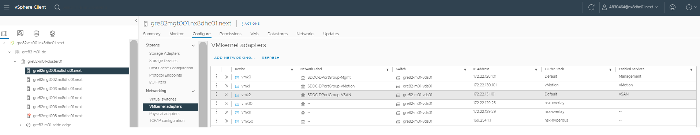

## 1.2 IP address availability

Check whether the network pool has sufficient number of free IP addresses in order to add new hosts.

Log into SDDC Manager in the environment. Navigate to *Network Settings* under **Administration** section. Check the appropriate newtork pool for vMotion and vSAN Network Type. Expand the tab for more information. A number of free IP's for each network type will be displayed.

   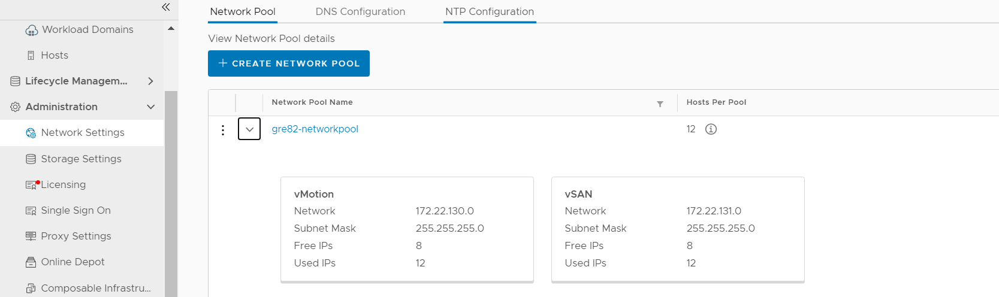

Click on **three dots** before a network pool name and select **Edit Network Pool IP Range** to see the IP address ranges.

   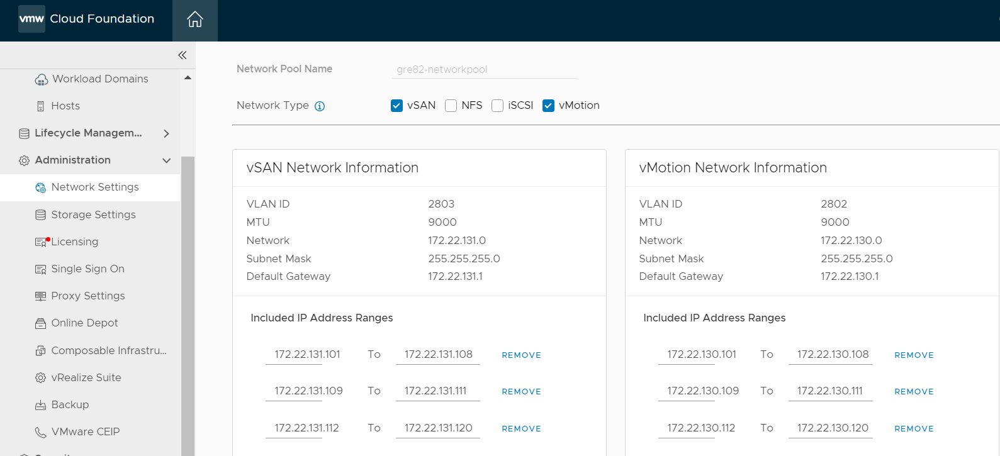

## 1.3 Firmware version appropriateness

Check whether the firmware version of the new hosts matches the firmware of the already present hosts.

This can be done manually by following the VMware KB article - [Determining Network/Storage firmware and driver version in ESXi (1027206)](https://kb.vmware.com/s/article/1027206).

Depending on the vendor, such information might need to be obtained in a different way. Please verify vendor documentation how to check firmware and driver for specific hardware component.

## 1.4 Input Data File

The `additionalWld-builder.yml` playbooks relies on input data file *$HOME/customAdditionalWorkloadInfraVars.yml* located in your home directory.

Next, the input file have to be **filled out manually**.

> Note: Please make sure that the `namespacesubnetprefix` and the subnet value in `podcidr` should be different.

| Parameter name                                  | Example as in NX8 infra | Description                                                                                       |
|-------------------------------------------------|-------------------------|---------------------------------------------------------------------------------------------------|
| `workloadDomainNumber`                          | 2                       | Ordinal number of workload Domain in the existing VCS environment                                 |
| `clusterNumber`                                 | 1                       | Ordinal number of cluster in the additional workload domain                                       |
| `availabilityZone`                              | gre82                   | Location code of VCS environment where we are going to have additional workload domain            |
| `numberOfComputeHostsInAdditonalWorkloadDomain` | 3                       | Number of ESXi hosts that are going to assigned to additional workload domain                     |
| `vmnic1Id`                                      | 1                       | First virtual switch of ESXi host that is going to get added in additional workload domain        |
| `vmnic2Id`                                      | 2                       | Second virtual switch of ESXi host that is going to get added in additional workload domain       |
| `additionalWorkladVcenter.name`                 | gre82vcs003             | vcenter server name of additional workload domain                                                 |
| `additionalWorkladVcenter.octet`                | 70                      | last ocet for additional workload domain vcenter                                                  |
| `additionalWorkladVcenter.cidr`                 | 172.22.128              | CIDR for  additional workload domain vcenter                                                      |
| `nsxtSpec.name`                                 | gre82nsx003             | NSX-T manager server  for additional workload domain                                              |
| `nsxtSpec.octet`                                | 71                      | last ocet for additional workload domain NSX-T manager                                            |
| `nsxtSpec.cidr`                                 | 172.22.128              | CIDR for additional workload domain NSX-T manager                                                 |
| `nsxtNodes.controller01.name`                   | gre82ctl021             | NSX-T controller node 1  server for additional workload domain                                    |
| `nsxtNodes.controller01.octet`                  | 66                      | Last octet for NSX-T controller node 1 server                                                     |
| `nsxtNodes.controller01.cidr`                   | 172.22.128              | CIDR for NSX-T controller node 1 server                                                           |
| `nsxtNodes.controller02.name`                   | gre82ctl022             | NSX-T controller node 2  server for additional workload domain                                    |
| `nsxtNodes.controller02.octet`                  | 67                      | Last octet for NSX-T controller node 2 server                                                     |
| `nsxtNodes.controller02.cidr`                   | 172.22.128              | CIDR for NSX-T controller node 2 server                                                           |
| `nsxtNodes.controller03.name`                   | gre82ctl023             | NSX-T controller node 3  server for additional workload domain                                    |
| `nsxtNodes.controller03.octet`                  | 68                      | Last octet for NSX-T controller node 2 server                                                     |
| `nsxtNodes.controller03.cidr`                   | 172.22.128              | CIDR for NSX-T controller node 3 server's IP                                                      |
| `esxiHost.cmp101.name`                          | gre82cmp101             | First esxi host that will be assigned for additional workload domain that we are going to create  |
| `esxiHost.cmp101.octet`                         | 118                     | Last octet for first ESXi host                                                                    |
| `esxiHost.cmp101.cidr`                          | 172.22.128              | CIDR for first ESXi host                                                                          |
| `esxiHost.cmp102.name`                          | gre82cmp102             | Second esxi host that will be assigned for additional workload domain that we are going to create |
| `esxiHost.cmp102.octet`                         | 119                     | Last octet for second ESXi host                                                                   |
| `esxiHost.cmp102.cidr`                          | 172.22.128              | CIDR for Second ESXi host                                                                         |
| `esxiHost.cmp103.name`                          | gre82cmp103             | Third esxi host that will be assigned for additional workload domain that we are going to create  |
| `esxiHost.cmp103.octet`                         | 120                     | Last octet for Third ESXi host                                                                    |
| `esxiHost.cmp103.cidr`                          | 172.22.128              | CIDR for third ESXi host                                                                          |
| `esxiHost.cmp104.name`                          | gre82cmp104             | fourth esxi host that will be assigned for additional workload domain that we are going to create |
| `esxiHost.cmp104.octet`                         | 121                     | Last octet for fourth ESXi host                                                                   |
| `esxiHost.cmp104.cidr`                          | 172.22.128              | CIDR for fourth ESXi host                                                                         |

Hosts are specified in `customAdditionalWorkloadInfraVars.yml` file located in /home directory of a user that runs the playbook.  
The  `customAdditionalWorkloadInfraVars.yml` file should be placed in the user home directory and needs to have a dictionary variable containing information about the name and the octet for all new ESXi hosts,vcenter,NSX-T manager and edge nodes that are going to be part of additional workload domain.

Below is the sample input file for *$HOME/customAdditionalWorkloadInfraVars.yml*:

```yaml
customAdditionalWorkloadInfraVars:

  additionalWorkloadDomain:
    workloadDomainNumber: "02"
    clusterNumber: "01"
    availabilityZone: "gre82"
    numberOfComputeHostsInAdditonalWorkloadDomain: 3
    vmnic1Id: "1"
    vmnic2Id: "2"

  additionalWorkladVcenter:
    name: "gre82vcs003"
    octet: 70
    cidr: "172.22.128"
    
  nsxtSpec:
    name: "gre82nsx003"
    octet: 71
    cidr: "172.22.128"

nsxtNodes:
  controller01:
    name: "gre82ctl021"
    octet: 66
    cidr: "172.22.128"
  controller02:
    name: "gre82ctl022"
    octet: 67
    cidr: "172.22.128"
  controller03:
    name: "gre82ctl023"
    octet: 68
    cidr: "172.22.128"
  
    
esxiHost:
  cmp101:
    name: "gre82cmp101"
    octet: 118
    cidr: "172.22.128"
  cmp102:
    name: "gre82cmp102"
    octet: 119
    cidr: "172.22.128"
  cmp103:
    name: "gre82cmp103"
    octet: 120
    cidr: "172.22.128"
  cmp104:
    name: "gre82cmp104"
    octet: 121
    cidr: "172.22.128"
```

## 1.5 PreCommission ESXi hosts Checklist

1. Make sure NTP service and SSH is started and running for all the esxi hosts that are going to to get commissioned.
2. Add Hostname and FQDN for each ESXi hosts.
3. Regenerate the self signed certificate for all the ESXi hosts as per <https://docs.vmware.com/en/VMware-Cloud-Foundation/4.3/vcf-deploy/GUID-20A4FD73-EB40-403A-99FF-DAD9E8F9E456.html>
4. Starting with VCF 4.4 SSH services might get stopped automatically as per VMware KB article <https://kb.vmware.com/s/article/86230>

## 2 Build Steps

### 2.1 Commission Esxi hosts

First step of adding a new host to the additional workload is to on-board ESXi hosts into SDDC Manager so that it can be consumed by the VCF workflow.
Hosts are specified in *customAdditionalWorkloadInfraVars.yml* file located in /home directory of a user that runs the playbook.

The customAdditionalWorkloadInfraVars.yml file should be placed in the user home directory and needs to have a dictionary variable containing information about the name and the octet for all new ESXi hosts.

NOTE: Stretched cluster for additional workload domain is not developed yet

The playbook *additionalWldAddVcfHosts.yml* is commissioning a set of hosts to vCF inventory using SDDC Manager REST API.

The playbook contains 3 main parts:

1. Updating DNS entries for new ESXi hosts and gather appropriate input variables (file customAdditionalWorkloadInfraVars.yml and user prompts about ESXi root password)
2. Update the inventory (hosts) and "group_vars/all" files with the new entries for the additional hosts.
3. Commission the new ESXi hosts to SDDC manager

Apart from the `username` and `password` required for accessing Hashivault, the *additionalWldAddVcfHosts.yml* playbook requires the following inputs:

| Input/Variable | Description                                                                                                                                                                                            |
|----------------|--------------------------------------------------------------------------------------------------------------------------------------------------------------------------------------------------------|
| `esxPass`      | Password for the ESXi hosts. It needs to be uniform across all hosts in the `customAdditionalWorkloadInfraVars.yml` file                                                                               |
| `hostSite`     | The Site/Availability Zone for the new hosts.                                                                                                                                                          |
| `hostType`     | The ESXi host type - either Compute or Management. Possible values - cmp/mgt. In this case, only "cmp" is a valid value, as we are creating a Compute cluster. It is the default value in the playbook |

Run the below playbook to commission esxi hosts to SDDC manager.

   ```shell
   ansible-playbook additionalWldAddVcfHosts.yml
   ```

**Validate:**

Log in to `SDDC Manager UI`-->`Inventory`-->`Hosts`-->`Unassigned Hosts`.You'll be able to see that all of the ESXi hosts that were specified in the input file have been commissioned by the SDDC manager and are listed under `Unassigned Hosts`.

   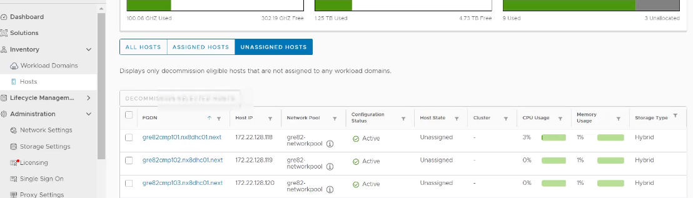

### 2.2 Adding licenses for additional workload domain

This playbook will add  NSX-T manager licenses , VMware vCenter server license, and VMware VSAN license for additional workload domain components like vCenter and NSX-T manager in SDDC manager.

Below playbook requires only `username` and `password` for accessing Hashivault.

   ```shell
   ansible-playbook addAdditionalLicenses.yml
   ```

### 2.3 Creation of additional workload domain

This playbook assists in the creation of a new workload domain based on the user's inputs and will assign the unassigned ESXi hosts to the new workload domain.

Additionally, it executes the deployment for additional workload domain components like vCenter, NSX-T manager, and NSX-T controllers in the newly constructed workload domain and adds DNS entries for them.

Apart from the `username` and `password` required for accessing Hashivault, the *createAdditionalVcfWorkloadDomain.yml* playbook requires the following inputs:

| Input/Variable        | Description                                                                                                              |
|-----------------------|--------------------------------------------------------------------------------------------------------------------------|
| `esxPass`             | Password for the ESXi hosts. It needs to be uniform across all hosts in the `customAdditionalWorkloadInfraVars.yml` file |
| `vcenterRootPassword` | Password for the additional workload domain vCenter.                                                                     |
| `nsxtPassword`        | Password for the additional workload domain NSX-T components.                                                            |

   ```shell
   ansible-playbook createAdditionalVcfWorkloadDomain.yml
   ```

**Validate:**

Log in to `SDDC Manager UI`-->`Inventory`-->`Workload Domains`.The unassigned hosts that were commissioned in step 1 will be assigned to the newly formed workload domain with the name `< customerCode > - < locationCode > -c< workloadDomainNumber >`.

   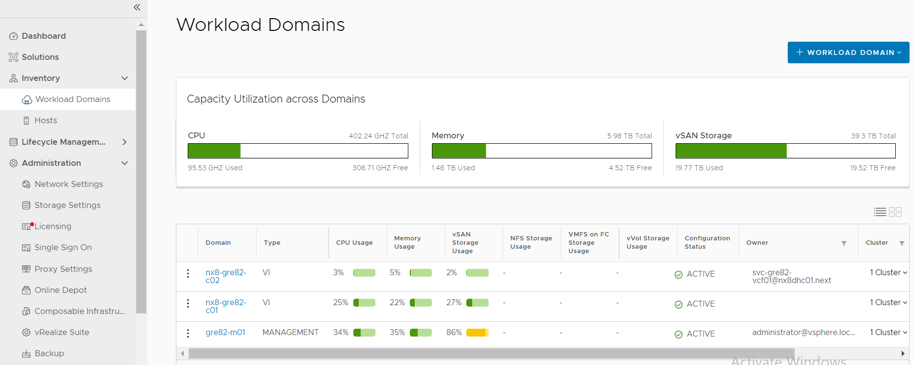

   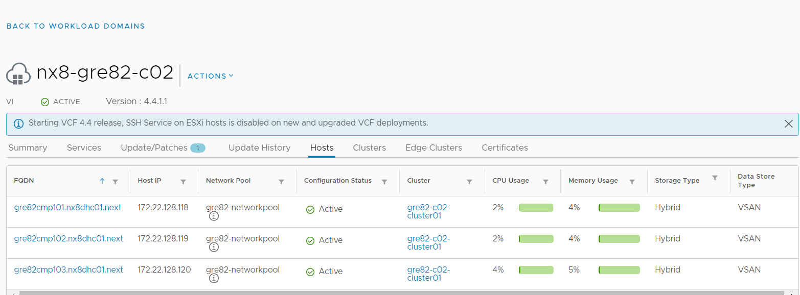

### 2.4 Create workload domain compute resources

This playbook mainly performs the below 3 tasks  

1. Creates resource pools for an additional workload domain in vCenter.  

2. Creates folders in the vCenter under the additional workload domain compute cluster.  

3. creates a content library in the vCenter for an additional workload domain.

   ```shell
   ansible-playbook createAdditionalWorkloadDomainResources.yml
   ```

**Validate:**

Log in to `vcenter`-->`Menu`-->`Content Library`. You will notice that a new content library has been created for an additional workload domain vCenter.  

   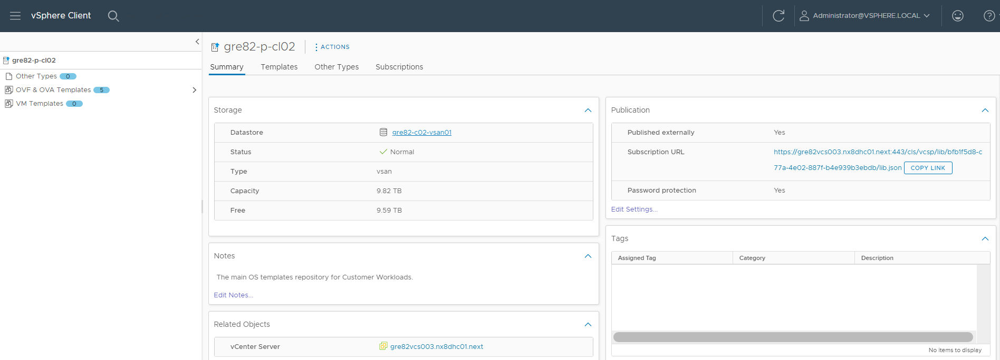  
  
Log in to `vcenter`-->`Menu`-->`Inventory`-->Go to the vcenter of additional workload domain. You will notice resource pools were created for additional workload domain.  

   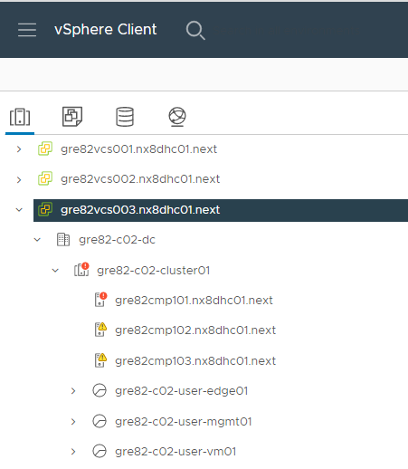  

Additionally, you could see the compute cluster's folders for additional workload domain.

   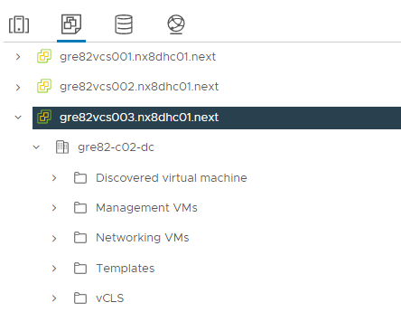

### 2.5 Update ESXi castore with the RCA and ICA certificate chain for new hosts

This `updateESXiCastoreAdditionalWld.yml` playbook should be run after the creation of workload domain because in vcf 4.5 SSH is disabled by default.

This playbook updates the ESXi castore.pem with the RCA and ICA certificate chain for newly added hosts in the additional workload domain.

   ```shell
   ansible-playbook updateESXiCastoreAdditionalWld.yml
   ```

### 2.6 Integrate Additional workloaddomain with vRops

For the purpose of capturing alerts, this playbook builds adapters for additional workload domain components like vCenter and NSX-T manager. It also adds the user credentials for these components to vRops.

   ```shell
   ansible-playbook enableVropsForAdditionalWorkloadDomain.yml
   ```

**Validate:**

Log in to `SDDC Manager UI`-->`vRealize Suite`-->`vRealize Operations`-->You could see additional workload domain is integrated with vrops.

   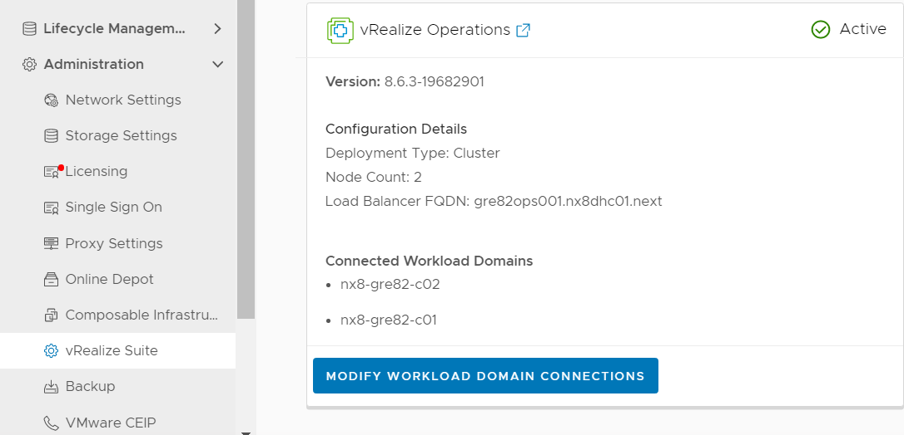

### 2.7 Manage vcf Certificates for additional wld

This playbook will generate CSR certificates for vcenter,NSX-T manager and other NSX-T edge components of additional workload domain.

   ```shell
   ansible-playbook manageAdditionalWldVcfCertificates.yml
   ```

**Validate:**

Log in to `SDDC Manager UI`-->`Inventory`-->`Workload Domains`-->`< customerCode > - < locationCode > -c< workloadDomainNumber >`-->`certificates`.You should now be able to see that the ICA server is the certificate's provider and certificate installation is successful on vcenter and NSX-T manager.

   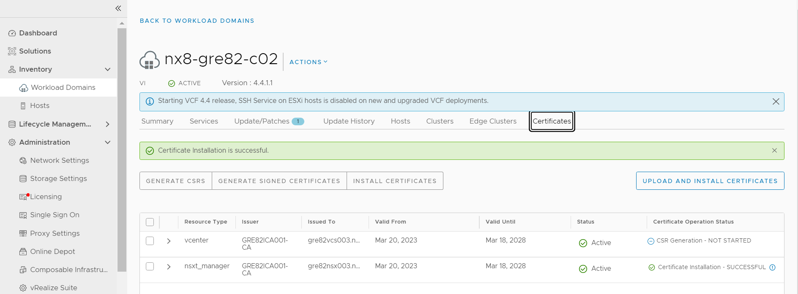

### 2.8 Configure vCenter join to AD additional cmp vCenters

This playbook will join the active directory's OU to the vcenter of additional workload domain.

   ```shell
   ansible-playbook configureVcenterAdditionalWld.yml
   ```

**Validate:**

Log in to `vcenter`-->`Menu`-->`Administration`-->`Single Sign On`-->`Configuration`-->`Identity Provider`-->`Active directory Domain`-->`additional workload domain vcenter`.You would be able to see the active directory OU join for the vcenter of additional workload domain.

   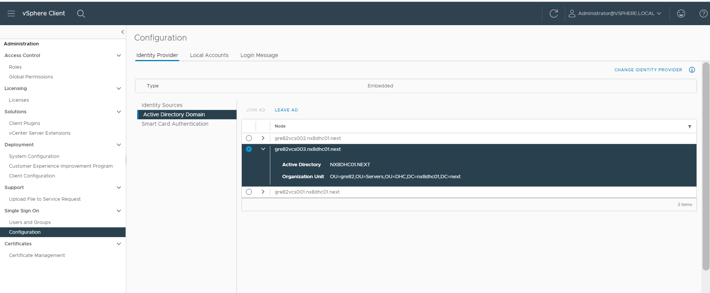  

### 2.9 Configure vCenter RBAC

This playbook will assign the groups `rsce-grexx-bck-l-admins` , `rsce-grexx-vcs-l-admins`  and `rsce-grexx-vcs-l-readonly`  to the vCenter of additional workload domain.

   ```shell
   ansible-playbook configureRbacAdditionalWldVcenter.yml
   ```

**Validate:**

Log in to `vcenter`-->`Menu`-->`Inventory`-->`additional workload domain vcenter`-->`permission`. You will notice all the above mentioned groups are assigned to the vcenter.

   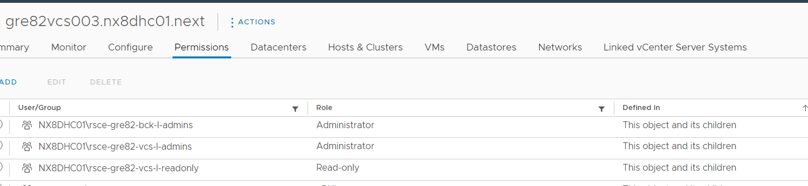  

### 2.10 Enable and integrate Identity manager in additional workload domain NSX-T manager

This playbook will enable the IDM integration and integrates the idm001 with the NSX-T manager of additional workload domain.

   ```shell
   ansible-playbook integrateNsxtIdmAdditionalWl.yml
   ```

**Validate:**

Log in to `additional workload domain NSX-T manager`-->`User Management`-->`VMware Identity Manager`-->You should see the Identity manager connection is up and idm server is configured here.

   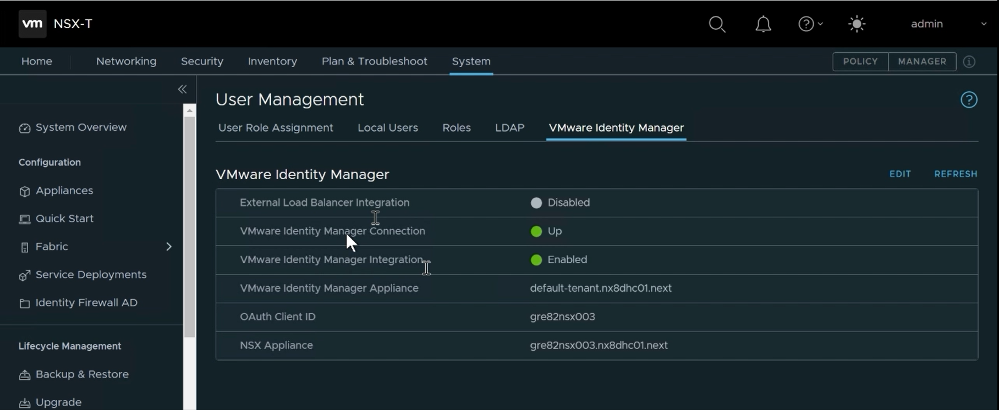

### 2.11 Integrate Additional workloaddomain with Loginsight

This playbook will help in integration of LogInsight with additional workload domain and enable the logconnection for vsphere.

   ```shell
   ansible-playbook configureVrliVsphereForAdditionalWd.yml
   ```

**Validate:**

Log in to `SDDC Manager UI`-->`vRealize Suite`-->`vRealize Log Insight`-->You could see additional workload domain is integrated with loginsight.

   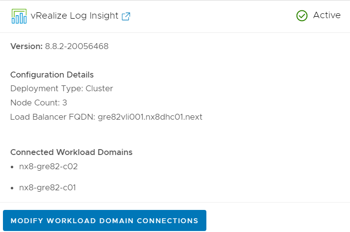

### 2.12 Integrate Additional workloaddomain with NetworkInsight

This playbook will add vcenter and NSX-T manager of additional workload domain as data sources in the network insight.

   ```shell
   ansible-playbook  integrateNetworkInsightAdditionalWld.yml
   ```

**Validate:**

Log in to `Network Insight UI`-->`Settings`-->`Accounts and Data Sources`. There you will be able to see the vcenter and NSX-T manager of additional workload domain

   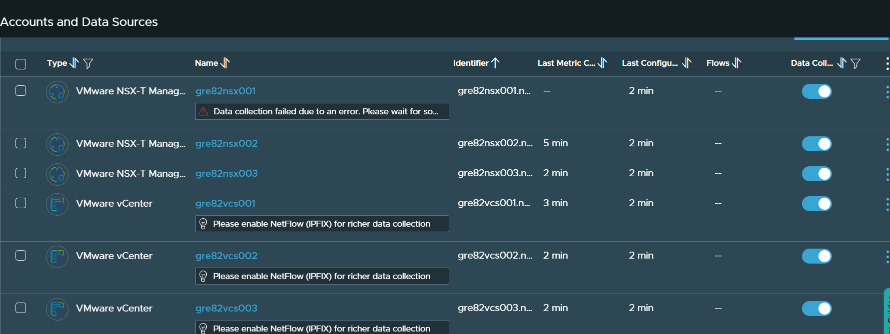

### 2.13 Create vSAN storage polices for additional workload domain vcenter

This playbook will create different vsan storage policies for the vcenter of additional workload domain.

Apart from the `username` and `password` required for accessing Hashivault, the *createSpbmPolicyAdditionalVcenter.yml* playbook requires the following inputs:

| Input/Variable | Description                                                                                                                                                           |
|----------------|-----------------------------------------------------------------------------------------------------------------------------------------------------------------------|
| `vSanType`     | This variable is used by the dhc-createSpbmPolicyAdditionalVcenter role to map the storage profile with an spbm policy                                                |
| `raidType`     | RAID value for storage profiles in vRA (either 1 or 5). This value, together with the vSANStorageType is used for mapping Storage profiles with spbm policies created |

   ```shell
   ansible-playbook  createSpbmPolicyAdditionalVcenter.yml
   ```

**Validate:**

Log in to `vcenter`-->`Menu`-->`Policies and Profiles`-->`VM Storage Policies`. Different storage policies are created for the additional workload domain vcenter.

   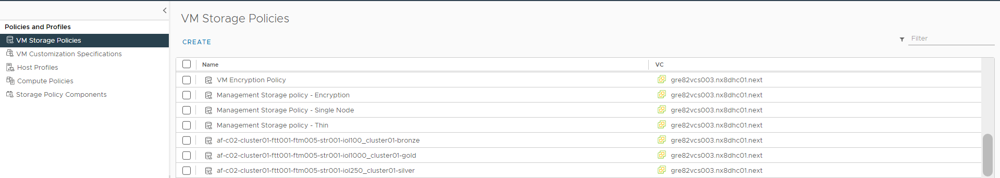

## 3 Optional Tasks

### 3.1 Integrate with Avamar

If the Avamar is already used by VCS instance new cluster can be integrated with Avamar backup solution.  The playbook *addAvamarProxy.yml* is used to integrate new cluster with existing Avamar instance. It performs the followings actions:

- Creates DNS records for Avamar proxy
- Deploys, configures and registers CMP Proxy on a new cluster

The following inputs are used by the playbook:

| Input/Variable             | Description                                                                                       |
|----------------------------|---------------------------------------------------------------------------------------------------|
| `avamarPassword`           | MCUser password for Avamar Server                                                                 |
| `avamarProxyClusterNumber` | Two digit CMP cluster number on which Avamar proxy needs to be deployed. For example '02'         |
| `avamarProxyHostNumber`    | Three digit CMP host number on which Avamar proxy needs to be deployed. For example '103'         |
| `avamarProxyName`          | Short name of Avamar proxy to be deployed for a new cluster.For example '< location code >avp002' |
| `avamarProxyLastOctet`     | Last octet of a Avamar proxy to be deployed for a new cluster.                                    |

Before integration can be started Avamar firewall rules needs to be implemented on the physical firewall. All ports that are needed for Avamar are described in [Software Defined Networks LLD](../design/lldSoftwareDefinedNetworks.md#ruleset-for-physical-firewall).

It is recommended to deploy one Avamar proxy per 50 VM’s. This playbook should be used to deploy sufficient number of Avamar proxies depending on the amount of customer VM’s added to backup.

As Avamar is using tags to assign backup policy each VM needs to be tagged with proper tag corresponding with the selected backup policy. This needs to be done manually for any existing VM running on a new cluster.

   ```shell
   ansible-playbook  addAvamarProxy.yml
   ```

**Validate:**

Log in to `vcenter`-->`Menu`-->`Inventory`-->`additional workload domain vcenter`. Avamar proxy with the user specified name will be deployed in the vcenter.

   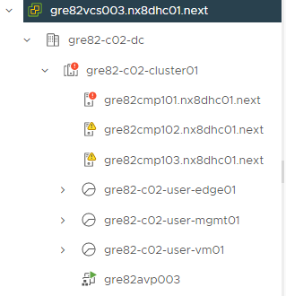

### 3.2 Atos Global Images import to CL for additional workload vcenter

- Import Atos Global Images to additinal compute vCenter Content Library by executing the playbook:
  
    ```shell
    ansible-playbook importGlobalImagesToContentLibraryAdditionalWld.yml
    ```

- You may login to *vcs003* vCenter and check if expected templates are present in the Content Library
  
---

### 3.3 Remove vmnic adapter from vm present in additional wld vcenter

- Playbook is used to remove the specified network adapter from the virtual machine by using the vlanName variable for additional workload vcenter.

- This playbook requires a file vmListFile.yml which should contain the list of virtual machines present in additional workload vcenter whose network adapter needs to be removed. This file will be placed in /home directory of a user who runs the playbook

- Also this playbook prompts for vlan name for which network adapter to be removed.
  
    ```shell
    ansible-playbook removeVmNicAdditionalWld.yml
    ```

### 3.4 Remove snapshot created by playbook removeVmNicAdditionalWld in additional wld vcenter

- Playbook is used to remove VM snapshot created by playbook removeVmNicAdditionalWld.yml for additional workload vcenter.

- This playbook requires a file vmListFile.yml which should contain the list of virtual machines present in additional workload vcenter whose snapshot was created by the playbook removeVmNicAdditionalWld.yml. This file will be placed in /home directory of a user who runs the playbook

    ```shell
    ansible-playbook removeVmNicSnapshotAdditionalWld.yml
    ```

### 3.5 Create Customer Service Account

Customer service account should be created in case customer needs to access and operate the additional workload domain created. To do so, we need to run below playbook which will create a customer account in AD and vault.

   ```shell
   ansible-playbook createServiceAccountAdditionalWldDomain.yml
   ```

## 4 Hardening for Additional Workload Domain

### 4.1 NSX-T

#### 4.1.1 To disable local audit account

The below playbook must be executed as part of hardening to disable user audit account.

   **Execute:**

   ```shell
   ansible-playbook hardenNsxtDisableUserAuditAdditionalWld.yml
   ```

**Validate:**

The user account status can be checked in the NSX-T Console.

### 4.1.2 To apply remediation against non-compliant measures

This creates dhc-mac-discovery-profile with mac-change settings as disabled and maps it to all the segments under Networking in NSX-T as per the Compliance document MSP-GAD-0278.
  
**Execute:**

   ```shell
   ansible-playbook remediateNsxtNonCompliantMeasuresAdditionalWld.yml 
   ```  

**Validate:**  

The following image shows the changes made after the playbook execution in NSX-T
  
  
  
  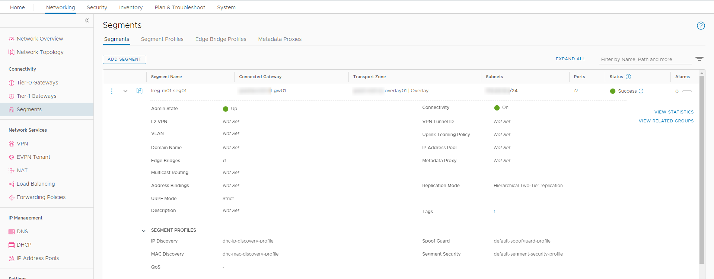

### 4.1.3 To configure backup

This playbook configures NSX Backup.
  
**Execute:**

   ```shell
   ansible-playbook configureVcfExtBackupAdditionalWldDomain.yml 
   ```  

**Validate:**  

Go to `NSX-T manager` console > System > Backup & Restore to check the status of backup configured or not.

### 4.1.4 To perform password rotation

This rotates the password of NSX-T for additional workload Domain
  
**Execute:**

   ```shell
   ansible-playbook rotatePasswordAdditionalWldDomain.yml 
   ```  

**Validate:**  

Old password no more valid when trying to access.

#### 4.1.5 Create Microsegmentation for additional workload domain components

The below playbook performs the microsegmentation for additional workload domain.

**Execute:**

   ```shell
   ansible-playbook createMgmtNsxtMicrosegmentationAdditionalWL.yml 
   ```  

**Validate:**

To validate NSX DFW ruleset, please verify objects creation inside NSX-T (in Management Domain). To do that go through the following steps:

Login to NSX-T(nsx001) via HTTPS

Navigate to Advanced Networking & Security

Navigate to Security

Navigate to Distributed Firewall

Verify if section `AWD` is present, rules from wdNsxtAdditionalDomain.yml (sources, destinations, services, apply to) are existing under the AWD.

#### 4.1.6 DFW rules for Additional Workload Domain SDN Edges

The NSX-T Edge Node VMs are deployed on each Workload Domain. North and South Network traffic must traverse through Edge Node in Workload Domains.

At present the DFW rules are not defined for SDN Edge nodes. Thus need to create below Security Group and rules for Edge Nodes manually in Management NSX001. Reference file microsegmentationImports/wdNsxtAdditionalDomain.yml is located in DHC-Firewall repository

Security Group for Edge Node:

| Name                 | Members                | DynamicMembers                                 |
|----------------------|------------------------|------------------------------------------------|
| SDN Edges Workload02 | < customerCode >seg082 | < networkMgmt.cidr >.a, < networkMgmt.cidr >.b |

Note: Please ensure that the Edge Node IP addresses are reserve in Infoblox.

DFW rule for Edge Node:

| RuleName              | SectionName | Source                 | Destination            | Service | Action | ApplyTo |
|-----------------------|-------------|------------------------|------------------------|---------|--------|---------|
| EdgesToNsx3AWD        | AWD         | < customerCode >seg082 | < customerCode >seg080 | TCP1235 | ALLOW  | any     |
| EdgesToNsx3AWD        |             |                        |                        | HTTPS   |        |         |
|                       |             |                        |                        |         |        |         |
| ToNsxT3ControllersAWD | AWD         | < customerCode >seg081 | < customerCode >seg080 | TCP5671 | ALLOW  | any     |
| ToNsxT3ControllersAWD |             | < customerCode >seg082 |                        | TCP1235 |        |         |

### 4.1.7 To disable TLS 1.1 on Parent and Child NSX-T

The below playbooks are applied to disable the TLS version 1.1 as part of security hardening.

For Parent NSX-T,

   ```shell
   ansible-playbook disableTlsv11OnNsxParentAdditionalWL.yml
   ```

For Child NSX-T,

   ```shell
   ansible-playbook disableTlsv11OnNsxParentAdditionalWL.yml
   ```

**Validate:**  
      TLS 1.1 vulnerability will not be visible on the Nessus scan results against NSX-T.

## 4.2 vCenter and ESXi

### 4.2.1 To add ESXi Host to Domain

This playbook add the ESXi host to the domain as part of provisioning additional workload domain.

```shell
ansible-playbook hardenJoinAdEsxiHostAdditionalWldDomain.yml
```

**Validate:**

Logon to the vCenter console > Cluster > ESXi host will be visible with FQDN.

### 4.2.2 Apply Security measures on vCenter and ESXi

This playbook must be executed as part of remediating non-compliant security measures.

   ```shell
   ansible-playbook remediateVcenterNonCompliantMeasuresAdditionalWld.yml
   ```

**Validate:**  
      The following few examples shows the changes made after the playbook execution for a few of the vCenter measure ids.

1. TSS Measure ID **1VV00001**  
    
  

2. TSS Measure ID **1VV00002**  
  

3. TSS Measure ID **1VV00004**  
    
  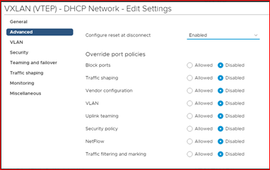

### 4.2.3 To set password expiration on vCenter

This playbook configures root user password expiration on vCenter for 90 days and adds email id for notification. This task addresses **measure id 3VV00006** of the TSS guidelines for vCenter servers.

**Requirements:**

- Execute the playbook on ans001 server from /opt/dhc/manage folder once per vCenter.
- It will take input from user as: domain id, password, vCenter name from list and mailTo id.
- It will accept only one mailTo id for notification and one vCenter.

**Execute:**

   ```shell
   ansible-playbook configureVcenterPasswordExpirationAdditionalWld.yml
   ```

- Step 1.: Run Playbook
  

- Step 2.: Enter all required input fields values.
  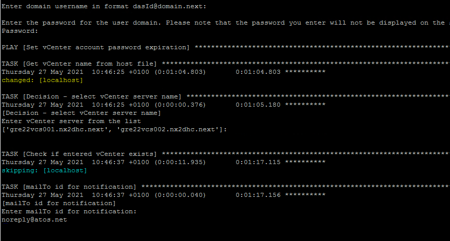
  
- Step 3.: Results after successfully execution of playbook.
  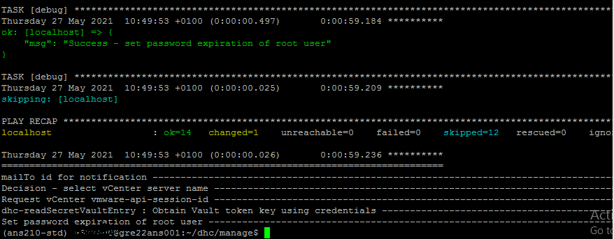
  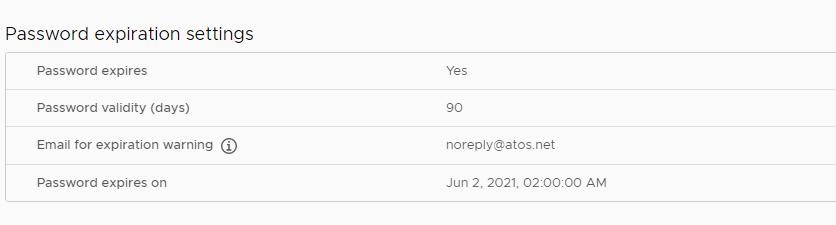

### 4.2.4 To configure backup

Follow the above section 4.1.3 as it is applicable to vCenter as well.

### 4.2.5 To perform password rotation

Follow the above section 4.1.4  as it is applicable to vCenter and ESXi as well.
