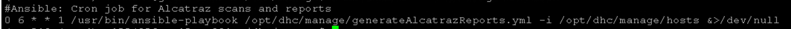
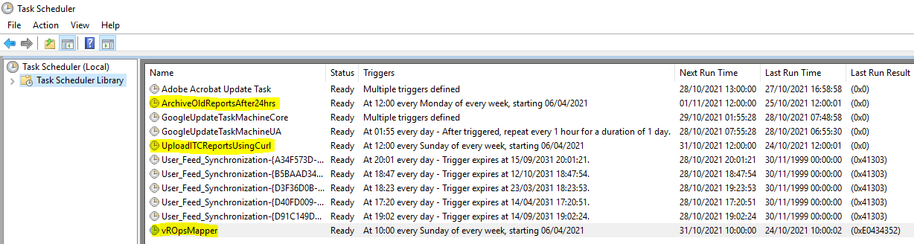
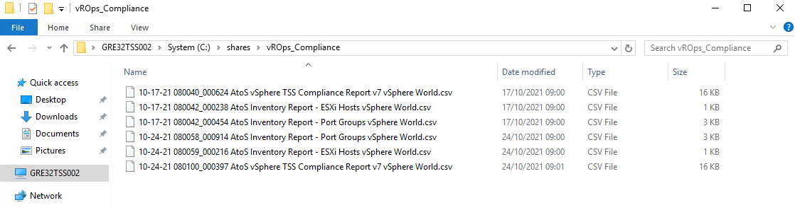

# Alcatraz Integration

# Changelog

| Version | Date       | Description                                                               | Author           |
|---------|------------|---------------------------------------------------------------------------|------------------|
| 0.1     | 21/04/2020 | Initial draft version                                                     | Marcin Kujawski  |
| 0.2     | 22/04/2020 | Adding chapter Implementation Procedure                                   | Marcin Kujawski  |
| 0.3     | 24/04/2020 | Adding drawings and requirements chapters                                 | Marcin Kujawski  |
| 0.4     | 17/02/2021 | Update information about Customer parameters configuration                | Marcin Kujawski  |
| 0.5     | 05/05/2021 | dhc-1926 minor changes to document layout, playbooks names adoption       | Robert Kaminski  |
| 0.6     | 28/10/2021 | Add information about Alcatraz vROps configuration                        | Marcin Kujawski  |
| 0.7     | 28/04/2022 | Add details about management servers in scope of Alcatraz scan - DHC-3626 | Shyjin Varaprath |
| 0.8     | 28/09/2022 | Added pre-requisite details for Schedule reports generation               | Vani Yemula      |
| 0.9     | 04/02/2026 | Update the information about Alcatraz Reporting               | Michał Braun-Sobieraj     |

## Introduction

### Purpose

Integrate VCS with Alcatraz framework (part of ATF 2.0) for compliance scanning.

### Audience

- VCS Engineers
- VCS Operations

### Scope

In scope:

- VCS integration with Alcatraz framework. Configuration of Customer specific parameters (customer name, data provider id, ITCDB URL/IP, username and password).
- Addition of emails to the mailtoRecipients.yml config file
- On demand compliance reports generation
- Creation of compliance reports cron job
- Upload reports to Alcatraz ITC server or sends reports via Email.

Out of scope:

- Installation of compliance scanners on all Windows and Linux VCS management servers. Action included in VCS build pipeline via playbook `deploy/installAlcatraz.yml`.
- reports analyze

# Related Documents

| Document                                                                                                          |
|-------------------------------------------------------------------------------------------------------------------|
| [LLD Hardening](../design/lldHardening.md)                                                                        |
| [Alcatraz Sharepoint](https://atos365.sharepoint.com/sites/690001424/AHS-Tooling/alcatraz/SitePages/Rollout.aspx) |
| [LCM version matrix][versionMatrixConfluence]                                                                     |

# Pre-requirements

Brief **requirements** for VCS alcatraz framework integration are:

- **Software** - alcatraz agents installed on all linux and windows management servers (included in the standard build)
- **Network** - firewall rules opened to Alcatraz ITCDB
- **Alcatraz credentials** - customer defined on alcatraz framework

---

## Software requirements

[versionMatrixConfluence]: https://github.com/GLB-CES-PrivateCloud/DHC-Documentation/wiki/LCM-Version-Matrix

[json]: https://github.com/GLB-CES-PrivateCloud/DHC-Documentation/wiki/DHC-version-Matrix-JSON-file

Alcatraz agents are installed by default on all windows and linux management servers in the deploy phase (stage3).

| OS Type         | Filename                                |
|-----------------|-----------------------------------------|
| Windows Scanner | `CSSetup_X.Y.Z.exe`                     |
| Unix/Linux      | `Alcatraz_lsecurity_vX.Y.ZZ_<date>.tar` |
| VMware          | `vROPS-Mapper.exe`                      |

>Latest agent versions are available on [Alcatraz website](https://atos365.sharepoint.com/sites/690001424/AHS-Tooling/alcatraz/SitePages/Rollout.aspx), however effectively version table of VCS component is leading, that can be found [here][versionMatrixConfluence].
</BR> VCS manages the component versioning through the [LCM version matrix json][json] file.
</BR> Refer to [Life Cycle Management](../workInstructions/wiLifeCycleManagement.md) work instruction for Alcatraz agents upgrade methods.

---

## Network requirements

Connection flow has to be opened between Ansible Core and Alcatraz ITC server placed in ATF, hence request it upfront. Find ITC Server details in the table below.

| Alcatraz Instance            | URL                                    | IP Address   | Port    |
|------------------------------|----------------------------------------|--------------|---------|
| Alcatraz ITC Production      | alcatraz-itcdb.it-solutions.myatos.net | 161.89.90.30 | 443/TCP |
| Alcatraz ITC Test (optional) | itcdb-dev.it-solutions.myatos.net      | 10.86.141.6  | 443/TCP |

---

## Alcatraz credentials requirements

Atos tooling provides central portal for security governance named ITC portal (Tosca).

Alcatraz onboarding process delivers required alcatraz credentials to allow upload of compliance reports to ITC portal.

Follow [Integration Procedure](#integration-steps-with-alcatraz-framework-tosca) chapter.

# Integration steps with Alcatraz framework (Tosca)

---

## Integration with Alcatraz framework

Alcatraz framework is managed by Atos GDTS team. Onboarding requires opening Service Now tickets to address it.

---

### Request Data provider and customer ID creation

Open SNOW ticket to Alcatraz team.

Go to Snow GUI: `Atos Internal Service Catalog --> GDTS --> System Management Requests (AHS-T \ GTS-A) --> Generic Service Request`

Fill Request Details according to below table:

| Service  | Sub Service   | Request Description                                                                   |
|----------|---------------|---------------------------------------------------------------------------------------|
| Alcatraz | Providers Add | *Provide description equivalent to create new data provider for new Customer request* |

Expected deliverables:

1. Provider ID created (`GPxx`).
2. Customer ID created (`locationCode` of VCS).

---

### Request Alcatraz new customer onboarding

Open SNOW ticket to Alcatraz team, fill [Alcatraz data intake form](https://atos365.sharepoint.com/sites/690001424/AHS-Tooling/alcatraz/Onboarding%20documentation/Forms/AllItems.aspx?id=%2Fsites%2F690001424%2FAHS%2DTooling%2Falcatraz%2FOnboarding%20documentation%2FAlcatraz%5Fonboarding%5Fintake%5Fform%20%28CURRENT%29%2Ezip&parent=%2Fsites%2F690001424%2FAHS%2DTooling%2Falcatraz%2FOnboarding%20documentation) and attach it to the request.

Go to Snow GUI: `Atos Internal Service Catalog --> GDTS --> System Management Requests (AHS-T \ GTS-A) --> Generic Service Request`

Fill Request Details according to below table:

| Service  | Sub Service           | Request Description                                                        |
|----------|-----------------------|----------------------------------------------------------------------------|
| Alcatraz | Customers Onboardings | *Provide description equivalent to create new Customer onboarding request* |

>When customer specific TSS are required please specify this in the ticket and the request will be treated individually. Refer to [Alcatraz Onboarding Process](https://atos365.sharepoint.com/sites/690001424/AHS-Tooling/alcatraz/SitePages/Rollout.aspx) official pages, for more details.

Expected deliverables:

1. Customer on-boarded in Alcatraz.
2. User credentials provided by Alcatraz team with access granted to ITC DB portal.

---

## Alcatraz configuration in VCS

The Alcatraz onboarding data has to be imported into VCS configuration.

Execute the following playbook on *ans001* server from */opt/dhc/manage* folder

```markdown
ansible-playbook createAlcatrazToscaVarsInHashi.yml 
```

>Playbook prompts for:
>
>- user dasId from the VCS managment domain in format `dasId@domain.next`
>- Alcatraz Customer Name
>- Alcatraz Data Provider Id
>- Alcatraz ITCDB URL/IP
>- Alcatraz Username
>- Alcatraz Username password
>
> Playbook stores gathered data into Hashi Vault under `<customerCode>/<locationCode>/alcatraz` location.

---

## Schedule reports generation

### Linux and Windows compliance

#### Prerequisite

Please ensure the automation03access policy has read rights to vault secret - activedirectory/administrator password. You may required to run the following playbook, incase, the above mentioned access is not in place.

```markdown
ansible-playbook updateVaultPolicyAut03.yml
```

Execute the following playbook on *ans001* server from */opt/dhc/manage* folder, to schedule weekly report generation to Tosca.

```markdown
ansible-playbook createCronJobForAlcatrazReports.yml --tags uploadReport
```

or below if you'd like instead to send reports to the email address:

```markdown
ansible-playbook createCronJobForAlcatrazReports.yml --tags emailsReport
```

>- playbook prompts for user dasId from the VCS management domain in format `dasId@domain.next`
>- creates cron job on ans001 server to run generateAlcatrazReports.yml weekly (weekday: 1 hour: 6 minute: 0)
> </BR>to validate cron job, use `sudo crontab -l



The management servers that are in scope of the Alcatraz scan are as listed.

| In Scope                                         |
|--------------------------------------------------|
| \<location code\>tss002, \<location code\>tss001 |
| \<location code\>adc001, \<location code\>adc002 |
| \<location code\>ica001                          |
| \<location code\>wus001                          |
| \<location code\>hsv001                          |
| \<location code\>deb001                          |
| \<location code\>git001                          |
| \<location code\>avr001                          |
| \<location code\>ans001                          |
| \<location code\>pxy002, \<location code\>pxy003 |
| \<location code\>nes001                          |
| \<location code\>hgw001                          |
| \<location code\>mid001                          |
| \<location code\>srs001                          |
| \<location code\>bil001                          |

And the following management servers are excluded from the Alcatraz scanning. This is because, these servers are not deployed using the standard VCS build templates, but are ready made (custom made) appliances purpose built to deliver the specific component. Furthermore, it is not recommended to install any third party scripts or tools onto the appliances because they may cause disruption to the proper working of the same. And also the remediation for the findings might not be feasible to the proper working of these appliances.

| Out of Scope                                                                 |
|------------------------------------------------------------------------------|
| \<location code\>abx\<xxx\>                                                  |
| \<location code\>cas\<xxx\>                                                  |
| \<location code\>ctl\<xxx\>                                                  |
| \<location code\>edg\<xxx\>                                                  |
| \<location code\>idm\<xxx\>                                                  |
| \<location code\>inf\<xxx\>                                                  |
| \<location code\>kms001, \<location code\>kms002                             |
| \<location code\>lcm001                                                      |
| \<location code\>ops002, \<location code\>ops003                             |
| \<location code\>sdm001                                                      |
| \<location code\>vcs001, \<location code\>vcs002                             |
| \<location code\>vli001a, \<location code\>vli001b, \<location code\>vli001c |
| \<location code\>vnc001                                                      |
| \<location code\>vni001                                                      |
| \<location code dr\>edg\<xxx\>                                               |

### VMware components compliance

**Prerequisites**

Prior Alcatraz report schedule setup make sure vROps reports are imported and scheduled too. Otherwise scheduling Alcatraz reports does not make sense.

> **Note:** You can check this by login to vROps and going to **Dashboards** --> **Reports**. Search by typing *AtoS* word in filter. You should receive 3 reports and schedules should be set for all of them (Every week on Sunday at 8:00 AM).

Execute the following playbook on *ans001* server from */opt/dhc/update* folder, to schedule weekly report generation to Tosca.

```markdown
ansible-playbook uploadReportsToAlcatraz.yml --tags fileUpload
```

or use below to schedule weekly email reports by adding email category alcatrazMail and list of emails to the config file mailtoRecipients.yml using playbook:

```markdown
ansible-playbook addEntryToMailRecipients.yml
```

Then continue with:

```markdown
ansible-playbook uploadReportsToAlcatraz.yml --tags emailUpload
```

- playbook prompts for user dasId from the VCS management domain in format `dasId@domain.next`
- updates vROpsMapper configuration file with customer's values

&emsp;&emsp;&emsp;directoryPath=C:\shares\vROps_Compliance
</BR>&emsp;&emsp;&emsp;providerID=GPXY
</BR>&emsp;&emsp;&emsp;customer=VCS
</BR>&emsp;&emsp;&emsp;measurePlanVersion=7.0
</BR>&emsp;&emsp;&emsp;scanEngineName=vROPS
</BR>&emsp;&emsp;&emsp;scanEngineVersion=1.0

- installs DotNet Framework (if correct version is missing)
- creates scheduled task on TSS002 for converting csv files to xml using vROpsMapper (every Sunday at 10:00 AM)
- creates scheduled task on TSS002 for uploading reports to Alcatraz using curl command (every Sunday at 12:00 AM)
- creates scheduled task on TSS002 to archive already uploaded reports (every Monday at 12:00 AM)
 </BR>to validate scheduled tasks, login to TSS002 and check `Task Scheduler Library` configuration

For the Email functionality continue with:

- Log in to the TSS002
- Open the windows scheduler
- Remove by default created `UploadITCReportsUsingCurl`



# Operational

## On demand Alcatraz report generation (Linux & Windows)

Compliance scans can be executed against all windows and linux VCS management servers. Reports will be generated and stored locally. Solution is desired for environments not integrated with Alcatraz framework (no upload to Tosca).

Execute the following playbook on *ans001* server from */opt/dhc/manage* folder, to generate alcatraz reports

```markdown
ansible-playbook generateAlcatrazReports.yml
```

Playbook does:

- prompts for user dasId from the VCS managment domain in format `dasId@domain.next`
- generates alcatraz scans against linux servers
- generates alcatraz scans against windows servers
- stores reports on *ans001* server in `/backup/reports/` folder. One report per server.


You may use tags to limit hosts scope, for example:

```markdown
ansible-playbook generateAlcatrazReports.yml --tags runScanAlcatrazWindows
ansible-playbook generateAlcatrazReports.yml --tags runScanAlcatrazLinux
```

---

## On demand Alcatraz report generation (VMware components)

Compliance scans can be executed against VMware components like vCenter and ESXi hosts inside VCS management servers. Reports will be generated and stored locally. Solution is desired for environments not integrated with Alcatraz framework (no upload to Tosca).

Execute the following tasks to generate compliance reports:

1. Login to vROps
2. Go to **Dashboards** --> **Reports**
3. Search reports by typing *AtoS* word in quick filter. You should receive 3 reports:
   - AtoS Inventory Report - ESXi Hosts
   - AtoS Inventory Report - Port Groups
   - AtoS vSphere TSS Compliance Report v7
4. Run each of above to generate on demand reports
5. Login to TSS002 Windows server
6. Open Task Scheduler
7. Run task called: `vROpsMapper`
8. Once completed you should see reports ready in directory: `C:\shares\vROps_Compliance`



---

## On demand upload Alcatraz reports to Tosca (Alcatraz ITCDB)

Perform steps described in [Integration steps with alcatraz framework tosca](#integration-steps-with-alcatraz-framework-tosca) paragraph upfront in order to be able to upload reports to Tosca.

### Linux and Windows

To generate alcatraz reports and send them to Alcatraz framework (Tosca), execute the following playbook:

```markdown
ansible-playbook generateAlcatrazReports.yml --tags uploadFiles -e enableTosca=true
```

>Playbook does:
>
>- prompts for user dasId from the VCS management domain in format `dasId@domain.next`
>- generates alcatraz scans against linux servers
>- generates alcatraz scans against windows servers
>- stores reports on *ans001* server in `/backup/reports/` folder. One report per server.
>- sends compliance reports to Alcatraz ITCDB.
> *It requires upfront Alcatraz configuration inputs stored in VCS and firewall flow opened to 161.89.90.30 (alcatraz-itcdb.it-solutions.myatos.net)*.

or alternatively send email:

First use playbook to add mail recipients for Alcatraz by adding category alcatrazMail and comma separated list of users:

```markdown
ansible-playbook addEntryToMailRecipients.yml
```

Followup with:

```markdown
ansible-playbook generateAlcatrazReports.yml --tags emailFiles -e enableTosca=true
```

>Playbook does:
>
>- prompts for user dasId from the VCS management domain in format `dasId@domain.next`
>- generates alcatraz scans against linux servers
>- generates alcatraz scans against windows servers
>- stores reports on *ans001* server in `/backup/reports/` folder. One report per server.
>- creates zip archive with newest reports
>- sends compliance reports to recipients from role defaults.
>- removes zipped file

### VMware components

To generate alcatraz reports and send them to Alcatraz framework (Tosca) execute the following tasks:

1. Login to vROps
2. Go to **Dashboards** --> **Reports**
3. Search reports by typing *AtoS* word in quick filter. You should receive 3 reports:
   - AtoS Inventory Report - ESXi Hosts
   - AtoS Inventory Report - Port Groups
   - AtoS vSphere TSS Compliance Report v7
4. Run schedule for each of above to generate reports
5. Login to TSS002 Windows server
6. Open Task Scheduler
7. Run task called: `vROpsMapper`
8. Once completed run task called: `UploadITCReportsUsingCurl` or `UploadITCReportsUsingEmail`.
