# AVI Load balancer deployment using Ansible automation

## Table of contents

## Changelog

|    Date    |   TOS   |   Issue   | Author | Description |
|------------|---------|-----------|--------|-------------|
| 11.08.2025 | VCS 2.1 | VCS-16839 | Michal Pindych  | Initial document creation |
| 25.09.2025 | VCS 2.1 | VCS-17285 | Cezary Dwojak | Documentation update |

### Purpose

This document describes different Ansible playbooks and the prerequisites for deploying the AVI Load Balancer in the customer workload environment

Please refer to list of ansible playbooks prepared for Avi:

|    Playbook    |   Description   |   Scope    |
|-------------------------------|--------------------------------------------------------------------------|--------|
| createAlb.yml                 | Deployment of AVI controllers and cluster setup                          | Global |
| configureAlb.yml              | Initial global configuration for all tenants                             | Global |
| configureAlbTenant.yml        | Specific configuration required for a tenant on AVI platform             | Tenant |

### Audience

- VCS Engineers
- VCS Operations
- Integration Architects

### Scope

This document covers configuring the following items:

- Describing Ansible automation for deploying AVI solution
- AVI Web Application Firewall enablement
- AVI monitoring consideration
- Future AVI enhancement proposal

### Related Documents

|          Documentation         |
|--------------------------------|
| [VCS Software Defined Network LLD](../design/lldSoftwareDefinedNetworks.md)|

## Ansible automation AVI deployment

Order in which playbooks should be executed to deploy AVI controller and tenant configuration:

```text
ansible-playbook createAlb.yml
ansible-playbook configureAlb.yml
ansible-playbook configureAlbTenant.yml
```

Prerequisites for playbook execution

|    Component    |   Description   |   Depended playbook    |
|-------------------------------|--------------------------------------------------------------------------|--------|
| AVI controller OVA            |  We are using AVI in version 22.1.7. Corresponding Ova file (controller-22.1.7-9093.ova) is already placed in /opt/binaries and also version matrix is already updated                                                                 | createAlb.yml |
| AVI content pack              |  AVI content pack (nsx-advanced-load-balancer--by-avi-networks--content-pack.vlcp) is already placed in /opt/binaries, version matrix is already updated                               | dhc-builder.yml |
| AVI manangment pack           |  AVI management pack (vmware-mpfornsxadvancedlb-1.3-24037466.pak) is already placed in /opt/binaries, version matrix is already updated            | dhc-builder.yml |
| AVI Ansible collection        |  Avi collection is already available in DHC-Collections under vmware catalog  | createAlb.yml, configureAlb.yml, configureAlbTenant.yml |
| tenant.yml                    |  Configuration file with engineer-provided input | configureAlbTenant.yml |

All listed files have been already placed on S3 bucket and it would be used be used be prerequisites VM.

VCS repositories used by automation
|    Repository   |   Description   |   Depended playbook    |
|-------------------------------|--------------------------------------------------------------------------|--------|
| DHC-Manage           |  AVI deployment is an optional feature for customers; all playbooks have been placed on the Manage repo  | createAlb.yml, configureAlb.yml, configureAlbTenant.yml|
| DHC-Collections      |  All playbooks are using dedicated VMware AVI collection placed under "DHC-Collections/ansible_collections/vmware/ansible_for_nsxt/" path |  createAlb.yml, configureAlb.yml, configureAlbTenant.yml |
| DHC-Firewall         |  In order to open firewall rules on the management workload domain, file mdAlbNsx.yml must exist on DHC-Firewall repo  |  createAlb.yml |
| DHC-Documentation    |  Avi documentation consisting of AVI LLD, Microsegmentation, and WI |  |

Please refer to the detailed Ansible playbooks description and all tasks which has been automated:

```text
createAlb.yml - Deployment of AVI controllers and cluster setup
- Update platformConfig file with Avi controllers entries
- Create FW rules for Management WLD
- Deploy Avi OVA files from the  version matrix (remove previously deployed OVA images if they exist)
- Set up a new password for ALB and export it to Hashi
- Initial DNS, NTP, and EMAIL configuration
- AVI cluster setup
- AVI registration to the NSX-T
- Certificate creation and installation on AVI
```

**Deployment:** Run only once to set up the controller cluster, which will host all tenants

**Rollback:** Automatic rollback possible - every time we run createAlb.yml playbook - we remove any previous deployment by default

**Description:** This phase of automation is responsible for setting up an AVI cluster consisting of three nodes in the management network. It also performs some initial configuration and opens the required traffic to enable the AVI deployment.

One of the automation steps in createAlb.yml is responsible for AVI registration in the NSX workload domain firewall.
The outcome of the registration is visible after logging in to the NSX-T, then on the right corner should be visible option to switch to NSX Advanced Load Balancer.

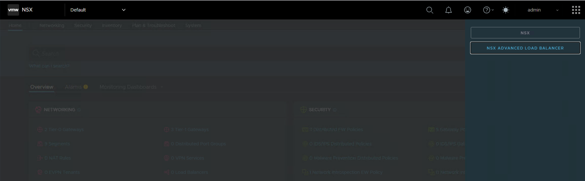

More information about AVI registration to NSX-T can be found here:

[https://knowledge.broadcom.com/external/article/373497/registering-an-avi-load-balancer-cluster.html](https://knowledge.broadcom.com/external/article/373497/registering-an-avi-load-balancer-cluster.html)

> [!IMPORTANT]
> Because AVI registration is not compatible with the current Tanzu deployment, this feature has been deactivated in the current release of AVI.

```text
configureAlb.yml - Initial global configuration for all tenants
- Configure RBAC
- Setup Syslog server
- Setup backup configuration on ans001 server
- Configure vCenter and NSX accounts on AVI
- Update DNS entries
- Proxy set up
- Adding license
- WAF enablement
```

**Deployment:** Run only once to configure the global configuration for all tenants

**Rollback:** Automatic rollback possible - please run createAlb.yml and then configureAlb.yml to deploy the solution from scratch

**Description:** This phase of automation is responsible for deploying global configuration (which will be used by all tenants) like RBAC, monitoring, or backup

```text
configureAlbTenant.yml
- Import tenant input file
- Create NSX-T T1 routers
- Create NSX-T segments for management and data
- Create ALB tenant
- Create NSX Cloud
- Create Content Library for ALB
- Create IPAM profiles
- Create Service Groups
- Update firewall rules for Worklaod Domain
```

**Deployment:** Run every time a new tenant is onboarded to the platform, the tenant's input file needs to be prepared

**Rollback:** No automatic rollback possible at this stage; the tenant configuration has to be removed manually

**Description:** Tenant-specific automation which must be run every time a new customer is onboarded to the platform, all needed input information information are stored in a dedicated file described in the next section

> [!NOTE]
> This playbook supports the external variable 'emailRecipients', which defines the email addresses to which reports about firewall rule openings will be sent. Please refer to the sample use case where we sent a report on firewall rule openings to the DevSecOps team.
>
> `ansible-playbook configureAlbTenant.yml -e "emailRecipients=dhc-devsecops@atos.net"`

### Tenant file description

Automation require the input file "tenant.yml" which must be placed on home directory of user which runs the playbook, please refer to appropriate ansible code

```yml
##configureAlbTenant.yml playbook

- name: Configure alb tenant
  hosts: localhost
  gather_facts: false
  vars_files:
    - "{{ lookup('env', 'HOME') }}/tenant.yml"
...

```

Please refer to tenant.yml file format and corresponding variables needed for AVI tenant deployment. Please create this file on Your home directory as follow:

```yml

customInfraVars:
  licenseKey: ""
  tenant:
    displayName: ""

  albTenant:

    albConfig:
      t0vrf: ""
      transportZone: "default"
    albNetworkDefault:
      albNetworkSEandVIP: false
      albNetworkSESize: 10
      albNetworkVIPSize: 50
      albNetworkIPv6: false
      albNetworkUpdate: true

    albNetworkList:

      - albNetworkName: ""
        albNetworkCIDR:
        albT1router: ""
        albManagment: yes

      - albNetworkName: ""
        albNetworkCIDR:
        albT1router: ""

  albSEG:
    # Defaults, change only if required
    albVSPlacementOnSE: "PLACEMENT_ALGO_PACKED" # default is compact, to set distributed use: "PLACEMENT_ALGO_DISTRIBUTED"
    albSEDiskSize: 15 # disk size in GB
    albSEHAMode: "HA_MODE_SHARED"
      # default is N+M, with HA_MODE_SHARED
      # Active/Active use: HA_MODE_SHARED_PAIR,
      # Legacy Active/Standby use: HA_MODE_LEGACY_ACTIVE_STANDBY
    albMaxSE: 10 # maximum amount of SE in SEG | for Active/Standby is set to 2
    albMinSE: 1 # minimum amount of SE in SEG
    albBufferSE: 1 # buffor SE size for N+M HA Mode. Default is 1
    albMinScaleOutVS: 1 # minimum SE for VS
    albMaxScaleOutVS: 4 # maximum SE for VS once scale out in scope
    albMaxVSPerSE: 10 # maximum amount of Virtual Services per single Service Engine
    albMemSE: 2048 # memory in MB for SE
    albVCPUPerSE: 1 # vCPU per SE
    albSEHT: True # Hyperthreading support on SE \
    albVcenterSEFolder: "alb-{{ customerCode }}-SE"
    ### Set of rules for Legacy A/S only
    albActiveStandby: False # Sets Service Engine in active/standby mode | default: False
    albHMOnStandby: True # Health monitoring from Standby Service Engine for all placed VS | default: True
    albRedistributeStandbyActiveLoad: False  # Takeover SE redistributeVS to replacement SE when set to True | default: False
    albDistributeLoadActiveStandby: False  # Standby SE also is having VS placement | default: False
    ### Variables to iterate over
    albSEGCounter: 1 # Counter in case more than one SEG needs to be created
    albSEGName: "" # Name identifier or discriminator
```

> [!IMPORTANT]
> Default value may not be defined; however, every field should contain a value (entire example at the end of this document).

Variables explanation:

| Field name | Description | Data type | Default Value | Additional Comments |
|---|---|---|---|---|
|```customInfraVars.licenseKey```| License key to be applied on ALB | String format | N/A | License key must be provided in string format, not file |
|```customInfraVars.tenant``` | set of configuration for tenant under ALB | set of key and values | N/A | |
|```customInfraVars.tenant.displayName``` | name of the tenant | string | N/A| must be very same as in NSX and vRA |
|```customInfraVars.albTenant``` | Tenant dedicated configuration | string | N/A | |
|```customInfraVars.albTenant.albConfig``` | set of configuration for ALB on NSX | N/A | key-value pairs for NSX configuration for desired ALB tenant | |
|```customInfraVars.albTenant.albConfig.t0vrf``` | name of NSX T0 VRF router for ALB dedicated tenant | string | N/A | |
|```customInfraVars.albTenant.albConfig.transportZone``` | defines type o transport zone | string | N/A |set to default uses default Overlay TZ - not to be changed |
|```customInfraVars.albTenant.albNetworkDefault``` | set of default settings for network configuration on NSX | set of key and values | N/A | default values, however, can be overwritten in albNetworkList in dedicated network list element, if values are only in albNetworkDefault section, those will be used |
|```customInfraVars.albTenant.albNetworkDefault.albNetworkSEandVIP``` | defines if network is used for both SE and VIPs within the same network range | boolean - true or false | false | if this option is true, options albNetworkSESize and albNetworkVIPSize be added to define one pool for SE and VIP addressing |
|```customInfraVars.albTenant.albNetworkDefault.albNetworkSESize``` | amount of Service Engines IP addresses reservation for Pool in network creation | integer | 10 | |
|```customInfraVars.albTenant.albNetworkDefault.albNetworkVIPSize``` | amount of VIP IP addresses reservation for Pool in network creation | integer | 50 | |
|```customInfraVars.albTenant.albNetworkDefault.albNetworkIPv6``` | defines if network is IPv6 or IPv4 | boolean - true or false | false ||
|```customInfraVars.albTenant.albNetworkDefault.albNetworkUpdate``` | defines if network to be updated or created | boolean - true or false | true | in case this value is set to false, automation will try to create a second network although one already exists, once this is true, it will update the existing one |
|```customInfraVars.albTenant.albNetworkList``` | list of all networks to be configured | list | N/A |all networks defined here do require albNetworkName, AlbNetworkCIDR, albT1Router as those are used to create NSX environment. Other values from albNetworkDefault can be added to any element of an albNetworkList to overwrite the default values. albManagement is used only for the management network |
|```customInfraVars.albTenant.albNetworkList.albNetworkName``` | defines the name of NSX Segment and ALB network | string | N/A | |
|```customInfraVars.albTenant.albNetworkList.albNetworkCIDR``` | defines the GW on NSX Segment and is used to define ALB Network | network CIDR format | N/A | is important to use the network GW IP address, not use the network IP address |
|```customInfraVars.albTenant.albNetworkList.albT1router``` | defines T1 router which is used set to be a GW | string | N/A | |
|```customInfraVars.albTenant.albNetworkList.albManagement``` | defines management network | flag | yes |this variable is used only on the management network, and the only possible value is yes |
|```customInfraVars.albSEG``` | It contains a set of configuration values required to properly define the Service Engine Group | set of key value pairs | N/A |Although some variables are set, they may not be taken into account due to the logic behind creating SEG |
|```customInfraVars.albSEG.albVSPlacementOnSE``` | defines the placement of VirtualService on Service Engine | defined string | PLACEMENT_ALGO_PACKED |possible values are PLACEMENT_ALGO_PACKED for compact package and PLACEMENT_ALGO_DISTRIBUTED for distributed package. Distributed package deploys new SE for new VS until albMaxSE is reached. |
|```customInfraVars.albSEG.albSEDiskSize``` | Service Engine disk size in GB | integer | 15 |definition is for Service Engine VM, which is created based on Service Engine Group |
|```customInfraVars.albSEG.albSEHAMode``` | Service Engine Group HA Mode | defined string | HA_MODE_SHARE |N+M is HA_MODE_SHARED, Active/Active is HA_MODE_SHARED_PAIR and legacy Active/Standby is HA_MODE_LEGACY_ACTIVE_STANDBY |
|```customInfraVars.albSEG.albMaxSE``` | defines the maximum number of Service Engines in the Service Engine Group | integer | 10 |for legacy Active/Standby, there will always be 2, no matter how this value is set up |
|```customInfraVars.albSEG.albMinSE``` | defines minimum amount of Service Engines in Service Engine Group | integer | 1 | |
|```customInfraVars.albSEG.albBufferSE``` | defines buffer Service Engine in N+M HA mode | integer | 1 | this is only utilzied when albSEHAMode is set to HA_MODE_SHARED|
|```customInfraVars.albSEG.albMinScaleOutVS``` | defines the scale out minimum Service Engines for VS | integer | 1 | once VS is scaled out, this defines the minimum of Service Engines it uses |
|```customInfraVars.albSEG.albMaxScaleOutVS``` | defines the scale out maximum Service Engines for VS | integer | 4 | once VS is scaled out, this defines the maximum of Service Engines it uses|
|```customInfraVars.albSEG.albMaxVSPerSE``` | defines the maximum amount of Virtual Services on a single Service Engine | integer | 10 | once the maximum amount of VS on SE is reached, a new SE is deployed on albVSPlacementOnSE = PLACEMENT_ALGO_PACKED |
|```customInfraVars.albSEG.albMemSE``` | amount of RAM memory for Service Engine | integer | 2048 | amount defined in MB |
|```customInfraVars.albSEG.albVCPUPerSE``` | amount of vCPUs for Service Engine | integer | 1 | |
|```customInfraVars.albSEG.albSEHT``` | sets the HyperThreading for Service Engine | boolean - true or false| true | |
|```customInfraVars.albSEG.albActiveStandby``` | Sets Service Engine in active/standby mode | boolean - true or false | false |adaptive only when albSEHAMode = HA_MODE_LEGACY_ACTIVE_STANDBY |
|```customInfraVars.albSEG.albHMOnStandby``` | Health monitoring from Standby Service Engine for all placed VS | boolean - true or false | true |adaptive only when albSEHAMode = HA_MODE_LEGACY_ACTIVE_STANDBY |
|```customInfraVars.albSEG.albRedistributeStandbyActiveLoad``` | Takeover Service Engine redistributeVirtual Service to replacement Service Engine | boolean - true or false | false |adaptive only when albSEHAMode = HA_MODE_LEGACY_ACTIVE_STANDBY |
|```customInfraVars.albSEG.albDistributeLoadActiveStandby``` | Standby Service Engine also is having Virtual Service placement | boolean - true or false | false | adaptive only when albSEHAMode = HA_MODE_LEGACY_ACTIVE_STANDBY |
|```customInfraVars.albSEG.albSEGCounter``` | defines iteration for Service Engine Group creation | integer | 1 |set value different from 1 if multiple SEG are required with the same parameters|
|```customInfraVars.albSEG.albSEGName```| Name identifier or discriminator | string | N/A | |

### AVI Firewall Consideration

Several phases of firewall rule implementation are underway.
Initially, firewall rules for the Controller and Service Engines are being implemented, following generic rules for VS/backend traffic.
This must be done in 2 places:

- required for Service Engines and Advanced Load Balancer Controller Cluster communication
  - NSX001 Distributed Firewall
  - NSX002 Distributed Firewall
  - VCS Management physical firewall (e-mail is sent to the DevSecOps team to request open traffic on the physical firewall with all details)
- required for Virtual Service/backend servers communication
  - NSX002 Distributed Firewall for default scope (user to Virtual Service VIP address)
  - NSX002 Distributed Firewall for each project separately (Virtual Service to Backend Servers Pool)

#### Firewall Rules that are required and need to be validated after implementation for ALB Controller

| Source         | Source Security Group         | Destination          | Destination Security Group   | Port | Protocol | Service Description | Apply on Firewalls                   | Purpose                                       |
|----------------|-------------------------------|----------------------|------------------------------|------|----------|---------------------|--------------------------------------|-----------------------------------------------|
| ALB Controller | \<prefix\>-ControllerCluster  | Syslog server        | \< customerCode \>seg005     | 514  | UDP      | Syslog              | MGMT Physical Firewall<BR>NSX001-DFW | Log export                                    |
| ALB Controller | \<prefix\>-ControllerCluster  | SMTP server          | \< customerCode \>seg054     | 25   | TCP      | SMTP                | MGMT Physical Firewall<BR>NSX001-DFW | Email                                         |
| ALB Controller | \<prefix\>-ControllerCluster  | SNMP traps (vROPs)   | \< customerCode \>seg020     | 162  | UDP      | SNMP traps          | MGMT Physical Firewall<BR>NSX001-DFW | Optional. Required to use SNMP              |

#### Firewall Rules that are required and need to be validated after implementation for ALB Service Engine

| Source             | Source Security Group           | Destination         | Destination Security Group      | Port | Protocol | Service Description | Apply on Firewalls                   | Purpose                                                                                 |
|--------------------|---------------------------------|---------------------|---------------------------------|------|----------|---------------------|--------------------------------------|-----------------------------------------------------------------------------------------|
| ALB Service Engine | \<prefix\>-ServiceEngineMgmtIPs | ALB Controller      | \<prefix\>-ControllerCluster    | 123  | UDP      | NTP                 | NSX002-DFW<BR>MGMT Physical Firewall | Time sync                                                                               |
| ALB Service Engine | \<prefix\>-ServiceEngineMgmtIPs | ALB Controller      | \<prefix\>-ControllerCluster    | 8443 | TCP      | HTTPs               | NSX002-DFW<BR>MGMT Physical Firewall | Secure channel key exchange                                                             |
| ALB Service Engine | \<prefix\>-ServiceEngineMgmtIPs | ALB Controller      | \<prefix\>-ControllerCluster    | 22   | TCP      | SSH                 | NSX002-DFW<BR>MGMT Physical Firewall | Secure channel                                                                          |
| ALB Service Engine | \<prefix\>-ServiceEngineMgmtIPs | ALB Service Engine  | \<prefix\>-ServiceEngineMgmtIPs | 9001 | TCP      | SE Object Store     | NSX002-DFW                           | Inter-SE distributed object store for vCenter/NSX-T/No Orchestrator/Linux server clouds |

#### Firewall Rules that are required and need to be validated after implementation for Backend pool (Environment category)

| Source                        | Source Security Group     | Destination              | Destination Security Group   | Port | Protocol |  Apply on Firewalls | Purpose                                                                                |
|-------------------------------|---------------------------|--------------------------|------------------------------|------|----------|--------------------|----------------------------------------------------------------------------------------|
| Any user (including Internet) | ANY | Virutal Service VIPs addresses | AUTO-FE-DST-\<destination project\> | Any  | ANY |  NSX002-DFW         | Backend pool traffic |
| Service Engine Data interface | AUTO-SRC-\<destination project\> | Pool application servers | AUTO-DST-\<destination project\> | Any  | ANY |  NSX002-DFW         | External traffic |

### WAF enablement

To deploy the Web Application Firewall with auto-update functionality, the following infrastructure prerequisites must be met:

- A valid license that includes WAF signature updates
- AVI proxy configuration to allow signature downloads
- Successful registration with the AVI Cloud Console

Please refer to below link to access AVI Cloud console:

[portal.pulse.broadcom.com](https://portal.pulse.broadcom.com/dashboard)

Follow these steps to enable WAF support for AI platform:

- On Administration -> Cloud Service tab please click "EDIT" button before AVI registration

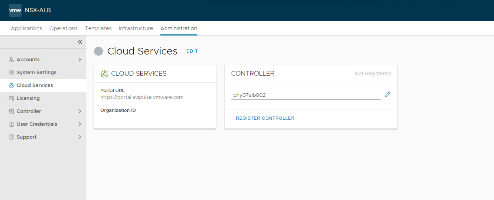

- Specify the Cloud Services Split Proxy

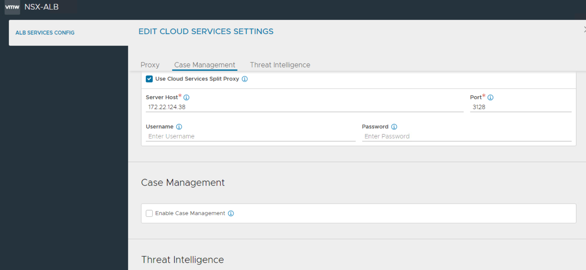

- Enable all Threat Intelligence services used by customer, save and then register AVI platform to the AVI cloud console

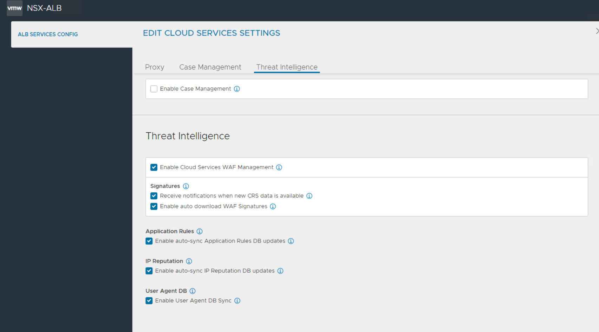

- After log in to the AVI cloud console You can check and download all available Core Rule Sets (CRS's) - in environments which have no access to Internet.  

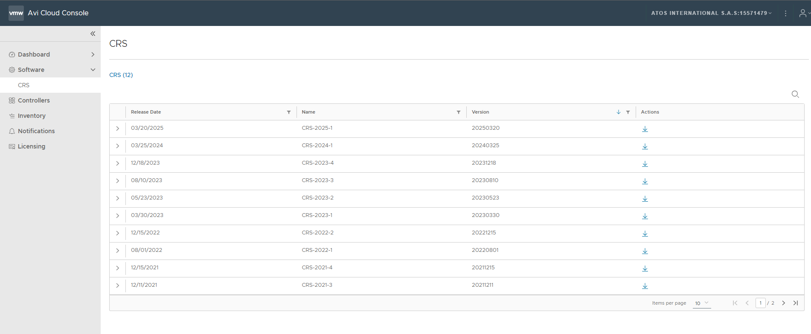

- After successful API registration You should see corresponding entry in AVI Cloud Console -> Controllers tab

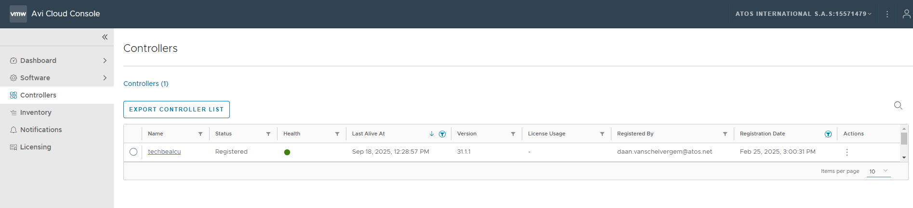

## AVI Monitoring Consideration

AVI monitoring solutions consist of such elements as:

AVI Load Balancer:

- Events
- Traffic Capture

Aria Operation for Logs:

- Logs Explorer
- AVI Dashboards
- Reports
- Alert Definitions

Aria Operation:

- AVI Dashboards
- Reports
- Alarms

The content pack (for Logs) and the management pack (for Operations) will be installed by default based on the version matrix and corresponding binaries stored in the S3 bucket.

Only predefined alarms from the content pack in Aria Operations for Logs will be monitored. Please refer to the list below:

- Avi: SE Down
- Avi: Controller Memory High
- Avi: Controller Node Left
- Avi: Critical Event
- Avi: License Expired
- Avi: Controller Disk High
- Avi: Controller CPU High
- Avi: SE High CPU

Process of enabling default AVI alarms

- Please be sure that Syslog server is properly configured under Operations -> Notifications -> Syslog tab

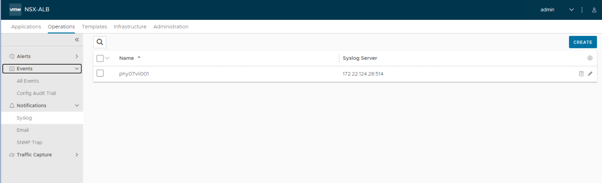

- Alert Config tab show all Alerts categories with corresponding Alert Action, the Alert action must sent events to syslog server

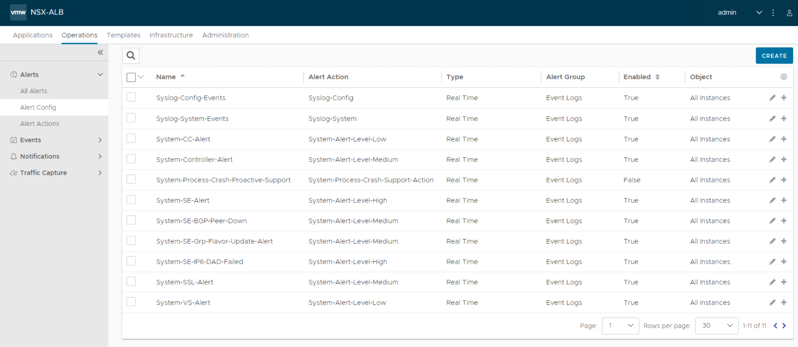

- Please update Alert Actions to send event to Syslog servers as show in the picture below

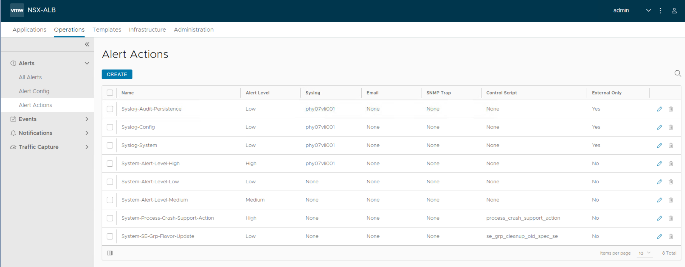

- After log in to the Aria Operations for Logs under the Content Pack -> NSX Advanced Load Balancer you should see all default alarms included in content pack

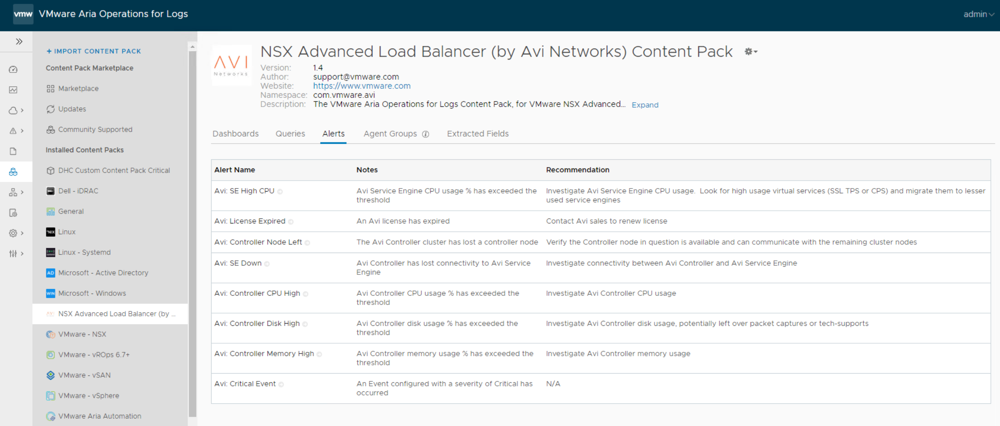

- On a Tab Alerts - > Alerts Definications please choose the filter for "NSX Advanced Load Balancer (by Avi Networks) Content Pack" and enabled all listed alarms

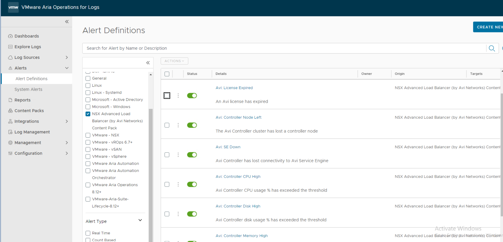

- Also there's a need to edit every AVI alert to send it directly to the Aria Operations (with Criticality: "Critical") - please refer to picture below

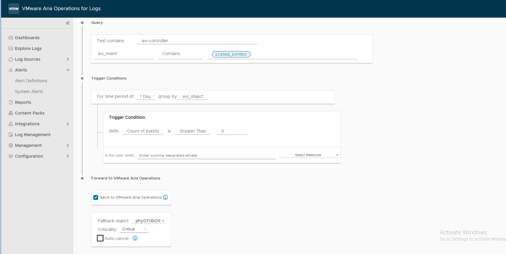

At this moment Aria Operation will intercept alarms from Aria Operation for Logs - and finally forward them to the HTTP gateway/Snow for future processing.

## Future AVI enhancement proposal

Please refer to the list of feature improvements that can be taken into account in future releases

- support for dedicated service accounts for AVI
- RBAC improvements
- modularization of the tenant input file or integration with omnitemplate
- supporting any transport zones on NSX-T (at this point, the default overlay TZ is only supported)
- automation to remove specific tenant and global configuration (back to initial state -  rollback improvement)
- encrypt communication to the Active Directory
- support a datastore different than VSAN (problem during content library creation)
- full automation for monitoring (alarms enablement in LogInsight)
- deploy unregistration AVI from NSX-T when required (only registration is possible at this moment)

## Example templates

```yml
customInfraVars:
  licenseKey: ""
  tenant:
    displayName: "ctos"

  albTenant:

    albConfig:
      t0vrf: "cotsT0Router"
      transportZone: "default"
    albNetworkDefault:
      albNetworkSEandVIP: false
      albNetworkSESize: 0
      albNetworkVIPSize: 40
      albNetworkIPv6: false
      albNetworkUpdate: true

    albNetworkList:

      - albNetworkName: "ctosNetwork1Management"
        albNetworkCIDR: 10.1.11.1/24
        albT1router: "ctosT1Router"
        albManagment: yes

      - albNetworkName: "ctosNetwork1Data"
        albNetworkCIDR: 10.1.12.1/24
        albT1router: "ctosT1Router"
        albNetworkSESize: 10

      - albNetworkName: "ctosNetwork2Data"
        albNetworkCIDR: 10.1.13.1/24
        albT1router: "ctosT2Router"

  albSEG:
    # Defaults, change only if required
    albVSPlacementOnSE: "PLACEMENT_ALGO_PACKED" # default is compact, to set distributed use: "PLACEMENT_ALGO_DISTRIBUTED"
    albSEDiskSize: 15 # disk size in GB
    albSEHAMode: "HA_MODE_SHARED"
      # default is N+M, with HA_MODE_SHARED
      # Active/Active use: HA_MODE_SHARED_PAIR,
      # Legacy Active/Standby use: HA_MODE_LEGACY_ACTIVE_STANDBY
    albMaxSE: 10 # maximum amount of SE in SEG | for Active/Standby is set to 2
    albMinSE: 1 # minimum amount of SE in SEG
    albBufferSE: 1 # buffor SE size for N+M HA Mode. Default is 1
    albMinScaleOutVS: 1 # minimum SE for VS
    albMaxScaleOutVS: 4 # maximum SE for VS once scale out in scope
    albMaxVSPerSE: 10 # maximum amount of Virtual Services per single Service Engine
    albMemSE: 2048 # memory in MB for SE
    albVCPUPerSE: 1 # vCPU per SE
    albSEHT: True # Hyperthreading support on SE \
    albVcenterSEFolder: "alb-{{ customerCode }}-SE"
    ### Set of rules for Legacy A/S only
    albActiveStandby: False # Sets Service Engine in active/standby mode | default: False
    albHMOnStandby: True # Health monitoring from Standby Service Engine for all placed VS | default: True
    albRedistributeStandbyActiveLoad: False  # Takeover SE redistributeVS to replacement SE when set to True | default: False
    albDistributeLoadActiveStandby: False  # Standby SE also is having VS placement | default: False
    ### Variables to iterate over
    albSEGCounter: 1 # Counter in case more than one SEG needs to be created
    albSEGName: "" # Name identifier or discriminator
```
