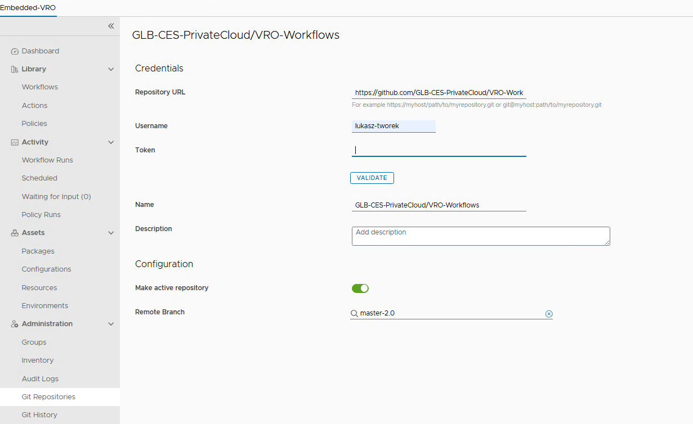

# Automated process of Lifecycle Management - 1.8.4

## Table of Contents

- [Automated process of Lifecycle Management - 1.8.4](#automated-process-of-lifecycle-management---184)
  - [Table of Contents](#table-of-contents)
  - [List of Changes](#list-of-changes)
  - [Introduction](#introduction)
  - [Scope](#scope)
  - [Related Documents](#related-documents)
  - [Prerequisites](@prerequisites)
  - [Mandatory Extra Vars](#mandatory-extra-vars)
  - [DHC Version matrix](#dhc-version-matrix)
  - [Rollback](#rollback)
  - [Upgrade Steps](#upgrade-steps)
    - [Download DHC version matrix](#download-dhc-version-matrix)
    - [LCM code update](#lcm-code-update)
      - [New Code Update Process](#new-code-update-process)
      - [Define DHC version](#define-dhc-version)
    - [Upgrade using upgrade automation](#upgrade-using-upgrade-automation)
      - [Automated upgrade steps overview](#automated-upgrade-steps-overview)
  - [Post upgrade steps](#post-upgrade-steps)
    - [Redefine DHC version](#redefine-dhc-version)
    - [vRO Workflows Update (via Git)](#vro-workflows-update-via-git)
    - [Post LCM Validation Steps](#post-lcm-validation-steps)
      - [Deploy Virtual Machine \[ETA 15min\]](#deploy-virtual-machine-eta-15min)
      - [Day2 action validation \[ETA 20min\]](#day2-action-validation-eta-20min)
      - [Disabling maintenance - starting vROps monitoring](#disabling-maintenance---starting-vrops-monitoring)
      - [Monitoring Validation \[ETA 45min\]](#monitoring-validation-eta-45min)
      - [External services validation](#external-services-validation)
      - [Remove LCM snapshots](#remove-lcm-snapshots)
  - [Known issues](#known-issues)
    - [Aria Lifecycle Manager](#aria-lifecycle-manager)
  
## List of Changes

| Date       | Issue    | Author          | TOS  | Description |
| ---------- | -------- | --------------- | ---- | --------------------- |
| 13/02/2025 | VCS-14042 | Adam Wieczorek |      | Initial version |
| 02/01/2026 | VCS-16877 | Mariusz Stanek |      | Execution of configureVropsMaintenance.yml corrected |

## Introduction

This document describes automated process of Lifecycle Management from DHC-1.8.3 to DHC-.1.8.4

## Scope

Scope of this Work Instruction covers whole process of updating DHC from version 1.8.3 to 1.8.4 in automated fashion.
Automation process covers 'Download Binaries' and 'Upgrade Steps' sections covered in [wiLifeCycleManagement-DHC1.8.4](wiLifeCycleManagement-DHC1.8.4.md), which are:

- Download binaries
- VMware Aria Suite Lifecycle 8.18.0 upgrade
- VMware Aria Suite Lifecycle 8.18.0 PSPACK 2 installation
- VMware Aria Operations for Logs 8.16.1 upgrade
- VMware Aria Operations for Logs 8.18.0 upgrade
- VMware Aria Operations for Logs Agents update
- VMware Aria Operations 8.18.1 upgrade
- VMware Aria Operations for Networks 6.13.0 upgrade
- VMware Aria Automation 8.18.0 upgrade
- Upgrade Vault to version 1.17.5
- Upgrade Infoblox to version 9.0.5
- Upgrade openSsl to version 1.1.1v
- CloudLink to NKP migration
- vCenter update via async tool
- OpenSSH update for Aria Automation

Automation process does NOT include vSphere Replication and vSphere Site Recovery Manager upgrade and switch vSAN encryption from KMS to NKP.

## Related Documents

| Document |
| -------- |
| [DHC 1.8 - wiLifeCycleManagement-DHC1.8.4](wiLifeCycleManagement-DHC1.8.4.md) |

## Prerequisites

There are some mandatory prerequisites which have to be met, otherwise upgrade process may fail.
Before starting upgrade process please make sure all following prerequisites are satisfied:

 1. DHC code has to be updated to DHC-1.8.4. Please refer to [New Code Update Process](#new-code-update-process). Please double check if Update, Manage and Version Matrix repos are on the correct branch prior to launching upgrade playbook.
 2. Upgrade playbook has to be launched with mandatory extra vars supplied. Please refer to [Mandatory Extra Vars](Mandatory-Extra-Vars) section for details.
 3. All products which will be upgraded have to be in correct version for DHC-1.8.3. If the version is higher or lower then in DHC-1.8.3 upgrade process may fail or upgrade path may not be supported by product vendor.
 4. Sufficient storage available on the Management datastore. During upgrade process multiple snapshots are taken (at least 16).
 5. Environment has to be in healthy state. Passwords in Hashi Vault and Lifecycle Manager have to be up to date.

## Mandatory Extra Vars

Upgrade playbook requires some extra vars to be provided during playbook execution. Most convenient way of supplying these extra vars is by putting them in a .json file. Below is the list of mandatory extra vars parameters already in the json format. Copy this content into new .json file on the ans001 server where the playbook will be executed, i.e. extravars.json and fill in all the parameters. File can be stored in your home directory or anywhere else where ansible can access it and read it.

```json
{
    "username": "",
    "password": "",
    "dhcToVersion": "1.8.4",
    "ariaProductsToUpgrade": ["lcm", "vrops", "vrli", "vrni", "vra"],
    "versionMatrixPath": "/opt/dhc/version-matrix/versionMatrix.json"
}
```

`username` - Enter domain username in format `dasId@domain.next`  
`password` - Enter the password for the user domain.  
`dhcToVersion` - target DHC version, i.e. 1.8.4  
`ariaProductsToUpgrade` - list of Aria products that are eligible for upgrade. For DHC-1.8.4 this list is already supplied in above example and can be used as is. Optionally this list may also contain *"vidm"* . Please note that vidm upgrade automation was not tested as it was not in scope of DHC-1.8.4 upgrade.  
`versionMatrixPath` - absolute path to versionMatrix.json file. Please make sure versionMatrix repo is on the correct branch, in this case DHC-1.8.4.  

## DHC Version matrix

[json1.8.4]: https://github.com/GLB-CES-PrivateCloud/DHC-Version-Matrix/blob/DHC-1.8.4/versionMatrix.json

[upgradeLogic]: https://github.com/GLB-CES-PrivateCloud/DHC-Documentation/wiki/Coding-standards#upgrade-flow-diagrams

[versionMatrixConfluence]: https://github.com/GLB-CES-PrivateCloud/DHC-Documentation/wiki/LCM-Version-Matrix

Version table of DHC component can be found [here on Confluence wiki pages][versionMatrixConfluence].

See an example DHC 1.8.4 version fragment below:

```json
{
    "dhcVersion": "1_8_4",
    "services": {
        "sdm": [
            {
                "component": "sdm",
                "description": "SDDC Manager",
                "version": "4.5.2.0",
                "build": "22223457",
                "package": "",
                "strict": true,
                "update": true,
                "checksum": "",
                "type": "appliance"
            }
        ]
    }
}
```

For full LCM 1.8.4 components list refer to [versionMatrix.json][json1.8.4] file.

Current and target DHC release versions are set in *group_vars/all* files.

You may always override the versions by using extra vars while executing playbooks.

```bash
ansible-playbook upgradePlaybook.yml -e "componentCurrentVersion=dhcVersion1_8_2 componentNextVersion=dhcVersion1_8_4"
```

Detailed explanation of the update logic used in the code can be found in [code standard][upgradeLogic] document.

## Rollback

>Although over the Life Cycle Management process snapshots are taken of the specific components,  there is no FULL rollback procedure available to initial state from any point of an upgrade. It hasn't been tested by DHC Engineering team. There is no comeback possible.

Statements/recommendations:

- run every pre-check defined by DHC Engineering team
- read in advance the entire upgrade documentation to understand the complexity, dependencies and order of an upgrade
- VCF stack upgrade is fully supported by vendor (VMware)
- any VCF upgrade dependencies are described by vendor
- DHC Engineering team has performed a VCF stack upgrade based on vendor guidance. DHC shows the overall upgrade steps, adds DHC specific actions, however often links to vendor articles avoiding "rewriting" content.
- perform any snapshots/backup activities recommended by vendor in the provided knowledge base articles or DHC upgrade work instructions
- VCF components upgrades steps rely on pre-checks and retry activities, there is no revert option. Preferably solve all warnings and errors traced by pre-checks activities upfront as they will potentially brake the upgrade.
- Open vendor support call in case of failures.
- Potentially, in case of failure, there is no need to revert the previously successfully updated components but open a support call to vendor, solve the problem and continue the upgrade
- DHC Engineering found that after the upgrade of `Virtual infrastructure layer` in VCF upgrade path a rollback to initial state is not possible
- Automated updates have snapshots creation included in the code (it considers mainly non_VCF component update)
- Refer to individual non-VCF components upgrade paragraph to find `revert` playbooks.
- Most non-VCF components (DHC management component) can be upgraded independently from others. Contact DHC Engineering team in case of doubts.
- The automation logic relies on the upgrade schema defined for the upgrade process by the engineering team and is based on DHC version matrix parameters.
- Majority of upgrades should take place in order, defined by `Upgrade Steps` paragraph. Chosen non-VCF components can be upgraded at any time, under condition the DHC version matrix file, LCM code and binaries are recent.

## Upgrade Steps

The upgrade steps contain both manual and automated (if feasible) parts.

**Before an upgrade, ensure:**

- Maintenance plan is agreed and approved, it is in-line with LCM process.
- It is expected the upgrade is performed by a person(s) with expert knowledge in VMware and DHC solution. Engineers must have sufficient privileges.
- Image backups are created and available. LCM is irreversible at some point, see rollback section.
- Current and Target DHC versions are known and well defined. Refer to DHC version matrix paragraph for more details.
- Version dependencies of non-VCF component excluded from this WI (like backup, antivirus, mid servers) have been checked. It means external teams confirmed their services matrices are compatible to work with DHC after an upgrade. Potentially some upgrade activities might be planned upfront.
- The playbooks mentioned in this work instruction, unless otherwise specified, are executed from /opt/dhc, by an engineer logged in with their dedicated domain account.

The majority of upgrade tasks should take place in order, defined by below paragraphs. Chosen non-VCF components can be upgraded at any time, **under condition the DHC version matrix file, LCM code and binaries are recent**.

>Note: All the playbooks run in the update and manage phase will require credentials from DHC management domain


### Download DHC version matrix

DHC 1.7 version introduced new approach to version matrix file. There is no more need to download it separately as the upgrade is combined with [LCM code update](#new-code-update-process).

### LCM code update

Please check if new/updated playbook versions are available. See the `manageDhcRepository.yml` playbook for more information.

#### New Code Update Process

---
Note: During TOS manually change the branch to DHC-1.8.4 in `opt/dhc/version-matrix`, `opt/dhc/update` and `opt/dhc/manage`
example:

```bash
/opt/dhc/version-matrix: git checkout DHC-1.8.4
/opt/dhc/update: git checkout DHC-1.8.4
/opt/dhc/manage: git checkout DHC-1.8.4
```

DHC 1.6 introduced a new way of updating the local git repository on the ansible server, that skips the git001 VM/local gitlab.

To upgrade the code execute the playbook on *ans001* server from */opt/dhc/manage/* directory:

```bash
ansible-playbook manageDhcRepository.yml
```

The `manageDhcRepository.yml` playbook is available from version `DHC-1.5-latest` and later.

Familiarize yourself with the playbook description and arrange pre-requisites:

- Internet connection (at least to github.com) is required.
- Account on *github.com* with at least a read-only access to the DHC repositories is required.
- A GitHub access token with at least read privileges is required.

The playbook will prompt the user to input a release tag to upgrade the code to. The tags can be found at <https://github.com/GLB-CES-PrivateCloud/DHC/tags>. For a given DHC version, i.e. DHC 1.8.0, the latest available tag for that version should be chosen.  
Example, the available tags are `DHC-1.8.0-20240101` and `DHC-1.8.0-20240301`. The last part is a release date in YYYYMMDD format, therefore the later one should be preferred.

>Note, **the first run will fail by design**, as the playbook backs up the existing code as a first step. **You will be prompted to execute this playbook from a backup location.**
>
>By following the prompts you should end up with code updated to the desired release.

New code upgrade process updates the version Matrix file which is stored in *`/opt/dhc/version-matrix/versionMatrix.json`*. This is default location for both *manage* and *update* playbooks.

>Note, the old version Matrix json files located in *manage/group_vars/* and *update/group_vars/* folders become depreciated, not used and might be removed manually.

#### Define DHC version

Execute : `ansible-playbook upgradeDhcVersionInGroupVarsAll.yml -e "currentDhcVersion=dhcVersion1_8_2 nextDhcVersion=dhcVersion1_8_4"` from update directory .

### Upgrade using upgrade automation

Navigate to /opt/dhc/update on the ans001 server and launch upgrade playbook with extra vars parameter. If `extravars` file is provided and filled in correctly playbook does not require any user input during upgrade process.
Upgrade process will take several hours, this can be 6hrs or more depending on environment.

```bash
ansible-playbook upgradeDhc184.yml -e "@/path/to/extravars.json"
```

#### Automated upgrade steps overview

Playbook will perform following steps:

**[ Preparation steps ]**  

1. Check if `dhcVersion` in version matrix is 1.8.4 (defined by `dhcToVersion` variable). It will fail if the version is different.
2. Launch `downloadBinaries.yml` playbook to download necessary binaries from S3 to ans001. This can take several hours  

**[ Aria upgrade section ]**

1. Perform health checks for LCM, VLI, VROPS, VNI and VRA (list defined by `ariaProductsToUpgrade` variable). Perform inventory sync for the same components excluding LCM. Check health status of each component, certificate and license check in LCM.
2. Upgrade LCM - check if upgrade is required, upload ISO to datastore, mount ISO to LCM appliance, check if upgrade is available, take snapshot of the LCM appliance, upgrade LCM, monitor upgrade process
3. Check LCM health after upgrade
4. Install LCM PSPACK - check if PSPACK is installed, take snapshot of LCM appliance, upload PSPACK, apply PSPACK and monitor installation status
5. Upgrade VRA appliances memory from 48GB to 54GB if required.
6. Upgrade all Aria products in a loop in an order defined by `ariaProductsToUpgrade` variable. Upgrade consists of - check if upgrade required, inventory sync, add binaries, upgrade prevalidation, upgrade and upgrade monitoring. If upgrade path requires two step upgrade, first, upgrade prerequisite will be installed. Example: for DHC-1.8.4 VLI has to be upgraded in two step fashion. First, from 8.14 to 8.16 and then from 8.16. to 8.18.  
If there is more than one upgrade step, then first upgrade is so called `OS-upgrade-prereq` and it has a separate entry in version matrix.
7. Install patch for Aria products - if there is any `OS-patch` available in version matrix for any Aria product it will be installed. Installation sequence is - check if patch available, check if patch installed, inventory sync, binary mapping, patch prevalidation (VRA only), snapshot of patched appliance(s), install patch and monitor progress  

**[ Remaining upgrades ]**

1. Log Insight agents upgrade
2. Update/fix integration between Aria Operations and VCF (SDDC Manager)
3. HashiVault upgrade
4. Infoblox Upgrade
5. Creation of Native Key Provider instance for vSAN encryption. NKP is only created. Encryption switch from KMS to NKP is not part of this automation
6. OpenSSL update on TSS servers
7. SSH update on VRA
8. vCenter patching using async tool
9. Aria Operation SNOW plugin fix

>NOTE: Some tasks execution is based on a condition. Example: if **vra** is not being upgraded (it is not in the list *ariaProductsToUpgrade*) then VRA memory upgrade and SSH fix will be skipped.

Following tasks will be executed only if **vra** is in the *ariaProductsToUpgrade*:

- Upgrade VRA appliances memory from 48GB to 54GB if required.
- SSH update on VRA

Following tasks will be executed only if **vrops** is in the *ariaProductsToUpgrade*:

- Update/fix integration between Aria Operations and VCF (SDDC Manager)
- Aria Operation SNOW plugin fix

## Post upgrade steps

### Redefine DHC version

DHC uses *componentCurrentVersion* parameter to indicate current version of the environment for reporting and operational activities, hence it needs to be updated after every LCM.

Execute the following playbook to reflect current and target version variables in *update/group_vars/all* and *manage/group_vars/all* files.

```json
ansible-playbook upgradeDhcVersionInGroupVarsAll.yml -e "currentDhcVersion=dhcVersion1_8_4 nextDhcVersion=dhcVersion2_0"
```

>
>Note: DHC versions are case sensitive. Refer to [version Matrix](#dhc-version-matrix) chapter for names validation in the json file. The naming convention is like `dhcVersion1_X`  
> To validate:
>
> 1. SSH to ans001
> 2. View */opt/dhc/manage/group_vars/all* and */opt/dhc/update/group_vars/all* files
> 3. Check top of the file for the following entries
>
>      ```yaml
>      # group_vars/all file
>      componentCurrentVersion: dhcVersion1_8_4
>      componentNextVersion: dhcVersion2_0
>      ```

### vRO Workflows Update (via Git)

The update of vRealize Orchestrator (vRO) workflows is performed via integration with a remote Git repository, as described in the official documentation: [Configure a connection to a remote Git repository](https://techdocs.broadcom.com/us/en/vmware-cis/aria/aria-automation/8-18/using-the-vrealize-orchestrator-client-8-18/vrealize-orchestrator-use-cases/how-can-i-use-git-branching-to-manage-my-vrealize-orchestrator-object-inventory/configure-a-connection-to-remote-git-repository.html).

#### Update Procedure

1. Log in to the vRealize Orchestrator Client with a user that has administrative permissions.

2. Navigate to `Administration → Git Configuration`.

3. Configure the connection to the appropriate remote Git repository that contains the workflows used in the DHC environment.

4. **Ensure that the selected Git branch matches the DHC version being deployed**, for example: `DHC-1.8.4`.  
   The Git branch must be aligned with the code and version matrix used during the upgrade process.

5. Save the configuration.

6. After the Git configuration is saved, **go to the `Git History` tab in the vRO Client UI**.

7. In the `Git History` tab, click **`Pull`** to fetch the latest workflows from the selected Git branch.  
   This action will synchronize objects such as workflows, actions, and configurations from the Git repository into the local vRO inventory.

   > **Note:**  
   > Before performing a `Pull`, ensure there are no uncommitted changes in the local vRO environment.  
   > Uncommitted changes may be overwritten or cause merge conflicts during the synchronization process.

---

### Post LCM Validation Steps

>After the upgrade it is required to perform a bundle of validation activities that will ensure DHC is stable and fully operational in new software versions. Steps expected to contain both, automation and manual parts.

#### Deploy Virtual Machine [ETA 15min]

Execute the following playbook on *ans001* server from */opt/dhc/update* folder to proceed with validation of `Deploy Virtual Machine` catalog item.

```shell
ansible-playbook validateVraCloudCatalogItem.yml
```

Playbook triggers deployment of five OS flavours with random inputs. You may observe deployment status on VMware Cloud Services portal during execution. At the end playbook returns report with result status. Test deployments are removed.

#### Day2 action validation [ETA 20min]

Execute the following playbook on *ans001* server from */opt/dhc/update* folder to validate and test core day2 actions using default catalog item `Deploy Virtual Machine`.

```shell
ansible-playbook validateVraCloudDay2Action.yml
```

Playbook creates test deployment based on `Deploy Virtual Machine` catalog item using random mandatory inputs.
Based on created test deployment playbook triggers tasks to validate and test core day2 actions (core day2 actions are defined in role defaults main.yml file).

Currently playbook validates and test below core day2 actions:

- Add disk
- Resize machine
- Snapshot create
- Power Off
- Power On

You may observe deployment status and day2 action executions under VMware Cloud Service portal and ansible console.
>Example output from vRA Cloud Service Broker Portal showing current status of day2 actions execution.


>Example output from ansible console showing result of day2action test execution (failed).


>Example output from ansible console showing result of day2action test execution (successfully).


At the end playbook returns overall summary report.
>Example output from ansible console showing summary report


Additionally playbook generates overall summary report in json format (stored in role file folder).
>Example output from ansible console showing overall summary report in json format.


At the end playbook performs cleanup of created test deployment.
>Example output from vRA Cloud Service Broker Portal showing cleanup of test deployment.


#### Disabling maintenance - starting vROps monitoring

After running the upgrade tasks and validating that all is well, do not forget to reenable monitoring by running the following command in /opt/dhc/manage:

```shell
ansible-playbook configureVropsMaintenance.yml -e "maintenanceAction=START"
```

>Starts monitoring of all vROPs resources.

#### Monitoring Validation [ETA 45min]

Execute the following playbook on *ans001* server from */opt/dhc/update* folder to proceed with validation of monitoring.
Playbook validates and checks if monitoring for management and compute resources is working properly.

```shell
ansible-playbook validateMonitoring.yml
```

Monitoring validation covers following fully automated tasks:

- Copy stress script into predefined mgmt server (tss002)
- Generate high CPU demand on machine
- Check if alarm is created on vCenter
- Check if vROps adapter status for MGT vCenter is ok
- Check if alert is created on vROps
- Check if Http Gateway heartbeat is working
- Check if vROps adapter status for Workload Domain vCenter is ok

After playbook is finished a manual check is required only to validate if event/incident has been raised in SNOW.

User is informed about these steps at the end of playbook execution.

To do this please follow below steps:

- Login to SNOW instance via web browser (i.e. <https://atosglobal.service-now.com/>)


- Go to 'Service Event Management' --> 'All'


- Filter event by Event Sender or Affected CI or other specific value you know


- Validate if event has been created successfully


#### External services validation

Request E2E testing of the external services, like:

- Backup
- Antivirus
- other customer specific

#### Remove LCM snapshots

Execute the following playbook on *ans001* server from */opt/dhc/update* folder to proceed with removal of all automatic snapshots performed on non-VCF components.

Playbook requires EXTRA_VARS otherwise it will stop.


Command syntax:

- use *-e whatif=true* to enable REPORTING ONLY mode

```shell
ansible-playbook removeLcmSnapshots.yml -e whatif=true
```

- use *-e whatif=false* to enable SNAPSHOTS REMOVAL mode

```shell
ansible-playbook removeLcmSnapshots.yml -e whatif=false
```

>IMPORTANT: The playbook runs against all windows and linux hosts from ansible inventory (except Root Certificate Authority server which is powered OFF by default).  Exact snapshot name *`prior LCM to version <componentNextVersion>`* are filtered and removed. Any other snapshots stay untouched.
It's important to search carefully for all remaining snapshots that have had been created manually as part of any pre manual activities and remove them.

When using REPORTING mode, you may expect the below output at the end of playbook. Servers not having the exact snapshot name *`prior LCM to version <componentNextVersion>`* are skipped.


## Known issues

### Aria Lifecycle Manager

If upgrade process does not start after hitting "UPGRADE" button and GUI instantly shows that "Aria Lifecycle Manager successfully upgraded" but the version does not change please review following [article](https://www.arunnukula.com/post/vmware-aria-suite-lifecycle-upgrade-might-fail-to-start-due-to-operation-not-allowed-in-the-curren).
