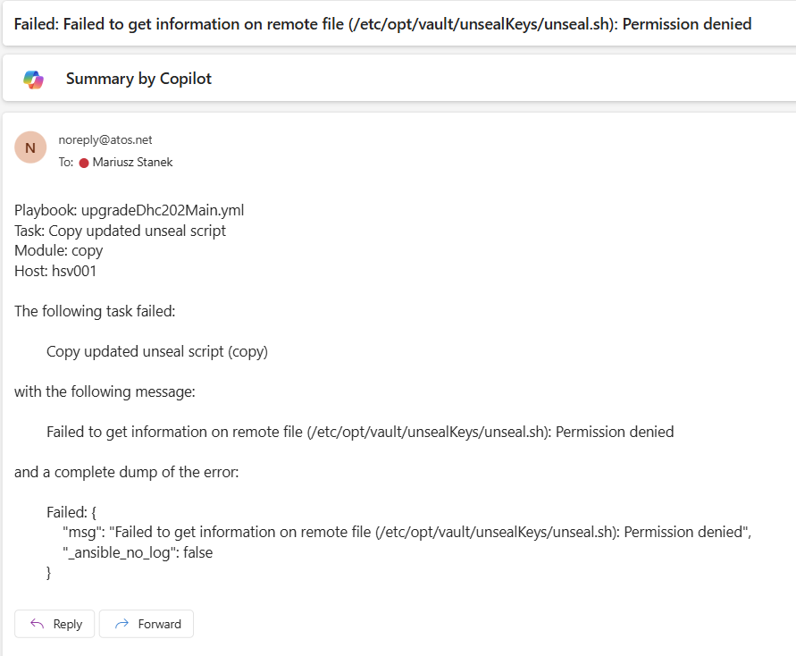
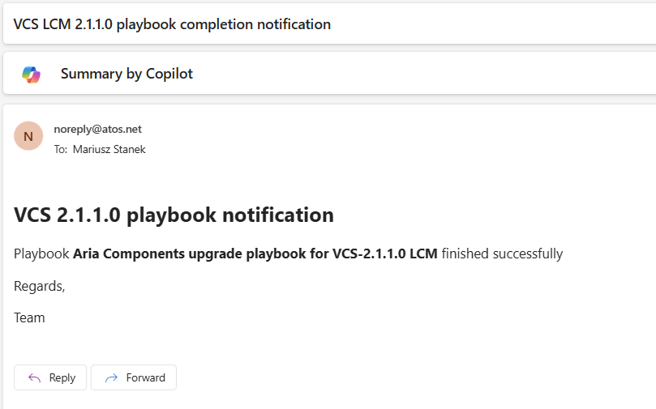

# Automated process of Lifecycle Management - VCS-2.1.1.0

## Table of Contents
  
## List of Changes

| Date       | Issue    | Author          | TOS  | Description |
| ---------- | -------- | --------------- | ---- | --------------------- |
| 05/11/2025 | VCS-15983 | Mariusz Stanek |      | Initial version |
| 12/11/2025 | VCS-17711 | Mariusz Stanek |      | Final version |
| 09/12/2025 | VCS-17947 | Mariusz Stanek |      | Rename from lifecycleUpdatePrereq.sh to lifecycleUpdatePrereq2110.sh |
| 11/12/2025 | VCS-17952 | Mariusz Stanek |      | Include Aria Operations for Logs Agents update |
| 27/01/2026 | VCS-18056 | Mariusz Stanek |      | Additional flags added for more code control |  

## Introduction

This document describes automated process of Lifecycle Management from VCS-2.0.1 to VCS-2.1.1.0.

## Scope

Scope of this Work Instruction covers whole process of updating VCS from version 2.0.1 to 2.1.1.0 in automated fashion:

- Update of apiUrl.yml file
- Binaries download.
- SDDC manager upgrade to 5.2.1.2.
- Aria Suite Components upgrade:
  - Aria Lifecycle Manager PSPACK5 for 8.18.0.
  - Aria Operations to 8.18.3.
  - Aria Operations for Logs to 8.18.3.
  - Aria Automation to 8.18.1.
  - Aria Automation to 8.18.1 Patch 2.
- Aria Operations for Logs Agents update.
- Alcatraz Scanner update:
  - For windows to 5.3.3.4.
  - For linux to 8.2.36.
- Hashi Vault patching to the latest.  

## Related Documents

| Document |
| -------- |
| none |

## Prerequisites

- It is expected the upgrade is performed by a person(s) with expert knowledge in VMware, Linux and VCS solution. Engineers must have sufficient privileges.
- Image backups are created and available.
- All accounts are valid (not locked due, for example expired password).
- The playbooks mentioned in this work instruction, unless otherwise specified (for example user *next*), are executed by an engineer logged in with their dedicated domain account.

## Release notes

1. [VMware Cloud Foundation 5.2.1 Release Notes](https://techdocs.broadcom.com/us/en/vmware-cis/vcf/vcf-5-2-and-earlier/5-2/vcf-release-notes/vmware-cloud-foundation-521-release-notes.html)
2. [VMware Aria Suite Lifecycle 8.18 Product Support Pack Release Notes](https://techdocs.broadcom.com/us/en/vmware-cis/aria/aria-suite-lifecycle/8-18/release-notes/vmware-aria-suite-lifecycle-818-product-support-pack-release-notes.html)
3. [VMware Aria Operations 8.18.3 Release Notes](https://techdocs.broadcom.com/us/en/vmware-cis/aria/aria-operations/8-18/vmware-aria-operations-8183-release-notes.html)
4. [VMware Aria Operations for Logs 8.18.3 Release Notes](https://techdocs.broadcom.com/us/en/vmware-cis/aria/aria-operations-for-logs/8-18/vmware-aria-operations-for-logs-8183-release-notes.html)
5. [VMware Aria Automation Release Notes](https://techdocs.broadcom.com/us/en/vmware-cis/aria/aria-automation/8-18/vmware-aria-automation-release-notes.html)
6. [VMware Aria Automation 8.18.1 Cumulative Update #2](https://knowledge.broadcom.com/external/article/394224)

## Mandatory Extra Vars

Upgrade playbook requires some extra vars to be provided during playbook execution. Most convenient way of supplying these extra vars is by putting them in a .json file. Below is the list of mandatory extra vars parameters already in the json format. Copy this content into new .json file on the ans001 server where the playbook will be executed, i.e. vars.json and fill in all the parameters. File can be stored in your home directory or anywhere else where ansible can access it and read it.

```json
{
  "vcfBundleDownloadToken": "insert vcfBundleDownloadToken temporary and remove after upgrade",
  (optional)"depotUser": "insert depot user temporary and remove after upgrade",
  (optional)"depotPassword": "insert depot password temporary and remove after upgrade",
  "mailRecipientsList": "email.address@atos.net",
  "run_env": "prod or dev required for Hashi Vault patching",
  (optional)"vaultVersion": "1.xx.xx-1",
  "runPrechecks": true,
  "runSdmBackups": true,
  "configToken": true,
  "configDepot": true,
  "runCredsCheck": true,
  "runCertsCheck": true
}
```

| Variable | Value | Description | Mandatory |
| ---------- | -------- | -------- | -------- |
| vcfBundleDownloadToken | Token | Token required for new way depot connectivity | YES |
| depotUser | Username | Email address of depot user | NO |
| depotPassword | Password | Password for depot user | NO |
| mailRecipientsList | email/email list | Email used for LCM reporting sent to mailbox | YES |
| runPrechecks | true or false | Used to skip prechecks if necessary (to skip known problems) | YES |
| runSdmBackups | true or false | Used to skip SDDC Manager backup if necessary (to skip known problems) | YES |
| runNsxBackups | true or false | Used to skip NSX backup if necessary (to skip known problems) | YES |
| runVcsBackups | true or false | Used to skip vCenter servers backups if necessary (to skip known problems) | YES |
| configToken | true or false | Used to skip SDDC Manager download token configuration if necessary | YES |
| configDepot | true or false | Used to skip SDDC Manager depot configuration if necessary | YES |
| runCredsCheck | true or false | Used to skip credentials validation in SDDC Manager if necessary | YES |
| runCertsCheck | true or false | Used to skip certificates validation in SDDC Manager if necessary | YES |

IMPORTANT NOTE: Optional `depotUser` and `depotPassword` are required if not placed in Hashi Vault (`servers/<location code>lcm001`). Remember to remove these tokens and password after successfull upgrade process. Optional `vaultVersion` is required when specified Hashi Vault patching must be done - by default it is the latest.

## Email notification functionality

Automated upgrade playbook can send email notification upon successful or failed upgrade execution. In order to work it requires providing SRS server FQDN and email notification recipients. Prompts to provide these parameters are described in following sections of this document.

Email notification functionality is based on proper `ansible.cfg` file configuration. Example of required parameters:

```bash
[defaults]
callback_whitelist = profile_tasks, mail
callbacks_enabled = default, mail
[callback_mail]
# SMTP server settings
smtphost = gre25srs001.vx5dhc01.next
sender = noreply@atos.net
to = example.email@atos.net
```

Above parameters allow us to automatically send email notification if any playbook execution will be stopped (failed).



When playbook finishes succesfully then email notification will be also generated:



IMPORTANT NOTE: If you execute playbook with tags then successfull completion email will be only related with part executed for particular tags.

## DHC Version matrix

DHC Version matrix is automatically updated by python script described in following sections of this document.

## Rollback

Rollback is partially possible when snapshot is available for particular upgraded element.

## Upgrade Steps

### Code change and email functionality enablement

In VCS-2.1.1.0 automated upgrade part of steps is done by shell script `lifecycleUpdatePrereq2110.sh`. These steps are:

- Backup ansible code and download code provided by TAG in python prompt. Update, deploy, manage, dhc-collections and version-matrix are automatically upgraded with proper code provided by TAG.
- Configure ansible.cfg file to enable automated email notifications.

To prepare environment for code change and ans001 upgrade login to `ans001` on `next` user and execute below commands:

```bash
cd /opt/dhc/update
git pull
git checkout master-2.0
```

Ensure that file `lifecycleUpdatePrereq2110.sh` is present in `/opt/dhc/update` and execute this file:

```bash
bash  ./lifecycleUpdatePrereq2110.sh
```

Python script will ask to to provide some inputs:

```bash
    "Provide domain username: "
    "Provide domain password (input will be hidden): "
    "Provide Git Username (not the email address): "
    "Provide Git Token (input will be hidden): "
    "Provide DHC Git Tag: "
    "Provide email notification recepients. If more then one use comma (,) to separate: "
    "Provide FQDN of SRS server, ie: gre28srs001.vx8dch01.next: "
```

### Upgrade using upgrade automation

Upgrade process can be done in two scenarios detaily described in Section `Automated upgrade scenarios`.

- First scenario: `all-at-once` - run entire upgrade process in one strike (no ansible tags required).
- Second scenario: `step-by-step` - granular divided into controlled stages (ansible tags required).

To run upgrade using upgrade automation it is required navigate to `/opt/dhc/update` on the `ans001` server and launch upgrade playbook with extra vars parameter and proper ansible tags if you want divide upgrade process into controlled steps.

Apart from extra vars provided in the file, right after launching playbook it will ask for user credentials (username and password). Once these are provided there will be no more user prompts during playbook execution.  

Upgrade process will take few hours, this can be around 5hrs or more depending on environment. Due to that fact make sure your SSH connection to `ans001` server will not be terminated. Configure SSH keep alive packets in your tool of choice for SSH connections. Example: in Putty go to `Connection` and set `Seconds between keepalives` to 60 seconds

## Playbooks structure and ansible TAGs explanation

### Overview

This Section explains structure of playbooks included in `lifecycleUpdateMain.yml` and ansible TAGs implemented in each of them.

### Table of playbooks implemented in lifecycleUpdateMain.yml playbook

- [Update of apiUrl.yml file](#update-of-apiurlyml-file)
- [Get user credentials](#get-user-credentials)
- [Download binaries](#download-binaries)
- [VCF upgrade - SDDC Manager](#vcf-upgrade---sddc-manager)
- [Aria Components upgrade](#aria-components-upgrade)
- [Aria Operations for Logs Agents update](#aria-operations-for-logs-agents-update)
- [Upgrade Alcatraz](#upgrade-alcatraz)
- [HashiVault Component patching](#hashivault-component-patching)

### Update of apiUrl.yml file

**Playbook**: `lifecycleUpdateMain.yml`

**Main TAG**: `APIURL_UPDATE`

#### Playbook overview

Playbook updates apiUrl.yml file with new API entries required for upgrade process.

#### Playbook tags

| Tag name | Description |
| ---------- | -------- |
| none |  |

### Get user credentials

**Playbook**: `lifecycleUpdateMain.yml`  

#### Playbook overview

Playbook prompts the user for `username` and `password` if not already defined for example in extra vars.

#### Playbook tags

| Tag name | Description |
| ---------- | -------- |
| always | It runs each time |

### Download binaries

**Playbook**: `lifecycleUpdateBinaries.yml`

**Main TAG**: `BINARIES`

#### Playbook overview

Playbook downloads binaries required for VCS-2.1.1.0 LCM from S3 according to entries from version-matrix and removes other (not listed in version-matrix) from /data/binaries.

#### Playbook tags

| Tag name | Description |
| ---------- | -------- |
| BINARIES | Downloads binaries from S3 |

### VCF upgrade - SDDC Manager

**Imported Playbook**: `lifecycleUpdateMgmtDomain.yml`

**Main TAG**: `SDM_ALL`

#### Playbook summary

This playbook automates the upgrade and patching of the Software Defined Management (SDM) domain, including SDDC Manager and related components. Tags are used for selective execution and organization of preparation, upgrade, patching, backup, and post-upgrade activities.

#### Playbook Requirements

Depot token credentials for software bundle downloads.

#### Table of tags

| Tag name | Description |
|----------|-------------|
| SDM_ALL | Executes all tasks in playbook |
| SDM_CONFIGURE_DOWNLOAD_TOKEN | Configure download token on SDM |
| SDM_DOWNLOAD_BUNDLE | Download upgrade bundles tasks |
| SDM_UPGRADE_PREP | SDM upgrade preparation tasks |
| SDM_UPGRADE | Main tag for SDM upgrade tasks |

#### Play-by-play explanation

- Set credentials for SDM appliance

  Hosts: localhost

  Tags: always

  Purpose:
  - Ensures SDM credentials are set using atos.dhc.askPassWrapper if not already defined.

- Configure download token on SDM
  
  Hosts: sdm001

  Tags: SDM_ALL, SDM_CONFIGURE_DOWNLOAD_TOKEN, SDM_UPGRADE_PREP

  Purpose:
  - Sets credential variables for SDM.
  - Configures the VCF download token.

- Get SDM API authentication

  Hosts: sdm001, localhost

  Tags: SDM_ALL, SDM_CONFIGURE_DOWNLOAD_TOKEN, SDM_UPGRADE_PREP

  Purpose:
  - Authenticates with SDM to allow further operations.

- Configure VCF download token

  Tags: SDM_ALL, SDM_CONFIGURE_DOWNLOAD_TOKEN, SDM_UPGRADE_PREP
  
  Purpose:
  - Configures the VCF download token for SDM.

- Upgrade Preparation

  - Get SDM API authentication

    Tags: SDM_ALL, SDM_DOWNLOAD_BUNDLE, SDM_UPGRADE_PREP, SDM_UPGRADE

    Purpose: Authenticates for upgrade operations.

  - Get SDM Management domain details

    Tags: SDM_ALL, SDM_DOWNLOAD_BUNDLE, SDM_UPGRADE_PREP, SDM_UPGRADE

    Purpose: Retrieves management domain info.

  - Check Depot Status and reconfigure if needed

    Tags: SDM_ALL, SDM_DOWNLOAD_BUNDLE, SDM_UPGRADE_PREP, SDM_UPGRADE

    Purpose: Ensures depot is ready for bundle downloads.

  - Set sddcUpgradeRequired fact to False

    Tags: SDM_ALL, SDM_DOWNLOAD_BUNDLE, SDM_UPGRADE_PREP, SDM_UPGRADE

    Purpose: Initializes upgrade-required flag.

  - Comparing versions and checking if upgrade is required

    Tags: SDM_ALL, SDM_DOWNLOAD_BUNDLE, SDM_UPGRADE_PREP, SDM_UPGRADE

    Purpose: Compares versions to determine upgrade necessity.

  - Get SDM Management domain details (again)

    Tags: SDM_ALL, SDM_DOWNLOAD_BUNDLE, SDM_UPGRADE_PREP, SDM_UPGRADE

    Purpose: Updates domain info after bundle download.

  - Check SDM for running tasks

    Tags: SDM_ALL, SDM_DOWNLOAD_BUNDLE, SDM_UPGRADE_PREP, SDM_UPGRADE

    Purpose: Ensures no conflicting tasks are running.

  - Get target SDM version from version matrix

    Tags: SDM_ALL, SDM_DOWNLOAD_BUNDLE, SDM_UPGRADE_PREP

    Purpose: Retrieves required dependency bundle.

  - Show sdmDependencyDetails

    Tags: SDM_ALL, SDM_DOWNLOAD_BUNDLE, SDM_UPGRADE_PREP

    Purpose: Displays dependency bundle info.

  - Set sdmBundleId for Dependent bundle

    Tags: SDM_ALL, SDM_DOWNLOAD_BUNDLE, SDM_UPGRADE_PREP

    Purpose: Sets bundle ID for dependency.

  - Download dependency bundle

    Tags: SDM_ALL, SDM_DOWNLOAD_BUNDLE, SDM_UPGRADE_PREP, SDM_UPGRADE

    Purpose: Downloads dependency bundle.

  - Get target SDM version from version matrix (patch bundle)

    Tags: SDM_ALL, SDM_DOWNLOAD_BUNDLE, SDM_UPGRADE_PREP, SDM_UPGRADE

    Purpose: Retrieves required patch bundle.

  - Show sdmPatchDetails

    Tags: SDM_ALL, SDM_DOWNLOAD_BUNDLE, SDM_UPGRADE_PREP, SDM_UPGRADE

    Purpose: Displays patch bundle info.

  - Set sdmBundleId for patch bundle

    Tags: SDM_ALL, SDM_DOWNLOAD_BUNDLE, SDM_UPGRADE_PREP, SDM_UPGRADE

    Purpose: Sets bundle ID for patch.

  - Download Patch bundle

    Tags: SDM_ALL, SDM_DOWNLOAD_BUNDLE, SDM_UPGRADE_PREP, SDM_UPGRADE

    Purpose: Downloads patch bundle.

  - Debug sddcUpgradeRequired

    Tags: SDM_ALL, SDM_DOWNLOAD_BUNDLE, SDM_UPGRADE_PREP, SDM_UPGRADE

    Purpose: Debugs upgrade-required flag.

- SDDC Manager Backup and Upgrade block

  - SDDC Manager backup and snapshot

    Tags: SDM_ALL, SDM_UPGRADE_PREP

    Purpose: Performs backup and snapshot before upgrade.

  - Create patching plan

    Tags: SDM_ALL, SDM_UPGRADE_PREP

    Purpose: Creates patching plan if upgrade is needed.

  - Check all credentials in SDM

    Tags: SDM_ALL, SDM_UPGRADE_PREP

    Purpose: Validates credentials before upgrade.

  - Check all certificates in SDM

    Tags: SDM_ALL, SDM_UPGRADE_PREP

    Purpose: Validates certificates before upgrade.

  - Run SDM pre-upgrade precheck

    Tags: SDM_UPGRADE_PREP, SDM_UPGRADE

    Purpose: Runs pre-upgrade checks for SDDC Manager.

  - Place SDDC Manager in maintenance mode in Aria Ops

    Tags: SDM_UPGRADE

    Purpose: Puts SDDC Manager into maintenance mode.

  - Patch VCF products in a loop

    Tags: SDM_UPGRADE

    Purpose: Patches VCF products in the management domain.

  - Exit SDDC Manager from maintenance mode in Aria Ops

    Tags: SDM_UPGRADE

    Purpose: Returns SDDC Manager to normal operation.

  - Configure VCF download token after upgrade

    Tags: SDM_UPGRADE

    Purpose: Configures download token for further upgrades.

  - Remove depot configuration because of problem after upgrade

    Tags: SDM_UPGRADE

    Purpose: Removes depot configuration if issues are detected.

  - Check Depot Status and reconfigure if needed (post-upgrade)

    Tags: SDM_UPGRADE

    Purpose: Ensures depot is ready for further upgrades.

  - Apply configuration drift

    Tags: SDM_UPGRADE

    Purpose: Applies configuration drift corrections after upgrade.

- Notification

  Tags: SDM_ALL, SDM_DOWNLOAD_BUNDLE, SDM_UPGRADE_PREP, SDM_UPGRADE

  Purpose: Sends notification email after successful playbook run.

### Aria Components upgrade

**Imported Playbook**: `lifecycleUpdateAria.yml`

**Main TAG**: `ARIA_ALL`

#### Playbook summary

This playbook automates the upgrade and patching of VMware Aria Suite components (LCM, Operations, Logs, Automation) for VCS-2.0.2. Tags are used for selective execution and organization of preparation, upgrade, patching, and post-upgrade activities.

##### Playbook requirements

Playbook requires product binaries and patch files for Aria components to be downloaded in previous steps.

#### Table of tags

| Tag name | Description |
| ---------- | -------- |
| ARIA_ALL | Executes all tasks in playbook |
| LCM_VERSION_CHECK | LCM version check tasks |
| LCM_HEALTH_CHECK | LCM health check tasks |
| LCM_IMAGE_UPLOAD | LCM image upload tasks |
| LCM_PSPACK_INSTALL | LCM PSPACK installation tasks |
| OPS_PRESTAGING | Aria Operations prestaging tasks |
| OPS_VERSION_CHECK | Aria Operations version check tasks |
| OPS_HEALTH_CHECK | Aria Operations health check tasks |
| OPS_IMAGE_UPLOAD | Aria Operations image upload tasks |
| OPS_UPGRADE | Aria Operations upgrade tasks |
| VLI_PRESTAGING | Aria Operations for Logs prestaging tasks |
| VLI_VERSION_CHECK | Aria Operations for Logs version check tasks |
| VLI_HEALTH_CHECK | Aria Operations for Logs health check tasks |
| VLI_IMAGE_UPLOAD | Aria Operations for Logs image upload tasks |
| VLI_UPGRADE | Aria Operations for Logs upgrade tasks |
| VRA_PRESTAGING | Aria Automation prestaging tasks |
| VRA_VERSION_CHECK | Aria Automation version check tasks |
| VRA_HEALTH_CHECK | Aria Automation health check tasks |
| VRA_IMAGE_UPLOAD | Aria Automation image upload tasks |
| VRA_UPGRADE | Aria Automation upgrade tasks |
| VRA_PATCH_CHECK | Aria Automation patch check tasks |
| VRA_PATCH_UPLOAD | Aria Automation patch upload tasks |
| VRA_PATCHING | Aria Automation patching tasks |
| TELEGRAF_UPDATE | Telegraf agent update tasks |
| IMAGE_UPLOAD | General image upload tasks |
| PRESTAGING | General prestaging tasks |

#### Detailed Task-by-Task Explanation

- LCM PSPACK Installation Block

  Purpose: Prepare and install the Lifecycle Manager PSPACK, ensuring the environment is ready for upgrades.

  - Get LCM version

    Tags: always, ARIA_ALL, LCM_VERSION_CHECK

    Purpose: Checks the current version of LCM to verify compatibility.

  - LCM check

    Tags: ARIA_ALL, LCM_HEALTH_CHECK, LCM_PSPACK_INSTALL

    Purpose: Verifies LCM health before installation.

  - LCM prep

    Tags: ARIA_ALL, LCM_IMAGE_UPLOAD, LCM_PSPACK_INSTALL

    Purpose: Uploads necessary images for LCM PSPACK installation.

  - Place LCM VM in maintenance mode in Aria Ops

    Tags: ARIA_ALL, LCM_PSPACK_INSTALL

    Purpose: Puts LCM VM in maintenance mode in Aria Operations to safely perform installation.

  - LCM PSPACK installation

    Tags: ARIA_ALL, LCM_PSPACK_INSTALL

    Purpose: Installs the PSPACK on LCM.

  - Exit LCM from maintenance mode in Aria Ops

    Tags: ARIA_ALL, LCM_PSPACK_INSTALL

    Purpose: Returns LCM VM to normal operation in Aria Operations.

  - LCM check (post-install)

    Tags: ARIA_ALL, LCM_PSPACK_INSTALL

    Purpose: Verifies LCM health after installation.

  - Get LCM version (post-install)

    Tags: ARIA_ALL, LCM_PSPACK_INSTALL

    Purpose: Confirms the PSPACK version is correct.

  - Check that version is correct

    No tag (assertion)

    Purpose: Ensures the PSPACK version matches expectations.

- Prestaging Block for Aria Products

  Purpose: Prepare Aria Operations, Logs, and Automation components for upgrade by checking health and uploading binaries/patches.

  - OPS check

    Tags: ARIA_ALL, OPS_PRESTAGING, PRESTAGING

    Purpose: Checks health of Aria Operations.

  - VLI check

    Tags: ARIA_ALL, VLI_PRESTAGING, PRESTAGING

    Purpose: Checks health of Aria Operations for Logs.

  - VRA check

    Tags: ARIA_ALL, VRA_PRESTAGING, PRESTAGING

    Purpose: Checks health of Aria Automation.

  - OPS image upload

    Tags: ARIA_ALL, OPS_PRESTAGING, PRESTAGING, IMAGE_UPLOAD

    Purpose: Uploads product binaries for Operations.

  - VLI image upload

    Tags: ARIA_ALL, VLI_PRESTAGING, PRESTAGING, IMAGE_UPLOAD

    Purpose: Uploads product binaries for Logs.

  - VRA image upload

    Tags: ARIA_ALL, VRA_PRESTAGING, PRESTAGING, IMAGE_UPLOAD

    Purpose: Uploads product binaries for Automation.

  - VRA patch upload

    Tags: ARIA_ALL, VRA_PRESTAGING, PRESTAGING, IMAGE_UPLOAD

    Purpose: Uploads patch binaries for Automation.

- Aria Operations Upgrade Block

  Purpose: Upgrade Aria Operations (vROps) component.

  - OPS Version check

    Tags: always, ARIA_ALL, OPS_VERSION_CHECK

    Purpose: Checks current version of Operations.

  - OPS check

    Tags: ARIA_ALL, OPS_HEALTH_CHECK, OPS_UPGRADE

    Purpose: Verifies Operations health before upgrade.

  - OPS image upload

    Tags: ARIA_ALL, OPS_IMAGE_UPLOAD, OPS_UPGRADE

    Purpose: Uploads product binaries for upgrade.

  - Place Aria Operations VMs in maintenance mode in Aria Ops

    Tags: ARIA_ALL, OPS_UPGRADE

    Purpose: Puts Operations VMs in maintenance mode in Aria Operations.

  - OPS upgrade

    Tags: ARIA_ALL, OPS_UPGRADE

    Purpose: Performs the upgrade.

  - Exit Aria Operations from maintenance mode in Aria Ops

    Tags: ARIA_ALL, OPS_UPGRADE

    Purpose: Returns Operations VMs to normal operation.

  - Post upgrade OPS check

    Tags: ARIA_ALL, OPS_UPGRADE

    Purpose: Verifies Operations health after upgrade.

  - OPS Version check (post-upgrade)

    Tags: ARIA_ALL, OPS_UPGRADE

    Purpose: Confirms upgrade version.

  - Check that version is correct

    No tag (assertion)

    Purpose: Ensures Operations version matches expectations.

  - Update Telegraf agents

    Tags: ARIA_ALL, TELEGRAF_UPDATE

    Updates Telegraf monitoring agents after Aria Operations upgrade.

- Aria Operations for Logs Upgrade Block

  Purpose: Upgrade Aria Operations for Logs (vRLI) component.

  - VLI Version check

    Tags: always, ARIA_ALL, VLI_VERSION_CHECK

    Purpose: Checks current version of Aria Operations for Logs.

  - VLI check

    Tags: ARIA_ALL, VLI_HEALTH_CHECK, VLI_UPGRADE

    Purpose: Verifies Aria Operations for Logs health before upgrade.

  - VLI image upload

    Tags: ARIA_ALL, VLI_IMAGE_UPLOAD, VLI_UPGRADE

    Purpose: Uploads product binaries for upgrade.

  - Place Aria Operations for Logs VMs in maintenance mode in Aria Ops

    Tags: ARIA_ALL, VLI_UPGRADE

    Purpose: Puts Aria Operations for Logs VMs in maintenance mode in Aria Operations.

  - VLI upgrade

    Tags: ARIA_ALL, VLI_UPGRADE

    Purpose: Performs the upgrade.

  - Exit Aria Operations for Logs from maintenance mode in Aria Ops

    Tags: ARIA_ALL, VLI_UPGRADE

    Purpose: Returns Aria Operations for Logs VMs to normal operation in Aria Operations.

  - VLI post upgrade check

    Tags: ARIA_ALL, VLI_UPGRADE

    Purpose: Verifies Aria Operations for Logs health after upgrade.

  - VLI Version check (post-upgrade)

    Tags: ARIA_ALL, VLI_UPGRADE

    Purpose: Confirms upgrade version.

  - Check that version is correct

    No tag (assertion)

    Purpose: Ensures Aria Operations for Logs version matches expectations.

- Aria Automation Upgrade Block
  
  Purpose: Upgrade Aria Automation (vRA) component.

  - VRA Version check

    Tags: always, ARIA_ALL, VRA_VERSION_CHECK

    Purpose: Checks current version of Automation.

  - VRA check

    Tags: ARIA_ALL, VRA_HEALTH_CHECK, VRA_UPGRADE

    Purpose: Verifies Automation health before upgrade.

  - VRA image upload

    Tags: ARIA_ALL, VRA_IMAGE_UPLOAD, VRA_UPGRADE

    Purpose: Uploads product binaries for upgrade.

  - Place Aria Automation VMs in maintenance mode in Aria Ops

    Tags: ARIA_ALL, VRA_UPGRADE

    Purpose: Puts Automation VMs in maintenance mode in Aria Operations.

  - VRA upgrade

    Tags: ARIA_ALL, VRA_UPGRADE

    Purpose: Performs the upgrade.

  - Exit Aria Automation from maintenance mode in Aria Ops

    Tags: ARIA_ALL, VRA_UPGRADE

    Purpose: Returns Automation VMs to normal operation.

  - VRA check (post-upgrade)

    Tags: ARIA_ALL, VRA_UPGRADE

    Purpose: Verifies Automation health after upgrade.

  - VRA Version check (post-upgrade)

    Tags: ARIA_ALL, VRA_UPGRADE

    Purpose: Confirms upgrade version.

  - Check that version is correct

    No tag (assertion)

    Purpose: Ensures Automation version matches expectations.

- Aria Automation Patch Block

  Purpose: Patch Aria Automation (vRA) component.

  - VRA Patch check

    Tags: always, ARIA_ALL, VRA_PATCH_CHECK

    Purpose: Checks for required patches.

  - VRA check

    Tags: ARIA_ALL, VRA_HEALTH_CHECK, VRA_PATCHING

    Purpose: Verifies Automation health before patching.

  - VRA Patch image upload

    Tags: ARIA_ALL, VRA_PATCH_UPLOAD, VRA_PATCHING

    Purpose: Uploads patch binaries.

  - Place Aria Automation VMs in maintenance mode in Aria Ops

    Tags: ARIA_ALL, VRA_PATCHING

    Purpose: Puts Automation VMs in maintenance mode in Aria Operations.

  - VRA upgrade (patch)

    Tags: ARIA_ALL, VRA_PATCHING

    Purpose: Applies patches.

  - Exit Aria Automation from maintenance mode in Aria Ops

    Tags: ARIA_ALL, VRA_PATCHING

    Purpose: Returns Automation VMs to normal operation in Aria Operations.

  - VRA check (post-patch)

    Tags: ARIA_ALL, VRA_PATCHING

    Purpose: Verifies Automation health after patching.

  - VRA Patch check (post-patch)

    Tags: ARIA_ALL, VRA_PATCH_CHECK

    Purpose: Confirms patch installation.

  - Check that version is correct

    No tag (assertion)

    Purpose: Ensures patch is visible in LCM patch history.

- Notification

  Tags: ARIA_ALL, LCM_VERSION_CHECK, LCM_HEALTH_CHECK, LCM_PSPACK_INSTALL, LCM_IMAGE_UPLOAD, OPS_PRESTAGING, PRESTAGING, IMAGE_UPLOAD, VLI_PRESTAGING, VRA_PRESTAGING, OPS_VERSION_CHECK, OPS_HEALTH_CHECK, OPS_UPGRADE, OPS_IMAGE_UPLOAD, TELEGRAF_UPDATE, VLI_VERSION_CHECK, VLI_HEALTH_CHECK, VLI_UPGRADE, VLI_IMAGE_UPLOAD, VRA_VERSION_CHECK, VRA_HEALTH_CHECK, VRA_UPGRADE, VRA_IMAGE_UPLOAD, VRA_PATCH_CHECK, VRA_PATCHING, VRA_PATCH_UPLOAD
  
  Purpose: Sends notification email after successful playbook run.

### Aria Operations for Logs Agents update

**Imported Playbook**: `lifecycleUpdateVrliAgents.yml`

**Main TAG**: `VLI_AGENTS_UPDATE`

#### Playbook summary

This playbook automates the upgrade of Aria Operations for Logs Agents on VMs.

#### Playbook Requirements

none

#### Table of tags

| Tag name | Description |
|----------|-------------|
| VLI_AGENTS_UPDATE | Executes all tasks in playbook |

#### Play-by-play explanation

- Checks if Aria Operations for Logs is already upgraded

  Hosts: localhost

  Tags: VLI_AGENTS_UPDATE

  Purpose:
  - Checks if Aria Operations for Logs is already upgraded

- Update Aria Operations for Logs agents
  
  Hosts: linux, windows, idm, marketplace, ops, vcs, vni, srm, vsr, sddcmanager

  Tags: VLI_AGENTS_UPDATE

  Purpose:
  - Updates Aria Operations for Logs agents.

- Send notification on Aria Operations for Logs Agents update process stop

  Tags: VLI_AGENTS_UPDATE
  
  Purpose: Send notification on Aria Operations for Logs Agents update process stop

### Upgrade Alcatraz

**Imported Playbook**: `lifecycleUpdateAlcatraz.yml`

**Main TAG**: `ALCATRAZ_ALL`

#### Playbook summary

This playbook automates the upgrade of Alcatraz scanner on management VMs.

#### Playbook Requirements

none

#### Table of tags

| Tag name | Description |
|----------|-------------|
| ALCATRAZ_ALL | Executes all tasks in playbook |
| upgradeAlcatrazLinux | Upgrades Alcatraz on Linux VMs |
| upgradeAlcatrazWindows | Upgrades Alcatraz on Windows VMs |

#### Play-by-play explanation

- Collect Credentials on Localhost

  Hosts: localhost

  Tags: ALCATRAZ_ALL, upgradeAlcatrazLinux, upgradeAlcatrazWindows

  Purpose:
  - Ensures SDM credentials are set using atos.dhc.askPassWrapper if not already defined.

- Update Alcatraz Agents for Linux
  
  Hosts: linux

  Tags: ALCATRAZ_ALL, upgradeAlcatrazLinux

  Purpose:
  - Updates Alcatraz Agents on Linux VMs.

- Update Alcatraz for Windows
  
  Hosts: windows,!rca001

  Tags: ALCATRAZ_ALL, upgradeAlcatrazWindows

  Purpose:
  - Updates Alcatraz Agents on Windows VMs.

- Notification

  Tags: ALCATRAZ_ALL, upgradeAlcatrazWindows, upgradeAlcatrazLinux
  
  Purpose: Sends notification email after successful playbook run.

### HashiVault Component patching

**Imported Playbook**: `lifecycleUpdateHashiVault.yml`

**Main TAG**: `VAULT_ALL`

#### Playbook summary

This playbook automates the patching of HashiVault application.

#### Playbook Requirements

none

#### Table of tags

| Tag name | Description |
|----------|-------------|
| VAULT_ALL | Executes all tasks in playbook |
| VAULT_BACKUP | Executes backup of HashiVault |
| VAULT_PATCHING | Executes patching only |

#### Play-by-play explanation

- Export HashiVault content

  Hosts: hsv001

  Tags: VAULT_ALL, VAULT_BACKUP

  Purpose:
  - Ensures credentials are set using atos.dhc.askPassWrapper if not already defined and exports content from Vault.

- Providing temporary access to ans01 account
  
  Hosts: adc001

  Tags: VAULT_ALL, VAULT_PATCHING

  Purpose:
  - Provides temporary access to ans01 account

- Perform whitelist for pxy002
  
  Hosts: pxy002

  Tags: VAULT_ALL, VAULT_PATCHING

  Purpose:
  - Perform whitelist for pxy002.

- Perform whitelist for pxy003
  
  Hosts: pxy003

  Tags: VAULT_ALL, VAULT_PATCHING

  Purpose:
  - Perform whitelist for pxy003.

- Upgrade HashiCorp Vault
  
  Hosts: hsv001

  Tags: VAULT_ALL, VAULT_PATCHING

  Purpose:
  - Performs upgrade of HashiVault.

- Remove temporary access from ans01 account
  
  Hosts: adc001

  Tags: VAULT_ALL, VAULT_PATCHING

  Purpose:
  - Removes temporary access to ans01 account

- Notification

  Tags: VAULT_ALL, VAULT_BACKUP, VAULT_PATCHING
  
  Purpose: Sends notification email after successful playbook run.

## Automated upgrade scenarios

### First scenario: all-at-once

#### Before you start

1. Ensure that passwords and certificates are proper in SDDC Manager - upgrade process also checks them but intentionally fails if any of them has some problem.

2. Check if product synchronization between LCM and upgraded components works.

#### Environment preparation

To prepare environment for code change and ans001 upgrade login to `ans001` on `next` user and execute below commands:

```bash
cd /opt/dhc/update
git pull
git checkout master-2.0
```

Ensure that file `lifecycleUpdatePrereq2110.sh` is present in `/opt/dhc/update` and execute this file:

```bash
bash  ./lifecycleUpdatePrereq2110.sh
```

You will see output similar to below when script runs:

```bash
(1040-std) next@nes34ans001:/opt/dhc/update$ bash ./lifecycleUpdatePrereq2110.sh
Copying script to /tmp...
🔧 Running: cp /data/dhc/update/lifecycleUpdatePrereq2110.sh /tmp/self_runner_Hm6X/lifecycleUpdatePrereq2110.sh
🔧 Running: chmod +x /tmp/self_runner_Hm6X/lifecycleUpdatePrereq2110.sh
Running from temp. Proceeding with update...
Provide domain username: a581913@devvcs34.next
Provide domain password (hidden):
Provide Git Username: user
Provide Git Token (hidden):
Provide DHC Git Tag: VCS-2.0.0.7-20251013
Provide email recipients (comma-separated): user@atos.net
Provide FQDN of SRS server: nes34srs001.devvcs34.next
🔧 Running: cd /opt/dhc/update
🔧 Running: git remote set-url origin https://user:ghp_<removed>@github.com/GLB-CES-PrivateCloud/DHC-Update
🔧 Running: git fetch
🔧 Running: git checkout master-2.0
Branch 'master-2.0' set up to track remote branch 'master-2.0' from 'origin'.
Switched to a new branch 'master-2.0'
🔧 Running: git pull origin master-2.0
From https://github.com/GLB-CES-PrivateCloud/DHC-Update
 * branch              master-2.0 -> FETCH_HEAD
Already up to date.
🔧 Running: sudo mkdir /data/tmpDhc
🔧 Running: sudo chown next:next /data/tmpDhc
🔧 Running: sudo chmod 0755 /data/tmpDhc
🔧 Running: cp /data/dhc/ /data/tmpDhc/ -r
🔧 Running: sudo rm -rf /data/dhc
🔧 Running: sudo mkdir /data/dhc
🔧 Running: sudo chown next:next /data/dhc
🔧 Running: sudo chmod 0755 /data/dhc
🔧 Running: cd /data
Cloning into '/data/dhc'...
remote: Enumerating objects: 22032, done.
remote: Counting objects: 100% (58/58), done.
remote: Compressing objects: 100% (37/37), done.
remote: Total 22032 (delta 30), reused 45 (delta 21), pack-reused 21974 (from 4)
Receiving objects: 100% (22032/22032), 9.73 MiB | 2.03 MiB/s, done.
Resolving deltas: 100% (13442/13442), done.
Note: switching to 'b1b90c5789370225d91ec821849e78b41b950cde'.

You are in 'detached HEAD' state. You can look around, make experimental
changes and commit them, and you can discard any commits you make in this
state without impacting any branches by switching back to a branch.

If you want to create a new branch to retain commits you create, you may
do so (now or later) by using -c with the switch command. Example:

  git switch -c <new-branch-name>

Or undo this operation with:

  git switch -

Turn off this advice by setting config variable advice.detachedHead to false

Submodule 'deploy' (https://user:ghp_<removed>@github.com/GLB-CES-PrivateCloud/DHC-Deploy.git) registered for path 'deploy'
Submodule 'dhc-collections' (https://user:ghp_<removed>@github.com/GLB-CES-PrivateCloud/DHC-Collections.git) registered for path 'dhc-collections'
Submodule 'firewall' (https://user:ghp_<removed>Q@github.com/GLB-CES-PrivateCloud/DHC-Firewall.git) registered for path 'firewall'
Submodule 'manage' (https://user:ghp_<removed>Q@github.com/GLB-CES-PrivateCloud/DHC-Manage.git) registered for path 'manage'
Submodule 'update' (https://user:ghp_<removed>@github.com/GLB-CES-PrivateCloud/DHC-Update.git) registered for path 'update'
Submodule 'version-matrix' (https://user:ghp_<removed>@github.com/GLB-CES-PrivateCloud/DHC-Version-Matrix.git) registered for path 'version-matrix'
Submodule 'vro-workflows' (https://user:ghp_<removed>@github.com/GLB-CES-PrivateCloud/VRO-Workflows.git) registered for path 'vro-workflows'
Cloning into '/data/dhc/deploy'...
remote: Enumerating objects: 73950, done.
remote: Counting objects: 100% (1366/1366), done.
remote: Compressing objects: 100% (545/545), done.
remote: Total 73950 (delta 1047), reused 829 (delta 820), pack-reused 72584 (from 4)
Receiving objects: 100% (73950/73950), 64.70 MiB | 1.55 MiB/s, done.
Resolving deltas: 100% (41872/41872), done.
Cloning into '/data/dhc/dhc-collections'...
remote: Enumerating objects: 10618, done.
remote: Counting objects: 100% (1313/1313), done.
remote: Compressing objects: 100% (740/740), done.
remote: Total 10618 (delta 795), reused 565 (delta 534), pack-reused 9305 (from 2)
Receiving objects: 100% (10618/10618), 2.90 MiB | 1.05 MiB/s, done.
Resolving deltas: 100% (5267/5267), done.
Cloning into '/data/dhc/firewall'...
remote: Enumerating objects: 680, done.
remote: Counting objects: 100% (174/174), done.
remote: Compressing objects: 100% (68/68), done.
remote: Total 680 (delta 136), reused 106 (delta 106), pack-reused 506 (from 4)
Receiving objects: 100% (680/680), 267.86 KiB | 1.02 MiB/s, done.
Resolving deltas: 100% (387/387), done.
Cloning into '/data/dhc/manage'...
remote: Enumerating objects: 90884, done.
remote: Counting objects: 100% (794/794), done.
remote: Compressing objects: 100% (402/402), done.
remote: Total 90884 (delta 595), reused 407 (delta 391), pack-reused 90090 (from 4)
Receiving objects: 100% (90884/90884), 56.18 MiB | 1.58 MiB/s, done.
Resolving deltas: 100% (60632/60632), done.
Cloning into '/data/dhc/update'...
remote: Enumerating objects: 22347, done.
remote: Counting objects: 100% (1252/1252), done.
remote: Compressing objects: 100% (519/519), done.
remote: Total 22347 (delta 937), reused 757 (delta 733), pack-reused 21095 (from 4)
Receiving objects: 100% (22347/22347), 34.89 MiB | 1.11 MiB/s, done.
Resolving deltas: 100% (14019/14019), done.
Cloning into '/data/dhc/version-matrix'...
remote: Enumerating objects: 1696, done.
remote: Counting objects: 100% (286/286), done.
remote: Compressing objects: 100% (178/178), done.
remote: Total 1696 (delta 184), reused 108 (delta 108), pack-reused 1410 (from 4)
Receiving objects: 100% (1696/1696), 792.26 KiB | 367.00 KiB/s, done.
Resolving deltas: 100% (912/912), done.
Cloning into '/data/dhc/vro-workflows'...
remote: Enumerating objects: 4896, done.
remote: Counting objects: 100% (490/490), done.
remote: Compressing objects: 100% (375/375), done.
remote: Total 4896 (delta 144), reused 146 (delta 85), pack-reused 4406 (from 2)
Receiving objects: 100% (4896/4896), 1.31 MiB | 371.00 KiB/s, done.
Resolving deltas: 100% (2072/2072), done.
Submodule path 'deploy': checked out 'a5a0b8a6ed2fa83020df8c57392335e01a9fba3e'
Submodule path 'dhc-collections': checked out '6ceec0214091dab1e3df8a277a7370b089af96e2'
Submodule path 'firewall': checked out '9d8e5f765ad8acd0680db827130332bb713f20ea'
Submodule path 'manage': checked out '2be9e5767f15a981df8670f6057755faf23a6c8a'
Submodule path 'update': checked out 'd7cfa806d16d7ccaff47d2e6911f17a3d8894b0f'
Submodule path 'version-matrix': checked out 'c56ff466b9d84bb773864e05cd81409bb86b75a5'
Submodule path 'vro-workflows': checked out '5c072987e0e3f1a50248a5ca62fd501328d49997'
🔧 Running: sudo ln -sfn /data/dhc /opt/dhc
🔧 Running: cd /opt/dhc/update

✔ Git update and ansible.cfg modifications completed successfully
(1040-std) next@nes34ans001:/opt/dhc/update$
```

When script finishes successfully then to see new code execute additionally:

```bash
cd ..
cd update/
```

Update directory will be shown as empty without above chnage directory commands execution.

#### Automated upgrade run

- All components upgrade in one run:

```bash
ansible-playbook lifecycleUpdateMain.yml -e "@./vars.json" -vvvv
```

Alternative is to run upgrade by main components in this scenario as below:

- Update apiUrl.yml file:

```bash
ansible-playbook lifecycleUpdateMain.yml -e "@./vars.json" --tags APIURL_UPDATE -vvvv
```

- Download binaries:

```bash
ansible-playbook lifecycleUpdateMain.yml -e "@./vars.json" --tags BINARIES -vvvv
```

- VCF upgrade - SDDC Manager:

```bash
ansible-playbook lifecycleUpdateMain.yml -e "@./vars.json" --tags SDM_ALL -vvvv
```

- Aria Components upgrade:

```bash
ansible-playbook lifecycleUpdateMain.yml -e "@./vars.json" --tags ARIA_ALL -vvvv
```

- Aria Operations for Logs Agents upgrade:

```bash
ansible-playbook lifecycleUpdateMain.yml -e "@./vars.json" --tags VLI_AGENTS_UPDATE -vvvv
```

- Alcatraz upgrade:

```bash
ansible-playbook lifecycleUpdateMain.yml -e "@./vars.json" --tags ALCATRAZ_ALL -vvvv
```

- Hashi Vault patching to the latest.

```bash
ansible-playbook lifecycleUpdateMain.yml -e "@./vars.json" --tags VAULT_ALL -vvvv
```

### Second scenario: step-by-step

In this scenario upgrade process is divided into smaller steps controlled by ansible tags.

#### Before you start

1. Ensure that passwords and certificates are proper in SDDC Manager - upgrade process also checks them but intentionally fails if any of them has some problem.

2. Check if product synchronization between LCM and upgraded components works.

#### Environment preparation

To prepare environment for code change and ans001 upgrade login to `ans001` on `next` user and execute below commands:

```bash
cd /opt/dhc/update
git pull
git checkout master-2.0
```

Ensure that file `lifecycleUpdatePrereq2110.sh` is present in `/opt/dhc/update` and execute this file:

```bash
bash  ./lifecycleUpdatePrereq2110.sh
```

You will see output similar to below when script runs:

```bash
(1040-std) next@nes34ans001:/opt/dhc/update$ bash ./lifecycleUpdatePrereq2110.sh
Copying script to /tmp...
🔧 Running: cp /data/dhc/update/lifecycleUpdatePrereq2110.sh /tmp/self_runner_Hm6X/lifecycleUpdatePrereq2110.sh
🔧 Running: chmod +x /tmp/self_runner_Hm6X/lifecycleUpdatePrereq2110.sh
Running from temp. Proceeding with update...
Provide domain username: a581913@devvcs34.next
Provide domain password (hidden):
Provide Git Username: user
Provide Git Token (hidden):
Provide DHC Git Tag: VCS-2.0.0.7-20251013
Provide email recipients (comma-separated): user@atos.net
Provide FQDN of SRS server: nes34srs001.devvcs34.next
🔧 Running: cd /opt/dhc/update
🔧 Running: git remote set-url origin https://user:ghp_<removed>@github.com/GLB-CES-PrivateCloud/DHC-Update
🔧 Running: git fetch
🔧 Running: git checkout master-2.0
Branch 'master-2.0' set up to track remote branch 'master-2.0' from 'origin'.
Switched to a new branch 'master-2.0'
🔧 Running: git pull origin master-2.0
From https://github.com/GLB-CES-PrivateCloud/DHC-Update
 * branch              master-2.0 -> FETCH_HEAD
Already up to date.
🔧 Running: sudo mkdir /data/tmpDhc
🔧 Running: sudo chown next:next /data/tmpDhc
🔧 Running: sudo chmod 0755 /data/tmpDhc
🔧 Running: cp /data/dhc/ /data/tmpDhc/ -r
🔧 Running: sudo rm -rf /data/dhc
🔧 Running: sudo mkdir /data/dhc
🔧 Running: sudo chown next:next /data/dhc
🔧 Running: sudo chmod 0755 /data/dhc
🔧 Running: cd /data
Cloning into '/data/dhc'...
remote: Enumerating objects: 22032, done.
remote: Counting objects: 100% (58/58), done.
remote: Compressing objects: 100% (37/37), done.
remote: Total 22032 (delta 30), reused 45 (delta 21), pack-reused 21974 (from 4)
Receiving objects: 100% (22032/22032), 9.73 MiB | 2.03 MiB/s, done.
Resolving deltas: 100% (13442/13442), done.
Note: switching to 'b1b90c5789370225d91ec821849e78b41b950cde'.

You are in 'detached HEAD' state. You can look around, make experimental
changes and commit them, and you can discard any commits you make in this
state without impacting any branches by switching back to a branch.

If you want to create a new branch to retain commits you create, you may
do so (now or later) by using -c with the switch command. Example:

  git switch -c <new-branch-name>

Or undo this operation with:

  git switch -

Turn off this advice by setting config variable advice.detachedHead to false

Submodule 'deploy' (https://user:ghp_<removed>@github.com/GLB-CES-PrivateCloud/DHC-Deploy.git) registered for path 'deploy'
Submodule 'dhc-collections' (https://user:ghp_<removed>@github.com/GLB-CES-PrivateCloud/DHC-Collections.git) registered for path 'dhc-collections'
Submodule 'firewall' (https://user:ghp_<removed>Q@github.com/GLB-CES-PrivateCloud/DHC-Firewall.git) registered for path 'firewall'
Submodule 'manage' (https://user:ghp_<removed>Q@github.com/GLB-CES-PrivateCloud/DHC-Manage.git) registered for path 'manage'
Submodule 'update' (https://user:ghp_<removed>@github.com/GLB-CES-PrivateCloud/DHC-Update.git) registered for path 'update'
Submodule 'version-matrix' (https://user:ghp_<removed>@github.com/GLB-CES-PrivateCloud/DHC-Version-Matrix.git) registered for path 'version-matrix'
Submodule 'vro-workflows' (https://user:ghp_<removed>@github.com/GLB-CES-PrivateCloud/VRO-Workflows.git) registered for path 'vro-workflows'
Cloning into '/data/dhc/deploy'...
remote: Enumerating objects: 73950, done.
remote: Counting objects: 100% (1366/1366), done.
remote: Compressing objects: 100% (545/545), done.
remote: Total 73950 (delta 1047), reused 829 (delta 820), pack-reused 72584 (from 4)
Receiving objects: 100% (73950/73950), 64.70 MiB | 1.55 MiB/s, done.
Resolving deltas: 100% (41872/41872), done.
Cloning into '/data/dhc/dhc-collections'...
remote: Enumerating objects: 10618, done.
remote: Counting objects: 100% (1313/1313), done.
remote: Compressing objects: 100% (740/740), done.
remote: Total 10618 (delta 795), reused 565 (delta 534), pack-reused 9305 (from 2)
Receiving objects: 100% (10618/10618), 2.90 MiB | 1.05 MiB/s, done.
Resolving deltas: 100% (5267/5267), done.
Cloning into '/data/dhc/firewall'...
remote: Enumerating objects: 680, done.
remote: Counting objects: 100% (174/174), done.
remote: Compressing objects: 100% (68/68), done.
remote: Total 680 (delta 136), reused 106 (delta 106), pack-reused 506 (from 4)
Receiving objects: 100% (680/680), 267.86 KiB | 1.02 MiB/s, done.
Resolving deltas: 100% (387/387), done.
Cloning into '/data/dhc/manage'...
remote: Enumerating objects: 90884, done.
remote: Counting objects: 100% (794/794), done.
remote: Compressing objects: 100% (402/402), done.
remote: Total 90884 (delta 595), reused 407 (delta 391), pack-reused 90090 (from 4)
Receiving objects: 100% (90884/90884), 56.18 MiB | 1.58 MiB/s, done.
Resolving deltas: 100% (60632/60632), done.
Cloning into '/data/dhc/update'...
remote: Enumerating objects: 22347, done.
remote: Counting objects: 100% (1252/1252), done.
remote: Compressing objects: 100% (519/519), done.
remote: Total 22347 (delta 937), reused 757 (delta 733), pack-reused 21095 (from 4)
Receiving objects: 100% (22347/22347), 34.89 MiB | 1.11 MiB/s, done.
Resolving deltas: 100% (14019/14019), done.
Cloning into '/data/dhc/version-matrix'...
remote: Enumerating objects: 1696, done.
remote: Counting objects: 100% (286/286), done.
remote: Compressing objects: 100% (178/178), done.
remote: Total 1696 (delta 184), reused 108 (delta 108), pack-reused 1410 (from 4)
Receiving objects: 100% (1696/1696), 792.26 KiB | 367.00 KiB/s, done.
Resolving deltas: 100% (912/912), done.
Cloning into '/data/dhc/vro-workflows'...
remote: Enumerating objects: 4896, done.
remote: Counting objects: 100% (490/490), done.
remote: Compressing objects: 100% (375/375), done.
remote: Total 4896 (delta 144), reused 146 (delta 85), pack-reused 4406 (from 2)
Receiving objects: 100% (4896/4896), 1.31 MiB | 371.00 KiB/s, done.
Resolving deltas: 100% (2072/2072), done.
Submodule path 'deploy': checked out 'a5a0b8a6ed2fa83020df8c57392335e01a9fba3e'
Submodule path 'dhc-collections': checked out '6ceec0214091dab1e3df8a277a7370b089af96e2'
Submodule path 'firewall': checked out '9d8e5f765ad8acd0680db827130332bb713f20ea'
Submodule path 'manage': checked out '2be9e5767f15a981df8670f6057755faf23a6c8a'
Submodule path 'update': checked out 'd7cfa806d16d7ccaff47d2e6911f17a3d8894b0f'
Submodule path 'version-matrix': checked out 'c56ff466b9d84bb773864e05cd81409bb86b75a5'
Submodule path 'vro-workflows': checked out '5c072987e0e3f1a50248a5ca62fd501328d49997'
🔧 Running: sudo ln -sfn /data/dhc /opt/dhc
🔧 Running: cd /opt/dhc/update

✔ Git update and ansible.cfg modifications completed successfully
(1040-std) next@nes34ans001:/opt/dhc/update$
```

When script finishes successfully then to see new code execute additionally:

```bash
cd ..
cd update/
```

Update directory will be shown as empty without above chnage directory commands execution.

#### Update apiUrl.yml file

- Update of apiUrl.yml with new API addresses.

  **Customer impact**: NO

```bash
ansible-playbook lifecycleUpdateMain.yml -e "@./vars.json" --tags APIURL_UPDATE -vvvv
```

#### Download binaries

- Download binaries.

  **Customer impact**: NO

```bash
ansible-playbook lifecycleUpdateMain.yml -e "@./vars.json" --tags BINARIES -vvvv
```

#### VCF upgrade - SDDC Manager

- SDDC Manager upgrade.

  **Customer impact**: NO but Environment management affected

```bash
ansible-playbook lifecycleUpdateMain.yml -e "@./vars.json" --tags SDM_ALL -vvvv
```

#### Aria Components upgrade

- Install PSPACK 5 in Aria Suite Lifecycle Manager.

  **Customer impact**: NO

```bash
ansible-playbook lifecycleUpdateMain.yml -e "@./vars.json" --tags LCM_PSPACK_INSTALL -vvvv
```

- Integrate Aria Operations upgrade binaries into Aria Suite Lifecycle Manager.

  **Customer impact**: NO

```bash
ansible-playbook lifecycleUpdateMain.yml -e "@./vars.json" --tags OPS_PRESTAGING -vvvv
```

- Integrate Aria Operations for Logs upgrade binaries into Aria Suite Lifecycle Manager.

  **Customer impact**: NO

```bash
ansible-playbook lifecycleUpdateMain.yml -e "@./vars.json" --tags VLI_PRESTAGING -vvvv
```

- Integrate Aria Automations upgrade binaries and patch into Aria Suite Lifecycle Manager.

  **Customer impact**: NO

```bash
ansible-playbook lifecycleUpdateMain.yml -e "@./vars.json" --tags VRA_PRESTAGING -vvvv
```

- Aria Operations upgrade through Aria Suite Lifecycle Manager.

  **Customer impact**: NO but Environment monitoring affected

```bash
ansible-playbook lifecycleUpdateMain.yml -e "@./vars.json" --tags OPS_UPGRADE -vvvv
```

- Aria Operations Telegraf Agents upgrade through Aria Operations.

  **Customer impact**: NO

```bash
ansible-playbook lifecycleUpdateMain.yml -e "@./vars.json" --tags TELEGRAF_UPDATE -vvvv
```

- Aria Operations for Logs upgrade through Aria Suite Lifecycle Manager.

  **Customer impact**: NO but Environment monitoring affected

```bash
ansible-playbook lifecycleUpdateMain.yml -e "@./vars.json" --tags VLI_UPGRADE -vvvv
```

- Aria Automation upgrade through Aria Suite Lifecycle Manager.

  **Customer impact**: YES - Aria Automation downtime

```bash
ansible-playbook lifecycleUpdateMain.yml -e "@./vars.json" --tags VRA_UPGRADE -vvvv
```

- Aria Automation patching through Aria Suite Lifecycle Manager.

  **Customer impact**: YES - Aria Automation downtime

```bash
ansible-playbook lifecycleUpdateMain.yml -e "@./vars.json" --tags VRA_PATCHING -vvvv
```

#### Aria Operations for Logs Agents upgrade

- Upgrade Aria Operations for Logs Agents on all required VMs.

  **Customer impact**: NO

```bash
ansible-playbook lifecycleUpdateMain.yml -e "@./vars.json" --tags VLI_AGENTS_UPDATE -vvvv
```

#### Alcatraz upgrade

- Upgrade Alcatraz on linux devices.

  **Customer impact**: NO

```bash
ansible-playbook lifecycleUpdateMain.yml -e "@./vars.json" --tags upgradeAlcatrazLinux -vvvv
```

- Upgrade Alcatraz on windows devices.

  **Customer impact**: NO

```bash
ansible-playbook lifecycleUpdateMain.yml -e "@./vars.json" --tags upgradeAlcatrazWindows -vvvv
```

#### Hashi Vault upgrade to the latest

- Upgrade Hashi Vault.

  **Customer impact**: NO but hashi Vault not available during upgrade

```bash
ansible-playbook lifecycleUpdateMain.yml -e "@./vars.json" --tags VAULT_ALL -vvvv
```
