# Avamar Integration

## Changelog

| Version | Date       | Description              | Author(s)       |
| ------- | ---------- | ------------------------ | --------------- |
| 0.1     | 2020-02-06 | Initial draft creation   | Lukasz Kulis |
| 0.2     | 2020-03| After review the following items added/corrected: Table of contents, List of changes table, Purpose, removed "Managed VMs folders" validation,   | Robert Kaminski |
| 0.3     | 2020-03-27 | Changing WI name from integrationDhcCeb.md to wiAvamarIntegration.md. Adopting Inputs and Integration process sections | Robert Kaminski |
| 0.4     | 2020-11-12 | Avamar 19.3 updates | Łukasz Stasiak |
| 0.5 | 2021-05-26 | Add workload domain section DHC-1025 | Kacper Kuliberda |
| 0.6 | 2021-07-02 | Added CBT ABX action section DHC-2323 | Łukasz Stasiak |
| 0.7 | 2021-07-08 | Updated CBT ABX action section DHC-2404 | Łukasz Stasiak |
| 0.8 | 2021-07-21 | Updated Integration process section DHC-2188 | Łukasz Stasiak |

## Introduction

### Purpose

Integrate Avamar backup environment delivered by the Atos CEB team with VCS.

### Audience

- VCS Operations

### Scope

The integration is addressed through automated deployment and configuration of Avamar Proxy servers. Proxies shall be installed on management only or on both workload domains, on the management and compute, depending the initial decision made by Integration Architects.

**Integration adds tags to management virtual servers, they shall be automatically added to backup polices under condition of existing proper configuration on Avamar Server implemented by CEB.**

**Customer Virtual Machines are not added to any backup policies by this integration.**

> **DISCLAIMER!** All screenshots are for illustrative purposes only.

# 1 Prerequisites

## 1.1 Delivered by VCS

VCS build pipeline automates all the prerequisites needed for backup integration. No actions are needed, it is however recommended to go through below list and validate required deliverables.

### 1.1.1 Backup account in vCenter server

Validate the **`backup@vsphere.local`** account is present in vCenter server, added to *backup* role and has defined permissions to vcenter server object and it's children.

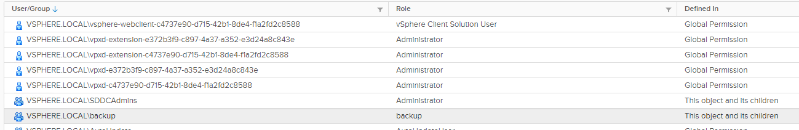

### 1.1.2 vCenter categories and tags are present

Check the default backup tags are defined in the vCenter.

daily1800_3w (daily at 6pm, 3 weeks retention)  
daily1900_3w (daily at 7pm, 3 weeks retention)  
daily2000_3w (daily at 8pm, 3 weeks retention)

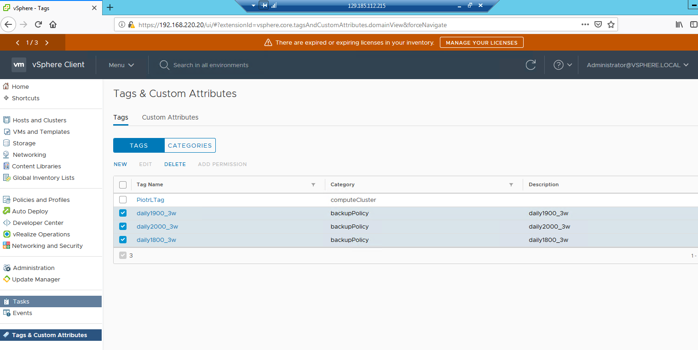

### 1.1.3 vCenter vsan Datastores exists

Check if the VSAN datastores have names that follow the naming convention:

< locationCode >-m01-vsan01  
< locationCode >-c01-vsan01


### 1.1.4 vCenter network exist

Check if the distributed port group named *SDDC-DPortGroup-Mgmt* exists in the management vCenter.

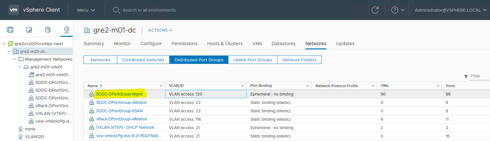

### 1.1.5 Avamar Proxy

All Avamar proxies will be deployed by integration playbook that is using Avamar REST API. In order to execute this playbook MCUser Avamar credentials are required and needs to be delivered by CEB team as mentioned in section 1.2 of this document.

Password for avamar proxy *admin* will be reset by integration playbook and stored in the Password Manager using the following path:

`secrets/secret/< customerCode >/< locationCode >/servers/< locationCode >avp< proxyNumber >/admin`

### 1.1.6 Credentials stored in Password Manager

Login to Hashi Corp Vault with your domain account and check as minimum the following credentials exists:

`secrets/secret/< customerCode >/< locationCode >/servers/< locationCode >vcs001/administrator@vsphere.local`  
`secrets/secret/< customerCode >/< locationCode >/servers/< locationCode >vcs001/backup@vsphere.local`

Above credentials will be used by playbooks.

### 1.1.7 IP addressation and Firewall Rules

Avamar server and proxy appliances use the ip pool range in the local region network from *.68 to .99*

Distributed Firewall Rules must allow traffic between the VMware (vCenter and ESXi hosts) and backup (avamar server, avamar proxies, Data Domain ) infrastructure. They are predefined on NSX-T and imported during VCS hardening process.

## 1.2 Delivered by CEB

**There is a number of configuration that have to be set on the Avamar server in order to make proxies installation and registration successful.**

The below list might help you talk with CEB team to validate mandatory requirements.

### 1.2.1 Both vCenters (MGMT and CMP) are registered in Avamar

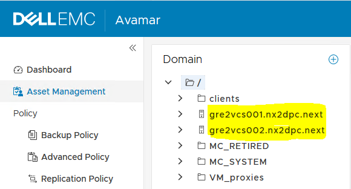

### 1.2.2 Avamar is up, running and fully configured for both vCenters MGMT and CMP

- Datasets

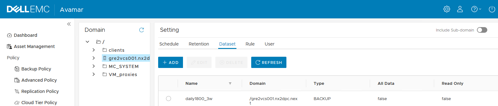

- Schedules

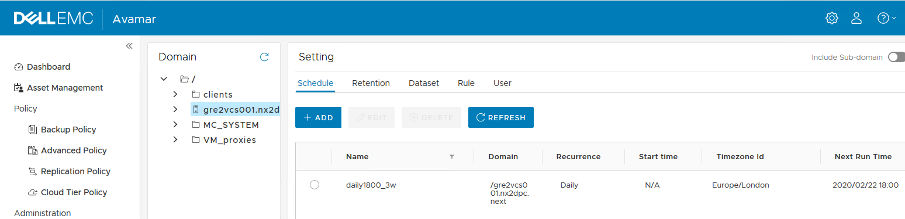

- Retentions

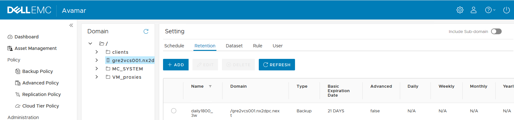

- Rules

 Example list of rules

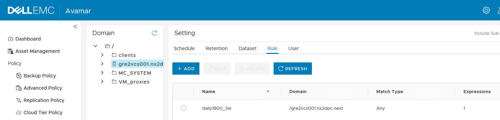

 Rule details

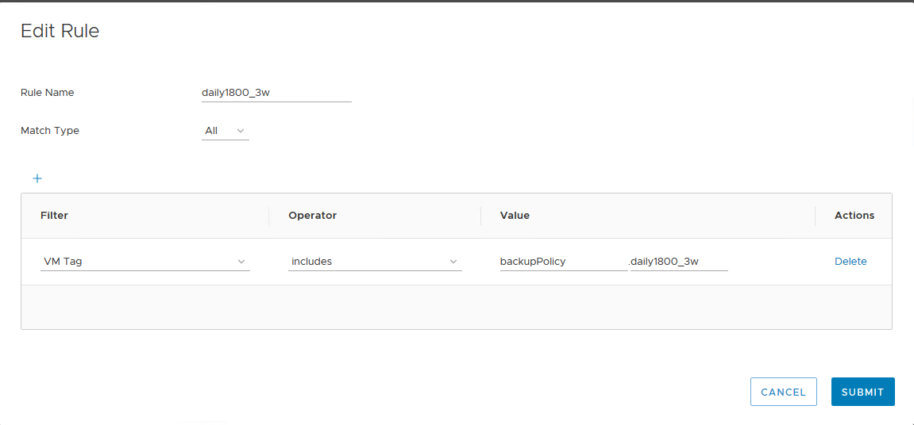

- Policies

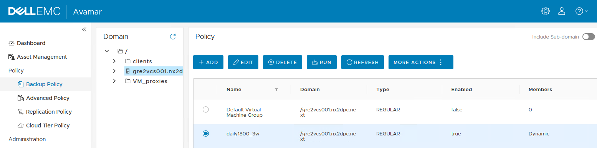

- Automapping field is selected for all backup policies

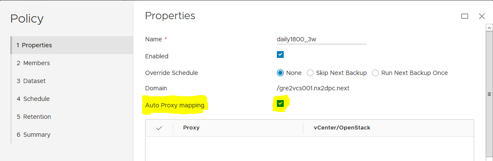

- Enabled dynamic VM import by rule

Configured by Avamar Administrator Console

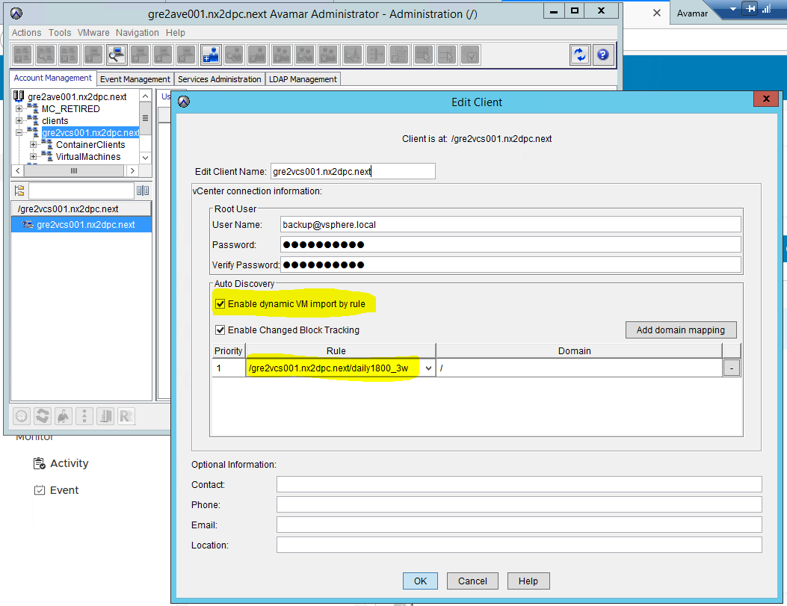

Configured by Avamar Administration Web Interface

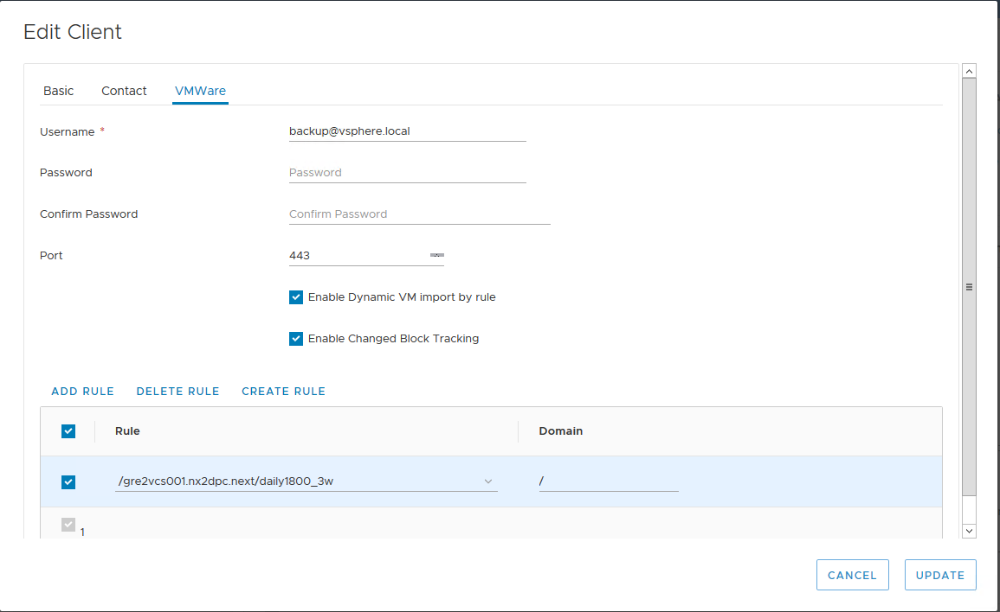

### 1.2.3 /VM_proxies domain is present

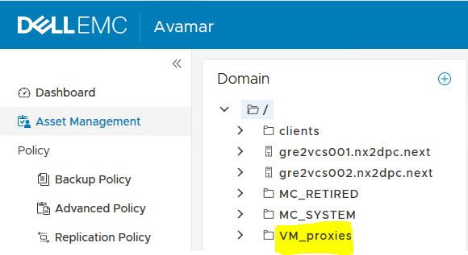

### 1.2.4 Avamar MCUser credentials delivered to VCS team

In order to start the integration playbook Avamar *MCUser* credentials needs to be delivered to the VCS team. Those credentials are used only during integration playbook execution and are not stored anywhere on the VCS infrastructure.

## 1.3 Delivered by Integration Architect

Integration architect is asked to provide a number of values related to backup topic while creating a prerequisite VM. These inputs are listed below. Read description to understand the purpose.

| Name    | Value      | Description              |
| ------- | ---------- | ------------------------ |
| backupAmountofCustomerVms |  |  Number of Avamar Proxy Agents will be installed automatically based on the value. Every 50 VMs will require additional Avamar Proxy Agent  |
| backupAvamarServerFqdn |  | Ask CEB Integration architect to provide a fully qualified domain name of Avamar server  |
| backupAvamarServerIP |  |  Ask CEB Integration architect to provide an IP address of Avamar Server  |
| backupDataDomainFqdn |  |  Ask CEB Integration architect to provide a fully qualified domain name of Data Domain appliance  |
| backupDataDomainIP |  | Ask CEB Integration architect to provide an IP address of Data Domain appliance   |
| backupEnableAvamarBackupofCustomerVms | true |  [true/false] Value true enables Avamar Proxy Agents installation on Customer Workload Domain. False will limit proxy agent installation to management domain only.  |

The values are passed as parameters and stored in `/opt/dhc/manage/group_vars/all` file under `avamar:` section on the ansible server.

See **example from INT** environment.

```yaml
# values provided by VCS and CEB integration architects
avamar: 
  backupAvamarServerFqdn: gre6ave001.nx3dhc01.next
  backupAvamarServerIP: 192.168.40.98
  backupDataDomainFqdn: gre6ddve001.nx3dhc01.next
  backupDataDomainIP: 192.168.40.97
  backupEnableAvamarBackupofCustomerVms: True
  backupAmountofCustomerVms: 150
```

**IF the *avamar* variable section is empty or your suspect has inappropriate values, you must contact VCS Integration or CEB architect. Adjust parameters manually before running an integration process**

Avamar Server and Proxies rely on `/etc/hosts` files for naming resolution, to stay independent from VCS DNS service. The `/etc/hosts` are auto-populated on Avamar Proxy servers based on `avamar` variable sections during integration playbook execution.

# 2. Integration process

**Review and validate pre-requirements paragraph before running an integration playbook. Please keep in mind that tasks to enable CBT on compute and management VMs are part of the Avamar integration and will permanently remove any existing snapshots. Please make sure that there are no used snapshots before running the integration.**

- Login to ansible management server < locationCode >ans001.< searchDomain >

- Change directory to */home/yourdasid*

- Create empty CmpVmList.txt file using following command:
<br>```touch CmpVmList.txt```
<br>Next edit the file and add all existing compute VMs that will be part of the Avamar backup. Each line should contain single VM name as shown on example below. This file will be used by integration scripts to enable CBT feature on existing compute VMs.

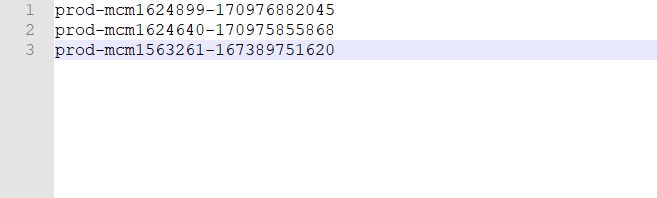

- Change directory to */opt/dhc/manage/*

- Run the command: **ansible-playbook createAvamarProxy.yml**

```yaml
Enter domain username in format dasId@domain.next : axxxxxx@nx3dhc01.next
Enter the password for the user domain. Please note that the password you enter will not be displayed on the screen.
Password:
Enter the MCUser password for Avamar Server. Please note that the password you enter will not be displayed on the screen.
Password:

...
TASK [Print Variables] *********************************************************************************************************************************************************************************************

TASK [dhc-createAvamarProxy : debug] *******************************************************************************************************************************************************************************
ok: [localhost] => {
    "msg": [
        "BEFORE YOU START PROXY DEPLOYMENT PLEASE CHECK IF BELOW VARIABLES ARE CORRECT",
        null,
        "backupAvamarServerFqdn: gre6ave001.nx3dhc01.next",
        "backupAvamarServerIP: 192.168.40.98",
        "backupDataDomainFqdn: gre6ddve001.nx3dhc01.next",
        "backupDataDomainIP: 192.168.40.97",
        "backupEnableAvamarBackupofCustomerVms: True",
        "backupAmountofCustomerVms: 500"
    ]
}

TASK [dhc-createAvamarProxy : Validate variables provided by Integration Architect] ********************************************************************************************************************************
[dhc-createAvamarProxy : Validate variables provided by Integration Architect]
IF YOU AGREE WITH ABOVE VARIABLES PRESS y AND START AVAMAR PROXY DEPLOYMENT. OTHERWISE PLEASE PRESS n. CORRECT VARIABLES AND RERUN ANSIBLE ROLE:
```

In the line above, the ansible role prompts the user to verify whether all the variables are correct.

**IF the variables are empty or you suspect they contain inappropriate values, please hit the "n" key and confirm by pressing the "Enter" key.**

You must contact VCS Integration or CEB architect and adjust parameters manually in `/opt/dhc/manage/group_vars/all`  before running an integration process!  
Press "y" to start avamar proxies installation and configuration.  
ETA: 10-15 minutes per 1 proxy.  

# 3. Post integration

There are several checks to prove the integration is successful.

- Verify that Management VMs dedicated to backup have tags daily1800_3w assigned. Not all VMs are added to backup by design. Exact VM list can be found in Backup LLD.

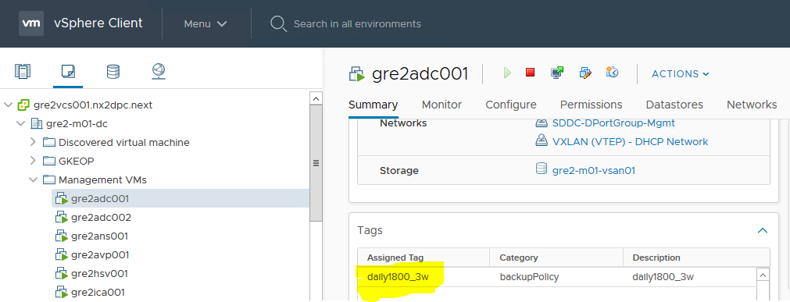

- Ask CEB team if they can start the backup process for daily1800_3w policy and that the process has been initiated successfully.

If the backup started without problems, the backup initiator should return the following popup:

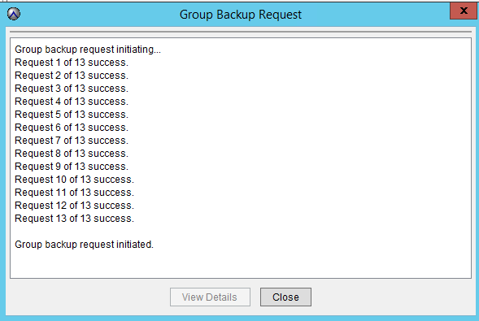

# 4. Integrating Avamar with the Workload Domain

This section covers updating the Service Broker blueprints and forms with backup functionality.  
To perform and test the integration you will need:

- Access to the workload domain vCenter
- Access to VMware Cloud Services on the target customer organization
- A list of backup policies provided by the CEB team (for illustrative purposes, same policies as management are used)

# 4.1 Modifying the blueprint

- Login to VMware Cloud Services
- Open VMware Cloud Assembly
- Choose 'Design'
- Locate the target blueprint to be modified and edit it
- Insert the following lines into the blueprint:

Under the inputs section (tag names for illustrative purposes only, these should match the policies provided by CEB):

```yaml
backupPolicy_tag:
  type: string
  title: backupPolicy_tag
  description: backupPolicy_tag
  enum:
  - daily1800_3w
  - daily1900_3w
  - daily2000_3w
```

Under inputs -> resources -> Cloud_Machine_X(illustrative) -> properties -> tags

```yaml
- key: backupPolicy
  value: '${input.backupPolicy_tag}'
```

See the following example:
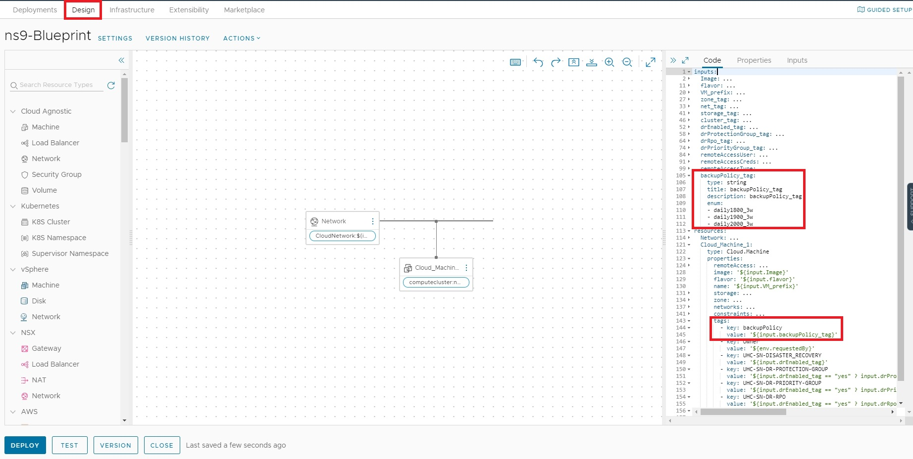

# 4.2 Import enable CBT ABX action

To enable change block tracking feature for a new VMs that will be part of Avamar backup ABX action needs to be imported. Import of CBT ABX action is fully automated. Follow the steps below to run Ansible playbook and import enableCbtAction :

- Login to ans001 using your domain credentials. Change directory to /opt/dhc/manage.
- Run the playbook using following command 'ansible-playbook addCbtAction.yml'
- Enter domain username in format `dasId@domain.next`.
- Enter CAS tenant name for which CBT action should be imported.
- Enter CAS project name that will be used.

Wait for the automation to import the CBT action and create the subscription.

Imported action will be executed each time when new VM with one of the backup tags will be deployed for a given project. To verify if the CBT ABX action was correctly triggered and executed follow the steps below:

- Click on 'Extensibility' and click on 'Actions Runs'
- Find imported action run and confirm that the status is completed
- Click on imported action to open it. Next click on 'Log' to confirm that the script execution was finished successfully

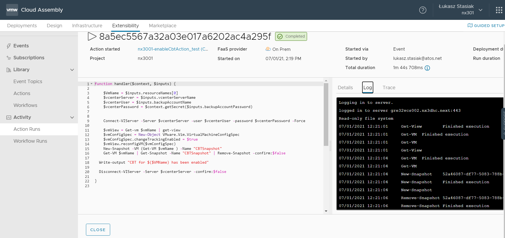
