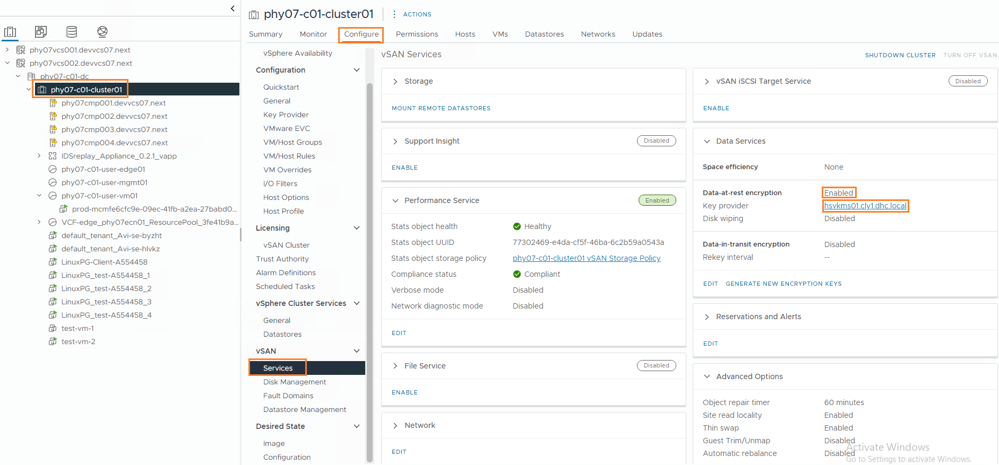
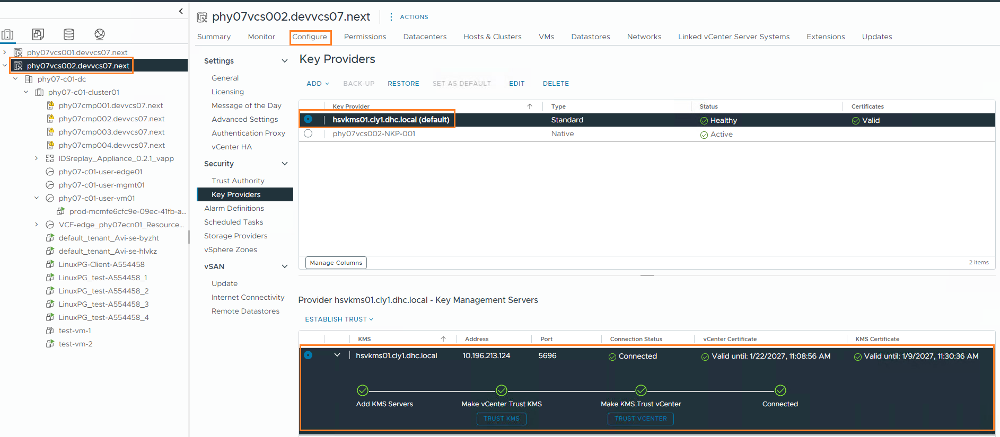
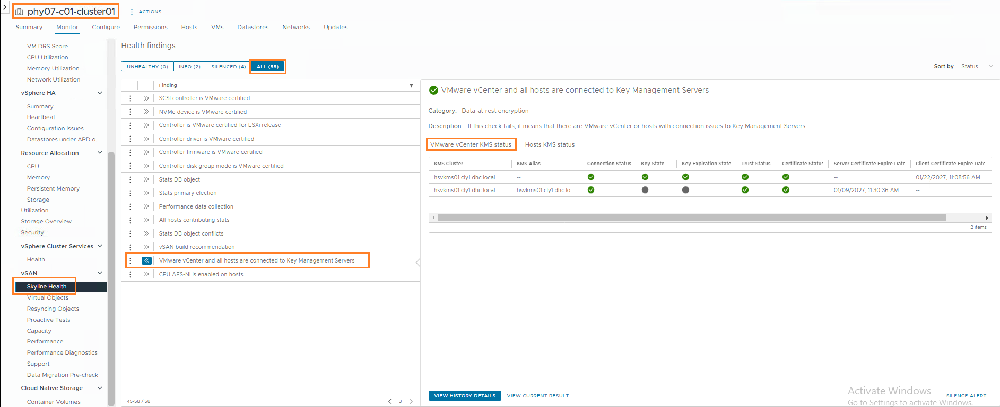
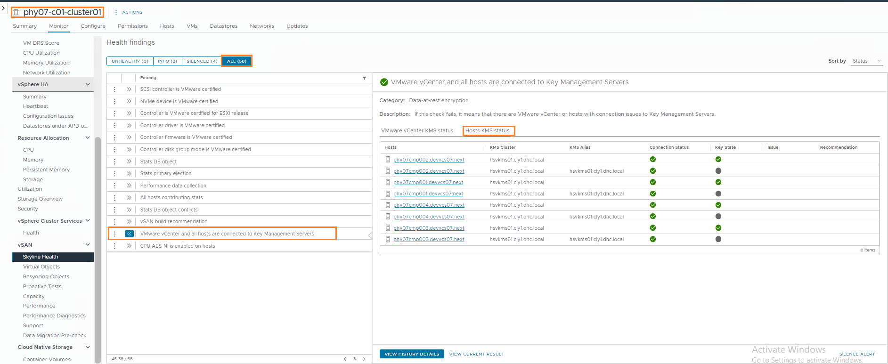

# Operational Runbook and Health Checks

## Table of Contents

- [Changelog](#changelog)
- [Introduction](#introduction)
- [Audience](#audience)
- [Scope](#scope)
- [Related Documents](#related-documents)
- [Operational Responsibility Model](#operational-responsibility-model)
- [Monitoring Overview](#monitoring-overview)
- [Monthly Operational Checklist](#monthly-operational-checklist)
- [Operational Awareness](#operational-awareness)
- [Failure Scenarios and Operational Impact](#failure-scenarios-and-operational-impact)
- [Operational Guidelines and Restrictions](#operational-guidelines-and-restrictions)

---

## Changelog

| Date       | Issue     | Author        | Description                                  |
|------------|-----------|---------------|----------------------------------------------|
| 2026-01-27 | VCS-18058 | Mihai Radan   | Initial draft – BYOK operational health checks |

---

## Introduction

This document defines **operational health checks, monitoring expectations, and
failure impact awareness** for **Customer Self-Managed Encryption Keys (BYOK)**
integrated with VMware Cloud Services (VCS).

The goal is to ensure that **DevSecOps and Operations teams** can proactively
identify conditions that may impact **vSAN Data-At-Rest Encryption (DARE)** and
respond correctly to **KMS availability issues**, preventing service disruption.

This document complements the BYOK Low Level Design and Work Instructions.

---

## Audience

- DevSecOps teams
- VCS Operations teams
- Platform Engineering

---

## Scope

This document covers:

- Operational monitoring of customer-managed KMS availability
- Monthly health check procedures
- Failure scenarios and their operational impact
- Alert escalation and incident handling

This document does **not** cover:

- KMS deployment or configuration
- Encryption enablement procedures
- Customer internal KMS monitoring

---

## Related Documents

| Document |
|---------|
| [BYOK Low Level Design](../design/lldCustomerSelfManagedEncryptionKeys.md) |
| [BYOK Work Instruction](wiCustomerSelfManagedEncryptionKeys.md) |
| [BYOK Onboarding Procedure](onboardingCustomerManagedKMS.md) |

---

## Operational Responsibility Model

| Component | Responsibility |
|---------|----------------|
| Customer KMS internal health | Customer |
| KMS reachability from vCenter / ESXi | VCS |
| vSAN Data-At-Rest Encryption state | VCS |
| Certificate lifecycle and expiration | Shared |
| Key lifecycle operations | Shared |

The VCS platform **does not monitor the internal health** of the customer KMS,
but monitors its **availability and impact on platform services**.

---

## Monitoring Overview

Monitoring is based on native VMware health checks related to external KMS integration, which are aggregated and escalated through the VCS monitoring stack.

Primary monitoring components:

- vSphere and vSAN Skyline Health
- VMware Aria Operations (vROps)
- ServiceNow (incident management)

Any degradation in KMS connectivity generates alerts in vROps and results in an operational incident via ServiceNow.

---

## Monthly Operational Checklist

**Performed by:** DevSecOps  
**Frequency:** Monthly, and before planned maintenance activities

### 1. vSAN Data-at-Rest encryption is enabled

Verify in **Cluster > Configure > vSAN > Services**:

- **Data-at-rest encryption:** Enabled
- **Key Provider:** Matches the expected customer-managed KMS

**Desired state example:**

### 2. vCenter Key Provider Health

Verify in **vCenter > Configure > Key Providers**:

- KMS connection status: **Connected**
- Trust status: **Trusted**
- No certificate warnings or errors

**Desired state example:**

### 3. vSAN Skyline Health Checks

Verify in **Cluster > Monitor > vSAN > Skyline Health > ALL > VMware vCenter and all hosts are connected to Key Management Servers**

- *VMware vCenter KMS status* is not reporting any error

  - Review:

    - Connection Status
    - Key State
    - Key Expiration State
    - Trust Status
    - Certificate status and expiration dates

**Desired state example:**

- *Host KMS status* is not reporting any error

  - Review:

    - Connection Status
    - Key State

**Desired state example:**

### 4. Additional Troubleshooting Reference

For additional details on how VMware evaluates and reports KMS health signals and how they map
to specific failure states, see the VMware Knowledge Base article:

- [VMware KB326514: vCenter and all hosts are connected to Key Management Services health check](https://knowledge.broadcom.com/external/article?articleNumber=326514)

---

## Operational Awareness

The BYOK design includes **security best-practice recommendations** that require
ongoing operational awareness to prevent service disruption.

The following items are defined in the **BYOK Low Level Design** and are **not
enforced automatically** by the platform. Failure to observe these practices
may result in degraded encryption operations or service impact.

### Encryption Key Rotation

Encryption key rotation is a **shared responsibility** between the VCS platform
and the customer-managed KMS.

- **VCS responsibility**
  - Initiates key rotation (rekey) operations from vCenter
  - Orchestrates re-encryption of vSAN and VM data
  - Monitors task execution and reports operational status

- **Customer responsibility**
  - Generates and manages encryption keys within the KMS
  - Enforces key policies, retention, and audit requirements
  - Ensures KMS availability during key rotation operations

A **minimum key rotation period of 1 year** is recommended as a security best
practice, as defined in the BYOK Low Level Design.

### KMS Certificate Validity

KMS certificates used for vCenter trust establishment are **customer-provided**
and require active lifecycle management.

- Certificates SHOULD have an expiration period of **at least 1 year**
- Certificate renewal is the **customer’s responsibility**
- Updated certificates must be delivered to VCS **before expiration**
- Expired certificates may result in:

  - Loss of trust between vCenter and KMS
  - Blocked key lifecycle operations (e.g. rekey)
  - Encryption management errors reported in vCenter and vROps

Operational teams MUST monitor certificate status and coordinate with the
customer to ensure certificates are renewed proactively.

### KMS Certificate Storage

Customer-provided KMS trust certificates and private keys are stored
in **CyberArk**, in a dedicated team safe.

- Access to the CyberArk Safe is restricted to **authorized personnel only**
- **During certificate renewal, updated certificates and keys MUST be uploaded
  to the same CyberArk Team Safe**
- Periodic access reviews SHOULD be performed to ensure continued compliance

---

## Failure Scenarios and Operational Impact

The table below defines **when KMS unavailability becomes operationally critical**.

### KMS Availability Impact Matrix

| Scenario | TPM Present | Host Reboot | KMS Available | Impact | Operational Risk |
|--------|-------------|-------------|---------------|--------|------------------|
| KMS outage | Yes | No | No | No impact | Low |
| KMS outage | Yes | Yes | No | No impact | Low |
| KMS outage | No | No | No | No immediate impact | Medium |
| KMS outage | No | Yes | No | Disk groups fail to mount | High |
| KMS outage | Any | Any | No | Rekey operations blocked | Medium |
| KMS outage | Any | Any | No | VM Encryption enable blocked | Medium |
| KMS restored | N/A | N/A | Yes | Normal operations resume | Normal |

> **Note:**  
> vCenter outages do not introduce additional risk when vSAN Data-At-Rest Encryption (DARE) is enabled.
> Encryption enforcement and data access are handled at the ESXi host level,
> and running workloads continue to operate according to standard vSphere
> behavior.

### Key Risk Condition

If **KMS is unavailable** and **ESXi hosts without TPM are rebooted**, encrypted
disk groups **cannot be unlocked**, leading to potential service disruption.

> **Note:**  
> During a KMS outage, **existing virtual machines remain accessible**
> and **new virtual machines can still be provisioned** on vSAN datastores with
> Data-At-Rest Encryption enabled.  
> vSAN DARE continues to encrypt data at the storage layer using cached keys,
> as long as ESXi hosts are not rebooted without TPM support.

---

## Operational Guidelines and Restrictions

During KMS unavailability:

- **DO NOT reboot ESXi hosts** unless TPM presence is confirmed
- **DO NOT perform key rotation**
- **AVOID maintenance activities** impacting host availability

If KMS unavailability is detected:

- Escalate to customer immediately
- Track recovery through ServiceNow

---
