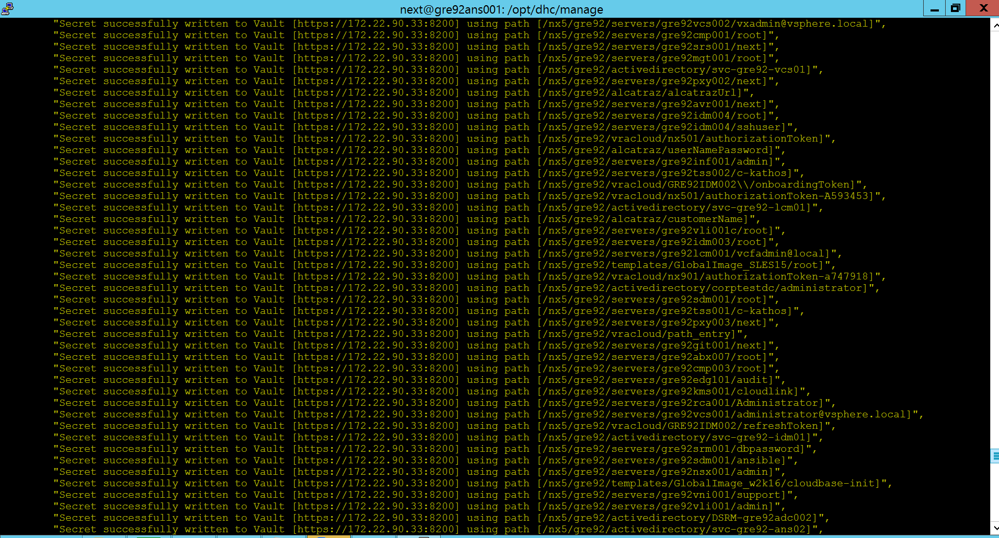
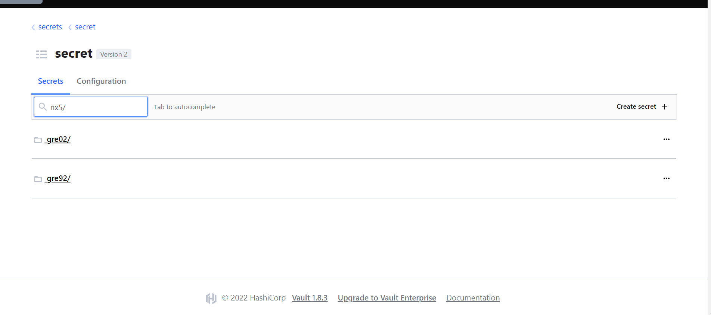

# Table of Contents

- [Table of Contents](#table-of-contents)
  - [Changelog](#changelog)
  - [Introduction](#introduction)
    - [Purpose](#purpose)
    - [Audience](#audience)
    - [Scope](#scope)
  - [Requirements](#requirements)
  - [Prerequisites](#prerequisites)
  - [CrossSiteVaultBackup](#crosssitevaultbackup)
    - [crosssiteHashiVaultBackup.yml](#crosssitehashivaultbackupyml)

## Changelog

 |    Date    | Issue   | Author | Description |
 |------------|---------|-----------|--------|
 | 28.09.2022 |   CESVXR-731      | Divyaprakash J | WI for cross-site-vault-credentails-backup|

## Introduction

### Purpose

Export secrets from one site's vault server to another site's vault server belonging to the same customer.

### Audience

- VCS Engineers
- VCS Operations

### Scope

Both the source and target VCS sites should belong to the same customer.
Export the credentials from one vault site to another vault site under the same customer's respective location code.

## Requirements

- HashiVault servers in source and target site up and running.
- HTTPS and TCP8200 traffic allowed from ansible server (ans001) of source site to HashiVault server of target site at the physical firewall.
- Service account of <b> svc-{{ locationCode }}-ans03 </b> under active directory in both sites.

## Prerequisites

- For both the source and the target sites, the user needs valid domain credentials.
- Users should know the IP of the vault server on the target site and the location code of the target site.

## CrossSiteVaultBackup

### crosssiteHashiVaultBackup.yml

 This playbook is used to exports all credentials from HashiVault.

 <b>Run playbook using command "ansible-playbook crosssiteHashiVaultBackup.yml -vvv". Provide below inputs to playbook </b>

- <b>username</b>: Provide the domain username in the  format `login@domain.next` for source site <br>
- <b>password</b>: Provide the domain password for source site <br>
- <b>targetSitevaultIp</b>: Provide the HashiVault IP address of the target site's vault server<br>
- <b>username_target</b>: Provide the domain username in the  format `login@domain.next` for target site <br>
- <b>password_target</b>: Provide the domain password for target site <br>
- <b>locationcode_target</b>: Provide the location code of target site  <br>

CrossVaultsite replication - crosssiteHashiVaultBackup.yml

```yaml
---
---
- name: Cross-Site HashiVault Backup
  hosts: localhost
  gather_facts: no
  vars:
   HashiVault_Backup: HashiVault_Backup_{{ "%d %b %Y" | strftime }}_
  vars_prompt:
    - name: username
      prompt: "Enter domain username in the  format login@domain.next for source site"
      private: no
      
    - name: password
      prompt: "Enter password"
      private: yes
      unsafe: yes

    - name: targetSitevaultIp
      prompt: "Enter HashiVault IP address of target site."
      private: no
     
    - name: username_target
      prompt: "Enter domain username in the format login@domain.next for target site"
      private: no
    
    - name: password_target
      prompt: "Enter password"
      private: yes
      
    - name: locationcode_target
      prompt: "Enter location code of target site."
      private: no
              
  tasks:
  
    - name: Fetch the root token of source site
      include_role:
        name: dhc-manageVaultMedusa
        tasks_from: fetchtoken
        
    - name: Execute Vault export role
      include_role:
        name: dhc-manageVaultMedusa
        tasks_from: exportHashiVault_credentials
    
    - name: Execute Vault import role
      include_role:
        name: dhc-manageVaultMedusa
        tasks_from: importHashiVault_credentials
```

All secrets from the source site are copied to the destination site's vault server under its specific location code after a playbook is successfully executed.

Import summary of playbook execution as below.



Below is screenshot of NX5 hashivault. Credentials from source site NX5/gre92 are copied to NX5/gre02 hashivault server.



<b>NOTE:</b>

- Same playbook can be used to backup credentials from  target site hashi vault to source site hashivault.
- This playbook should be executed after passwords are rotated on a VCS instance to make sure updated credentials are backed up to another VCS site.
