# VCS Catalog - Deploy Virtual Machine

## Table of Contents

- [Changelog](#changelog)
- [Introduction](#introduction)
  - [Purpose](#purpose)
  - [Audience](#audience)
  - [Scope](#scope)
  - [Related Documents](#related-documents)
- [vRA Cloud Saas](#vra-cloud-saas)
- [vRA OnPrem](#vra-onprem)
- [Field Description](#field-description)
- [Field Details](#field-details)

## Changelog

 |    Date    |   TOS  | Issue   | Author | Description |
 |------------|--------|---|-----------|--------|
 | 06.12.2022 | VCS 1.7 |  CESDHC-5067      | Divyaprakash J | Initial Draft |

## Introduction

### Purpose

Use VCS vRA Cloud (SaaS) and vRA On-prem default blueprints.

### Audience

- VCS Engineers
- VCS Operations
- Customer Operations

### Scope

VCS default blueprints.

## Related Documents

|          Documentation         |
|--------------------------------|
| [lldServiceCatalog.md](../design/lldServiceCatalog.md) |

# vRA Cloud SaaS

Follow the below steps to access the VCS default blueprint and deploy virtual machines in vRA Cloud (SaaS).

- Open [VMWare Cloud Services](https://console.cloud.vmware.com/) portal

- Login via User's email address and Password of an Organization.

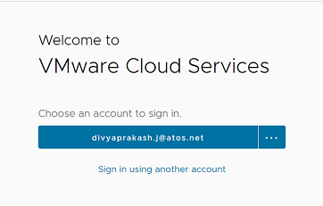

- Select target organization.

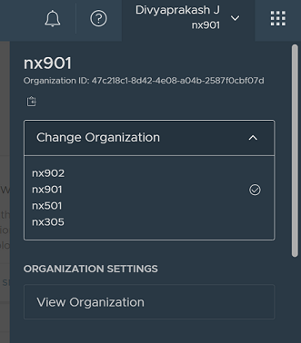

- Select `Services` > `VMware Service Broker` > `Launch Service`

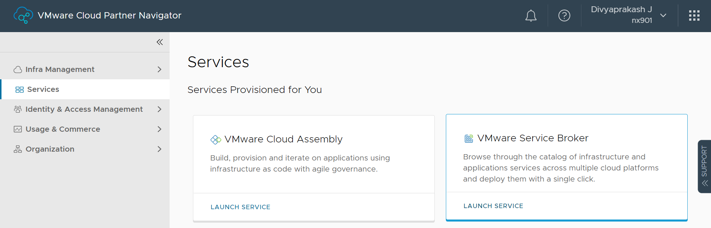

- Inside Service Broker select `Catalog` > `Catalog Items`. Locate or search for "Deploy virtual machine" catalog item.

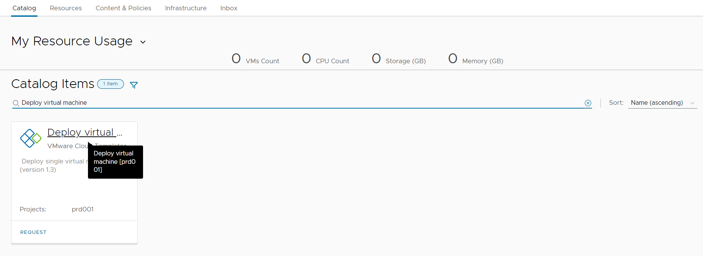

- Click on "Request" to open catalog form.
- In "General" tab, Project & location and VM configuration fields are available as shown in below screenshot.

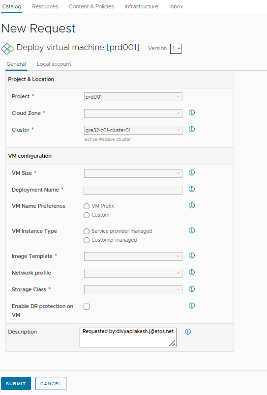

- If user selects "Enable DR protection on VM", then additional tab "Disaster Recovery" will be populated.
- Under "Disaster Recovery" tab, fields like "Protection Group", RPO, and Priority Group are available.

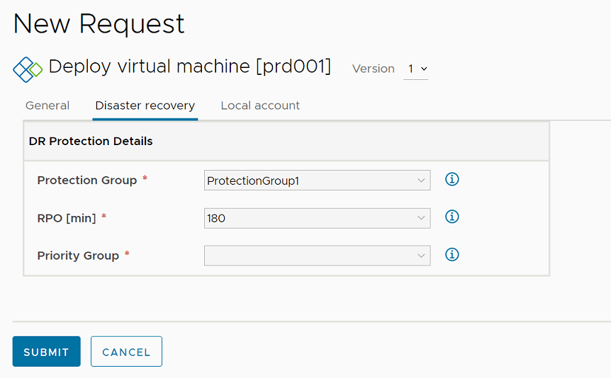

- Next tab in the form is, "Local account" which covers local administrative account details fields like- Username & Password.

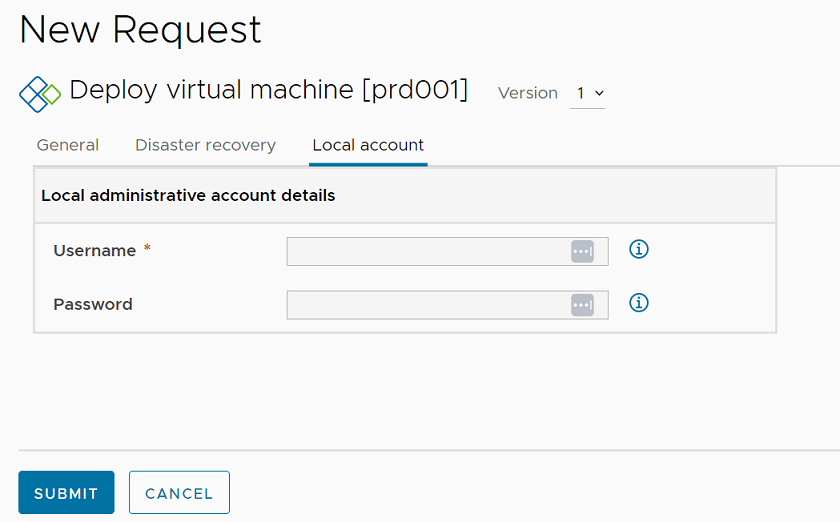

- After filling the form, user can click on `Submit` button to submit a VM deployment request.

# vRA OnPrem

Follow below steps to access the VCS default blueprint and deploy virtual machines in vRA on-prem.

- Connect to customer terminal server from where vRA on-prem is accessible.

 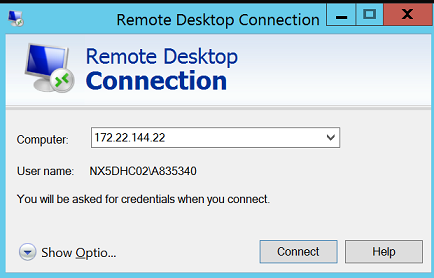

- Open the vRA portal which will be present in user environment (for eg. <https://gre92vra001.nx5dhc02.next>, where customer code: "nx5", location code: "gre92", dhcInstance: "02")

- Opening vRA url takes you to Identity Manager for authentication.

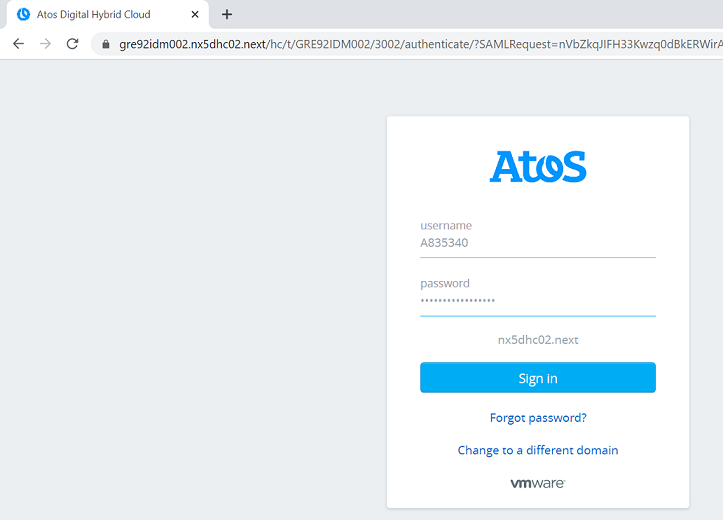

- Login to Identity Manager with domain credentials of target organization.
- Confirm the target organization is correct in user section.
- Select "Service Broker" from "Services"

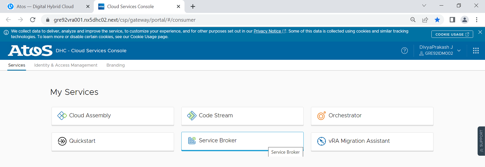

- In Service Broker, navigate to "Catalog" tab.
- Locate or search for "Deploy virutal machine" in the catalog items.
- Click on "Request" to open catalog form.

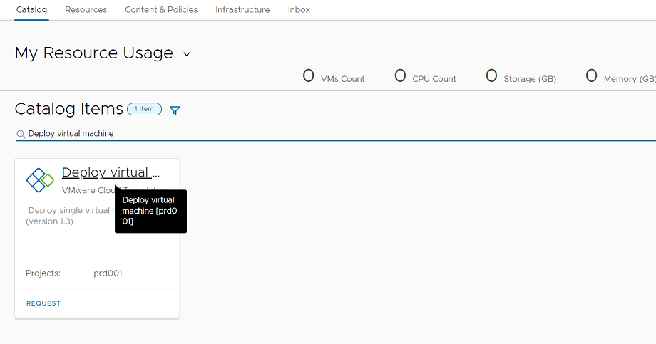

- In "General" tab, Project & location and VM configuration fields are available.

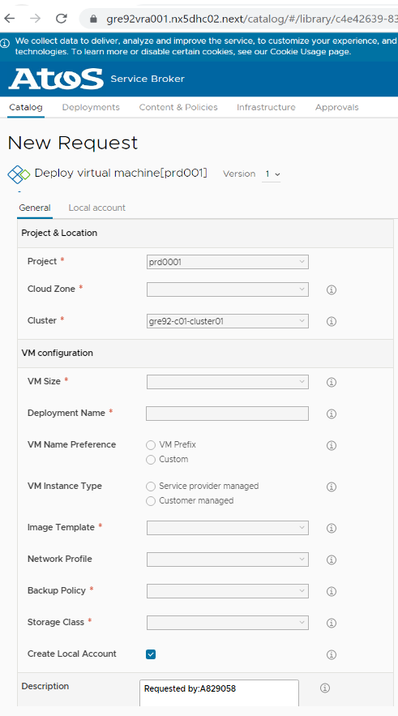

- Next tab, "Local account" in the form covers local administrative account details fields like- Username & Password.

- User can view the form and fill in the required details. After filling in details, user can click on `Submit` button to submit VM deployment request.

# Field Description

 | Blueprint Field | Description |
 |----------------|------------ |
 | Project | Select a Project where you want to deploy a VM |
 | Cloud Zone | Select cloud zone on which deployment will be created |
 | Cluster | Select cluster on which new virtual machine will be provisioned |
 | VM Size | Predefined flavors describes VM size. e.g. XSmall vCPU: 1, Memory: 2Gb |
 | Deployment Name | Enter Deployment Name for provisioning resources |
 | VM Name Preference| Select VM Name Preference: VM Prefix or Custom |
 | VM Instance Type | Select virtual machine instance type: Service provider or Customer managed instance |
 | Image Template | Select template from which new virtual machine will be provisioned |
 | Network profile | NetworkZone to be selected for Virtual Machine |
 | Storage Class | Select storage class for system disk |
 | DR protection | Select to enable disaster recovery for new provisioned virtual machine |
 | Protection Group | Protection groups are a way of grouping VMs that will be recovered together |
 | RTO | Recovery Point Objectives. RPO is a business calculation for acceptable data loss from downtime. Value in minutes |
 | Priority Group | VM startup priority (1 - highest 5 - lowest) |
 | UserName |  Provide the unique name of the new user |
 | Password | Provide strong password |

# Field Details

This section covers details of the input fields in the catalog form including its name, display name, type, default values, pattern, minimum, maximum length, any constraints and limitations etc.

## Project & Location

### Project

| Name | Display Name | Description |
|-------|--------------|------------|
| Select the Project Name | Project | Select an Project where you want to deploy a VM |

| Type | Default | Pairs| Enum |
|------|---------|---------|---------|
| String | prd001 | Values | prd001 |

Project for which the selected cloud templates is published will be listed.

### Cloud Zone

| Name | Display Name | Description |
|-------|--------------|------------|
| zone_tag | Cloud Zone | Select cloud zone on which deployment will be created |

| Type | Default | Pairs| Enum |
|------|---------|---------|---------|
| String | None | Values | gre3201 |

Cloud zones are sets of compute resources that can be used for provisioning within a specific cloud account and region.

### Cluster

| Name | Display Name | Description |
|-------|--------------|------------|
| cluster_tag | Cluster | Select cluster on which new virtual machine will be provisioned |

| Type | Default | Pairs| Enum |
|------|---------|---------|---------|
| String | gre32-c01-cluster01 | Values | gre3201-c01-cluster01 |

## VM Configuration

### VM Size

| Name | Display Name | Description |
|-------|--------------|------------|
| dhcflavor | VM Size | Predefined flavors describes VM size. e.g. XSmall vCPU: 1, Memory: 2Gb |

| Type | Default | Pairs| Enum |
|------|---------|---------|---------|
| String | | Values  | XSmall 1vCPU 2GBvMEM Small 2vCPU 4GBvMEM Medium 4vCPU 8GBvMEM Large 8vCPU 16GBvMEM XLarge 16vCPU 32GBvMEM|

VM Size depends on the Virtual Machine image template selected.

### Deployment Name

| Name | Display Name | Description |
| --- | --- | --- |
| MachineName | Deployment Name | Enter deployment name for provisioning resources |

| Type | Default | Pattern | Minimum | Maximum |
|------|---------|---------|---------|---------|
| String|  | [a-z0-9A-Z@#$]+ | 5 | 12 |

Deployment name is given to identity the Virtual Machine under Cloud Assembly/Service Broker. It can be known as parent directory to all associated Virtual Machines, Multi network and Multi Disk.

### VM Name Preference

| Name | Display Name | Description |
|-------|--------------|------------|
| vm_preference | VM Name Preference | Select VM Name Preference: VM Prefix or Custom |

| Type | Default | Pairs| Enum |
|------|---------|---------|---------|
| Radio Group |  | Values | VM Prefix Custom |

A virtual machine must have a unique name

There are two options

- VM prefix
- Custom

#### VM Prefix

| Name | Display Name | Description |
|-------|------------|------------|
| vm_prefix | VM Prefix | Add vm prefix like prod,dev |

| Type | Default | Pairs| Enum |
|------|---------|---------|---------|
| String |  | Values | prod dev cat |

#### Custom

User can enter vm name manually under custom VM name

| Name | Display Name | Description |
|-------|------------|------------|
| custom | Custom VM Name | Add name under it manually |

| Type | Default | Pattern | Minimum | Maximum |
|------|---------|---------|---------|---------|
| String| null | [a-z0-9A-Z@#$]+ | 5 | 12 |

### VM instances Type

| Name | Display Name | Description |
|-------|--------------|------------|
| Select an instance type | VM instance Type | Select virtual machine instance type: Service provider or Customer managed instance |

| Type | Default | Pairs| Enum |
|------|---------|---------|---------|
| Radio Group |  | Values |Service provider Customer managed |

### Image Template

| Name | Display Name | Description |
|-------|--------------|------------|
| image_tag | Image Template | Select template from which new virtual machine will be provisioned |

| Type | Default | Pairs| Enum |
|------|---------|---------|---------|
| String |  | Values | atos-sles15 atos-rhel7 atos-rhel8 atos-win2016 atos-win2019 |

VCS pre-configured image templates will be listed.

### Network profile

| Name | Display Name | Description |
|-------|--------------|------------|
| net_tag | Network profile | Select network profile |

| Type | Default | Pairs| Enum |
|------|---------|---------|---------|
| String |  | Values | web app db tooling |

### Storage class

| Name | Display Name | Description |
|-------|--------------|------------|
| storage_tag | Storage Class | Select storage class for system disk. |

| Type | Default | Pairs| Enum |
|------|---------|---------|---------|
| String | Gold | Values | nx1bronze nx1silver |

### Enable DR protection on VM

| Name | Display Name | Description |
|-------|--------------|------------|
|drEnabled_tag | Enable DR protection on VM | Select to enable disaster recovery for new provisioned virtual machine |

| Type | Default |
|------|---------|
| Checkbox | unselect |

### Protection Group

| Name | Display Name | Description |
|-------|--------------|------------|
| drProtectionGroup_tag | Protection Group | Protection groups are a way of grouping VMs that will be recovered together |

| Type | Default | Pairs| Enum |
|------|---------|---------|---------|
| String| Protection Group1 | Values | Protection Group1 Protection Group2 |

### RPO [min]

| Name | Display Name | Description |
|-------|--------------|------------|
| drRpo_tag | RPO | Recovery Point Objectives. RPO is a business calculation for acceptable data loss from downtime. Value in minutes |

| Type | Default | Pairs| Enum |
|------|---------|---------|---------|
| integer | 180 | Values | 5 15 180 600 1440 |

### Priority Group

| Name | Display Name | Description |
|-------|--------------|------------|
| drPriorityGroup_tag | Priority Group | VM startup priority (1 - highest 5 - lowest) |

| Type | Default | Pairs| Enum |
|------|---------|---------|---------|
| integer |  | Values | 1 2 3 4 5 |

### Local account Username

| Name | Display Name | Description |
|-------|--------------|------------|
| localUser | UserName | Provide the unique name of the new user. Using existing administrator (windows) or root (linux) will cause the request to fail |

| Type | Default | Pattern | Minimum | Maximum |
|------|---------|---------|---------|---------|
| String|  | [a-z0-9A-Z@#$]+ | 5 | 12 |

The username will be created as additional local admin on the virtual machine.
Minimum 5 characters and max 12. Allowed characters: a-z, A-Z, 0-9

### Local account Password

| Name | Display Name | Description |
|-------|--------------|------------|
| localcreds | Password | Provide strong password (max.length:18,min.length:12) |

| Type | Default | Pattern | Minimum | Maximum |
|------|---------|---------|---------|---------|
| String|  | [a-z0-9A-Z@#$]+ | 12 | 18 |
