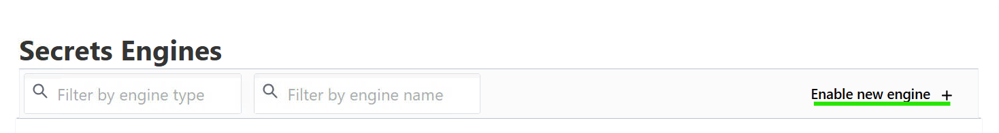
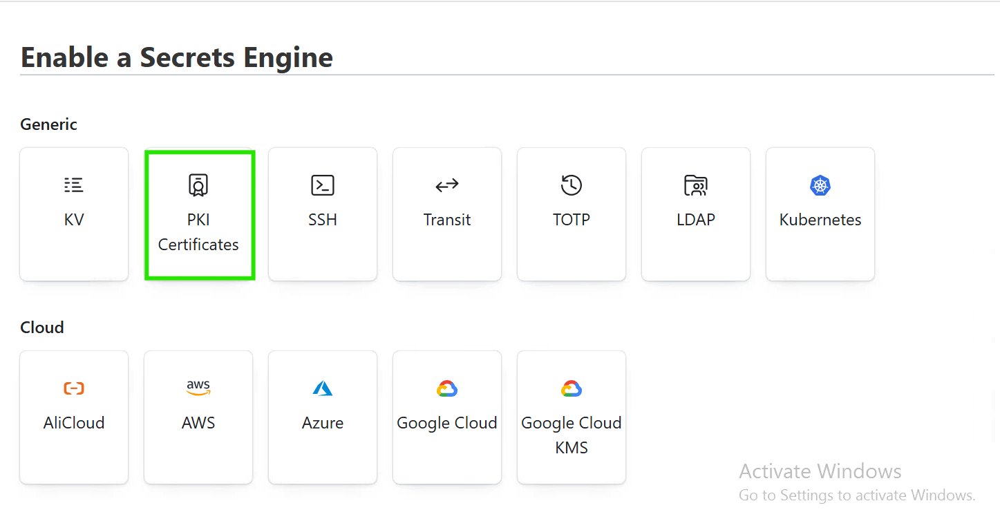
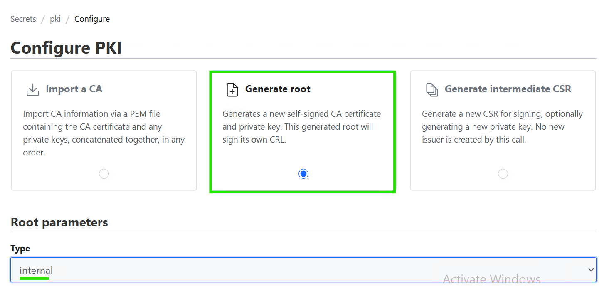
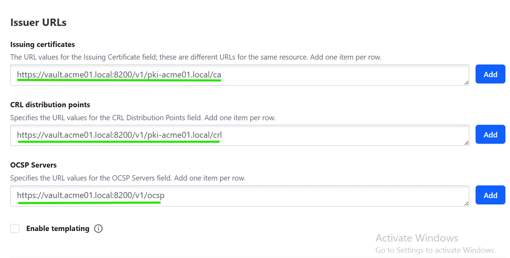
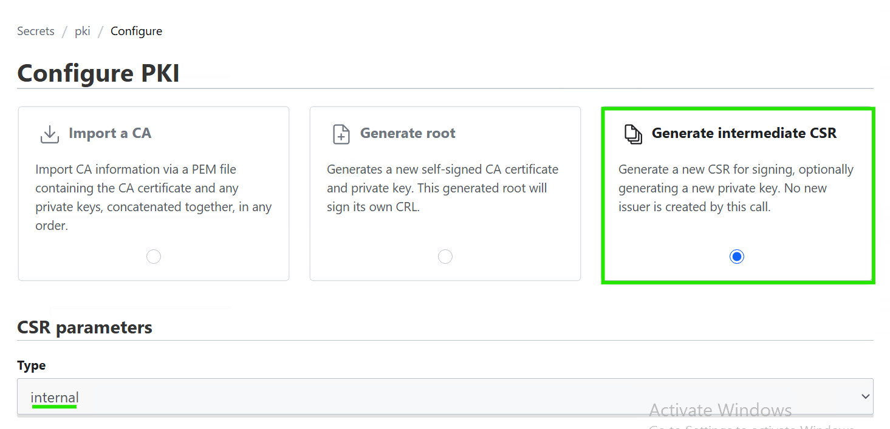
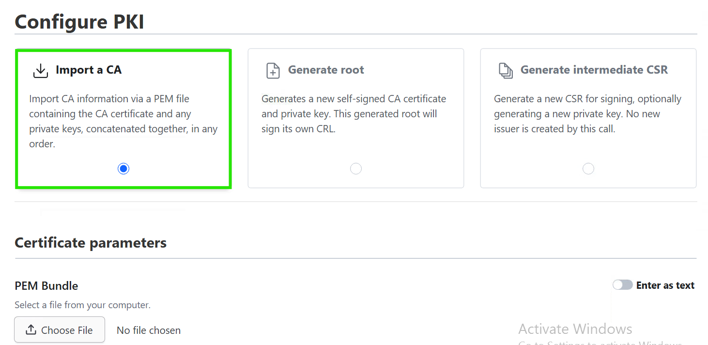
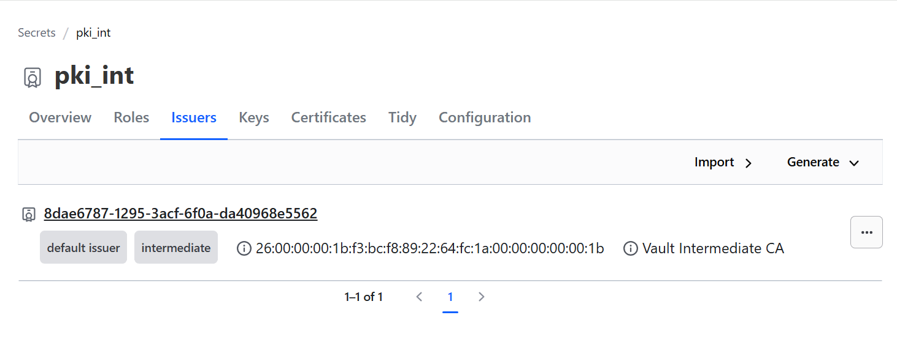
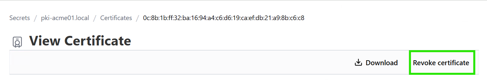
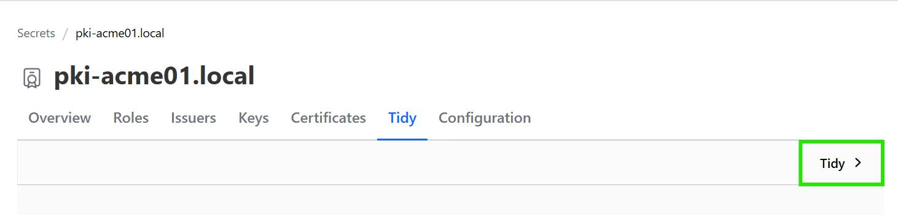

# Certificate Management using HashiCorp Vault PKI

## Table of Contents

- [Certificate Management using HashiCorp Vault PKI](#certificate-management-using-hashicorp-vault-pki)
  - [Table of Contents](#table-of-contents)
  - [Changelog](#changelog)
  - [Introduction](#introduction)
    - [Purpose](#purpose)
    - [Scope](#scope)
  - [Prerequisites](#prerequisites)
  - [Vault PKI Architecture Overview](#vault-pki-architecture-overview)
  - [Configuring Root and Intermediate Certificate Authorities (CAs)](#configuring-root-and-intermediate-certificate-authorities-cas)
    - [Root Certificate Authority (Root CA)](#root-certificate-authority-root-ca)
      - [Purpose of a Root CA](#purpose-of-a-root-ca)
      - [Configuring Root CA in Vault](#configuring-root-ca-in-vault)
    - [Intermediate Certificate Authority (Intermediate CA)](#intermediate-certificate-authority-intermediate-ca)
      - [Purpose of an Intermediate CA](#purpose-of-an-intermediate-ca)
      - [Configuring Intermediate CA in Vault](#configuring-intermediate-ca-in-vault)
  - [Setting up certificate generation templates and issuing certificates](#setting-up-certificate-generation-templates-and-issuing-certificates)
    - [Create a Certificate Role (Template)](#create-a-certificate-role-template)
    - [Issue a Certificate using the Role](#issue-a-certificate-using-the-role)
  - [Certificate revocation and cleanup](#certificate-revocation-and-cleanup)
    - [Revoking Certificates](#revoking-certificates)
    - [Removing Expired Certificates](#removing-expired-certificates)
  - [Automation with Vault API](#automation-with-vault-api)

## Changelog

| Version | Date       | Description                | Author          |
| ------- | ---------- | ------------------------   | --------------- |
| 0.1     | 23.07.2025 | Draft version creation     | Rachel Beulah   |

## Introduction

### Purpose

This document provides work instructions for the DHC Operations team to manage SSL certificates using HashiCorp Vault's PKI Secrets Engine. It focuses on configuring Root and Intermediate CAs, issuing certificates for services (NGINX, WinRM, Linux), and updating existing certificates securely and consistently.

### Scope

To provide detailed work instructions for the Operations (OPS) team on issuing and implementing a public or customer-issued certificate using HashiCorp Vault's PKI Secrets Engine.

## Prerequisites

Before proceeding with any certificate management operations in Vault, ensure the following prerequisites are met:

- **Vault Unsealed and Healthy:** Verification of a Vault instance's unsealed and operational status is necessary. Status checks can be performed via the Vault UI or by running `vault status` in the command line.
- **Vault Admin Credentials:** Access to Vault with administrative privileges is required. This typically involves:
  - A Vault Admin LDAP account (if LDAP authentication is configured).
  - Alternatively, local root credentials (token or userpass) with sufficient permissions to enable secrets engines, configure PKI, create roles, and issue/revoke certificates.
- **Access to Root CA (for Intermediate CA implementation):** When configuring an Intermediate CA that requires signing by an existing Root CA (whether internal to Vault or external), ensuring the necessary access and permissions to interact with that Root CA for obtaining the signed intermediate certificate is essential.

## Vault PKI Architecture Overview

HashiCorp Vault's PKI Secrets Engine allows for:

- Configuring Root and Intermediate Certificate Authorities (CAs)
- Creating certificate roles and issuing certificates
- Managing certificate lifecycle operations such as revocation and cleanup of expired certificates

## Configuring Root and Intermediate Certificate Authorities (CAs)

### Root Certificate Authority (Root CA)

A Root Certificate Authority (Root CA) is the main trusted source in a Public Key Infrastructure (PKI). It creates its own certificate (called self-signed) and is used to verify the identity of other certificates. If a system trusts the Root CA, it will also trust all certificates that come from it or from any Intermediate CA that the Root CA approves. It is the starting point of trust for all other certificates.

#### Purpose of a Root CA

- Establishing Trust: It's the foundational certificate that establishes trust in the entire PKI.
- Signing Intermediate CAs: Its primary role is often to sign the certificates of Intermediate CAs, which then handle day-to-day certificate issuance.
- Long-lived and Secure: Root CAs are typically very long-lived (e.g., 10-20 years or more) and are kept highly secure, often offline or in highly restricted environments, to prevent compromise.

### Configuring Root CA in Vault

**Step 1: Enable the PKI Secrets Engine**

- Log in to the Vault UI (e.g., ```https://localhost:8200```).
- In the left-hand navigation, click on "Secrets Engines".
- Click the "+ Enable new engine" button.

##### Figure 1 Enabling New Engine
  
  
  
- Select "PKI secrets engine" from the list.

##### Figure 2 PKI Engine
  
  
  
- In the configuration form:
  - **Path:** Define a unique and descriptive path for your PKI engine. This path helps you identify the CA’s purpose and its associated domain.
    - Recommended naming conventions:
        ```pki-<Domain name>```
    - For example, when configuring a Root CA for the domain `acme01.local`, the path `pki-acme01.local` should be used. This ensures clarity when multiple PKI engines are configured within the same Vault instance.

  - In the **Max Lease TTL** field, enter a long duration, for example, 87600h (for 10 years). This is the maximum lifetime for certificates issued by this CA.
  - Description (Optional): Add a descriptive text like "Root CA for new domain".
- Click "Enable Engine". This sets the path to be pki.

**Step 2: Configuring Root Certificate Authority**

- Select the Overview tab and then Configure PKI.
- Click on "Generate Root".
- Select "Internal" as the type.

##### Figure 3 Selecting "Generate Root" to enable Root CA
  
  
  
- Fill in the form:
  - **Common Name:** Enter the common name for the Root CA (e.g., MyNewRootCA.local). This is the name that will appear on the Root CA certificate.
  - **TTL:** Enter a very long validity period for the Root CA certificate itself (e.g., 87600h for 10 years, or 175200h for 20 years).
  - **Issuing Certificates:** Enter the URL where clients can fetch the CA certificate. This is typically the Vault address followed by the PKI path and /ca.
    - Example: ```http://localhost:8200/v1/pki/ca```
  - **CRL Distribution Points:** Enter the URL where clients can fetch the Certificate Revocation List.
    - Example: ```http://localhost:8200/v1/pki/crl```
  - **OCSP Servers:** Enter the URL(s) for Online Certificate Status Protocol (OCSP) servers.
    - Example: ```http://localhost:8200/v1/ocsp```

##### Figure 4 URL for Issuing certificates, CRL Distribution Points, OCSP Servers

    

- Click "Generate".

Vault will generate the Root CA certificate and display its details.
Root CA is now configured and ready to issue certificates or sign intermediate CAs.

### Intermediate Certificate Authority (Intermediate CA)

An Intermediate Certificate Authority (Intermediate CA) is a CA whose certificate is signed by another CA (either a Root CA or another Intermediate CA). Intermediate CAs act as intermediaries in the chain of trust, signing end-entity certificates (like your NGINX server certificates) on behalf of a higher-level CA. They provide an essential layer of security and operational flexibility in a PKI.

#### Purpose of an Intermediate CA

- Better Security: The Root CA is kept safe and not used often. The Intermediate CA does the daily work like issuing certificates, so the Root CA stays protected.
- Clear Roles: Different Intermediate CAs can be used for different needs (e.g., one for internal tools, one for public websites), making it easier to manage.
- Easier to Grow: One Root CA can support many Intermediate CAs, which can issue lots of certificates. This makes the system easier to expand.
- Safer Revocation: If one Intermediate CA is hacked, you only need to replace the certificates from that CA — not everything.
- Works with Existing Systems: Vault can use an Intermediate CA signed by an existing Root CA, so it fits into your current setup without changing everything.

### Configuring Intermediate CA in Vault

**Step 1: Enable the PKI Secrets Engine**

- Log in to the Vault UI (e.g., ```https://localhost:8200```).
- In the left-hand navigation, click on "Secrets Engines".
- Click the "+ Enable new engine" button.
- Select "PKI secrets engine" from the list.
- In the configuration form:
  - **Path:** Define a unique and descriptive path for your Intermediate CA’s PKI engine. This path helps distinguish it from other engines—particularly the Root CA—and makes its purpose and domain association clear.
    - Recommended Naming Convention:
       ```int-pki-<Domain name>```
    - For example, when configuring an Intermediate CA for the domain `acme01.local`, the path `int-pki-acme01.local` should be used. This naming pattern ensures clarity, especially in Vault setups where multiple Root and Intermediate CAs coexist for different domains or trust chains.

  - In the **Max Lease TTL** field, enter a long duration, for example, 87600h (for 10 years). This is the maximum lifetime for certificates issued by this CA.
  - Description (Optional): Add a descriptive text like "Intermediate CA for domain".
- Click "Enable Engine". This sets the path to be pki.

**Step 2: Generate the Intermediate CA Certificate Signing Request (CSR)**

- Select the Overview tab and then Configure PKI.
- Click on "Generate intermediate CSR".
- Select "Internal" as the type.

##### Figure 5 Selecting "Intermediate Root" to enable Intermediate CA
  
  
  
- Fill in the form:
  - **Common Name:** Enter the common name for the Intermediate CA (e.g., MyNewIntermediateCA.local). This is the name that will appear on the Intermediate CA certificate.
  - **TTL:** Enter a very long validity period for the Intermediate CA certificate itself (e.g., 87600h for 10 years, or 175200h for 20 years).
- Click "Generate". Vault will generate the Intermediate CA certificate and display its details.
- Click the clipboard icon next to the CSR to save its content. Paste this content into a file named ```pki_intermediate.csr```.

**Step 3: Obtain the Signed Intermediate CA Certificate from Root CA**

- Navigate to the PKI secrets engine that hosts your Root CA (e.g., pki or pki_acme01 if you have an internal Vault Root CA, or access your external MS Root CA's signing interface).
  - For the purpose of this example, assume that there is an internal Vault Root CA at path ```pki``` and its issuer is ```root```.
  - In the Vault UI, click on "Secrets" in the left navigation.
  - Click on the PKI secrets engine for the Root CA (e.g., pki).
  - Click on "Issuers".
  - Click on the specific Root CA issuer (e.g., root-123).
- Click "Sign intermediate".
- Paste in the CSR: Paste the entire content of the pki_intermediate.csr file (which you copied in the previous step) into the "Certificate Signing Request (CSR)" field.
- Common Name: Enter the Common Name that matches your Intermediate CA's CSR.
- Click "Sign". Vault will display the signed intermediate certificate.
- Click "Download" to save the generated certificate. Save the file as ```intermediate.cert.pem```.

**Step 4: Import the Signed Intermediate CA Certificate into Vault**

Now, import the signed certificate back into the pki_int secrets engine, completing the Intermediate CA setup.

- Return to the Intermediate CA secrets engine in Vault.
- Click on "Secrets" in the left navigation.
- Select pki_int from the Secrets tab to return to the intermediate CA's overview.
- Select the "Overview" tab and then click "Configure PKI".
- Click "Import a CA".

##### Figure 6 Selecting "Import CA"
  
  
  
- Select the intermediate.cert.pem file (which you downloaded in the previous step) in the "PEM Bundle" field.
- Click "Import issuer".

##### Figure 7 Intermediate CA issuer
  
  

Vault will now confirm that the Intermediate CA has been successfully configured.

**Step 5: Configure the Certificate Authority (CA) URLs for Intermediate CA**

Similar to the Root CA, you need to configure the URLs where clients can retrieve the Intermediate CA certificate and its CRL.

- Within your Intermediate CA PKI secrets engine (e.g., pki_int), click on the "Configuration" tab in the left navigation.
- Click on "CA URLs".
- Fill in the fields:
  - Issuing Certificates: Enter the URL where clients can fetch this Intermediate CA certificate.
    - Example: ```https://localhost:8200/v1/pki_int/ca```
  - CRL Distribution Points: Enter the URL where clients can fetch the CRL for this Intermediate CA.
    - Example: ```https://localhost:8200/v1/pki_int/crl```
  - OCSP Servers (Optional): If applicable, enter the OCSP server URLs.
    - Example: ```http://localhost:8200/v1/ocsp```
- Click "Save".

The Intermediate CA is now configured and ready to issue certificates for its designated domain (e.g., dhc.local).

## Setting up certificate generation templates and issuing certificates

### Create a Certificate Role (Template)

A role defines the parameters for certificates issued by the CA.

- Within your Root/Intermediate CA PKI secrets engine, click on "Roles" in the left navigation.
- Click "+ Create Role".
- Fill in the form for your role (e.g., for NGINX certificates):
  - **Role Name:** Give the Role name (e.g., nginx-cert)
  - **Allowed Domains:** Enter the domain(s) for which this role can issue certificates (e.g., acme01.local, vrops.acme01.local).
  - **Allow Subdomains:** true (if needed)
  - **Max TTL:** Set the maximum validity for certificates issued by this role (e.g., 8760h for 1 year). This cannot exceed the max-lease-ttl set on the secrets engine.
  - **Key Algorithm & Strength:** Specifies the type of cryptographic algorithm and its strength.
    - Example: Key Type: rsa, Key Bits: 2048, Signature Bits: 256 means an RSA algorithm with a 2048-bit key and a 256-bit signature hash.
  - **Key Usage:** Defines the fundamental cryptographic operations the certificate's public key can perform.
    - Example: DigitalSignature allows for identity verification, KeyAgreement for shared secret establishment, and KeyEncipherment for encrypting other keys, all essential for secure communication like TLS/SSL.
  - **Extended Key Usage (EKU) for Authentication:** These flags explicitly define the certificate's purpose for authentication. This is crucial for defining if the certificate will be used for server authentication, client authentication, or other application-specific authentication.
    - `server_auth:` Required for SSL/TLS server certificates (e.g., web servers, WinRM over HTTPS).
    - `client_auth:` Required for certificates used by clients to authenticate to servers (e.g., mTLS, user login).
    - `code_signing`, `email_protection`, etc., are additional usage types for specialized scenarios.
    > Note: Incorrect configuration of allowed usages may result in authentication failures or untrusted certificates.
  - **Subject Alternative Name (SAN):** Controls whether the certificate can include alternative identifiers beyond the common name.
    - Example: Allow IP SANs: Yes means the certificate can validate against IP addresses, not just hostnames.
- Click "Create".

**Template Structure:**

Role Name: <Name of the role, e.g., linux-ssl, winrm-cert>  
Max TTL: <Maximum validity period for issued certificates, e.g., 3 days, 1 year>  
Allowed Domains: <Domains for which this role can issue certificates, e.g., acme01.local>  
Allow Subdomains: <true/false>  
Key Type: <Cryptographic algorithm, e.g., rsa>  
Key Bits: <Key strength, e.g., 2048>  
Key Usage: <Fundamental cryptographic operations, e.g., DigitalSignature, KeyEncipherment>  
Extended Key Usage (EKU): <Purpose of the certificate, e.g., ServerAuth, ClientAuth>  
Allow IP SANs: <true/false>  
Require Common Name: <true/false>  
Use CSR Common Name: <true/false>

**Example Configurations:**

1. **Linux SSL Certificate Role (`linux-ssl`)**

      - **Purpose:** For general Linux server SSL (e.g., Apache, NGINX).
      - **Key Parameters:**
          - `Role Name`: `linux-ssl`
          - `Max TTL`: `3 days`
          - `Allowed Domains`: `acme01.local`
          - `Allow Subdomains`: `true`
          - `Key Usage`: `DigitalSignature`, `KeyAgreement`, `KeyEncipherment`
          - `Extended Key Usage`: (Often left blank for general server SSL if covered by Key Usage, or `ServerAuth` if explicitly needed)
          - `Allow IP SANs`: `Yes`
          - `Require Common Name`: `Yes`

2. **WinRM Certificate SSL Role (`winrm-cert`)**

      - **Purpose:** For secure Windows Remote Management (WinRM).
      - **Key Parameters:**
          - `Role Name`: `winrm-cert`
          - `Max TTL`: `1 year`
          - `Allowed Domains`: `acme01.local`
          - `Allow Subdomains`: `true`
          - `Key Usage`: `DigitalSignature`, `KeyEncipherment`
          - `Extended Key Usage`: `ServerAuth` (crucial for WinRM listener)
          - `Allow IP SANs`: `Yes`
          - `Require Common Name`: `Yes`

### Issue a Certificate using the Role

- Within your Root/Intermediate CA PKI secrets engine (e.g., pki_root_new), click on "Roles" in the left navigation.
- Click on the specific role you want to use (e.g., nginx-cert). This will take you to the role's configuration page.
- On the role's configuration page, locate and click the "Generate Certificate" button.
- Fill in the form:
  - Common Name: Enter the specific hostname for the certificate (e.g., vrops.acme01.local).
  - Subject Alternative Names (SANs) (Optional): Add any additional hostnames or IP addresses this certificate should cover.
  - TTL (Optional): Specify a shorter TTL if needed for this specific certificate, overriding the role's default but not exceeding its max.- - Configure any other options as required by the role.
- Click "Generate".

Vault will display the generated certificate, its private key, and the issuing CA's certificate. It is critical to copy and save the private key immediately, as it is only displayed once and cannot be retrieved again.

## Certificate revocation and cleanup

### Revoking Certificates

Revoking certificates is necessary when a certificate is no longer trustworthy, such as if its private key is compromised, the associated entity's status changes (e.g., an employee leaves), or the certificate was issued incorrectly. This action immediately invalidates the certificate.

#### Step

- In the certificate list, locate the certificate you want to revoke:
  - You can search by serial number.
  - Or filter by Common Name (CN) or Issued To field.
- Once found, click the certificate's details.
- In the certificate details view, click the "Revoke Certificate" button.

##### Figure 8 Revoke Certificate
  
  

- Confirm the action when prompted.

> Note: Once revoked, the certificate is added to the Certificate Revocation List (CRL) and becomes invalid.

### Removing Expired Certificates

Removing expired certificates, also known as "tidying," is done for maintenance. It cleans up Vault's internal database by deleting records of certificates that have already reached their expiration date and are no longer valid. This improves Vault's performance and keeps its database lean.

#### Step

- Navigate to the PKI secrets engine you want to tidy.
- In the left menu, click on "Configuration".
- Look for a button or link labeled "Tidy".

##### Figure 9 Tidy Certificates
  
  
  
- Click it to start the cleanup process.
- Vault will:
  - Remove expired certificates.
  - Remove revoked certificates older than their expiry.
  - Refresh the CRL accordingly.

## Automation with Vault API

While the Vault UI is helpful for initial setup, certificate operations can be fully automated using the Vault API. Refer to the [HashiCorp Vault PKI tutorial](https://developer.hashicorp.com/vault/tutorials/pki/pki-engine) for detailed steps on automating tasks such as enabling PKI engines, configuring Root and Intermediate CAs, creating roles, and issuing or revoking certificates.

Here are some curl API examples for common Vault PKI automation tasks:

Note: Replace YOUR_VAULT_ADDR with your Vault server's address (e.g., [http://localhost:8200](http://localhost:8200)), and YOUR_VAULT_TOKEN with a valid Vault token that has appropriate permissions.

**1. Enable PKI Secrets Engine**

#### Enable a PKI secrets engine for a Root CA

    curl \
        --header "X-Vault-Token: YOUR_VAULT_TOKEN" \
        --request POST \
        --data '{"type": "pki", "description": "Root CA for acme01.local"}' \
        YOUR_VAULT_ADDR/v1/sys/mounts/pki-acme01.local

#### Enable a PKI secrets engine for an Intermediate CA

    curl \
        --header "X-Vault-Token: YOUR_VAULT_TOKEN" \
        --request POST \
        --data '{"type": "pki", "description": "Intermediate CA for acme01.local"}' \
        YOUR_VAULT_ADDR/v1/sys/mounts/int-pki-acme01.local

**2. Create Certificate Template (Role)**

#### Create a role for WinRM SSL certificates on the int-pki-acme01.local engine

    curl \
        --header "X-Vault-Token: YOUR_VAULT_TOKEN" \
        --request POST \
        --data '{
            "allowed_domains": "acme01.local",
            "allow_subdomains": true,
            "max_ttl": "8760h",
            "key_type": "rsa",
            "key_bits": 2048,
            "key_usage": ["DigitalSignature", "KeyEncipherment"],
            "extended_key_usage": ["serverAuth", "clientAuth"],
            "allow_ip_sans": true,
            "organization": "DHC Operations"
        }' \
        YOUR_VAULT_ADDR/v1/int-pki-acme01.local/roles/winrm-cert

**3. Generate Sample Machine Certificate**

#### Generate a certificate using the winrm-cert role

    curl \
        --header "X-Vault-Token: YOUR_VAULT_TOKEN" \
        --request POST \
        --data '{
            "common_name": "winrm-server.acme01.local",
            "alt_names": "localhost",
            "ip_sans": "127.0.0.1",
            "ttl": "720h"
        }' \
        YOUR_VAULT_ADDR/v1/int-pki-acme01.local/issue/winrm-cert

> Note: The output of this command will contain the certificate, private key, and CA chain. You would typically parse this JSON output to extract the necessary components.

#### 4. Revoke Certificate

#### Revoke a certificate by its serial number (replace <SERIAL_NUMBER>)

    curl \
        --header "X-Vault-Token: YOUR_VAULT_TOKEN" \
        --request POST \
        --data '{"serial_number": "<SERIAL_NUMBER>"}' \
        YOUR_VAULT_ADDR/v1/int-pki-acme01.local/revoke

#### 5. Download Certificate (CA Certificate or CRL)

#### Download the Root CA certificate (PEM format)

    curl \
        --header "X-Vault-Token: YOUR_VAULT_TOKEN" \
        YOUR_VAULT_ADDR/v1/pki-acme01.local/ca/pem

#### Download the Intermediate CA certificate (PEM format)

    curl \
        --header "X-Vault-Token: YOUR_VAULT_TOKEN" \
        YOUR_VAULT_ADDR/v1/int-pki-acme01.local/ca/pem

#### Download the CRL for a specific PKI engine

    curl \
        --header "X-Vault-Token: YOUR_VAULT_TOKEN" \
        YOUR_VAULT_ADDR/v1/int-pki-acme01.local/crl/pem
