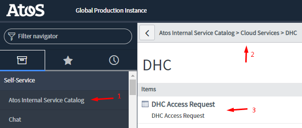
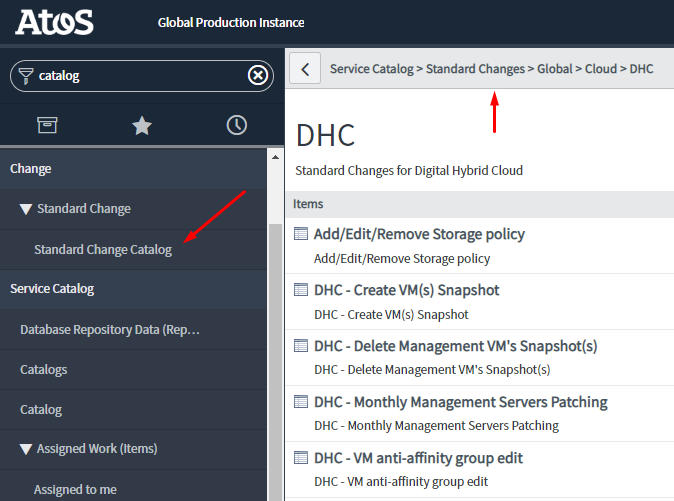
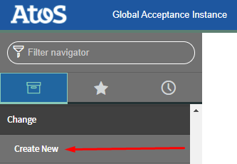
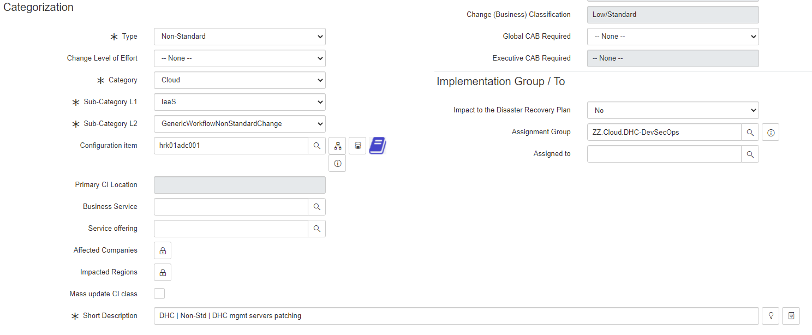
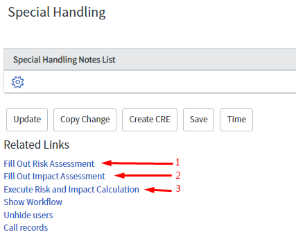

# Guidelines to the Change Management process for VCS

## Content

- [Guidelines to the Change Management process for VCS](#guidelines-to-the-change-management-process-for-vcs)
  - [Content](#content)
  - [Document control](#document-control)
  - [Introduction](#introduction)
    - [Purpose](#purpose)
    - [Audience](#audience)
    - [Scope](#scope)
  - [Prerequisite](#prerequisite)
  - [Related Documents](#related-documents)
  - [Contacts](#contacts)
- [Access Requests](#access-requests)
- [VCS Global Change Management process](#vcs-global-change-management-process)
  - [Standard Changes](#standard-changes)
  - [Raising a standard change](#raising-a-standard-change)
    - [Standard change closure](#standard-change-closure)
  - [Non-standard changes - (CIP Change Implementation Plan)](#non-standard-changes---cip-change-implementation-plan)
  - [Non-standard changes - Important timing aspects](#non-standard-changes---important-timing-aspects)
  - [Raising a non-standard change](#raising-a-non-standard-change)
  - [Non-std change reschedule](#non-std-change-reschedule)
  - [Post non-std change implementation activities](#post-non-std-change-implementation-activities)
- [VCS Change Management for Siemens MMSA](#vcs-change-management-for-siemens-mmsa)
  - [Raise a non-std change for Siemens](#raise-a-non-std-change-for-siemens)
  
## Document control

| Version | Date | Description | Author |
|---------|------|-------------|--------|
|0.1|02.02.2022|DHC-4033 Initial version.|Pawel Osial|
|0.2|25.04.2022|DHC-3571 Updates on standard changes.|Pawel Osial|
|1.0|31.08.2022|DHC-3953 Document update with list of std changes and Siemens customizations|Pawel Osial|

## Introduction

### Purpose

Perform change management in VCS.

### Audience

- DevSecOps
- Deployment team
- Others in need of raising a change ticket in VCS production environments

### Scope

Instructions on how to raise a change properly.

## Prerequisite

- Access to [ServiceNow](https://atosglobal.service-now.com/sp/?id=sso&portal-id=atos)
- Siemens MMSA functional organization visibility in ServiceNow (for changes in Siemens VCS)
- Understanding of the Change Management process and VCS exceptions (check out **all** related documents listed below)

## Related Documents

|Document|URL|
|--------|---|
|DevSecOps Manual, especially chapter 4.7|[LINK](https://atos365.sharepoint.com/:b:/r/sites/190009459/Shared%20Documents/Documents/MSD-U02-0027%20DevSecOps%20Manual.pdf?csf=1&web=1&e=6lcIyV)|
|Change Management exceptions to DevSecOps Manual that DevSecOps team follows|[LINK](https://atos365.sharepoint.com/:p:/r/sites/DHCDevSecOpsTeam/Shared%20Documents/General/Change%20Management/DHC%20Change%20Management%20exceptions%20to%20DevSecOps%20Manual.pptx?d=w5e2be466cad04ebdbade5e097ce5a0e8&csf=1&web=1&e=htxKpE)|
|ASMM Global Change Management Policy |[LINK](https://atos365.sharepoint.com/sites/690000860/asmm/21cm/Forms/AllItems.aspx?csf=1&web=1&e=ggEibc&cid=24e6cbcf%2D6e70%2D43a5%2Da05f%2D200984d60e14&FolderCTID=0x0120002178DB855CAA5C49805F3DA4121836B9&id=%2Fsites%2F690000860%2Fasmm%2F21cm%2F01%20ASMM%20Documentation&viewid=e8785b52%2Df882%2D4840%2D9e15%2Df3fa1632c780)|
|CAPC|[LINK](https://atos365.sharepoint.com/:x:/r/sites/190009459/_layouts/15/Doc.aspx?sourcedoc=%7B0DC80C79-6E73-4181-A28F-65340D15CB12%7D&file=MSD-U02-0017%20Global%20Cloud%20Standard%20Change%20and%20SSR%20Catalog.xlsx&action=default&mobileredirect=true&cid=d02e43cc-dedd-4dcb-bcd5-5815d69ae3c5)|

## Contacts

CES Global VCS Change Managers:

- Patil, Monika <monika.ambavane@atos.net>

Siemens Change Management:

- changemgmt_gsa <changemgmt_gsa@atos.net>

Siemens Change Managers:

- Clark, Rebekah <rebekah.clark@atos.net>
- Giri, Sagar <sagar.giri@atos.net>

# Access Requests

The process for access related queries is **the same for ALL clients**. This applies also to Siemens and is not linked with the Change Management process.

Access related queries/changes should be done via the ISR (Internal Service Request). Including password resets and service accounts maintenance.

*Note:*

- *All approvals (Line Manager + VCS Service Management) must be granted in ServiceNow for the Access Request to process*
- *Each request should contain all full names of the people for who the access is requested. This information should be placed in the description/initial note - otherwise, the ticket should be rejected*
- *No approvals required for password reset queries, the ticket goes automatically to the DevSecOps team for implementation*

# VCS Global Change Management process

The Global Change Management process applies to all clients supported by the DevSecOps team **except Siemens**.

## Standard Changes

Currently in VCS DevSecOps team we have 20 standard changes. All of them are available to be opened from the Standard Change Catalog in SNOW Global.

Current list of standard changes:

- Add/Edit/Remove Storage Policy
- Create VM(s) Snapshot
- Delete Management VM's Snapshot(s)
- Monthly Management Servers Patching
- VM anti-affinity group edit
- Modify management VM
- Update IPAM entries
- Restart Management VM
- LCM of the non-VCF components
- VCS mgmt servers pwd rotation
- AddEditRemove Security GRP-FW
- AddEditRemove NSX Network

Additionally, there are standard changes related to the new clients onboarding in VCS Multitenant environments (currently, applicable only to VCS BTN MT):

- Add VCF Cluster
- Configure Infoblox new tenant
- Configure Network profiles
- Configure New Tenant
- Expand VCF Cluster
- New Tenant E2E test
- New Tenant Network Creation

## Raising a standard change

All standard changes must be raised **from the Global VCS Standard Change catalog**. Otherwise, automation in ServiceNow will fail.

Ticket will open automatically. All mandatory (*CIP related*) fields are automatically filled by SNOW. Except:

- **Schedule**: provide schedule, when the change will be implemented
- **Configuration Item**: Put the CI name in the proper field. If multiple CIs are affected by the change, provide them all in the change (excel attachment or a note in the ticket)
- **Scope** - every change is slightly different, so details must be provided in a description or a note. What exactly will be done.

Implement std change on your own according to the schedule. Upload implementation evidence into the ticket and close it. No change management involvement is required for std changes.

### Standard change closure

After each standard change implementation, the implementer is obliged to:

- Provide completion evidence in the change ticket
- Implementation task closure
- Fill *Actual End Date/Time* field
- Change ticket closure

## Non-standard changes - (CIP Change Implementation Plan)

To open a non-std change you must prepare a change implementation plan (CIP). [CIP template](https://atos365.sharepoint.com/:x:/r/sites/690000860/asmm/21cm/01%20ASMM%20Documentation/05.%20Supporting%20Documents%20and%20Templates/Global%20CIP%20Template.xlsm?d=wc38008a9b03449a5b4ee9d2010c5a22d&csf=1&web=1&e=jDjAEI)

- CIP's quality for non-std change is crucial and it will influence approvals.
- All actions must be well described so there are no doubts what is being done and how.
- Well prepared historical change and its CIP can be used as a reference: CHG001484441

In case of any queries/concerns related to the CIP contact change manager or DevSecOps team for advise.

## Non-standard changes - Important timing aspects

- Each non-std change must be discussed at the **CAB** (Change-advisory board) meeting which **takes place every Monday**
- Change to be added to the CAB must be created **at the latest on Thursday before upcoming Monday** and Patil, Monika <monika.ambavane@atos.net> must be informed
- **If the change is impacting the client(s)** - workload domain, two weeks' advance notice is mandatory to gather all the necessary approvals from all accounts and agree upon the maintenance window.

## Raising a non-standard change

1. Go to the navigation panel on the left side of ServiceNow and select "Create New" from the "Change" category.

    

2. Select **"Atos VCS CIs"** and click Create new Change.

    - Your change is now opened and the ticket number has been generated.

3. Fill out mandatory fields:

    - **Categorization**
      - Type: Non-Standard
      - Category: Cloud
      - Sub-Category L1: IaaS

    - **Sub-Category L2: GenericWorkflowNonStandardChange** <-- *Important to have approval tasks generated*
      - Configuration item: *provide affected CI name, in case of many provide just one*

    - **Assignment Group: fills automatically by ServiceNow** (*do not change it*)
      - Short Description: VCS | Non-Std | ... *short description, usually CIP name works*

    
  
    - **Notes**
      - Fill the following fields *Description, Impact during implementation, Impact (if not executed), Change justification* with the content from the CIP
    - **Schedule**
      - Change Schedule: provide schedule date & time; It must be the same both in the CIP and the change ticket
      - Outage Timeframes: provide answers on *Outage Required?* and *On-site access required*
    - **Planning**
      - Implementation plan: provide **all** implementation plan steps from the CIP
      - Backout plan: provide data from the CIP
      - Evidence of pre-implementation testing or Comments: provide data from the CIP on pre-checks done + evidence of change testing. Add information where the evidence is uploaded (usually, it is in the CIP attachments tab)
      - Test plan: provide data from the CIP on what are the post-change test activities
      - Communication plan: *"email notification from the change management"*
      - CMDB Update Required: True/False
      - *False if there is no CI update required or Auto Discovery of CI modification is implemented*
    - **Special Handling**
      - Risk and Impact assessment: Change requestor/implementor must fill out both assessments which can be found in the Special Handling and then click *Execute Risk and Impact Calculation* to get Change (Business) Classification (which is required to request approvals)

      

4. Request Approval - *button on the top of the ticket*.
5. Collect required approvals within the workflow tasks before the CAB.

    - DevSecOps team's approval
    - SRM or TSM approval (optional - can be granted on the CAB)

6. Notify Change Management about the change at the latest on Thursday before upcoming Monday (CAB).

    - Email to Patil, Monika <monika.ambavane@atos.net>

7. Present the change on the CAB and if it gets approved **make sure it is approved in SNOW as well.** - Do not perform the change until it is fully approved and moved to the next stage - "work in progress"

## Non-std change reschedule

You can reschedule the change on your own when it is in **Being Prepared** state. Remember to update the CIP after the schedule change.  
If the change is in "Awaiting Approval" or "Scheduled" or "Work in progress" - only the change management can modify its schedule:

- Update the CIP, put a note in the ticket and ask change management to modify the schedule in the ticket.

## Post non-std change implementation activities

- Upload evidence to the ticket with a note whether it was successful, partially successful, or not successful
- Inform change management about change implementation and evidence upload
- Change management will take care of change ticket closure and potential PIR in case of failure

# VCS Change Management for Siemens MMSA

This process applies to all changes raised for any Siemens VCS environment.  
For the time being, **there are no standard changes for Siemens.**

## Raise a non-std change for Siemens

1 - Raise a change in SNOW

- Customer: Siemens MMSA
- Type: Non-standard
- Category: Non-Standard
- Sub-Category L1: IaaS
- Sub-Category L2: DHC
- **No CIP template is required** - mandatory fields in ServiceNow for change tickets cover CIP template content, and they must be filled equally as a CIP would be.

**If the change is cross-practice or generates an impact on client workload - at least 2 weeks' advance notice is required to gather necessary approvals and proper time window from the client.**

2 - Present the change on the next internal CAB (every work day at 11:45 AM CE(S)T)

- Gather pre-approval/approval from Siemens SDM - Cosmin Halmagean *(approval in case of A scenario)*

**A - Internal change not impacting the client:**

3 -  Implement the change, upload necessary evidence and inform Change Management about change completion

**B - Change impacting the client or cross-practice change:**

3 - Change Management opens a reference change in MyIT (client's ITSM/ServiceNow)

4 - Change to be presented by Cosmin/Dominik on the next client's CAB

- Gather client's approval and adjust the time window

5 - Implement the change, upload necessary evidence and inform Change Management about change completion
