# Change Idrac Password and upload to CyberArk

# List of Changes
  
| Version | Date       | Description      | Author       |
| ------- | ---------- | ---------------- | -------------|
| 0.1     | 07.11.2022 | First version    | Chiriac Adrian Iulian |

## Introduction

### Purpose

Change the iDRAC password and upload to CyberArk.

### Audience

- VCS Operations

### Scope

- Upload credentials to CyberArk
- Change iDRAC password

# How to complete CyberArk CSV file

CSV template:

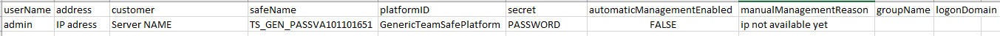

    userName -> account name
    address -> IP address
    customer -> server name
    safeName -> in which server the account will be uploaded for VCS team use TS_GEN_PASSVA101101651
    platformID -> fill GenericTeamSafePlatform
    secret -> password
    automaticManagementEnabled -> feature not implemented fill "FALSE"
    manualManagementReason -> Reason for manual "ip not available yet"
    groupName -> leave empty
    logonDomain -> can be empty for local credentials

# Upload credentials to CyberArk

1) Access CyberArk
2) Click the arrow next to "Add account" and Click "Add accounts from file"

    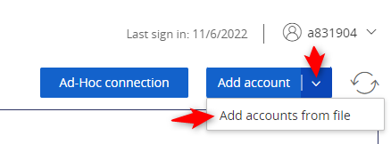

3) Drag or browse your file and upload

    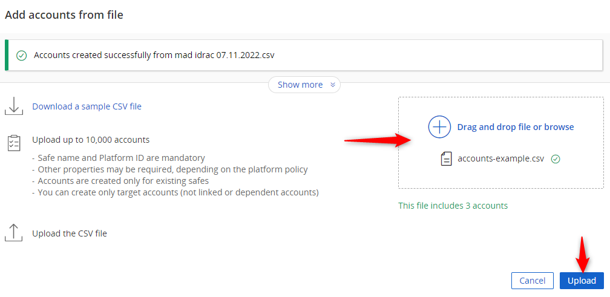

# Change iDRAC password

1) RDP to SAaCon EMEA Desktop
2) Access from SAaCon EMEA Desktop <https://ServerIp>

    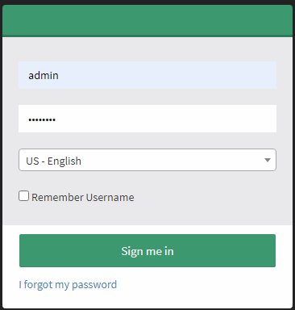
    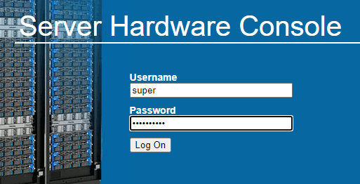

3) Click Remote Control and use H5Viewer to double check server name for SA10

    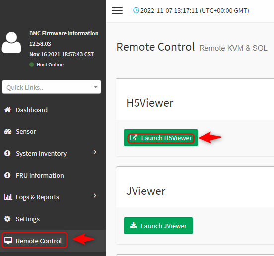

    For S200 click System Control and launch

    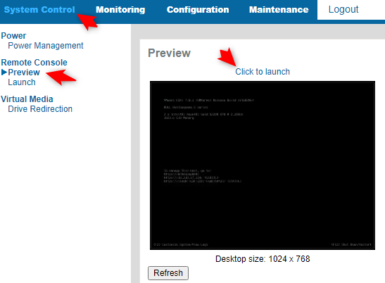

4) Click on admin then Profile

    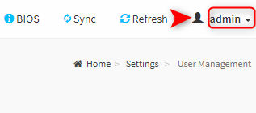
    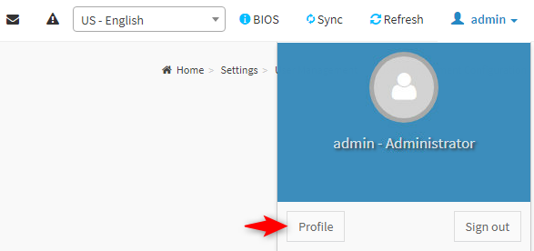

    For S200 click Configuration -> Users, click the user and Modify

    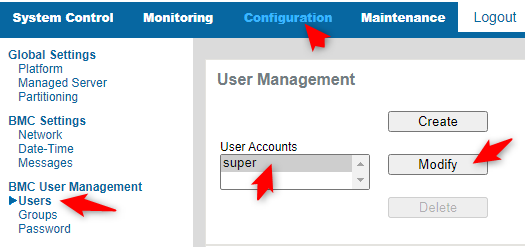

5) Check the "Change password" box and fill in the new password

    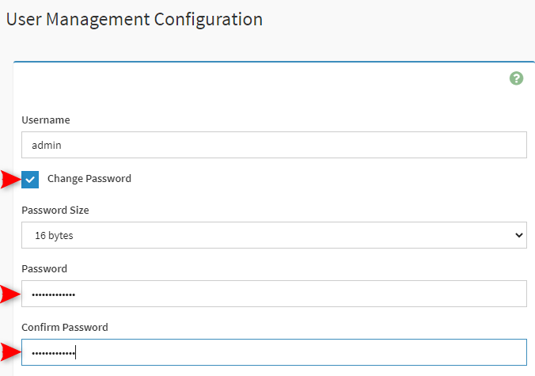

    For S200 change password and Modify from bottom

    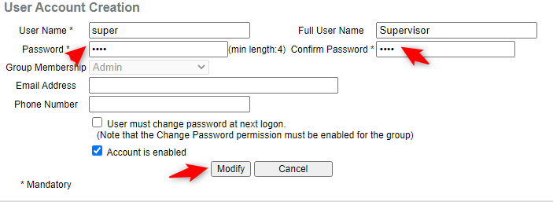

6) Save the changes.
