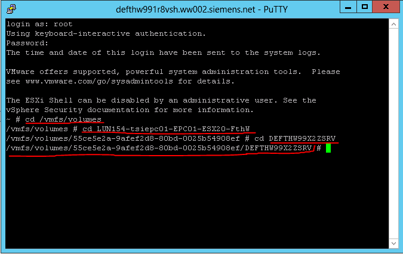
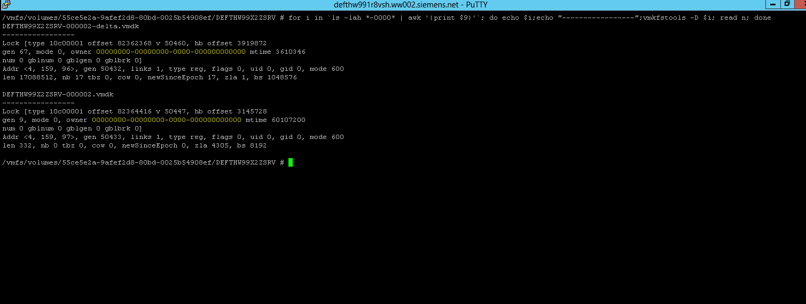

# Check for orphaned VMDK

## Table of content

- [Check for orphaned VMDK](#check-for-orphaned-vmdk)
  - [Table of content](#table-of-content)
  - [Changelog](#changelog)
  - [Introduction](#introduction)
    - [Purpose](#purpose)
    - [Audience](#audience)
    - [Scope](#scope)
- [Procedure](#procedure)
  - [Check vmdk](#check-vmdk)
  - [Remove File](#remove-file)

## Changelog

| Version | Date       | Issue    | Description     | Author(s)      |
| ------- | ---------- | -------- | --------------- | -------------- |
| 0.1     | 23.05.2022 | DHC-4741 | Initial version | Adrian Chiriac |

## Introduction

### Purpose

Check for orphaned VMDKs and delete them.

### Audience

- VCS Operations

### Scope

Check the orphaned VMDK and delete them when it's safe.

# Procedure

## Check vmdk

1. Locate the vmdk's based on the location provided by RVTools

2. Make sure you have SSH enabled on the ESXi and log in as root

3. Go to orphaned VMDK folder:

   ```bash
   cd /vmfs/volumes
   ```

4. Advance to the datastore and folder, where VMDK file should be located::

    

5. Check if these file are in use:

    ```bash
    for i in `ls -lah *-0000* | awk '{print $9}'`; do echo $i;echo "-----------------";vmkfstools -D $i; read n; done
    ```

    

    >**Note**: Output meaning:
    >
    >[root@test-esx1 testvm]# vmkfstools -D test-000008-delta.vmdk
    > Lock [type 10c00001 offset 45842432 v 33232, hb offset 4116480
    > gen 2397, mode 2, owner 00000000-00000000-0000- **000000000000** mtime 5436998] <----- --- -- --- - **MAC address of lock owner**
    > **RO Owner[0]** HB offset 3293184 xxxxxxxx-xxxxxxxx-xxx-xxxxxxxxxxxx <----------------------- --- --- - **MAC address of read-only lock owner**
    > Addr <4, 80, 160>, gen 33179, links 1, type reg, flags 0, uid 0, gid 0, mode 100600
    > len 738242560, nb 353 tbz 0, cow 0, zla 3, bs 2097152

6. Check if the marked portion in the Screen Shot is 00000000-00000000-0000-000000000000 then process can be continued if not STOP and investigated,that file is in use and should NOT be moved.

7. Ensure that there is no lock on the delta file - [KB article](https://kb.vmware.com/selfservice/microsites/search.do?language=en_US&cmd=displayKC&externalId=10051)

    If the command

    ```bash
    vmkfstools -D test-000008-delta.vmdk
    ```

    does not return a valid MAC address in the top field (returns all zeros). Review the field below it, the RO Owner line below it to see which MAC address owns the read only/multi writer lock on the file. In the preceding example, the offending MAC address is: **xx:xx:xx:xx:xx:xx**.

    >**Note:** In some cases, it is possible that it is a Service Console-based lock, an NFS lock or a lock generated by another system or product that can use or read VMFS file systems. The file is locked by a VMkernel child or cartel world and the offending host running the process/world must be rebooted to clear it.

8. After it's identified, the host or backup tool (machine that owns the MAC) locking the file, power it off or stop the responsible service, then restart the management agents on the host running the virtual machine to release the lock.

## Remove File

1. Create folder to move the delta files

    ```bash
    mkdir tobeDeleted
    ```

2. Move files in the new folder

    ```bash
    mv VMNAME*-0000*.vmdk tobeDeleted/
    ```

3. After 7 days come back and delete the files and folder
