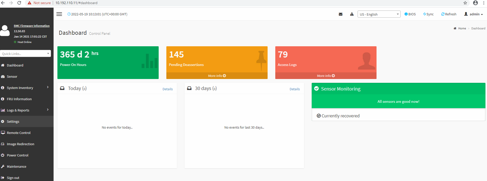
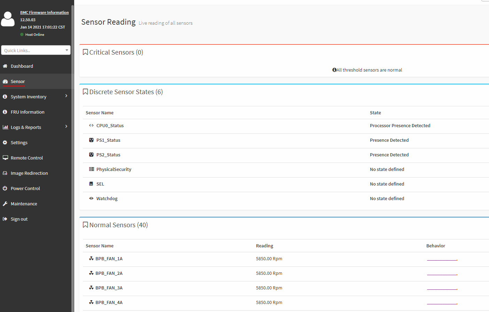

# Check iLO/iDrac for alerts

## Changelog

| Version | Date       | Issue    | Description     | Author(s)      |
| ------- | ---------- | -------- | --------------- | -------------- |
| 0.1     | 23.05.2022 | DHC-4744 | Initial version | Adrian Chiriac |

## Introduction

### Purpose

Check alerts in iLO/IDrac.

### Audience

- VCS Operations

### Scope

## Procedure

1. From Saacon TS access the iLO/iDrac, use admin credentials

2. First check the dashboard

   

3. Next if there are any hardware issues they will be present in the sensor monitoring, you can go to that tab and see the details:

   

> NOTE: If you have an alert present in vCenter but not here use [KB Article](https://kb.vmware.com/s/article/2011531) to restart watchdog service.
