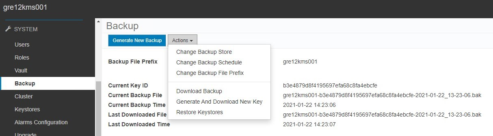
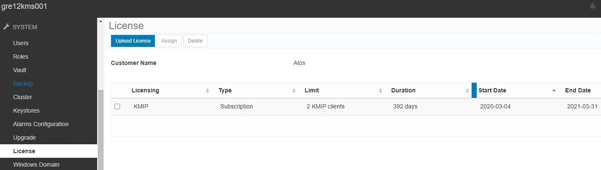
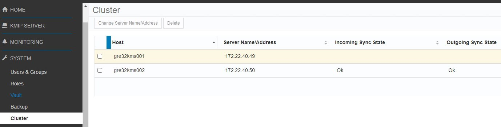
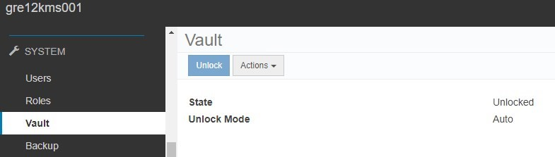
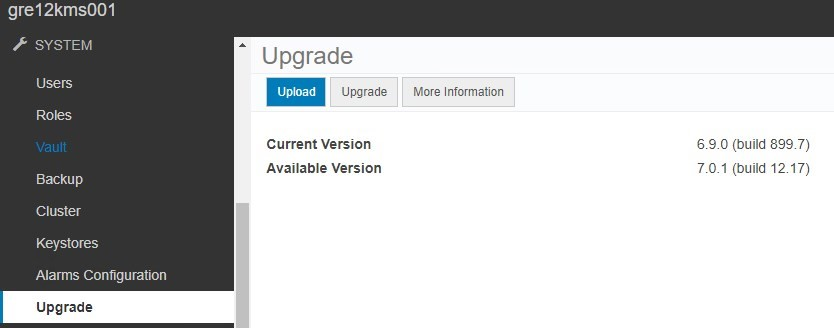
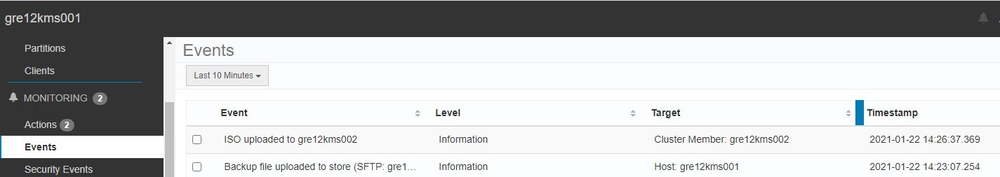
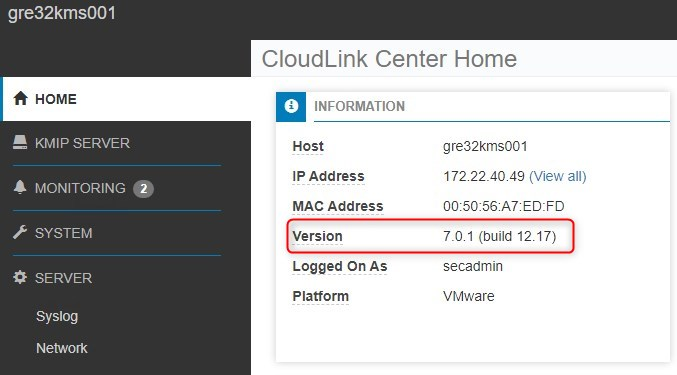
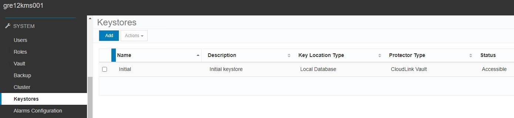
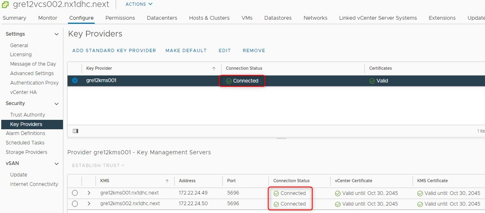

# CloudLink Upgrade

# Changelog
  
| Version | Date       | Description      | Author       |
| ------- | ---------- | ---------------- | -------------|
| 0.1     | 27/01/2021 | First version    | Maciej Losek |
| 0.2     | 11/04/2023 | LCM - VCS 1.6 or newer | Lukasz Tomaszewski |

## Introduction

This work instruction is part of [wiLifeCycleManagement.md](wiLifeCycleManagement.md)

### Purpose

Upgrade CloudLink Center virtual appliance to version 7.1.5 (build 139.85).

### Audience

- VCS Operations
- VCS Engineers

### Scope

1. Installation of CloudLink Center virtual appliance upgrade package.

# Related Documents

| Document |
| -------- |
| [wiLifeCycleManagement](wiLifeCycleManagement.md) |

# Prerequisites

Before you start, please note that screenshots here are for informative purpose, thus you may see different filenames or versions than mentioned in text. Upgrade procedure is the same for different CloudLink versions.

Download the upgrade ISO file. You can find `clc-7.1.5-139.85.iso` in /opt/binaries on ans001 (if binaries were updated) or download from `https://dl.dell.com/downloads/18N33_CloudLink-7.1.5-Upgrade.iso` directly.

Installed version of CloudLink must be in version 7.1.0 (build 3.6) before upgrading to CloudLink 7.1.5.  
All CloudLink Center VM must have at least 6 GB of RAM and 4 vCPUs before you upgrade. If a CloudLink Center VM does
not have sufficient resources for the upgrade, a System does not meet requirements alarm is raised.  
Before starting the upgrade process, it is recommended to back up CloudLink Center VMs and all customer VMs that are stored on encrypted storage. Backups should be performed by using virtual machine snapshots or traditional backup tools.  
Generate a backup file manually to preserve CloudLink Center before the next automatic back up. When you generate a backup file manually, it is recommended that you download the backup file.

Before starting the upgrade process, check that licenses have not expired:

The upgrade process upgrades all servers in a cluster. Ensure that all servers are accessible.

The CloudLink Vault must be set to Auto Unlock mode before the upgrade begins. This allows CloudLink Center to unlock immediately after the upgrade process begins so that all CloudLink Agents can be upgraded. If CloudLink Vault is set to Manual Unlock mode before the upgrade, it remains in Manual Unlock mode after the upgrade and the vault is locked.

Ensure that your account has the Update System permission, which is required to upgrade CloudLink.

# Upgrade

1. Log in to CloudLink Center.
2. Click `System` -> `Upgrade`.
3. In the `Upload ISO` dialogue box click folder icon and go to the upgrade ISO file, and then click Upload. Select `clc-7.1.5-139.85.iso` file.

   

   It can take several seconds for the ISO file to upload to all nodes in a cluster. Current and Available Version will appear. Confirm if ISO was uploaded to all CloudLink cluster nodes.

   

4. Click `Upgrade` to start the upgrade process. In the `Confirm Host Upgrade` dialog box, click `Upgrade`.
Your connection to CloudLink Center is lost during the upgrade process. You are returned to the login screen when the upgrade is complete.

All servers in a CloudLink Center cluster are automatically upgraded during the upgrade process.

# Postupgrade verification

1. After the CloudLink Center upgrade completes, verify that all virtual machines are connected and stable in CloudLink Center.

2. Go to `HOME` and verify if CloudLink version is `7.1.5 (build 139.85)`

   

3. Verify that keystore is accessible by CloudLink Center.
   

4. Restart the virtual machines to ensure that their boot processes are unaffected by the upgrade.

5. Verify if connection status of `Key Provider` in Workload Domain's vCenter is `Connected`

   

6. Once done, remove snapshots taken at the very beginning of upgrade process.

# Rollback

If upgrade process fails, please revert both CloudLink appliances (kms001 and kms002) from snapshots and perform verification following steps 1, 3, 5 described in `Postupgrade verification` section of this work instruction.
