# Clustering vIDM

# Changelog

| Version | Date       | Description              | Author          |
| ------- | ---------- | ------------------------ | --------------- |
| 0.1     | 16/03/2022 | Initial version          | Jakub Zielinski |
| 0.2     | 14/04/2022 | Validation with minor changes | Grzegorz Malek |
| 0.3     | 28/06/2022 | CESDHC-331-chapter Configuring High Availability for the vIDM connectors added | Maciej Losek |

## Introduction

### Purpose

Replace the existing, one-node VMware Identity Manager instance with a clustered installation, consisting of three nodes, to provide load distribution and high availability features.

### Audience

- VCS Operations

### Scope

- Adjust VCS Variables
- Deploy clustered vIDM

# Prerequisites

- The version of the vRealize Suite Lifecycle Manager must be 8.4.1-18067607 or later in order for it to be able to handle VMware Identity Manager 3.3.5.
- Make sure you have the correct local credentials of NSX-T, vROps, vRLI and vCenter appliances.
- Check if the Identity Manager 3.3.5 installation bundle is available in vRSLCM:
  - go to the `Lifecycle Operations` > `Settings` > `Binary Mapping` and check if it's visible there:
    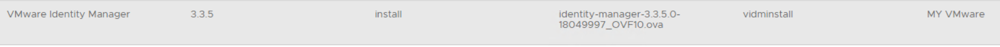
  - if not, download it from VMware: in the `Binary Mapping` section click `Add binaries` > `My VMware` > `Discover` > select `IDM 3.3.5 install bundle` and click `Add`. Wait for the request to finish successfully and re-check if the bundle is visible.
  - if the download from My VMware fails due to the configured account not having proper entitlements, as an alternative you can download the install bundle manually (file name: `identity-manager-3.3.5.0-18049997_OVF10.ova`), upload it to the */data* folder on vRSLCM appliance VM using e.g. WinSCP.
  Then go to `Lifecycle Operations` > `Settings` > `Binary Mapping`, click `Add Binaries` and location type:  `Local`. In `Base Location` enter */data*, click `Discover`, select the  bundle and click ADD button. Wait for mapping request to finish, verify the bundle is visible and delete it from */data* folder.

# Initial Setup

## Adding DNS records

The new deployment of IDM will utilize 5 IPv4 addresses total, however we need DNS records only for four of them. All addresses are going to be in the same subnet as the existing deployment of IDM. The IP assignment is as following:

- .11 - existing IDM IP address and name will be now used as IP of a cluster virtual name
- .19 - IP address for the shared PostgreSQL vIDM database, does not require DNS record
- .24 - IP address for idm002 node
- .25 - IP address for idm003 node
- .26 - IP address for idm004 node
- .31 - IP of new T1 router that we will create in NSX-T

- log in via RDP to one of the domain controllers and open DNS Manager.
- `Forward Lookup Zones` > `FQDN of the management domain` > `New Host (A or AAAA)`. Add records for each node (idm002, idm003, idm004) as shown on the screenshot below.

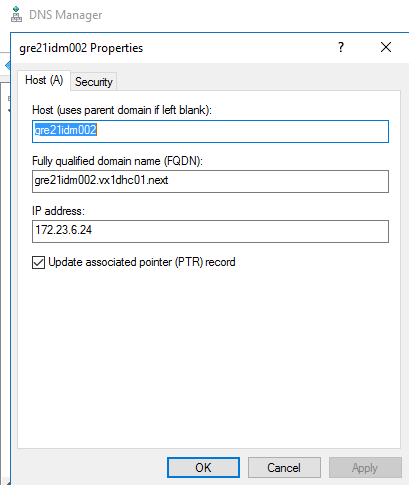

## Adjusting NSX-T firewall rules to allow for the new IDM nodes to communicate properly

Log in to nsx001 with admin credentials and do the following:

- go to `Inventory` > `Virtual Machines`, find the `< locationCode >idm001`, expand the view and go to the `View Related groups` section on the right:  
    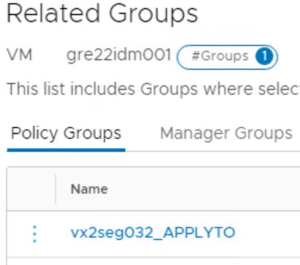
- write down the group name and go to `Inventory` > `Groups`, find that group, click on the three dots on the left and select `Edit`
- on the `Membership criteria` page select `Add criteria` and create a new one: `Virtual Machine` | `Name` | `Starts with` | `{{ locationCode }}idm`
  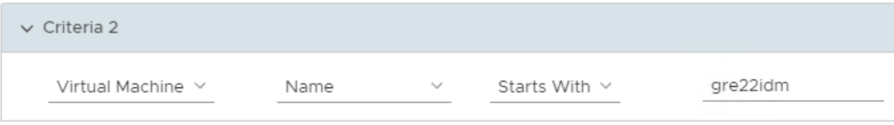
- still within that group, go to `IP Addresses` section and add three new node IP addresses from the `Adding DNS records` section above
    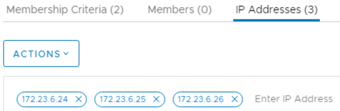
- click `Apply` and `Save`
- if `< locationCode >idm001` is part of multiple groups, that process needs to be repeated for all of them

## Editing group_vars and inventory file (hosts)

We need additional records in `/opt/dhc/update/group_vars/all` and `/opt/dhc/update/hosts`.  

### Editing {{ codeRepositoryPath }}/update/group_vars/all

Please log in via SSH to `ans001` server and modify the mgmtDns section in /update/group_vars/all file. Please note that cidr of each idm instance should be the same as original idm001 entry (the same subnet for each of these nodes should be used).

Here is an example:

```yaml
mgmtDns:
  idm001:
    name: "gre21idm001"
    octet: 11
    cidr: "172.23.6"
  idm002:
    name: "gre21idm002"
    octet: 24
    cidr: "172.23.6"
  idm003:
    name: "gre21idm003"
    octet: 25
    cidr: "172.23.6"
  idm004:
    name: "gre21idm004"
    octet: 26
    cidr: "172.23.6"
```

In addition please add `vidmPsqlIp` variable into `/opt/dhc/update/group_vars/all` which is needed for later step where ansible playbook will be run (the same subnet as for idm nodes MUST BE used).

Example:

```yaml
vidmPsqlIp: 172.23.6.19
```

### Editing {{ codeRepositoryPath }}/update/hosts  

Please add 3 new vIDM nodes to the [idm] section in /update/group_vars/all file:

Example:  

```txt
[idm]
idm001  ansible_host=gre21idm001.vx1dhc01.next
idm002  ansible_host=gre21idm002.vx1dhc01.next
idm003  ansible_host=gre21idm003.vx1dhc01.next
idm004  ansible_host=gre21idm004.vx1dhc01.next
```

# Continuing Setup

From this point on, the existing vIDM instance will no longer be available, therefore it is important to log in to the vIDM appliance admin GUI and document any possible customizations that may have been implemented. Review the configuration of IDM and take screenshots of any possible customizations that are not part of the original deployment. You as the administrator should know best if any were performed. An example of such settings that may have been adjusted would be:

- sync frequency
- mapped attributes
- group DNs that we want to sync to the directory
- user DNs
- RBAC

## Remove global environment from vRSLCM

Log in to vRSLCM GUI as *vcfadmin@local* and go to `Lifecycle Operations` > `Environments` > click three dots next to `globalenvironment` and `Export Configuration` > `Advanced`

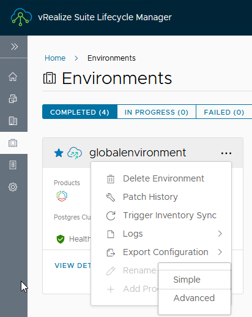

Once you have the configuration stored, click again the three dots and select `Delete Environment`.

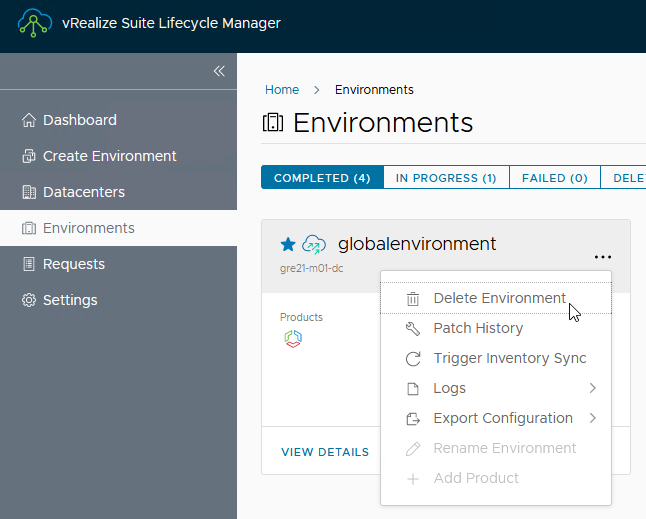

Hit `DELETE` in the pop-up window.

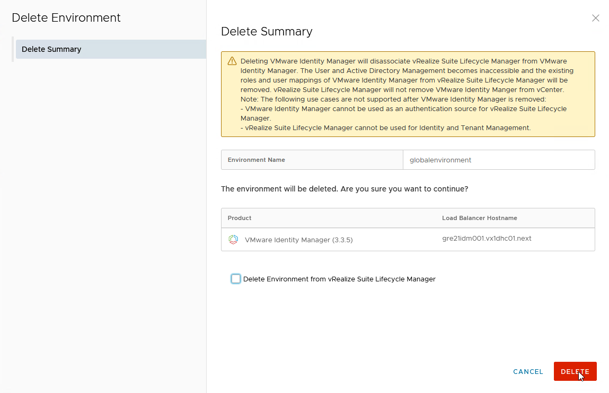

Wait for the workflow to complete.

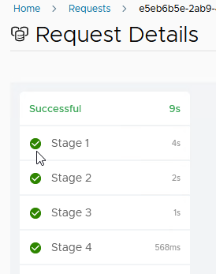

Go to `Environments` > `DELETED` tab and delete `globalenvironment` entirely.
Click the three dots and select Delete.

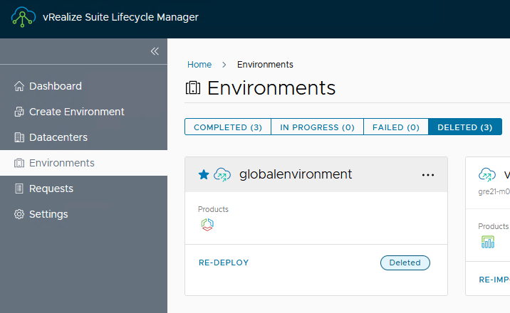

Go to vRSLCM `Locker` > `Certificates`. Download `{{ locationCode }}idm001` certificate, then delete it from the Locker. Keep the certificate stored in case you need to revert this entire operation.

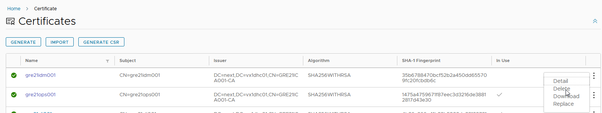

## Power Off idm001

Log in to vCenter Server and power-off the VM `{{ locationCode }}idm001`. Keep it for now in case you need to revert this entire operation.

## Create the certificate for vIDM cluster

vIDM cluster requires a new certificate containing the virtual name and node names. This operation has been automated, therefore log in to ans001 and trigger the following playbook from **/opt/dhc/update**:

```bash
ansible-playbook createVidmCluster.yml
```

>The playbook triggers creation of vIDM cluster, **which will fail** due to lack of NLB, however in the beginning it creates the certificate needed for creation of necessary NLB.  

The playbook should failed with error message as below:

```txt
"changed": false,
"msg": "The request was not completed, login to VRSLCM for more information."
```

Once it's failed, go back to vRSLCM Web GUI, go to `Lifecycle Operations` > `Requests` and click the failed task "globalenvironment - Create Environment". The task should be failed at testing Load Balancer which will be created in next steps of this work instruction. Go to `Requests` and you should see, :

```txt
Error Code: LCMVIDM71092
Failed to trust load balancer's certificate. Ensure load balancer has proper root certificate or provide the root certificate chain as retry param 'vidmLBRootCertificateChain' and try again.
```

Go to vRSLCM `Locker` and download the new certificate, we will need to import it later to NSX-T Load Balancer.  
The vRSLCM request that creates vIDM cluster will be restarted after that.

## Create the T1 Gateway and Network Load Balancer for vIDM cluster

Log In to Web GUI of nsx001 with admin credentials. As you are using local credentials use the following link:  
`https://FQDN-of-the-NSX/login.jsp?idp=local`

### Import LB Certificate

Go to `System` > `Settings` > `Certificates` and click `Import` > `Import Certificate`  

- Name: `WSA-LOADBALANCER-idm001`
- Certificate Contents: open the certificate downloaded from vRSLCM and copy everything starting from the first `BEGIN CERTIFICATE` line, up until last `END CERTIFICATE` line.
- Private Key: copy the entire section that starts with `BEGIN PRIVATE KEY` and ends with `END PRIVATE KEY`.
- Service Certificate: Yes
- Click `IMPORT`.

### Create T1 Gateway

Go to `Networking` > `Connectivity` > `Tier-1 Gateways` and click `ADD TIER-1 GATEWAY`.

- Name: `reg-a-m01-lb01-t1-gw01`
- Linked Tier-0 Gateway: `Not set`
- Edge Cluster: `{{ locationCode }}ecn101`
- Click `Save` and when prompted if we want to continue configuring this Tier-1 gateway, click `Yes`
- Edges Pool Allocation Size: `LB Small`
- Click `Save`
     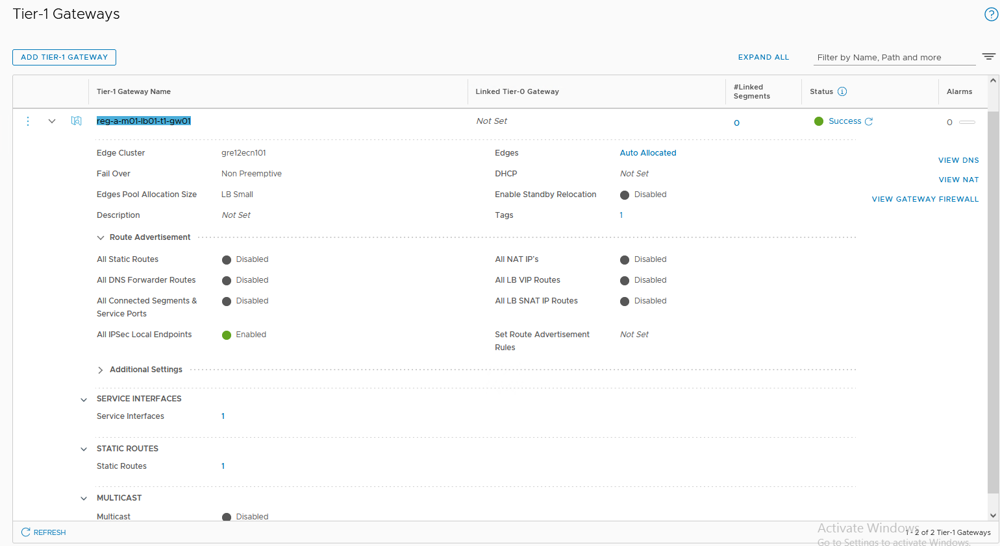
- Within the `Service interfaces` section click `Set` to configure the service interface for this T1 gateway as shown on the figure below. Note that IP Address in your case will be in a different subnet (the same subnet as idm001):
  - Name: `{{ locationCode }}edg101_T1GW`
  - IP Address / Mask: `{{ networkAvnCrossRegion.cidr }}.31/24` (This is the IP that was listed in the `Initial Setup` > `Adding DNS records` section: .31)
  - Connected To (Segment): `xreg-m01-seg01`
  - Remaining settings left at default
  - Click `Save` and `Close`.
    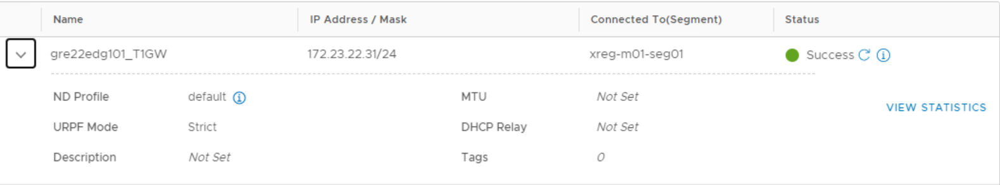
- Within the `Static Routes` section click `Set` and then `ADD STATIC ROUTE` to configure the static route:  
  - Name: `default`
  - Network `0.0.0.0/0`
  - Next Hops IP Address: `{{networkAvnCrossRegion.cidr }}.1`
  - Admin Distance: `1`
  - Scope: `{{ locationCode}}edg101_T1GW`
  - Click `Save` and `Close`
    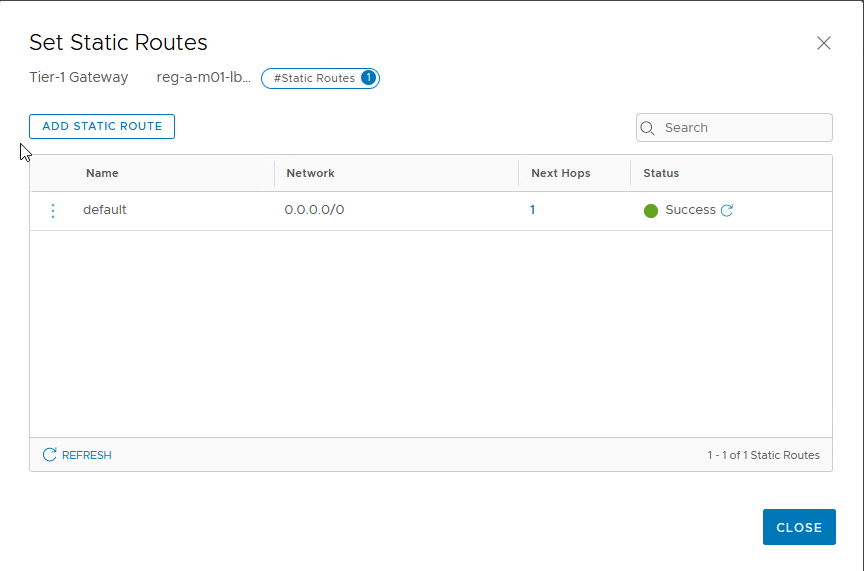  
    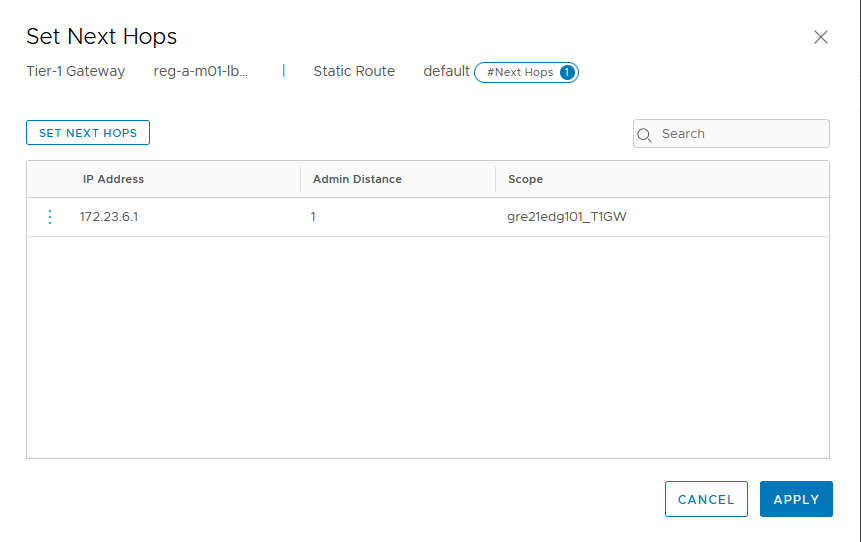

- Click `Close Editing` to complete the creation and configuration of the T1 gateway

### Create LB Active Monitor

Go to `Networking` > `Network Services` > `Load Balancing` > `Monitors` and click `ADD ACTIVE MONITOR` > `HTTPS` and add the monitor as following:

- Name: `wsa-https-monitor`
- Monitoring Port: `443`
- Monitoring Interval: `3`
- Timeout Period(seconds): `10`

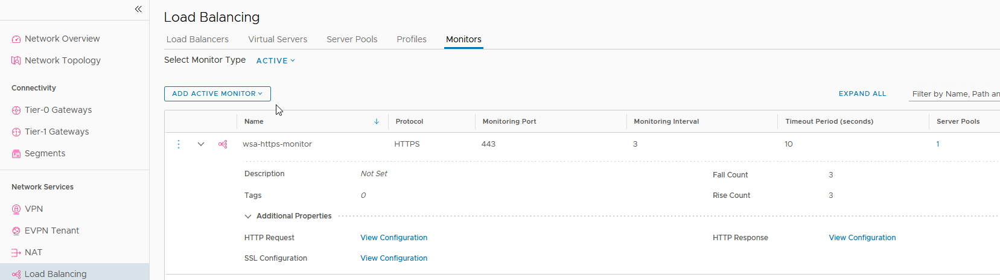

In the `Additional Properties` section click `Configure` next to `HTTP Request` and configure it as following:

- HTTP Method: `Get`
- HTTP Request URL: `/SAAS/API/1.0/REST/system/health/heartbeat`
- HTTP Request Version: `1.1`

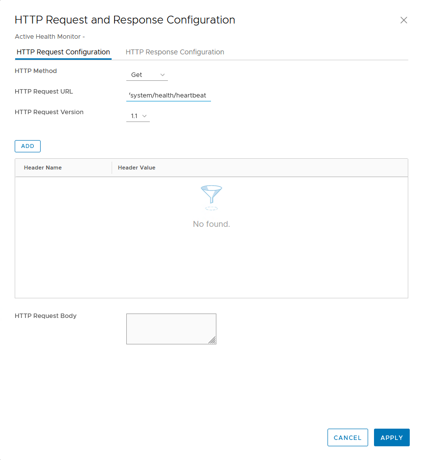

In the `HTTP Response Configuration` section configure the settings as following:

- HTTP Response Code: `200`, `201`
- Click `Apply`

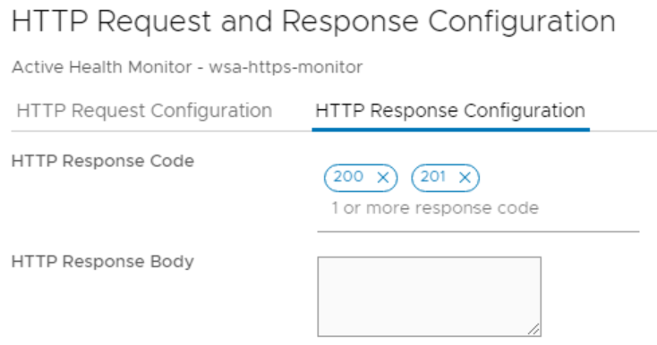

Click `Configure` next to `SSL Configuration` and configure it as following:  

- Server SSL: `Enabled`
- CLient Certificate: `WSA-LOADBALANCER-idm001`
- Server SSL Profile: `default-balanced-server-ssl-profile`
- Click `Save`

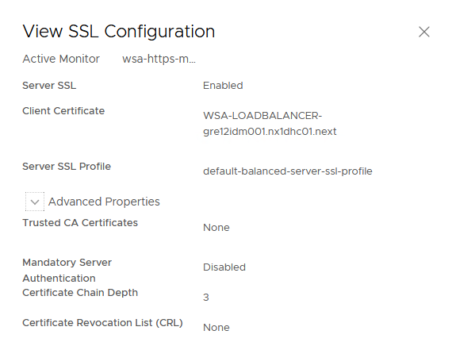

Click `Save` one more time to complete the LB Active Monitor creation.

### Create LB Profiles

Go to `Networking` > `Network Services` > `Load Balancing` > `Profiles`.

CLick `ADD APPLICATION PROFILE` > `HTTP` to create an application profile:

- NAME: `wsa-http-app-profile`
- Idle Timeout(seconds): `3600`
- Click `Save`

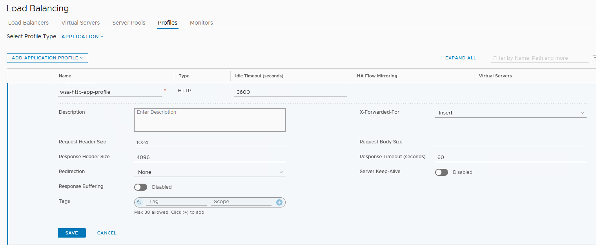

Create the second HTTP application profile:

- NAME: `wsa-http-profile-redirect`
- Idle Timeout(seconds): `3600`
- Redirection: `HTTP to HTTPS Redirect`
- X-Forwarded-For: `None`
- Click `Save`

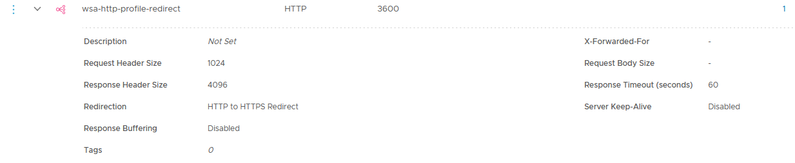

### Create LB Server Pool

Go to `Networking` > `Network Services` > `Load Balancing` > `Server Pools` and click `ADD SERVER POOL` and configure it as following:

- Name: `wsa-server-pool`
- Algorithm: `Least Connection`
- Members/Group:
  - Enter individual members:
    - Name: `wsa01svr01a`
    - IP: `{{ networkAvnCrossRegion.cidr }}.24`
    - Port: `443`
    - Click `Save`.
  - repeat the process for the remaining `wsa01svr01b` and `wsa01svr01c` nodes
    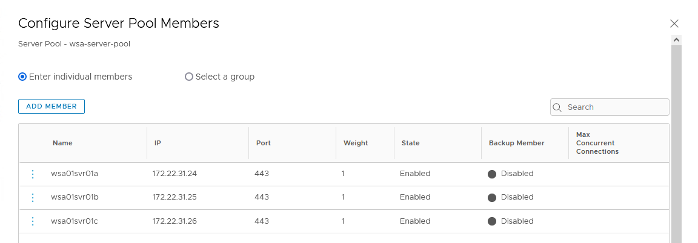
- Click `Set` next to `Active Monitor`, select `wsa-https-monitor` and click `Apply`.
- Click `Save`.
  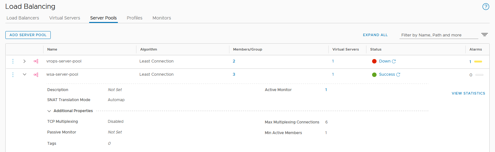

### Create Load Balancer

Go to `Networking` > `Network Services` > `Load Balancing` > `Load Balancers` and click `ADD LOAD BALANCER`:

- Name: `wsa-https`
- Attachment: `reg-a-m01-lb01-t1-gw01`
- Click `Save` and `No` as an answer for question if you `Want to continue configuring this Load Balancer`.

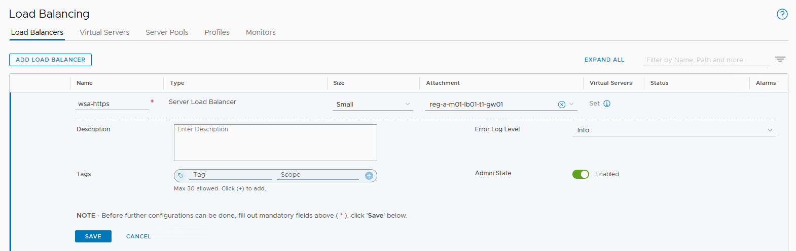  

### Create Virtual Servers  

Let's add 2 virtual servers. Go to `Networking` > `Network Services` > `Load Balancing` > `Virtual Servers` > `ADD VIRTUAL SERVER`.

First virtual server:

- Type: `L7 HTTP`
- Name: `wsa-http-redirect`
- IP Address: ``{{ networkAvnCrossRegion.cidr }}.11``
- Ports: `80`
- Load Balancer: `wsa-https`
- Server Pool: leave empty
- Application Profile: `wsa-http-profile-redirect`
- Click `Save`

Second virtual server:

- Type: `L7 HTTP`
- Name: `wsa-https`
- IP Address: ``{{ networkAvnCrossRegion.cidr }}.11``
- Ports: `443`
- Load Balancer: `wsa-https`
- Server Pool: `wsa-server-pool`
- Application Profile: `default-http-lb-app-profile`
- Click `Save`

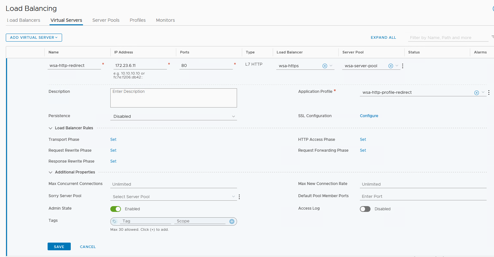

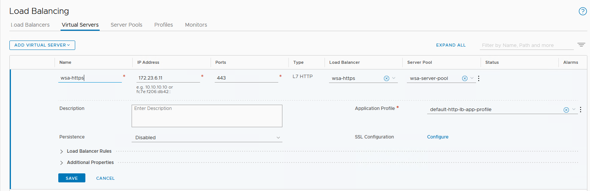

After both virtual servers are created, edit the `wsa-https` virtual server and click `Configure` next to `SSL Configuration` and configure it as following:  
`Client SSL` tab:

- Client SSL: `Enabled`
- Default Certificate: `WSA-LOADBALANCER-idm001`
- Client SSL Profile: `default-balanced-client-ssl-profile`

`Server SSL` tab:

- ServerSSL: `Enabled`
- Client Certificate: `WSA-LOADBALANCER-idm001`
- Server SSL Profile: `default-balanced-server-ssl-profile`
- Click `Save`

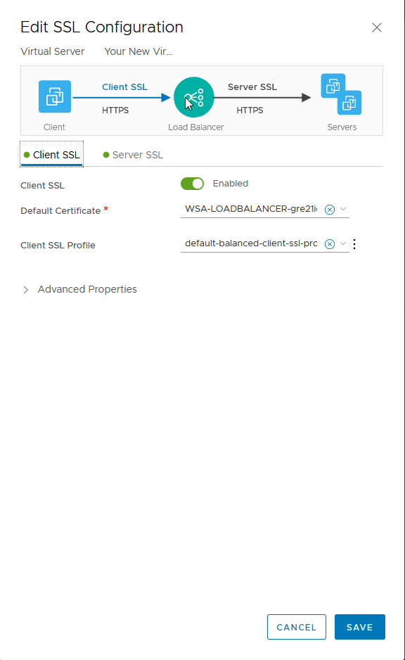

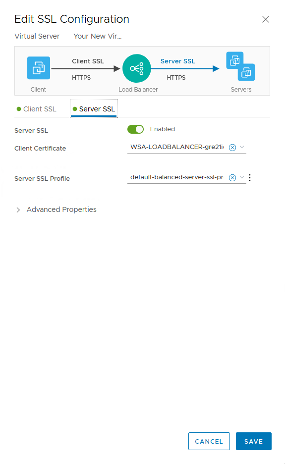

## Create vIDM cluster

Log in to vRSLCM web GUI. Go to Lifecycle Operations > Requests and click the failed task "globalenvironment - Create Environment". The task should be failed at testing Load Balancer, which we created in previous task.  
Click `RETRY`. Leave the default inputs and click `SUBMIT`. Wait until the cluster is deployed.  

> It may take approx. 1-1,5h

Once the pipeline finishes, go to ansible node (ans001) and run playbook from `/opt/dhc/update`:

```bash
ansible-playbook createVidmClusterPostTasks.yml
```

## Configure Identity Manager

Log in to IDM001 as `admin`, go to `Identity & Access Management` > `Setup` and join each node of the cluster to Active Directory.

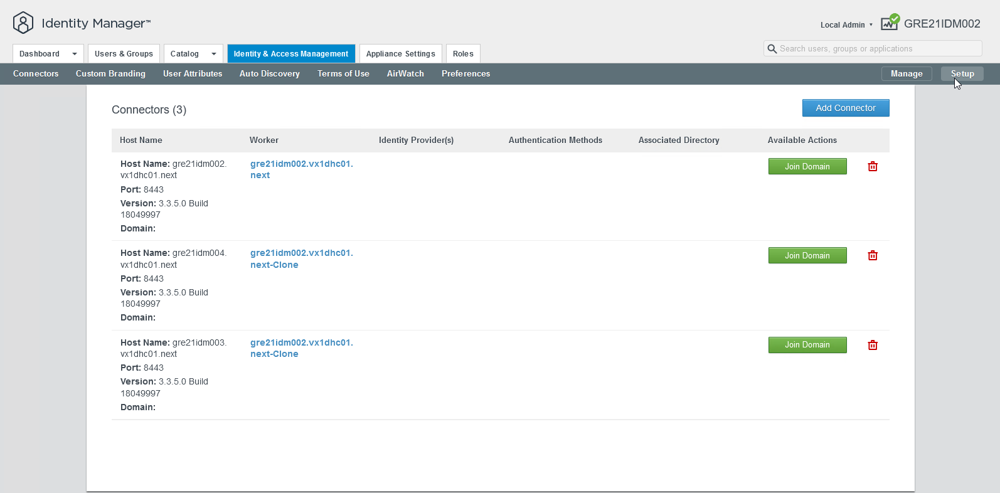

`OU of domain to join` depends on your environment, here we selected `"OU=gre21,OU=Servers,OU=DHC,DC=vx1dhc01,DC=next"` as this is the OU for our computer accounts in the Active Directory domain.

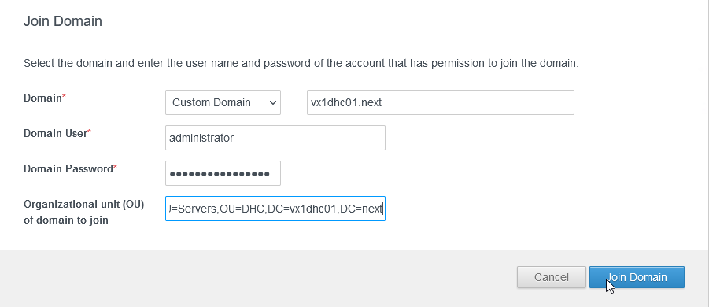

Next, we're going to configure the AD synchronization between AD and IDM:

- go to `Identity & Access Management` > `User Attributes`, uncheck the `email` attribute and click `Save`.
- go to `Identity & Access Management` > `Directories` and select `Add Directory` > `Add Active Directory over LDAP/IWA`
- configure the settings as following:
  - Directory Name: `Management domain's FQDN`
  - `Active Directory (Integrated Windows Authentication)` selected
  - Sync Connector: `{{ locationCode }}idm002`
  - Authentication: `Yes`
  - Directory Search Attribute: `sAMAccountName`
  - Domain Name: `Management domain's FQDN`
  - Domain Admin Username & password
  - Bind User Name and password: `Domain Admin Username & password`
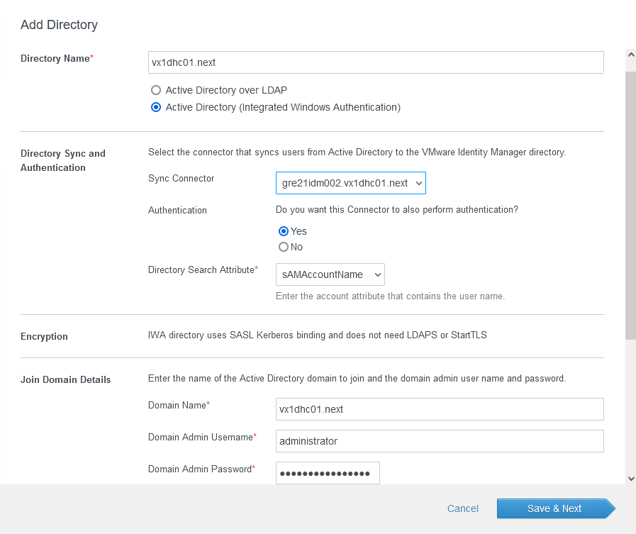

Click `Next` on the `Select the Domains` page:

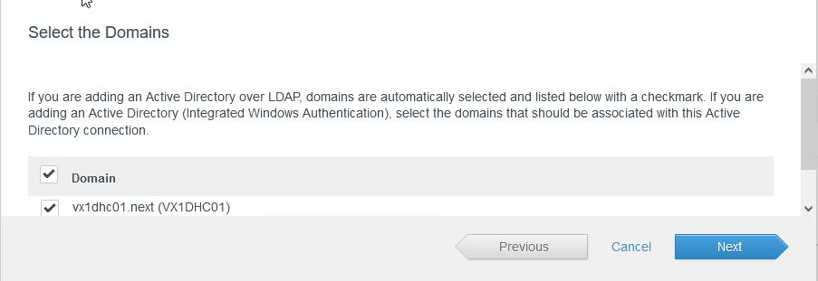

On the `Map User Attributes` page make sure that only `userName`, `firstName`, `lastName` attributes are selected and click `Next`.

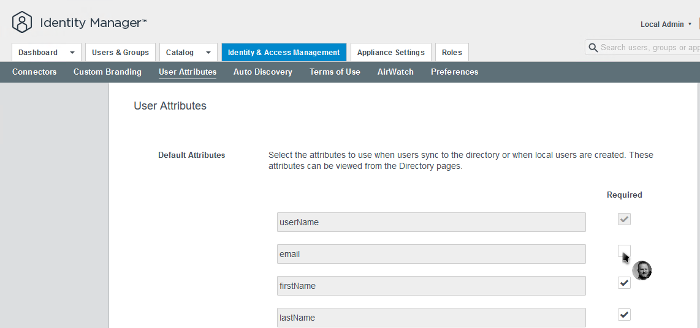

On the `Select the groups (users) you want to sync` page, specify the location (written in the distinguished name format) from which all the groups should be pulled and synced later on. You can sync all of them or select only some of them.

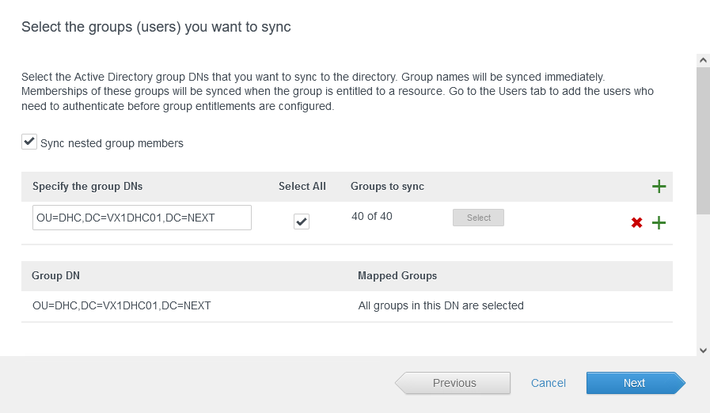

On the `Select the Users you want to sync` page you can list aditional user or group DNs to be synced as well.

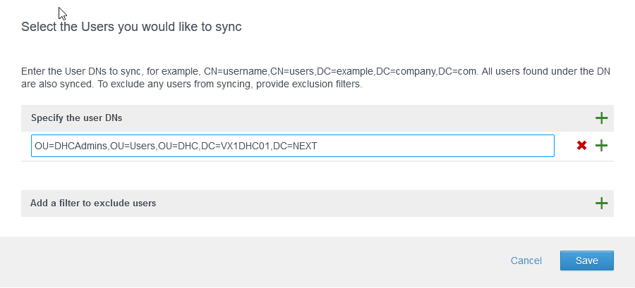

Click `Sync Directories` and wait for the process to finish. You can also go to `Identity & Access Management` > `Manage` > `Directories`, click `Sync Now` and review the sync log to verify.

### Configuring High Availability for the vIDM connectors

It's required to configure connectors for high availability as they act as a nodes in a cluster. If one of the connector instances becomes unavailable for any reason, other instances will still be available. To do that all the connector instances must be associated with the `WorkspaceIDP__1`  identity provider.  
Follow below steps to complete this task (the screenshots below are only demonstrative).

1. In the VMware Identity Manager administration console, select the `Identity & Access Management` tab, then select the Identity Providers tab.

2. In the `Identity Providers` page, find the `WorkspaceIDP__1` instance and click the link.  
  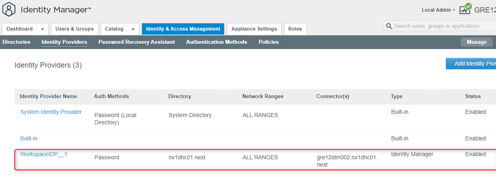

3. On the `WorkspaceIDP__1` page, scroll to the `Connector(s)` section, select `idm003` connector instance from the drop-down menu, enter the `Bind User password` and `Domain Admin password`, click `Add Connector`.
  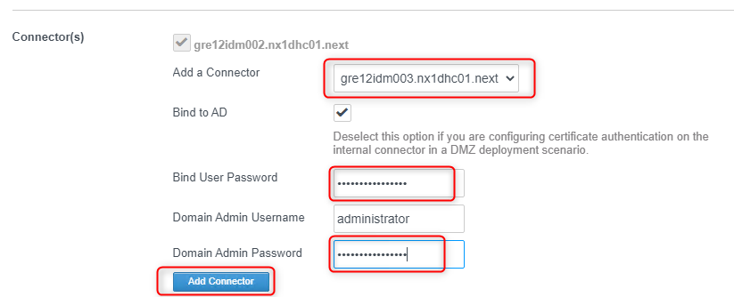  

    Repeat steps 3 for `idm004`.  

4. Change `IdP Hostname` to vIDM cluster name, e.g.: < locationCode >-idm001.< domainName > and click `Save` to save IdP configuration.  

    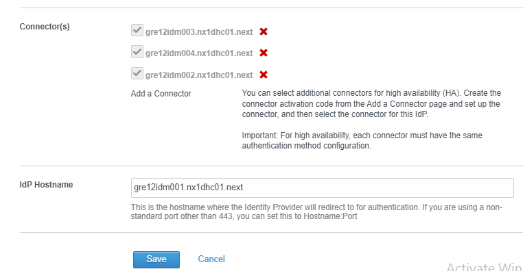

## Configure vRealize Operations Manager Authentication Source

In vROps go to `Administration` > `Access` > `Authentication Sources`. Select the existing idm001 authentication source, click three dots and then `Edit`

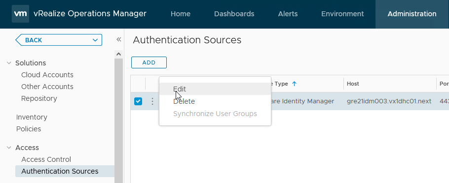

Provide IDM admin credentials. Click `Test` and accept the certificate. Click OK to save the changes.

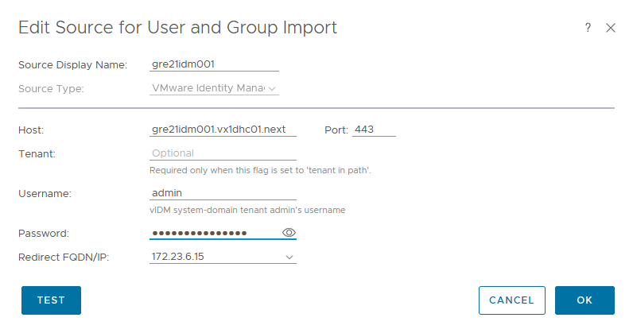

## Configure NSX-T Authentication Sources

- Log in to vRSLCM as *vcfadmin@local* and go to `Locker` > `Certificates` and select idm001 certificate. Copy the SHA256 value to Notepad for later use.

  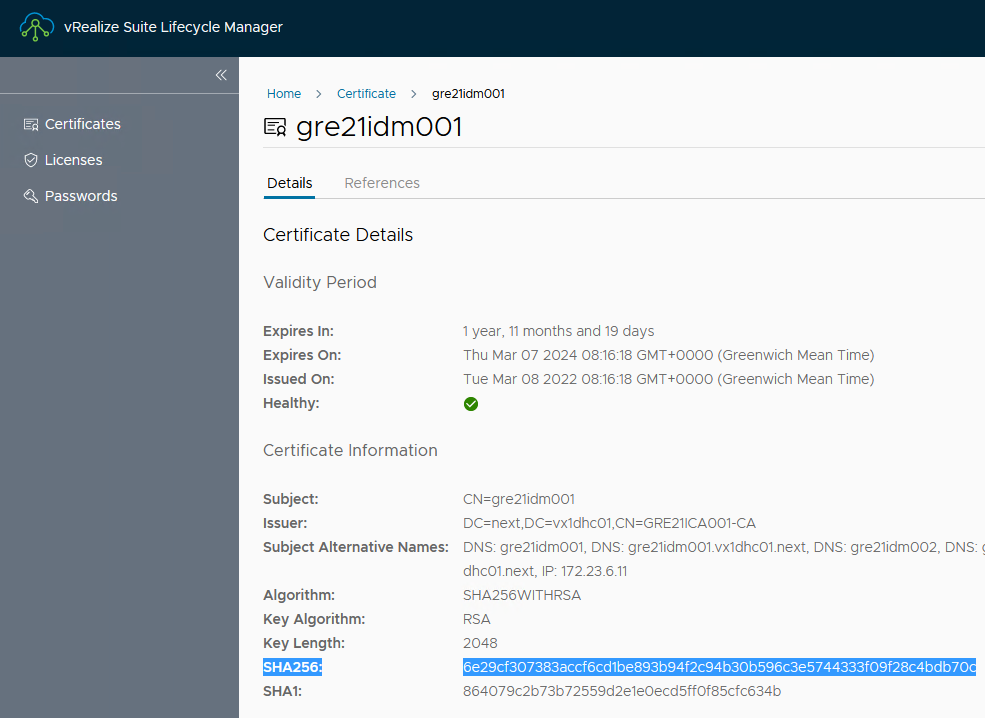

- Log in to IDM and click on the downward arrow next to the `Catalog button` > `Settings` > `Remote App Access` and click the `Create Client` button:
  - Access Type: `Service Client Token`
  - Client ID: `{{ locationCode }}nsx001`
  - `Advanced` > Click on `Generate Shared Secret` and save the generated string for later use
  - leave remaining options at default
  - click `Add`.

  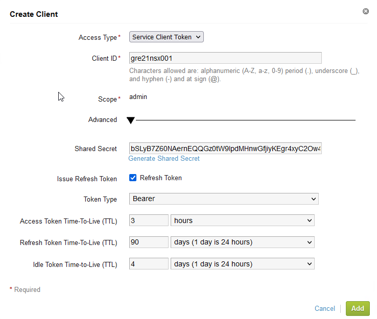

- Log in to nsx001 as admin and go to `System` > `Settings` > `User Management` > `VMware Identity Manager` > `Edit`

  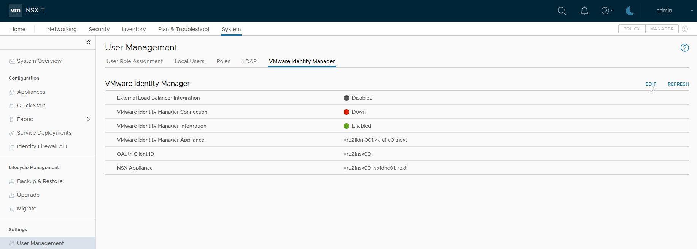

  - VMware Identity Manager: `Enabled`
  - VMware Identity Manager Appliance: `{{ locationCode }}idm001.FQDN-of-management-domain`
  - OAuth Client ID: `{{ locationCode }}nsx001`
  - OAuth Client Secret: `Shared Secret generated in IDM`
  - SSL Thumbprint: SHA256 value of the `{{ locationCode }}idm001` certificate, copied from vRSLCM Locker.
  - `Save`.

  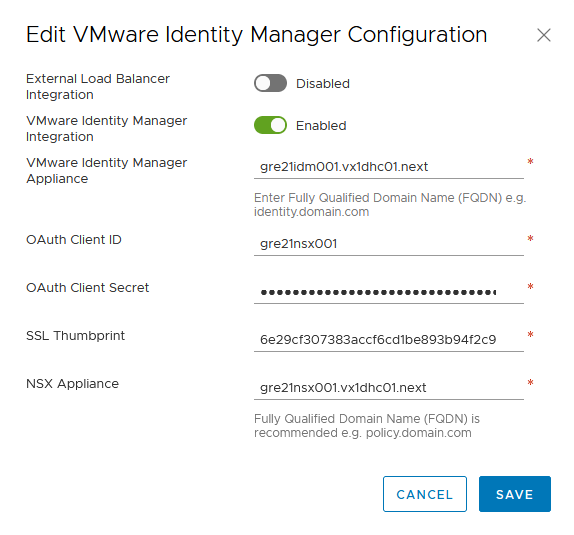

VMware Identity Manager's connection status should show up as `Up` and VMware Identity Manager's Integration as `Enabled`.

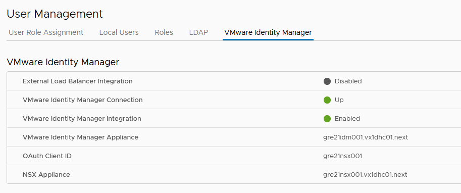

**Repeat those steps for NSX002 also**

## Configure vRealize Log Insight Authentication Sources

Log in to Log Insight as admin, go to `Administration` > `Configuration` > `Authentication` > `VMware Identity Manager` tab and configure as following:

- Enable Single Sign-On: `Yes`
- Host: `{{ locationCode }}idm001.FQDN-of-management-domain`
- API port: `443`
- Username: `admin` (local IDM account with administrative privileges)
- Password `password for the admin user`
- Redirect URL Host: `{{ locationCode }}vli001.FQDN-of-management-domain`
- click `Test connection` and accept the certificate. Test should be successful and the Status should show up as `Connected`


## Configure vRealize Network Insight Authentication Sources

Log in to IDM and click on the downward arrow next to the `Catalog button` > `Settings` > `Remote App Access` and click the `Create Client` button:

- Access Type: `Service Client Token`
- Client ID: `vrlcm-vrni-oauthclient`
- `Advanced` > Click on `Generate Shared Secret` and save the generated string for later use
- leave remaining options at default
- click `Add`.


Log in as admin to vRNI. Click the cog in the upper-right corner of the screen and click `Settings`. Go to `Identity and Access Management` > `VMware Identity Manager` > `Edit` and configure as following:

- OAuth Client ID: `vrlcm-vrni-oauthclient`
- OAuth Client Secret: `generated shared secret`
- SHA356 Thumbprint: SHA256 value of the `{{ locationCode }}idm001` certificate, copied from vRSLCM Locker
- `Submit`

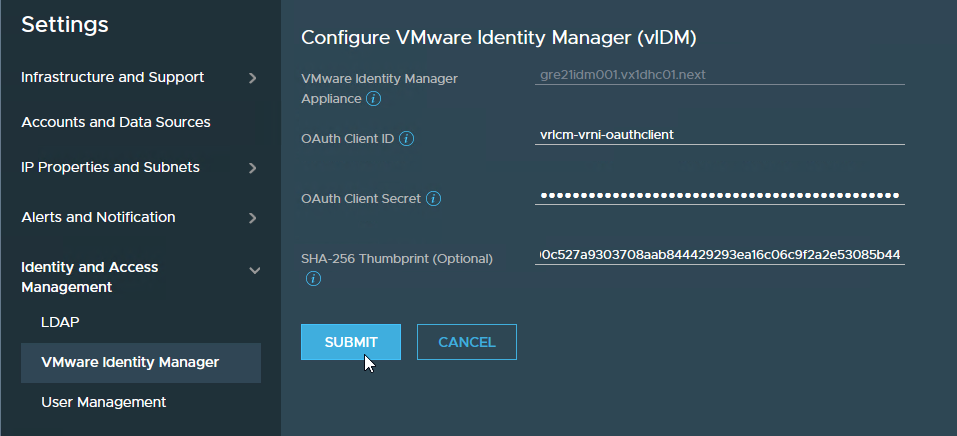

## Install vRLI agents on cluster nodes idm002, idm003 and idm004

In order to install vRLI agents on vIDM cluster nodes, run the following playbook from the */opt/dhc/update* folder:

```bash
ansible-playbook installVrliAgentsOnVidm.yml
```

Once the playbook completes, you can verify the success of the installation by logging in to VMware Log Insight and going to Administration -> Agents. Locate the three nodes of the cluster on this list to make sure all is well.

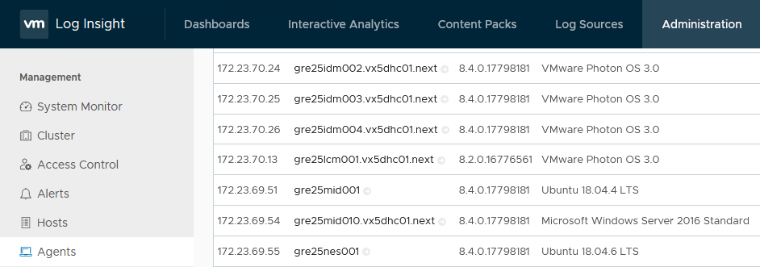
