# Compliance Overview

## Table of Contents

- [Introduction](#introduction)
  - [Purpose](#purpose)
  - [Audience](#audience)
  - [Scope](#scope)
- [Prerequisites](#prerequisites)
- [Related Documents](#related-documents)
- [Alcatraz Non compliant measure remediation](#1-alcatraz-non-compliant-measure-remediation)
- [Nessus Vulnerability](#2-nessus-remediation)
- [Customer Specifics - Siemens CERT (Siemens Specific)](#3-customer-specifics)
- [Enhance VCS Security Measures Remediation](#4-enhance-vcs-security-measures-remediation)

## Changelog

| Version | Date       | Description              | Author(s)       |
| ------- | ---------- | ------------------------ | --------------- |
| 0.1     | 2021-11-29 | Initial draft creation   | Kathirvel Krishnasamy |
| 0.2     | 2022-02-14 | Initial draft creation   | Kathirvel Krishnasamy |
| 0.3     | 2022-03-14 | Added work instructions  | Kathirvel Krishnasamy |
| 0.3     | 2022-05-25 | Added section 3.3.2 Log4j vulnerability Remediation | Kathirvel Krishnasamy |
| 0.4     | 2022-06-20 | Updated sections 2.2.1 , 4.1.1 and 4.1.2 | Kathirvel Krishnasamy |
| 0.5     | 2022-07-04 | Added section 2.3.1.3 | Kathirvel Krishnasamy |
| 0.6     | 2022-11-25 | updated section 2.2.2 | Vani Yemula |
| 0.7     | 2022-12-20 | updated section 4 and added Section 5 | Prajacta Cerejo |
| 0.8     | 2023-03-02 | updated section 2.1.2 | Abhishek Sawant |
| 0.9     | 2023-05-03 | VCS-9583- Updated TBD documentation and Siemens CERT | Alpesh Kumbhare |
| 1.0     | 2023-05-03 | VCS-10852-updated new playbook for vsphere VMs compliance management (shutdown VM) | Vani Yemula |
| 1.1     | 2023-08-24 | Removed section 3.2.2 Log4j vulnerability Remediation | Ciprian Sferle |
| 1.2     | 2023-12-12 | improved indentation and indexing | Vani Yemula |
| 1.3     | 2025-05-21 | VCS-16070 - Adjusted prerequisite expectations to ensure the Alcatraz version is upgraded according to the Version Matrix | Divyaprakash J |
| 1.4     | 2025-11-05 | VCS-17363 - Remove section about NSX TLS (obsolete) | Lukasz Bienkowski |
| 1.5     | 2025-12-19 | VCS-17432 - Automation to remediate DHC 2.0.x TOSCA findings (Web servers IIS) WI00017 | Ciprian Sferle |

## Introduction

### Purpose

View applicable compliance standards for VCS and playbooks which can be used to make sure corresponding VCS components are compliant to these standards.

### Audience

- VCS Engineers
- VCS Architects

### Scope

Security Compliance Standards to be followed as per user requirement by stages(Deploy/Manage/Update)

- Alcatraz Non compliant measure remediation
- Nessus Vulnerability
- Customer Specifics - Siemens CERT (Siemens Specific)
- Enhance VCS Security Measures Remediation

### Related Documents

This document is a subset of Atos Technology Lifecycle Management (ATLM) artefacts. All documents are stored in the VCS documentation repository.

## Prerequisites

Before executing compliance remediation, ensure the Alcatraz scanner is installed at the correct path and its version matches the one defined in the versionMatrix.json. If these conditions aren't met, the generateAlcatrazReports.yml playbook may fail or produce incomplete results.

### Problem Overview

1. Path Mismatch

- Older Alcatraz versions extract to:

```shell
/var/opt/bmc/Alcatraz/os
```

- Starting from version 2.0.x, the correct and expected path is:

```shell
/var/opt/bmc/os
```

1. Version Mismatch

- Some systems might have older versions like 8.0.03 while the versionMatrix.json requires something newer like 8.2.36. This mismatch can result in:
- Playbook task failures
- Incomplete or inaccurate compliance scans

### Example Failure

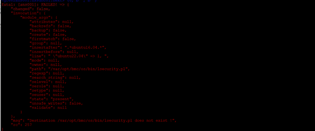

### Solution

Execute the following playbook on the *ans001* server from the */opt/dhc/update* folder.

**Execute:**

```shell
ansible-playbook upgradeAlcatraz.yml
```

You may use tags to limit the host scope. For example:

```shell
ansible-playbook generateAlcatrazReports.yml --tags runScanAlcatrazWindows
ansible-playbook generateAlcatrazReports.yml --tags runScanAlcatrazLinux
```

#### What the Playbook Does :-

- Detects the currently installed Alcatraz version in both old and new paths
- Compares the detected version with the target version from versionMatrix.json
- If needed, it will:
  - Move files from the legacy path to the correct path
  - Upgrade Alcatraz to the expected version
  - Normalize the directory structure across environments

This will ensure that the correct directory structure and version are in place, avoiding failures in the **generateAlcatrazReports.yml** playbook.

Before executing compliance remediation, ensure the Alcatraz scanner is installed at the correct path and its version matches the one defined in the versionMatrix.json. If these conditions aren't met, the generateAlcatrazReports.yml playbook may fail or produce incomplete results.

## 1 Alcatraz Non-compliant measure remediation

### 1.1 Windows

#### 1.1.1 Windows Operating Systems

The playbook (Path: */opt/dhc/manage/complianceAlcatrazSecurityWindows.yml*) applies remediation on windows vm for below mentioned measure ids if corresponding vm is non-compliant as per these measures.

- SW00001
- SW00038
- SW00039
- SW00077

**Execute:**

```shell
  
ansible-playbook complianceAlcatrazSecurityWindows.yml
  
```

**Validate:**

Execute the following playbook on *ans001* server from */opt/dhc/manage* folder, to generate alcatraz reports and check the measures ids those have remediated. Reports stores on *ans001* server in `/backup/reports/` folder.

**Execute:**

```shell

ansible-playbook generateAlcatrazReports.yml

```

#### 1.1.2 Windows Applications

The playbook (Path: */opt/dhc/manage/complianceAlcatrazSecurityIIS.yml*) applies remediation on windows vm that runs IIS for below mentioned measure ids if corresponding vm is non-compliant as per these measures.

- WI00007
- WI00016
- WI00017
- WI00020
- WI00022
- WI00024
- WI00025
- WI00027
- WI00028

**Note:**

Playbook also fix the bug which was breaking the IIS service for the ICA server in the latest branch.

**Execute:**

```shell

ansible-playbook complianceAlcatrazSecurityIIS.yml

```

**Validate:**

Execute the following playbook on *ans001* server from */opt/dhc/manage* folder, to generate alcatraz reports and check the measures ids those have remediated. Reports stores on *ans001* server in `/backup/reports/` folder.

**Execute:**

```shell

ansible-playbook generateAlcatrazReports.yml

```

### 2.2 Linux

#### 2.2.1 Linux Operating Systems

**Description:**
      This playbook (Path: */opt/dhc/manage/complianceAlcatrazSecurity.yml*) makes all of the Ubuntu VMs in the Management stack compliant for the security measurements defined by Alcatraz TSS. This should not be run against vendor appliances running Ubuntu OS.  

**Execute:**

```shell

ansible-playbook complianceAlcatrazSecurity.yml -e HOSTS=linux

```

**Validate:**

Execute the following playbook on *ans001* server from */opt/dhc/manage* folder, to generate alcatraz reports and check the measures ids those have remediated. Report are stored on *ans001* server in `/backup/reports/` folder.

**Execute:**

```shell

ansible-playbook generateAlcatrazReports.yml

```

**Description:**
      This playbook (Path: */opt/dhc/manage/configureUbuntuCompliance.yml*) to implement and change settings on the Ubuntu servers to make them compliant as per security definitions and also to create a log rotation rule for syslogBySeverity files (attackSurface, auditing, accountmanagement, authorizationsecurity, bootsecurity, compliance, filepermissions, filesystemHardening, networksecurity, processSecurity, cleanLogs, syslogBySeverityRotate and rebootVm).  

**Execute:**

```shell

ansible-playbook configureUbuntuCompliance.yml -e HOSTS=linux

```

**Validate:**

Execute the following playbook on *ans001* server from */opt/dhc/manage* folder, to generate alcatraz reports and check the measures ids those have remediated. Reports stores on *ans001* server in `/backup/reports/` folder.

**Execute:**

```shell

ansible-playbook generateAlcatrazReports.yml

```

#### 2.2.2 Linux Application (Apache)

**Description:**
      This playbook (Path: */opt/dhc/manage/manageAlactrazComplianceApache.yml*) makes all of the Ubuntu VMs in the Management stack compliant for the security measurements defined by Alcatraz TSS for APACHE Application. This playbook applies remediation on Linux vm that runs apache for below mentioned measure ids if corresponding vm is non-compliant as per these measures.

- 2WA00016
- 2WA00017
- 3WA00007
- 2WA00004
- 2WA00005
- 2WA00006
- 3WA00008
- 2WA00013
- 2WA00015
- 2WA00001

**Requirements:**
      There should be apache installed and running on the server. As of now, only deb001 i.e repository server has apache service.

**Execute:**

```shell

ansible-playbook manageAlactrazComplianceApache.yml -e HOSTS=deb001 --tags "2WA00016"

```

**Validate:**

Execute the following playbook on *ans001* server from */opt/dhc/manage* folder, to generate alcatraz reports and check the measures ids those have remediated. Report are stored on *ans001* server in `/backup/reports/` folder.

**Execute:**

```shell

ansible-playbook generateAlcatrazReports.yml

```

### 2.3 vSphere

#### 2.3.1 vCenter

**Description:**
This playbook (Path: */opt/dhc/manage/remediateVcenterNonCompliantMeasures.yml*) remediates the vulnerabilities which are found on the vCenter servers. These vulnerabilities are identified by their TSS measure ids. The playbook and its supporting role is an evolving piece of work and newer measure ids would be added to the playbook as and when found. Please refer to the role's README file at the path - "manage/roles/dhc-remediateVcenter/README.md" for the list of measure ids that are getting remediated.

**Requirements:**
The playbook requires the user "optionally" to provide tags as inputs during runtime (while executing the playbook) in case if the user intends to remediate a specific measure ID.

**Execute:**

```shell

ansible-playbook remediateVcenterNonCompliantMeasures.yml 

```

**Validate:**

The following few examples shows the changes made after the playbook execution for a few of the vCenter measure ids.

- TSS Measure ID **1VV00001**

  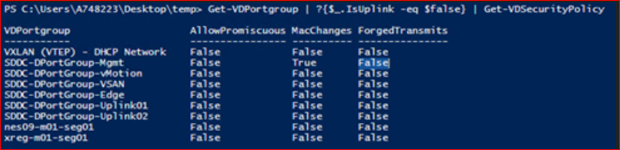  
  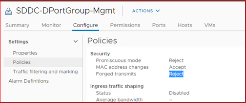  

- TSS Measure ID **1VV00002**

  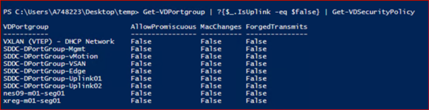

- TSS Measure ID **1VV00004**

  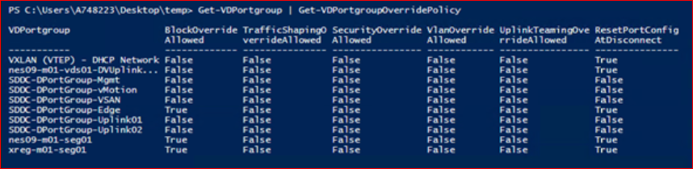  
    

#### 2.3.2 Update vCenter root password policy

**Description:**
This playbook (Path: */opt/dhc/manage/configureVcenterPasswordExpiration.yml*) configures root user password expiration on vCenter for 90 days and adds email id for notification. This task addresses **measure id 3VV00006** of the TSS guidelines for vCenter servers.

**Requirements:**

- Execute the playbook on ans001 server from /opt/dhc/manage folder once per vCenter.
- It will take input from user as: domain id, password, vCenter name from list and mailTo id.
- It will accept only one mailTo id for notification and one vCenter.

**Execute:**

```shell

ansible-playbook configureVcenterPasswordExpiration.yml

```

- Step 1.: Run Playbook

  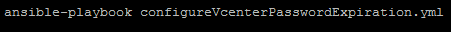

- Step 2.: Enter all required input fields values.
  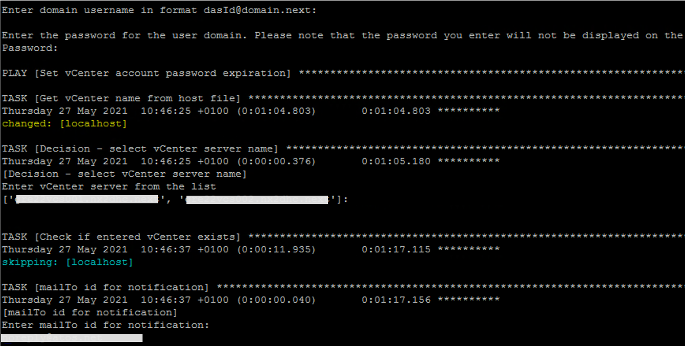

- Step 3.: Results after successfully execution of playbook.
  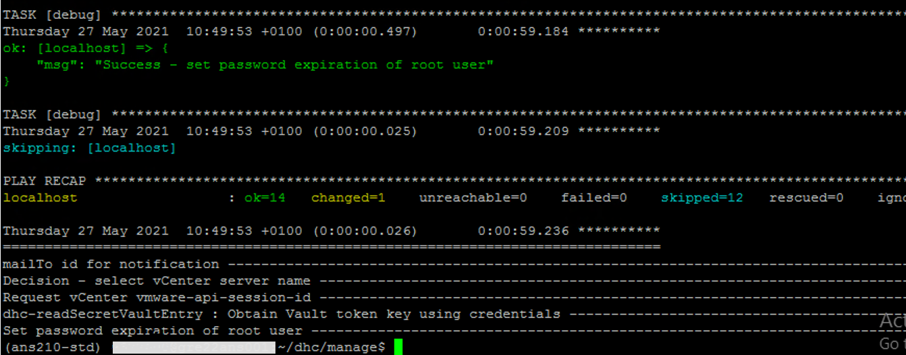
  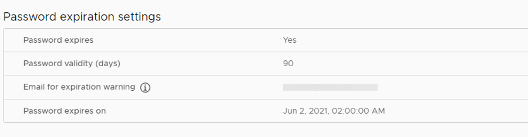

**Validate:**

The measure will disappear from the vrops compliance dashboard console and the updated settings can check at the vcenter administration console.

### 2.4 NSX-T

**Description:**
This playbook (Path: */opt/dhc/manage/remediateNsxtNonCompliantMeasures.yml*) resolves Proxy VMs that breaks functionality while applying remediation (Listed below measure's) as per the above section 2.3.1 till VCS 1.3. So this playbook does Proxy VM segment move it from vcenter VDS to NSX-T segment.

1VV00001 - Securely Configure The Forged Transmits Policy Is Set To Reject on VDS
1VV00002 Securely-Set The Media Access Control (MAC) address Policy To Reject on VDS
1VV00003_Ensure-That-The-Promiscuous-Mode-Policy-Is-Set-To-Reject-on-VDS

**Requirements:**

Apply this VCS 1.4 onwards

**Execute:**

```shell

ansible-playbook remediateNsxtNonCompliantMeasures.yml 

```

**Validate:**

Refer the Validate steps in Section 2.3.1

### 2.5 ESXi

### 2.5.1 Remediate vulnerabilities identified on ESXi

**Description:**
This playbook (Path: */opt/dhc/manage/manageESXiCompliance.yml*) remediates the vulnerabilities which are found on the ESXi servers. These vulnerabilities are identified by their TSS measure ids. The playbook and its supporting role is an evolving piece of work and newer measure ids would be added to the playbook as and when found. Please refer to the role's README file at the path - "manage/roles/dhc-manageESXiCompliance/README.md" for the list of measure ids that are getting remediated.

**Requirements:**
      The playbook requires the user to provide the target ESXi host names as extra vars during runtime (while executing the playbook).

**Execute:**

```shell

ansible-playbook manageESXiCompliance.yml -e "HOSTS=locXXmgt003,locXXcmp003,locXXcmp005" 

```

**Validate:**
      The measure will disappear from the vrops compliance dashboard console.

#### 2.5.2 Core dump collection enable on ESXi

**Description:**
This playbook remediates the vulnerability which was found on the ESXi servers to have a centralized core dump collection. Please refer to the role's README file at the path - "manage/roles/dhc-createVsphereCoreDumpCollection/README.md " for detailed description.

**Requirements:**
      The playbook requires the user to provide the target ESXi host names as extra vars during runtime (while executing the playbook).

**Execute:**

```shell

ansible-playbook createVsphereCoreDumpCollection.yml -e "HOSTS=greXXmgt003,greXXmgt004" 

```

**Validate:**

The below command execution provides the results.

esxcli system coredump network get

  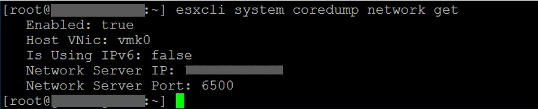

esxcli system coredump network get
  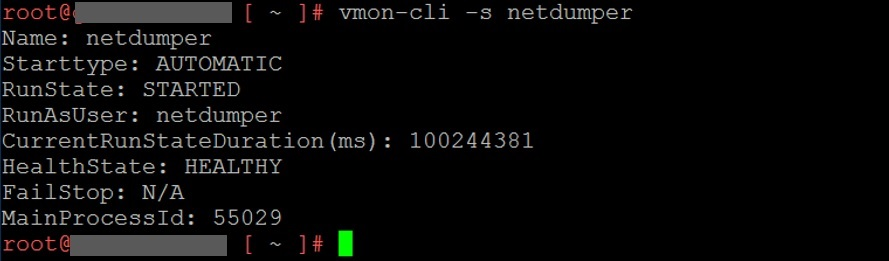

## 2 Nessus Remediation

### 2.1 Linux Application - Disable TLS 1.0 and 1.1 and weak Ciphers

**Description:**
Management environment requires periodic vulnerability scans. The playbook to disable the outdated TLS protocols and weak cipher algorithms has been created under the manage folder - disableTLS1WeakCiphersOnLinux.yml.
A role has been created to support the playbook to accomplish this task - dhc-disableTLS1WeakCiphersOnLinux.
This role is used to disable the outdated TLS protocols and weak cipher algorithms from the Linux server running Apache web server.

**Requirements:**

No specific requirements are needed to run this role apart from Ansible.

**Execute:**

The playbook (Path: */opt/dhc/manage/disableTls1WeakCiphersOnLinux.yml*) calling the role can be executed as shown below. Do note that as mentioned in the description, this playbook can be used to disable the outdated TLS protocols and weak cipher algorithms on a **Linux server running Apache web server**. For example, the deb001 repo server.

```shell

ansible-playbook disableTls1WeakCiphersOnLinux.yml -e HOSTS=deb001

```

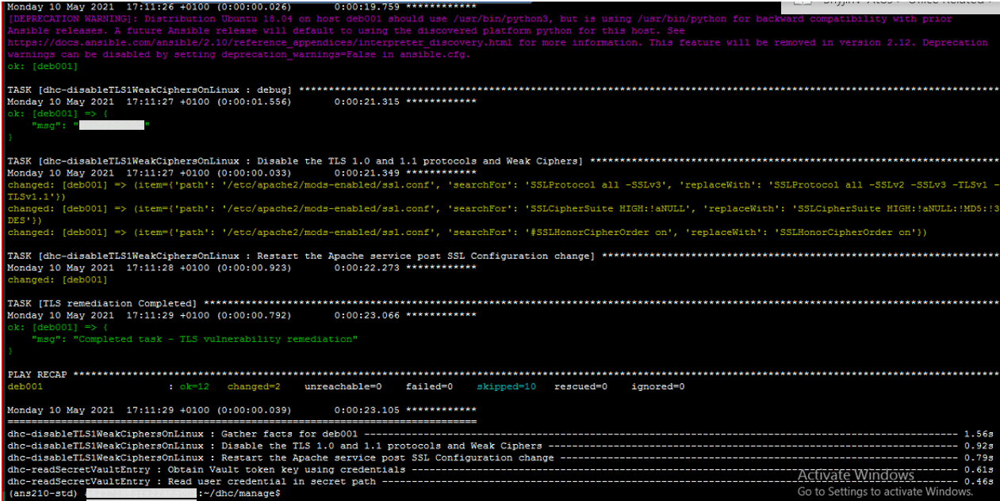  
Figure 1. Ansible playbook execution

## 3 Customer Specifics

### 3.1 Siemens CERT

Siemens CERT measure documents are available [Siemens CERT measure documents](https://gsa.it-solutions.atos.net/Lists/GSA%20Security%20%20CERT%20Measure%20Plan%20Dashboard/ReleasedDRAFT%20Only.aspx)

Petre-David Barbulescu <david.barbulescu@atos.net> is a contact person if any details needed with respect to Siemens CERT measures.

#### 3.1.1 Siemens CERT Windows

**Description:**
      Playbook (Path: */opt/dhc/manage/manageCertComplianceWindowsOs.yml*) updates Windows VM settings as per Siemens CERT Windows OS Compliance document.

- playbook prompts for user dasId from the VCS management domain in format `dasId@domain.next`
- It creates new GPOs which conatain Siemens CERT specific configurations for Windows OS
- It links new GPOs at  appropriate OU/domain level and enforces the GPO settings
- Measures which will be remediated using this playbook are mentioned in README file of the role.

**Execute:**

```shell

ansible-playbook manageCertComplianceWindowsOs.yml

```

**Validate:**

These measures do not appear as non-compliant while generating the Windows compliance report.

#### 3.2.2 Siemens CERT Linux WebServer(Apache)

All Siemens CERT Apache remediations are moved Section 5.3 of this document.

### 3.3 Siemens CERT vSphere

#### 3.3.1 Siemens CERT vSphere vCenter

Refer section 2.3.1 vCenter

#### 3.3.2 Siemens CERT vSphere ESXi

##### 3.3.2.1 Remediate vulnerabilities identified on ESXi

**Description:**
      The Playbook (Path: */opt/dhc/manage/manageCertComaplianceVsphereEsxi.yml*) verifies ESXi settings as per Siemens CERT ESXi Compliance document and updates settings which are non-compliant.

- It checks and updates the Use Drivers from Trusted Sources settings.

**Requirements:**
      No specific requirements are needed to run this playbook apart from Ansible.

**Execute:**

```shell

ansible-playbook manageCertComplianceVsphereEsxi.yml -e "HOSTS=greXXcmp003,greXXcmp004"

```

**Validate:**
      This can be checked in the webconsole by locating advanced settings on the esxi host configuration tab.

### 3.3.3 Siemens CERT vSphere VMs

**Description:**
      Playbook (Path: */opt/dhc/manage/manageCertComplianceVsphereVms.yml*) verifies VMs settings/ advanced settings as per Siemens CERT vSphere VMs Compliance document and updates settings which are non-compliant.

- Prompts for user dasId from the VCS management domain in format `dasId@domain.next` and password
- It checks and updates vSphere VMs advanced settings for below measures.
- M135835

**Execute:**

```shell

ansible-playbook manageCertComplianceVsphereVms.yml --tag "M135835"

```

**Validate:**

These measures do not appear as non-compliant while generating the vSphere VMs compliance report.

# 4 Enhance VCS Security Measures Remediation

## 4.1 Windows

**Description:**
      Playbook (Path: */opt/dhc/manage/manageComplianceWindowsOs.yml*) updates Windows VM settings.

- playbook prompts for user dasId from the VCS managment domain in format `dasId@domain.next`
- It creates new GPOs which conatains specific configurations for Windows OS
- It links new GPOs at appropriate OU/domain level and enforces the GPO settings
- Measures which will be remediated using this playbook are mentioned in README file of the role.

**Execute:**

```shell

ansible-playbook manageComplianceWindowsOs.yml

```

**Description:**
      Playbook (Path: */opt/dhc/manage/manageComplianceWinAdmAccount.yml*) renames the default local admin c-kathos to dhcDefault, Creates new local admin account c-kathos and disables the default local admin dhcDefault.

- playbook prompts for user dasId from the VCS managment domain in format `dasId@domain.next`
- creates new local admin account c-kathos and applies Remediation for BL968-3116

**Execute:**

```shell

ansible-playbook manageComplianceWinAdmAccount.yml

```

**Validate:**

Open compmgmt.msc from Run wizard. Go to Local Users and Groups then under users see the listed users(Disabled/Renamed).

## 4.2 Windows WebServer(IIS)

**Description:**
      Playbook (Path: */opt/dhc/manage/manageComplianceWindowsIIS.yml*) verifies IIS settings and updates it.

- prompts for user dasId from the VCS management domain in format `dasId@domain.next`
- It checks and updates linux servers settings for below measures.
- BL115-2921
- BL115-3481
- BL115-1801
- BL115-3336
- BL115-8201
- BL115-2596

**Execute:**

```shell

ansible-playbook manageComplianceWindowsIIS.yml -e HOSTS=ica --tags "BL115-2921"

```

## 4.3 Linux

### 4.3.1 Linux OS

**Description:**
      Playbook (Path: */opt/dhc/manage/manageComplianceLinuxOS.yml*) verifies linux server settings and updates it.

- prompts for user dasId from the VCS management domain in format `dasId@domain.next`
- It checks and updates linux servers settings for below measures.
- M406350
- M505890
- M509730
- M604007

**Execute:**

```shell

ansible-playbook manageComplianceLinuxOS.yml -e HOSTS=pxy002 --tags "M505890"

```

## 4.4 vSphere

### 4.4.1 vSphere vCenter

Refer section 2.3.1 vCenter

### 4.4.2 vSphere ESXi

#### 4.4.2.1 Remediate vulnerabilities identified on ESXi

**Description:**
      The Playbook (Path: */opt/dhc/manage/manageComaplianceVsphereEsxi.yml*) verifies ESXi settings and updates it.

- It checks and disables esxAdminsGroupAutoAdd setting

**Requirements:**
      No specific requirements are needed to run this playbook apart from Ansible.

**Execute:**

```shell

ansible-playbook manageComaplianceVsphereEsxi.yml -e "HOSTS=greXXcmp003,greXXcmp004"

```

**Validate:**
      This can be checked in the webconsole by locating advanced settings on the esxi host configuration tab.

##### 4.4.2.2 Core dump collection enable on ESXi

Refer section 2.5.2

**Validate:**

The below command execution provides the results.

esxcli system coredump network get

  

esxcli system coredump network get
  

#### 4.4.3 vSphere VMs

**Description:**
      Playbook (Path: */opt/dhc/manage/manageComplianceVsphereVms.yml*) verifies VMs settings/ advanced settings as per Siemens CERT vSphere VMs Compliance document and updates settings which are non-compliant.

- Prompts for user dasId from the VCS management domain in format `dasId@domain.next` and password.
- It checks and updates vSphere VMs advanced settings for below measures.
- M135685
- M135565
- M135702
- M135793
- M135736

**Execute:**

```shell

ansible-playbook manageComplianceVsphereVms.yml --tag "M135835"

```

#### 4.4.4 vSphere VMs - POWERED OFF VMs

**Description:**
      Playbook (Path: */opt/dhc/manage/manageComplianceVsphereVms.yml*) verifies VMs settings/ advanced settings as per Siemens CERT vSphere VMs Compliance document and updates settings which are non-compliant.
      **To implement these measures, a DOWNTIME will be required as VMs need to be in powered off state.**
      This is a pre-requisite from vmware vsphere documentation and could not be mitigated. Hence, a new playbook is created so there can be a downtime for particular VMs and the measures could be implemented.

- Prompts for user dasId from the VCS management domain in format `dasId@domain.next` and password.
- Target VMs need to be in powered off state. This is a pre-requisite from vmware.
- Target VMs list needs to be confirmed while executing the playbooks.
- It checks and updates vSphere VMs advanced settings for below measures.
- M135160
- M135621
- M135674
- M135640
- M135956

**Execute:**

```shell

ansible-playbook manageComplianceVsphereVmsPoweredOff.yml --tag "M135160"

```
