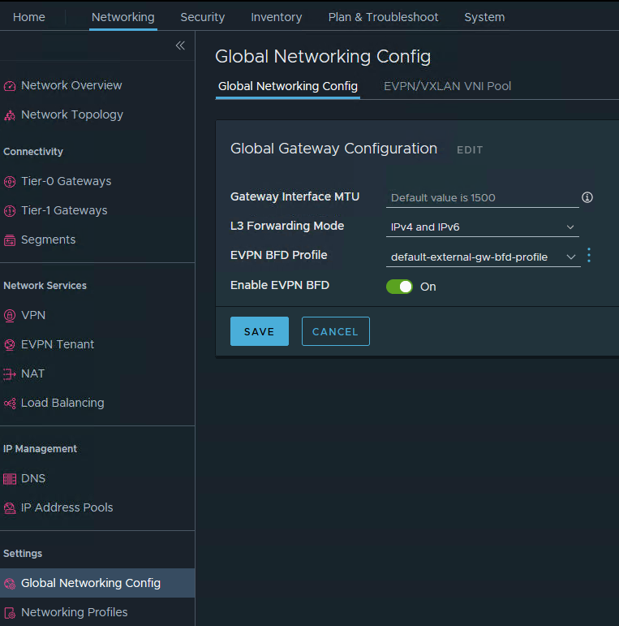
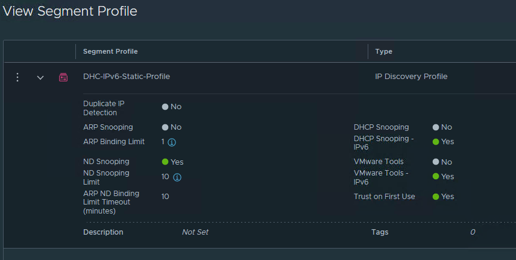
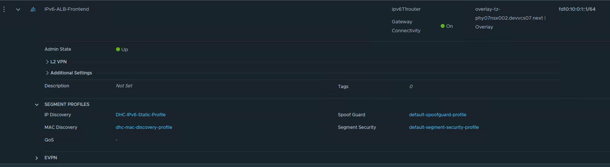
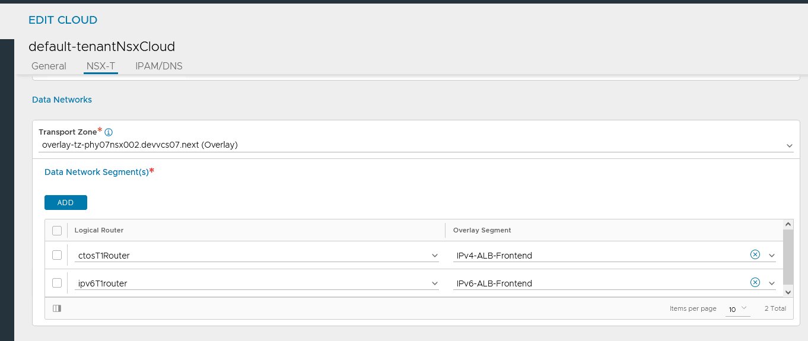
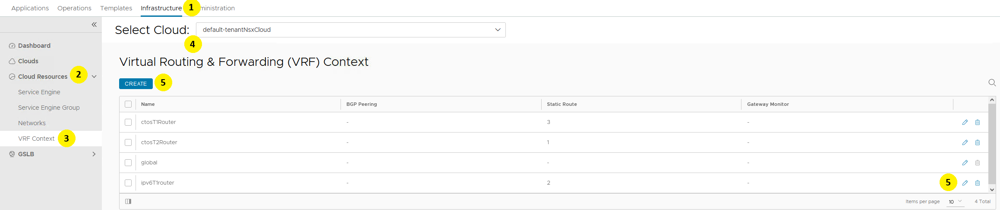
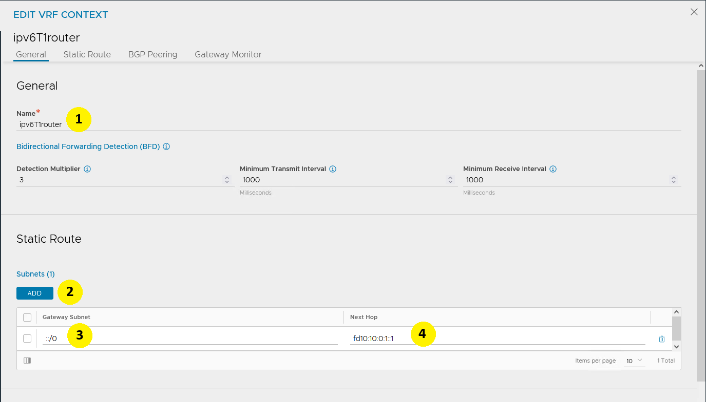
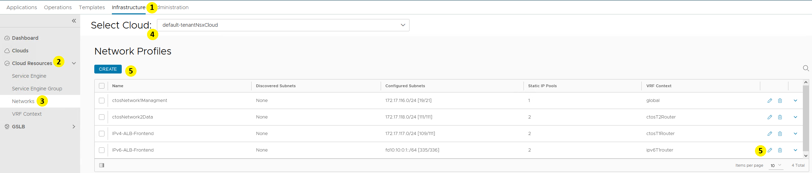
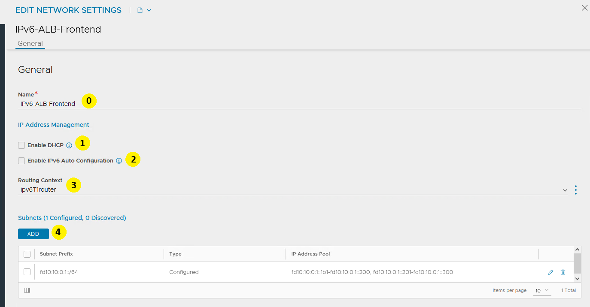
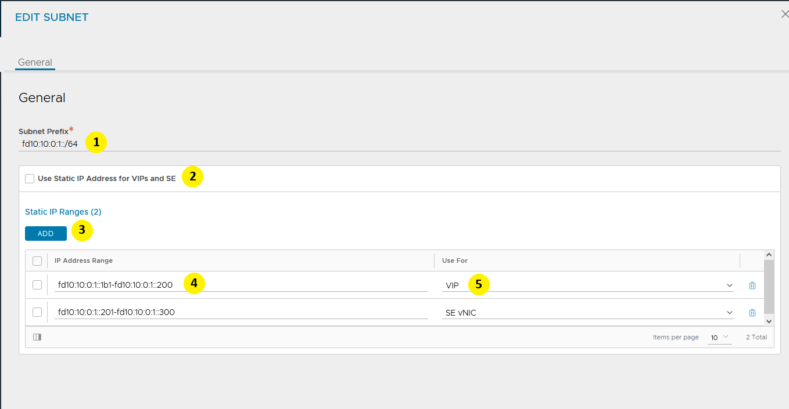

# Changelog

| Date       | Author                | Description                                                     |
|------------|-----------------------|-----------------------------------------------------------------|
| 25/11/2025 | Cezary Dwojak         | NSX Advance Load Balancer IPv6 configuration (AVI and NSX)      |

## Introduction

### Purpose

Configure IPv6 on NSX Advanced Load Balancer and environment (NSX and ALB)

### Audience

- VCS Architects
- VCS Operations

### Scope

Configuring IPv6 for NSX Advanced Load Balancer covers following areas:

- Prepare NSX Advanced Load Balancer for IPv6 (type of IPv6 address assignement)
- Configure NSX Advanced Load Balancer with IPv6 for Advanced Load Balancer only
- Configure NSX with specific setup for IPv6 on NSX Advanced Load Balancer

Following activities are out of scope:

- configure NSX with IPv6 from scratch
- Distributed Firewall exact setup

## Related Documents

| Document                                                                    |
|-----------------------------------------------------------------------------|
| [VCS NSX Advanced Load Balancer LLD](../design/lldAdvancedLoadBalancer.md)  |
| [VCS NSX Microsegmentation](../design/lldMicrosegmentation.md)              |

## Assumptions

There is an assumption that the engineers following this process have an understanding of VMware VCF and standard VCS.
There is an assumption IPv6 NSX environment is already built and configured.

**DISCLAIMER!** All screenshots are for illustrative purposes only.

## Infrastructure Requirements

NSX and NSX Advanced Load Balancer are deployed and already operational.

## License Requirements

VCS/VCF standard licensing covers IPv6 NSX Advanced Load Balancer requirements

## Network Requirements

IPv6 Segments must be created and connected to proper T1 or T0 routers.
IPv6 routing and forwarding must be enabled on NSX.
Distributed Firewall must be configured with proper rules on all levels - default scope and project (Project level must be configured to allow traffic within project from Service Engine)
NSX Controllers and NSX Advanced Load Balancer Controllers are deployted according to VCS Design and have communication.
NSX Advaced Load Balancer Controller has communication with vCenter.

## Prerequisites check list

### 1.1 IPv6 and IPv4 address uniqueness

VRF in NSX and NSX Advanced Load Balancer deployment requires IP addressing uniquenes only within VRF. Same IP addresses schemas between different VRFs is allowed.

### 1.2 IPv6 and IPv4 address availability

All IPv6 and IPv4 addresses that are going to be utilized must be available and must be unique. This concludes routing must be set on all required path, firewall must allow communication.
IP addressing should be managed or by IPAM or by DHCP servers.

## Implementation steps

### NSX configuration

NSX configuration is required on Segments, T1/T0 Routers and globally.

#### Global configuration

Enable IPv6 forwarding, to do this follow below steps:

1. Go to ```Network``` TAB
2. Go to ```Global Networking Config``` in ```Settings``` section
3. On ```Global Gateway Configuration``` set ```L3 Forwarding Mode``` to ```IPv4 and IPv6```



Picture 1. L3 Forwarding Modes configuration

#### Segments configuration

Configuration on segments is related to IP Discovery Profile and should be configured as follows:

- Static IP configuration:
  - ND Snooping enabled
  - ND Snooping Limit - this requires value related to Neighbor Discovery IP addresses learnt and allowed
- DHCPv6 confiuration:
  - DHCP Snooping-IPv6 enabled
- VMware Tools based configuration:
  - VMware Tools-IPv6 enabled

Router Advertisment are initiated from T1 router and NSX is aware about IPs assigned this way.



Picture 2. IP Discovery profile configuration for Advanced Load Balancer IPv6 related segments

Once IP Discovery Profile is created attach it to segment:



Picture 3. Segment configuration with IP Discovery profile for Advanced Load Balancer

#### Routers configuration

T1 routers also require additional configuration depending on selected IPv6 address assignment, which are:

- static:
  - manual
  - IPAM assigned
  
- automatic:
  - SLAAC (StateLess Address Auto-Configuration) with DNS through RA (Router Advertisement)
  - SLAAC (StateLess Address Auto-Configuration) with DNS through DHCPv6
  - DHCPv6 with Address and DNS through DHCP
  - SLAAC (StateLess Address Auto-Configuration) with Address and DNS Through DHCPv6

First step is to configure ND profile (Neighbor Discovery Profile)

All values can be left default, except Mode which must be selected as one of:

- Deactivated
- SLAAC with DNS through RA
- SLAAC with DNS through DHCP
- DHCP with Address and DNS through DHCP
- SLAAC with Address and DNS Through DHCP

[!Exception] for ```SLAAC with DNS through RA``` where ```Domain Name``` and ```DNS server``` once configured will be delivering information within RA.

### Advanced Load Balancer Configuration

NSX ALB requires to have IPv6 configured and validated in multiple places.

#### Cloud configuration

Cloud configuration requires IPv6 network to be added to Data Networks for the Cloud, otherwise will not be visible for ALB.

1. Go to ```Infrastructure```
2. Go to ```Clouds```
3. Select proper cloud from list using pen icon (on right hand side)
4. Move down to ```Data Networks```
5. Click on Add
6. On new line select ```Logical Router``` and ```Overlay Segment``` assigned to it
7. Click Save



Picture 4. Add Data Networks to the Cloud

#### VRF context configuration

Virtual Routing and Forwarding - VRF - is logical separation of networks in the environment. To achieve multitenancy those must be properly configured:

1. Go to ```Infrastructure```
2. Go to ```Cloud Resources```
3. Select ```VRF Context```
4. Select proper cloud from ```Select Cloud:``` dropdown list
5. Click pencil icon on desired VRF context or create new one



Picture 5. Select VRF context

Once proper VRF Context is selected, configure this as follows:

1. Provide proper name
2. Add static route under ```Static Route``` section by hitting ```Add``` button
3. Input Default route in IPv6 format in ```Gateway subnet``` column
4. Input Default Gateway for the segment you configure VRF Context for in ```Next Hop``` field



Picture 6. Configure VRF context

#### Network profile configuration

1. Go to ```Infrastructure```
2. Go to ```Cloud Resources```
3. Select ```Networks```
4. Select proper cloud from ```Select Cloud:``` dropdown list
5. Click pencil icon on desired network or create new one



Picture 7. Select Network profile

Once network profile configuration panel is open, follow next steps :

0. Define the name for profile if not defined yet.
1. Once DHCP option of IP address propagation is selected Check ```Enable DHCP```
2. Once RA option n of IP address propagation is selected Check ```Enable IPv6 Auto Configuration```
3. Select proper Routing Context from the list
4. Click on ```Add``` under subnets section



Picture 8. Configure Network Profile

Once Subnets are selected to be configured, follow below steps:

1. Provide subnet prefix
2. Select according to configuration requirements if Static IP Ranges will be for both VIP and SE vNICs checking ```Use Static IP Address for VIPs and SE```
3. Click on ```Add``` to enable addon of ranges
4. In ```IP Address Range``` column add IP address range in format \<first IP address\> - \<last IP address\>
5. In ```Use for``` column, if possible, set type of this range for ```VIP``` or for ```SE vNIC```
6. Save once finished


Picture 9. Configure subnets
