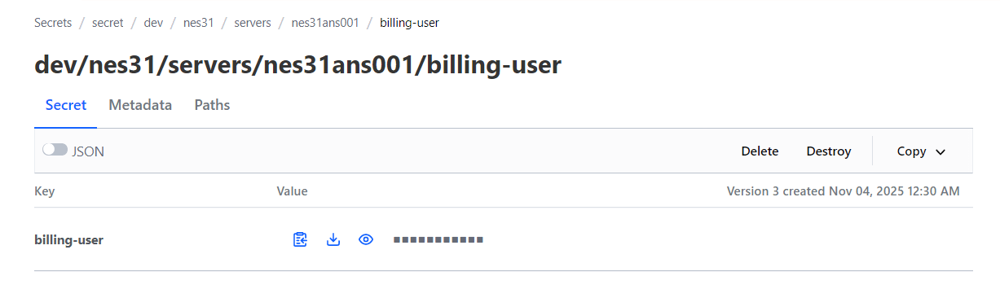
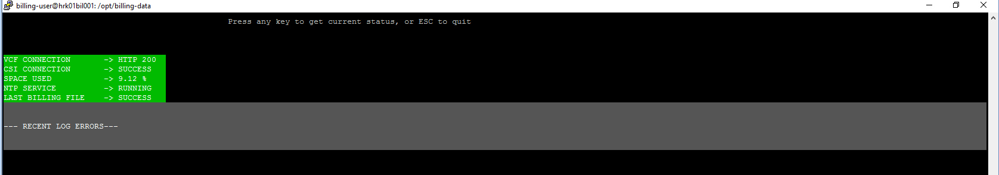

# Configure Billing

## Changelog

| Version | Date       | Description              | Author          |
| ------- | ---------- | ------------------------ | --------------- |
| 0.1     | 19/05/2020 | First version            | Pawel Wlodarczyk |
| 0.11    | 30/11/2021 | CSI contact list update  | Piotr Gesikowski |
| 0.12    | 12.01.2022 | update pictures          | Berte Petru      |
| 0.13    | 22.06.2022 | Modify for VCS 1.5       | Pawel Wlodarczyk |
| 0.14    | 01.10.2022 | Modify new billing financial flow       | Pawel Wlodarczyk |
| 0.15    | 15.03.2023 | updates for gcp bucket   | Shilpa Arote |
| 0.16    | 13.06.2024 | Updated the troubleshooting section     | Stanislaw Kilanowski |
| 0.17    | 12.11.2024 | Updated the documentation for deploying Billing using GCP method     | Adrian Giurgiu |
| 0.18    | 22.09.2025 | Updated contact list on to Tooling team | Radoslaw Dabrowski |
| 0.19    | 20.11.2025 | Move billing from bil001 to ans001 | Aboli Adhalrao |
| 0.20    | 24.03.2026 | Update Configure Billing WI to Verify Certificate Status for automation02 | Abhijit Raut |

## Introduction

### Purpose

Configure billing server for VCS.

### Audience

- VCS Operations

### Scope

- Configure billing server for VCS

### Prerequisites

For a proper configuration post installation you will need to have a valid GCP credentials json file available. This means you must request it to CSI team via email by completing the following requirements:

- indicate whether new dedicated Customer owned or shared Atos owned environment
- send the unique tenant code / environment code
- deliver the Operational Contact name(s) and details of
the person(s) who are/is accountable for monthly
invoicing.
- contact details for Operational Continuity, VCS
support team (SRM / TSM)
- contact details for Accounts team, SDM
- contact to initiate the yearly service account key refresh

## Installation

Billing installation is automated and provided with the following role:

```shell
dhc-createBilling
```

Manual installation can be performed by running the following playbook:

```bash
ansible-playbook createBilling.yml
```

## Post-installation for GCP method only

As described in the below play, there is a dummy file created during the installation which needs to be replaced by the actual csi-gcp-access.json file provided by CSI team.

```yaml
   - name: Create empty GCP access key file
     become: true
     copy:
       content: "Check documentation: https://github.com/GLB-CES-PrivateCloud/DHC-Documentation/blob/develop/workInstructions/wiConfigureBilling.md"
       dest: "/home/{{ billingUser }}/workunits/vault/csi-gcp-access.json"
       mode: '0660'
       group: "{{ billingUser }}"
```

## Initial Setup

Initial setup is done via automated role with the following default values:

| Value | Default | Description |
|:------|:--------|:------------|
| Logging output | `/var/log/billing.log` | Default value for script logging |
| PTF Code | `VCS` | The defautl PTF code for identifying customer/product |
| Storage Class Tag Category | `StorageClass` | Tag category based on which the VM storage class is determined |
| Data Center Code | `vcen` | Datacenter naming code used in file name of billing data and control file |
| Data file cron job user | `billing-user` | User for which the cron job is installed |
| Data file cron job schedule | `30 23 * * * /usr/bin/billing` | Cron job for generating billing output |
| Sending of billing data cron schedule | `30 0 * * * /usr/bin/billing-send` | Cron job for sending billing data to gcp bucket |

### GCP secret access key

After billing appliance is deployed, a secret access key will be provided by CSI team that will be later on used to store in billing appliance.

The following is the template used as a body of the email.

```yaml
   - Platform: “VCS”
   - Service: “VCF”
   - Version: “1.2”, “1.3”, etc.
   - Customer: <Tenant code> (for version 1.2) or “SHARED” (for version 1.3)
   - Originator: as used in the file name (e.g. ”mec09cht002.nx5dhc.next”)
   - Owner of private key in format: user@fqdn_hostname
```

The email is to be sent to contact mentioned in the "# CSI Contacts" section.

### Implementing VCS ST(Single-tenant) billing

**NOTE**: This procedure applies to VCS Single tenant implementations, so most of the deployments will use this procedure.

From ans001 server run the following commands:

```shell
sudo su - billing-user
mv /home/billing-user/workunits /home/billing-user/workunits.old
cp -r /opt/dhc/deploy/roles/dhc-createBilling/files/workunits-st /home/billing-user/workunits
cp /home/billing-user/workunits.old/config/config.py /home/billing-user/workunits/config/config.py
chmod 755 workunits/{get_rsa.py,main.py,scp_send.py,status.py}
```

From ans001 server open billing configuration file `/home/billing-user/workunits/config/config.py` with your favourite Linux text editor.

Locate `base-template` dictionary variable and assign value to `Customer` and `TenantCode` keys where `Customer` is the name of the customer and `TenantCode` is the name of the tenant or pod name obtained from CSI team.

Save and close the file.

Confirm proper operation by checking `billing-status` command.

### Full customer name and charging instance country code

**NOTE**: This procedure is only to be performed for VCS MT (Multi-tenant) environments.

As there is no possibility of extracting a full customer name from the environment this information will have to be entered manually into the configuration file located in `/home/billing-user/workunits/config/config.py`

The below steps outline the procedure for gathering and entering charging instance country code and full customer name. The CSI contacts can be found in the "# CSI Contacts" section.

1. Please contact CSI team to get the following information
        a. Country code that will be responsible for charging customer (**NOTE** this may be different than the actual customer code)
        b. Environment code that will be responsible for charging customer (**NOTE** this may required in case shared VCS environment)
        c. Tenant code that will be responsible for charging customer (**NOTE** this may required in case customer owned VCS environment)
        d. GCP access key file in json format.
2. Once you have this information please login to billing appliance via ssh as the `billing-user`.
3. Open `/home/billing-user/workunits/config/config.py` and locate `base_template` dictionary variable. Change the `Country` key value to the two-letter country code received from CSI team.

### Setting up Access Key and rotation

Setting up secret access key can be performed by running the following playbook, also same playbook can be run once the gcp key got expired and new key provided by CSI team.

```bash
ansible-playbook updateGcpAccessKeyForBilling.yml
```

# Enable NSX-T Chargeback

The purpose of this section is to enable NSX-T chargeback for billing purposes. To achieve this an additional script needs to be transferred and integrated on billing appliance. As part of this operation an additional cronjob will be set up. This procedure is automated with ansible playbook and the following steps are to be followed up.

1. Login to **ans001** virtual machine with your AD account
2. Navigate to **manage** sub-repository of **VCS** code
3. Run the following playbook

```bash
ansible-playbook addBillingNsxChargeback.yml
```

The above playbook does the following:

- Copies nsx configuration file
- Copies nsx chargeback python script
- Sets up cronjob for running the script

# Accessing Appliance

Accessing appliance for billing data is provided via SSH (port 22). The SSH user and password is to be retrieved from HashiVault.



Once the user is logged in the following commands are available among the normal Linux commands:

| Command | Description |
|:-------|:------------|
| `billing` | Manually start billing script gathering data to output location (default is /opt/billing-data/) |
| `billing-status` | Provides colour coded, easy to read current status of the appliance and parameters required for successful billing |
| `billing-send` | Used for sending data and control files to GCP bucket which is managed by CSI team  |

## Status Check and Troubleshooting

### Verifying Status of Billing

The billing appliance has a dedicated status utility which can be started by typing the below command and pressing `Enter` key.

```bash
billing-status
```

This command will produce the following, colour coded status page



The colour coding allows for a quick failure finding if such occurs with the following colour definitions:

- GREEN - Status or service is operational and healthy
- YELLOW - There might be a problem with this status or service in the future
- RED - Status or service is not operational

The status utility has the following checks:

| Check | Description |
|:------|:------------|
| `VCF_CONNECTION` | Using a username and password from configuration we are trying to access VCF SDDC Manager appliance and we are expecting HTTP 200 return code, if we get any other code it is a failure |
| `SPACE_USED` | Checking how much space, percentage wise is available in the directory used for keeping the billing data |
| `NTP_SERVICE` | Checking if NTP service is running on the appliance |
| `RECENT LOG ERRORS` | Grep for error messages from the most recent billing log file |

Further to this an engineer should check whether billing file was generated with the following procedure:

1. Retrieve HashiVault user and password information regarding this appliance
2. Login to ansible server using ssh with username and password obtained in point 1
3. Navigate to billing directory:

   ```shell
   cd /opt/billing-data
   ```

4. Check current date on the appliance

   ```bash
   date
   ```

5. Reverse sort the list of files so the most recent one is at the bottom

   ```bash
   ls -lrth
   ```

6. Confirm that both `csv` and `xml` files are present for current or past date (please remember that the script runs at 23:30 UTC, so if checking in the 23:30-00:00 time frame there should be a file from current day)

7. Check if both files are not empty. The following command will return the number of lines in the file:

   ```bash
   wc -l <file_name>
   ```

where `file_name` represents files from point 6.

### Configuration File

Configuration file which has the necessary data for billing script to run correctly is located under the following path:

```shell
/home/billing-user/workunits/config/config.py
```

**NOTE**: Changing variables in the configuration file can result in failures while executing the script.

Custom configuration file with additional settings is located under the following path:

`/home/billing-user/workunits/config/customs.yml`

### CSI Reporting for VMC

If VCS environment is integrated with VMC . We need to generate billing report for VMC as well

1. We need to set the config file variable `VMC_Integrated = "yes"` for the VMC billing report. The config file is located under the following path.

   ```shell
   /home/billing-user/workunits/config/config.py
   ```

2. In the config file, we need to provide data like the VMC vcenter IP address, username, port etc..,

3. The `vmc.py` script helps with performing VMC billing after generating a VCS billing report.

4. The VMC report and VCS report will both be sent to the gcp bucket.

### Troubleshooting

In case of any errors the following can be checked:

1. Running the `billing-status` command which will give the current state of the appliance and services running on it. It serves as a pointer to figure out what area of troubleshooting to focus on.

2. Log file from the recent run of the script. The default file location is `/var/log/billing.log`. Keyword `SUCCESS` indicates a proper run of the script and any log lines marked with `ERROR` indicate an error condition.

3. If the reports were not sent, `billing-send [-d DELTA]` can be executed. The age of the reports (in days) can be optionally specified with the `DELTA` argument. Afterwards the logs should be checked like in the previous step.

4. If CSI team is reporting lack of data or control files because of authentication errors please confirm that gcp access key was provided by CSI team is either expired or incorrect.

5. If CSI team is reporting lack of connectivity please check if proxy service/ports are opened on path between billing appliance and GCP bucket endpoints

6. An e-mail report with the files should be delivered to the Operations Team's mailbox.

7. Check the certificate validity status for the automation02 (svc-hrk01-aut02) user account. If the certificate has expired, follow the work instruction in [wiUpdateCertificates.md](https://github.com/GLB-CES-PrivateCloud/DHC-Documentation/blob/develop/workInstructions/wiUpdateCertificates.md) to renew it.

| Contact Name | Contact Email |
|:------------:|:-------------:|
| Tooling team | `dl-cloud-csi@atos.net` |

Escalation path:

| Contact Name | Contact Email |
|:------------:|:-------------:|
| Rohit Khopkar | `rohit.khopkar@atos.net` |
