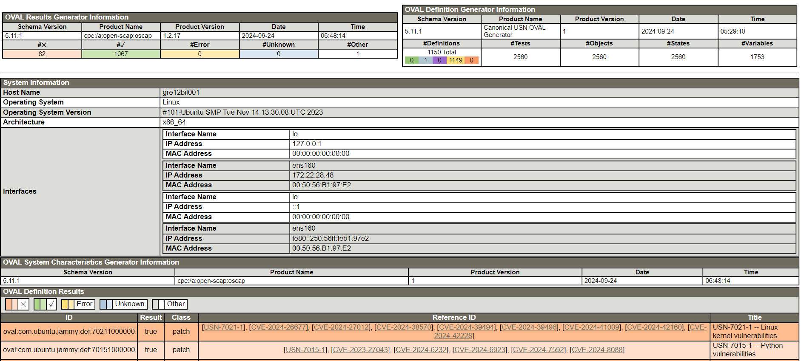

# VCS Configure OVAL Report on Ubuntu

## Table of Contents

- [VCS Configure OVAL Report on Ubuntu](#vcs-configure-oval-report-on-ubuntu)
  - [Table of Contents](#table-of-contents)
  - [Changelog](#changelog)
  - [Introduction](#introduction)
    - [Audience](#audience)
    - [Scope](#scope)
    - [Purpose](#purpose)
  - [Working with OVAL reporting](#working-with-oval-reporting)
    - [Report creation](#report-creation)
    - [Report verification](#report-verification)
  - [Automation](#automation)
    - [Using the playbook](#using-the-playbook)
    - [Configuring a Cron job](#configuring-a-cron-job)

## Changelog

| Version | Date       | Description                          | Author               |
| ------- | ---------- | ------------------------------------ | -------------------- |
| 0.1     | 16/10/2024 | First version                        | Piotr Gesikowski     |
| 0.2     | 21/11/2024 | VCS-14293 - Described the automation | Stanislaw Kilanowski |

## Introduction

Install OpenSCAP which is the security audit and vulnerability scanning tool based on SCAP (Security Content Automation Protocol).
OpenSCAP uses the OVAL vulnerability and patch definitions to generate report for Common Vulnerabilities and Exposures (CVEs) and to determine whether a particular patch, via an Ubuntu Security Notice (USN), is appropriate for the local system.

### Audience

VCS Operations

### Scope

Installing OSCAP, creating and verifying OVAL report.

### Purpose

Scan and generate HTML report for Ubuntu system.

## Working with OVAL reporting

### Report creation

1. Log in to the particular Ubuntu VM where OVAL report has to be generated.

    > Note:
    > Make sure a snapshot is created before

2. Install OpenSCAP command line tool and bzip2 (the latter is used to compress and decompress the files):

    ```shell
    sudo apt -y install libopenscap8 bzip2
    ```

3. Download and extract the latest OVAL Ubuntu Security Notices which are provided from Canonical:

    ```shell
    wget https://security-metadata.canonical.com/oval/com.ubuntu.jammy.usn.oval.xml.bz2
    bzip2 -d com.ubuntu.jammy.usn.oval.xml.bz2
    ```

    Alternatively you may find it more effective to download the file on a Terminal Server with proxy configured. In that case open this page in the browser. Afterwards copy the file to the Ubuntu VM:

    ```text
    https://security-metadata.canonical.com/oval/com.ubuntu.jammy.usn.oval.xml.bz2
    ```

    > Note:
    > In order to download the USN, the domain ".canonical.com" has to be added to the proxy whitelist (/etc/squid/whitelist.txt on `<locationCode>pxy002` and `<locationCode>pxy003`).

4. Scan system. Scan result is renerated as HTML report in the executing directory:

    ```shell
    oscap oval eval --report oval-jammy.html com.ubuntu.jammy.usn.oval.xml
    ```

    Exemplary execution log:

    ```text
    a505415@gre12bil001:~$ oscap oval eval --report oval-jammy.html com.ubuntu.jammy.usn.oval.xml
    Definition oval:com.ubuntu.jammy:def:901000000: false
    Definition oval:com.ubuntu.jammy:def:891000000: false
    Definition oval:com.ubuntu.jammy:def:871000000: false
    Definition oval:com.ubuntu.jammy:def:861000000: false
    Definition oval:com.ubuntu.jammy:def:57771000000: false
    .....
    .....text
    Definition oval:com.ubuntu.jammy:def:53542000000: false
    Definition oval:com.ubuntu.jammy:def:100: true
    Evaluation done.
    ```

5. Confirm that report has been generated:

    ```text
    a505415@gre12bil001:~$ ll oval-jammy.html
    -rw-r----- 1 a505415 domain users 1640093 Sep 25 20:04 oval-jammy.html
    ```

### Report verification

Download report via SCP (location is /home/user) and analyze it in the favourite web browser:


## Automation

### Using the playbook

> Note:
> For the automation to work, the domain ".canonical.com" has to be added to the proxy whitelist (/etc/squid/whitelist.txt on `<locationCode>pxy002` and `<locationCode>pxy003`).

OVAL scanning can be executed with the playbook `manageOvalReporting.yml`. By default it will scan all Ubuntu VMs:

```shell
ansible-playbook manageOvalReporting.yml
```

The servers scope can be changed with the `limit` argument:

```shell
ansible-playbook manageOvalReporting.yml --limit "localhost,hgw001"
```

> [!Important]
> Running the above command requires localhost entry in the limit section.

After performing all scans, the playbook collects the reports on `<locationCode>ans001` in the directory `/backup/reports/oval`. By default the playbook doesn't send an e-mail report. To enable it, use the variable `sendMail`:

```shell
ansible-playbook manageOvalReporting.yml -e "sendMail=true"
```

The e-mail recipiens can be changed with the variable `emailReportRecipients`:

```shell
ansible-playbook manageOvalReporting.yml -e "sendMail=true emailReportRecipients=mailbox@atos.net"
```

### Configuring a Cron job

OVAL scanning is part of the Ubuntu patching process and therefore should be executed after each patching. It can be added to the Cron tab with all the other patching Cron jobs. Alternatively, using the tag `oval` will configure automation just for this playbook:

```shell
ansible-playbook configurePatchingCron.yml
```

```shell
ansible-playbook configurePatchingCron.yml -t oval
```

Cron job created in such way will be executed on first Friday after 3rd Tuesday of the month at 5:00 UTC.
