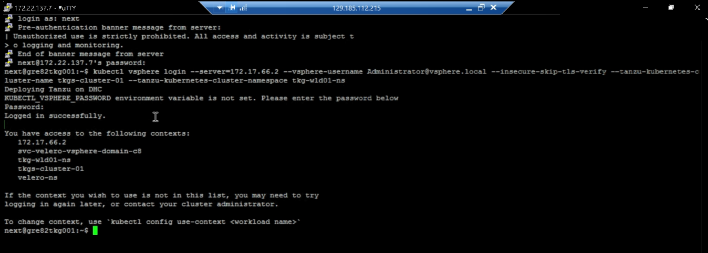
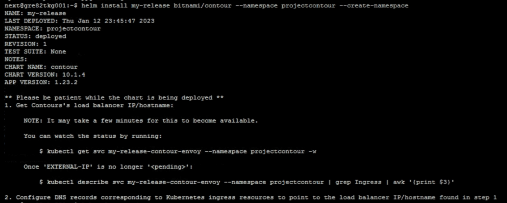
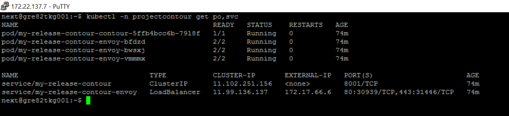
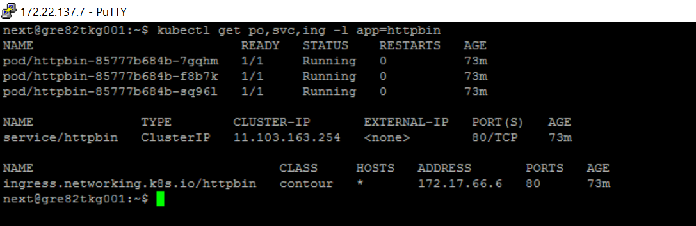
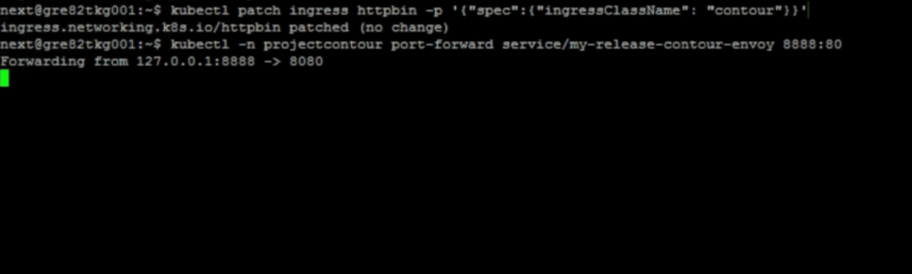
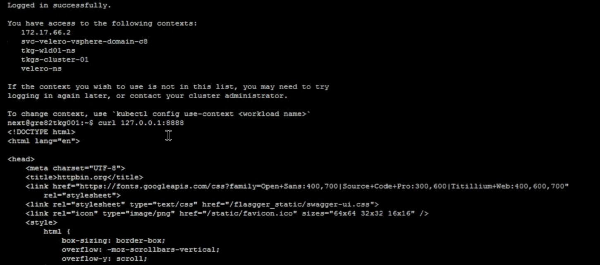

# Table of Contents

- [Table of Contents](#table-of-contents)
- [Changelog](#changelog)
  - [Introduction](#introduction)
    - [Purpose](#purpose)
    - [Audience](#audience)
    - [Scope](#scope)
  - [Requirements](#requirements)
- [Install Contour](#install-contour)
- [Testing](#testing)

# Changelog

 |    Date    | TOS   | Issue   | Author | Description |
 |------------|---------|-----------|--------|--------|
 | 06.12.2022 | VCS 1.7   |   CESDHC-5442      | Divyaprakash J | Initial Draft|

## Introduction

### Purpose

Install Contour on Tanzu workload cluster using Helm Chart and test it with a sample application.

### Audience

- VCS Engineers
- VCS Operations

### Scope

Contour Ingress should be working fine under Tanzu Cluster.

## Requirements

1. Kubernetes cluster with support for services of type LoadBalancer
2. Helm installed locally

# Install Contour

Contour is an open source Kubernetes Ingress controller that acts as a control plane for the Envoy edge and service proxy

To install contour on tanzu workload cluster follow the below steps.

- Login to the tkg cluster via Jumphost
  
  ```shell
  kubectl vsphere login --server supervisor_cluster_IP_address --TanzuKubernetesCluster tanzu_Kubernetes_cluster_name --TanzuKubernetesClusterNamespace  tanzu_kubernetes_cluster_namespace --vsphere-username supervisor_cluster_administrator
  ```

  Example  is shown below.

  ```shell
  kubectl vsphere login --server=172.17.66.2 --vsphere-username Administrator@vsphere.local --insecure-skip-tls-verify --tanzu-kubernetes-cluster-name tkgs-cluster-01 --tanzu-kubernetes-cluster-namespace tkg-wld01-ns
  ```

  

- Add the bitnami chart repository (which contains the Contour chart)

  ```shell
  helm repo add bitnami https://charts.bitnami.com/bitnami
  ```
  
- Update customer's local cache with the Bitnami repository details

  ```shell
  helm repo update
  ```
  
- Install Contour chart by running the following command

   ```shell
   helm install my-release bitnami/contour --namespace projectcontour --create-namespace
   ```

   

- Verify contour is ready and running

    ```shell
    kubectl -n projectcontour get po,svc
    ```

    

# Testing

To test contour ingress is working fine, install a web application workload and get some traffic flowing to the backend

- Deploy a sample application

  ```shell
  kubectl apply -f https://projectcontour.io/examples/httpbin.yaml
  ```

  User can also download the file from <https://projectcontour.io/examples/httpbin.yaml> via browser and copy it to the Jumphost (i.e. gre82kg001) via winscp.

  ```shell
  kubectl apply -f httpbin.yaml
  ```

- Verfiy the pods and services are ready and running

   ```shell
   kubectl get po,svc,ing -l app=httpbin
   ```

   

- The Helm install configures Contour to filter Ingress and HTTPProxy objects based on the contour IngressClass name. If using Helm, ensure the Ingress has an ingress class of contour with the following:

  ```shell
  kubectl patch ingress httpbin -p '{"spec":{"ingressClassName": "contour"}}'
  ```

For testing, user can send some traffic to his sample application, via Contour & Envoy.
Note, for simplicity and compatibility across all platforms user can use `kubectl port-forward` to get traffic to Envoy, however in a production environment user would typically use the `Envoy service’s address`.

- Port-forward from user's local machine to the Envoy service:

  ```shell
  kubectl -n projectcontour port-forward service/my-release-contour-envoy 8888:80
  ```

  

  It will forward details from pods to localhost till ‘port-forward’ is open

- In an new session run ‘curl’ command

  ```shell
  curl 127.0.0.1:8888
  ```

  This will send details present in the application to the localhost via port 8888 .

  
