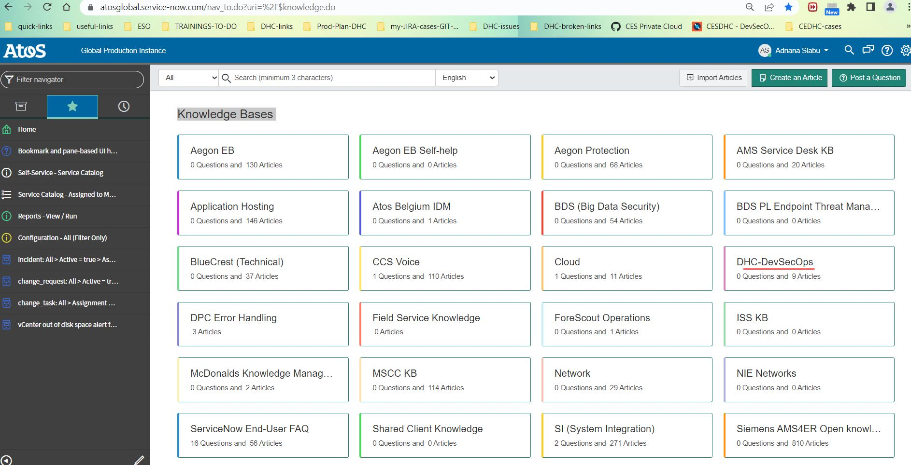
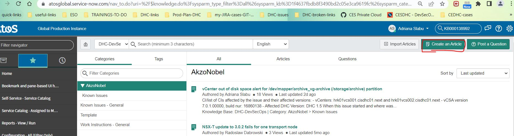
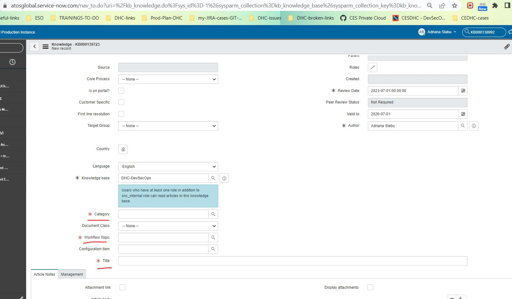
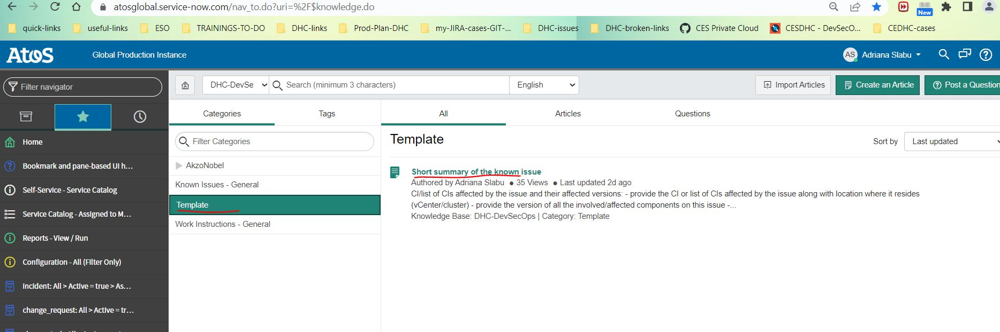
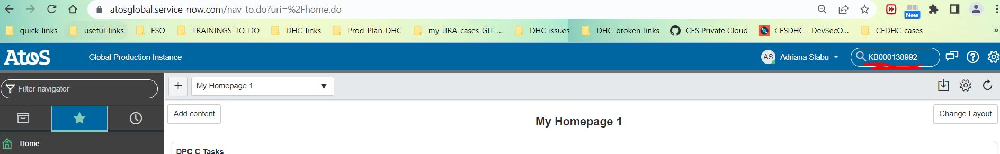
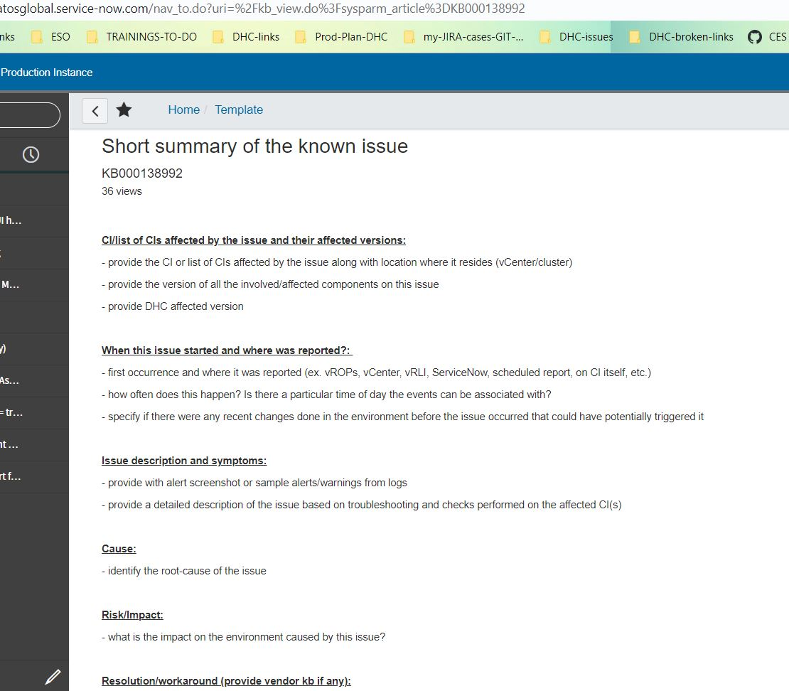

# VCS Create Snow KB Article Procedure

## Table of Contents

- [VCS Create Snow KB Article Procedure](#vcs-create-snow-kb-article-procedure)
  - [Table of Contents](#table-of-contents)
  - [Changelog](#changelog)
  - [Introduction](#introduction)
    - [Purpose](#purpose)
    - [Audience](#audience)
    - [Scope](#scope)
  - [Which alerts/events should have KB](#which-alertsevents-should-have-kb)
  - [Procedure on how to create a KB](#procedure-on-how-to-create-a-kb)

## Changelog

| Issue | Version | Date       | Description              | Author          |
| ------- | ------- | ---------- | ------------------------ | --------------- |
| CESDHC-226 | 0.1| 29/06/2022 | First version            | Slabu Adriana   |

## Introduction

### Purpose

Create a SNow KB article.

### Audience

- VCS Operations

### Scope

- Determine when to create an article
- How to create an article

## Which alerts/events should have KB

Alerts/warnings which are considered to be known issues:

- no official documentation/code exists at the moment, however this might change. The issue has been already addressed for the next greenfield deployment.
- official documentation/code exists from the vendor side and is considered to be a bug at the current version; upgrade of the version is recommended.

In both cases, the issue was not addressed in the initial deployment documents regarding the VCS Infrastructure Specification and Amendments

## Procedure on how to create a KB

To create a KB article in Snow, access page: `https://atosglobal.service-now.com/nav_to.do?uri=%2F$knowledge.do`

> **NOTE** make sure you have permissions to view and create articles.

The page with Categories for Knowledge Bases will show. Choose your Category (tenant/client) for which this KB article is needed and click on "Create an Article" button:

A form will open:

First step is to complete all necessary fields:

- **Category** -> a Category picker will open -> choose a sub-category
- **Document Class** -> choose "Known Error" option
- **Workflow Topic** -> a separate window will open where you can choose the correct group (ex. DHC-DevSecOps)
- **Configuration Item** -> search your affected CI
- **Title** - add a descriptive title of the issue/alert

Last step is to create the content for the article:

- **Article body** -> based on the template, create your own KB article. Try to provide information for all the points mentioned in the template.

The standardized template is located under DHC-DevSecOps -> Template sub-category.
The KB Article number for the template: KB000138992.

> **NOTE** you can also search directly for the template by typing in Snow search template Knowledge ID number: KB000138992

Your KB article must cover:

Once you finish with creating the content, adding attachments, etc., you save your new KB article as a draft and submit it for review with the team. When no editing/update is needed, it can be published.
