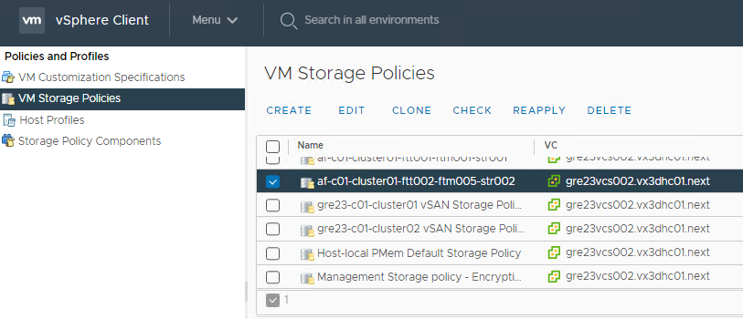
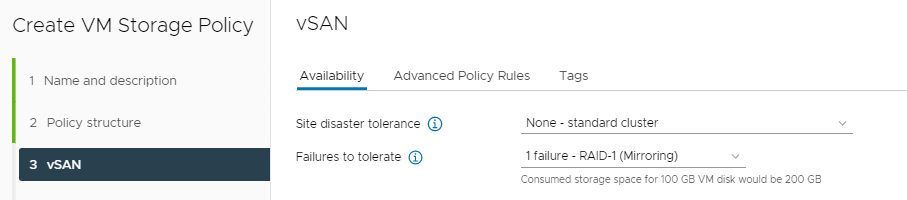
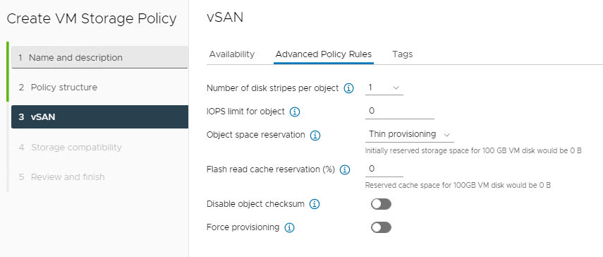
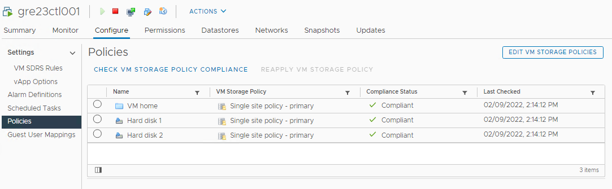
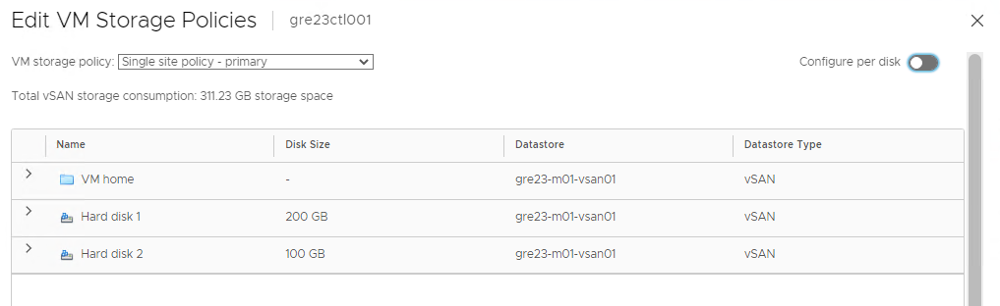
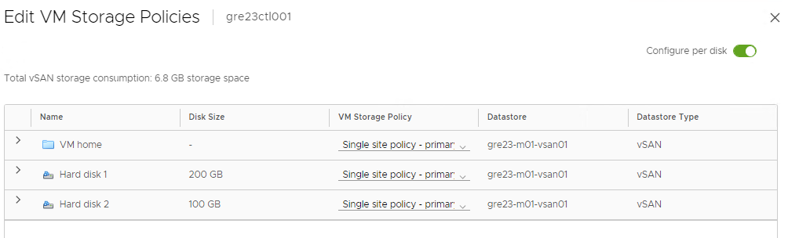
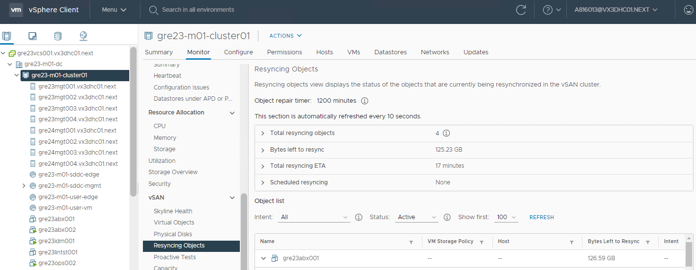

# Assign Storage Policy

- [Assign Storage Policy](#assign-storage-policy)
  - [Changelog](#changelog)
  - [Introduction](#introduction)
    - [Purpose](#purpose)
    - [Audience](#audience)
    - [Scope](#scope)
- [Create or modify Storage Policy definition](#create-or-modify-storage-policy-definition)
- [Assign Storage Policy to servers](#assign-storage-policy-to-servers)

## Changelog

| Date | Issue | User | Changes |
|---------|------|------|---------|
| 08.02.2022 | DHC-3590 | Adam Szymczak | Initial version |

## Introduction

### Purpose

Create or modify Storage Policy definition and assign it to the VMs.

### Audience

### Scope

- Create or modify Storage Policy definition
- Assign Storage Policy to servers

# Create or modify Storage Policy definition

1. Log in to the **vCenter Server** in the environment
2. From **Menu** at top left select **Policies and Profiles** and on the next screen select **VM Storage Policies**
3. Click **Create** to add new policy or select existing policy from the list and click **Edit** to modify the policy (Note: Default VMware policies are not editable) 

4. In the window that will appear select name for storage policy (either new or rename existing one) and if creating new one select vCenter server on which the policy will be used, then click **Next**
5. In the next step make sure that **Enable rules for "vSAN" storage** is only selected and click **Next**
6. Configure policy settings under **Availability** tab which are:
    - **Site disaster tolerance** - defines whether to use streched cluster and if to use dual site mirroring
    - **Failures to tolerate** - defines number of failures a storage object can tolerate and method used to tolerate failures 
7. Configure settings under **Advanced Policy Rules** tab:
    - **Number of disk stripes per object** - number of capacity devices across which each replica of storage is striped, value higher than 1 may improve performance at cost higher system resource usage
    - **IOPS limit per object** - defines IOPS limit for a disk
    - **Object space resrvation** - percentage of size of the storage object that will be reserved (thick provisioned) on VM creation, the rest of storage object will be thin provisioned
    - **Flash read cache resrvation (%)** - flash capacity reserved as reach cache for storage object
    - **Disable object checksum** - if turned on object will not calculate checksum
    - **Force provisioning** - if turned on the object will be provisioned even if the resources needed to satisfy policy requirements are not currently available 
8. Click **Next** after configuring policy settings
9. Make sure that configured policy is compatible with datastores that it will be used on. If storage is listed under **Incompatible** tab select **Back** and adjust required the settings
10. If desired datastores are listed in **Compatible** tab click **Next** and after reviewing settings **Finish** which concludes the configuration

# Assign Storage Policy to servers

1. Select VM for which policy needs to be assigned in **vCenter Server**
2. Go to **Configure** tab and the **Policies** under **Settings**
3. Click **Edit VM Storage Policies** 
4. On screen that will appear **VM storage policy** option can be used to assign policy to all disks at once 
5. If different policies are needed for each disk turn on **Configure per disk** option that will make **VM Storage policy** option appear for each disk 
6. Once policies are configured confirm with **OK**
7. Go to **Monitor** tab on cluster page and there under **vSAN** section click **Resyncing Objects**, wait until resynchronization process is finished before proceeding to the next step 
8. Make sure that **Compliance Status** is showing **Compliant** for each disk, if not resolve compliance failures shown below disk list
