# VCS Add/Modify Protection Groups in SRM

## Table of Contents

- [VCS Add/Modify Protection Groups in SRM](#vcs-addmodify-protection-groups-in-srm)
  - [Table of Contents](#table-of-contents)
  - [Introduction](#introduction)
    - [Purpose](#purpose)
    - [Audience](#audience)
    - [Scope](#scope)
    - [Prerequisites](#prerequisites)
  - [Action Plan](#action-plan)
    - [Naming Convention Example](#naming-convention-example)
    - [SRM Logon Procedure](#srm-logon-procedure)
    - [Add new Protection Group (PG)](#add-new-protection-group-pg)
    - [Modify Protection Groups in SRM](#modify-protection-groups-in-srm)
  - [Changelog](#changelog)

## Introduction

### Purpose

This instruction covers the action of Adding/Modifying Protection Groups in SRM.

### Audience

- VCS Engineers
- VCS Architects

### Scope

The Instruction assumes that the reader has reasonable grasp of VCS infrastructure and VMware components.

### Prerequisites

- Access to the vCenter
- Access to the HashiVault
- Client Aviva visibility in SNOW
- Basic vCenter Knowledge
- Basic SRM Knowledge

## Action Plan

 **Create Protection Group (PG) - to protect the VMs covered by the PG.**

 **Modify Protection Group - to change the PG of the VM.**

### Naming Convention Example

  Datastore name: LBG01-c01-vmfs01lun05-Bronze_Non_Prod_LBG_BBP

  Protection Group Name: Bronze_Non_Prod_LBG_BBP

 >Note: Be Aware that above Server Name is in real LUN name in vCenter which should be constructed as follows:
 >**\<locationCode>-\<clusterNumber>-\<dataStoreType>\<dataStoreNumber>lun\<LUNNumber>-\<SRMProtectionGroupName>**
 > The **SRMProtectionGroupName** variable is one of the protection groups that can be found in the Site Recovery **Protection Groups** Tab.

 **SRMProtectionGroupName**
 >**\<StorageClass>_\<Prod/Non-Prod>_\<Prod location code>_\<DR location code>**

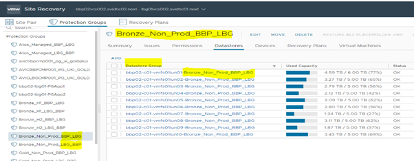

### SRM Logon Procedure

1. Log in to the vCenter on the site where the LUN will be added.

    >vCenter FQDN: https:\<locationCode>vcs001.\<DomainName>

2. On the other Tab Log in to the HashiVault on both DR sites and find the vcs001 entry with        **`administrator@vsphere.local`** credentials.

    >HashiVault FQDN: https:\<locationCode>hsv001.\<DomainName>:8200

3. Navigate to  the Site Recovery (later SRM) in the vCenter Menu.

    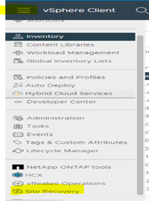

4. Click **Open Site Recovery**.

    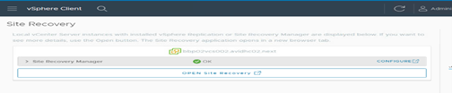

5. On the first login screen use the administrator credentials of the **Prod** site.

    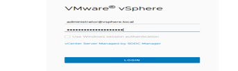

6. Choose the site pair and click **View Details**.

    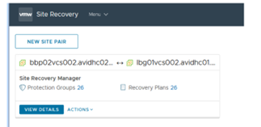

7. Log in site: with the mirror site administrator credentials.

    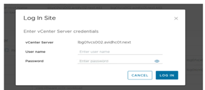

### Add new Protection Group (PG)

1. Choose the **Protection Group** and Click on **New Protection Group**.

    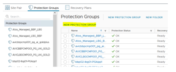

2. For **Name and Direction**, Enter the name as per the naming convention related to the **datastore group** & Select the **direction** of replication (As per the request) and then Click on NEXT.

    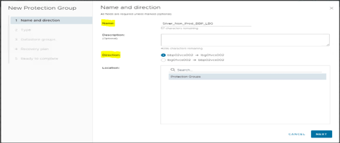

3. For **Type** select **Datastore groups** and select the listed **Array Pairs** then click on **Next**.

    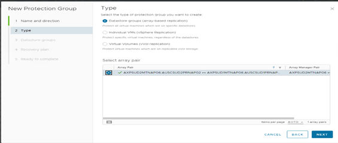

    >Note: All VMs that are running on the datastore, would be added to Protction Group, move powered of VMs to other Non-Replicated datastore.

4. For **Datastore Groups**, Select the datastore group from the list which need to be added in the PG.

    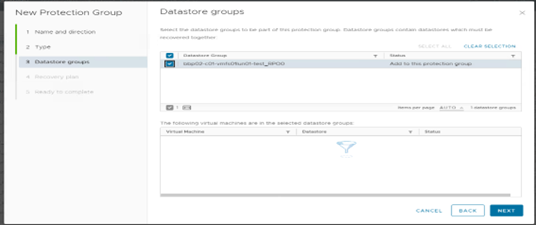

5. For **Recovery Plan** select **Add to New recovery plan** and enter the recovery plan name (just add RP_protection plan name).

    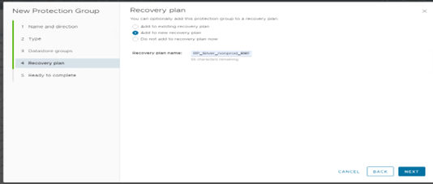

6. Complete by selecting **Finish**.

    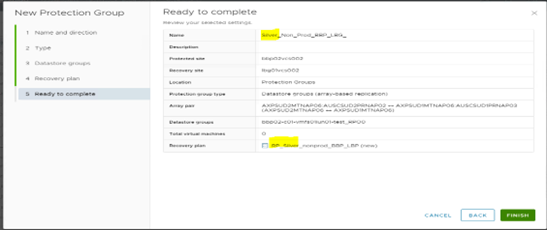

7. Ensure the New protection group is listed under the **Protection Groups**.

### Modify Protection Groups in SRM

>Note: For Aviva DR, VMs moved to New or Test PG, confirm with change coordinator,to which PG VMs need to move for DR activity

1. Log in to the vCenter.
2. Open Site Recovery Manager.
3. Navigate to the PG from which the VMs to be Remove.
4. Navigate to Virtaul machine and select the VM.
5. Click on **Triple Dot (...)**.
6. Remove Protection.

    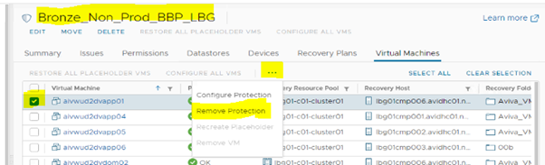

7. Click on **Remove Protection**.
8. Check and note down the target PG datastore.

    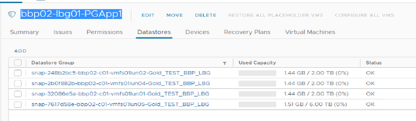

9. Go to vCenter - Select the VMs - Right click the VMs & Select Migrate.
10. Chose **change storage only**.
11. Chose the **Target datastore** which was get from step 8.
12. VMs will be automatically added to Target protection group.
13. Ensure that only the DR VMs are listed in the PG.

 >Note: For DR activity, only DR VMs that are to be moved to Target (New/Test) PG and then Failover. If any other VMs have Power On/Off state, move them to other Datastore.

## Changelog

| Version | Date          | Description                                                                                                                                                         | Author             |
|---------|---------------|---------------------------------------------------------------------------------------------------------------------------------------------------------------------|--------------------|
| 0.1     | 22/02/2024    | First version | JK.Jalaludeen|
