# Work Instruction: Tenant Creation in vRealize Suite LCM

## Table of Contents

- [Changelog](#changelog)
- [Introduction](#introduction)
  - [Purpose](#purpose)
  - [Scope](#scope)
  - [Audience](#audience)
- [Prerequisites](#prerequisites)
- [Tenant Creation Procedure](#tenant-creation-procedure)
  - [Step 1: Access vRealize Suite Lifecycle Manager (LCM)](#step-1-access-vrealize-suite-lifecycle-manager-lcm)
  - [Step 2: Navigate to Tenant Management](#step-2-navigate-to-tenant-management)
  - [Step 3: Add Tenant - Basic Details](#step-3-add-tenant---basic-details)
  - [Step 4: Configure Directory Details](#step-4-configure-directory-details)
  - [Step 5: Product Association](#step-5-product-association)
  - [Step 6: Precheck](#step-6-precheck)
  - [Step 7: Summary](#step-7-summary)
- [Common Errors and Troubleshooting](#common-errors-and-troubleshooting)
  - [IDM Sync Failure](#idm-sync-failure)

## Changelog

| Date | Description | Author |
|------|-------------|--------|
| 2025-10-16 | Initial creation of Tenant Creation WI | Aparna Kadam    |
| 2025-12-19 | VCS-17766 idm sync issue solution      | Martin P Mathew |

---

## Introduction

### Purpose

This document provides step-by-step instructions for creating a new tenant in **vRealize Suite Lifecycle Manager (LCM)**.  
It serves as a reference for cloud administrators performing multi-tenancy setup in VMware Aria Automation (vRA) on-premises environments.

### Scope

Covers all configuration parameters, input validation, and verification steps needed for tenant creation.

### Audience

- VMware Automation Administrators  
- DevOps Consultants working on vRA multi-tenancy setup  

## Prerequisites

| Prerequisite | Screenshot | Validation |
|--------------|------------|------------|
| Access to vRealize Suite LCM with admin privileges | 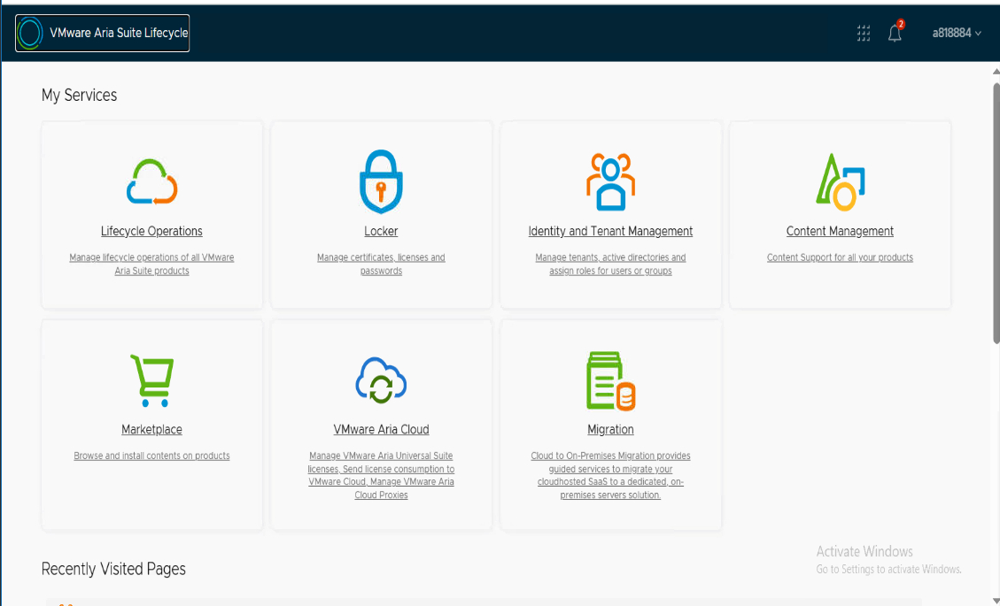 |  Log in successfully using admin credentials. Verify dashboard loads. |
| Verify Multitenancy is enable | 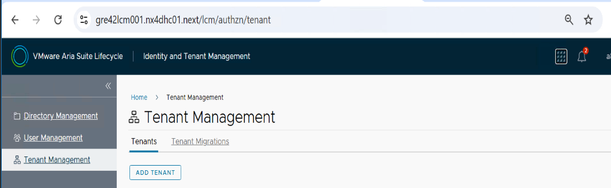 |  Open Tenant Management Page. Verify page loads. Add Tenant button is enabled. |
| DNS entries for Tenant FQDN and IDM | 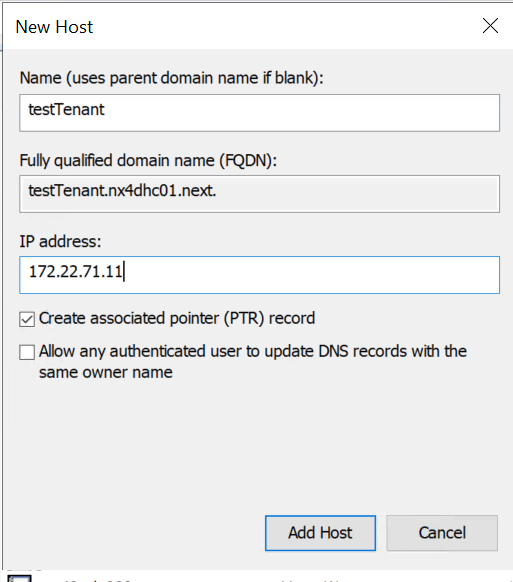   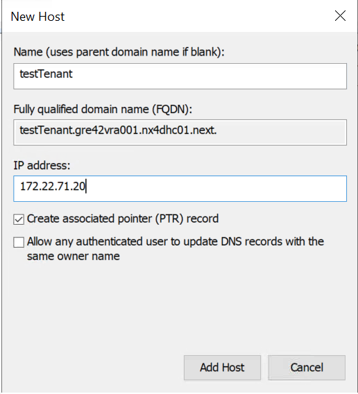 |  Add two A records: Ex. `demotenant.gre42vra001.nx4dhc01.next` → vRA IP, Ex. `demotenant.nx4dhc01.next` → IDM IP   [ ] Verify with `nslookup <tenant-fqdn>` and `ping <tenant-fqdn>` |
| Wildcard SSL certificate for Ex. `*.gre42vra001.nx4dhc01.next`, `*.gre42vra002.nx4dhc01.next`, `*.gre42vra003.nx4dhc01.next`, `*.gre42vra004.nx4dhc01.next` | 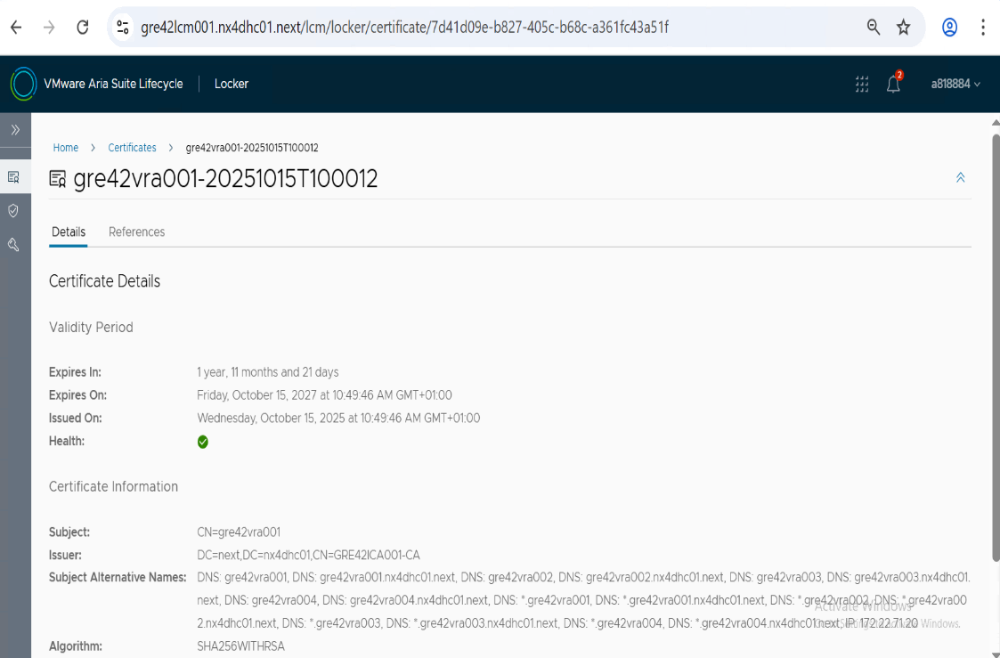 |  Verify CN/SAN matches.    Ensure certificate is active/trusted in LCM     Test HTTPS for tenant FQDN(s)    Verify expiration date is valid |

✅ **Notes:**  

- Ensure firewall rules allow LCM to communicate with all vRA components.  
- Validate certificate expiration and trust chain before proceeding.  
- Confirm administrative credentials have sufficient privileges for tenant creation.

## Tenant Creation Procedure

### Step 1: Access vRealize Suite Lifecycle Manager (LCM)

1. Log in to **vRealize Suite Lifecycle Manager** using admin credentials: `https://<lcm-fqdn>/vrlcm`
2. Navigate to **Identity and Tenant Management** → **Tenant Management**.

### Step 2: Navigate to Tenant Management

1. Click **Tenant Management** → **Add Tenant**.
2. The *Create Tenant Wizard* opens.

### Step 3: Add Tenant - Basic Details

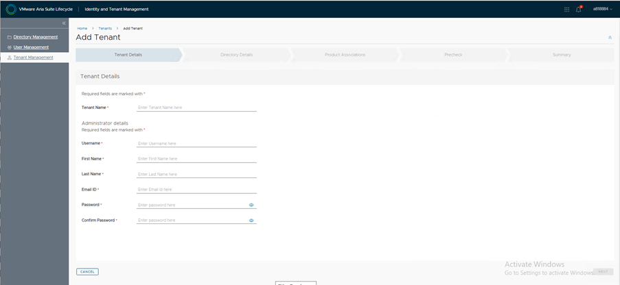

| Field | Description |
|--------|--------------|
| Tenant Name | Unique tenant system ID (lowercase, no spaces) |
| User Name | Create Administrator user for new Tenant|
| First Name | First Name of User|
| Last Name | Last Name of User  |
| EmailID | Provide email ID |
| Password | Provide Administrator password.|

Fill in the required details, and the **NEXT** button will appear.  
**Store the new tenant administrator credentials on HashiVault.**

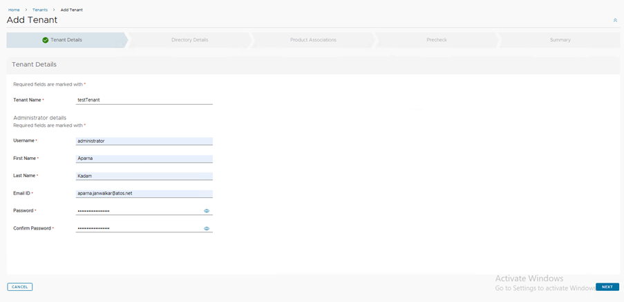

Click on **NEXT** Button.

### Step 4: Configure Directory Details

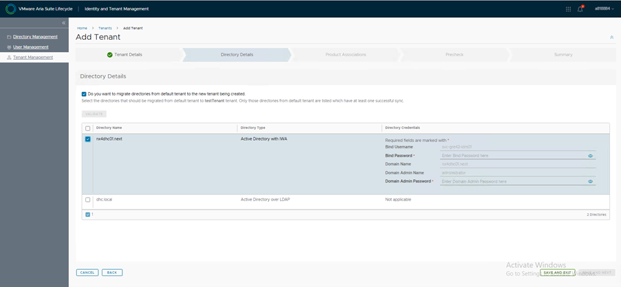

Select the directory that you want to attach to the tenant. and fill the Bind and Administrator user credentials.

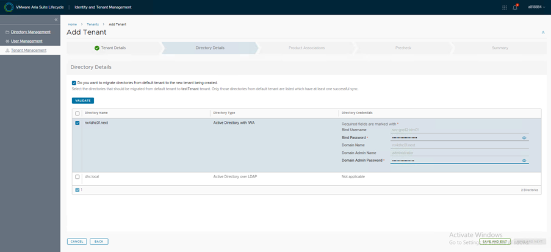

Click on **Validate** Button which will validate the credentials.

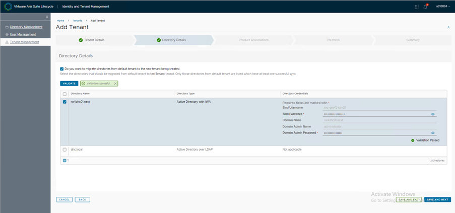

Click on **Save and NEXT**.

### Step 5: Product Association

Select the product that you want to associate.

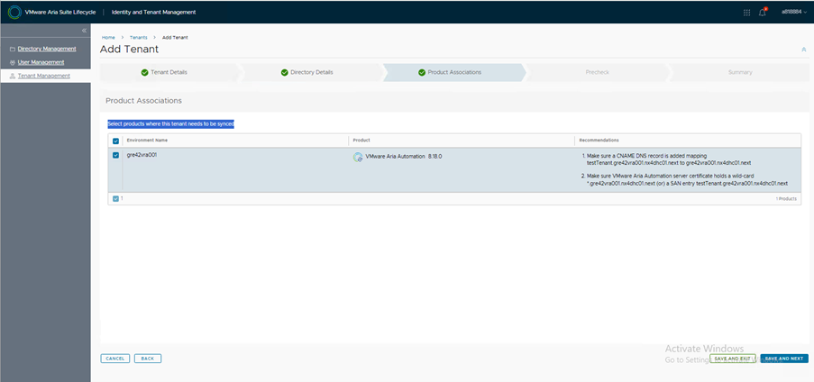

Click on **SAVE AND Next**

### Step 6: Precheck

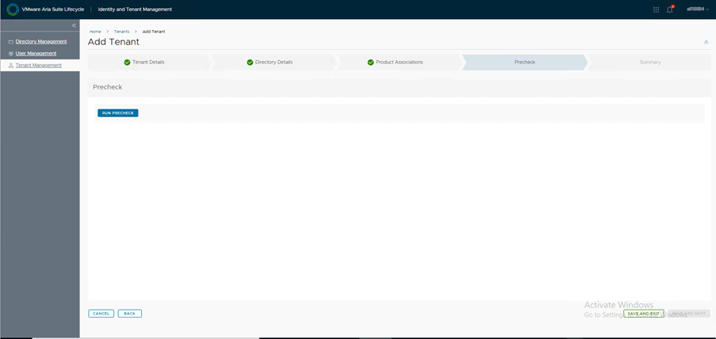

Click on **RUN Precheck**

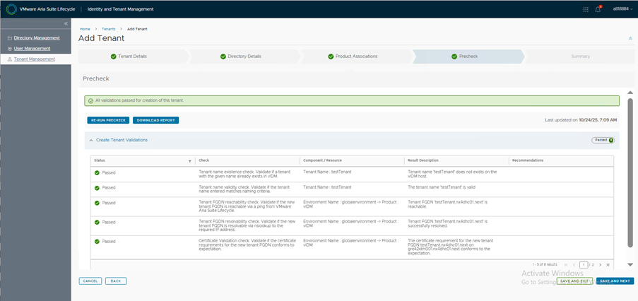

Click on **SAVE AND Next**

### Step 7: Summary

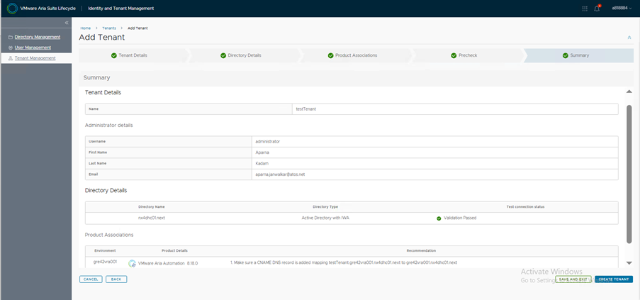

Review all entered details before proceeding.  
Click **Create Tenant** to initiate provisioning.

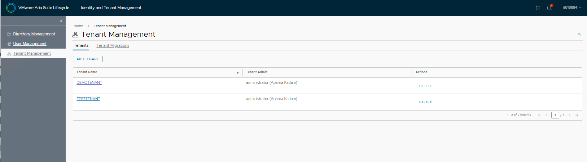

## Common Errors and Troubleshooting

| Issue | Cause | Resolution |
|--------|--------|-------------|
| Certificate requirement does not conform | Invalid or mismatched tenant FQDN certificate | Ensure wildcard certificate `*.gre42vra001.nx4dhc01.next` is applied |
| Failed to read HTTP message | Malformed payload or API body | Validate JSON structure and content-type |
| Tenant not visible in list | LCM service cache not updated | Refresh or restart LCM service |
| LDAP Bind Failed | Invalid credentials or network | Verify credentials, ports, LDAP configuration |

### IDM Sync Failure

This sync issue occurs because required user attributes (e.g., first name, last name, email) are not configured in Active Directory.

Login to tenant **VRA** Page and cross check the members in **Enterprise Groups** under **Identity and Access Management**.  
Note: in the below image, the total member count is zero.  

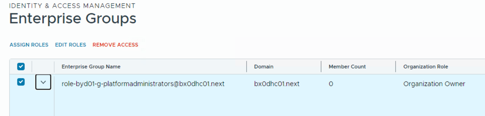

If you encounter a sync failure, follow the steps below:

Login to the web page `https://<tenant name>.<domain name>/` using tenant administrator credentials.  
For example: `https://demotenant.nx4dhc01.next/`.  
After a successful login, navigate to the top right corner and select **Administration Console** as shown in the screenshot below.

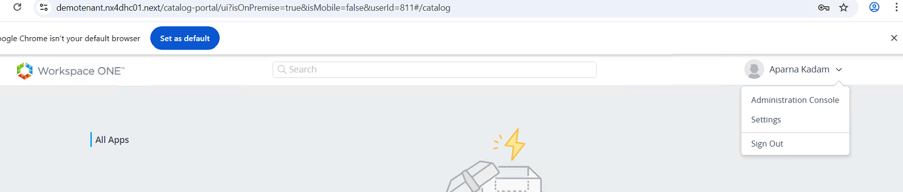

Select **Identity and Access Management** and click on **Setup** on the right side.  
From that page, select the **User Attributes** section and uncheck the **Required** checkbox near first name, last name, email (see the screenshot below).

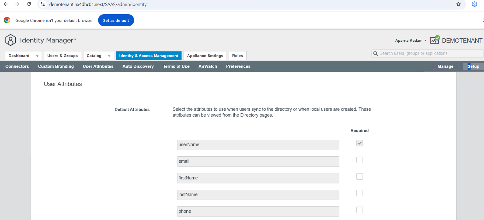

After saving the configuration, click the **Manage** button on the right side under **Identity and Access Management**.  
Select the **Directories** section and perform a resync by clicking **Sync Now**.

After **Sync Now** is successful, Login to tenant **VRA** Page and cross check the members in **Enterprise Groups** under **Identity and Access Management**.  

