# VCS vROPS report for Capacity Management

## Table of Contents

- [VCS vROPS report for Capacity Management](#vcs-vrops-report-for-capacity-management)
  - [Table of Contents](#table-of-contents)
- [Changelog](#changelog)
  - [Introduction](#introduction)
    - [Purpose](#purpose)
    - [Audience](#audience)
    - [Scope](#scope)
  - [Prerequisites](#prerequisites)
  - [Custom groups creation in vROPS Steps](#custom-groups-creation-in-vrops-steps)
  - [Process for Report creation and scheduling](#process-for-report-creation-and-scheduling)
  - [Import Super metrics](#import-super-metrics)
  - [Create Custom Profiles](#create-custom-profiles)
  - [Enable Allocation Model](#enable-allocation-model)
  - [Import Dashboards](#import-dashboards)
  - [Attachments](#attachments)

# Changelog

| Version | Date       | Description              | Author          |Jira Story|
| ------- | ---------- | ------------------------ | --------------- |----------|
| 0.1     | 23/02/2022 | First version            | Berte Petru     |DHC-3791  |

## Introduction

### Purpose

Create a vROPS capacity report.

### Audience

- VCS Operations

### Scope

Create vROps capacity reports.

## Prerequisites

1. vROPS 7.5.
2. Admin access on vROPS.

## Custom groups creation in vROPS Steps

- Login to vROPS using **Local Admin account**.

  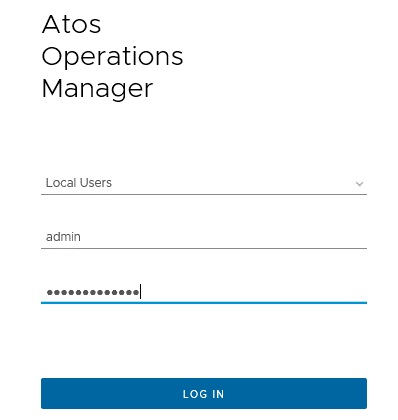
- Click on **Environment -> Custom Groups - > New Custom Group**.
- Provide below details in group:

  - **Name** – Group Name.
  - **Group type** – Environment.
  - **Policy** – Default Policy.
  - **Keep Group membership up to date** – Checked.

    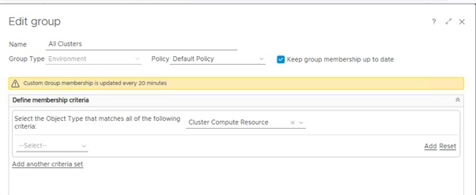

- Click on **OK**
- Create other group using same method for Virtual Machine and vSAN Datastores.

## Process for Report creation and scheduling

- Create Custom Group using above steps
- Click on **Details** and **Import** attached view.
  
 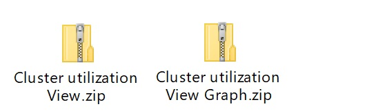
  
   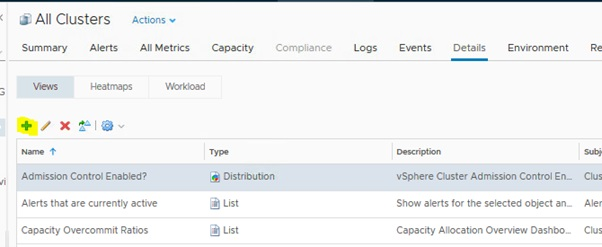

- Click on **Reports** and **Import** attached Report.
  
  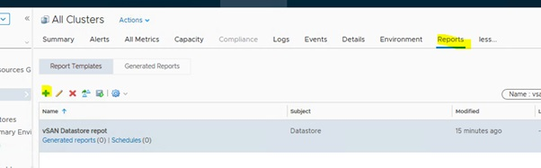

- Select imported report and click on **schedule**
- Click on **+** for new schedule.
  
  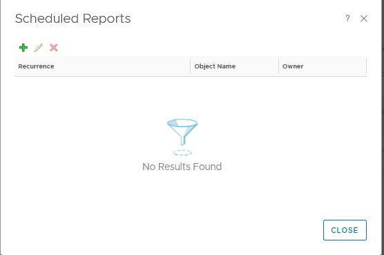

- Select schedule as per requirement, provide email address and select SMTP rule, Click on OK.
  
  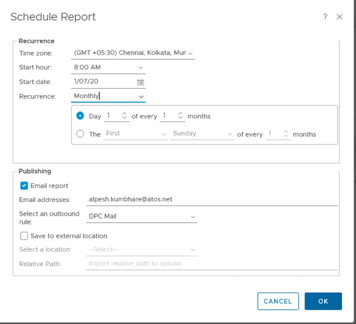

- Create Virtual Machine configuration report using referring above method and using below attached view and report.

  1.View:
  
  

  2.Report:
  
  

- Create VM undersized and oversized report using referring above method and using below attached view and report.

  1.View:
  
  

  2.Report:
  
  

- Create vSAN Datastore report using referring above method and using below attached view and report.

  1.View:
  
  

  2.Report:
  
  

- Create VM Count report using referring above method and using below attached view and report.

  1.View:
  
  

  2.Report:
  
  

- Create ATOS Cluster Compute Capacity Report using referring above method and using below attached view and report.

  1.View:
  
  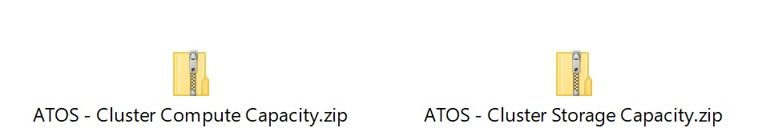

  2.Report:
  
  

## Import Super metrics

- Navigate to Administration – Configuration – Super Metrics.
- Import below Super Metrics:
  
  

## Create Custom Profiles

- Navigate to Administration – Configuration – Custom Profiles. Create custom Profiles as shown below.
  
  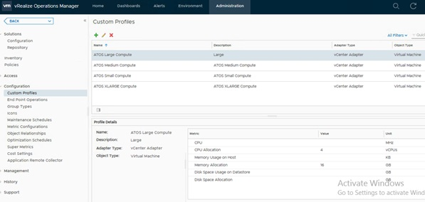

## Enable Allocation Model

- Navigate to Administration – policies – Policy Library. Select Policy which is used and edit it.
  
  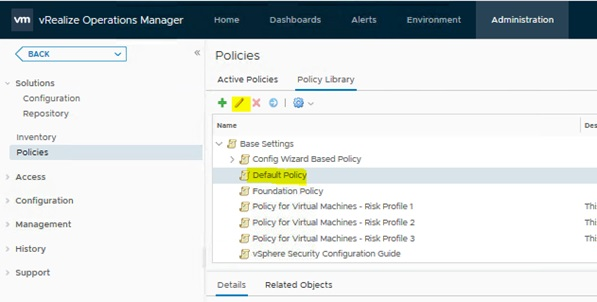

- Select Cluster Compute Resource in Analysis Settings and set required values.
  
  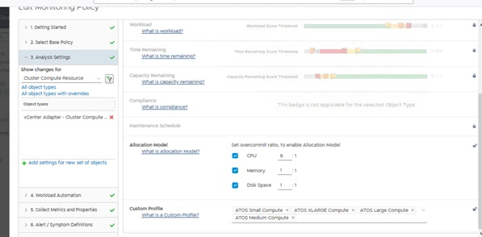

- Select all Custom Profiles which we have created.

## Import Dashboards

- Navigate to Dashboards – Manage Dashboards.
  
  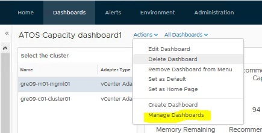

- Select Import Dashboards.
  
  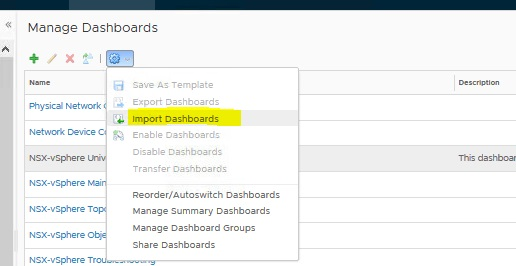

- Import below attached Dashboards:
  
  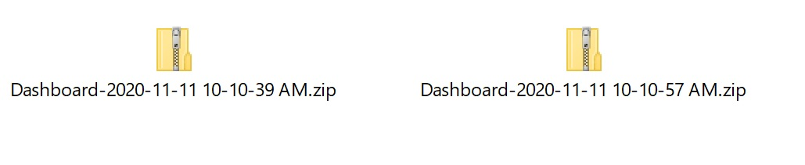

## Attachments

The attachments that are needed to CreateDHCvROPSreportForCapacityManagement are

| Name of the attachment              |
| ----------------------------------- |
| ATOSClusterComputeCapacityReportZip|
| ATOSClusterComputeCapacityZip|
| ClusterUtilizationZip|
| ClusterUtilizationZip|
| DPCVirtualMachineConfigurationZip|
| VmConfigurationReportZip|
| SupermetricJson|
| VmConfigurationReportZip|
| VMCountTrendReportZip|
| VMcountTrendZip|
| VMoversizeAndUndersizeReportZip|
| vSANDatastoreReportZip|
| vSANDatastoreReportZip|

The attachments can be downloaded from the original document
 [VCS vROPS report for Capacity Management](https://atos365.sharepoint.com/:w:/r/sites/DHCDevSecOpsTeam/Shared%20Documents/Code%20and%20documentation%20review/DHC%20vROPS%20report%20for%20Capacity%20Management/DHC%20vROPS%20report%20for%20Capacity%20Management.docx?d=w4e8623f81619467cb4fce8b70b7f3b92&csf=1&web=1&e=pChXUa)
