# Compliance Self-Assessment (CSA) Score Report

## Table of Contents

<!-- TOC -->
- [Compliance Self-Assessment (CSA) Score Report](#compliance-self-assessment-csa-score-report)
  - [Table of Contents](#table-of-contents)
  - [Changelog](#changelog)
  - [Introduction](#introduction)
    - [Purpose](#purpose)
    - [Audience](#audience)
    - [Scope](#scope)
  - [CSA Score Report Creation Steps](#csa-score-report-creation-steps)
    - [Security Baseline Management (__Target = 97%__)](#security-baseline-management-target--97)
    - [TOSCA Report Creation Instruction](#tosca-report-creation-instruction)
      - [Obtain the Raw Data](#obtain-the-raw-data)
      - [Perform the Calculation](#perform-the-calculation)
      - [Prepare the Final TOSCA Report for the Customer](#prepare-the-final-tosca-report-for-the-customer)
    - [Vulnerability Management (patch management) (__Target = 97%__)](#vulnerability-management-patch-management-target--97)
    - [Technology Refresh and Obsolescence Mgt (__Target = 95%__)](#technology-refresh-and-obsolescence-mgt-target--95)
    - [Configuration Management (__Target = 95%__)](#configuration-management-target--95)
    - [Create CMDB Export Report](#create-cmdb-export-report)
    - [Change Management (__Target = 97%__)](#change-management-target--97)
    - [Incident (Major) and problem management (__Target = 95%__)](#incident-major-and-problem-management-target--95)
    - [User and Authorisation Management (__Target = 97%__)](#user-and-authorisation-management-target--97)
  - [Security Monitoring and Logging (__Target = 95%__)](#security-monitoring-and-logging-target--95)
  - [Production Management (__Target = 95%__)](#production-management-target--95)
    - [Backup (__Target = 97%__)](#backup-target--97)
    - [Capacity Management (__Target = 95%__)](#capacity-management-target--95)
    - [Service Continuity Management (__Target = 95%__)](#service-continuity-management-target--95)
    - [Third party contracts (__Target = 95%__)](#third-party-contracts-target--95)
    - [Atos Technology Framework (__Target = 95%__)](#atos-technology-framework-target--95)
<!-- TOC -->

## Changelog

| Version | Date       | Issue | Description              | Author       |
| ------- | ---------- | ------| ------------------------ | --------------- |
| 0.1     | 28.10.2021 |  | First version | Alpesh Kumbhare|
| 0.2 | 01.03.2021 | DHC-3532| Reviewed and added missing instructions (TOSCA and CMDB Export)| Margo Piliukh|

## Introduction

### Purpose

Create a Compliance Self Assessment (CSA) Score report.

### Audience

- VCS Operations

### Scope

The CSA score report must be created every month for each customer of VCS and shared with the Security Compliance Officer for the customer before the 5th of each month.

In Scope:

- CSA Report Creation

## CSA Score Report Creation Steps

We keep CSA score report for VCS customers under the following link: [CSA Score Report Repository](https://atos365.sharepoint.com/sites/100001848/CES%20Evidence%20Repository/Forms/AllItems.aspx?id=%2Fsites%2F100001848%2FCES%20Evidence%20Repository%2FCES%20Practice%20CTO%20DHC%2F01%2E%20CSA%20Score%20Report&viewid=05b27bd5%2D15b8%2D4db1%2D8554%2Dc8166dd2b710).

Each customer will have a separate folder within this directory and the reports should be uploaded accordingly. Apart from the main sections described later in the document, several columns of the report must be filled in by the team member creating the report:

- __"%"__: provide percentage compliance for a particular control
- __Applicable__: indicate whether control is applicable or not for this particular customer
- __Evidence Path__: provide SharePoint path as the evidence if applicable
- __Comment__: provide any comments for a particular control

### Security Baseline Management (__Target = 97%__)

- __LS20-1 Does the service have a TSS (Technical Security Specification), either from global or locally owned document?__

Provide the [link](https://sp2013.myatos.net/ms/gd/gadp/TSSD/TSS%20Documents/Forms/AllItems.aspx) for TSS Documentation. This field is static for all customers.

- __LS20-2 What is the actual Security Baseline compliance percentage?__

Provide the link to TOSCA reports of a particular customer and update percentage score as per instruction provided under "TOSCA Report Creation Instruction" section.

- __LS20-3 Is a Security Baseline deviation and compliancy report available per customer and/or shared service, per managed CI. Either continuous when automated or at least yearly when manually performed.__

Provide the link to TOSCA reports of the customer.

- __LS20-4 Are all Security Baseline deviations addressed, either via a change or a Risk is registered in the Global Atos Risk Tool(ART)?__

Provide link to [SecurityMeasureExceptions.md](https://github.com/GLB-CES-PrivateCloud/DHC-Documentation/blob/develop/design/SecurityMeasureExceptions.md) on GitHub where all VCS security exceptions are documented. This is a static link for all VCS customers.

- __LS20-5 Are risks registered in the Global Atos Risk Tool (ART) when customers do not wish to conform to the Security Baseline?__

Provide the link to __Global Atos Risk Tool (ART)__. VCS DevSecOps Team should raise Risk in ART if customer does not wish to conform to the Security Baseline.

### TOSCA Report Creation Instruction

#### Obtain the Raw Data

1. Log into the TOSCA Portal under the link -  [TOSCA Portal](https://tosca-atos.it-solutions.myatos.net/pls/apex426/f?p=1500).

   NOTE: You must have CSM role assigned to you in TOSCA Alcatraz portal. This can be requested via a SNOW Portal. The instructions of how to request that access are provided [here](./wiRbacManagement.md).

   NOTE: You must be connected to URA to be able to access this site.

2. Navigate to __Reporting__ -> __All Measures__.

   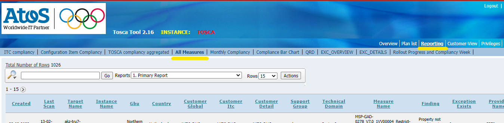

3. Filter the results by __Provider Name__ (each customer has a different Provider Name, for example AkzoNobel's Provider name is *GP79*), click __GO__.

   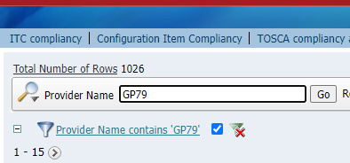

4. CLick on __Actions__ -> __Download__ -> __CSV__.

   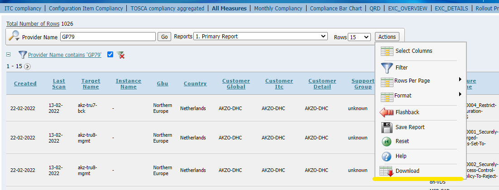

   NOTE: if you open the downloaded .csv file directly in Excel it will display the data in a non-workable way (columns are not populated correctly) - you will need to modify the data or create a new Excel file and import the data from .csv file.

5. Give this file (modified or newly created) a name according to the format below:

```text
DHC-CustomerName-TOSCA-Findings-dd-mm-yyyy
```

After the calculation and some modification described below, this will be a monthly __TOSCA Findings report__ that needs to be uploaded as evidence.

#### Perform the Calculation

Gather data for the calculation:

- Total number:
- Closed cases:
- Exceptions:
- Open cases:
- Total closed:
- Percentage:

*Total number*

This is the number of all the findings - total number of rows (without the headings) in the spreadsheet.

*Closed cases*

Go to the __Findings__ column and apply filter to only show results with "-". Note the number of records found.

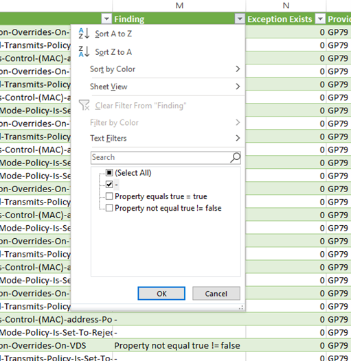

*Exceptions*

 __Exception Exists__ column can have two values: "0" - exception is absent, and "2" - exception exists.

Go to the __Findings__ column and remove the filter applied before. Go to the __Exception Exists__ column and filter to show only the results for "2". Note down the count of findings with the exception.

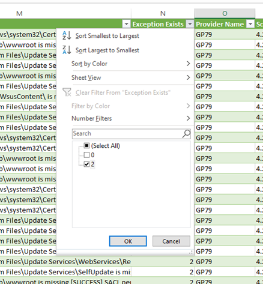

*Open cases*

Remove all the filters applied.
In the __Findings__ column add filter to show all the results except for "-". In the __Exception Exists__ column add filter to show all the results except for "2". Note down the number of all open cases.

*Total  closed*

This is calculated by addition: __Total closed__ + __Exceptions__.

*Percentage*

This is calculated by division: __Total closed__ / __Total number__.

The final percentage will be the actual Security Baseline compliance score that you will need to insert in the report.

#### Prepare the Final TOSCA Report for the Customer

This part will cover a creation of an easily readable table of the open measures for the customer.

In the same document you used to calculate the Security Baseline compliance percentage, go to __Insert__ tab and select __PivotTable__. This will select all the data in the document automatically, just click __Okay__. A new sheet will open with a __PivotTable Fields__ menu on the left.

To construct a readable table search and add the fileds by dragging them in the provided areas as per the screenshot below:

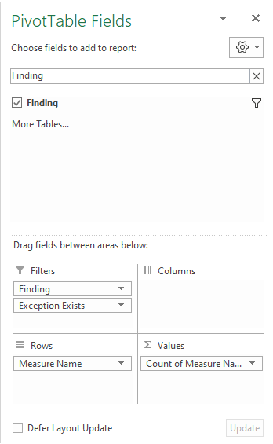

Sort the Measures by clicking on a header of the column, select __More Sort Options...__, __Sort Z to A__ based on __Count of Measure Name__.  Click __Okay__.

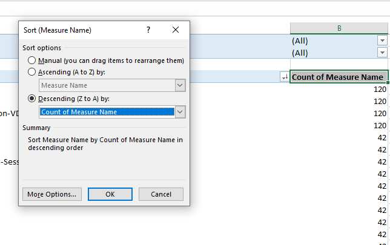

Apply the added filters to show open findings: exclude "-" results in __Findings__, show only "0" in __Exception exists__. This will give us a clear view of the open cases and their description.

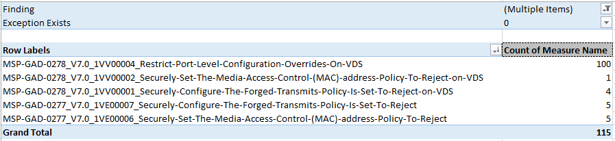

This will be a final TOSCA report intended for the customer. Upload it to the CES Evidence Repository.

### Vulnerability Management (patch management) (__Target = 97%__)

- __LS13-1 Is an up-to-date report per customer and per service available indicating per production server that the anti-virus software is installed and up-to-date?__

Provide the link to [Security and Monitoring Repository](https://atos365.sharepoint.com/sites/100001848/CES%20Evidence%20Repository/Forms/AllItems.aspx?id=%2Fsites%2F100001848%2FCES%20Evidence%20Repository%2FCES%20Practice%20CTO%20DHC%2FSecurity%20Monitoring%20and%20Logging&viewid=05b27bd5%2D15b8%2D4db1%2D8554%2Dc8166dd2b710) as evidence.

- __PA01-1 Does the service have a Patch Policy/Procedure, either from global or a locally owned document?__

Provide the link for [lldPatching.md](https://github.com/GLB-CES-PrivateCloud/DHC-Documentation/blob/DHC-3272-CSA-SCORE-Report-WLI/design/lldPatching.md) document from GitHub. This is static field for all customers.

- __PA01-2 Are all applicable software updates and prio 1 security patches identified and assessed, resulting in a patch advice?__

We are using GPP approved patches as a reference.

- __PA02-1 Are up-to-date reports per customer and shared service of installed and not-installed software updates and prio 1 patches available for all managed CI's, patch compliance percentages?__

Provide the link to the [SharePoint location](https://atos365.sharepoint.com/sites/100001848/CES%20Evidence%20Repository/Forms/AllItems.aspx?id=%2Fsites%2F100001848%2FCES%20Evidence%20Repository%2FCES%20Practice%20CTO%20DHC%2FVulnerability%20Management%20%28Patch%20Management%29&viewid=05b27bd5%2D15b8%2D4db1%2D8554%2Dc8166dd2b710) where the patch reports are stored for a particular customer.

- __PA02-2 Completeness: Is verified that all Configuration Items registered in the CMDB are included in the patch overview as delivered under PA02-1?__

In order to validate whether all CIs which we are patching are available, provide the [CMDB Export Reports repository](https://atos365.sharepoint.com/sites/100001848/CES%20Evidence%20Repository/Forms/AllItems.aspx?id=%2Fsites%2F100001848%2FCES%20Evidence%20Repository%2FCES%20Practice%20CTO%20DHC%2FConfiguration%20Management&viewid=05b27bd5%2D15b8%2D4db1%2D8554%2Dc8166dd2b710) link as evidence. The CMDB Export Report instructions are presented later in this WI.

- __PA02-3 Are risks registered in the Global Atos Risk Tool(ART) when customers do not wish to implement a patch advice?__

Provide the link for Global Atos Risk Tool (ART). VCS DevSecOps Team should raise Risk in ART if customer does not wish to implement patch advice.

- __PA02-4 What is the actual patch percentage of the Service?__

Provide the link to the [SharePoint location](https://atos365.sharepoint.com/sites/100001848/CES%20Evidence%20Repository/Forms/AllItems.aspx?id=%2Fsites%2F100001848%2FCES%20Evidence%20Repository%2FCES%20Practice%20CTO%20DHC%2FVulnerability%20Management%20%28Patch%20Management%29&viewid=05b27bd5%2D15b8%2D4db1%2D8554%2Dc8166dd2b710) where the patch reports are stored for a particular customer. The percentage will depend on the actual patch implementation that month.

- __PA02-5 What is the actual patch percentage for VMware?__

We will be following N-2 VCS version as compliance. All VMware patches will be applied during the LCM.

- __PA02-6 Are changes registered for patch upgrades based on the patch advices?__

Provide Change Request number from SNOW which was raised for patching.

### Technology Refresh and Obsolescence Mgt (__Target = 95%__)

- __AM01-1 Are End-Of-Life dates registered and maintained for all software CI models in the configuration database?__

Provide the link to the latest Release Management PDF February 2021. In case of queries contact Karolina Cygan (`karolina.cygan@atos.net`).

- __AM02-1 Is a quarterly End-of-Support report created and evaluated for (soon) obsolete software/hardware per customer and/or shared services, and are stakeholders informed?__

RProvide the link to the latest Release Management PDF February 2021. In case of queries contact Karolina Cygan (`karolina.cygan@atos.net`).

- __AM02-2 Completeness: Is verified that all End of Support Configuration Items registered in the used CMDB (including Atos) are included in either an upgrade change or a Risk is registered in the Global Atos Risk Tool(ART)?__

Provide the link to the latest Release Management PDF February 2021. In case of queries contact Karolina Cygan (`karolina.cygan@atos.net`).

- __AM02-3 Are risks registered in the Global Atos Risk Tool(ART) when customers do not allow upgrades of obsolete hardware or software?__

Provide the link for Global Atos Risk Tool (ART). VCS DevSecOps Team should raise Risk in ART if customer do not allow upgrades of obsolete hardware or software.

### Configuration Management (__Target = 95%__)

- __CF00-1 Is the Configuration Management Process described and applicable?__

Provide the link to wiServiceNowDiscoveryToEnrichCMDBWithLiveData.md from GitHub as evidence.

- __CF04-1 What is the actual overall completeness percentage?__

Provide the percentage. Provide the link to the [CMDB Export Report repository](https://atos365.sharepoint.com/sites/100001848/CES%20Evidence%20Repository/Forms/AllItems.aspx?id=%2Fsites%2F100001848%2FCES%20Evidence%20Repository%2FCES%20Practice%20CTO%20DHC%2FConfiguration%20Management&viewid=05b27bd5%2D15b8%2D4db1%2D8554%2Dc8166dd2b710) location for  customer.

- __CF04-2 Is a monthly CMDB export report available?__

Provide the link to the [CMDB Export Report repository](https://atos365.sharepoint.com/sites/100001848/CES%20Evidence%20Repository/Forms/AllItems.aspx?id=%2Fsites%2F100001848%2FCES%20Evidence%20Repository%2FCES%20Practice%20CTO%20DHC%2FConfiguration%20Management&viewid=05b27bd5%2D15b8%2D4db1%2D8554%2Dc8166dd2b710) location for customer.

The instructions on how to create a CMDB Export Report are presented below.

### Create CMDB Export Report

1. Log into [SNOW](https://atosglobal.service-now.com/). Navigate to __VMware Virtual Machine Instances__ from the *Search bar* on the left or by going to __Configuraion__ -> __VMware__ -> __Virtual Machine Instances__.

   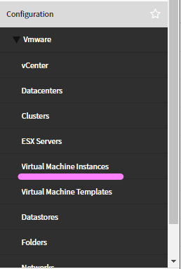

2. Set up the criteria for instances as presented below:

   ```text
   vCenter Reference - contains - vCenter@10.218.77.
   ```

   NOTE: exact vCenter Reference will differ depending on the customer - indication of the network where vCenters are located should be entered accordingly.

   ```text
   Status - is not - Retired
   ```

   NOTE: use __AND__ operator to add the second condition.
   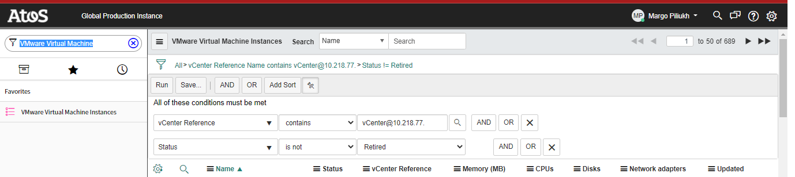
  
   TIP: you can save this filtering to be always listed on the left-hand side of the SNOW window so you don't have to create it each time.
   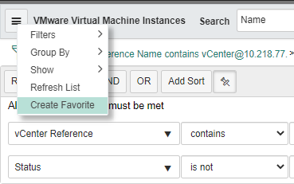

3. Right-click on any of the column names, select __Export__ -> __Excel (.xlsx)__

   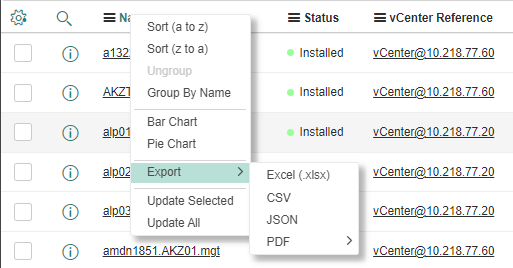

4. Rename this file according to the following format:

   ```text
   CMDB-Export-CustomerName-DHC-ddmmyyyy
   ```

5. Upload the file to the __CES Evidence Repository__ under the [link](https://atos365.sharepoint.com/sites/100001848/CES%20Evidence%20Repository/Forms/AllItems.aspx?id=%2Fsites%2F100001848%2FCES%20Evidence%20Repository%2FCES%20Practice%20CTO%20DHC%2FConfiguration%20Management%2FCMDB%20export&viewid=05b27bd) (select the appropriate customer folder for which the report is being generated).

### Change Management (__Target = 97%__)

- __CM02-1 Are all standard changes and Standard Service Requests for the service documented (procedures, work instructions and standard CIP) in the standard change catalogue (MSD-U02-0017)?__

Provide the link to the SharePoint/GitHub/SNOW location where the all the related documentation is stored:

- CIPs - [link](https://sp2013.myatos.net/ms/gd/services/Pages/Global%20Cloud%20Services%20Homepage.aspx)
- WIs - [link](https://github.com/GLB-CES-PrivateCloud/DHC-Documentation)

- __CM03-1 Is a testplan available and a Post Implementation Review (PIR) documentation available for every failed non-standard change?__

Provide the link to the SharePoint location where PIR documentation is stored. If the PIR documentation is not collected separately in a specific repository (apart from SNOW change ticket itself) state so in the comment section.

- __CM04-1 Change Manager's approval (or equivalent) for  all standard changes and Standard Service Requests for the service.__

Provide the link to the SharePoint location where the all the related documentation is stored. If such documentation is not collected separately in a specific repository (apart from SNOW change ticket itself) state so in the comment section.

- __CM06-1 Is senior management approval documented for all emergency changes?__

Provide the link the SharePoint location where the documentation for Emergency Changes is kept.

### Incident (Major) and problem management (__Target = 95%__)

- __PM02-1 Is every Priority 1 or Major Incident transferred into a problem and is an RCA report timely created?__

We are following this process. Provide Problem ticket as a reference if exists.

- __PM02-2 Are problem resolution actions from the RCA defined and tracked?__

We are following this process. Provide Problem ticket as a reference if exists.

### User and Authorisation Management (__Target = 97%__)

- __LS03-1 Is an authorization matrix available with accounts, roles and permissions?__

Provide the link to the [SharePoint location](https://atos365.sharepoint.com/sites/100001848/CES%20Evidence%20Repository/Forms/AllItems.aspx?id=%2Fsites%2F100001848%2FCES%20Evidence%20Repository%2FCES%20Practice%20CTO%20DHC%2FUser%20and%20Authorization%20Management&viewid=05b27bd5%2D15b8%2D4db1%2D8554%2Dc8166dd2b710) where Authorization Matrix is kept.

- __LS03-2 Are all new authorizations requested via an approved change?__

We are following this process. Provide an example change ticket number if exists.

- __LS08-1 Are all admin user-authorizations part of a quarterly user review?__

We are following this process. Provide the link to the [SharePoint location](https://atos365.sharepoint.com/sites/100001848/CES%20Evidence%20Repository/Forms/AllItems.aspx?id=%2Fsites%2F100001848%2FCES%20Evidence%20Repository%2FCES%20Practice%20CTO%20DHC%2FUser%20and%20Authorization%20Management&viewid=05b27bd5%2D15b8%2D4db1%2D8554%2Dc8166dd2b710) where Authorization Matrix as well as Quarterly User Review Approvals are kept.

- __LS08-2 Are only Atos personalized userid's, based on DAS account, used to log on to systems?__

We are following this process.

- __LS08-3 Is an approved overview of system userid's available (system userid's are those functional ID's that can not be avoided because of applications, running of batch jobs etc.)?__

Provide the link to the [SharePoint location](https://atos365.sharepoint.com/sites/100001848/CES%20Evidence%20Repository/Forms/AllItems.aspx?id=%2Fsites%2F100001848%2FCES%20Evidence%20Repository%2FCES%20Practice%20CTO%20DHC%2FUser%20and%20Authorization%20Management&viewid=05b27bd5%2D15b8%2D4db1%2D8554%2Dc8166dd2b710) where Authorization Matrix is kept. This Matrix contains service accounts as well.

## Security Monitoring and Logging (__Target = 95%__)

Since the Abstraction Layer has been deprecated, we are now sending SOAP to the event manager and issuing incident tickets in Snow for monitoring via the HTTP Gateway Server.

## Production Management (__Target = 95%__)

- __OP01-1 Is a production plan available (in line with the template MSF-U02-0004) for the unit that includes daily housekeeping and maintenance activities?__

Provide the link to [dhcProductionPlan.md](./dhcProductionPlan) from GitHub.

- __OP02-1 Are all daily activities executed in line with the production plan?__

Provide the SharePoint link to the Production Plan tracking Excel file. This will be different for each customer.

### Backup (__Target = 97%__)

- __DB01-1 Are backups executed according to the default backup schedule or documented client agreements?__

Backup execution is not in scope of DevSecOps team. Backup reports are being provided daily by the Backup Team. Reports are sent to the group mailbox.

- __DB01-2 Is a periodic check executed to make sure that all Configuration Items registered in the CMDB are included in the backup schedules?__

Backup reports are being provided daily by the Backup Team and analyzed by DevSecOps Team. Reports are sent to the group mailbox.

- __DB02-1 Are failed backups monitored and followed up on a daily basis?__

We are following this process. Backup reports are being provided daily by the Backup Team. Reports are sent to the group mailbox. Provide example incident ticket if available.

- __DB02-1 Does management review the number of failed backups on a monthly basis to ensure correct follow-up?__

Provide example ticket number if exists.

- __DB03-1 Is regular (at least yearly) checked that executed backups and retention periods are in accordance with contractual requirements?__

We are following this process. To be followed by TSM (Technical Service Manager).

- __DP01-4 Are changes registered for all backup schedule changes?__

Backup schedule changes are not in scope of DevSecOps team. There is an internal process within the Backup team.

### Capacity Management (__Target = 95%__)

- __CA01-1 Is a responsible person for capacity management for the service appointed?__

| Name | Email |
|------| ------|
|Rajesh Mhatre | `rajesh.mhatre@atos.net` |
|Neha Bhosale | `neha.bhosale@atos.net` |

- __CA02-1 Is the capacity forecast for the service available and analyzed on a monthly basis?__

Provide the SharePoint link to Capacity forecast from AST if available.

- __CA02-2 Are capacity events for monitoring defined for a every cloud technology layer?__

The tickets are generated by vROps. Provide the link to dhcOnboardingAbstractionLayer.md from GitHub.

- __CA02-3 Are the defined capacity events monitored and are tickets created?__

All Vmware components are monitored using vROps. Provide an example ticket from SNOW for a Capacity issue if exists.

- __CA02-4 Is a definition available for continuous measurement of capacity data for every cloud technology layer?__

Provide the [link](https://sp2013.myatos.net/portfolio/ms/Portfolio%20Offerings%20Document%20Library/Digital%20Hybrid%20Cloud_L4D.pptx?Web=1) to L4D document.

- __CA03-1 Is the defined measurement scheme implemented and is the relevant data captured and stored?__

Provide the link to Capacity Report repository or indicate where the reports can be found.

- __CA03-2 Are monthly capacity trend reports available and analyzed?__

Provide the link to Capacity Report repository or indicate where the reports can be found.

### Service Continuity Management (__Target = 95%__)

- __BC01-1 Is a service oriented Business (Service) Impact Analyses (BIA) and Risk Assessment executed?__

These actions are not directly performed by DevSecOps Team. Contact Service Resposible Manager to obtain information regarding this.

- __BC01-2 Are the customers contracted ITSCM services in place (including additonal requirements for architecture)?__

Contact Service Resposible Manager to obtain information regarding this.

- __BC03-1 Is the Atos Service Continuity Plan for the service created and in place?__

Contact Service Resposible Manager to obtain information regarding this.

- __BC03-2 Is the Atos Service Continuity Plan for the Service trained?__

Contact Service Resposible Manager to obtain information regarding this.

- __BC04-1 Is the Service Continuity Plan for the service tested and the test results reported?__

Contact Service Resposible Manager to obtain information regarding this.

- __BC04-2 Is the Service Continuity Plan for the Service improved based on the past test?__

Contact Service Resposible Manager to obtain information regarding this.

### Third party contracts (__Target = 95%__)

- __SM01-1 If third parties require access to the cloud environment, is a connectivity design available covering relevant security and legal requirements (including traceability to a personal identity).__

Direct access to infrastructure is not available for vendor. For Data center visits, vendor details will be captured in access request.

- __SM01-2 Are SaaS services in use for the service (DevSecOps) and is an assessment done?__

As we are using vRA Cloud SaaS, provide the link to the [VMware ISO certification](https://www.vmware.com/tw/products/trust-center/certificate.html?family=ISO).

### Atos Technology Framework (__Target = 95%__)

- __CF01-1 Is ATF (ServiceNow or BMC Atrium) used for all configuration items?__

That is true. Provide CMDB Export Reports repository [link](https://atos365.sharepoint.com/sites/100001848/CES%20Evidence%20Repository/Forms/AllItems.aspx?id=%2Fsites%2F100001848%2FCES%20Evidence%20Repository%2FCES%20Practice%20CTO%20DHC%2FConfiguration%20Management&viewid=05b27bd5%2D15b8%2D4db1%2D8554%2Dc8166dd2b710) as evidence.

- __IM01-1 Is ATF COMET used for all Major Incidents?__

Provide an example Major Incident ticket if exists for which the ATF COMET was used.

- __IM02-1Is ATF (ServiceNow,SDM) used for all tickets (incident, problem, change,etc)?__

We are following this process. Provide an example incident ticket from SNOW if exists.
