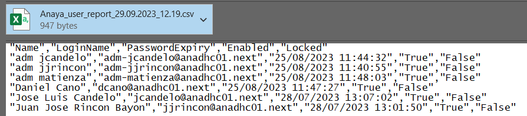

# Customer user password report

# Changelog
  
| Version | Date       | Jira Story  | Author        | Description                |
|---------|------------|-------------|---------------|----------------------------|
| 0.1     | 2023.09.28 | VCS-10948   | Adrian Ilea   | Initial version            |

- [Customer user password report](#customer-user-password-report)
- [Changelog](#changelog)
  - [Introduction](#introduction)
    - [Purpose](#purpose)
    - [Audience](#audience)
    - [Scope](#scope)
  - [Prerequisite](#prerequisite)
- [Steps to configure report](#steps-to-configure-report)
  - [Prepare Script](#prepare-script)
  - [Schedule Script](#schedule-script)
  - [Sample Output of Report](#sample-output-of-report)

## Introduction

Anaya and Hachette customers requested from us weekly report of expiring users in the environment.

### Purpose

Configure VCS AD Custom User Report for  Anaya and Hachette which provides password data expiry for users in the VCS active directory. This report can be used by other customers if they need it.

### Audience

- VCS Engineers
- VCS Operations

### Scope

- Prepare and execute reporting script

## Prerequisite

- Administrator access on Windows server where script need to be configured
- Service account used for scheduling the report. This service account should have at least read only access VCS active directory (ans01 AD service account should be used)
- All VCS active directory customer users Description must contain the exact  "**Customer User**" two-word phrase.

# Steps to configure report

## Prepare Script

- Create Folder D:\Scripts\UserExpReport\ on the server where you need to configure this script. AD Users and Computers should be reachable from this server and also SMPT traffic allowed for it (server TSS02 should be used).
- Download Script from DHC-Manage folder roles/dhc-collectReports/files/CustUsersPassExp.ps1 and copy it in Folder "D:\Scripts\UserExpReport\" which you created in previous step.
- Right Click on Script and edit lines from "**# Customer and email variables**" section by providing environment specific details for $Customer and $EmailTo:

```powershell
# Customer and email variables
$Customer = "CustomerName"
$OrgUnit = "OU=DHC,DC=$($env:USERDOMAIN),DC=NEXT"
$EmailSMTP = $env:computername.Substring(0,5) + "SRS001.$env:USERDNSDOMAIN"
$EmailTo = "DHC-DevSecOps@atos.net", "email2", "email3"
$EmailFrom = "noreply@atos.net"
```

- Save Script. Run it to test. Email IDs mentioned in **$EmailTo** list  should get mail if it's working fine. Reports will be saved in the D:\Scripts\UserExpReport\Output\ folder.

## Schedule Script

- Open Task Scheduler on server and create new task.
- Provide name for Task : **CustUsersReport**.
- Provide the ans01 Service account that the report will use when scheduled.
- Select "Run whether user is logged on or not"
- Create new trigger for the report as per requirement
- Create new Action as below
  - Action: Start a program
  - Program/Script: powershell.exe
  - Add arguments (optional): D:\Scripts\UserExpReport\CustUsersPassExp.ps1
  - Start in (optional): D:\Scripts\UserExpReport
- Validate schedule by running it.

## Sample Output of Report

Users will get report in below format


