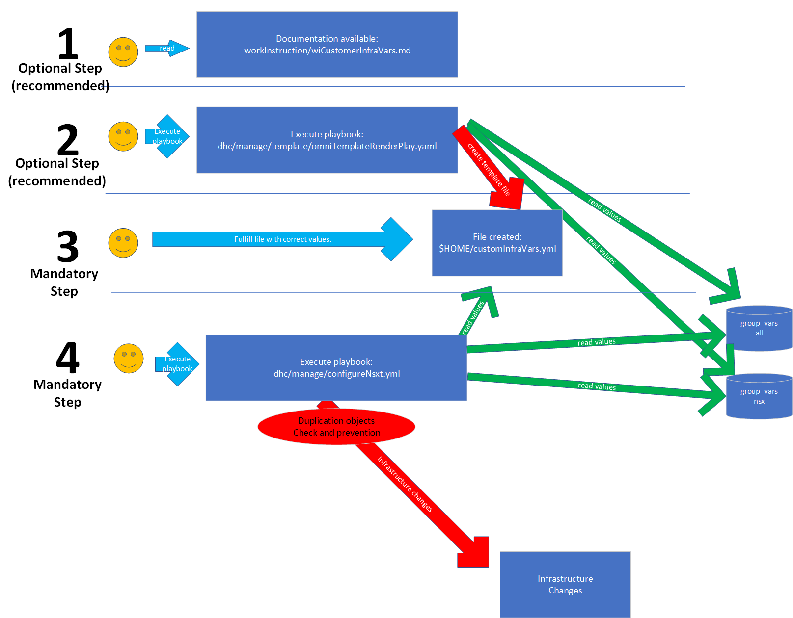
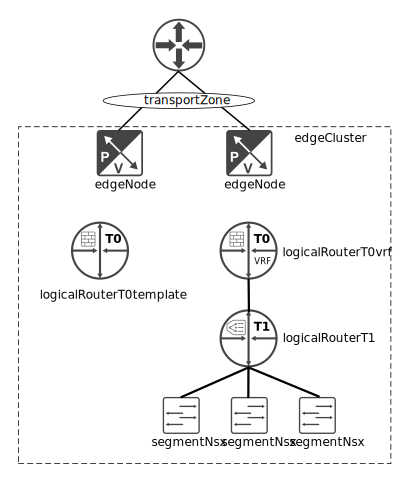
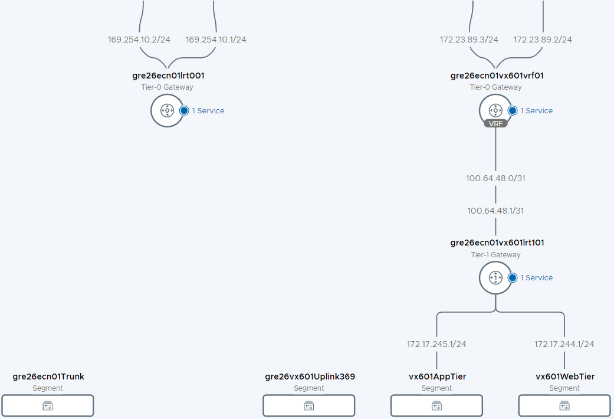
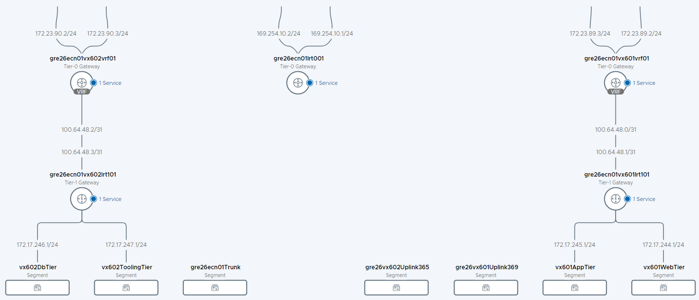

# Customer Infrastructure Variables

# Table of Contents

- [Customer Infrastructure Variables](#customer-infrastructure-variables)
- [Table of Contents](#table-of-contents)
- [Changelog](#changelog)
  - [Introduction](#introduction)
    - [Purpose](#purpose)
    - [Audience](#audience)
    - [Scope](#scope)
- [*customInfraVars.yml* file detailed description](#custominfravarsyml-file-detailed-description)
  - [File location](#file-location)
  - [List of Ansible Playbooks using *customInfraVars.yml*](#list-of-ansible-playbooks-using-custominfravarsyml)
  - [Usage of *customInfraVars.yml*](#usage-of-custominfravarsyml)
  - [*omniTemplateRenderPlay.yml* prompts](#omnitemplaterenderplayyml-prompts)
  - [Example of empty *customInfraVars.yml* template](#example-of-empty-custominfravarsyml-template)
- [How to use *customInfraVars.yml* with *configureNsxt.yml* to deploy an example NSX-T network topology](#how-to-use-custominfravarsyml-with-configurensxtyml-to-deploy-an-example-nsx-t-network-topology)
  - [Implementation scenario for NSX-T network topology](#implementation-scenario-for-nsx-t-network-topology)
    - [transportZone module - Create NSX-T Transport Zone](#transportzone-module---create-nsx-t-transport-zone)
    - [edgeNode module - Create NSX-T Edge Transport Nodes](#edgenode-module---create-nsx-t-edge-transport-nodes)
    - [edgeCluster module - Create NSX-T Edge Cluster](#edgecluster-module---create-nsx-t-edge-cluster)
    - [logicalRouterT0template module - Create NSX-T T0 Template Logical Router (used for T0 VRFs)](#logicalroutert0template-module---create-nsx-t-t0-template-logical-router-used-for-t0-vrfs)
    - [logicalRouterT0vrf module - Create NSX-T T0 VRF](#logicalroutert0vrf-module---create-nsx-t-t0-vrf)
    - [logicalRouterT1 module - Create NSX-T T1 Logical Router](#logicalroutert1-module---create-nsx-t-t1-logical-router)
    - [segmentNsx module - Create new network segment](#segmentnsx-module---create-new-network-segment)
  - [Example file for VX6 (VCS 1.5) network section - initial deployment](#example-file-for-vx6-vcs-15-network-section---initial-deployment)
  - [Example file for VX6 (VCS 1.5) network section - new tenant on existing NSX-T Edge Cluster](#example-file-for-vx6-vcs-15-network-section---new-tenant-on-existing-nsx-t-edge-cluster)
  - [Example file for NX8 (VCS 1.5) fo vRA OnPrem Deployment](#example-file-for-nx8-vcs-15-fo-vra-onprem-deployment)
- [How to use *customInfraVars.yml* for Storage profiles for external storage solution (VMFS)](#how-to-use-custominfravarsyml-for-storage-profiles-for-external-storage-solution-vmfs)
  - [Example of Storage Profiles section for NX1 lab environment](#example-of-storage-profiles-section-for-nx1-lab-environment)

# Changelog

| Date | TOS | Issue | Author | Description |
|------|-----|-------|--------|-------------|
| 16.06.2021 | | N/A | Pawel Zurawski | Document creation |
| 17.06.2021 | | N/A | Michal Pindych | Document update  |
| 30.06.2021 | | N/A | Michal Pindych | Document update - added Infoblox variables |
| 12.11.2021 | | N/A | Paweł Żurawski | Document update - clarification added how to use file |
| 24.02.2022 | VCS 1.5 | DHC-4201 | Łukasz Bieńkowski | Document restructuring - improve general and networking section |
| 09.03.2022 | VCS 1.5 | DHC-4347 | Łukasz Bieńkowski | Document update - added information about NSX-T segments and Infoblox integration, added projectName in tenant section |
| 31.03.2022 | VCS 1.5 | DHC-4386 | Łukasz Bieńkowski | Document update - adjusted information that initial workload topology build is performed by *configureNsxt.yml* in manage phase instead of *createNsxtSDN.yml* in deploy phase |
| 21.07.2022 | | CESDHC-355 | Paweł Żurawski | Document update - NSX-T Edge Node size |
| 20.09.2022 | | CESDHC-198 | Adam Wieczorek | Added info related to storageProfilesVmfs section for external storage |
| 13.10.2022 | | CESDHC-4212 | Alpesh Kumbhare | Added info related to vRA OnPrem |
| 11.01.2023 | | CESDHC-5174 | Arun Sompura | Added info related to Regional deployment of vRA OnPrem |
| 13.02.2026 | | VCS-18103 | Stanislaw Kilanowski | Updated content of transportZone and segmentNsx variables, removed deprecated infobloxNetkContainer variables |
| 23.02.2026 | | VCS-17744 | Stanislaw Kilanowski | Corrected edge variable naming |

## Introduction

### Purpose

Use the *customInfraVars.yml* file generated by *omniTemplateRenderPlay.yml* playbook.

### Audience

- VCS Operations

### Scope

This document covers the following topics:

- *customInfraVars.yml* file description and structure
- Use *customInfraVars.yml* modules to deploy NSX-T example topology

# *customInfraVars.yml* file detailed description

## File location

Customer *customInfraVars.yml* file is located in the home directory of the user who is executing the ansible *omniTemplateRenderPlay.yml* playbook. This file performs the roles of local group_vars for second-day activities which can be modified by a specific user.

## List of Ansible Playbooks using *customInfraVars.yml*

```bash
tenantBuilder.yml
createVraCloudToken.yml
configureVraCloudTenant.yml
configureNsxt.yml
createVmfsDatastoreClusters.yml
createSpbmPolicy.yml
configureVraOnPremNsxt.yml
configureVraOnPremTenant.yml
configureVraOnPremNsxtRegional.yml
configureVraOnPremTenantRegional.yml
```

## Usage of *customInfraVars.yml*

*customInfraVars.yml* file is used by some of the playbooks in manage phase, list of all ansible playbooks which require *customInfraVars.yml* are listed above.
It is important to understand that *customInfraVars.yml* file is not created as part of any ansible playbooks that are using it. *customInfraVars.yml* file needs to be created and updated before execution of ansible playbooks. To make it easier *dhc/manage/templates/omniTemplateRenderPlay.yml* ansible playbook is created, that can be executed to create empty version of *customInfraVars.yml* file in right directory. After that *customInfraVars.yml* still needs to be updated. The file contains basic input verification method and object deduplication mechanisms. The empty template has modular structure representing components like network objects in NSX-T, tenants, storageProfiles etc. The playbooks which use *customInfraVars.yml* as a main input are instructed for actions done on these components by entering desired value for action field in the code as "create" or "ignore". Default action for modules is set as "ignore". Depends on a need, some of the fields within a module have to be filled and uncommented which is described in later section of this document.



## *omniTemplateRenderPlay.yml* prompts

When *omniTemplateRenderPlay.yml* is executed it asks for following data to be provided:

| Prompt | Variable name in generated template | Description |
|--------|---------------|-------------|
| specify Workload Domain number | domainNumber | value need to be two digits, if for example is 1, entered value need to be 01, default value is 01, please see site documentation for details |
| specify Workload Domain cluster number | clusterNumber | value need to be two digits, if for example is 1, entered value need to be 01, default value is 01, please see site documentation for details |
| specify if new Tenant will be created | - | Type y/n if new Tenant has to be created - default: y |
| specify if its a regional vRA secondary deployment site | - | Type y/n if its a regional deployment secondary site - default: n |
| enter number of networks for this tenant | segmentNsx | Amount of segmentNsx elements - digit |
| if on-demand network functionality will be used | - | Type y/n if functionality is required - default: n |
| enter number of T1 logical routers for this tenant | logicalRouterT1 | Amount of logicalRouterT1 elements - digit |
| enter number of T0 logical routers for this tenant | logicalRouterT0vrf | Amount of logicalRouterT0vrf elements - digit |
| enter number of Edge Transport Nodes for this tenant | edgeNode | Amount of edgeNode elements - digit |
| enter number of Edge Clusters for this tenant | edgeCluster | Amount of edgeCluster elements - digit |
| enter number of NSX Transport Zones | transportZone | Amount of transportZone elements - digit |
| enter number of storage profiles for this tenant | storageProfiles/<br>storageProfilesVmfs | Amount of storageProfiles elements - digit |

## Example of empty *customInfraVars.yml* template

After filling all required information asked by *omniTemplateRenderPlay.yml* prompts, there is a *customInfraVars.yml* template generated having the following structure (VX6 environment is used as an example):

```yaml
customInfraVars:
  tenant:
    workloadDomainNumber: "01"
    clusterNumber: "01"
#    displayName:
#    projectName:
#  nsxEdgeOva:

  regionalVra:
#    providerOrgId:
    primaryTenant: gre26idm002
    masterVraFqdn: "gra26vra001.vx6dhc01.next"
    primaryLocationCode: gre26
    domain: "vx6dhc01.next"

  transportZone:
    action: ignore
    spec:
      - deployName: gre26vtz001
        transportType: VLAN_BACKED
#        description:

  edgeNode:
    action: ignore
    spec:
#      - name:
        size: "large"
        resourcePool: "gre26-c01-user-edge01"
        transportZoneVlan: "gre26vtz001"
#      - name:
        size: "large"
        resourcePool: "gre26-c01-user-edge01"
        transportZoneVlan: "gre26vtz001"

  edgeCluster:
    action: ignore
    spec:
#      name:
      members:
#        - name:
#        - name:
      profile: "nsx-default-edge-high-availability-profile"

  logicalRouterT0template:
    action: ignore
    spec:
#      - name:
#        edgeClusterName:
        ha_mode: "ACTIVE_ACTIVE"
        ha_failover_mode: NON_PREEMPTIVE
        gatewayFirewallEnabled: false
        uplinkVlanSegment:
#          name:
          transportZone: "gre26vtz001"
          segmentType: VLAN
          vlanTag: 0
        uplinkNode1InterfaceName: template-uplink1
        uplinkNode1InterfaceIpAddress: 169.254.10.1
        uplinkNode1InterfaceSubnetMaskLength: 24
        uplinkNode2InterfaceName: template-uplink2
        uplinkNode2InterfaceIpAddress: 169.254.10.2
        uplinkNode2InterfaceSubnetMaskLength: 24
#        bgpLocalASN:
        bgpGRESmode: HELPER_ONLY
        bgpGREStimerRestart: 180
        bgpGREStimerStaleRouter: 600

  logicalRouterT0vrf:
    action: ignore
    spec:
#      - name:
#        linkedT0TemplateName:
#        edgeClusterName:
        uplinkVlanSegment:
#          name:
          transportZone: "gre26vtz001"
          segmentType: VLAN
#          vlanTag: 
        uplinkNode1InterfaceName: uplink1
#        uplinkNode1InterfaceIpAddress:
#        uplinkNode1InterfaceSubnetMaskLength:
        uplinkNode2InterfaceName: uplink2
#        uplinkNode2InterfaceIpAddress:
#        uplinkNode2InterfaceSubnetMaskLength:
#        bgpNeighbor1IpAddress:
#        bgpNeighbor1Password:
        bgpNeighbor1MaxHops: 1
#        bgpNeighbor2IpAddress:
#        bgpNeighbor2Password:
        bgpNeighbor2MaxHops: 1
#        bgpNeighborsAsn:
        bgpNeighborsAllowAsIn: false
        bgpNeighborsKeepAliveTime: 60
        bgpNeighborsHoldDownTime: 180
        bgpNeighborsBfdEnabled: false
        bgpNeighborsBfdInterval: 500
        bgpNeighborsBfdMultiplier: 3

  logicalRouterT1:
    action: ignore
    spec:
#      - name:
#        edgeClusterName:
#        uplinkRouterName:

  segmentNsx:
    action: ignore
    spec:
#    - name:
#      description:
      transportZone: "overlay-tz-gre26nsx002.vx6dhc01.next"
      segmentType: OVERLAY
#      connectedTo:
#      ipAddressGw:
#      cidr:
#      dns1:              
#      dns2:
#      domainName:
#      vraNetworkProfileName:
#      vraProjectName:
#      blueprintNames:
#        -
      nsxTag:
        scope: "cloudnetwork"
#        tag:
#    - name:
#      description:
      transportZone: "overlay-tz-gre26nsx002.vx6dhc01.next"
      segmentType: OVERLAY
#      connectedTo:
#      ipAddressGw:
#      cidr:
#      dns1:              
#      dns2:
#      domainName:
#      vraNetworkProfileName:
#      vraProjectName:
#      blueprintNames:
#        -
      nsxTag:
        scope: "cloudnetwork"
#        tag:

  permitTraffic:
    vrops:
#      addNetworks:
#        - 
#      removeNetworks:
#        -
  
nsxType:

vcsName:

# When principalStorageTypeCmp is set to "vsan"

storageProfiles:
  profiles:

# When principalStorageTypeCmp is set to "vmfs"

storageProfilesVmfs:
  profiles:
    - storageClass:
      vSphereDatastore:
      storageReplicationEnabled:
```

# How to use *customInfraVars.yml* with *configureNsxt.yml* to deploy an example NSX-T network topology

**CAUTION**: before running the *configureNsxt.yml* playbook with prepared *customInfraVars.yml* variables, please ensure that NSX-T manager is healthy. Any failed/degraded/partially deleted etc. object may affect deployment of new configuration, especially if new configuration contains whole North/South network stack (new transport edges, cluster, segments, T1 Gateway, T0 Gateway, VRF Gateway). If one bulk configuration play fails, it is strongly recommended to portion new configuration to separate files and run playbook multiple times.

**NOTE**: When WE HAVE REGIONAL VRA DEPLOYMENT MODEL ON REGIONAL SECONDARY SITES PLAYBOOK WE MUST USE IS `configureVraOnPremNsxtRegional.yml`

## Implementation scenario for NSX-T network topology

**IMPORTANT**: Starting VCS 1.5 - NSX-T Edges, Transport Zones, T0/T1 routers and test network segments in Workload Domain are not created in deploy phase (via *createNsxtSDN.yml*) anymore. The only accepted solution to deploy the topology is by using *configureNsxt.yml* automation in manage phase.

Initial NSX-T topology for Workload Domain contains:

- Edge cluster with two edge nodes
- VLAN Transport Zone {{ locationCode }}vtz001
- T0 template router
- T0 VRF router
- T1 router
- Network segments

The automation creates a T0 router as a template and a T0 VRF router which is going to be a child of that T0 template parent in terms of connectivity settings. This means if environment contains only one tenant it still has to be deployed as new VRF. If new tenants are coming in, they are going to be added as a new T0 VRF router using the same T0 template router. If by any reason T0 template settings like BGP AS number etc. have to change for particular tenant keeping others with initial settings, there is a need to deploy new cluster of Edge nodes, create new T0 template router on it and implement components in the same fashion connecting them to new T0 template router.

**NOTE**: If implementation of test networks is required, it can be as well implemented using *configureNsxt.yml* automation using segmentNsx network module.

Networking sections from *customInfraVars.yml* used for NSX-T topology deployment are listed below:

- nsxEdgeOva (in tenant section)
- transportZone
- edgeNode
- edgeCluster
- logicalRouterT0Template
- logicalRouterT0vrf
- logicalRouterT1
- segmentNsx

Networking modules above are presented as topology components on the following drawing:



Modules and their action types can be combined as a schema for particular production scenarios, for example:

| Scenario | transportZone | edgeNode | edgeCluster | logicalRouterT0Template | logicalRouterT0vrf | logicalRouterT1 | segmentNsx |
|----------|---------------|----------|-------------|-------------------------|--------------------|-----------------|------------|
| Initial deployment | create | create | create | create | create | create | create |
| Add new edge nodes and cluster them | up to requirements | create | create | ignore | ignore | ignore | ignore |
| Add new tenant after initial deployment , no new cluster | ignore | ignore | ignore | ignore | create | create | create |
| Add new tenant after initial deployment , new edge node cluster | up to requirements | create | create | create | create | create | create |
| Add networks to tenant | ignore | ignore | ignore | ignore | ignore | ignore | create |

Following sections describe in details how to use *customInfraVars.yml* file to perform specific actions for each module. Please be aware, that displayName in tenant section (which represents tenant name) should be filled before network modules are going to be used.

**IMPORTANT**: Before filling a template, please take a look on [namingConvention](../design/namingConvention.md) design document to follow the guidelines for each component.

### transportZone module - Create NSX-T Transport Zone
  
This section describes how to create new NSX-T Transport Zone using *configureNsxt.yml* playbook and *customInfraVars.yml* input file.
For details what NSX-T Transport Zones are and how they are used in VCS, please see Software Defined Networks LLD.

To create NSX-T Transport Zones followed lines need to be filled and uncommented:

```yaml
  transportZone:
  action: create
    spec:
      - deployName: # auto-generated 
        transportType: # auto-generated 
        description: 
```

  **action**: under section transportZone needs to be changed to create, to be used in *configureNsxt.yml* playbook  
  **deployName**: name for new Transport Zone, please see VCS [namingConvention](../design/namingConvention.md) documentation for allowed names  
  **transportType**: VLAN transport zone or OVERLAY transport zone can be created, for differences between VLAN and OVERLAY Transport Zones, please see Software Defined Networks LLD  
  **description**: description, spaces allowed

In general, only one transportZone is required in a topology unless a decision is made to implement a new one. Following that, deployName and transportType are automatically generated for initial topology build.

### edgeNode module - Create NSX-T Edge Transport Nodes

This section describes how to create NSX-T Edge Transport Nodes using *configureNsxt.yml* playbook and *customInfraVars.yml* input file.
For details what NSX-T Transport Node is and how is used in VCS, please see Software Defined Networks LLD.

To create NSX-T Edge Transport Node followed lines need to be filled and uncommented:

```yaml
  nsxEdgeOva:
  edgeNode:
  action: create
    spec:
      - name:
        size: "large"
        resourcePool: # auto-generated
        transportZoneVlan: # auto-generated
```

  **action**: under section edgeNode needs to be changed to create, to be used in *configureNsxt.yml* playbook  
  **name**: Edge Transport Node name, please see [namingConvention](../design/namingConvention.md) documentation for allowed names
  **size**: Edge Transport Node size, possible values are (small, medium, large, xlarge), values are case sensitive, default value is large.
  **resourcePool**: vCenter Resource Pool where ETN VM will be deployed. Resource Pool must EXIST, because script will not create new one. Please see Multi Tenant documentation to see what Resource Pool should be used  
  **transportZoneVlan**: NSX-T VLAN Transport Zone name that will be used for North-South communication. NSX-T VLAN TZ must EXIST to be used, if not, please create new one using configureNsxt. For details how to create new Transport Zone, please look at correct section in this document. For details what is NSX-T VLAN Transport Zone and how it is used in VCS, please see Software Defined Networks LLD. For details what Transport Zone should be used, please see Network Design for site.

### edgeCluster module - Create NSX-T Edge Cluster

This section describes how to create NSX-T Edge Cluster using *configureNsxt.yml* playbook and *customInfraVars.yml* input file.
For details what NSX-T Cluster is and how it is used in VCS, please see Software Defined Networks LLD.

To create NSX-T Edge Cluster followed lines need to be filled and uncommented:

```yaml
    edgeCluster:
    action: create
    spec:
      name:
      members:
        - name:
        - name:
      profile: nsx-default-edge-high-availability-profile
```

  **action**: under section edgeCluster needs to be changed to create, to be used in *configureNsxt.yml* playbook  
  **name**: name for Edge Cluster, please see [namingConvention](../design/namingConvention.md) documentation for allowed names  
  **members.name**: Edge Transport Node name which will be added to a cluster. Exactly two Edge Transport Node names need to be provided and nodes have to exist before module will be used. To create Edge Transport Node, please see other sections in this documentation
  **profile**: NSX-T Edge HA profile that will be used in Edge Cluster. It is not advisable to change predefined value in *customInfraVars.yml* file. Should be changed only by advanced users
  
### logicalRouterT0template module - Create NSX-T T0 Template Logical Router (used for T0 VRFs)

This section describes how to create NSX-T T0 template using *configureNsxt.yml* playbook and *customInfraVars.yml* input file.
For details what NSX-T T0 is and how it is used in VCS, please see Software Defined Networks LLD. Please also see Multi Tenant section in Software Defined Networks LLD.

To create NSX-T T0 followed lines need to be filled and uncommented:

```yaml
    logicalRouterT0template:
    action: create
    spec:
      - name:
        edgeClusterName:
        ha_mode: # auto-generated
        ha_failover_mode: # auto-generated
        gatewayFirewallEnabled: # auto-generated
        uplinkVlanSegment:
          name:
          transportZone: # auto-generated
          segmentType: # auto-generated
          vlanTag: # auto-generated
        uplinkNode1InterfaceName: # auto-generated
        uplinkNode1InterfaceIpAddress: # auto-generated
        uplinkNode1InterfaceSubnetMaskLength: # auto-generated
        uplinkNode2InterfaceName: # auto-generated
        uplinkNode2InterfaceIpAddress: # auto-generated
        uplinkNode2InterfaceSubnetMaskLength: # auto-generated
        bgpLocalASN:
        bgpGRESmode: # auto-generated
        bgpGREStimerRestart: # auto-generated
        bgpGREStimerRestart: # auto-generated
```

  **action**: under section logicalRouterT0template needs to be changed to create, to be used in *configureNsxt.yml* playbook  
  **name**: NSX-T T0 Template Logical Router name, please see [namingConvention](../design/namingConvention.md) documentation to see allowed names  
  **edgeClusterName**: NSX-T Edge Cluster name to be used to host NSX-T T0 Template Logical Router, NSX-T Edge Cluster must EXIST to be used. To create new NSX-T Edge Cluster please see other sections of this document. To see what NSX-T Edge Cluster is and how it is used in VCS, please see Software Defined Networks LLD  
  **ha_mode**: HA mode that will be used for T0 Logical Router, this value is predefined in script, it is not advisable to change predefined value. For details please see Software Defined Networks LLD and Network Design for site.  
  **ha_failover_mode**: HA failover preemption mode, it is not advisable to change predefined value. For details, please see Software Defined Networks LLD and Network Design for site.  
  **gatewayFirewallEnabled**: it is enabling/disabling Firewall on T0 Logical Router affecting North-South traffic, it is not advisable to change predefined value. For details please see Software Defined Networks LLD and Network Design for site.  
  **uplinkVlanSegment.name**: network segment name that will be used for uplink/transit connection (North-South Traffic).  
  **uplinkVlanSegment.transportZone**: NSX-T VLAN Transport Zone that will be used, this value is predefined in script. Please see Network Design for site if default value should be changed  
  **uplinkVlanSegment.segmentType**: NSX-T Network Segment type, this value is predefined as VLAN and should not be changed. For details, please see Software Defined Networks LLD  
  **uplinkVlanSegment.vlanTag**: NSX-T Network Segment VLAN Tag, this value is predefined as 0 and should not be changed. For details, please see Software Defined Networks LLD  
  **uplinkNode1InterfaceName**: this value is predefined and should not be changed unless Network Design states differently  
  **uplinkNode1InterfaceIpAddress**: this value is predefined and should not be changed unless Network Design states differently  
  **uplinkNode1InterfaceSubnetMaskLength**: this value is predefined and should not be changed unless Network Design states differently  
  **uplinkNode2InterfaceName**: this value is predefined and should not be changed unless Network Design states differently  
  **uplinkNode2InterfaceIpAddress**: this value is predefined and should not be changed unless Network Design states differently  
  **uplinkNode2InterfaceSubnetMaskLength**: this value is predefined and should not be changed unless Network Design states differently  
  **bgpLocalASN**: BGP Local AS, this value should be defined in Network Design for site  
  **bgpGRESmode**: this value is predefined and should not be changed unless Network Design states differently. For details what is BGP GRES please see Software Defined Network LLD  
  **bgpGREStimerRestart**: this value is predefined and should not be changed unless Network Design states differently. For details what is BGP GRES please see Software Defined Network LLD  
  **bgpGREStimerRestart**: this value is predefined and should not be changed unless Network Design states differently. For details what is BGP GRES please see Software Defined Network LLD  

### logicalRouterT0vrf module - Create NSX-T T0 VRF

This section describes how to create NSX-T VRF using *configureNsxt.yml* playbook and *customInfraVars.yml* input file.
For details what is NSX-T VRF and how it is used in VCS, please see Software Defined Networks LLD. Please also see Multi Tenant section in Software Defined Network LLD.
It is important to understand that all BGP and HA related values for T0 VRF are inherited from T0 Template.

To create NSX-T VRF followed lines need to be filled and uncommented:

```yaml
  logicalRouterT0vrf:
    action: create
    spec:
      - name:
        linkedT0TemplateName:
        edgeClusterName:
        uplinkVlanSegment:
          name:
          transportZone: # auto-generated 
          segmentType: # auto-generated
          vlanTag:
        uplinkNode1InterfaceName: # auto-generated
        uplinkNode1InterfaceIpAddress:
        uplinkNode1InterfaceSubnetMaskLength:
        uplinkNode2InterfaceName: # auto-generated
        uplinkNode2InterfaceIpAddress:
        uplinkNode2InterfaceSubnetMaskLength:
        bgpNeighbor1IpAddress:
        bgpNeighbor1Password:
        bgpNeighbor1MaxHops: # auto-generated
        bgpNeighbor2IpAddress:
        bgpNeighbor2Password:
        bgpNeighbor2MaxHops: # auto-generated
        bgpNeighborsAsn:
        bgpNeighborsAllowAsIn: # auto-generated
        bgpNeighborsKeepAliveTime: # auto-generated
        bgpNeighborsHoldDownTime: # auto-generated
        bgpNeighborsBfdEnabled: # auto-generated
        bgpNeighborsBfdInterval: # auto-generated
        bgpNeighborsBfdMultiplier: # auto-generated
```

  **action:** under section logicalRouterT0vrf needs to be changed to create, to be used in *configureNsxt.yml* playbook  
  **name**: NSX-T VRF name, see [namingConvention](../design/namingConvention.md) documentation for allowed names  
  **linkedT0TemplateName**: NSX-T T0 Logical Router used as Template for HA and BGP configuration, NSX-T T0 Logical Router must EXIST. To create new NSX-T T0 Template Logical Router please see other sections this documentation. For details what is NSX-T T0 Logical Router and how is used in VCS see Software Defined Networks LLD  
  **edgeClusterName**: NSX-T Cluster name that will be used for hosting NSX-T VRF, see Network Design for site for correct name. NSX-T Cluster must EXIST to be used, please see other section this documentation  
  **uplinkVlanSegment.name**: NSX-T Network Segment uplink/transport connection (North-South traffic), please see [namingConvention](../design/namingConvention.md) documentation for allowed names  
  **uplinkVlanSegment.transportZone**: this value is predefined and should not be changed unless Network Design for site is stating differently. For details what is NSX-T Transport Zone and how it is used in VCS, please see Software Defined Networks LLD  
  **uplinkVlanSegment.segmentType**: this value is predefined, and should not be changed. For NSX-T Network Segments types, please see Software Defined Networks LLD  
  **uplinkVlanSegment.vlanTag**: VLAN Tag for VLAN network used to connect to VCS T0 routers, see Network Design for site  
  **uplinkNode1InterfaceName**: this value is predefined and should not be changed unless Network Design for site states differently  
  **uplinkNode1InterfaceIpAddress**: uplink1 IP address, please see Network Design for details  
  **uplinkNode1InterfaceSubnetMaskLength**: uplink1 IP subnet mask length, please see Network Design for details  
  **uplinkNode2InterfaceIpAddress**: uplink2 IP address, please see Network Design for details, if additional BGP neighbors required, this needs to be added as manual task, correct version of script does not support more neighbors  
  **uplinkNode2InterfaceSubnetMaskLength**: uplink2 IP subnet mask length, please see Network Design for details  
  **bgpNeighbor1IpAddress**: BGP neighbor IP address, please see Network Design for site  
  **bgpNeighbor1Password**: BGP password, if no password set, leave empty  
  **bgpNeighbor1MaxHops**: eBGP Max Hop value, value is predefined, do not change unless Network Design states differently  
  **bgpNeighbor2IpAddress**: BGP neighbor IP address, please see Network Design for site  
  **bgpNeighbor2Password**: BGP password, if no password set, leave empty  
  **bgpNeighbor2MaxHops**: eBGP Max Hop value, value is predefined, do not change unless Network Design states differently  
  **bgpNeighborsAsn**: BGP Remote AS Number, please see Network Design for site  
  **bgpNeighborsAllowAsIn**: BGP allowASin enabled/disabled, this value is predefined, do not change unless Network Design states differently  
  **bgpNeighborsKeepAliveTime**: this value is predefined, do not change it unless Network Design states differently  
  **bgpNeighborsHoldDownTime**: this value is predefined, do not change it unless Network Design states differently  
  **bgpNeighborsBfdEnabled**: this value is predefined, do not change it unless Network Design states differently  
  **bgpNeighborsBfdInterval**: this value is predefined, do not change it unless Network Design states differently  
  **bgpNeighborsBfdMultiplier**: this value is predefined, do not change it unless Network Design states differently  
  
### logicalRouterT1 module - Create NSX-T T1 Logical Router

This section describes how to create NSX-T T1 Logical Router using *configureNsxt.yml* playbook and *customInfraVars.yml* input file.
For details what is NSX-T T1 Logical Router and how it is used in VCS, please see Software Defined Networks LLD. Please also see Multi Tenant section in Software Defined Network LLD.

To create NSX-T T1 Logical Router followed lines need to be filled and uncommented:

```yaml
   logicalRouterT1:
    action: create
    spec:
      - name:
        edgeClusterName:
        uplinkRouterName:
  ```
  
  **action**: under section logicalRouterT1 needs to be changed to create, to be used in *configureNsxt.yml* playbook  
  **name**: NSX-T T1 Logical Router name, please see [namingConvention](../design/namingConvention.md) documentation for allowed names  
  **edgeClusterName**: NSX-T Edge Cluster name where NSX-T T1 Logical Router will be hosted, see Network Design for site  
  **uplinkRouterName**: NSX-T T0 VRF that will be used as Border Router, see Network Design for site  

### segmentNsx module - Create new network segment

**CAUTION**: Please ensure that vRA Cloud Token is generated using playbook *createVraCloudToken.yml* before new NSX-T segments are added. This is mandatory to register network segments properly within the organization on vRA Cloud side.

This section describes how to create new Network Segment, this includes new NSX-T Overlay Network Segment with corresponding Infoblox and vRA options.

 ```yaml
  segmentNsx:
    action: create
    spec:
      - name:
        description:
        segmentType: # auto-generated
        transportZone: # auto-generated
        connectedTo:
        ipAddressGw:
        cidr:
        dns1:
        dns2:
        domainName:
        vraNetworkProfileName:
        vraProjectName:
        blueprintNames: 
        nsxTag:
          scope: # auto-generated
          tag:
  ```

  **action**: under section segment needs to be changed to create, to be used in *configureNsxt.yml* playbook  
  **name**: new NSX-T Network Segment name  
  **description**: NSX-T Network Segment description  
  **segmentType**: NSX-T Network Segment type, do not change predefined value  
  **transportZone**: NSX-T Transport Zone used with Segment, do not change predefined value unless Network Design states differently  
  **connectedTo**: NSX-T T1 Logical Router that will be a gateway for this Segment, T1 Router must EXIST  
  **ipAddressGW**: IP address of Gateway, needs to be put in CIDR form  
  **CIDR**: network IP address, needs to be put in CIDR form  
  **DNS1**: DNS IP address that will be added to Infoblox  
  **DNS2**: DNS IP address that will be added to Infoblox  
  **domainName**: domain name  
  **vraNetworkProfileName**: network profile name which will be used on vRA Cloud  
  **vraProjectName**: project name on vRA Cloud  
  **blueprintNames**: name of a blueprint (or blueprints in square brackets ) where segment will be used
  **nsxTag.scope**: NSX-T tag scope to be applied on the segment
  **nsxTag.tag**: NSX-T tag to be applied on the segment

  **IMPORTANT**: After a newly created NSX-T segment is visible on vRA cloud side, there is a need to perform Infoblox integration manually. Currently this process cannot be automated due lack of public API from vRA Cloud. Please follow *wiVraInfobloxIntegration* work instruction for every added network.

## Example file for VX6 (VCS 1.5) network section - initial deployment

```yaml
customInfraVars:
  tenant:
    domainNumber: "01"
    clusterNumber: "01"
    displayName: "vx601"
    projectName: "prd001"
  nsxEdgeOva: "/opt/binaries/nsx-edge-3.1.3.1.0.18504675.ova"
  
  transportZone:
    action: create
    spec:
      - deployName: gre26vtz001
        transportType: VLAN
        description: gre26 transport zone
  
  edgeNode:
    action: create
    spec:
      - name: gre26ecn01edg01
        resourcePool: gre26-c01-user-edge01
        transportZoneVlan: gre26vtz001
      - name: gre26ecn01edg02
        resourcePool: gre26-c01-user-edge01
        transportZoneVlan: gre26vtz001
  
  edgeCluster:
    action: create
    spec:
      name: gre26ecn01
      members:
        - name: gre26ecn01edg01
        - name: gre26ecn01edg02
      profile: nsx-default-edge-high-availability-profile

  logicalRouterT0template:
    action: create
    spec:
      - name: gre26ecn01lrt001
        edgeClusterName: gre26ecn01
        ha_mode: ACTIVE_ACTIVE
        ha_failover_mode: NON_PREEMPTIVE
        gatewayFirewallEnabled: false
        uplinkVlanSegment:
          name: gre26ecn01Trunk
          transportZone: gre26vtz001
          segmentType: VLAN
          vlanTag: 0
        uplinkNode1InterfaceName: template-uplink1
        uplinkNode1InterfaceIpAddress: 169.254.10.1
        uplinkNode1InterfaceSubnetMaskLength: 24
        uplinkNode2InterfaceName: template-uplink2
        uplinkNode2InterfaceIpAddress: 169.254.10.2
        uplinkNode2InterfaceSubnetMaskLength: 24
        bgpLocalASN: 65001
        bgpGRESmode: HELPER_ONLY
        bgpGREStimerRestart: 180
        bgpGREStimerStaleRouter: 600

  logicalRouterT0vrf:
    action: create
    spec:
      - name: gre26ecn01vx601vrf01
        linkedT0TemplateName: gre26ecn01lrt001
        edgeClusterName: gre26ecn01
        uplinkVlanSegment:
          name: gre26vx601Uplink369
          transportZone: gre26vtz001
          segmentType: VLAN
          vlanTag: 369
        uplinkNode1InterfaceName: uplink1
        uplinkNode1InterfaceIpAddress: 172.23.89.2
        uplinkNode1InterfaceSubnetMaskLength: 24
        uplinkNode2InterfaceName: uplink2
        uplinkNode2InterfaceIpAddress: 172.23.89.3
        uplinkNode2InterfaceSubnetMaskLength: 24
        bgpNeighbor1IpAddress: 172.23.89.1
        bgpNeighbor1Password:
        bgpNeighbor1MaxHops: 1
        bgpNeighbor2IpAddress: 172.23.89.1
        bgpNeighbor2Password:
        bgpNeighbor2MaxHops: 1
        bgpNeighborsAsn: 64999
        bgpNeighborsAllowAsIn: false
        bgpNeighborsKeepAliveTime: 60
        bgpNeighborsHoldDownTime: 180
        bgpNeighborsBfdEnabled: false
        bgpNeighborsBfdInterval: 500
        bgpNeighborsBfdMultiplier: 3

  logicalRouterT1:
    action: create
    spec:
      - name: gre26ecn01vx601lrt101
        edgeClusterName: gre26ecn01
        uplinkRouterName: gre26ecn01vx601vrf01

# {...}

  segmentNsx:
    action: create
    spec:
      - name: vx601WebTier
        description: vx601 web-tier
        segmentType: OVERLAY
        transportZone: overlay-tz-gre26nsx002.vx6dhc01.next
        connectedTo: gre26ecn01vx601lrt101
        ipAddressGw: 172.17.244.1/24
        cidr: 172.17.244.0/24
        dns1: 8.8.8.8
        dns2: 8.8.8.9
        domainName: web.company1.net
        vraNetworkProfileName: vx601WebTier
        vraProjectName: prd001
        blueprintNames: "Deploy virtual machine [prd001]"
      - name: vx601AppTier
        description: vx601 app-tier
        segmentType: OVERLAY
        transportZone: overlay-tz-gre26nsx002.vx6dhc01.next
        connectedTo: gre26ecn01vx601lrt101
        ipAddressGw: 172.17.245.1/24
        cidr: 172.17.245.0/24
        dns1: 8.8.8.8
        dns2: 8.8.8.9
        domainName: app.company1.net
        vraNetworkProfileName: vx601AppTier
        vraProjectName: prd001
        blueprintNames: "Deploy virtual machine [prd001]"
```

Execution of settings above generates following NSX-T Network Topology:


## Example file for VX6 (VCS 1.5) network section - new tenant on existing NSX-T Edge Cluster

```yaml
customInfraVars:
  tenant:
    domainNumber: "01"
    clusterNumber: "01"
    displayName: "vx602"
    projectName: "prd001"
  
  transportZone:
    action: ignore
    spec:
  
  edgeNode:
    action: ignore
    spec:
  
  edgeCluster:
    action: ignore
    spec:
  
  logicalRouterT0template:
    action: ignore
    spec:
  
 logicalRouterT0vrf:
    action: create
    spec:
      - name: gre26ecn01vx602vrf01
        linkedT0TemplateName: gre26ecn01lrt001
        edgeClusterName: gre26ecn01
        uplinkVlanSegment:
          name: gre26vx602Uplink365
          transportZone: gre26vtz001
          segmentType: VLAN
          vlanTag: 365
        uplinkNode1InterfaceName: uplink1
        uplinkNode1InterfaceIpAddress: 172.23.90.2
        uplinkNode1InterfaceSubnetMaskLength: 24
        uplinkNode2InterfaceName: uplink2
        uplinkNode2InterfaceIpAddress: 172.23.90.3
        uplinkNode2InterfaceSubnetMaskLength: 24
        bgpNeighbor1IpAddress: 172.23.90.1
        bgpNeighbor1Password:
        bgpNeighbor1MaxHops: 1
        bgpNeighbor2IpAddress: 172.23.90.1
        bgpNeighbor2Password:
        bgpNeighbor2MaxHops: 1
        bgpNeighborsAsn: 64999
        bgpNeighborsAllowAsIn: false
        bgpNeighborsKeepAliveTime: 60
        bgpNeighborsHoldDownTime: 180
        bgpNeighborsBfdEnabled: false
        bgpNeighborsBfdInterval: 500
        bgpNeighborsBfdMultiplier: 3

  logicalRouterT1:
    action: create
    spec:
      - name: gre26ecn01vx602lrt101
        edgeClusterName: gre26ecn01
        uplinkRouterName: gre26ecn01vx602vrf01

# {...}

  segmentNsx:
    action: create
    spec:
      - name: vx602DbTier
        description: vx602 Db-tier
        segmentType: OVERLAY
        transportZone: overlay-tz-gre26nsx002.vx6dhc01.next
        connectedTo: gre26ecn01vx602lrt101
        ipAddressGw: 172.17.246.1/24
        cidr: 172.17.246.0/24
        dns1: 8.8.8.8
        dns2: 8.8.8.9
        domainName: db.company2.net
        vraNetworkProfileName: vx602DbTier
        vraProjectName: prd001
        blueprintNames: "Deploy virtual machine [prd001]"
      - name: vx602ToolingTier
        description: vx602 Tooling-tier
        segmentType: OVERLAY
        transportZone: overlay-tz-gre26nsx002.vx6dhc01.next
        connectedTo: gre26ecn01vx602lrt101
        ipAddressGw: 172.17.247.1/24
        cidr: 172.17.247.0/24
        dns1: 8.8.8.8
        dns2: 8.8.8.9
        domainName: tooling.company2.net
        vraNetworkProfileName: vx602ToolingTier
        vraProjectName: prd001
        blueprintNames: "Deploy virtual machine [prd001]"
```

Execution of settings above generates following NSX-T Network Topology:


## Example file for NX8 (VCS 1.5) fo vRA OnPrem Deployment

```yaml
customInfraVars:
  tenant:
    domainNumber: "01"
    clusterNumber: "01"
    displayName: "GRE02IDM002"
    projectName: "nx8001"
  nsxEdgeOva: "/opt/binaries/nsx-edge-3.1.3.1.0.18504675.ova"

 transportZone:
    action: create
    spec:
      - deployName: "gre02vtz001"
        transportType: "VLAN"
        description: "VLAN Transport Zone"

 edgeNode:
    action: create
    gen:
      nsxEdgeOva: "/opt/binaries/nsx-edge-3.1.3.1.0.18504675.ova"
      edgeVmPgOverride: False
      nsxtUplinkProfileTrunkOverride: False
      nsxtUplinkProfileOverlayOverride: False
    spec:
      - name: "gre02ecn01edg201"
        size: "large"
        resourcePool: "gre02-c01-user-edge01"
        transportZoneVlan: "gre02vtz001"
      - name: "gre02ecn01edg202"
        size: "large"
        resourcePool: "gre02-c01-user-edge01"
        transportZoneVlan: "gre02vtz001"

 edgeCluster:
    action: create
    spec:
      name: "gre02ecn01"
      members:
        - name: "gre02ecn01edg201"
        - name: "gre02ecn01edg202"
      profile: "nsx-default-edge-high-availability-profile"

 logicalRouterT0template:
    action: create
    spec:
      - name: "gre02ecn01lrt001"
        edgeClusterName: "gre02ecn01"
        ha_mode: "ACTIVE_ACTIVE"
        ha_failover_mode: NON_PREEMPTIVE
        gatewayFirewallEnabled: false
        uplinkVlanSegment:
          name: "gre02ecn01Trunk"
          transportZone: "gre02vtz001"
          segmentType: VLAN
          vlanTag: 0
        uplinkNode1InterfaceName: template-uplink1
        uplinkNode1InterfaceIpAddress: 169.254.10.1
        uplinkNode1InterfaceSubnetMaskLength: 24
        uplinkNode2InterfaceName: template-uplink2
        uplinkNode2InterfaceIpAddress: 169.254.10.2
        uplinkNode2InterfaceSubnetMaskLength: 24
        bgpLocalASN: 65001
        bgpGRESmode: HELPER_ONLY
        bgpGREStimerRestart: 180
        bgpGREStimerStaleRouter: 600

 logicalRouterT0vrf:
    action: create
    spec:
      - name: "gre02ecn01NX8vrf01"
        linkedT0TemplateName: "gre02ecn01lrt001"
        edgeClusterName: "gre02ecn01"
        uplinkVlanSegment:
          name: "gre02NX8Uplink200"
          transportZone: "gre02vtz001"
          segmentType: VLAN
          vlanTag: 200
        uplinkNode1InterfaceName: uplink1
        uplinkNode1InterfaceIpAddress: 172.16.40.80
        uplinkNode1InterfaceSubnetMaskLength: 24
        uplinkNode2InterfaceName: uplink2
        uplinkNode2InterfaceIpAddress: 172.16.40.81
        uplinkNode2InterfaceSubnetMaskLength: 24
        bgpNeighbor1IpAddress: 172.16.40.1
        bgpNeighbor1Password: "DhcBGP@123"
        bgpNeighbor1MaxHops: 1
        bgpNeighbor2IpAddress: 172.16.40.1
        bgpNeighbor2Password: "DhcBGP@123"
        bgpNeighbor2MaxHops: 1
        bgpNeighborsAsn: 64513
        bgpNeighborsAllowAsIn: false
        bgpNeighborsKeepAliveTime: 60
        bgpNeighborsHoldDownTime: 180
        bgpNeighborsBfdEnabled: false
        bgpNeighborsBfdInterval: 500
        bgpNeighborsBfdMultiplier: 3

 logicalRouterT1:
    action: create
    spec:
      - name: "gre02ecn01NX8lrt101"
        edgeClusterName: "gre02ecn01"
        uplinkRouterName: "gre02ecn01NX8vrf01"

  infobloxNetkContainer:
    action: ignore
    spec:

 segmentNsx:
    action: create
    spec:
    - name: "NX8WebTier"
      description: "WEB Tier"
      transportZone: "overlay-tz-gre02nsx002.nx8dhc01.next"
      segmentType: OVERLAY
      connectedTo: "gre02ecn01NX8lrt101"
      ipAddressGw: 172.17.244.1/24
      cidr: 172.17.244.0/24
      dns1: 172.22.128.24              
      dns2: 172.22.128.25
      domainName: "nx8dhc01.next"
#      vraNetworkProfileName:
#      vraProjectName:
#      blueprintNames:
#        -
    - name: "NX8AppTier"
      description: "App Tier"
      transportZone: "overlay-tz-gre02nsx002.nx8dhc01.next"
      segmentType: OVERLAY
      connectedTo: "gre02ecn01NX8lrt101"
      ipAddressGw: 172.17.245.1/24
      cidr: 172.17.245.0/24
      dns1: 172.22.128.24              
      dns2: 172.22.128.25
      domainName: "nx8dhc01.next"
#      vraNetworkProfileName:
      vraProjectName: "nx8001"
      blueprintNames: "Deploy virtual machine [prd001]"
#        -

nsxType:

vcsName: gre02vcs002.nx8dhc01.next

storageProfiles:
  profiles:
    - storageClass:
      storagePolicy:
      vSphereDatastore:
    - storageClass:
      storagePolicy:
      vSphereDatastore:
    - storageClass:
      storagePolicy:
      vSphereDatastore:
    - storageClass:
      storagePolicy:
      vSphereDatastore:
    - storageClass:
      storagePolicy:
      vSphereDatastore:
    - storageClass:
      storagePolicy:
      vSphereDatastore:
```

# How to use *customInfraVars.yml* for Storage profiles for external storage solution (VMFS)

Whn using external storage solution, ie: FC, iSCSI, at least one storage profile needs to be configured in orderd to proceed with VCS build.
Following table depicts information that need to be provided in the `customInfraVars` in the `storageProfilesVmfs` section

| Field | Value | Description |
|-------|-------|-------------|
| `storageClass` | ie: *gold*, *silver*, *bronze*| One word defining a name for a given class of storage. It should reflect presented storage tier |
| `vSphereDatastore` | *datastoreName1,datastoreName2* | List of VMware datastores belonging to given storage class. **Caution** datastores names should be separated with coma only. Any white characters should be avoided  |
| `storageReplicationEnabled` | *"yes"*/*"no"* | Describes if given storage class is replicated (for A/P DR). **Caution** `yes` or `no` has to be provided in double quotes `" "`  |

## Example of Storage Profiles section for NX1 lab environment

The below example depicts two storage classes - `diamond` and `gold`, each class have two datastores. `Diamond` class is replicated and `gold` is not replicated.

 ```yaml
 storageProfilesVmfs:
  profiles:
    - storageClass: diamond
      vSphereDatastore: gre12-c01-vmfs01lun01,gre12-c01-vmfs01lun03
      storageReplicationEnabled: "yes"
    - storageClass: gold
      vSphereDatastore: gre12-c01-vmfs01lun02,gre12-c01-vmfs01lun04
      storageReplicationEnabled: "no"
```
