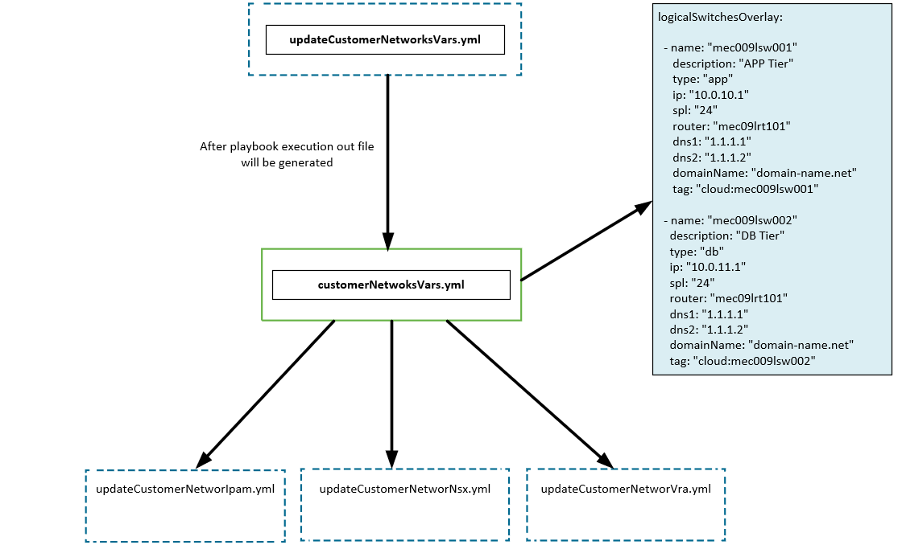

# Customer Networks

# Changelog

| Version | Date | Author | Changes |
|---------|------|------|---------|
| 0.1 | 01/04/2020 | Michal Pindych | Document creation |
| 0.2 | 02/04/2020 | Michal Pindych | Document review and update |

## Introduction

### Purpose

Create customer networks as second-day operation activities.

### Audience

- VCS Operations

### Scope

This document covers the following tasks:

- preparing input file with customers networks for automation
- propagate customer networks to IPAM
- propane customer networks to NSX-T
- propagate customer networks to vRA

# Customer networks introduction

All configuration related to addition and modification customers networks should be executed after initial deploy as a part of second-day activities. The scope of this document is to describe dedicated playbooks and way of using them in order to propagate customers networks information to the below components:

- IPAM
- NSX-T
- vRA Cloud



Diagram explanation :

- *customerNetworksVars.yml* -  file with all customer networks and related attributes
- *updateCustomerNetworksVars.yml* - playbook generates a dedicated file with all customer networks
- *updateCustomerNetworksIpam.yml* - propagation  of information from the dedicated file to IPAM  
- *updateCustomerNetworksNsx.yml* - propagation  of information from the dedicated file to NSX-T
- *updateCustomerNetworksVra.yml* - propagation  of information from the dedicated file to vRA

Customer network input file schema explanation:

**logicalSwitchesOverlay**

- **description:**  The object which stores all customer network information

**name:**

- **description:**  Name of customer logical switch following convention name
- **propagation to:**  IPAM, NSX-T

**description:**

- **description:**   Description of logical switch
- **propagation to:**  IPAM, NSX-T  

**type:**

- **description:**   This field provides a mapping between a given logical switch and the network profile
- **propagation to:**  vRA  

**ip:**

- **description:**  Default gateway for a specific customer network
- **propagation to:**  IPAM

**spl:**

- **description:**   Network mask for a specific customer network
- **propagation to:**  IPAM

**router:**

- **description:**   Definition of Tier-1 NSX-T router to which logical switch is connected
- **propagation to:**:  NSX-T

**dns1:**

- **description:**   DNS server IP which should be forwarded to provisioned Virtual Machine
- **propagation to:**:  IPAM

**dns2:**

- **description:**   DNS server IP which should be forwarded to provisioned Virtual Machine
- **propagation to:**:  IPAM

**domainName:**

- **description:** :  Specific domain name correlated to the customer network
- **propagation to:**  IPAM

**tag:**

- **description:**   Tag correlated with a specific network, this value should reflect "name" field
- **propagation to:**:  vRA

Main assumption: At this moment there is one-to-one binding between network profile and customer logical switch, in order to specify “network-profile”,
we are using the "type" field. In the future this design will be changed, all customer networks will be placed under one “network-profile” and the additional
tag will be added, please refer to the diagram below:

# Customer networks creation process

In order to execute any below ansible playbooks at first You need to provide an active directory user for a specific environment, please refer to example:

```shell
next@mec09ans002:/opt/dhc/manage$ ansible-playbook updateCustomerNetworksIpam.yml
Enter domain username: a559772@nx5dhc.next
Enter the password for the user domian. Please note that the password you enter will not be displayed on the screen.
Password:
```

## IPAM

Please execute the related playbook:  updateCustomerNetworkIpam.ym  
**Expected results:**

## NSX-T

Please execute the related playbook:  updateCustomerNetworkNsx.yml  
**Expected results:**

## vRA

Please execute the related playbook:  updateCustomerNetworkVra  
**Expected results:**
