# Implementation of Customer Self-Managed Encryption Keys (BYOK)

- [Implementation of Customer Self-Managed Encryption Keys (BYOK)](#implementation-of-customer-self-managed-encryption-keys-byok)
  - [Changelog](#changelog)
  - [Introduction](#introduction)
    - [Purpose](#purpose)
    - [Audience](#audience)
  - [Scope](#scope)
  - [Related Documents](#related-documents)
  - [Prerequisites](#prerequisites)
    - [Customer Responsibilities](#customer-responsibilities)
    - [VCS Platform Prerequisites](#vcs-platform-prerequisites)
  - [Network Requirements](#network-requirements)
  - [Certificates and Credentials](#certificates-and-credentials)
  - [RBAC Configuration](#rbac-configuration)
  - [Procedure](#procedure)
    - [Register External KMS in vCenter](#register-external-kms-in-vcenter)
    - [Establish Trust with External KMS](#establish-trust-with-external-kms)
    - [Enable vSAN Data-At-Rest Encryption](#enable-vsan-data-at-rest-encryption)
    - [Validation and Verification](#validation-and-verification)
    - [Generate New Encryption Keys (Key Rotation)](#generate-new-encryption-keys-key-rotation)

## Changelog

| Version | Date | Description | Author |
|--------|------|-------------|--------|
| 0.1 | 2025-12-30 | Initial draft | Mihai Radan |
| 0.2 | 2026-01-14 | Initial draft review and updates | Tomasz Korniluk |

## Introduction

### Purpose

This Work Instruction provides **manual, step-by-step procedures** to onboard
and configure **Customer Self-Managed Encryption Keys (BYOK)** in VMware Cloud
Services (VCS) using a customer-hosted external Key Management Server (KMS).

The document translates the BYOK Low Level Design into **operational steps**
required to establish trust, configure encryption, and validate the setup.

### Audience

This document is intended for **VCS Operations, DevSecOps, and Platform
Engineering teams** responsible for implementing and validating BYOK.

## Scope

This WI covers:

- Manual onboarding of external KMS in vCenter
- Trust establishment using customer-provided certificates
- RBAC configuration in vCenter
- Network prerequisites
- Enabling vSAN Data-At-Rest Encryption (DARE)
- Validation and verification steps
- Generate New Encryption Keys (Key Rotation)

This WI does not cover:

- Customer-side KMS deployment or configuration
- Automation

## Related Documents

| Document |
|---------|
| [BYOK Low Level Design](../design/lldCustomerSelfManagedEncryptionKeys.md) |

## Prerequisites

### Customer Responsibilities

The customer must:

- Provide a supported external KMS (VMware Compatibility Guide)
- Provide KMS endpoint details (FQDN/IP, port)
- Provide TLS certificate, private key, and CA chain
- Ensure KMS availability and backup

### VCS Platform Prerequisites

- Supported vCenter and ESXi versions
- vSAN cluster meeting minimum sizing requirements
- TPM enabled on ESXi hosts (recommended)
- Network connectivity to external KMS
- Implemented RBAC to managed compute vCenter KMS settings

## Network Requirements

- TCP port 5696 between vCenter / ESXi hosts and external KMS
- TLS-encrypted communication

## Certificates and Credentials

Customer provides KMIP server credentials (certificate and private key)
used for mutual TLS authentication during trust establishment.

- KMS must use RSA-based TLS certificates
- ECDSA certificates are not supported

Credentials (Certificate and private key) are stored securely within the VCS platform (e.g. secure vault).

## RBAC Configuration

Securing workloads does not end with the use of encryption technologies. Access granted to data and its management must also be properly secured.

### No Cryptography Administrator Role

The "No Cryptography" role is very similar to the normal administrator with many of the same privileges. Operations such as power on or off a virtual machine, boot, shutdown, vMotion, as well as normal vSAN management may be performed. However, this role is not allowed to perform any cryptographic operations.

## Procedure

### Implement RBAC settings

The following chapter explains the steps required to implement RBAC settings that allow the nominated VCS platform administrators to perform the KMS integration and prevents other users to manage crypthography operations and settings.

#### Create AD security group for local KMS administrators

- Log into VCS platform 1st domain controller(adc001) using domain admin user account

- Open Windows PowerShell command prompt as Administrator

- Adjust below PowerShell command to create AD security group for local KMS administrators

> `New-ADGroup -Name "rsce-gre42-kms-l-admins" -GroupScope DomainLocal -GroupCategory Security -Path "OU=ResourceGroups,OU=Groups,OU=DHC,DC=nx4dhc01,DC=next" -Description "Security group for KMS administrators"`

**Note:** Make sure to provide correct AD security group name as follows `rsce-<VcsSiteCode>-kms-l-admins` and Path `OU=ResourceGroups,OU=Groups,OU=DHC,DC=<VCSSiteDomainPrefix>,DC=<VCSSiteDomainSuffix>`

- Execute above Powershell command to create new AD security group

- Validate if group was created, run PowerShell command: `Get-ADGroup -Identity "rsce-<VcsSiteCode>-kms-l-admins"`

Expected output:

> DistinguishedName : CN=rsce-gre42-kms-l-admins,OU=ResourceGroups,OU=Groups,OU=DHC,DC=nx4dhc01,DC=next
> GroupCategory     : Security
> GroupScope        : DomainLocal
> Name              : rsce-gre42-kms-l-admins
> ObjectClass       : group

#### Create AD security group to manage KMS operation tasks

- Log into VCS platform 1st domain controller (adc001) using domain admin user account

- Open Windows PowerShell command prompt as Administrator

- Adjust below PowerShell command to create AD security group for local KMS operation team
  
> `New-ADGroup -Name "rsce-gre42-kms-l-operators" -GroupScope DomainLocal -GroupCategory Security -Path "OU=ResourceGroups,OU=Groups,OU=DHC,DC=nx4dhc01,DC=next" -Description "Security group for KMS operation team"`

**Note:** Make sure to provide correct AD security group name as follows `rsce-<VcsSiteCode>-kms-l-operators` and Path `OU=ResourceGroups,OU=Groups,OU=DHC,DC=<VCSSiteDomainPrefix>,DC=<VCSSiteDomainSuffix>`

- Execute above Powershell command to create new AD security group

- Validate if group was created, run PowerShell command: `Get-ADGroup -Identity "rsce-<VcsSiteCode>-kms-l-operators"`

Expected output:

> DistinguishedName : CN=rsce-gre42-kms-l-operators,OU=ResourceGroups,OU=Groups,OU=DHC,DC=nx4dhc01,DC=next
> GroupCategory     : Security
> GroupScope        : DomainLocal
> Name              : rsce-gre42-kms-l-operators
> ObjectClass       : group

#### Implement RBAC settings in vCenter using PowerCLI (optional)

To implement mandatory RBAC settings inside compute vCenter select scripted implementation or manual.

- Log into VCS 1st Terminal Server(tss001) using domain user account
- Open Windows PowerShell command prompt as Administrator

**Execute below commands with order**

**Step 1. Connect into compute vCenter using vSphere SSO administrator account**

> `Connect-VIServer -Server "<VCsSiteCode>vcs002.<VCsSiteDomain>" -user administrator@vsphere.local`

**Example: `Connect-VIServer -Server "gre42vcs002.nx4dhc01.next" -user administrator@vsphere.local`**

**Step 2. Define variables AD group name and vCente role name**

> `$adGroup     = "<VCsSiteDomain>\\rsce-<VCsSiteCode>-vcs-l-admins"`

**Example: `$adGroup     = "nx4dhc01.next\\rsce-gre42-vcs-l-admins"`**

**Step 3. Define compute vCenter Datacenter folder**

> $root = Get-Folder -Name "Datacenters"

**Step 4. Execute final PowerCLI command to apply vCenter role**

> `New-VIPermission -Entity $root -Principal $adGroup -Role $roleName -Propagate:$true`

**Step 5. Validate if new role has been applied for AD group**

> `Get-VIPermission -Entity $root | Where-Object { $_.Role -eq "NoCryptoAdmin" } | ft -auto`

**Expected output**

|Role|Principal|Propagate|IsGroup|
|----|---------|---------| -------|
|NoCryptoAdmin| NX4DHC01\rsce-gre42-vcs-l-admins| True|True|

#### Manual Implementation of RBAC settings in vCenter

Step 1. Prevent crypthography operations for infrastructure administrators

- Log in to compute vCenter Server using vSphere SSO
- Navigate to **Inventory >> compute vCenter**
- Switch into tab `Permissions`
- Lookup for the AD group `rsce-<VcsSiteCode>-vcs-l-admins`
- Select group and click `edit` to change the role
- Change role from `Administrator` into `No crypthography administrator`
- Click `Save`

Step 2. Allow admin crypthography operations for dedicated KMS administrators

- Log in to compute vCenter Server using vSphere SSO
- Navigate to **Inventory >> compute vCenter**
- Switch into tab `Permissions`
- Lookup for the AD group `rsce-<VcsSiteCode>-kms-l-admins`
- Select group and click `edit` to apply vCenter role `Administrator`
- Click `Save`

Step 3. Allow crypthography operations for operation team

- Log in to compute vCenter Server using vSphere SSO
- Navigate to **Inventory >> compute vCenter**
- Switch into tab `Permissions`
- Lookup for the AD group `rsce-<VcsSiteCode>-kms-l-operators`
- Select group and click `edit` to apply vCenter role `VMOperator Controller Manager`
- Click `Save`

### Register External KMS in vCenter

- Log in to vCenter Server.
- Navigate to **Hosts and Clusters** and select the vCenter associated with the customer workload (e.g. `vcs002`).
- Navigate to **Configure > Key Providers**.

  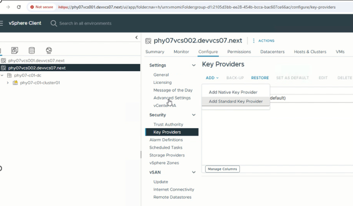

- Click **Add > Add Standard Key Provider**.
- Enter the KMS endpoint details (FQDN and port `5696`).

  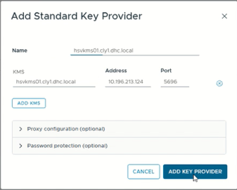

- Click **ADD KEY PROVIDER**.
- A pop-up window displaying the KMS certificate details will appear. Review the certificate information and click **TRUST** to proceed.

  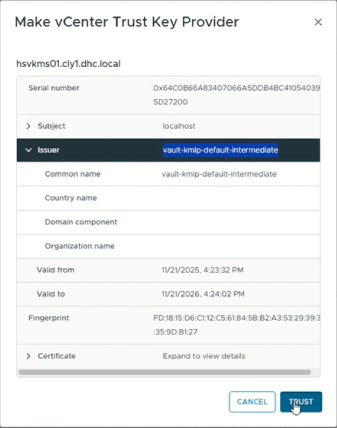

- The KMS is now visible in the Key Providers list. At this stage, the key provider is registered but trust establishment is not yet complete.

  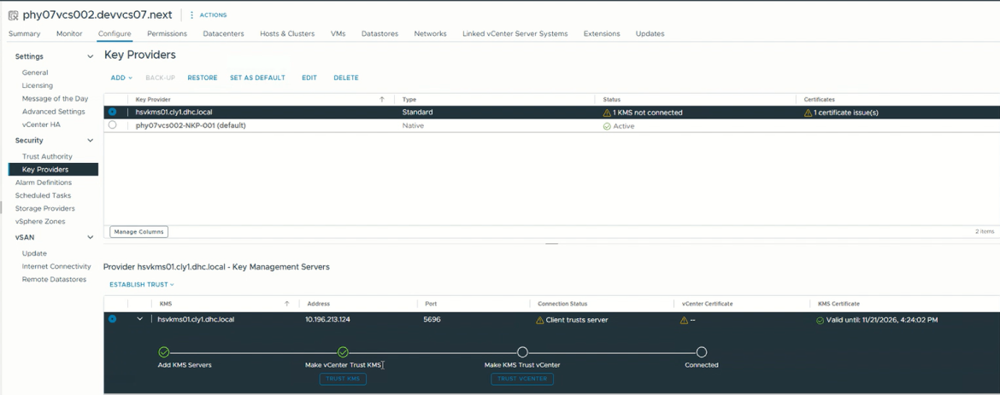

### Establish Trust with External KMS

- Select the newly added KMS from the Key Providers list.
- Click **ESTABLISH TRUST** and select **Make KMS trust vCenter**.

  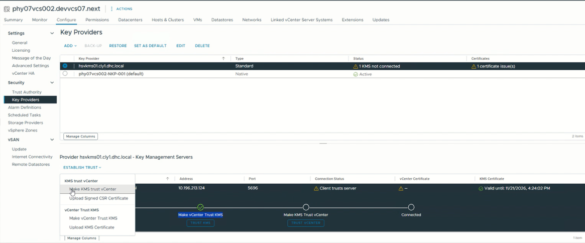

- In the opened window, select the method **KMS certificate and private key**, then click **NEXT**.

  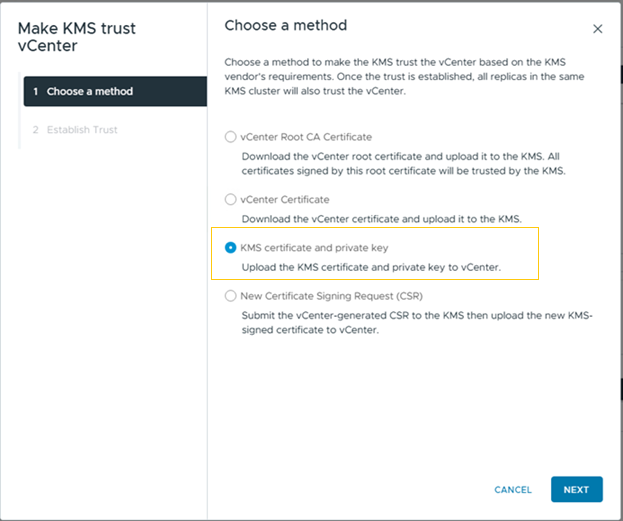

- Provide the received KMIP certificate and its corresponding private key, then click **ESTABLISH TRUST**.

  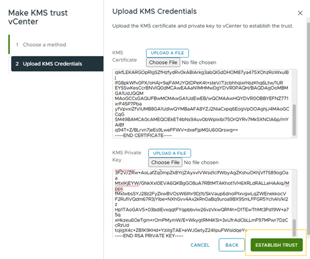

- Verify that the trust status is successfully established and displayed as connected in the Key Providers list.

  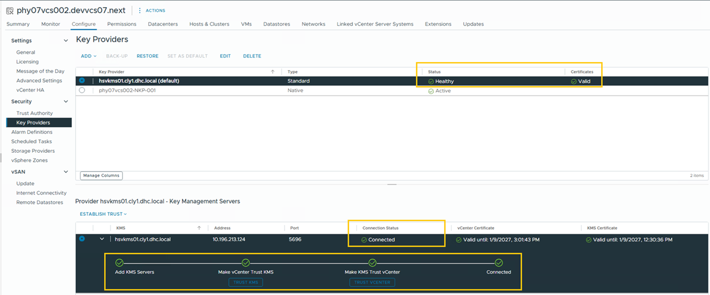

- Set KMS newly added server as default

  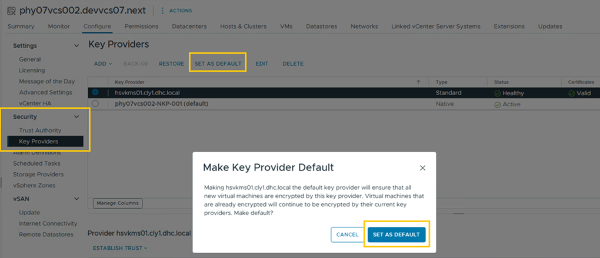

- Verify that default KMS server is showing correctly

  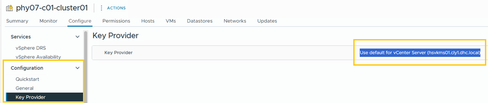

### Enable vSAN Data-At-Rest Encryption

- Select the target vSAN cluster from **Hosts and Clusters**.
- Navigate to **Configure > vSAN > Services** and, under **Data Services**, click **EDIT**.

  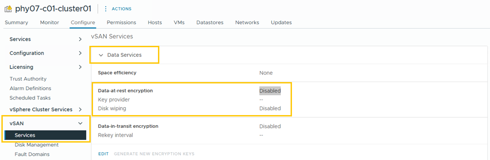

- In the opened window, under **Encryption**, enable **Data-At-Rest encryption**.
  From **Key provider**, select the configured external KMS and click **APPLY**.

  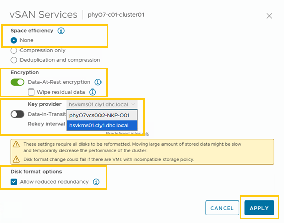

- The encryption process will start and can be monitored in **Recent Tasks**.

  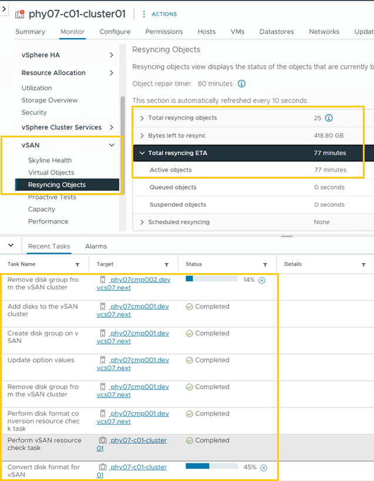

> **Note:**  
> Every time vSAN Data-at-Rest Encryption is enabled or disabled, each disk group
> in the vSAN cluster undergoes a Disk Format Change (DFC), which may impact
> performance. For this reason, encryption services SHOULD be configured prior
> to placing the cluster into production.

### Validation and Verification

- Once all tasks are completed, confirm the vSAN encryption state:
  - Navigate to **Configure > vSAN > Services**
  - Verify that **Data-at-rest encryption** is enabled
  - Confirm that **Key Provider** is set to the external KMS

  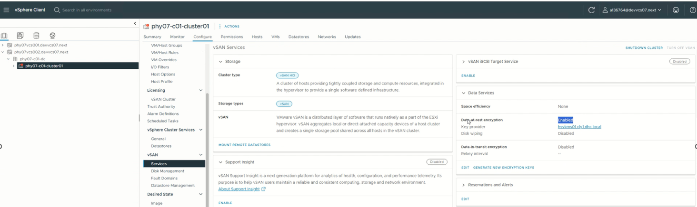

- Verify ESXi host encryption status:
  - SSH into each ESXi host that is part of the cluster
  - Execute the following commands:

  ```bash
  esxcli vsan encryption info get
  esxcli vsan encryption kms list
  ```
  
  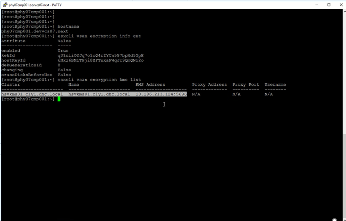

### Generate New Encryption Keys (Key Rotation)

Key generation and rotation are performed by the **external customer-hosted KMS**.
From the VCS platform perspective, vCenter triggers key lifecycle operations via
KMIP, while actual key material is created and managed by the customer.

#### Initiate Key Rotation

- Navigate to the target vSAN cluster in **Hosts and Clusters**.
- Go to **Configure > vSAN > Services**.
- Under **Data Services**, verify that **Data-At-Rest encryption** is enabled and the **Key Provider** is set to the external KMS.
- Click **GENERATE NEW ENCRYPTION KEYS** to initiate key rotation.

  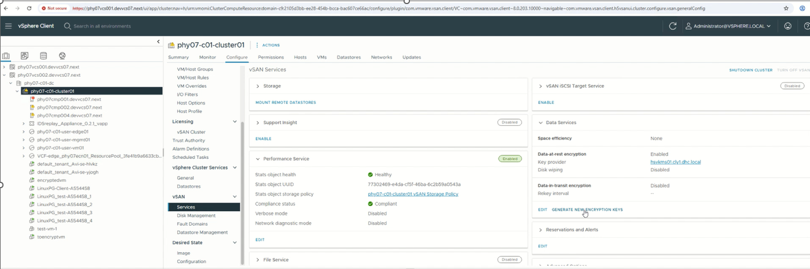

- In the opened window click **GENERATE**

  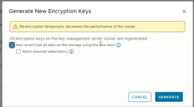
  
- During this process:
  - Existing encrypted data remains accessible
  - VM operations continue without downtime
  - Temporary performance impact may be observed during background
    re-encryption activity

> **Note:**  
> Similar to initial encryption enablement, each disk group in the vSAN cluster
> undergoes a Disk Format Change (DFC), which may impact performance. For this
> reason, key rotation SHOULD be performed during a scheduled maintenance
> window.

#### Validation After Key Rotation

- Confirm successful completion of the rekey task in **Recent Tasks**.
  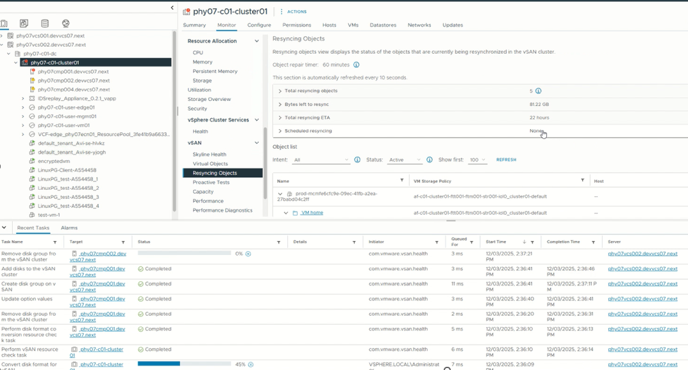

- Revalidate the encryption state by following the steps described in [Validation and Verification](#validation-and-verification).
