# Declustering vIDM

# Changelog

| Version | Date       | Description              | Author          |
| ------- | ---------- | ------------------------ | --------------- |
| 0.1     | 27/10/2023 | Initial version          | Jakub Zielinski |

## Introduction

### Purpose

Replace the existing, clustered VMware Identity Manager instance with a one-node installation.

### Audience

- VCS Operations

### Scope

- Adjust VCS Variables
- Deploy standalone vIDM

# Prerequisites

- The version of the vRealize Suite Lifecycle Manager must be 8.12 or later in order for it to be able to handle VMware Identity Manager 3.3.7.
- Make sure you have the correct local administrative credentials of NSX-T, vROps, vRLI, vRNI and VMware Aria Automation.
- Check if the Identity Manager 3.3.7 installation bundle is available in vRSLCM:
  - go to the `Lifecycle Operations` > `Settings` > `Binary Mapping` and check if it's visible there:
    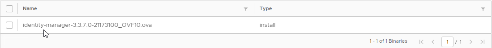
  - if not, download it from VMware: in the `Binary Mapping` section click `Add binaries` > `My VMware` > `Discover` > select `IDM 3.3.7 install bundle` and click `Add`. Wait for the request to finish successfully and re-check if the bundle is visible.
  - if the download from My VMware fails due to the configured account not having proper entitlements, as an alternative you can download the install bundle manually (file name: `identity-manager-3.3.7.0-21173100_OVF10.ova`), upload it to the */data* folder on vRSLCM appliance VM using e.g. WinSCP.
  Then go to `Lifecycle Operations` > `Settings` > `Binary Mapping`, click `Add Binaries` and location type:  `Local`. In `Base Location` enter */data*, click `Discover`, select the  bundle and click ADD button. Wait for mapping request to finish, verify the bundle is visible and delete it from */data* folder.

## Initial Setup

From this point on, the existing vIDM instance will no longer be available, therefore it is important to log in to the vIDM appliance admin GUI and document any possible customizations that may have been implemented. Review the configuration of IDM and take screenshots of any possible customizations that are not part of the original deployment. You as the administrator should know best if any were performed. An example of such settings that may have been adjusted would be:

- sync frequency
- mapped attributes
- group DNs that we want to sync to the directory
- user DNs
- RBAC

Additionally, it is of the utmost importance to gather information about role assignments from vRA as those will have to be reassigned manually from scratch at the end of this work instruction. In order to do so log in to vra and go to `Identity & Access Management` -> `Enterprise Groups` and note the assignment. Additionally review and note `Organization Roles` and `Service Roles` assigned to `Active Users`.

## Replacing the IDM deployment

- Log in locally with vcfadmin@local credentials to vRealize Suite Lifecycle Manager server.
- Go to Lifecycle Operations -> Environments
- Click on vRA environment -> Delete Environment, make sure the checkboxes for `Delete Environment from vRealize Suite Lifecycle Manager` and `Delete associated VMs from vCenter` are unchecked
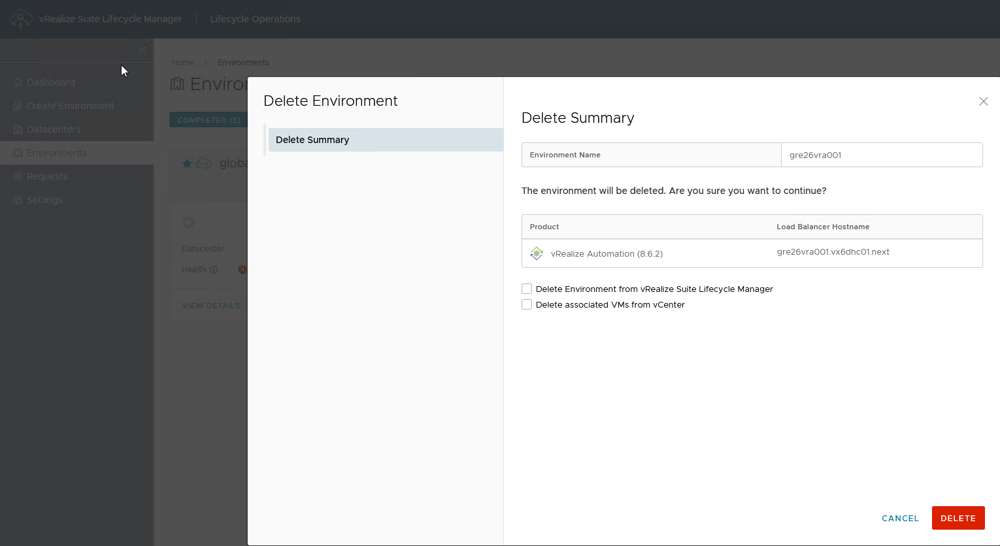
- Click on globalenvironment -> Delete Environment
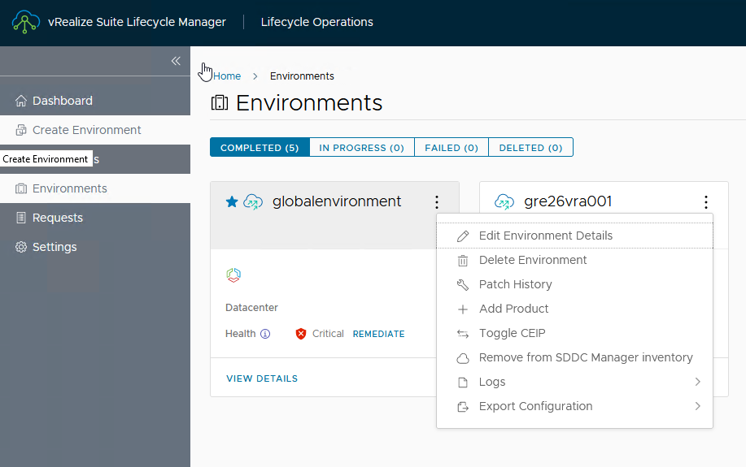
- Make sure the checkbox Delete Environment from vRealize Suite Lifecycle Manager is checked, then click DELETE
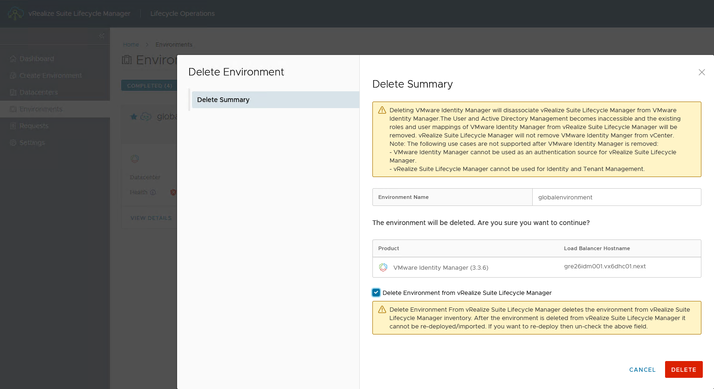
- Go to vRealize Suite Lifecycle Manager -> Locker
- Locate the idm certificate and click on 3 dots, then click delete
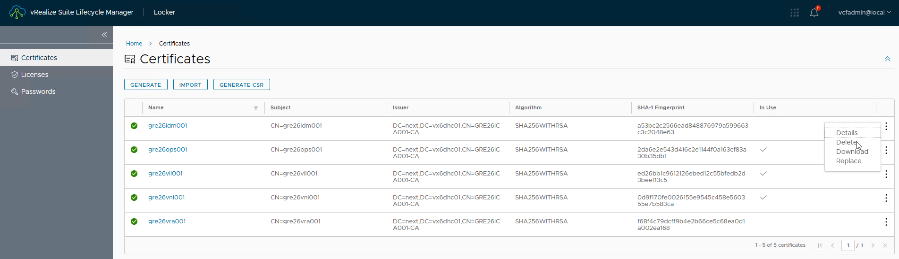
- Log in to vCenter, locate the 3 nodes of idm and power them off
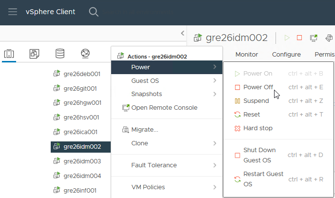
- after the VMs have been powered off delete them from disk
- Log in locally to NSX-T with admin credentials
- Go to NSX-T -> Security -> Distributed Firewall
- Expand IDM and delete rule IdmToLb
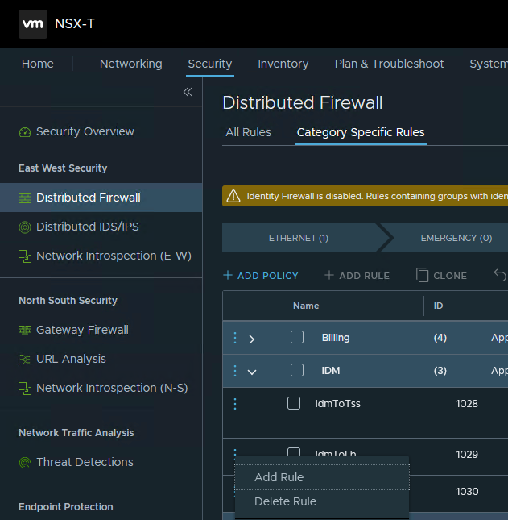
- Delete rule LbToIdm as well
- Click PUBLISH
- Go to Networking -> Load Balancing -> Virtual Servers
- Delete wsa-http-redirect and wsa-https
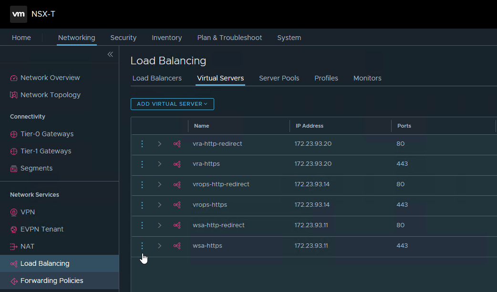
- Go to Networking -> Load Balancing -> Server Pools
- Delete wsa-server-pool
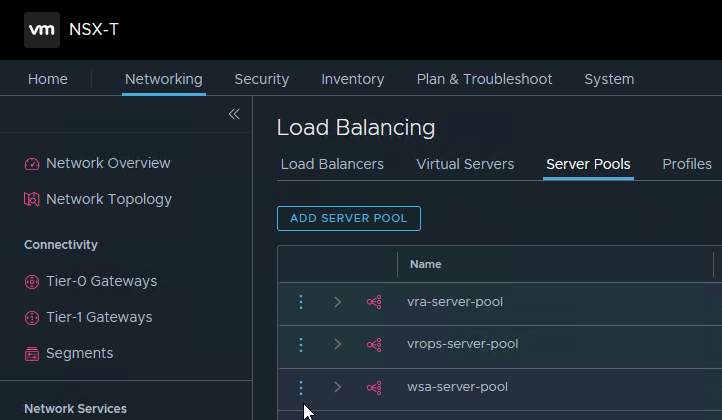
- Go to Networking -> Load Balancing -> Profiles
- Delete wsa-http-app-profile and wsa-http-profile-redirect
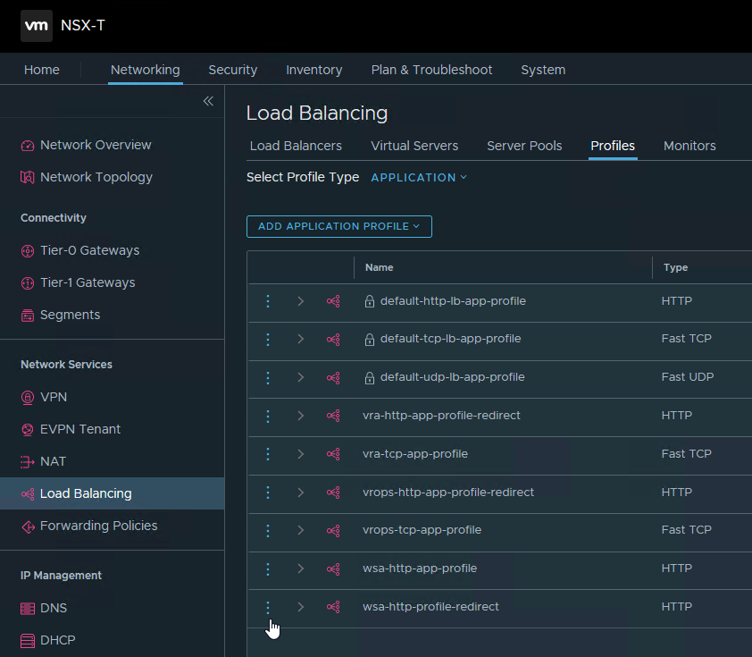
- Go to Networking -> Load Balancing -> Monitors
- Delete wsa-https-monitor monitor
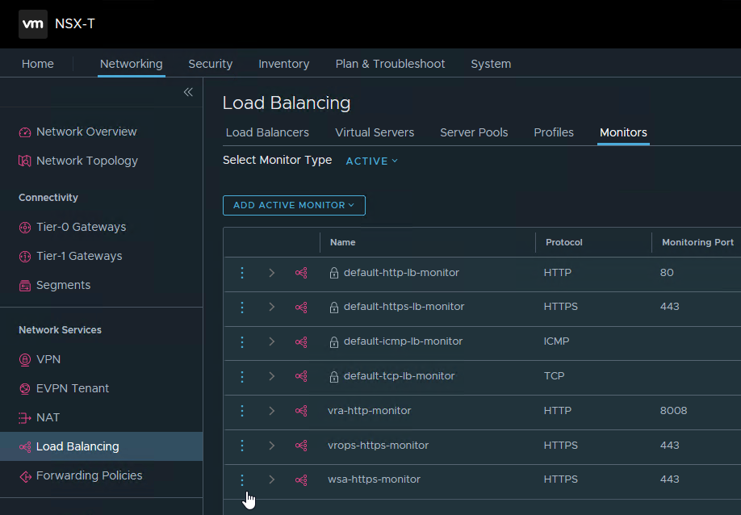
- On TSS server go to Active Directory Users and Computers (dsa.msc)
- Locate IDM002, IDM003 and IDM004 accounts and delete them.
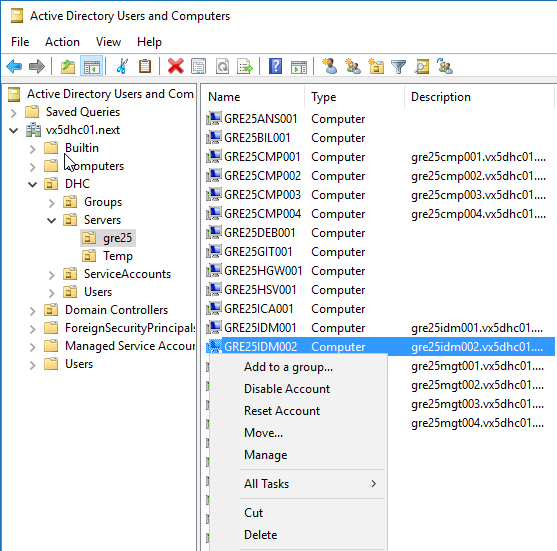
- On TSS server run the DNS snap-in (dnsmgmt.msc) and connect to the DNS server in your domain
- Go to Forward Lookup Zones -> your domain and locate records for idm002, idm003 and idm004. Delete them, keeping only the record for idm001.
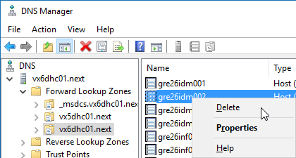
- Log in to LCM server and run the following commands:

  ```bash
  arp -a
  arp -d <ip of idm>
  ```

- Log in to ans001 and run the following playbook in `\opt\dhc\update\`:

  ```bash
  ansible-playbook createVidmStandalone.yml
  ```

- Log in to LCM with vcfadmin@local credentials and go to Lifecycle Operations -> Requests and click on the in progress button to monitor the request status
- Remove idm002, idm003 and idm004 entries from /opt/dhc/manage/hosts

  ```txt
  [idm]
  idm001  ansible_host=gre21idm001.vx1dhc01.next
  idm002  ansible_host=gre21idm002.vx1dhc01.next <- remove this entry
  idm003  ansible_host=gre21idm003.vx1dhc01.next <- remove this entry
  idm004  ansible_host=gre21idm004.vx1dhc01.next <- remove this entry
  ```

- Log in to IDM001 as `admin` go to `Identity & Access Management` -> setup -> user attributes and uncheck e-mail as it should not be required
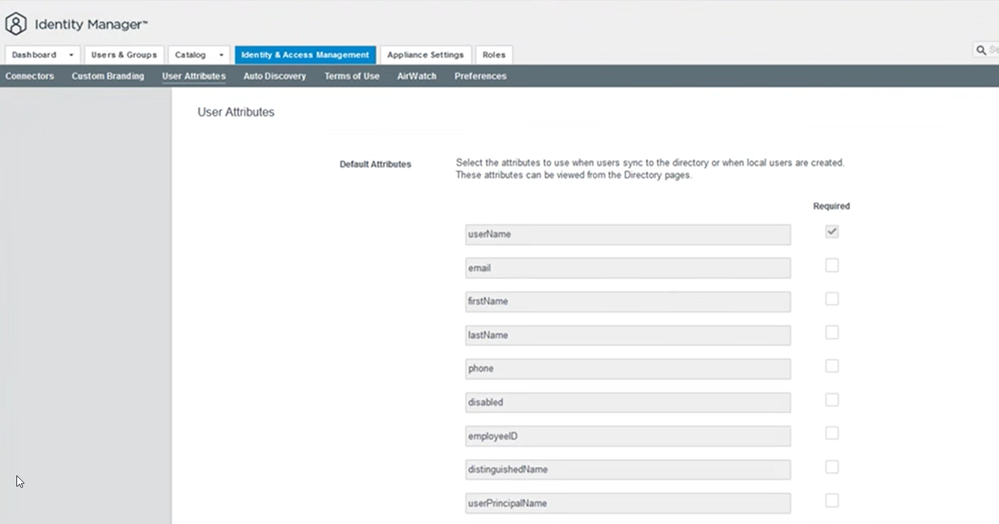
- go to `Identity & Access Management` > `Setup` and join IDM to Active Directory.
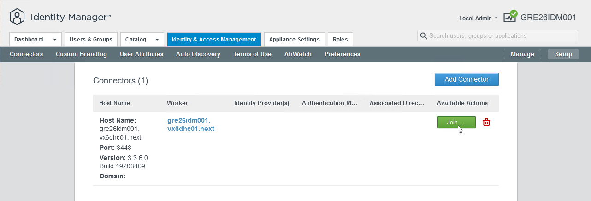
- `OU of domain to join` depends on your environment, here we selected `OU=gre26,OU=Servers,OU=DHC,DC=vx6dhc01,DC=next` as this is the OU for our computer accounts in the Active Directory domain.
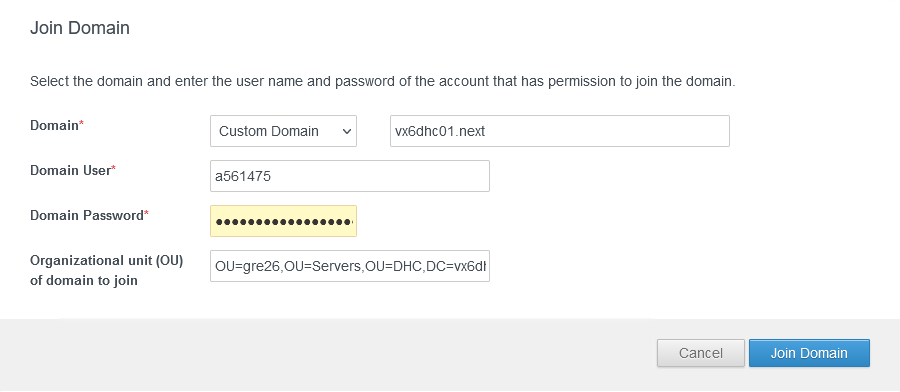
- Next, we're going to configure the AD synchronization between AD and IDM:
- go to `Identity & Access Management` > `User Attributes`, uncheck the `email` attribute
- Scroll down and in `Add other attributes to use` add `canonicalName` and click `Save`.
- go to `Identity & Access Management` > `Directories` and select `Add Directory` > `Add Active Directory over LDAP/IWA`
- configure the settings as following:
  - Directory Name: `Management domain's FQDN`
  - `Active Directory (Integrated Windows Authentication)` selected
  - Sync Connector: `{{ locationCode }}idm001`
  - Authentication: `Yes`
  - Directory Search Attribute: `sAMAccountName`
  - Domain Name: `Management domain's FQDN`
  - Domain Admin Username and password for `svc-{{ location Code }}-ans01`
  - Bind User Name and password for `svc-{{ location Code }}-ans01`
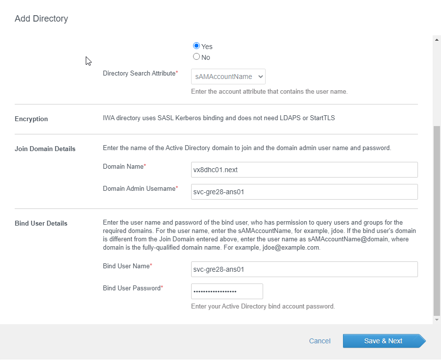
- Click `Next` on the `Select the Domains` page:
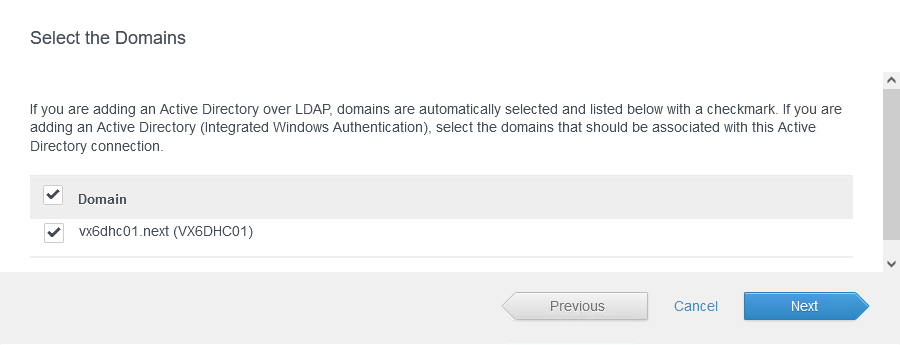
- On the `Map User Attributes` page make sure that only `userName`, `firstName`, `lastName` attributes are selected. Make sure `canonicalName` matches in both columns and click `Next`.
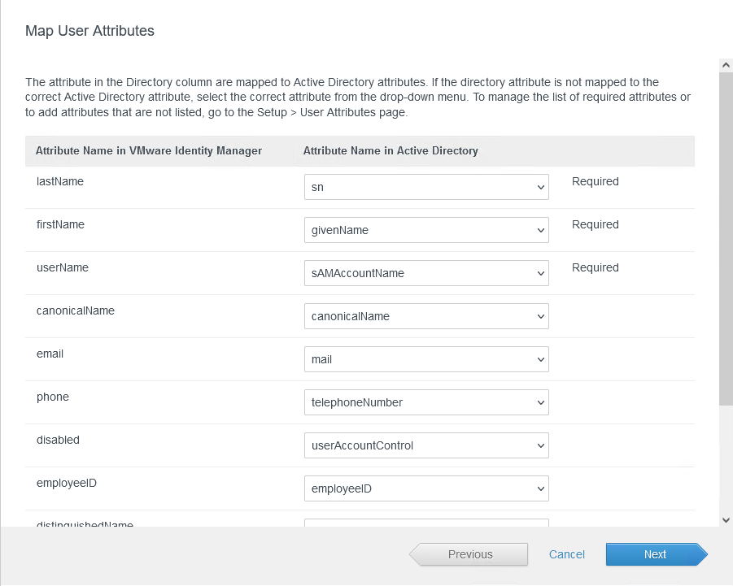
- On the `Select the groups (users) you want to sync` page, specify the location (written in the distinguished name format) from which all the groups should be pulled and synced later on. You can sync all of them or select only some of them.
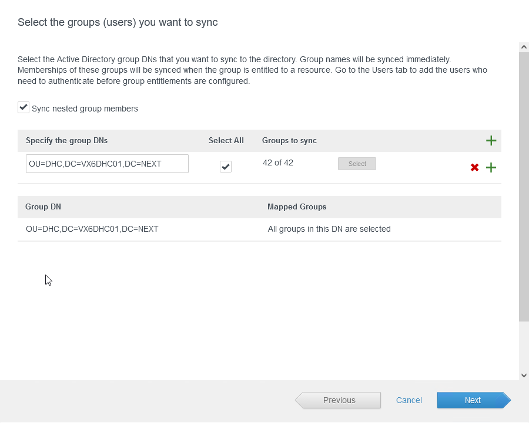
- On the `Select the Users you want to sync` page you can list aditional user or group DNs to be synced as well. By default leave it blank.
- Click `Sync Directories` and wait for the process to finish. You can also go to `Identity & Access Management` > `Manage` > `Directories`, click `Sync Now` and review the sync log to verify.

## Configure vRealize Operations Manager Authentication Source

- In vROps go to `Administration` > `Authentication Sources`. Select the existing idm001 authentication source, click three dots and then `Edit`

   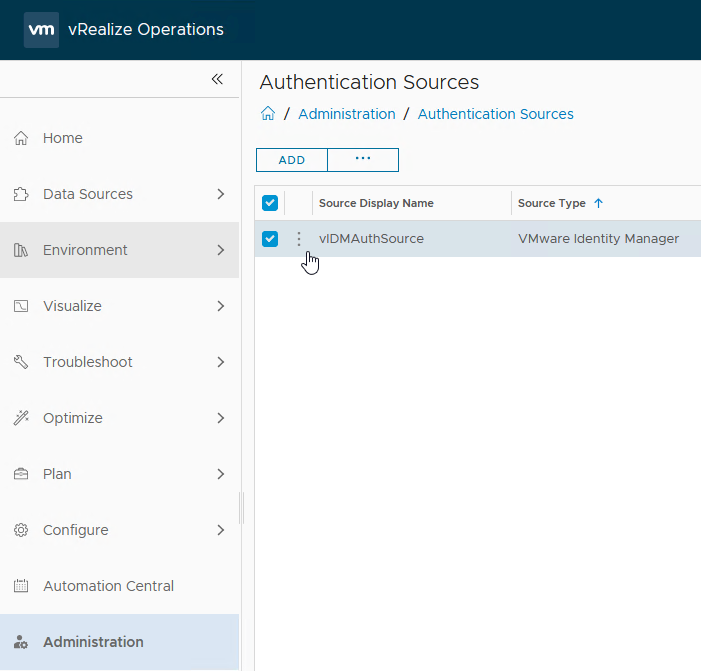

- Provide IDM admin credentials. Click `Test` and accept the certificate. Click OK to save the changes.

   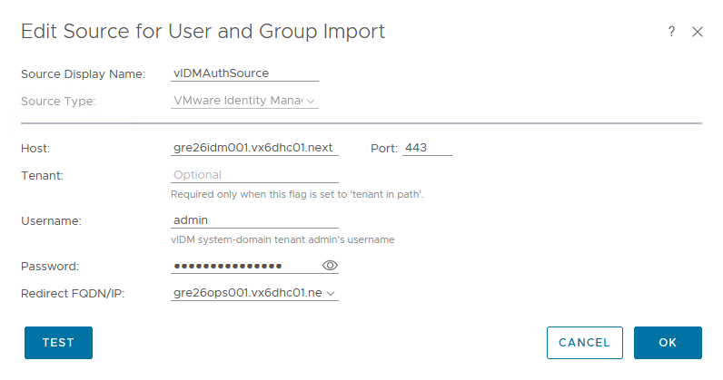

## Configure NSX-T Authentication Sources

- Log in to vRSLCM as *vcfadmin@local* and go to `Locker` > `Certificates` and select idm001 certificate. Copy the SHA256 value to Notepad for later use.

   

- Log in to IDM and click on the downward arrow next to the `Catalog button` > `Settings` > `Remote App Access` and click the `Create Client` button:

   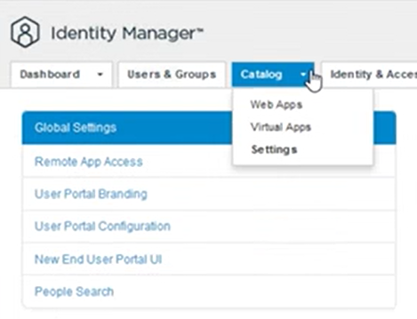

  - Access Type: `Service Client Token`
  - Client ID: `{{ locationCode }}nsx001`
  - `Advanced` > Click on `Generate Shared Secret` and save the generated string for later use
  - leave remaining options at default
  - click `Add`.

   

- Log in to nsx001 as admin and go to `System` > `Settings` > `User Management` > `VMware Identity Manager` > `Edit`

   

  - VMware Identity Manager: `Enabled`
  - VMware Identity Manager Appliance: `{{ locationCode }}idm001.FQDN-of-management-domain`
  - OAuth Client ID: `{{ locationCode }}nsx001`
  - OAuth Client Secret: `Shared Secret generated in IDM`
  - SSL Thumbprint: SHA256 value of the `{{ locationCode }}idm001` certificate, copied from vRSLCM Locker.
  - `Save`.

   

VMware Identity Manager's connection status should show up as `Up` and VMware Identity Manager's Integration as `Enabled`.


**Repeat those steps for NSX002 starting with generating a token in IDM for name Client ID NSX002**

## Configure vRealize Log Insight Authentication Sources

Log in to Log Insight as admin, go to `Administration` > `Configuration` > `Authentication` > `VMware Identity Manager` tab and configure as following:

- Enable Single Sign-On: `No`
- Click SAVE button
- Enable Single Sign-On: `Yes`
- Host: `{{ locationCode }}idm001.FQDN-of-management-domain`
- API port: `443`
- Username: `admin` (local IDM account with administrative privileges)
- Password `password for the admin user`
- Redirect URL Host: `{{ locationCode }}vli001.FQDN-of-management-domain`
- click `Test connection` and accept the certificate. Test should be successful.
- Click SAVE button
- Status should show up as `CONNECTED`

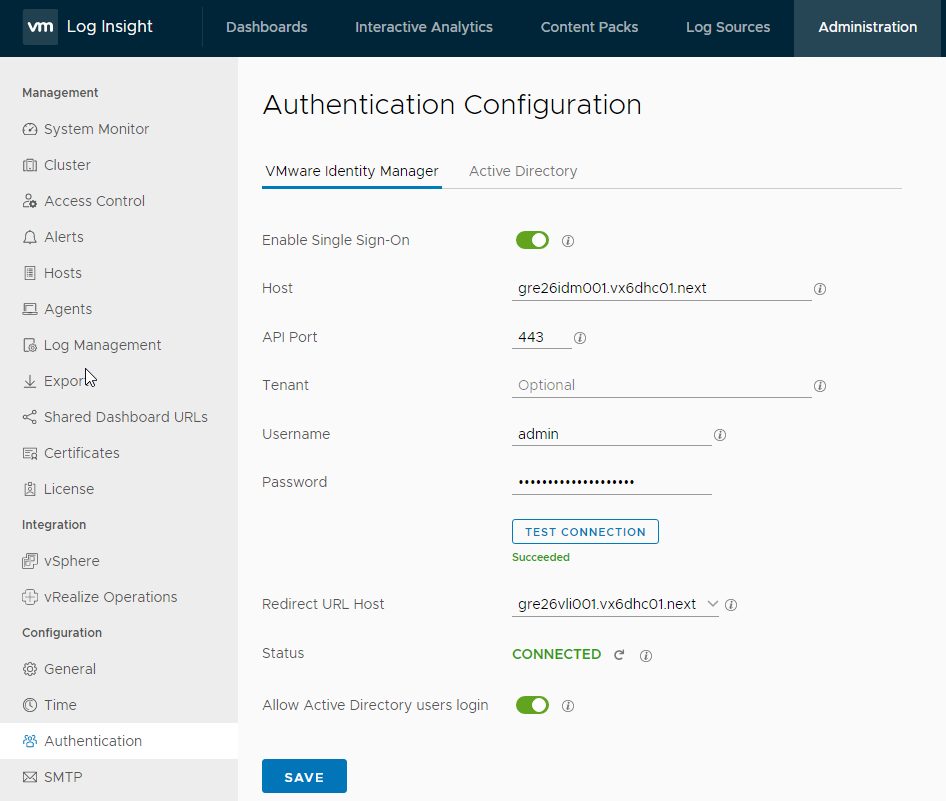

## Configure vRealize Network Insight Authentication Sources

Log in to IDM and click on the downward arrow next to the `Catalog button` > `Settings` > `Remote App Access` and click the `Create Client` button:


- Access Type: `Service Client Token`
- Client ID: `vrlcm-vrni-oauthclient`
- `Advanced` > Click on `Generate Shared Secret` and save the generated string for later use
- leave remaining options at default
- click `Add`.

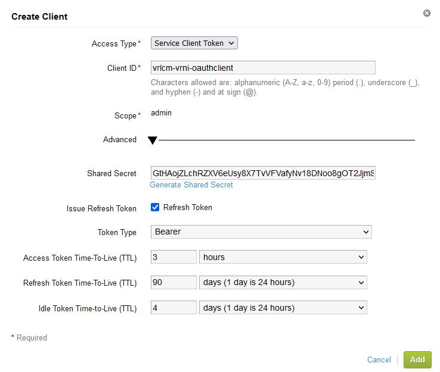

Log in as admin to vRNI. Go to  `Settings` > `Identity and Access Management` > `VMware Identity Manager` > `Edit` and configure as following:

- OAuth Client ID: `vrlcm-vrni-oauthclient`
- OAuth Client Secret: `generated shared secret`
- SHA256 Thumbprint: SHA256 value of the `{{ locationCode }}idm001` certificate, copied from vRSLCM Locker
- `Submit`


## Configure VMware Aria Automation

- SSH to one of the VMware Aria Automation nodes with root.
- Find the SHA256 thumbprint of the current vIDM appliance certificate with the following command (where [vIDM_FQDN] is the FQDN of your vIDM instance):

  ```bash
  echo | openssl s_client -connect [vIDM_FQDN]:443 2>/dev/null | openssl x509 -fingerprint -sha256 -noout | awk -F'=' '{print $2}' | tr -d ':' | awk '{print tolower($0)}'
  ```

- Create a temporary file that contains the IDM administrator password (easiest way to avoid having to escape special characters):

  ```bash
  vi /tmp/admin-password.txt
  ```

- paste the password in the vim editor then click `ESCAPE :wq` to save and quit the editor
- Update the vIDM settings (where [vIDM_FQDN] is the FQDN of your vIDM instance, [user] is the value of the user attribute from the vracli vidm command in Step 3, and [sha256_thumbprint] is the output of the command in Step 2):

  ```bash
  vracli vidm set https://[vIDM_FQDN] admin /tmp/admin-password.txt administrator -f [sha256_thumbprint]
  ```

- To apply the new settings type in the command:

  ```bash
  vracli vidm apply
  ```

- Monitor the restarting process of the identity services pods, and wait until they are running. It should take a minute:

  ```bash
  kubectl get pods -n prelude | grep identity-service
  ```

- Once the services are reported as `1/1 running` like on the below screen you may proceed.
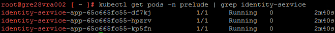
- remove the temporary file:

  ```bash
  rm /tmp/admin-password.txt
  ```

- In order to associate a new vIDM appliance with VMware Aria Automation run the following commands,

  ```bash
  /opt/scripts/vidm_recovery.py --vidm-url-new https://vIDM_FQDN
  ```

- You will be prompted that this script is not for production use. Unfortunately this is our only option, therefore type 'yes' to continue.
- Once the script finishes it is time to restart the vRA services using the following command. Be patient, it may take about 30 minutes:

  ```bash
  /opt/scripts/deploy.sh
  ```

- Once you receive the message `Prelude has been deployed successfully`, check if you can see the login page of vRA by accessing it through a web browser.
- Log in to vRealize Suite Lifecycle Manager
- Go to Lifecycle Operations -> Environments -> DELETED
- Click `RE-IMPORT` on the vRA deployment
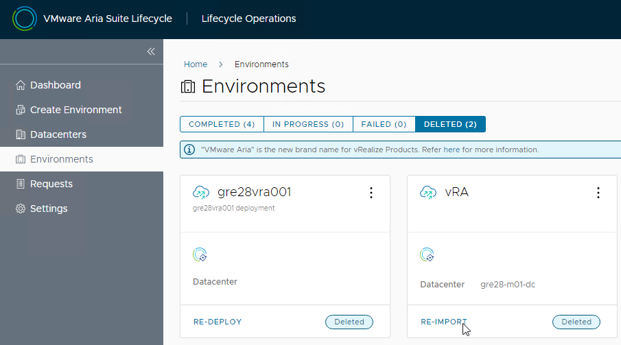
- Make sure that `Activate SDDC Manager Integration` and  `Join the VMware Customer Experience Improvement Program` are unchecked. Click `NEXT`.
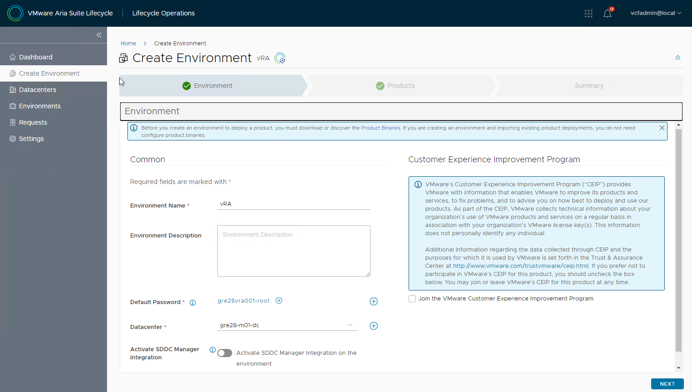
- On Import `VMware Aria Automation` screen verify the configuration and click `NEXT`.
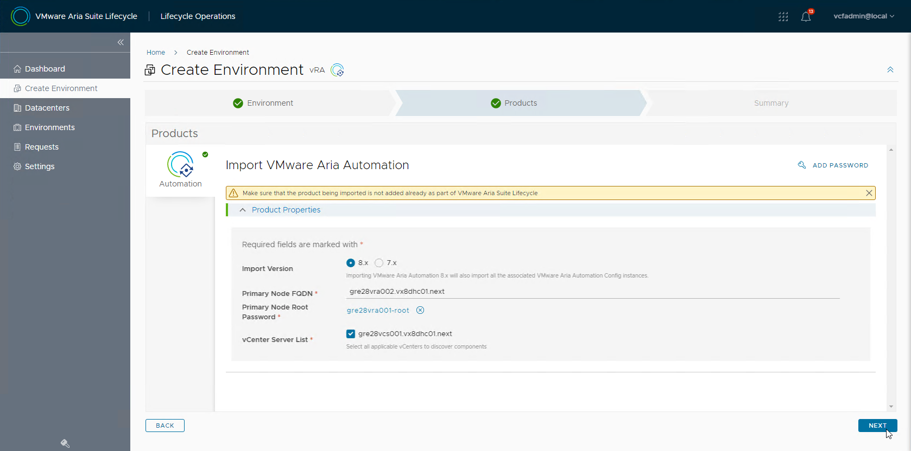
- On the `Create Environment` screen verify the product properties and click `SUBMIT`
- Monitor the request status until completion.
- Log in to a System Domain of VMware Aria Automation through a web browser with IDM administrator's credentials.
- Go to `Identity & Access Management` -> `Enterprise Groups` and click `ASSIGN ROLES`. Assign the roles to groups that you gathered during the Initial Setup of this work instruction
- Go to `Identity & Access Management` -> `Active Users` and `EDIT ROLES` of outstanding users that were not covered by the enterprise group role assignment.

## HashiVault cleanup

- Log in to HashiVault as `svc-{{ locationCode }}-ans03` account
- Go to secrets of idm002, idm003 and idm004 and `Permanently delete` each secret of those non-existing machines.
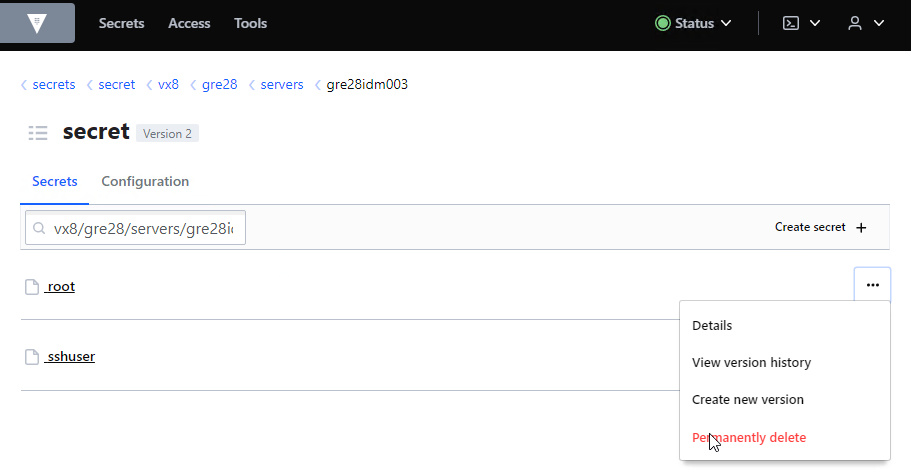

## Install vRLI agents on idm001

In order to install vRLI agents on vIDM cluster nodes, run the following playbook from the */opt/dhc/update* folder:

```bash
ansible-playbook installVrliAgentsOnVidm.yml
```

Once the playbook completes, you can verify the success of the installation by logging in to VMware Log Insight and going to Administration -> Agents.
