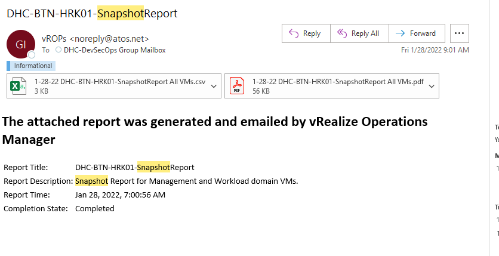
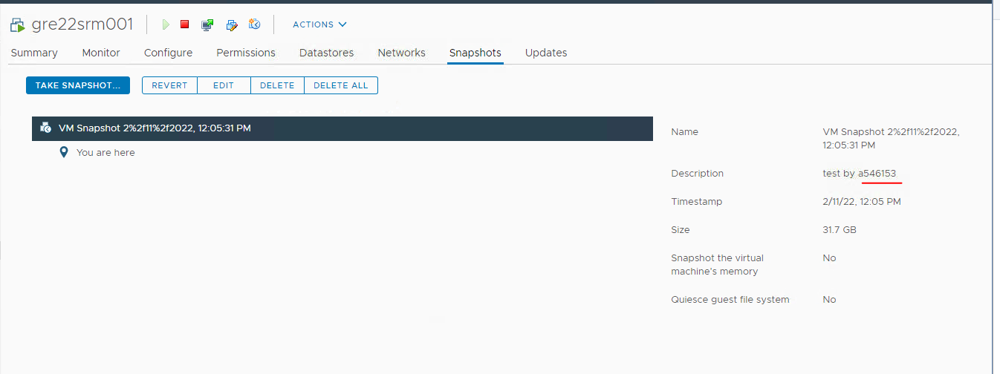
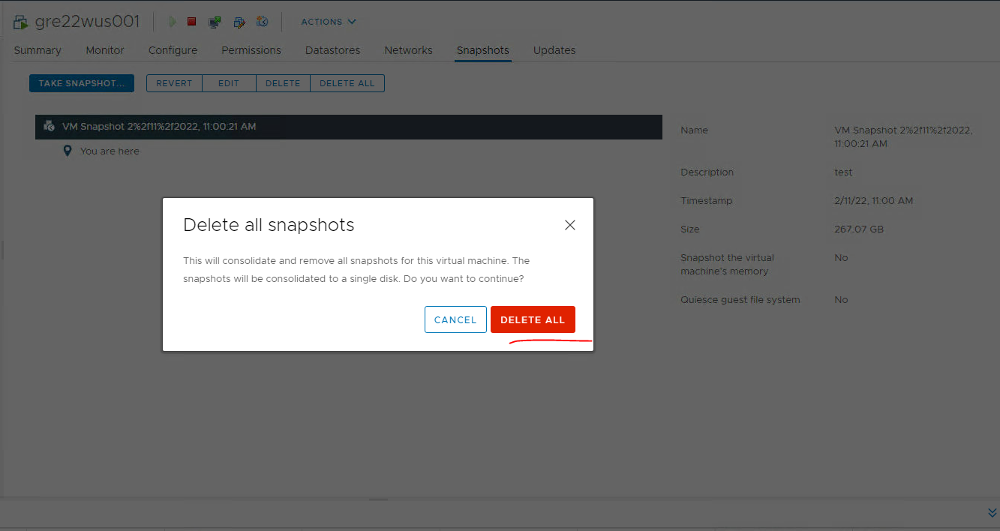
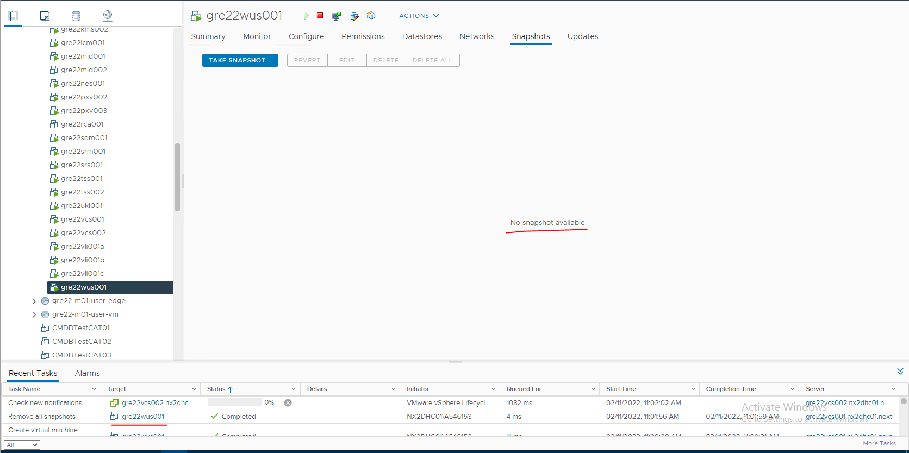

# VCS Delete Snapshot

## Table of Contents

- [VCS Delete Snapshot](#vcs-delete-snapshot)
  - [Table of Contents](#table-of-contents)
- [Changelog](#changelog)
  - [Introduction](#introduction)
    - [Purpose](#purpose)
    - [Audience](#audience)
    - [Scope](#scope)
  - [Steps](#steps)
  - [Check the report](#check-the-report)
  - [Check snapshot owner](#check-snapshot-owner)
  - [Removal of Virtual Machine Snapshot](#removal-of-virtual-machine-snapshot)
  - [Check in vCenter if the snapshots have been successfully removed](#check-in-vcenter-if-the-snapshots-have-been-successfully-removed)

# Changelog

| Version | Date       | Description              | Author          |
| ------- | ---------- | ------------------------ | --------------- |
| DHC-4079| 11/02/2022 | First version            | Berte Petru   |

## Introduction

### Purpose

Delete VM snapshots in vCenter.

### Audience

- VCS Operations

### Scope

- Check the snapshot report for VM snapshots that can be removed
- Remove old snapshots

## Steps

## Check the report

Check the snapshot report to see which are older than 72 hours that need to be deleted.

Best practices for using VMware snapshots in the vSphere environment: [Vmware KB](https://kb.vmware.com/s/article/1025279)

The report is generated in VROPS.

The work instruction  to generate report can be found in  [wiVropsSnapshotReportScheduling.md](wiVropsSnapshotReportScheduling.md)

## Check snapshot owner

Check with the snapshot creator if the snapshot can be deleted.

## Removal of Virtual Machine Snapshot

## Check in vCenter if the snapshots have been successfully removed

