# NSX Application Platform (NAPP)

## Changelog

| Version | Date        | Author          | Changes           |
|---------|------------|----------------|-------------------|
| 0.1     | 05.03.2025 | Michal Pindych | Document creation |

## Introduction

The NSX Application Platform (NAPP) is a high-performance security analytics platform that hosts microservices-based applications. The correlation of network and security events is accomplished using resource-intensive analytics and machine learning.  
The following NSX Advanced Threat Prevention (ATP) security applications run on NAPP:

- **NSX Metrics** – Collects data to monitor key statistics across entities. It is installed by default and does not require activation.  
- **NSX Intelligence** – Provides real-time visibility and analysis of network traffic to optimize micro-segmentation policies.  
- **Network Detection & Response (NDR)** – Detects, analyzes, and helps respond to advanced network threats using behavioral analytics and threat intelligence.  
- **NSX Malware Prevention** – Inspects network traffic to detect and block known and unknown malware using advanced threat prevention techniques.  

### Purpose

The purpose of this document is to explain how to deploy NAPP on an existing Tanzu Kubernetes Cluster and activate the NSX Intelligence security feature.

### Audience

- DHC Engineers  
- DHC Architects  

### Scope

- NAPP architecture  
- Prerequisites  
- NAPP deployment and NSX Intelligence activation  
- NAPP LCM  
- Basic NAPP troubleshooting  

### Related Documents

| Link | Description |
|------|------------|
| [NSX NAPP](https://techdocs.broadcom.com/us/en/vmware-security-load-balancing/vdefend/vmware-nsx-application-platform/4-2/release-notes.html) | Official documentation for NSX Application Platform version 4.2 |
| [Security Intelligence](https://techdocs.broadcom.com/us/en/vmware-security-load-balancing/vdefend/security-intelligence/4-2/security-intelligence-formerly-known-as-vmware-nsx-intelligence-420-release-notes.html) | Official documentation for Security Intelligence version 4.2 (formerly known as NSX Intelligence) |

## Architecture

NSX Application Platform deployment requires a Kubernetes cluster. The supported options are Tanzu Kubernetes Grid (TKG) Cluster on Supervisor or an Upstream Kubernetes cluster (vanilla, open-source Kubernetes).  
Starting from version 4.2, NAPP supports proxy authentication for HTTP and HTTPS. The proxy support allows access to the container and configuration registry required for NSX Application Platform deployment.

### Minimum System Requirements

| Form Factor | Recommended # of Nodes in a TKG Cluster on Supervisor or Upstream Kubernetes Cluster | vCPU | Memory | Storage | Ephemeral Storage | Supported NSX Features |
|-------------|-------------------------------------------------------------------------------------|------|--------|---------|-------------------|-----------------------|
| **Advanced**   | A minimum of 1 control plane node is required, but 3 control plane nodes are recommended. Five worker nodes are recommended. | 2 vCPUs for the control plane node  <br> 16 vCPUs per worker node | 4 GB RAM for the control plane node  <br> 64 GB RAM per worker node | 1 TB per NSX Application Platform instance  | 64 GB | Security Intelligence <br> NSX Network Detection and Response <br> NSX Malware Prevention <br> NSX Metrics |
| **Evaluation** | 1 control plane node and 1 worker node | 2 vCPUs for the control plane node  <br> 16 vCPUs per worker node | 4 GB RAM for the control plane node <br> 64 GB RAM per worker node | 1 TB per NSX Application Platform instance | 64 GB | Security Intelligence <br> NSX Network Detection and Response <br> NSX Malware Prevention <br> NSX Metrics |

---

The **Evaluation** form factor is applicable only for non-production deployments used for evaluations or demonstrations. It has limited data retention, no scalability or high availability support, and no upgrade support.

### Network Traffic Requirements

The following ports should be allowed for NAPP and NSX-T Intelligence:

| Port  | Protocol | Source                          | Destination                              | Service Description                                                                                     |
|-------|---------|---------------------------------|------------------------------------------|---------------------------------------------------------------------------------------------------------|
| 443   | TCP     | NSX Application Platform (NAPP) | NSX ATP Cloud Services - nsx.lastline.com | Used by NAPP to connect to cloud services deployed for NSX NDR and NSX Malware Prevention              |
| 443   | TCP     | NSX Application Platform (NAPP) | *.prod.nsxti.vmware.com                 | Used by NSX Application Platform to connect to NTICS cloud services                                   |
| 53    | TCP     | NSX Application Platform (NAPP) | DNS Servers                             | DNS resolution                                                                                          |
| 53    | UDP     | NSX Application Platform (NAPP) | DNS Servers                             | DNS resolution                                                                                          |
| 123   | UDP     | NSX Application Platform (NAPP) | NTP Servers                             | Network Time Protocol (NTP) synchronization                                                             |
| 22    | TCP     | NSX Application Platform (NAPP) | Management SCP Servers                  | SSH (used for uploading support bundles, backups, etc.)                                                 |
| 443   | TCP     | NSX Application Platform (NAPP) | vCenter Server / NSX Unified Appliance  | NSX Intelligence communication with vCenter Server and NSX Unified Appliance (if configured)            |
| 9092  | TCP     | NSX Application Platform (NAPP) | NSX Unified Appliance / NSX Transport Nodes | NSX Intelligence outgoing communication to NSX Unified Appliance or Transport Nodes                   |
| 6443  | TCP     | NSX Application Platform (NAPP) | Kubernetes API Server                   | API calls from NSX Intelligence to Kubernetes API server                                               |
| 10250 | TCP     | NSX Application Platform (NAPP) | kube-api                                | API calls from NSX Intelligence to kube-api                                                            |
| 10250 | TCP     | NSX Application Platform (NAPP) | kube-api-server                         | API calls from NSX Intelligence to kube-api-server                                                     |
| 10250 | TCP     | NSX Application Platform (NAPP) | Kubelet API Server                      | API calls from NSX Unified Appliance to Kubelet API Server                                             |
| 10259 | TCP     | NSX Application Platform (NAPP) | Kubernetes Cluster Server               | Used by Kubernetes server for internal self-communication                                              |
| 2379, 2380 | TCP | NSX Application Platform (NAPP) | Etcd Kubernetes API Server              | API calls from NSX Intelligence to the Etcd server                                                     |
| 9092  | TCP     | ESXi with NSX Application Platform (NAPP) | NSX Application Platform             | Required for ESXi hosts to connect to NSX Application Platform (NAPP)                                  |
| 443   | HTTPS   | ESXi with NSX Application Platform (NAPP) | NSX Application Platform Frontend Network | Required for ESXi hosts to send metrics to NSX Application Platform (NAPP) |

---

## Prerequisites

Please refer to the following list of prerequisites before installing NAPP:

- An appropriate NSX license  
- NSX-T environment stable, without critical alarms, all Geneve tunnels up
- A supported microservices environment for the NSX Application Platform  
- The ability to add a fully qualified domain name (FQDN) in DNS for the Interface/Messaging Service Name  
- Access to public Broadcom Docker/Helm repositories (direct or through a proxy)  
- Network connectivity between your microservices environment and infrastructure  
- Time synchronization between NSX, vSphere, and your Kubernetes environments  
- A valid kubeconfig file for the TKG cluster  
- The ability to run `kubectl` commands on a Linux machine – `ans001` can be used for this purpose  

### Supported Licenses

| License |
|---------|
| Data Center/NSX-T Enterprise Plus |
| Data Center/NSX-T Advanced with NSX ATP |
| Data Center/NSX-T Advanced with NSX TP |
| Security (Distributed Firewall or Gateway Firewall) |

### Interoperability Matrix

| Product | Version |
|---------|---------|
| **NSX-T** | 4.2.1.0, 4.2.0.0 |
| **NSX-T VMware NSX Intelligence** | 4.2.0 |
| **Tanzu Kubernetes Releases** | TKr 1.29.4 for vSphere 8.x, TKr 1.28.8 for vSphere 8.x, TKr 1.26.5 for vSphere 8.x |

---

### A Supported Microservices Environment for NSX Application Platform

Before installing NAPP, the microservices environment must be deployed based on vSphere Supervisor (formerly vSphere with Tanzu).  
All the following components should already be in place before proceeding with the NAPP deployment:

- **Supervisor Cluster**  
- **Dedicated namespace for NAPP** with a configured content library, VM class, storage, and permissions  
- **Preconfigured Tanzu Kubernetes Cluster (TKC)** with 3 control plane nodes and 4 worker nodes  

#### Verification Steps

| Step | Screenshot |
|------|-----------|
| 1. Navigate to **vSphere Client → Workload Management → Namespaces** | 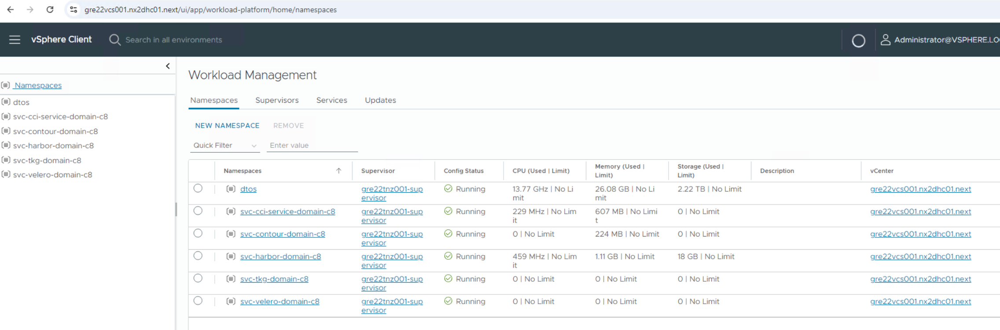 |
| 2. Choose the current namespace for NAPP deployment. Note: All namespaces following the naming convention `svc-{component-name}-domain` are system ones – you can ignore these. | 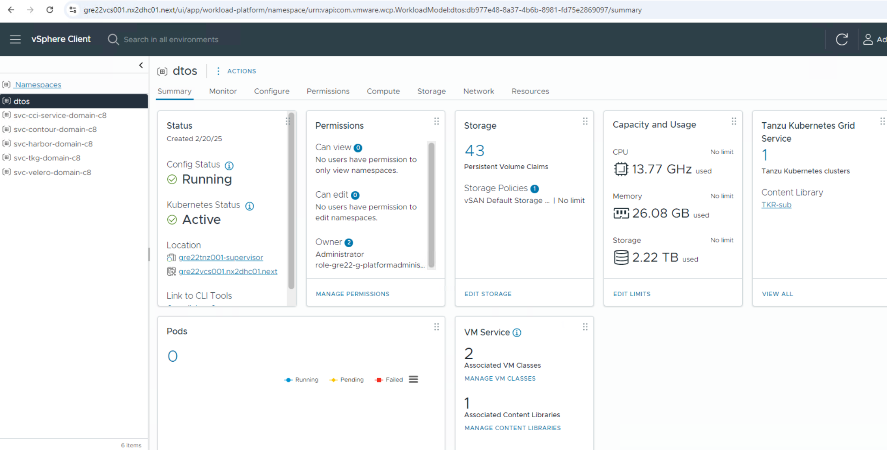 |
| 3. Under the selected namespace, navigate to **Compute → Tanzu Kubernetes Cluster** and check the status. | 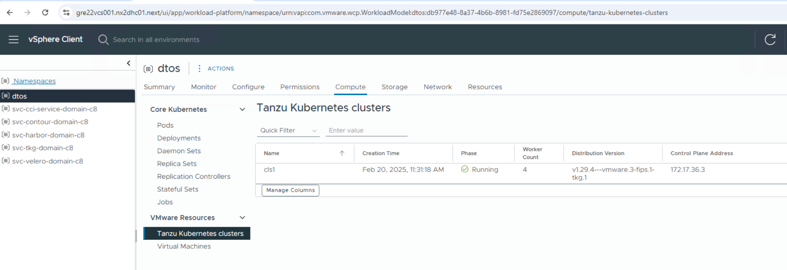 |
| 4. Under the selected namespace, navigate to **Compute → Virtual Machines** and confirm that all control plane and worker nodes are powered on. | 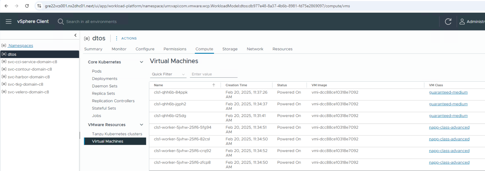 |

---

### Ability to Add a Fully Qualified Domain Name (FQDN) in DNS for Interface/Messaging Service Name

Two DNS records must be registered for NAPP to function properly:  

- **Interface Service:** The HTTPS endpoint to access NAPP  
- **Messaging Service:** The endpoint to the Kafka messaging broker cluster deployed in TKC. NAPP instances can publish (send) or subscribe (receive) messages via Kafka.  

#### Steps to Add Required Entries to a DNS Server

| Step | Screenshot |
|------|-----------|
| 1. Identify the **Ingress network for vSphere Supervisor**. Navigate to **vSphere Client → Workload Management → Supervisors** and select the specific entry. | 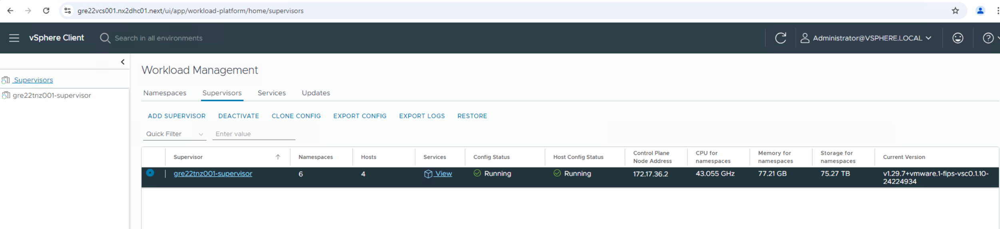 |
| 2. Under the selected Supervisor, go to **Configure → Network → Workload Network → Ingress**. In this example, the ingress network is configured as `172.17.36.0/24`. | 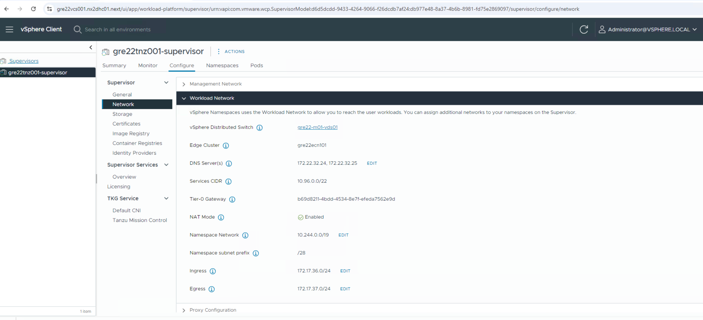 |
| 3. Add two entries to the DNS server using available IP addresses from the ingress network. | 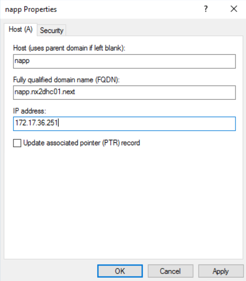  |

---

### Access to Public Broadcom Docker/Helm Repositories Through a Proxy

A proxy is a critical component of NAPP deployment. Please refer to the **"Troubleshooting Proxy"** section for additional information.  
To ensure that the proxy is configured on all required components, follow these steps:

| Step | Screenshot |
|------|-----------|
| 1. Log in to the **vCenter Server Management GUI** (using port `5480`), navigate to **Networking → Proxy Settings**, and add the proxy configuration if not already present. | 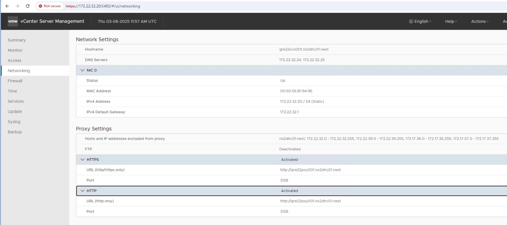 |
| 2. Log in to the **NSX-T Manager GUI**, navigate to **System → General Settings → Internet Proxy Server**, and add the proxy configuration if not already present. | 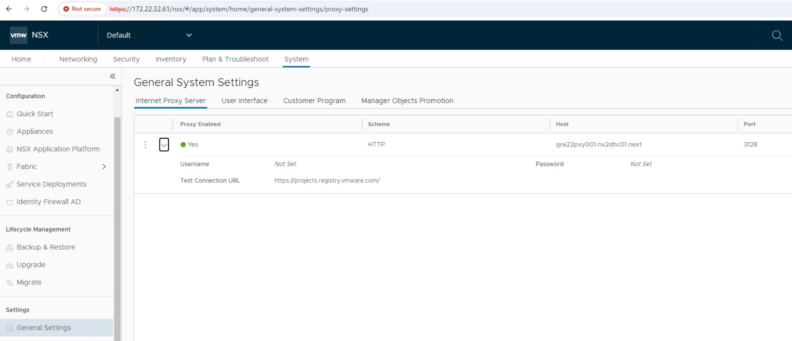 |
| 3. Log in to the **vCenter Client**, navigate to **Workload Management → Supervisor → Configure → Network → Proxy Configuration**, and add the proxy configuration if not already present. | 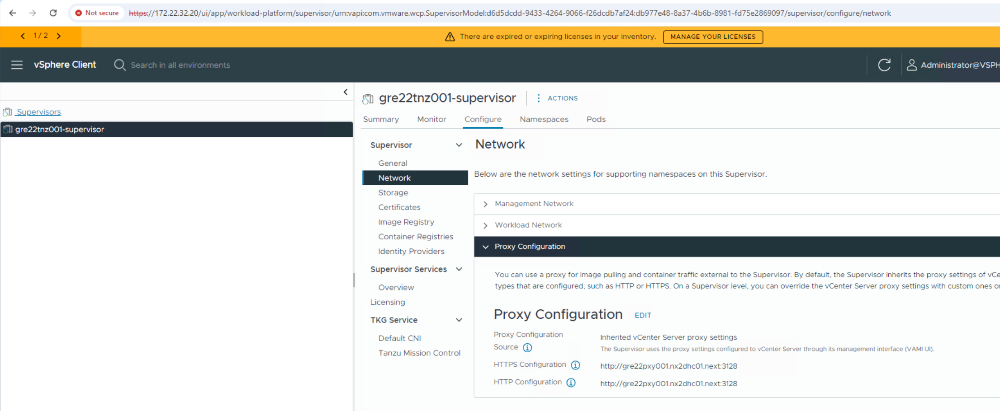 |
| 4. Ensure that the **Tanzu Kubernetes Cluster (TKG)** also has proxy settings configured. Follow the steps in the **"Troubleshooting Proxy"** section for verification. | |

### Kubeconfig preparation

Before NAPP installation there is a need to generate a valid TKG Cluster configuration file with a non-expiring token that you can use during the NSX Application Platform deployment.
The following steps require a Linux-based client. Please also refer to official Broadcom documentation "Generate a TKG Cluster on Supervisor Configuration File with a Non-Expiring Token"  

[Configuration File with a Non-Expiring Token](https://techdocs.broadcom.com/us/en/vmware-security-load-balancing/vdefend/vmware-nsx-application-platform/4-2/deploying-and-managing-the-nsx-application-platform/deploying-the-nsx-application-platform/configuring-your-environment-for-manual-deployment/generate-a-tanzu-kubernetes-cluster-configuration-file-with-a-non-expiring-token.html)

1. From Ans001 host Log in the vSphere with Tanzu Kubernetes Guest Cluster.

```kubectl vsphere login --server<supervisor-cluster_ip>-u<user>--tanzu-kubernetes-cluster-name<tkg-cluster-name>--tanzu-kubernetes-cluster-namespace<namespace>```

The parameters are as follows:

**supervisor-cluster_ip** is the Control Plane Node Address which can be found in the vSphere Client by selecting Workload Management > Supervisor Cluster.

**user** is the account that has administrator access to the TKG Cluster on Supervisor (**administrator at vsphere.local**).

**tkg-cluster-name** is the name of the TKG Cluster on Supervisor.

**namespace** is the vSphere namespace where this cluster resides.

1. Generate an administrator service account and create a cluster role binding.

```text kubectl create serviceaccount napp-admin -n kube-system```

```text kubectl create clusterrolebinding napp-admin --serviceaccount=kube-system:napp-admin --clusterrole=cluster-admin```

1. Manually create the authentication token for the administrator service account. Create a YAML file with a following content and save it as napp-admin.yaml

```text
apiVersion: v1
kind: Secret
type: kubernetes.io/service-account-token
metadata:
  name: napp-admin
  namespace: kube-system
  annotations:
     kubernetes.io/service-account.name: "napp-admin"
```

Then use the following command to create the authentication token with a service account.

```text
kubectl apply -f napp-admin.yaml
```

1. Run the following commands separately to get required information for configuration file

```text
SECRET=$(kubectl get secrets napp-admin -n kube-system -ojsonpath='{.metadata.name}')

TOKEN=$(kubectl get secret $SECRET -n kube-system -ojsonpath='{.data.token}' | base64 -d)

kubectl get secrets $SECRET -n kube-system -o jsonpath='{.data.ca\.crt}' | base64 -d > ./ca.crt

CONTEXT=$(kubectl config view -o jsonpath='{.current-context}')

CLUSTER=$(kubectl config view -o jsonpath='{.contexts[?(@.name == "'"$CONTEXT"'")].context.cluster}')

URL=$(kubectl config view -o jsonpath='{.clusters[?(@.name == "'"$CLUSTER"'")].cluster.server}')
```

1. Generate a configuration file, with a non-expiring token, for the TKG Cluster

```text
TO_BE_CREATED_KUBECONFIG_FILE="<file-name>"
```

The parameter **file-name** is the name of kubeconfig file you are trying to create

```text
kubectl config --kubeconfig=$TO_BE_CREATED_KUBECONFIG_FILE set-cluster $CLUSTER --server=$URL --certificate-authority=./ca.crt --embed-certs=true

kubectl config --kubeconfig=$TO_BE_CREATED_KUBECONFIG_FILE set-credentials napp-admin --token=$TOKEN

kubectl config --kubeconfig=$TO_BE_CREATED_KUBECONFIG_FILE set-context $CONTEXT --cluster=$CLUSTER --user=napp-admin

kubectl config --kubeconfig=$TO_BE_CREATED_KUBECONFIG_FILE use-context $CONTEXT
```

1. Delete the ca.crt, which is a temporary file created during the generation of the new kubeconfig file.

1. Use the newly generated kubeconfig file during the NSX Application Platform deployment.

### NAPP Deployment Steps

| Step | Screenshot |
|------|------------|
| 1. In the **NSX GUI**, navigate to **System → NSX Application Platform** and click the **"Deploy NSX Application Platform"** button. | 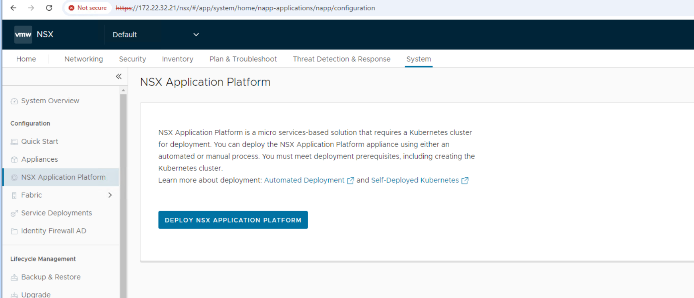 |
| 2. By default, the **VMware public Helm repository** and **Docker registry** are used. Click **"Save and Retrieve Version"**. | 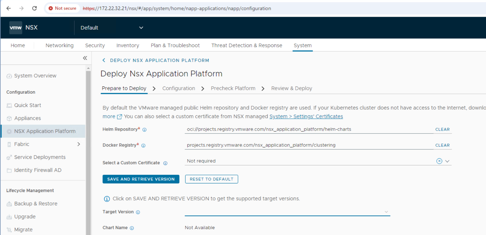 |
| 3. The **"Target Version"** field will now be activated. Select the latest available version from the list. | 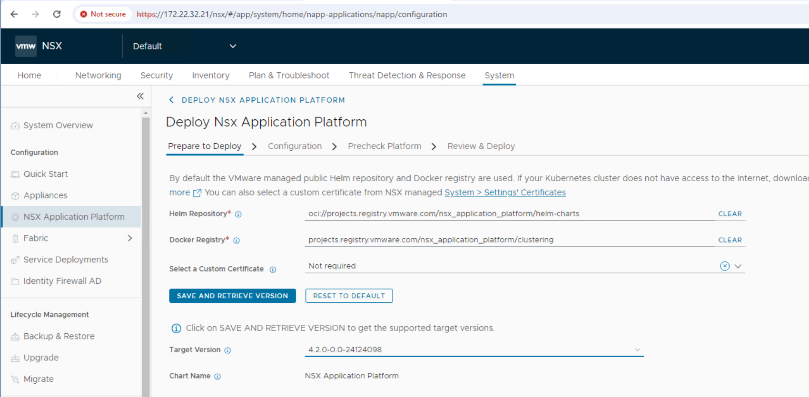 |
| 4. In the **Configuration** tab, upload the **kubeconfig** file created in the **"Kubeconfig Preparation"** section. For **Storage Class**, select **"vsan-default-storage-policy"**, and for **Interface/Messaging Service Name**, choose the **DNS entries** created in the **"Ability to Add a Fully Qualified Domain Name (FQDN) in DNS for Interface/Messaging Service Name"** section. If you encounter a **"Kubernetes Tool Incompatibility"** issue, refer to the **"Troubleshooting"** section for resolution. | 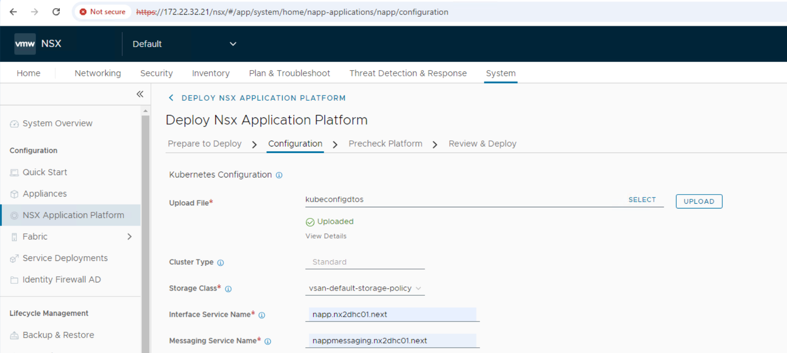 |
| 5. On the same page, select the **Advanced** form factor, which consists of **3 control nodes** and **4 worker nodes**. | 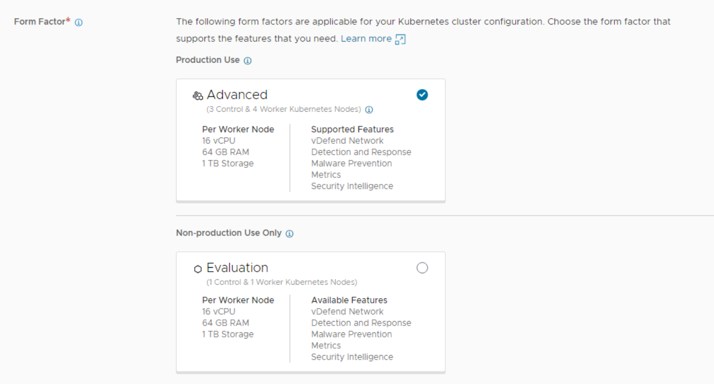 |
| 6. On the next page, click **"Run Prechecks"**. If all prechecks pass successfully, you are ready to deploy NAPP. | 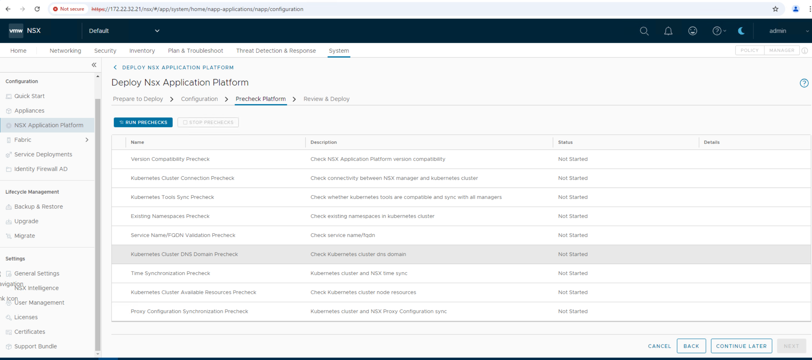 |
| 7. You can track the NAPP deployment progress on a dedicated page. If any issues occur, the first recommended action is to **retry the deployment**. | 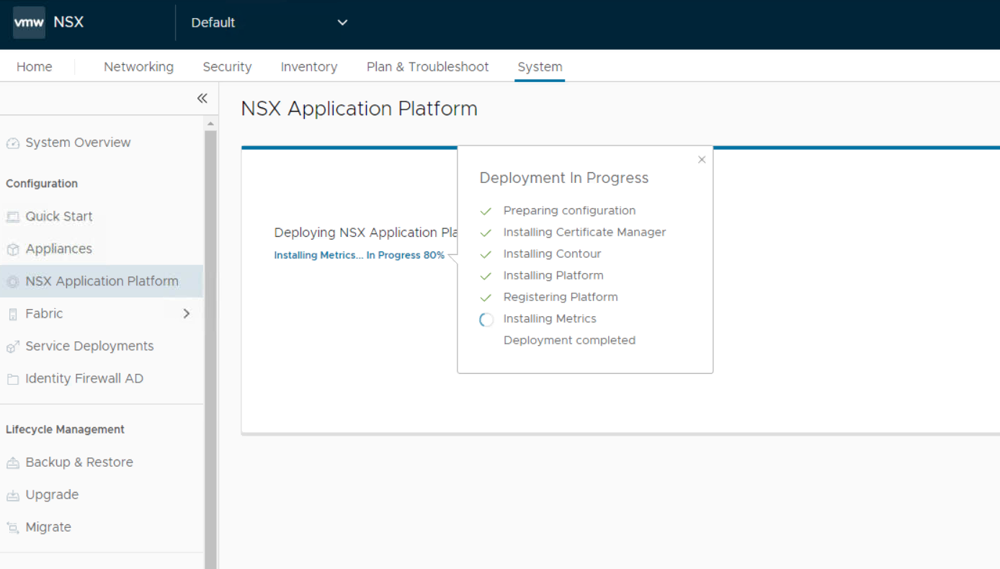 |
| 8. Once deployed, NAPP should be accessible under **System → NSX Application Platform**. | 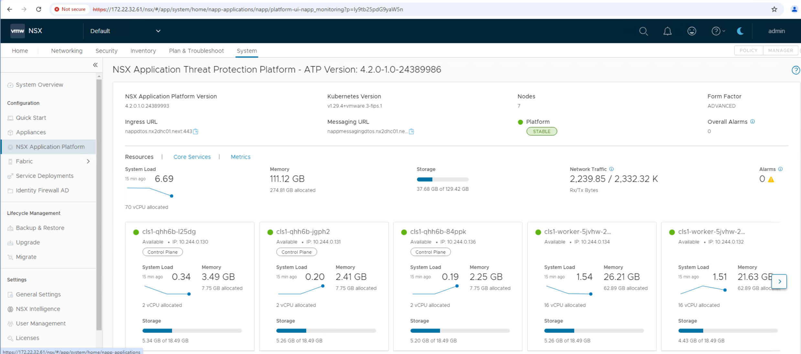 |

---

### NSX Intelligence Activation Steps

| Step | Screenshot  |
|------|------------|
| 1. In the **NSX-T GUI**, navigate to **System → NSX Application Platform** and click the **"Activation"** button for the **NSX Intelligence** security feature. | 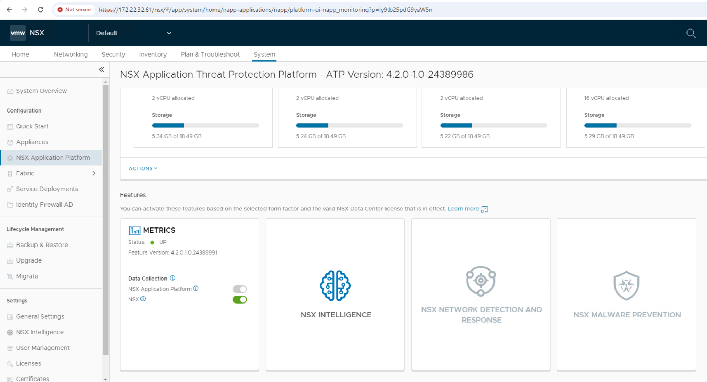 |
| 2. The next window will display all **prechecks** that must pass before the feature can be activated. | 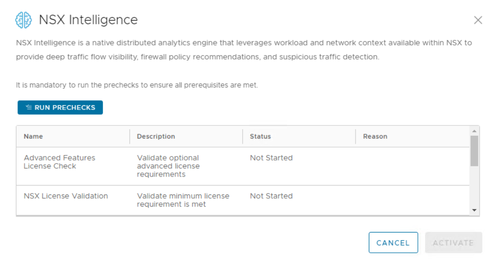 |
| 3. If all prechecks complete successfully, the option to **activate** the feature will become available. | 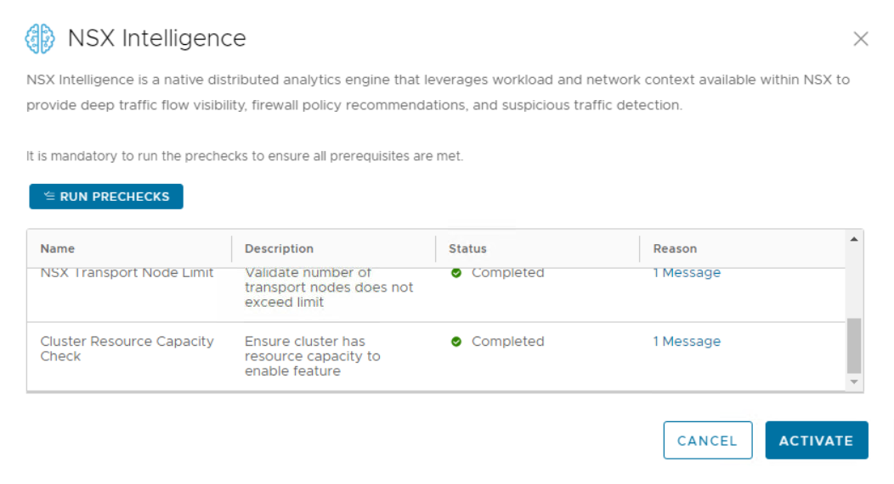 |
| 4. Once activated, the **NSX Intelligence** feature should be ready for use. | 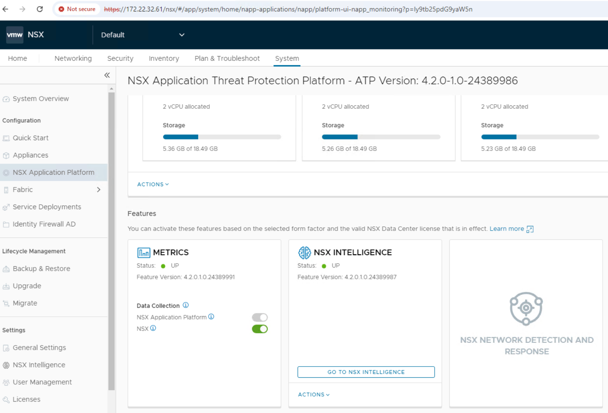 |

---

## NAPP LCM

NAPP LCM is realized by NSX-T, as public repositories will be used also in this case, proper proxy configuration is required.
Detailed LCM process using NSX-T GUI is described in official Broadcom documentation

[Upgrading NSX Application Platform](https://techdocs.broadcom.com/us/en/vmware-security-load-balancing/vdefend/vmware-nsx-application-platform/4-2/deploying-and-managing-the-nsx-application-platform/upgrading-nsx-application-platform.html)

## Troubleshooting

### NSX-T Environment check

Before NAPP deployment, it is crucial to ensure that the NSX-T environment is stable and that there are no alarms that could impact deployment tasks.

| Step | Screenshot  |
|------|------------|
|1. Please navigate to the **NSX-T GUI, go to System → Appliances**, and confirm that there are no critical alarms on the NSX-T Managers. |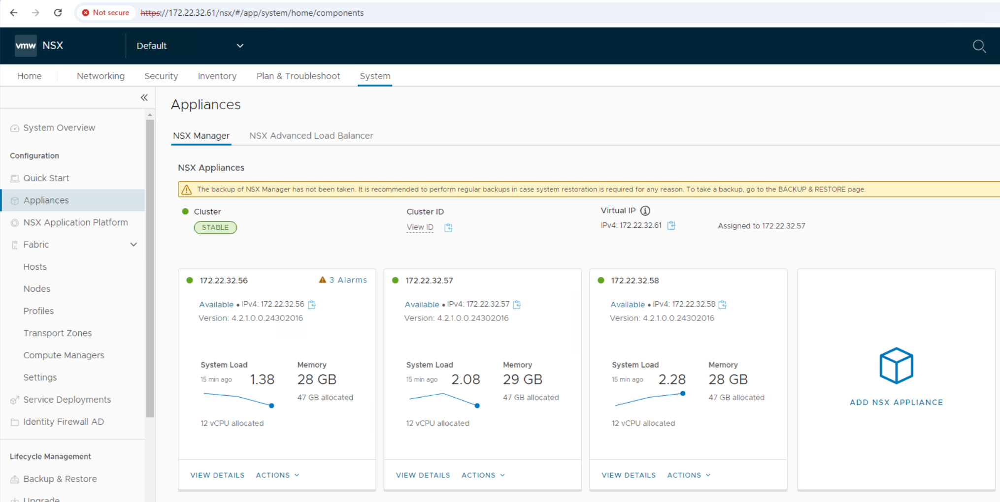 |
|2. Navigate to **System → Fabric → Nodes** and confirm that all Geneve tunnels are UP. Issues with Geneve tunnels can cause unpredictable problems during NAPP deployment.   | 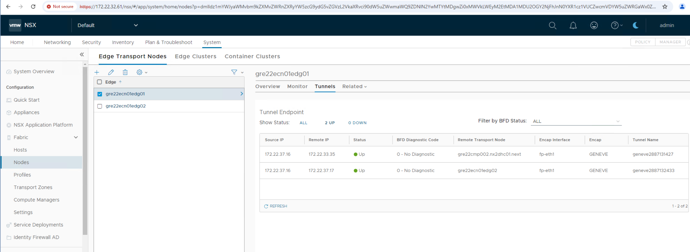  |
|3. Navigate to System → Fabric → Hosts  -> Clusters and confirm that all Geneve tunnels are UP. Issues with Geneve tunnels can cause unpredictable problems during NAPP deployment.  | 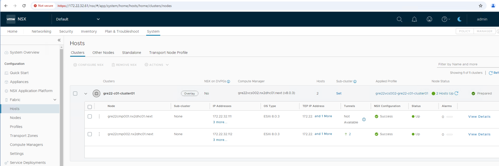  |

### Problem during kubeconfig file creation

If problem occurs during kubeconfig generation after execution of this command:

```text
next@gre22ans001:~$ kubectl create serviceaccount napp-admin -n kube-system
error: failed to create serviceaccount: serviceaccounts is forbidden: User "sso:Administrator@vsphere.local" cannot create resource "serviceaccounts" in API group "" in the namespace "kube-system"
next@gre22ans001:~$
```

Please update the configuration as follows:

```text
kubectl create clusterrolebinding vsphere-admin-cluster-binding \
  --clusterrole=cluster-admin \
  --user=sso:Administrator@vsphere.local
```

### Kubernetes Tools incompatibility

If NSX Application Platform pane in NSX UI shows message

```text Server version <version> and client version <version> are incompatible. Please upload Kubernetes Tools to resolve.```

Please use official fix from Broadcom:

[Kubernetes Tools incompatibility fix](https://knowledge.broadcom.com/external/article/319068/napp-pane-in-nsx-ui-shows-message-server.html)

### Trobuelshooting Proxy

A proxy is a key component during NAPP deployment, as public repositories are used for Docker images and Helm charts.
It is important to have the proxy configured on all components listed in the prerequisites section (vCenter, NSX-T, TKG cluster, Supervisor cluster).
If there are traffic limitations on the proxy, it is recommended to increase the available bandwidth during the NAPP deployment to avoid interruptions.
If an error occurs during deployment, such as **"Failed pre-install - timeout waiting for the condition"** the process should be retried.
As all required packages are downloaded from Internet, timeouts are expected to occur.
During NAPP deployment at least this url should be whitelisted on proxy server **"projects.registry.vmware.com"** which represent public repositories for Docker and Helm. Desirable solution is to allow entire domain  **"*.vmware.com"**.

In order to check or update configuration on TKC cluster follow this process:

1. Log in to the vCenter and then to the supervisor cluster by SSH

Command **/usr/lib/vmware-wcp/decryptK8Pwd.py** will list IP address and password for supervisor cluster

```text
Command> shell
Shell access is granted to root
root@gre22vcs001 [ ~ ]# /usr/lib/vmware-wcp/decryptK8Pwd.py
Read key from file

Connected to PSQL

Cluster: domain-c8:db977e48-8a37-4b6b-8981-fd75e2869097
IP: 172.22.32.50
PWD: Supervisor-password 
------------------------------------------------------------

root@gre22vcs001 [ ~ ]# ssh root@172.22.32.50
```

1. List all TKC cluster

```text
root@4231d0b554924e3de36d29a2355f702a [ ~ ]# k get tkc -A
NAMESPACE     NAME          CONTROL PLANE   WORKER   TKR NAME                          AGE   READY   TKR COMPATIBLE   UPDATES AVAILABLE
tkg-napp-ns   tkg-napp-c1   3               4        v1.29.4---vmware.3-fips.1-tkg.1   19d   True    True             [v1.30.1+vmware.1-fips-tkg.5]
```

1. Edit manifest file for a specific cluster under proxy setting

```text
............................
spec:
  distribution:
    fullVersion: v1.29.4+vmware.3-fips.1-tkg.1
    version: ""
  settings:
    network:
      cni:
        name: antrea
      pods:
        cidrBlocks:
        - 192.168.0.0/16
      proxy:
        httpProxy: http://172.22.39.38:3128
        httpsProxy: http://172.22.39.38:3128
        noProxy:
        - 172.22.32.0/24
        - 172.22.39.0/24
        - 10.244.0.0/19
        - .next
...............................

```

### NSX Intelligence feature activation precheck fail

When NSX Intelligence activation process failed with error **"Ensure cluster has resources capacity to enable feature"** - there is a need to scale up cluster and add additional worker node, please fallow the process below:

1. Log in to the vCenter and supervisor cluster by SSH

Command **/usr/lib/vmware-wcp/decryptK8Pwd.py** will list IP address and password for supervisor cluster.

```text
Command> shell
Shell access is granted to root
root@gre22vcs001 [ ~ ]# /usr/lib/vmware-wcp/decryptK8Pwd.py
Read key from file

Connected to PSQL

Cluster: domain-c8:db977e48-8a37-4b6b-8981-fd75e2869097
IP: 172.22.32.50
PWD: Supervisor-password 
------------------------------------------------------------

root@gre22vcs001 [ ~ ]# ssh root@172.22.32.50
```

1. List all TKC cluster

```text
root@4231d0b554924e3de36d29a2355f702a [ ~ ]# k get tkc -A
NAMESPACE     NAME          CONTROL PLANE   WORKER   TKR NAME                          AGE   READY   TKR COMPATIBLE   UPDATES AVAILABLE
tkg-napp-ns   tkg-napp-c1   3               4        v1.29.4---vmware.3-fips.1-tkg.1   19d   True    True             [v1.30.1+vmware.1-fips-tkg.5]
```

1. Edit manifest file for a specific cluster, change replica count for worker nodes increment by 1

```text
root@4231d0b554924e3de36d29a2355f702a [ ~ ]# k edit tkc tkg-napp-c1 -n tkg-napp-ns
tanzukubernetescluster.run.tanzu.vmware.com/tkg-napp-c1 edited

...............
    nodePools:
    - replicas: 4 # increase from 4 to 5 
      name: worker
      vmClass: napp-class-advanced
      storageClass: vsan-default-storage-policy
      volumes:
        - name: etcd
          mountPath: /var/lib/etcd
          capacity:
            storage: 64Gi
        - name: containerd
          mountPath: /var/lib/containerd
          capacity:
            storage: 64Gi
.................
```

1. Check status of cluster deployment after the change.

You should observe that 5 worker node are available at this moment.

```text
root@4231d0b554924e3de36d29a2355f702a [ ~ ]# k get tkc -A
NAMESPACE     NAME          CONTROL PLANE   WORKER   TKR NAME                          AGE   READY   TKR COMPATIBLE   UPDATES AVAILABLE
tkg-napp-ns   tkg-napp-c1   3               5        v1.29.4---vmware.3-fips.1-tkg.1   19d   True    True             [v1.30.1+vmware.1-fips-tkg.5]
```

### NAPP Pods troubleshooting

This procedure describe the steps required during the NAPP pods troubleshooting, if a given pod failed - we should start with checks the logs and then eventually restart it.

1. Log in to the NSX controller on VIP cluster address

```text
login as: root
root@172.22.32.17's password:
Last login: Wed Jan  8 08:39:52 2025 from 172.22.32.22
***************************************************************************
NOTICE TO USERS

WARNING! Changes made to NSX Data Center while logged in as the root user
can cause system failure and potentially impact your network. Please be
advised that changes made to the system as the root user must only be made
under the guidance of VMware.
***************************************************************************
```

1. List all NAPP pods which potentially can have a problem

```text
root@gre22ctl002:~# napp-k get pods | egrep -vi "running|completed"
NAME                                                            READY   STATUS             RESTARTS          AGE
metrics-postgresql-ha-pgpool-76cccf7cf-v87db                    0/1     CrashLoopBackOff   267 (5m3s ago)    5d15h
metrics-postgresql-ha-pgpool-76cccf7cf-vz5rz                    0/1     CrashLoopBackOff   267 (4m28s ago)   5d15h
nta-flow-driver                                                 0/1     Error              0                 3d10h
```

1. Check if any specific errors are visible in the pods logs

```text
root@gre22ctl002:~# napp-k describe pod metrics-postgresql-ha-pgpool-76cccf7cf-v87db | less
root@gre22ctl002:~# napp-k describe pod metrics-postgresql-ha-pgpool-76cccf7cf-vz5rz | less
```

1. Deletion of the pod can be performed as one of the methods of troubleshooting, after that pods should be automatically recreated.

```text
root@gre22ctl002:~# napp-k delete pod metrics-postgresql-ha-pgpool-76cccf7cf-v87db metrics-postgresql-ha-pgpool-76cccf7cf-vz5rz
pod "metrics-postgresql-ha-pgpool-76cccf7cf-v87db" deleted
pod "metrics-postgresql-ha-pgpool-76cccf7cf-vz5rz" deleted
```

1. Checking the status of pods after the change

```text
root@gre22ctl002:~# napp-k get pods | egrep -vi "running|completed"
NAME                                                            READY   STATUS            RESTARTS          AGE
metrics-postgresql-ha-pgpool-76cccf7cf-xvv47                    0/1     PodInitializing   0                 11s
nta-flow-driver                                                 0/1     Error             0                 3d10h
```
