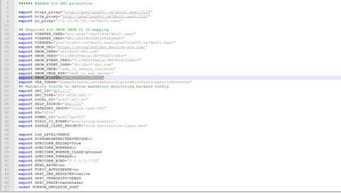
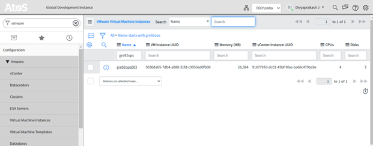
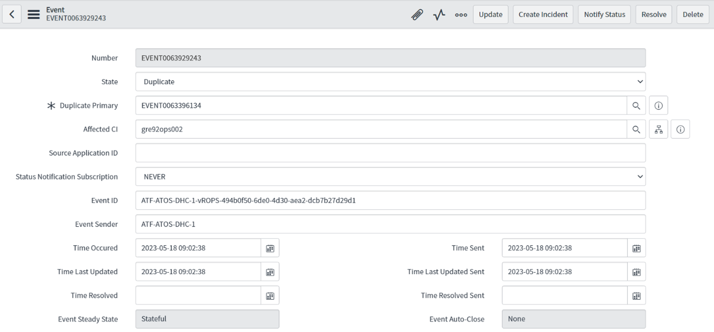
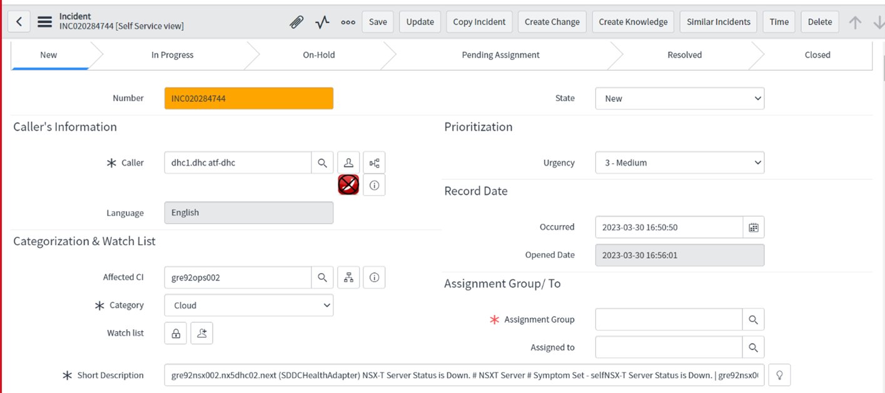

# VCS dev environment monitoring and alerting

Table of Contents

- [VCS dev environment monitoring and alerting](#vcs-dev-environment-monitoring-and-alerting)
- [Changelog](#changelog)
  - [Introduction](#introduction)
    - [Scope](#scope)
    - [Audience](#audience)
    - [Pre-requisite](#pre-requisite)
  - [Related Documents](#related-documents)
- [Configuration of HTTP Gateway Server](#configuration-of-http-gateway-server)
  - [Automated Monitoring Update on HTTP Gateway application](#automated-monitoring-update-on-http-gateway-application)
  - [Configure Entrypoint in HTTP Gateway Server](#configure-entrypoint-in-http-gateway-server)
- [Configuration in snow portal](#configuration-in-snow-portal)
- [Postchecks](#postchecks)
  - [Validate the HTTP Gateway logs](#validate-the-http-gateway-logs)
  - [Validate SNOW Events](#validate-snow-events)
  - [Validate SNOW Incidents](#validate-snow-incidents)
  - [Example of valid alert logs](#example-of-valid-alert-logs)
- [SNOW portal Account Details](#snow-portal-account-details)
- [SNOW portal Contacts](#snow-portal-contacts)
- [Known Issues](#known-issues)
  
# Changelog

| Date       | TOS     | Issue   |    Author         |    Description    |
| ---------- | ------- | ------- | ----------------- | ----------------- |
| 08-21-2023 | VCS 1.8 |   VCS-10406   | Divyaprakash J    |   Documentation for Dev Monitoring & Alerting |

## Introduction

This document is designed for VCS development environment. It provides step-by-step instructions on how to configure an HTTP Gateway Server to transfer alerts from VROPS to SNOW and create events and incidents in the snow portal.

### Scope

The scope is to create Events/Incidents and send alerts to snow portal from HTTP Gatway Server.

### Audience

VCS deployment engineers, Dev-Sec-Ops team

### Pre-requisite

- Need Integration User with appropriate access in snow portal.
- Service Account to access Vcenter server.

## Related Documents

This document is a subset of Atos Technology Lifecycle Management (ATLM) artefacts.

| Document                          | Document Name                                                                                                 |
|-----------------------------------|---------------------------------------------------------------------------------------------------------------|
| VCS Infrastructure LLD |[wiExcludeAbsLayerFromMonitoring](wiExcludeAbsLayerFromMonitoring.md)   |

# Configuration of HTTP Gateway Server

## Automated Monitoring Update on HTTP Gateway application

<b> As per new approach for VCS monitoring, we need to run below playbook to exclude Abstraction layer</b>

To begin with automated process of updating the VCS monitoring on HTTP Gateway application, make sure to logon into Ansible core VM and navigate to the location where automation code was cloned (most likely user home directory).

Navigate to **manage** directory and execute following command to start automated VCS monitoring update:

```ansible
 dhc/manage$ ansible-playbook excludeAbsLayerFromMonitoring.yml
```

This playbook will prompt for below inputs from user

- Enter domain username in format `dasId@domain.next`
- Enter the password for the domain user. Please note that the password you enter will not be displayed on the screen.
- Provide account username used to event creation in SNOW - Use VCS Integration user mentioned [here](#snow-portal-account-details)
- Provide account password for above user

Steps covered by automation:

- stop the application
- create a backup folder
- copy application files into it before doing any changes (folder location: `/opt/pubsubpy3.7/dpcop-pubsub-http-gw-master/pubsubhttpgateway/backup_files`)
- overwrite two python files: `cloudevent.py` and `backend.py`
- modify `entrypoint.sh` - remove spare lines and add credential details for snow portal event account
- restart the application
- make a copy of config.json file on vROPs nodes (folder location: `/usr/lib/vmware-vcops/user/plugins/outbound/vrops-generic-rest-plugin/conf/servicenow/`)
- overwrite config.json configuration file
- restart nodes (one by one)
- validate md5 checksum

**Note:** Playbook supports following tags to run selected tasks:

> - Executes mandatory task to update HTTP Gateway code `dhc/manage$ ansible-playbook excludeAbsLayerFromMonitoring.yml -t updateMonitoring`
> - Executes mandatory task to update vROPS configuration of snow portal plugin `dhc/manage$ ansible-playbook excludeAbsLayerFromMonitoring.yml -t updateJsonVrops`

**Note:**

- For more details see document [wiExcludeAbsLayerFromMonitoring](wiExcludeAbsLayerFromMonitoring.md)

## Configure Entrypoint in HTTP Gateway Server

At the HTTP Gateway Server, confirm that these configurations are present in entrypoint.sh.

- Include the appropriate proxy in the configuration file.
- Verify the snow portal username and password are correct as well as the service account . Decode and verify with base64
- Mandatory fields to define mandatory monitoring backend config will be populated in playbook `excludeAbsLayerFromMonitoring.yml
- For filtering, add <b>export snow portal_FILTER="vm_instance_uuid"</b>
- Mention Dummy CI as `<locationcode>ops002` or `<locationcode>ops003`

Here is an example screenshot of our development environment.



# Configuration in snow portal

We need the CI for VROPS in snow portal because HTTP Gateway Server attempts to find responsible VROPS in the snow portal.

- Login to snow portal
- Check if you have Proper Access to make changes in snow portal
- Check if you are in proper FO in snow portal `(FO="ATOS")`
- Navigate to `Configuration` > `VMware` > `VMware Virtual Machine Instances`
- First, we must determine whether the existing CI is already present or not
- Sometimes, discovery may have been performed between Dev Environment and snow portal, at which point the CI will be present in the table. If not, we must manually add the CI to the table.
- Create a CI with name `<locationcode>ops002` or `<locationcode>ops002`
- Mention the VROPS values for the CPUs, memory, and network adapters in the CI table.
- Add UUID ID of the VM in the table
- It can be found in entrypoint.log under HTTP Gateway Server
- Use command `root@gre27hgw001:/opt/pubsubpy3.7/dpcop-pubsub-http-gw-master/pubsubhttpgateway# ./entrypoint.sh` to find UUID
- Save and close



**Note:**

- Contact the snow portal team for assistance if you don't have the necessary access to set up a CI in snow portal.

# Postchecks

Postchecks should contain validation on two levels:

- HTTP Gateway
- ServiceNow

Please simulate any kind of alert in vROPs and validate if alert is captured by HTTP Gateway server and event/incident created in ServiceNow.

## Validate the HTTP Gateway logs

- Login to server with domain account.
- Navigate to location: `/opt/pubsubpy3.7/dpcop-pubsub-http-gw-master/pubsubhttpgateway`
- Take a look on file `entrypoint.log`. It contains all application logs, you can run `tail -f entrypoint.log` command to have a live view on the file content.
- Validate that there is no errors in logs and you see lines with patterns like:

```shell

snow portal return code: SIA-xxxx
[EVENTxxxxxxxxxx] Event created

```

The example of single full valid alert log can be found [here](#example-of-valid-alert-logs). Use it as reference to validate VCS monitoring as well.

## Validate SNOW Events

- Sign in to the appropriate snow portal instance.
- Search with "Event ID" or "Affected CI" or any other information that works for you to filter it out. From the previously stated entrypoint.log file, you may extract filter values.
- Verify that the event is created.



**Note:**

- If you don't have access to view these details please contact ServiceNow Contact to validate it on behalf of you.

## Validate SNOW Incidents

- Sign in to the appropriate snow portal instance.
- Search with "Affected CI" or "Short Description" or any other information that works for you to filter it out. From the previously stated entrypoint.log file, you may extract filter values
- Verify that the Indect is created.



**Note:**

- If you don't have access to view these details please contact ServiceNow Contact to validate it on behalf of you.

## Example of valid alert logs

```xml
2023-07-28 07:37:09,883 - VropsEvent - DEBUG - Response code: 200
2023-07-28 07:37:09,883 - VropsEvent - DEBUG - Response: <?xml version='1.0' encoding='UTF-8'?><SOAP-ENV:Envelope xmlns:SOAP-ENV="http://schemas.xmlsoap.org/soap/envelope/" xmlns:xsd="http://www.w3.org/2001/XMLSchema" xmlns:xsi="http://www.w3.org/2001/XMLSchema-instance"><SOAP-ENV:Body><ns4:createEventResponse xmlns:S="http://schemas.xmlsoap.org/soap/envelope/" xmlns:SOAP-ENV="http://schemas.xmlsoap.org/soap/envelope/" xmlns:ns2="http://esb.atos.net/schemas/common" xmlns:ns3="http://sia.atos.net/schemas/event" xmlns:ns4="http://esb.atos.net/services/ESBEventService/"><header><ns2:messageID/><ns2:srcApplicationID>atosglobaldevevent</ns2:srcApplicationID><ns2:dstApplicationID/></header><return><ns2:returnCode>SIA-0000</ns2:returnCode><ns2:description>OK</ns2:description><ns2:detail>[EVENT0064648952] Event created</ns2:detail></return></ns4:createEventResponse></SOAP-ENV:Body></SOAP-ENV:Envelope>
2023-07-28 07:37:09,883 - VropsEvent - DEBUG - snow portal return code: SIA-0000
2023-07-28 07:37:09,883 - VropsEvent - DEBUG - [EVENT0064648952] Event created
```

# SNOW portal Account Details

With regard to the VCS development environment Please utilize the corresponding snow portal users listed below.
  
- `dhc1@atf-dhc.com`: This account is used to create events and incidents in snow portal and to configure snow portal.
- `dhc1.midserver@atf-dhc.com` This Account will be utilized for DEV discovery configuration.

**Note:**

- These user password will be saved in Dev Environment's vault under path `<locationcode>/servers/<locationcode>hgw001`.
- Current passwords are stored in the NX4 environment.

# SNOW portal Contacts

The following contacts for Internal SSO configurations:

| Contact Name | Contact Email |
|:------------:|:-------------:|
| Vishwajeet Tiwadkar | `vishwajeet.tiwadkar@atos.net` |

# Known Issues

1) Getting below error in http gateway server<br>
 `gunicorn-connection-in-use-0-0-0-0-7770/`
    - Resolved using following command
     `sudo fuser -k 7770/tcp`

2) Getting following error<br>
  `DEBUG - https://gre92vcs001.nx5dhc02.next:443 "POST /rest/com/vmware/cis/session HTTP/1.1" 401 None`
    - Resolved after updating correct encrypted vCenter password in entrypoint.sh file

3) Error : Variable snow portal filter was having blank value
    - Updated enrtypoint.sh file with below parameter
    `export snow portal_FILTER="vm_instance_uuid"`
