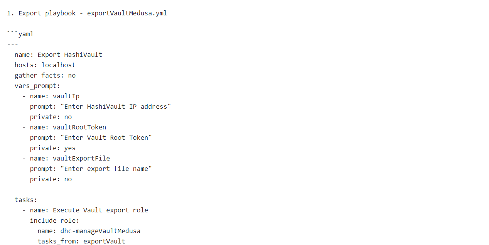
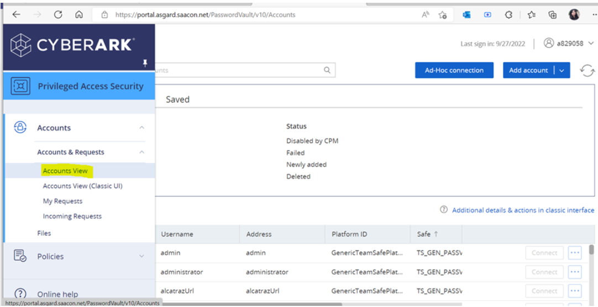
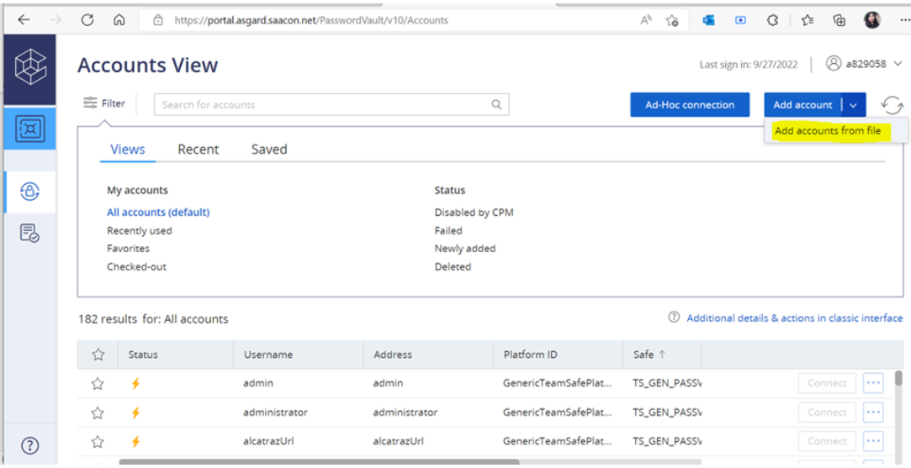
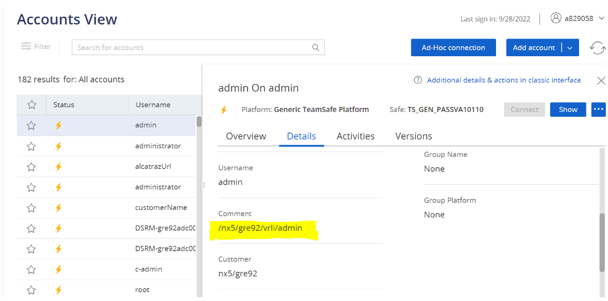
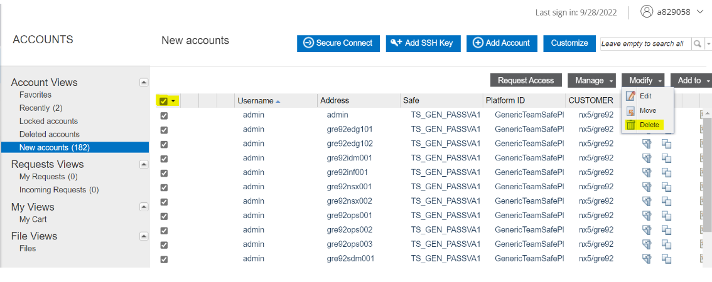

# Table of Contents

- [Table of Contents](#table-of-contents)
  - [Changelog](#changelog)
  - [Introduction](#introduction)
    - [Purpose](#purpose)
    - [Audience](#audience)
    - [Scope](#scope)
  - [HashiVault export using Medusa](#hashivault-export-using-medusa)
    - [exportVaultMedusa.yml](#exportvaultmedusayml)
  - [Upload file to CyberArk TeamSafe](#upload-file-to-cyberark-teamsafe)
  - [CyberArk limitations](#cyberark-limitations)

## Changelog

 |    Date    | Issue   | Author | Description |
 |------------|---------|-----------|--------|
 | 28.09.2022 |   CESVXR-698      | Shalu Devi | export secrets from HashiVault and uploading it to CyberArk teamsafe|

## Introduction

### Purpose

Upload credentials into CyberArk teamsafe.

### Audience

- VCS Engineers
- VCS Operations

### Scope

This document covers exporting secrets from HashiVault and importing them into CyberArk teamsafe.

## HashiVault export using Medusa

### exportVaultMedusa.yml

 This playbook is used to exports all the credentials from Vault.

 <b>Run playbook using command "ansible-playbook -vvv exportVaultMedusa.yml" and provide below inputs to the Playbook </b>

- <b>HashiVault IP</b>: Provide the HashiVault IP address 
- <b>Vault Root Token</b>: Enter the Root Token.(The token can be obtained by logging in to HashiVault with a service account). 
- <b>vault Export File</b>: Enter the file name for exported credentials 

 

 The same name specified while running the playbook will be used to produce a CSV encrypted file inside the home folder.

## Upload file to CyberArk TeamSafe

 Once the CSV file has been generated, we must manually upload it to the cyberArk by following the instructions below.

- Copy the Python script (decryptcsv.py) from path "role/files," together with the CSV-encrypted file generated in the home folder, to the local desktop. 
- Copy the key from the key file generated under home folder. File name would be the same as given during secrets export. 
- Run a Python script from your local desktop. You will be prompted to enter the copied key when prompted. The csv file will be decrypted and write it to the Cyberark.csv file. 
- Login to Saccon using link :  <https://portal.asgard.saacon.net/PasswordVault/v10/> 
- From the left pane, select Accounts -> Accounts View 

C. Select the arrow next to <b>"Add account"</b> button in the top right corner, then pick "Add account from file option" and upload the unencrypted csv file. 

As soon as the file is submitted, all the accounts are created and can be viewed from the left pane-> <b>"Account View"</b> or <b>"Accounts View(Classic UI)"</b>

CyberArk provides an optional field called "comment" that contains the path of secrets, allowing us to determine which password is associated with which application. Please refer the below screenshot.

d. The csv encrypted file and key file can be deleted from the home folder after the upload is complete.

## CyberArk limitations

<b>1.</b> Due to a CyberArk limitation, each upload will generate duplicate entries for the same user. Therefore, before uploading the new account, we must remove the old one.

 <b>Please follow the instructions below to delete the old account.</b>

- From the left side panel, select <b>Accounts -> Accounts View UI</b>. 
- Select "New Accounts" on the left side panel to view all previously submitted accounts. 
- Click on the checkbox which will select all the accounts and then delete them from all the pages. Refer below screenshot 

<b>2.</b> There is a potential that the csv file won't upload to CyberArk if any secret (password) contains the operator ",". Therefore, we must verify the entry again and change or eliminate the comma operator from secrets (passwords).
  
 <b>3.</b> All certificates (.pem files) have been excluded from the CSV file because secret fields do not support long data lengths, which results in failure when uploaded to the Cyberark teamsafe.
