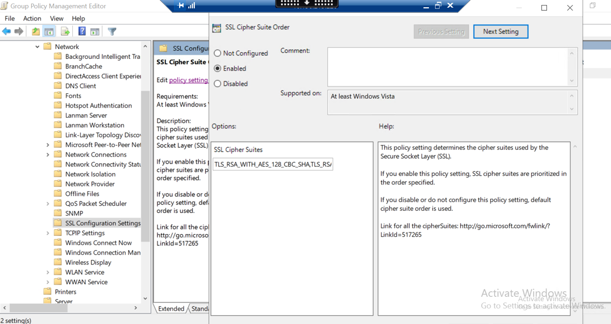

# Remove Weak Ciphers from GPO settings for Windows servers

## Table of Contents

- [Introduction](#introduction)
  - [Purpose](#purpose)
  - [Audience](#audience)
  - [Scope](#scope)
- [Prerequisites](#prerequisites)
- [Related Documents](#related-documents)
- [Remove weak ciphers from GPO settings Using Ansible](#remove-weak-ciphers-from-gpo-settings-using-ansible)
- [Validation Steps](#validation-steps)
- [Event Logs](#event-logs)
- [Rollback process](#rollback-process)

## Introduction

### Purpose

The purpose of this document is to define a standard process for disabling weak SSL/TLS cipher suites on all Windows servers using Group Policy Object (GPO). This ensures compliance with organizational and industry security standards such as CIS benchmarks, NIST guidelines, and internal hardening baselines. The process helps eliminate legacy and vulnerable encryption methods from the environment.

### Audience

- VCS Engineers
- VCS Architects

### Scope

This work instruction applies to all Windows-based systems managed under Active Directory. It includes:

- Identification of weak cipher suites
- Cleaning and updating the cipher list in GPO
- Automating the update using a Powershell script and Ansible
- Validating GPO propagation to domain-joined Windows servers

## Prerequisites

Before applying the cipher suite GPO hardening, ensure the following prerequisites are met:

- **Administrative Privileges**: You must be a domain admin or delegated GPO administrator to check these settings.
- **Windows Environment**: Only domain-joined Windows Servers are supported.
- **Powershell 5.1+**: Required to execute the cipher suite cleanup script.
- **Group Policy Management Console (GPMC)** must be available in AD.
- **Ansible Control Node** is available with access to Windows hosts via WinRM.
- **GPO Naming Convention**: GPOs must follow the naming standard `CustomerCode-AD-MemberServerBasic-v0007`.

## Related Documents

This document is a subset of Atos Technology Lifecycle Management (ATLM) artefacts. All documents are stored in the VCS documentation repository.

## Remove weak ciphers from GPO settings Using Ansible

A playbook created which is designed to centrally disable weak SSL/TLS cipher suites via Group Policy Object (GPO) and ensure these changes are enforced across all Windows servers in the domain.

### Playbook Overview

- **Playbook Name:** `disableWeakCiphersOnWindows.yml`
- **Role Name:** `dhc-disableWeakCiphersOnWindows`
- **Target Group:** Windows servers defined under `[windows]` inventory group
- **Execution Environment:** Ansible control node with `winrm` access configured for target servers
Execute the following playbook on *ans001* server from */opt/dhc/manage* folder, to remove weak SSL ciphers from GPO settings to apply it for Windows servers.

**Execute:**

```shell
ansible-playbook disableWeakCiphersOnWindows.yml
```

### What It Does

#### 1. **Prompt for Domain Credentials**

The playbook begins by prompting the operator for:

- A valid domain username in `dasId@domain.next` format
- The corresponding password (entered securely)

These credentials are used to authenticate and apply the changes on both the GPO and all target servers.

#### 2. **Run Role to Modify GPO**

- A custom role `dhc-disableWeakCiphersOnWindows` is included, which executes a Powershell script (`Update-CipherSuite.ps1`) that:
  - Reads the cipher list from the registry in the targeted GPO
  - Backs up the original list in `C:\temp`
  - Removes insecure cipher patterns like `RC4`, `CBC`, `DES`, `MD5`, etc.
  - Writes the updated, hardened cipher list back into the GPO

#### 3. **Store Credentials for Cross-Play Usage**

- The playbook dynamically adds a temporary `transferHost` to share the domain credentials between different play sections.
- This ensures secure reuse of the credentials without prompting again in the second play.

#### 4. **Apply GPO to All Windows Servers**

- The second play targets all Windows servers (`hosts: windows`) **excluding `rca001`**.
- It reuses the previously entered credentials and establishes WinRM connections using the `atos.dhc.connectionWrapper` role.
- The key task executed is:

```shell
- name: Force Group Policy update
  win_command: gpupdate /force
```

## Validation Steps

Once the playbook has been executed and the GPO changes are applied, follow the steps below to validate whether the weak SSL/TLS ciphers have been successfully disabled and the updated cipher suite list is in effect across the environment.

### 1. **Check the GPO for Updated Cipher Suite**

#### a. Open Group Policy Management Console

- Run `gpmc.msc` on any Domain Controller or management workstation.

#### b. Navigate to the Target GPO

- `Forest > Domains > <YourDomain> > Group Policy Objects > <CustomerCode>-AD-MemberServerBasic-v0007`

#### c. Review the Setting

- Go to:

```shell
Computer Configurations > Policies > Administrative Templates > Network > SSL Configuration Settings > SSL Cipher Suite Order
```



- Ensure **"SSL Cipher Suite Order"** is set and matches the expected filtered list (without weak ciphers such as `RC4`, `NULL`, `3DES`, `DES`, `CBC`, etc.).

### 2. **Check Registry on Target Windows Servers**

Run the following command in Powershell **as Administrator** on a domain-joined Windows server to verify the registry reflects the updated cipher list:

```shell
Get-ItemProperty -Path "HKLM:\SOFTWARE\Policies\Microsoft\Cryptography\Configuration\SSL\00010002" -Name "Functions"
```

Expected Output:
A list of strong cipher suites without any insecure patterns.

## Test Service Functionality

Perform the following tests to ensure that disabling weak ciphers hasn’t unintentionally broken key services:

- RDP login to the server
- IIS/HTTPS access
- LDAP over SSL (LDAPS)
- Application-specific endpoints that rely on TLS

## Event Logs

Check System Event Logs for Group Policy or TLS Errors

```shell
Get-WinEvent -LogName "System" | Where-Object { $_.Message -match "GroupPolicy" -or $_.Message -match "Schannel" } | Select-Object TimeCreated, Message -First 20
```

Check manually if the command doesn't work . Look for any TLS handshake failures or GPO application errors post-change

## Rollback process

In case of any issues after applying the cipher suite changes (e.g., application breakage, HTTPS errors, or TLS negotiation failures), the previously configured cipher list can be restored easily.

### Backup Location

- The playbook automatically creates a backup of the current cipher suite list before making changes.
- Backup files are saved under the following location on the Ansible control node or target system:

```shell
C:\temp<GPOName>-CipherSuite-Backup-<timestamp>.txt
```
