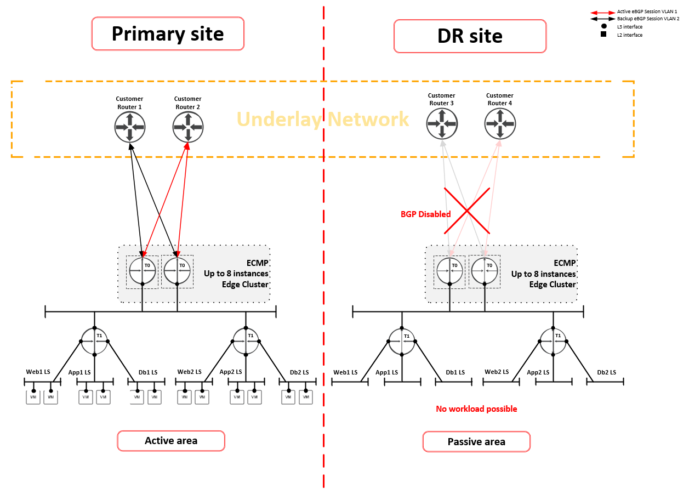
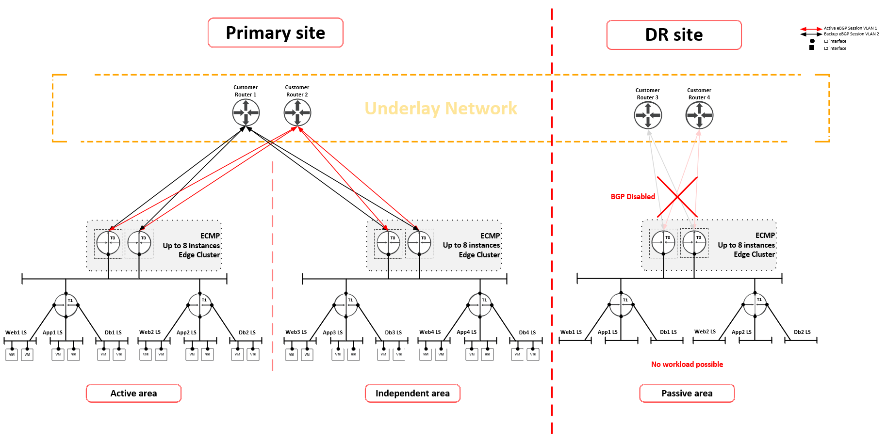
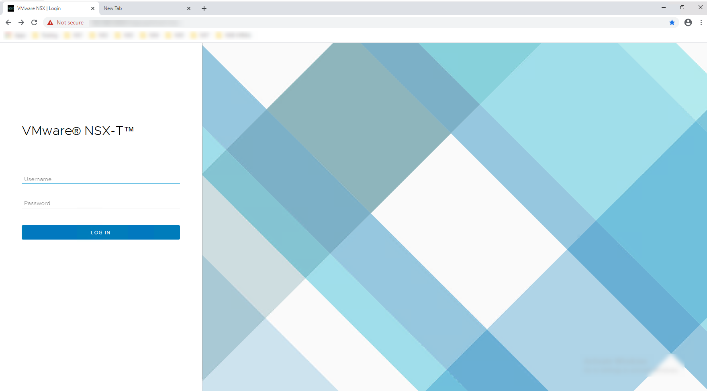
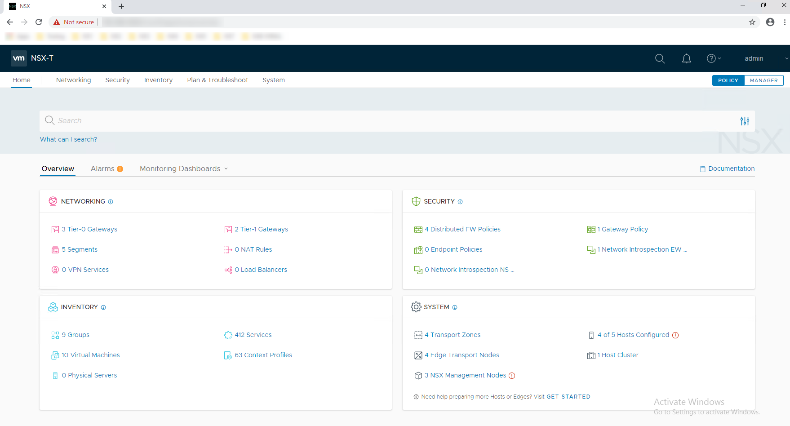
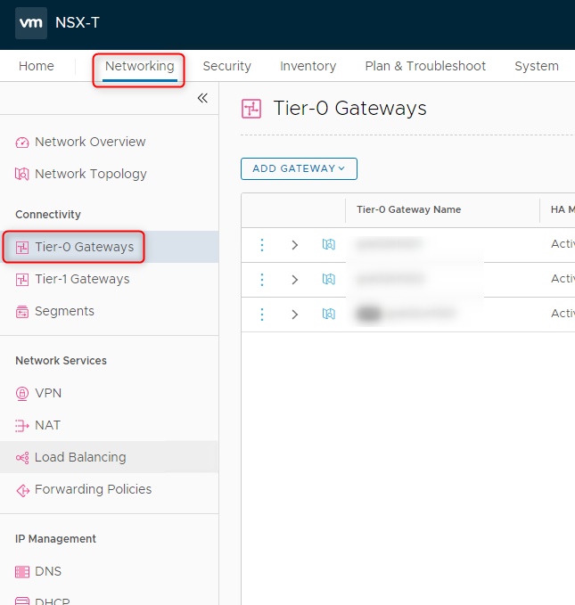
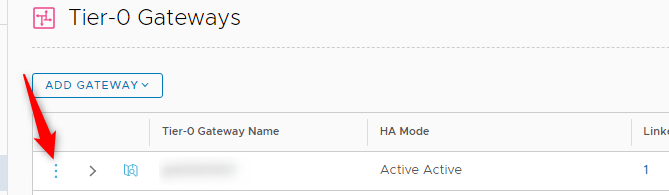
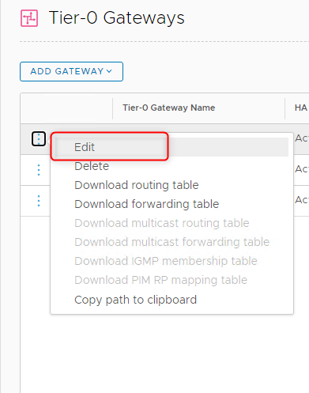
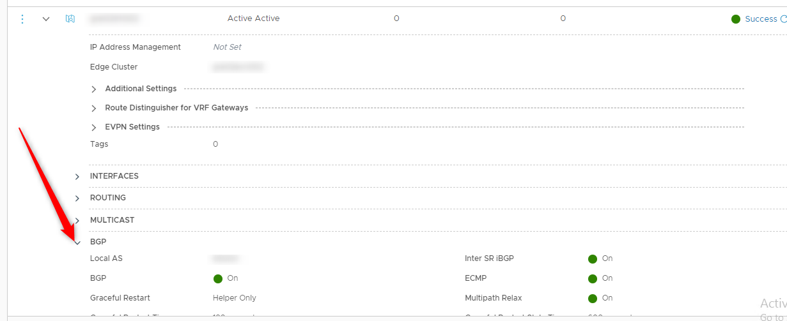
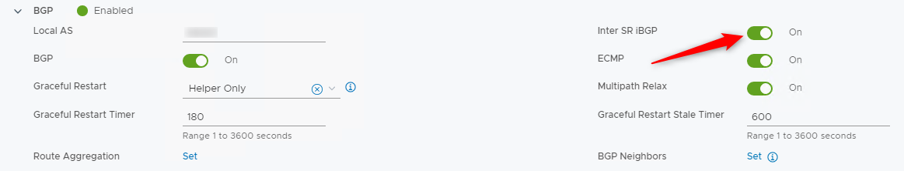
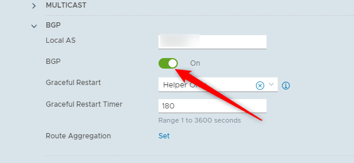

# Disaster Recovery SDN

# Table of Contents

- [Disaster Recovery SDN](#disaster-recovery-sdn)
- [Table of Contents](#table-of-contents)
- [Changelog](#changelog)
  - [Introduction](#introduction)
    - [Purpose](#purpose)
    - [Audience](#audience)
    - [Scope](#scope)
- [Workload Domain Description](#workload-domain-description)
  - [Active-Passive DR scenario](#active-passive-dr-scenario)
  - [Active-Passive DR Scenario with Independent Area](#active-passive-dr-scenario-with-independent-area)
  - [Active-Passive/Passive-Active DR scenario](#active-passivepassive-active-dr-scenario)
  - [Active-Passive/Passive-Active DR scenario with Independent Area](#active-passivepassive-active-dr-scenario-with-independent-area)
  - [Other designs](#other-designs)
- [Workload Domain DR integration steps](#workload-domain-dr-integration-steps)
  - [Disable BGP on T0 Logical Router in Passive Area](#disable-bgp-on-t0-logical-router-in-passive-area)
- [Workload Domain Switchover steps](#workload-domain-switchover-steps)
  - [Enable BGP on T0 Logical Router in Passive Area](#enable-bgp-on-t0-logical-router-in-passive-area)

# Changelog

|   Date   |    Author    | Issue | Description |
|----------|--------------|-------|-------------|
| 30.09.2020 | Radoslaw Dabrowski | N/A | Draft of document creation |
| 05.01.2021 | Robert Kaminski | N/A | Adjusted switch over and integration steps |
| 01.06.2022 | Lukasz Bienkowski | DHC-4774 | Added steps for turn off inter SR iBGP before BGP disable |

## Introduction

### Purpose

Perform a switchover to the DR site from perspective of the SDN and NSX-T

### Audience

- VCS Operations

### Scope

The blueprint assumes that the reader has reasonable grasp of VCS as well as familiarity with architecture principles including SDN and DR.

In scope:

- Switchover to DR site

# Workload Domain Description

VCS is offering Workload Domain for customer networks. Those Workload Domains can contain various designs based on NSX-T Edges, Logical Routers and Logical Switches as well as corresponding components. On top of the standard design, there are also DR designs which are described in details in SDN LLD lldSoftwareDefinedNetworks.md. Mentioned designs are as follows:

- **Active-Passive DR scenario** (A/P one-direction - passive site resources are are not used for active workload, standby for the failover)
- **Active-Passive DR Scenario with Independent Area**
- **Active-Passive/Passive-Active DR scenario** (A/P bi-direction - Customer workload runs on both sites, each site has active area and passive area on the other site)
- **Active-Passive/Passive-Active DR scenario with Independent Area**

Key point here is to understand all of those designs in front of this work instruction.

  >IMPORTANT NOTE: Following part of the documentation is saying that Active Area should be reflected 1:1 into Passive Area. There is one exception - T0 Logical Router Uplinks IPs which should be unique for all sites and areas. It's more common that T0 on DR site will use different VLAN/Network to form BGP adjacency anyway.

Following sections are providing default designs which might be used in VCS:

## Active-Passive DR scenario

This scenario is presenting design where Primary site contains single Active Area which is handling all customer workload on this site, including all corresponding components. All logical switches, load balancers, Logical Routers, NATs, VPNs are configured on those components. Of course by doing microsegmentation, there is a way how workload can be virtually separated which is one of the most common build for all customers. This Primary site is also source and destination of all customer egress or ingress traffic respectively.
DR site is an environment which is prepared as a mirror copy of the Primary Site, this job is required to be done manually. All changes on Primary Site should be reflected to the DR site. In this scenario, there is only one Passive Area, which is 1:1 reflection of the Active Area in Primary site (including DFW rules, Logical Routers, Logical Switches, Load Balancers, VPNs, etc.). This environment is required to have only one exception from this rule.

In order to prepare environment before disaster happen, there is a need to disable T0 Logical Router BGP protocol on DR site (Passive area) to avoid forming BGP connectivity with Customer Router and advertise same routes as Primary Site is doing. This is necessary step which cannot be skipped. As well, there is an restriction, because of BGP disablement. Restriction says - there shouldn't be any workload attached to the Passive Area.

In order to switchover to DR site after disaster happen, there is a need to enable (previously disabled) BGP on Logical Routers T0. To avoid situation that old site will became operational later on its required to disable BGP adjacency on Customer Router toward old primary site.

There is a need to disable Inter SR iBGP before turning BGP off as this is dependent feature together with ECMP and BGP status. Make sure that Inter SR iBGP and ECMP are enabled back when BGP is going to be turned on again.

If there is a need to host actively workload on DR site, please take a look into other scenarios.

This design is automatically build by default in VCS build phase, and should be adjusted if necessary.

## Active-Passive DR Scenario with Independent Area

This scenario is very similar to the previous one, with a fact that there is an additional Independent Area. This Area contains workload which is not going to be backed up by DR site, and related components are not reflected to the DR site. Of course there is possibility to create Independent Area on DR site, which allows DR site to contain active workload while waiting for disaster (there should be calculation done if resources would be enough for Independent Area workload and workload restored after disaster. Independent Area is not required to have BGP shut down due to fact it's using unique IP address scheme.

Same as before in order to switchover to DR site after disaster happen, there is a need to enable (previously disabled) BGP on Logical Routers T0. To avoid situation that old site will became operational later on its required to disable BGP adjency on Customer Router toward old primary site.

## Active-Passive/Passive-Active DR scenario

This scenario provides most efficient way to protect workload on both locations. Each site is containing their own Active Area, which is reflected 1:1 into another site (Passive Area). This scenario assumes that there is situation where Customer would require Active-Passive/Passive-Active DR scenario, where active workload is restored after disaster on another site, no matter if it is Primary Site which is experiencing disaster or DR one. In both situations, workload can be restored after disaster inside infrastructure which was configured in the same way on another site. This requires 1:1 configuration mapping between sites, where Active Area is protected by Passive Area on another site, and vice versa.
In the same way as in previous steps, this one require manual synchronization.

In order to switchover to DR site after disaster happen, there is a need to enable (previously disabled) BGP on Logical Routers T0 in Passive Area. To avoid situation that old site will became operational later on its required to disable BGP adjacency on Customer Router toward old primary site.

From perspective of scalability, same rules are applied.

## Active-Passive/Passive-Active DR scenario with Independent Area

This section is not covering picture because it would not be much readable at this scale.

Previous (Active-Passive/Passive-Active) scenario can be extended with Independent Area. This means that i.e. primary site will contain Active Area, Passive Area and Independent Area at the same time. From which Active Area will contain 1:1 configuration mapping on another site, Passive Area is 1:1 reflection of the Active Area from second site whereas Independent Area is not reflected and it's lost in case of disaster.
In the same way as in previous steps, this one require manual synchronization.

From perspective of scalability, same rules are applied.

## Other designs

Apart of the above designs, there is an option to scale up or down components. I.e.:

- one T0 logical router can be termination point for fifteen T1 Logical Routers,
- multiple Active Areas located in primary site for some sort of multi-tenancy (including additional Edges),
- multiple Independent Areas in primary site, where is only one Active Area

Those were only examples, but scaling section is covered in SDN LLD.

# Workload Domain DR integration steps

A/P does not use stretched networks between sites. This solution brings a lot of limitation, no GO for long distance and actually is reserved for VCS active-active solution, not active-passive.
By default SRM network mapping is configured to the same network segment on the passive site, the routing to passive/recovery site must be disabled. VCS manages this by disabling BGP on NSX-T T0 router in the passive area.

To do that follow those steps:

## Disable BGP on T0 Logical Router in Passive Area

1. Login to Workload NSX-T manager via GUI

   Open web browser and type `https://< NSX-T Manager IP for Workload domain >` to open NSX-T GUI:  
   
   Type login and password, and hit "LOG IN" button.  
   NSX-T now enter to the main page showing Overview page:  
   

2. Navigate to T0 Logical Routers:

   From here navigate to Networking -> Tier-0 Gateways:  
   

3. Select Tier-0 Logical Router from Passive Area and click on three dots next to it:

   

4. Edit Tier-0 Logical Router:

   

5. Expand BGP section:

   

6. Click on the switch button next to Inter SR iBGP to disable it:

   

7. Click on the switch button next to the BGP to disable BGP:

   

8. Repeat above steps for all Passive Areas.

9. Now all designed Passive Areas became truly Passive.

# Workload Domain Switchover steps

Independently form version of the scenario picked the DR switchover process is similar.

By default SRM network mapping is configured to the same network segment on the passive site. After the failover the routing to passive/recovery site must be enabled.

To do that follow those steps:

## Enable BGP on T0 Logical Router in Passive Area

1. Login to Workload NSX-T manager via GUI
   Open web browser and type `https://< NSX-T Manager IP for Workload domain >` to open NSX-T GUI:

   

   Type login and password, and hit "LOG IN" button.

   NSX-T now enter to the main page showing Overview page:

   

2. Navigate to T0 Logical Routers:
   From here navigate to Networking -> Tier-0 Gateways:

   

3. Select Tier-0 Logical Router from Passive Area and click on three dots next to it:

   

4. Edit Tier-0 Logical Router:

   

5. Expand BGP section:

   

6. Click on the switch button next to the Inter SR iBGP to enable it:

   

7. Click on the switch button next to the BGP to enable BGP:

   

8. Repeat above steps for all Passive Areas.

9. Now Passive Areas became Active Areas.

10. To secure routing to the failed site, where the VMs might be still running, it's recommended to DISABLE BGP on the T0 router on the failed site (previous active area/protected site), to prohibit unpredicted connection to the workload that should be already powered OFF.
