# DR customization for Aviva

# Table of Context

- [DR customization for Aviva](#dr-customization-for-aviva)
- [Table of Context](#table-of-context)
- [Changelog](#changelog)
- [Introduction](#introduction)
- [Prerequisites](#prerequisites)
- [Aviva upgrade](#aviva-upgrade)
  - [LUNs](#luns)
  - [Datastores](#datastores)
  - [Datastore cluster](#datastore-cluster)
  - [Tags](#tags)
  - [vSphere Storage Policies](#vsphere-storage-policies)
  - [SRM Protection Group](#srm-protection-group)
  - [SRM Network Mappings](#srm-network-mappings)
  - [vRA Network Profile](#vra-network-profile)
  - [vRA Storage Profiles](#vra-storage-profiles)
  - [vRA Blueprint](#vra-blueprint)
  - [VRA Service Broker form](#vra-service-broker-form)
  - [vRO actions](#vro-actions)
  - [Day1 SSR](#day1-ssr)
  - [Day2 SSR](#day2-ssr)

# Changelog

| Date       | Issue     | Author          | TOS | Description                                              |
|------------|-----------|-----------------|-----|----------------------------------------------------------|
| 08.09.2023 | DHC-10600 | Robert Kaminski |     | Customization process excluded from standard upgrade doc |
| 18.09.2023 |           | Robert Kaminski |     | vRO actions, Day1 and Day2 SSR validation                |
| 24.10.2023 | VCF-10602 | Robert Kaminski |     | Review and adjustments                                   |

# Introduction

Existing Aviva DR solution working for DPC is not in line with VCS design. There is a must to adopt VCS components configuration to meet Aviva requirements.

| Document                                                                 |
|--------------------------------------------------------------------------|
| [LLD Disaster Recovery](../design/lldDisasterRecovery.md)                |
| [LLD Software Defined Networks](../design/lldSoftwareDefinedNetworks.md) |
| [WI A/P Integration](wiIntegrateActivePassiveDr.md)                      |
| [WI A/P Failover](wiFailoverActivePassiveDr.md)                          |
| [WI Disaster Recovery SDN](wiDisasterRecoverySdn.md)                     |
| [SRM upgrade to 8.7](wiSrmVsrUpgradeTo8.7.md)                            |

# Prerequisites

The initial assumption is that the DR integration based on [WI A/P Integration](wiIntegrateActivePassiveDr.md) document, was fully performed based on default VCS design boundaries.

Site Recovery Manager upgrade to version 8.7 or higher, all storage policy protection groups must be migrated to regular array-based replication protection groups. Refer to [SRM upgrade to 8.7](wiSrmVsrUpgradeTo8.7.md) document.

# Aviva upgrade

Taking into account the overall complexity of the Aviva customisation, for the better understanding the upgrade will be presented from the perspective of the single SRM Protection Group to which deployed VM will be assigned to.

Overall steps:

- create LUNs
- create datastores
- create datastore clusters
- create tags
- create vSphere storage policies
- create SRM protection group
- create SRM network mappings
- create vRA network profiles
- create vRA storage profiles
- create vRA blueprint
- adopt vRA service broker form
- adopt VRO actions
- validation of Day1 and Day2 SSRs

>NOTE: Aviva DPC account uses precious metals for several different categories, which makes naming convention very misleading.
> For example:
>
> - RPO - Recovery Point Objective values set on the array level, which effectively determine time sync values. You can see this for example LUNs names, PG names
>   - goldplus - synchronous replication
>   - gold - asynchronous replication - RPO 15min
>   - silver - asynchronous replication - RPO 1h
>   - bronze - asynchronous replication - RPO 8h
> - storage class - IOPS performance of datastores
> - SLA for VMs.
>
> As an example you may see datastore cluster name `bbp02-c01-cluster01-sc-gold-repl-Bronze_Non_Prod_BBP_LBG` where `gold-repl` reflects storage class and `Bronze_Non_Prod_BBP_LBG` refers to RPO 8h date time sync for Protection Group. Be conscious of it. VCS Engineering has requested to change the naming convention to more easily determine the classification, however this will be handled via an improvement change later.

## LUNs

Aviva is going to use NetApp storage that will be operated by dedicated Atos storage team.

Number of LUNs must be requested to fulfil the initial requirements. Please take into account:

- One LUN is one Datastore on the vSphere. Number of LUNs and their size depends on the Application(s) requirements that is reflected logically by SRM Protection Group and mapped datastores. At the moment of writing this WI there is no information what is the minimum and maximum LUN size agreed with NetApp storage team.
- **It is strongly recommended to group LUNs of the same storage class in consistency groups**. Consistency Group (CG) prohibits spreading datastores/LUNs to multiple SRM Protection Groups and ensures that the read/write control policies of the multiple LUNs on a storage system are consistent. For the record, previously for DPC every CG was created following the rule: 200GB Journal LUN (thick type) per every 5 TB Data LUN (thin type). Which means that if CG is built from three 5 TB data LUNs there are three 200 GB Journal LUNs used. There is no confirmation the same would be followed for VCS on NetApp. It occurred *consistency groups* are not available for asynchronous replication (planned in the future releases), hence to mitigate the issue, storage team is going to create LUNS for the particular storage class on a bigger volume block. Volume block is being replicated as one, which simulates - is alike - consistency group functionality. Volume block may be extended on the fly not affecting existing data.
- **SRM Protection Group may contain multiple CGs**. For example *ProtectionGroup1* may include *ConsistencyGroup-Gold* and *ConsistencyGroup-Silver* to allow using disks of different storage class via VMs placed in that PG. **Treat this functionality with caution**. For example in a large size databases, the user data and logs are usually stored on different disks. If those disks are spread across datastores of different storage classes, which effectively will be stored on LUNs from different consistency groups the database, then ths data vs logs might be inconsistent after failover.

Example below from VCS PoC. To secure storage for Application1 that will reflect Protection Group named *gre22-gre12-PGApplication1* storage team created 3 Gold LUNs (1,2TB in total) grouped in Consistency Group named *CG-gre22-App1gold-repl* and 2 Silver LUNs (400GB in total) with consistency group named *CG-gre22-App1silver-repl*.

Note: VCS used DellEMC Unity for test, however NetApp LUN creation and CG mechanism works very similar. Additionally there is no agreed naming convention on the level of storage, this is just an example.

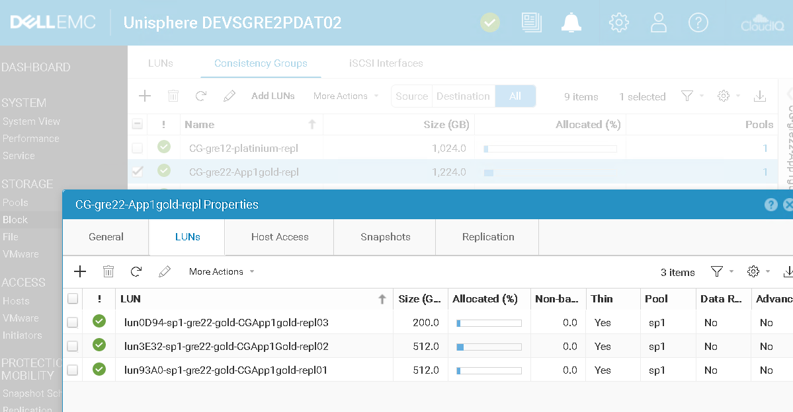

Figure1: Consistency Group for App1 - 3 LUNs of gold storage class

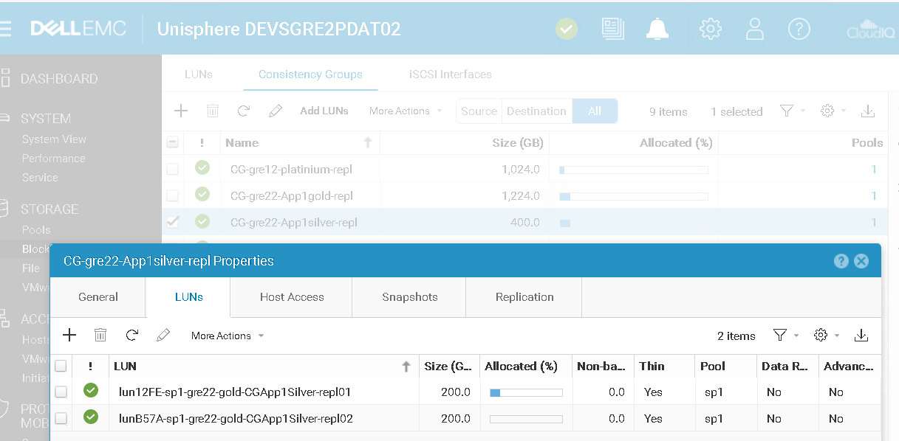

Figure2: Consistency Group for App1 - 2 LUNs of silver storage class

## Datastores

Based on our example the final configuration for *Application1* protection group is to get two Datastore Clusters.

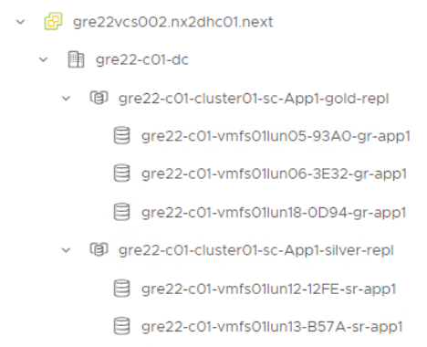

Figure3: Datastore Clusters for App1 - 3 LUNs of gold storage class and 2 LUNs of silver storage class

Each datastore and each datastore cluster must have a set of DR related tags assigned from the expected categories.

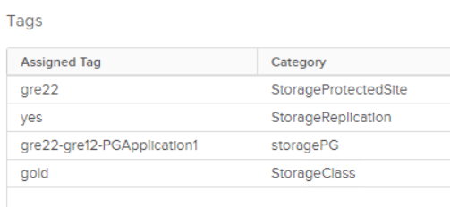

Figure4a: REPLICATED Datastore tags.

| Category name        | Description                                                      | Associable Entities   | Expected/Example value |
|----------------------|------------------------------------------------------------------|-----------------------|------------------------|
| StorageProtectedSite | Indicates what is the origin protected site location             | StoragePod, Datastore | `<locationSite>`       |
| StorageReplication   | Indicates if storage replication is on storage array level       | StoragePod, Datastore | yes                    |
| StorageClass         | Indicates which storage class is used                            | StoragePod, Datastore | silver/gold            |
| storagePG            | Indicates to which SRM protection group datastore is assigned to | StoragePod, Datastore | Protection Group name  |

>IMPORTANT: NON-replicated datastores must have two tags assigned ONLY: `StorageReplication` equals `no` and `StorageClass` with proper value.

Figure4b: NON-REPLICATED Datastore tags.

| Category name      | Description                                                | Associable Entities   | Expected/Example value |
|--------------------|------------------------------------------------------------|-----------------------|------------------------|
| StorageReplication | Indicates if storage replication is on storage array level | StoragePod, Datastore | no                     |
| StorageClass       | Indicates which storage class is used                      | StoragePod, Datastore | silver/gold            |

---

  > **Note**:
  >
  > `StoragePod` entity reflects to `Datastore Cluster` associable object type.
  >
  > `Multiple Cardinality` *false* value means `One tag` per object is set. We need to prevent assigning many tags of the same category here.
  >
  > 
  > 

---

First add prepared by storage team LUNs as datastores. This is manual task. Use *New Datastore* action on vCenter: choose "VMFS" datastore type, provide datastore name `< locationCode >-< type >-< storageType>< lunNumber >` (validate with standard [VCS naming convention doc](../design/namingConvention.md)), choose host to scan accessible LUNS, make sure you select the correct FC disk by validating the WWN/NAA number and size, assign full space, leave default block size.

>Note: Datastore naming convention must remain intact, however you may add more information as suffix if required without harming VCS automation. For example to make it more human readable, you may add *Protection Group name* as suffix.

## Datastore cluster

Second is to create datastore clusters, move datastore to it. This can be achieved in two ways.

- One way to go is to use *createVmfsDatastoresClusters.yml* from [On-Prem Tenant Builder](wiTenantBuilderVraOnPrem.md#create-datastore-clusters-and-storage-tags) work instruction, by filling in the *storagePoliciesVmfs* section as described in [wiCustomerInfraVars.md](wiCustomerInfraVars.md) document. This procedure creates datastore clusters, assigns to them provided datastores and creates DR tags categories and tags values (all except *storagePG*, this one is Aviva specific and must be created manually)
- Other way to go is fully manual. This job contains datastore cluster creation, datastore assignment.
  
  Use *New Datastore Cluster* action on vCenter, provide name, turn ON Storage DRS, set DRS automation to fully automated and leave to use cluster settings for all. Enable I/O metrics for SDRS with defaults if not specified differently per application requirements. Select datastores and complete.

>Note: [Datastore cluster naming convention](../design/namingConvention.md) must remain intact, however you may add more information as suffix if required without harming VCS automation.

## Tags

Third is to assign to datastores and datastore cluster DR tags.

If *createVmfsDatastoresClusters.yml* playbook was used then *StorageProtectedSite*, *StorageReplication* and *StorageClass* should already been in place. The only missing is *storagePG* which indicates exact SRM Protection Group name to which datastore will be assigned to. This tag is strictly Aviva customization related.

>REMINDER: NON-replicated datastores and datastore cluster must have two tags assigned ONLY: `StorageReplication` equals `no` and `StorageClass` with proper value.

In case you've decided to go with manual datastore cluster creation, you need to address all tags on both clusters and datastores members. Refer to DR tags tables: Figure4a and Figure4b as an example.

## vSphere Storage Policies

Site Recovery Manager 8.5.x is the last general version to support storage policy protection groups (SPPG). SRM 8.7 does not support SPPG, however we still need storage policy to perform a correct VM datastore placement with Day1 SSR on VRA as well as Day2 actions like *add disk*.

Refer to [naming convention](../design/namingConvention.md) document, search for `vCenter Objects - Storage Policy for tag-based placement` chapter.

For Aviva, standard name should be extended to `< locationCode >-< storageType >-< type >-< clusterNumber >-< storageClass >-< replication flag >-< SRM ProtectionGroup name >` by adding reference to protection group name as suffix.

In our example we need two Storage policies that maps via tags to gold and silver datastore clusters dedicated for `gre22-gre12-PGApplication1`.

- gold replicated storage policy for Application1 - named *gre22-vmfs-c01-cluster01-gold-repl-gre22-gre12-PGApplication1*. Please focus on rules where you need to configure tags. Tags determines datastore placement. As validation check the storage compatibility. This has to match with you gold datastore cluster for App1.

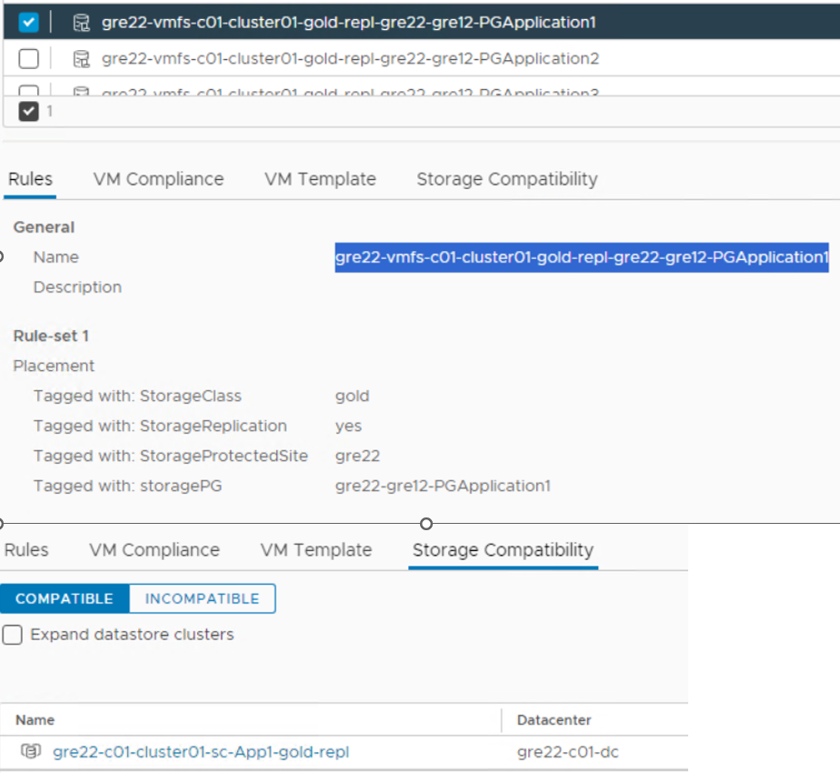

Figure5: Gold class Storage Policy for Application1.

- silver replicated storage policy for Application1 - named *gre22-vmfs-c01-cluster01-silver-repl-gre22-gre12-PGApplication1*. Again, focus on proper rules and storage compatibility is pointing to expected datastore cluster.

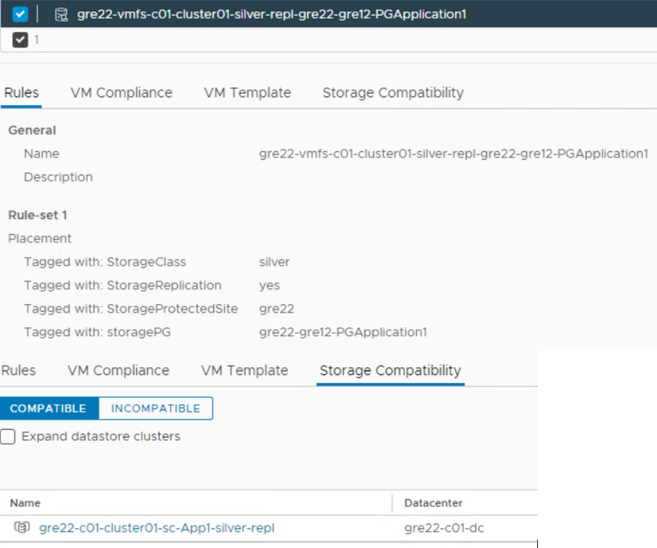

Figure6: Silver class Storage Policy for Application1.

## SRM Protection Group

This work instruction assumes you have initial SRM configuration in place. The array based replication is established, all mappings are in place etc.

Before you attempt to new PG creation it is recommended to go to SRM *Array Pairs* and run devices discovery, to make sure SRA (site recovery adapter) is aware of new LUNs and replication status.

Next, go to SRM Protection Group tab and choose "New Protection Group" action. Give it a name, there is restriction for it, but it is recommended to use `< protectedSite >-< recoverySite >-< PGname >`, in our example this would be *gre22-gre12-PGApplication1*. Give optional description if needed to add more details. Choose direction, from *protectedSite* to *recoverySite*. Type must be *Datastore groups (array-based replication)*. Select both silver and gold datastore clusters for Application1. Provide valid existing recovery plan or create a dedicated one. Each protection group must be assigned to at lease one recovery plan. Depending on the failover strategy the recommendation is to create *AllFromSiteAtoSiteB* and dedicated to satisfy planned failover of the created protection group.

On the attached below print screen you may observe how SRA group datastores that are part of the same storage consistency group.

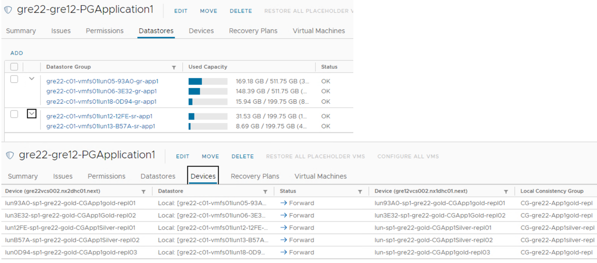

Figure7: View on Protection Group datastores and devices.

## SRM Network Mappings

Aviva does not stretch the network between sites. After failover VMs are mapped to different subnets. If there are dedicated networks created to satisfy new Protection Group there is a must to create a network mapping in `SRM -> Configure -> Network Mappings`.

## vRA Network Profile

vRA define Network Profiles that are discovered from VCS vSphere environment. If new network were created to satisfy new Protection Group this must be reflected in Network Profiles.

Please note the network profile is mapped to blueprint *net_tag* section via capability tag named *CloudNetwork*

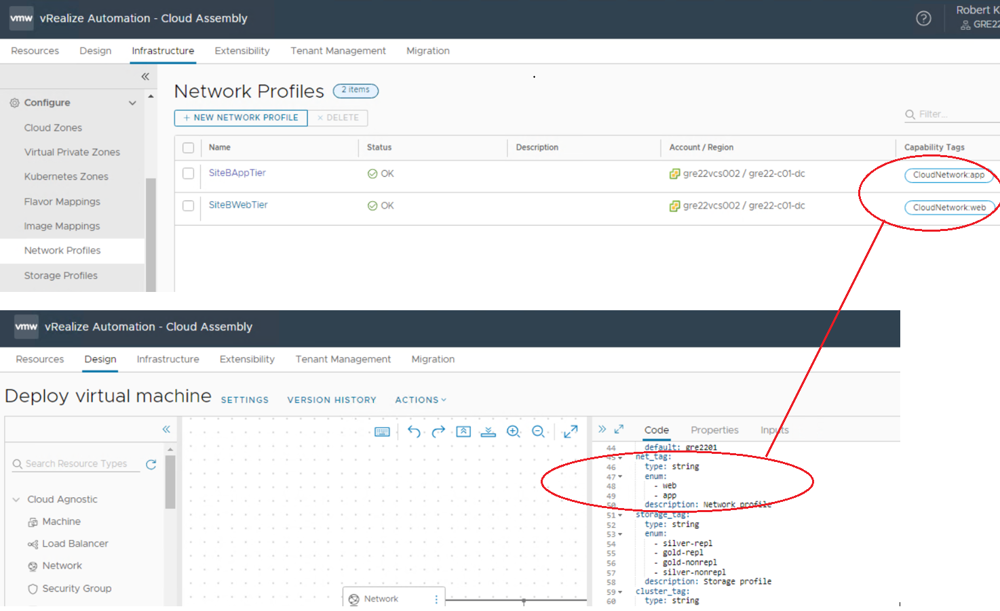

Figure8: VRA network profile capability tag

## vRA Storage Profiles

VRA Storage Profile maps VCS Compute Vcenter datastore clusters based on capability tags and vCenter storage policies.

Go to `vRA Cloud Assembly -> Infrastructure -> Storage Profiles -> NEW STORAGE PROFILE`.

Provide storage profile name. Refer to [naming convention](../design/namingConvention.md) document, search for `vRA Cloud objects - Storage Profile for VMFS on FC (SAN)` chapter. For Aviva, standard name should be extended to `cluster< clusterNumber >-< type >-< replication flag >-< SRM Protection Group name >` by adding reference to protection group name as suffix.

Provide storage policy.

While clicking on Datastore cluster you should observe the storages available via assigned storage policy. This is a good validation. You can leave it empty, but if you decide to confirm datastore selection then this should be always a datastore cluster, never a single datastore to not loose a DRS functionality.

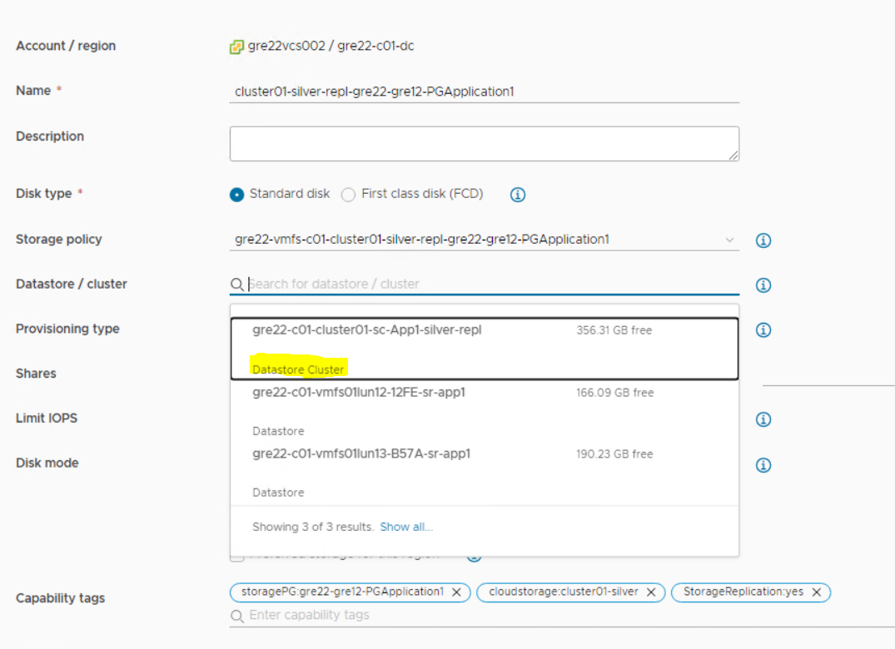

Figure9: VRA storage profile for replicated silver class and protection group for App1

Set provisioning type to thin.

Set capability tags. Tags are **case sensitive** and it's mandatory to set the following three:
`StorageReplication:yes`, `cloudstorage:cluster01-<storageClass>`, `storagePG:<SRM Protection Group name>`. Capability tags are very important to translate Day1 request needs to satisfy datastore placement depending on provided storage class and protection group name when DR protection is enabled.

Number of Storage Profiles must reflect number of vSphere Storage Policies, this is one to one mapping.

Example of *Silver* replicated for *gre22-gre12-PGApplication1* protection group.

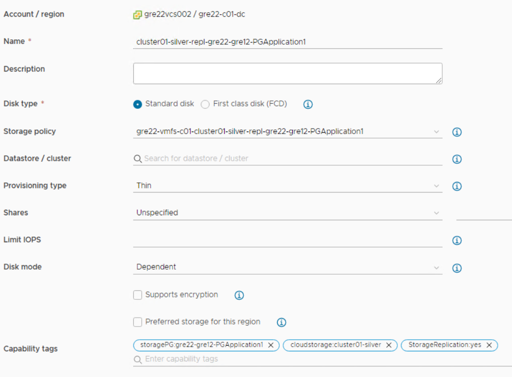

Figure10: VRA storage profile for replicated silver class and protection group for App1

Capability tags are set on vRA level and allow to choose a proper vRA Storage Profile. vRA Storage profile maps resources to VCS compute workload using vSphere Storage Policies. Vsphere Storage Policies are tag based that determine the compatible datastores.

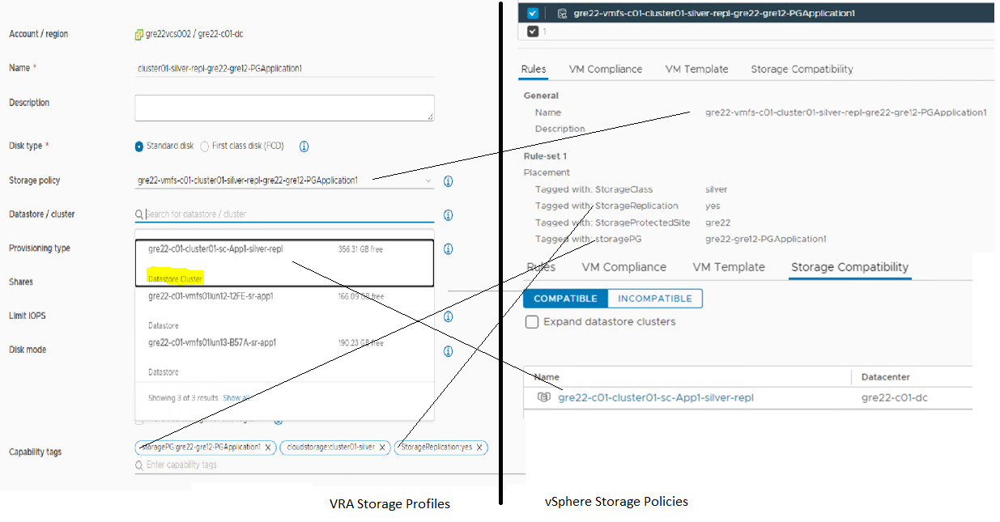

Figure11: VRA storage profile for replicated silver class and protection group for App1

Aviva customization requires additional capability tag *storagePG:* on vRA and additional vSphere tag category name *storagePG*. These are objects on a different components but must contain the same name and value.

## vRA Blueprint

Blueprint is a specification for a virtual machine. We need to adjust machine attributes specific for DR.

Go to `Cloud Assembly -> Design -> Cloud Templates ->` enter `Deploy virtual machine` blueprint.

In a *code* window you need to adjust the following sections:

---

- `storage_tag`

``` json
    storage_tag:
    type: string
    enum:
      - silver-repl
      - gold-repl
      - gold-nonrepl
      - silver-nonrepl
    description: Storage profile
```

*Storage_tag* enum value is build like `<storageClass>-<repl/nonrepl>`. Based on our example, we created 2 datastore clusters, one gold replicated and one silver replicated, hence we need values `gold-repl` and `silver-repl`.

- `drProtectionGroup_tag` and `storagePG`

Change *drProtectionGroup_tag* to include a single line with value `na` only, set the same for default. This tag is by default used for VSAN solution and must be kept in such a minimum settings to eliminate adjustments of hidden DR tab in Service Broker form later on.

```json
  drProtectionGroup_tag:
    type: string
    enum:
      - na
    default: na
```

Adopt *storagePG* to include SRM Protection Group name. This must be exact match. Keep `na` value specified and set in default.

``` json
  storagePG:
    type: string
    description: 'storageProfile, specifically SRM protectionGroup capabilityTag'
    enum:
      - gre22-gre12-PGApplication1
      - gre22-gre12-PGApplication2
      - gre22-gre12-PGApplication3
      - gre22-gre12-PGApplication4
      - na
    default: na
```

- `storage constraints` reflect logic for storage constraints capability tags. Match values from the below example.

```json
  Cloud_Machine_1:
    type: Cloud.Machine
    properties:
      remoteAccess:
        authentication: '${input.remoteAccessType}'
        username: '${input.remoteAccessUser}'
        password: '${input.remoteAccessCreds}'
      image: '${input.Image}'
      flavor: '${input.flavor}'
      name: '${input.VM_prefix}'
      newName: '${input.MachineName}'
      storage:
        constraints:
          - tag: 'cloudstorage:${split(input.cluster_tag, "-")[2] + "-" + split(input.storage_tag, "-")[0]}'
          - tag: '${input.drEnabled_tag == "no" ? "StorageReplication:no" : "StorageReplication:yes"}'
          - tag: 'storagePG:${input.storagePG}'
```

- `tags`

Tag section add tags to provisioned VMs.
Check all and adopt when needed. Especially focus on keys:  `UHC-SN-DR-PROTECTION-GROUP` and `UHC-SN-CLUSTER` if matches the values with the below example.

```json
      tags:
        - key: backupPolicy
          value: '${input.backupPolicy_tag}'
        - key: owner
          value: '${env.requestedBy}'
        - key: tenant
          value: gre22IDM002
        - key: project
          value: prd002
        - key: UHC-SN-DISASTER_RECOVERY
          value: '${input.drEnabled_tag}'
        - key: UHC-SN-DR-PROTECTION-GROUP
          value: '${input.drEnabled_tag == "yes" ? input.storagePG : "na" }'
        - key: UHC-SN-DR-PRIORITY-GROUP
          value: '${input.drEnabled_tag == "yes" ? input.drPriorityGroup_tag : "na" }'
        - key: UHC-SN-DR-RPO
          value: '${input.drEnabled_tag == "yes" ? input.drRpo_tag : "na" }'
        - key: UHC-SN-CLUSTER
          value: '${split(input.cluster_tag, "-")[0] + "-" + split(input.cluster_tag, "-")[1] + "-" + split(input.cluster_tag, "-")[2]}'
        - key: UHC-SN-MANAGED
          value: '${input.ManagedOs == true ? "Yes" : "No"}'
        - key: clusteredVm
          value: '${input.WSFC_tag == true ? input.WSFC_tag : "na" }'
```

- `net_tag` make sure you have a match between vRA network profiles mappings using capability tag name *Cloud Network* and the blueprint.


Figure8: VRA network profile capability tag

---

Click `VERSION` to save changes with new version number. Mark *Release this version to the catalog* checkbox.

Click `VERSION HISTORY` and *UNRELEASE* the previous blueprint version.

## VRA Service Broker form

This section is to adjust *Deploy virtual machine* catalog item for DR changes.

First we need to import new blueprint version. Go to `Service Broker -> Content&Policies -> Content Sources`, edit the source named `<project> blueprints`. Click `SAVE & IMPORT`.

Next go to `Service Broker -> Content&Policies -> Content`. Click three dots next to *Deploy virtual machine* and choose `Customize form`.

The goal is to update form with a new DropDown field with *storagePG* input.

Trace on the left hand site `Request inputs -> Schema Element` *storagePG* input and drag it to General sheet. Put it next to *Storage class* DropDown menu. Change label to for example *Assign to SRM Protection Group*, choose display type as *DropDown*.

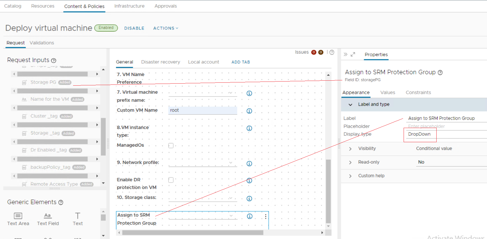

Figure12: Service Broker form configuration.

Next adopt `*Visibility*` to conditional value with two expressions:

1. IF `DR Enabled_tag` equals `Yes` set value `Yes` - it means show SRM Protection Group dropdown when VM is set to be dr enabled.
2. If `DR Enabled_tag` equals `No` set value `No` - it means hide SRM Protection Group dropdown when VM is set to be dr enabled.

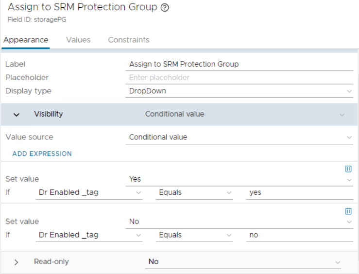

Figure13: Service Broker form configuration.

Next adopt *Values*, set default value to `na`.

Set in *Value options* section all the source values. This must match the *storagePG* enum section in the blueprint, all except `na` which is not an allowed value for storagePG but allow to satisfy SB form for non-replicated VMs.

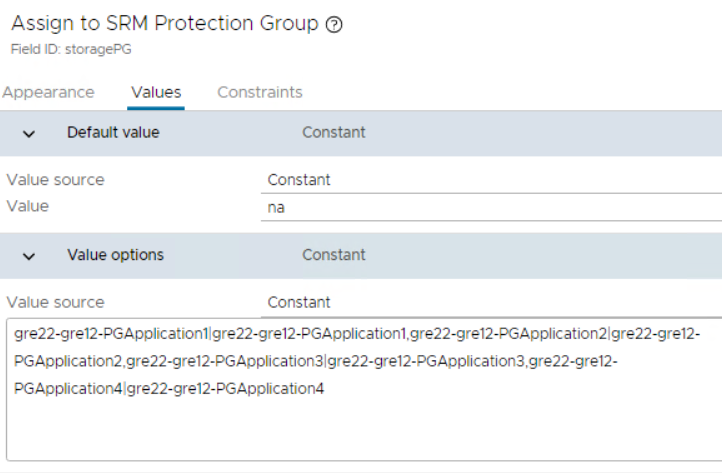

Figure14: Service Broker form configuration.

Last is to make sure `Constraints > Required` is set to `yes`.

Save the form.

## vRO actions

Go to Embedded vRO `VRA -> Orchestrator -> Git Repository`. Validate vRO is integrated with recent Git Repository `https://github.com/GLB-CES-PrivateCloud/VRO-Workflows.git`(VCS 1.8 and newer), validate if mandatory actions and workflows are in place.

Go to `VRA -> Orchestrator -> Actions` and check if the following actions are available: *getValidStoragePolicyListAviva*, *getStoragePolicyforVM*.

Go to `VRA -> Orchestrator -> Workflows -> VCS -> 2Day Actions` and check if the following workflow is available: *dhcChangeStorageClassAviva*

Go to `VRA -> Cloud Assembly -> Design -> Resource Actions` open `<tenantName/idmName>-ChangeDiskStorageClass` resource action and click on `EDIT REQUEST PARAMETERS` button. You should have fields like on the figure 15. If not, this means the VRA integration was not performed on the *manage* code level VCS 1.8 or newer. After fixing the code version you should rerun playbook named `createChangeDiskStorageClassAction.yml` to cover it.

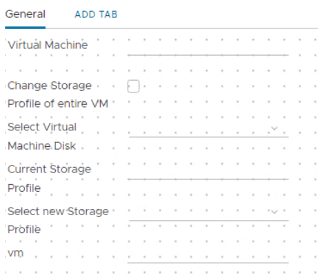

Figure15: ChangeDiskStorageClass form.

If you have proper initial *ChangeDiskStorageClass* form you may continue with Aviva customizations. Do the following:

- again go to `VRA -> Cloud Assembly -> Design -> Resource Actions` open `<tenantName/idmName>-ChangeDiskStorageClass` resource action and click on `EDIT REQUEST PARAMETERS` button. Next `Actions` and `Export form`.
- in the `ChangeDiskStorageClass` resource action change Workflow to `dhcChangeStorageClassAviva`

  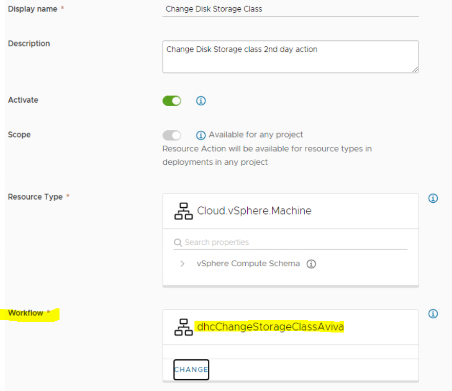

  Figure15: ChangeDiskStorageClass workflow change.
- in the `ChangeDiskStorageClass` resource action check `Property Binding`. Make sure `vm` action input is bound `with binding action` type. Otherwise adopt it.

    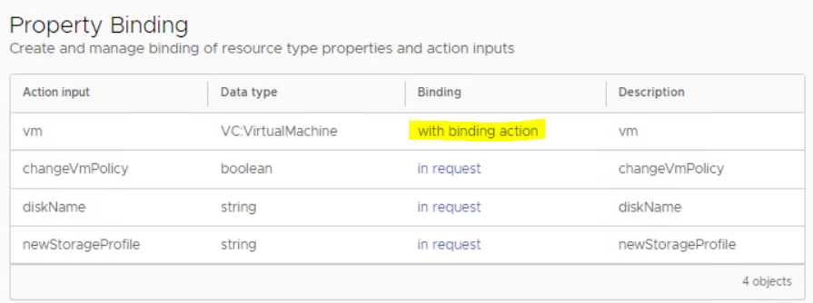

  Figure16: ChangeDiskStorageClass property bindings.
- `EDIT REQUEST PARAMETERS` of `ChangeDiskStorageClass` resource action:
  - First `Actions > Import form` you exported a moment ego. The form was reset due to workflow change action, hence import is required.
  
    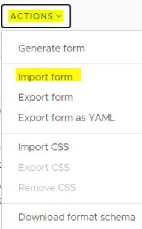

    Figure17: Change Storage Profile of the entire VM  - Read-ony to No.

  - Second, for `Change Storage Profile of Entire VM` checkbox in `Appearance` section, set `Read-only` to `No`
    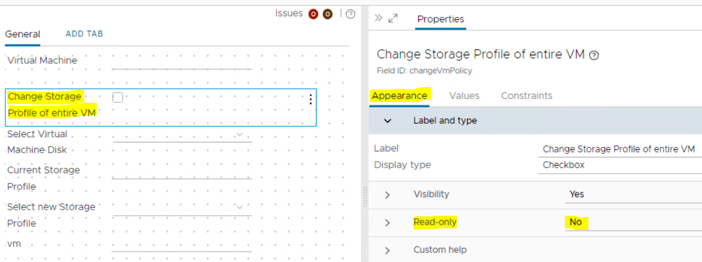

    Figure18: Change Storage Profile of the entire VM  - Read-ony to No.

  - Third, for `Select new Storage Profile` dropdown in `Values` section, set `External source` in the field `Value options > Value source`. Next select action `net.atos.dhc.automation/getValidStoragePolicyListAviva` plus for `Action inputs` set `VM` field to `vm`.

    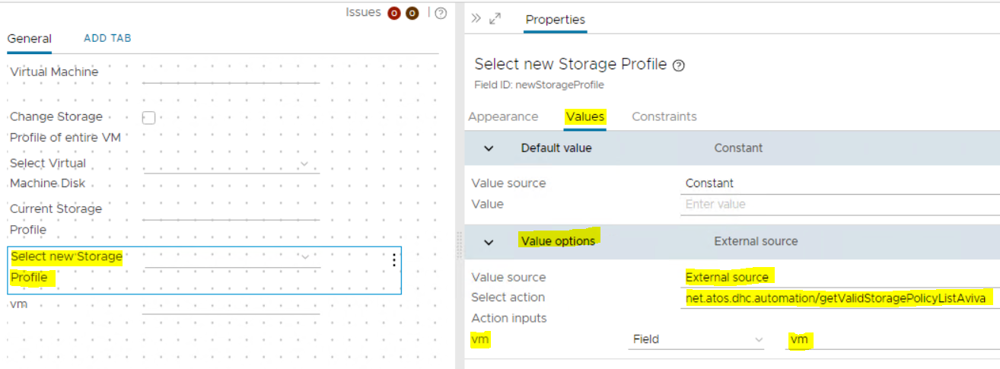

    Figure18: Select new Storage Profile external value.
  - `Save` resource action form.

Description of the `dhcChangeStorageClassAviva` workflow logic:

Request takes VM as an input. For a given VM action *getValidStorageProfileListAviva* retrieves Storage Policies assigned to the VM. It checks Storage Policy constraints. Based on the *storagePG* tag constraint value it searches for all Storage Policies with the same tag value in constraints and collects *StorageClass* value of each found policy. List of storage classes values is then returned to a custom form and feed dropdown menu for Storage Class selection (apart from storage class name action also returns corresponding storage profile id - return object is a Properties object where *label* is storage class name presented to user and "*value*" is storage profile id). This approach ensures that only Storage Policies that belong to the same Protection Group (*storagePG* tag) will be made available to chose from. Workflow does not allow to migrate VM between different Protection Groups (Storage Clusters that have different *storagePG* tag).

If the *storagePG* tag constraint is empty we assume that VM is not DR protected. In such a case action will search all Storage Policies for policies that have *StorageReplication* constraint set to "*no*" and from that list it will pull available Storage.

Once new Storage Class is selected workflow then will find Storage Pods (aka datastore clusters) that are compatible with selected storage policy and migrate single disk or whole VM (depending on user selection) to that cluster.

Workflow allows VM's disks to be stored on different Storage Clusters. It is save to do because for SRM protected VMs, VM disks can land only on Storage Clusters that are part of the same Protection Group (constraint tag "*storagePG*") and this does not break SRM protection. On the other hand for unprotected VMs the same mechanism assures that only Storage Policies that describe unprotected Storage Clusters are available for a user to chose from therefore VM's disks will not be located on the replicated and non-replicated storage at the same time.

## Day1 SSR

Go to `VRA -> Service Broker -> Catalog Items`, request *Deploy virtual machine* and validate the service broker is updated properly. Create VM.

## Day2 SSR

Go to `VRA -> Service Broker -> Resources -> Deployments` find the deployment created in the previous chapter, open it and in the `Action` you should have `Change Storage Class Aviva`.

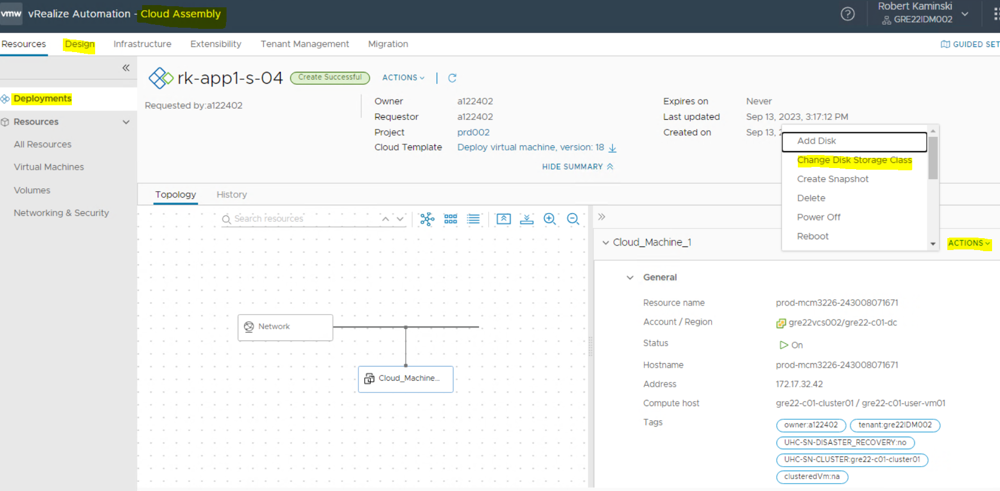

Figure19: Change Storage disk Aviva day2 SSR.
