# Performing DR Activity

## Table of Contents

- [Performing DR Activity](#performing-dr-activity)
  - [Table of Contents](#table-of-contents)
  - [Introduction](#introduction)
    - [Purpose](#purpose)
    - [Audience](#audience)
    - [Scope](#scope)
    - [Prerequisites](#prerequisites)
  - [Action Plan](#action-plan)
    - [Prechecks](#prechecks)
    - [Failover](#failover)
    - [Reprotect](#reprotect)
    - [Post Checks](#post-checks)
    - [Evidence collection](#evidence-collection)
    - [Failback](#failback)
  - [Changelog](#changelog)

## Introduction

### Purpose

This instruction covers the action of DR Failover in SRM.

### Audience

- VCS Engineers
- VCS Architects

### Scope

The Instruction assumes that the reader has reasonable grasp of VCS infrastructure and VMware components.

### Prerequisites

- Access to the vCenter
- Access to the HashiVault
- Client Aviva visibility in SNOW
- Basic vCenter Knowledge
- Basic SRM Knowledge
- CTASK to perform DR activity
- Change co-ordinator approval for Go / No-Go

## Action Plan

### Prechecks

1. Ensure the access to both the vCenters on which the DR is to be performed.
2. Ensure no Critical issues / alerts on both the vCenters (which may prevent the DR).
3. Ensure DR VM’s health in Prod.
4. Check and note down the VM Tags and Storage Tags.
5. Check and note down the name & Naa ID of LUN (Datastore) which participated in DR.
6. Make sure Recovery IPs are available in Infoblox and free.
7. Ensure replication of datastore is OK with Storage team.
8. Check storage status in ONTAP tool plugin server.

    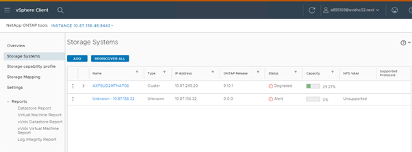

9. Check VM’s CD/DVD status at VM’s edit page, should connect with **ClientDevice**, If anything mounted, unmount the same.

    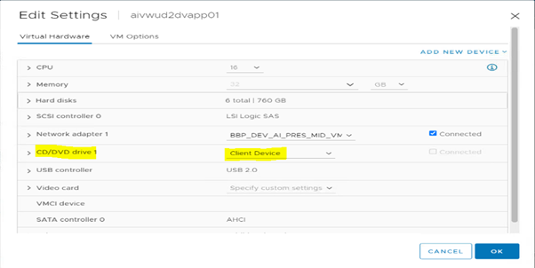

10. Check and update to latest VMware tool's version on VMs.
11. At VM edit page - VM Options, uncheck the **check and upgrade VMware tool**.

      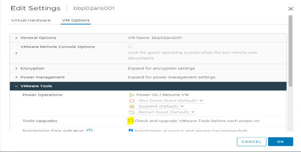

12. Check **Site Recovery Manager** status as **connected** in summary.

      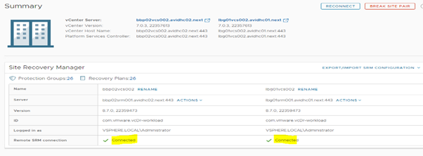

13. At the **Configure** section, check **Storage Replication Adapters**.

      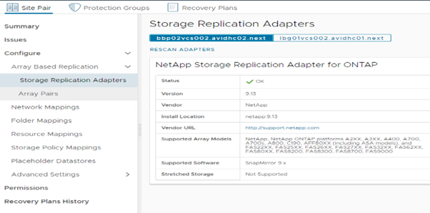

14. Check **Array Pair** status is **OK** and source and ensure replication would not report any issue.

      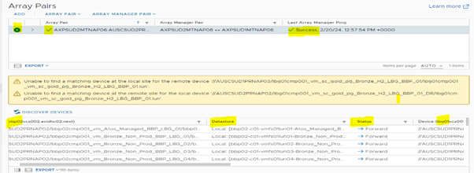

15. Make sure the **Network Mapping** is enabled and IP customization is configured for Recovery.

      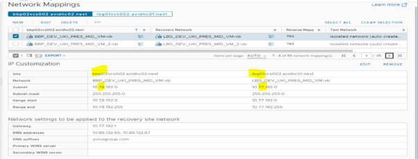

16. Make sure **Resource Mapping** is configured for the cluster for which the DR drill will be conducted.

      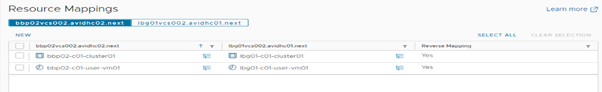

17. Check that **Protection Groups**, Protection status is **OK**.
18. Check the relevant **Recovery Plans** status is **Ready**.

      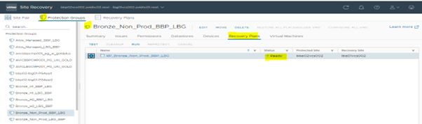

19. Ensure Backups have been disabled for the DR VMs before the DR will start.
20. Enable vROPs maintenence for the Datastore which participate in DR.
21. Ensure VMs were moved to right Protection group for failover and no other VMs not covered under this protection group are there. Ref:- Modify Protection Group at wiCreateModifyProtectionGroupAviva.md

### Failover

> Type: 
> **Test** VM failover in Recovery site also running in Prod site with same name and IP, If any changes made in data of the VM in Recovery site will not be saved in Prod site. 
> After performing the **Test** failover **Cleanup** should be run for failback. 
> **RUN** Simulate the real DR situation, VM will receive the IP addresses as per the configuration in **IP Customization**. Whatever changes made in the data on that VMs at the Recovery site will be available in Prod after Failback. 
> AFter **RUN** do the **Reprotect**

1. Logon into the SRM
2. Select Protection group which need to failover.
3. Navigate to be Relevant Recovery Plan and Click on **RUN**.

   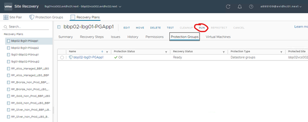

4. Enable the check box that **I understand...** and select the **Planned migration**, click **Next**.

   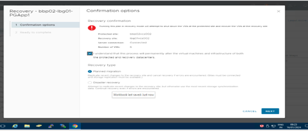

5. Review and ensure the Protected site & Recovery site and number of VMs details then click on **Finish**.

   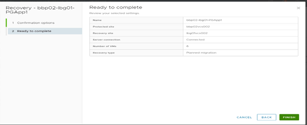

6. Monitor the failover process in **Recovery Steps** of Recovery Plan.
7. Ensure **Recovery Completed** and **Reprotect** is enabled.

   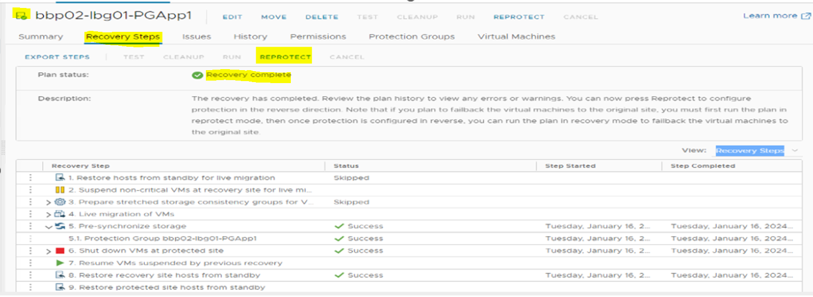

   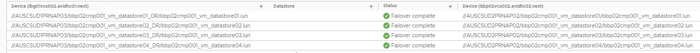

### Reprotect

1. Wait for all VMs to be completely powered on in Recovery site and IP populated.
2. Go to the Recovery plan which was failed over and click on **Reprotect**.

> Note: Reprotection, will change the direction of replication to protect the VM.
> **Example:** Before failover replication **BBP to LBG** after Reprotect **LBG to BBP**
  
   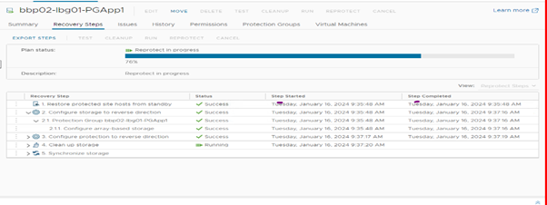

   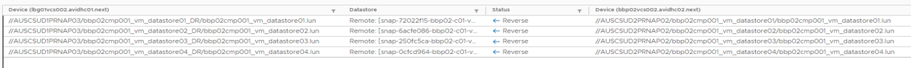

### Post Checks

1. Ensure all VMs are powered on in Recovery site.
2. Ensure all VMs have received the Recovery site IP.
3. At Prod site Datastore which was used for failover will be **Inaccessible** in Prod site.

   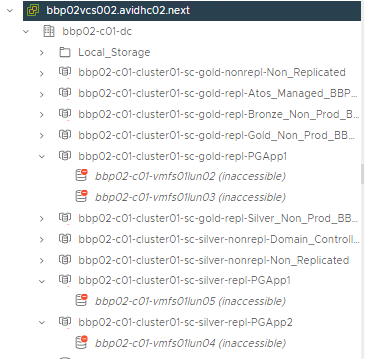

4. Ensure the Recovery datastore is online in ONTAP tool.

   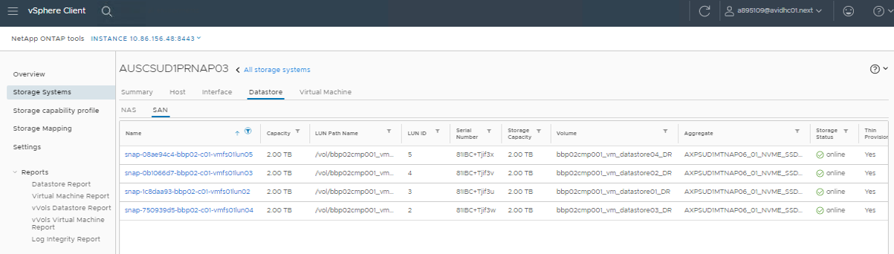

5. Ensure the VM & Datastore Tags are as in Prod.
6. Ensure all the VMs are running in the requested Resource Pool and are healthy.
7. Confirm the replication status of the datastore with Storage team.
8. Handover the servers to OS team for further DR activity

### Evidence collection

1. Go to Recovery plan which used for the Failover/Failback activity and navigate to **History**.
2. Select **Export all** or **Export report** for single report.

   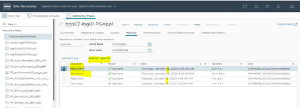

### Failback

> Get confirmation for Failback from **Change coordinator**.

1. Follow the Same steps of Failover for Failback activity.
2. Perform Reprotect.
3. Storage vMotion the VMs back to its original Datastore / PG.
4. Confirm the replication status of the datastore with Storage team.
5. Do post checks in Prod site, same as Recovery site.
6. Collect evidences.
7. Attach evidences to ctask and close the task.
8. Enable the backup.
9. Remove vROPs maintenance for the datastore which participate in DR.

## Changelog

| Version | Date          | Description                                                                                                                                                         | Author             |
|---------|---------------|---------------------------------------------------------------------------------------------------------------------------------------------------------------------|--------------------|
| 0.1     | 22/02/2024    | First version | JK.Jalaludeen |
