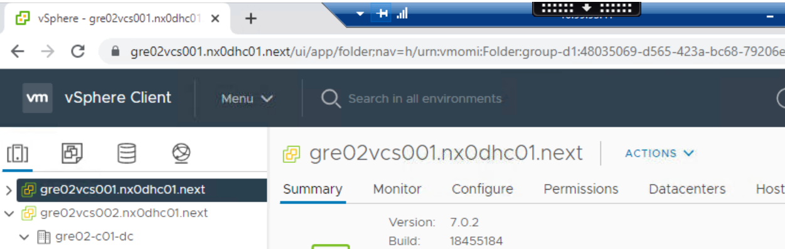
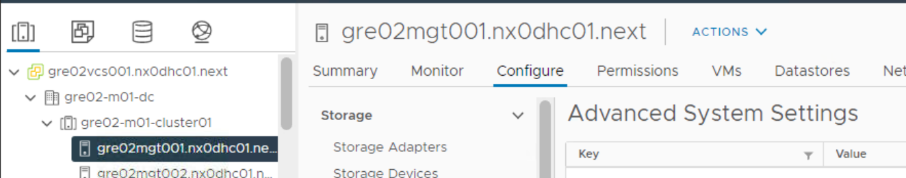
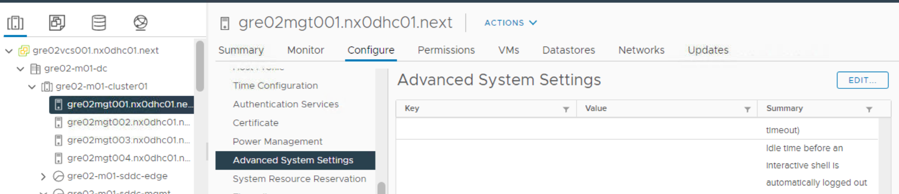
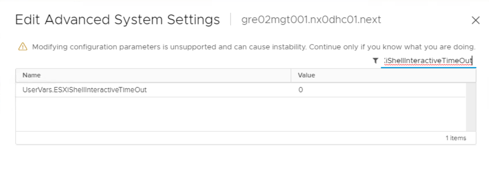
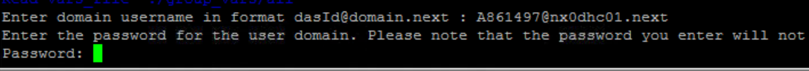
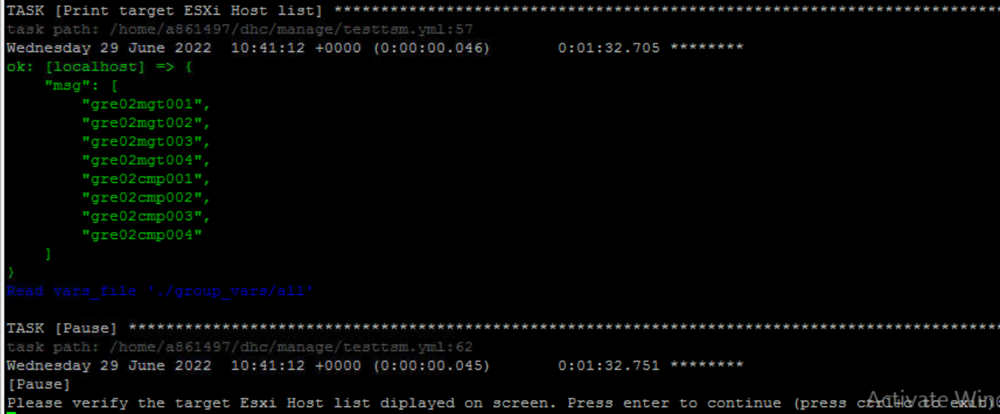
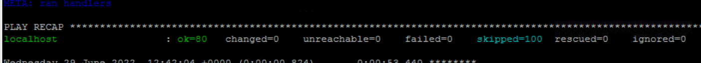
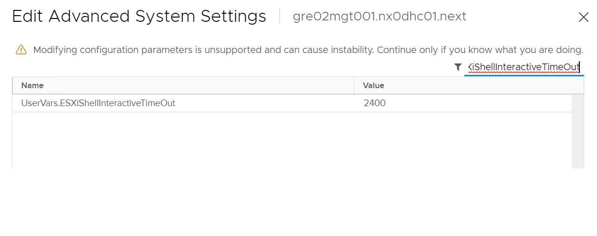

# Enable ESXi Shell timeout feature

## Changelog

|    Date    |   TOS   |   Issue   | Author                | Description |
|------------|---------|-----------|-----------------------|-------------|
| 30.06.2022 |         | CESDHC-213  | Krishnasai Dandanayak | Initial document creation |
| 04.07.2022 |         | CESDHC-213  | Krishnasai Dandanayak |Fixes : Added dots at end of lines, Given the "enter" sign on end of the each screenshot and modified title, assigning of variable and change log|

## Introduction

### Purpose

Enable ESXi Shell timeout.

### Audience

- VCS Operations

### Scope

By enabling the ESXi Shell timeout feature on ESXi hosts, session will be auto closed when it is idle for more than 40 Minutes.

In scope:

- Enable ESXi Shell timeout

## Manual Process to enable ESXi Shell timeout feature

1. Login to the vCenter.

   

2. Select the required **host** and click on **configure tab**.

   

3. Select the **Advanced System Settings** and click on **Edit**.

   

4. Search with the **Service name** in the filter section and right click on the value and change it to **2400 (40 Minutes)**.

   

5. Repeat the same above steps for other hosts as well.

## Enable ESXi Shell timeout feature using Ansible Playbook

1. By using the Ansible playbook it will be easy to modify the host service configuration on all the ESXi Hosts at once.
2. Login to the **Ansible server** and change the directory to **/dhc/manage/**.

   

3. Run the playbook by using the below example instructions :

```txt
ansible-playbook enableESXiShelltimeoutfeature.yml -e "HOSTS=cmp,mgt"
```

Mandatory extra vars HOSTS - ESXi server name (without domain name).Comma separated list of ESXi server names (do not include spaces!).

If you want to execute playbook on all available ESXi hosts then provide value **"all" to "HOSTS"** variable.

```txt
e.g. "HOSTS=all"
```

While Executing the playbook, it prompts for **credentials. Use `DASID@domain.next` as username and password** and it will prompt for **hosts list confirmation**, Please check and click on enter.

   

   

Once Playbook is successfully **finished**, Please cross check the Hosts **Advanced settings** for modification on service.




