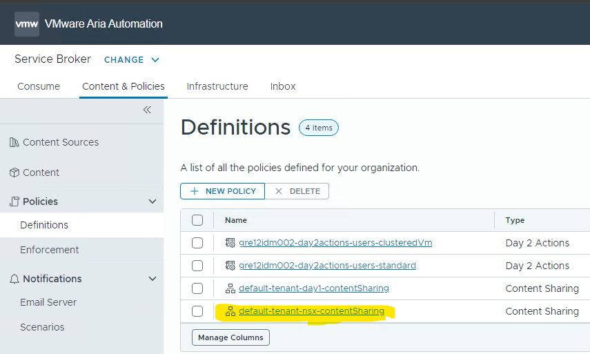
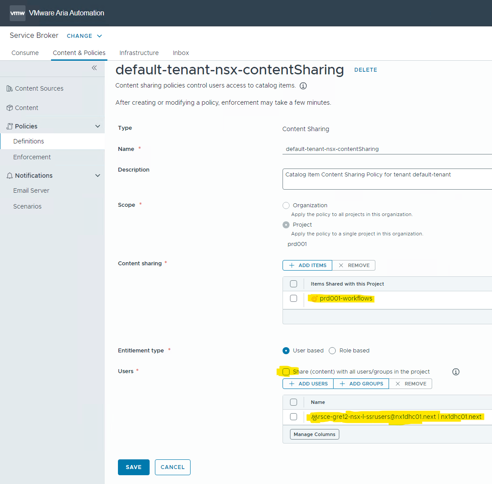

# SDN NSX-T SSR implementation in environment

## Table of Contents

- [SDN NSX-T SSR implementation in environment](#sdn-nsx-t-ssr-implementation-in-environment)
  - [Table of Contents](#table-of-contents)
  - [Changelog](#changelog)
  - [Introduction](#introduction)
    - [Purpose](#purpose)
    - [Audience](#audience)
  - [Scope](#scope)
  - [Related document](#related-document)
  - [Prerequisites](#prerequisites)
- [Procedure](#procedure)
  - [Verification](#verification)

## Changelog

 | Date       | Version | Issue     | Author              | Description            |
 | ---------- | ------- | --------- | ------------------- | ---------------------- |
 | 22.10.2024 | 1.0     | VCS-13872 | Krzysztof Olszewski | Initial draft creation |
 | 25.10.2024 | 1.1     | VCS-13871 | Marcin Kujawski     | Update prerequisites chapter |

## Introduction

### Purpose

This instruction covers steps that are required to implement functionality of SDN NSX-T SSR supports for NSX Multi tenancy. The playbook automates creation and configuration of NSX-T SSRs on Service Broker in vRA On Prem tenant.

### Audience

- VCS Engineers
- VCS Architects
  
## Scope

The scope of this document covers:

1. Automated creation of new resource role in Active Directory to manage NSX-T SSRs (rsce-{{ locationCode }}-nsx-l-ssrusers)
2. Automated implementation of SDN NSX-T SSR supports for NSX Multi tenancy, SSRs:
   - Add or Remove Security Policy
   - Add Security Policy Firewall Rule
   - Create NSX Services
   - Manage Security Groups
   - Manage Virtual Machine Security Groups
  
## Related document

| Document Name                               |
| ------------------------------------------- |
| [Service Catalog LLD](lldServiceCatalog.md) |

## Prerequisites

The work instruction assumes that the reader has reasonable grasp of VCS infrastructure and VMware components. Also is able to execute ansible playbook.

The installation procedure is fully automated via Ansible playbook, however before automation execution please double check that the following requirements are met:

1. **vRO contains latest code** pulled from the workflows repository.
2. **Vault credentials for NSX-T are stored** in HashiVault.
3. **NSX-T API endpoints** are set up in vRO config.
4. **REST hosts** for API communication with NSX-T are configured on vRO level.

Estimated installation time: **1-2 hours** depending on the prerequisites completion.

# Procedure

To enable NSX-T SSRs for a given tenant in vRA On Prem run:

``` text
ansible-playbook createNsxtSsrsBroker.yml
```

The are mandatory variables which have to be provided  during playbook execution:

- credentials for VCS management domain account in format `dasId@domain.next`
- tenant name
  
## Verification  

> **NOTE:** Please bare in mind that you must have proper privileges to see the content (Administrator role or member of rsce-{{ locationCode }}-nsx-l-ssrusers).

After successfully playbook execution, log in to vRA portal and check in Service Broker whether:

- you can see SSRs in Catalog
  
  

- you can see prd001-workflows in Content Sources  
  
  

- you can see {{ tenantName }}-nsx-contentSharing in Policies Definitions
  
  

- you can see Content Sharing policy similar as on the screen below
  
  
