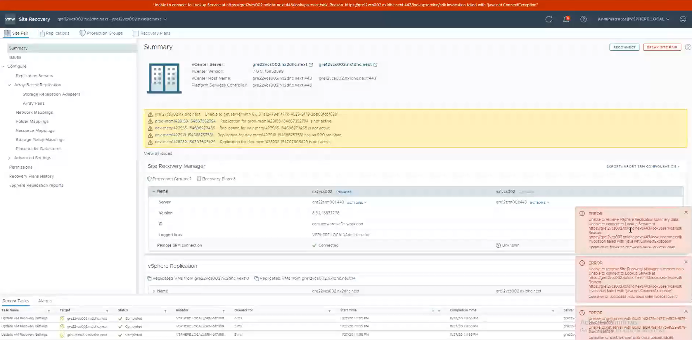
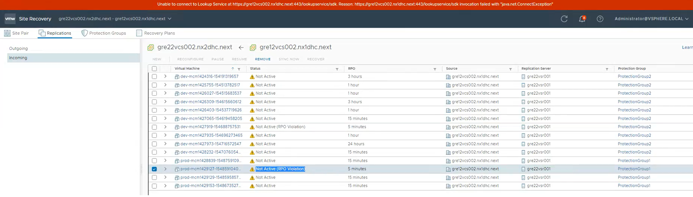
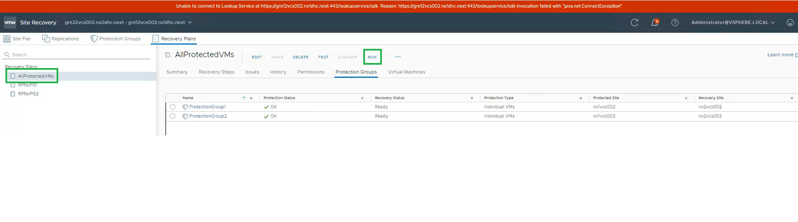
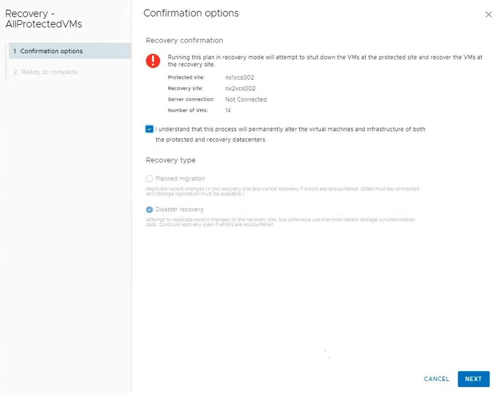
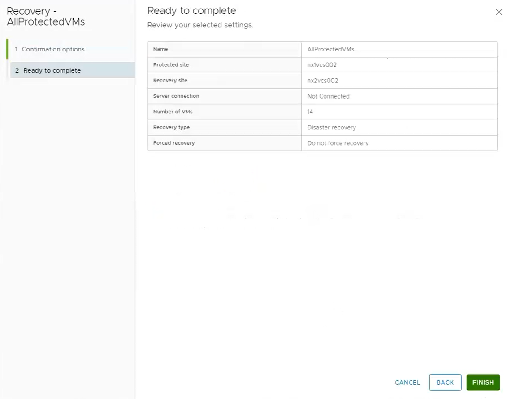
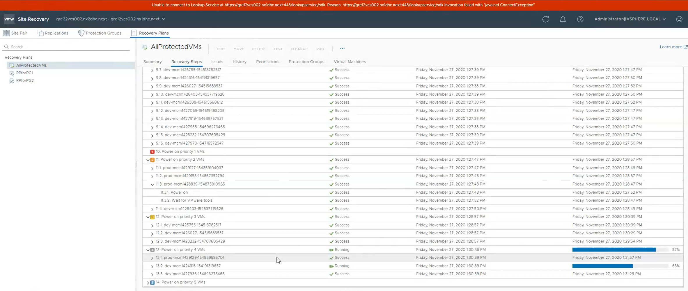
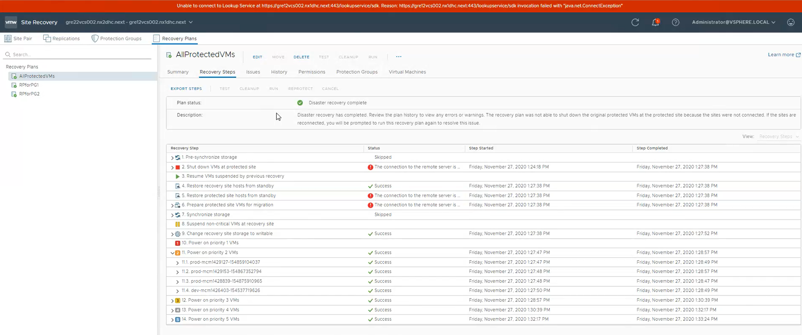
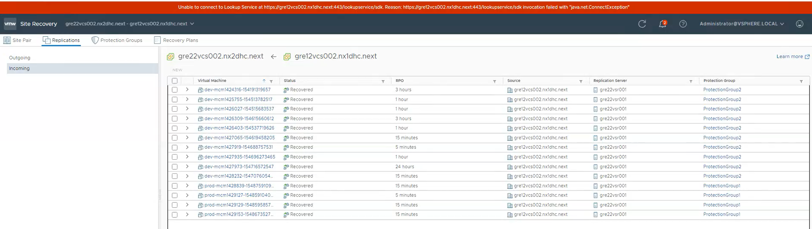
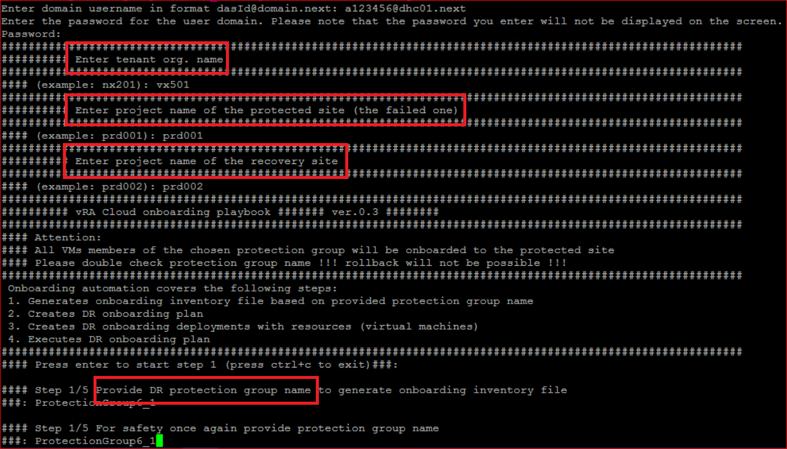
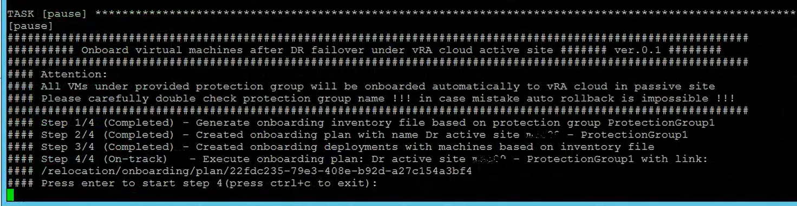

# Table of Contents

- [Table of Contents](#table-of-contents)
- [Changelog](#changelog)
  - [Introduction](#introduction)
    - [Purpose](#purpose)
    - [Audience](#audience)
    - [Scope](#scope)
    - [Out of scope](#out-of-scope)
- [Related Documents](#related-documents)
- [Infrastructure Requirements](#infrastructure-requirements)
- [Assumptions](#assumptions)
- [VCS password manager (Hashi Corp Vault)](#vcs-password-manager-hashi-corp-vault)
- [Failover Steps](#failover-steps)
  - [Step 1 SRM failover](#step-1-srm-failover)
  - [Step 2 Network failover](#step-2-network-failover)
    - [Infoblox Master Grid failover (IPAM)](#infoblox-master-grid-failover-ipam)
    - [Network routing failover (BGP)](#network-routing-failover-bgp)
    - [Other network actions](#other-network-actions)
  - [Step 3 vRA failover](#step-3-vra-failover)
    - [Onboarding prerequisites](#onboarding-prerequisites)
    - [Onboarding activities](#onboarding-activities)
- [Post failover validation checklist](#post-failover-validation-checklist)
- [Reprotect \& Failback](#reprotect--failback)

# Changelog

| Date       | Issue      | Author          | TOS     | Description                                                                                                                                            |
|------------|------------|-----------------|---------|--------------------------------------------------------------------------------------------------------------------------------------------------------|
| 30/11/2020 | DPC-24418  | Robert Kaminski | VCS 1.2 | Created based on the simulated isolation of the active site during live demo sprint 1.2-12                                                             |
| 11/12/2020 | DHC-1020   | Robert Kaminski |         | Updates in Step 2, based on TOS1.2 Review inputs                                                                                                       |
| 28/04/2021 | DHC-1661   | Tomasz Korniluk |         | Added chapter to activate vSphere Cloud account under current active site                                                                              |
| 31/05/2021 | DHC-1459   | Tomasz Korniluk |         | Moved chapter activate vSphere Cloud account before chapter vRA failover                                                                               |
| 15/10/2021 | DHC-3129   | Tomasz Korniluk |         | Removed chapter for activation of cloud account after vRA failover, updated chapter vRA failover with new prompts                                      |
| 21/12/2021 | DHC-2862   | Robert Kaminski |         | Added Infoblox Grid Master failover for bidirectional A/P DR, fixed doc linting errors                                                                 |
| 23/12/2021 | DHC-3553   | Robert Kaminski |         | Added Post-failover validation checklist                                                                                                               |
| 31/05/2022 | DHC-4777   | Robert Kaminski |         | Added user authorizationToken refreshments                                                                                                             |
| 02/2023    | CESDHC-637 | Robert Kaminski | VCS 1.6 | Adding VM tags scan and refreshment process as a prerequisite for vRA onboarding activities, valid for both VSAN and VMFS on FC as a principal storage |
| 24/04/2023 | VCS-9431   | Robert Kaminski |         | Added vra on-prem related info                                                                                                                         |
| 12/05/2023 | VCS-9432   | Robert Kaminski |         | Adjusted onboarding for vRA on-prem                                                                                                                    |
| 29/05/2023 | VCS-9442   | Robert Kaminski |         | Doc review                                                                                                                                             |
| 24/10/2023 | VCF-10602  | Robert Kaminski |         | Review and adjustments                                                                                                                                 |

## Introduction

### Purpose

The Failover procedure contains the step to fallow in order to **fail over all compute workload VMs from active/protected site to passive/recovery site.**

### Audience

- VCS Operations
- VCS Engineering

### Scope

It is advised that you read the Active Passive Disaster Recovery LLD for more detailed information on DR design decisions.

That work instruction is intended to cover below tasks and activities to fail over a full compute workload from protected site to recovery site:

1. Site Recovery Manager (SRM) failover procedure.
2. Network failover procedure.
3. vRA failover, onboarding procedure.

### Out of scope

Business might tend to enforce the partial failover of the workload for frequent tests of the application functionality after failover. This is however possible, but really complicated and requires definitely advance planning, detailed DR design and configuration in networks, SRM network mappings, protection groups/recovery plans and detailed analysis of the application dependencies.

**Fail over or fail back of chosen/limited workloads is not supported by this procedure.**

**Reprotection and fail back to old or new recovery site is not supported by this procedure.**

# Related Documents

| Document                                                      |
|---------------------------------------------------------------|
| [LLD Disaster Recovery](../design/lldDisasterRecovery.md)     |
| [WI - Integration of A/P DR](wiIntegrateActivePassiveDr.md)   |
| [WI - Network scenarios for A/P DR](wiDisasterRecoverySdn.md) |
| [WI - vRA VM DR tags update](wiUpdateVraVmDrTags.yml)         |

# Infrastructure Requirements

1. Two VCS sites integrated as Active Passive cluster in-line with VCS procedure. That includes site pairing, network and resources mappings, defined protections groups and recovery plans.
2. Platform Administrative rights in the VCS mgmt Active Directory on both sites.
3. Access to Ansible VMs on Active and Passive sites.
4. Permissions to vRA.

# Assumptions

There is an assumption that the engineers following this process have:

- an understanding of VMware products (specifically Site Recovery Manager) and can navigate vCenter and vRA Cloud/Cloud Assembly
- an understanding of VCS networking
- an understanding how to run ansible playbooks
- sufficient privileges to access both sites

This WI is not intended to explain how to configure A/P DR.
There is an assumption that Site Recovery Manager and vSphere Replication configuration have been done in-line with VCS integration procedures during initial build, that the DR meets all customer requirements agreed upfront.

There is an assumption you have a **`Confirmed GO`** to perform site failover, as the operation cannot be undone. Recovery mode will attempt to shut down the VMs at the protected site and recover the VMs at the recovery site.

The Failover procedure contains the step to follow in order to **fail over all compute workload VMs from active/protected site to passive/recovery site.**

# VCS password manager (Hashi Corp Vault)

VCS uses HashiCorp Vault password manager. VCS platform administrators have privileges to login and **read** passwords from Vault.

>Warning. Credentials for all components are stored during deploy, refreshed in the hardening stage phase automatically. It is also valid for playbooks in the manage (production phase). Adjusting credentials manually will result later in failures in automation.

- connect to the password manager via web on port 8200, change method to **LDAP**. Use login in UPN format `<dasId>@<customerCode>dhc.next`


- navigate through secrets path to find credentials you are looking for


# Failover Steps

Active-Passive DR is integrated on top of two stand-alone VCS sites.

Active site is often named protected site.

Passive site is named recovery site.

Workloads running on the active site are protected and might failover to the recovery site, the passive one.

Two types of active-passive setup are possible:

1. A/P one-direction - passive site resources are are not used for active workload, standby for the failover.
2. A/P bi-direction - Customer workload runs on both sites, each site has active area and passive area on the other site.

>Note: The print screens are illustrative and cannot be used as source for input data.
>
>There is an assumption you have a **`Confirmed GO` to perform a failover**, as the operation cannot be undone.

## Step 1 SRM failover

---

In general there are two types of site recovery failover:

- **Planned migration**
  
  Replicate recent changes to the recovery site and cancel recovery if errors are encountered. (Sites must be connected and storage replication must be available.)
- **Disaster recovery**
  
  Attempt to replicate recent changes to the recovery site, but otherwise use the most recent storage synchronization data. Continue recovery even if errors are encountered.

  >For the purpose of this manual the assumption is we execute the *Disaster recovery* failover, meaning there is no network connectivity to the protected site from the recovery. Potentially the datacenter is lost (i.e on fire). No chance it becomes operational in a reasonable amount of time, hence the decision is to give a **GO** for the failover of the all protected VMs from the compute workload to the passive site.

- login to Site Recovery Manager on the **passive** site. Use SSO credentials to eliminate potential lack of privileges on your account.
  
  >Note: in vSphere 7 PSC is embedded in the vCenter. Both, management and compute vCenters are in linked mode, hence SSO admin `administrator@vsphere.local` credentials are stored in HashiCorp Vault password manager under 1st vCenter entry only.


- go to *Site Pair->Summary* tab to observe expected issues in connecting to active site



- go to *Replication-> Incoming* tab observe expected *Recovery Point Objectives* times violations. This is obviously valid for VSAN as a principal storage where the vSphere Replication appliance is used to replicate the VM data between sites. Not valid for array based data replication.



- go to *Recovery plans* tab, chose the one that includes all defined *Protection groups*, in our case it is `AllProtectedVMs` and click *RUN*.



>Note: vRA onboarding playbook base on the exact protection group names, you will need that knowledge later.

- next, confirm *Disaster recovery* type, review settings and finish.





- next, go to *Recovery steps* tab to observe a failover status





- when completed,
  - (for VSAN ) go to `Replications->Incoming` to confirm requested VMs have been recovered.

    

  - (for VMFS) go to `Site Pair->Array Based Replication->Array Pairs->DISCOVERED DEVICES` to observe statuses of failed over array based LUNs.

    Go to `vCenter->Datastores` view to validate the failover datastores are mapped as *`snap-<generated_number>-origin_datastore_name`*

>Note: After a Disaster Recovery failover to the recovery site, the compute workload VMs are not protected anymore. It is not intention of this WI to explain how to rebuild reprotection to the initial active site or to a new one.

## Step 2 Network failover

---

Network failover part includes two activities on the VCS infra:

- Infoblox Master Grid failover (IPAM)
- Network routing failover (BGP)

### Infoblox Master Grid failover (IPAM)

---

IPs for Customer workload VMs are managed in VCS via Infoblox. Stand alone VCS uses two independent Infoblox HA pairs on each site which are next - during A/P DR integration - set in the Grid. Master Grid sync the data between the sites.

Actions required:

1. vRA IPAM integration is configured to reach a single Grid Master host for both DR sites. **Validate** on what site the Grid Master resides and where Grid Master Candidate is located. It may be checked via:
   - VMware Cloud Assembly *Infrastructure->Integrations* tab
     - search for `<locationCode>abx001-ipam` name when vRA Cloud integrated
     - search for `<locationCode>vra001-ipam` name when vRA onPrem integrated
   - or Infoblox Manager, search *Grid* tab.

2. If the Master Grid resides on the failed site and is not providing IPAM services for both sites, [Promote a Master Candidate to a Grid Master](https://docs.infoblox.com/pages/viewpage.action?pageId=4823803#ManagingaGrid-bookmark689). The [set promote_master](https://docs.infoblox.com/display/NCG8/set+promote_master) command sets candidate appliance as the new Grid Master in case of a Grid Master failure.

   >**Please note, when A/P bidirectional DR is configured, whenever the Grid Master is not reachable, deployment of the new VMs won't work even on the "not affected" VCS site.** IPAM service has no influence on the deployed workload, but is mandatory for the new VM creation.

3. If new Grid Master has been promoted, IPAM integration on VMware Cloud Assembly has to be adopted to point to new Grid Master. To change it, go to VMware Cloud Assembly Infrastructure->Integrations tab, search for `<locationCode>abx001-ipam` or `<locationCode>vra001-ipam` integration name and edit hostname with new Grid Master FQDN.

### Network routing failover (BGP)

---

Next, there must be a network switch executed on the DR related T0 router to route the failovered Customer networks from initial **Active/Protected** to the **Passive/Recovery** VCS site.

Refer [Disaster Recovery SDN WI - Switchover steps paragraph](wiDisasterRecoverySdn.md#workload-domain-switchover-steps) to understand how to switch BGP.

### Other network actions

---

Depending on the specific network design and configuration for various datacenters there might be potentially other actions required to redirect flows from protected to recovery site on the upper network level than VCS.

VCS has no mechanism implemented to sync the FW rules between protected and recovery site network segments. The rules validation must be handled via production plan frequent actions. In case of inconsistency, traffic to failovered workloads might be blocked.

## Step 3 vRA failover

---

Last step to finalize the full VCS failover chain is to onboard VMs into vRA from initial **Active/Protected** site to the **Passive/Recovery**.
Newly onboarded VMs will have a deployment name taken from the initial active site, however extended with a suffix (DR).
It's because vRA requires the deployment name to be unique under single organization (valid for vRA Cloud, however sustained for on-prem too).

### Onboarding prerequisites

---

**Before** executing DR onboarding playbook:

1. Read the project names of the protected and recovery site

     - Logon into vRA Cloud, Go to *Cloud Assembly -> Infrastructure -> Projects*
    >For vRA on-prem there is no sync between protected and recovery sites, they are independent. You need to know project name from the recovery site only to trigger onboarding playbook.

2. Create vRA token

    Either vRA Cloud or vRA On-prem requires valid user token in order to connect to it via code.

    - vRA Cloud token

        As a prerequisite a valid token is required to establish a connection to vRA Cloud. The token is stored in HashiCorp Vault (`secret/<customerCode>/<locationCode>/vracloud/<customerCode>/authorizationToken-<dasId>`) and is valid for 1 day. To create the Token run a playbook:

        ```shell
        ansible-playbook createVraCloudToken.yml
        ```

        You will be prompted to provide the following inputs:

        ```text
        Enter VCS management domain username e.g.: a123456@exampledomain.com
        Your input: Your Active Directory domain username

        Enter the password for the user domain. Please note that the password you enter will not be displayed on the screen. 
        Your input: Your Active Directory domain password

        Enter vRA Cloud username e.g.: a123456@exampledomain.com 
        Your input: Your e-mail address associated with VMware Cloud Services

        Enter password for vRA Cloud user 
        Your input: Your password for the above account

        Please enter the name of the tenant organization, i.e. nx302
        Your input: tenant organization name

        NOTE: AS THIS IS SELENIUM, BEFORE ENTERING PIN, PLEASE WAIT FOR NEW VALIDITY CYCLE

        Please enter MFA Authenticator PIN
        Your input: PIN
        ```

        >Note: During the execution of this playbook you will be prompted for One Time Password (OTP) used in Multi Factor Authentication (MFA). Without enabled MFA on the vRA account, the playbook will fail.

    - vRA On-prem token

        A token is also required in order to establish connection to vRA On-prem. The token is stored in HashiCorp Vault (`secret/<customerCode>/<locationCode>/vraonprem/<customerCode>/authorizationToken-<dasId>`) and is valid for 1 day. To create the Token run a playbook:

        ```shell
        ansible-playbook createVraOnPremAuthToken.yml
        ```

3. Follow [SRM Protection Group Tag reassignment](wiUpdateVraVmDrTags.md) procedure to scan and refresh DR related tags on all protected VMs. The tags are used later in playbooks for vRA onboarding activities, but might be missing or inaccurate after the failover. It is strongly recommended to follow this procedure to apply correct tags.

>Important: All onboarding activities for VMFS principal storage (array based replicated) require code of DHC-1.8 version or higher.

### Onboarding activities

---

Having prerequisites addressed, execute the DR onboarding playbook on the *ans001* server on the passive/recovery site.

```shell
dhc/manage$ ansible-playbook drVraOnboarding.yml
```

Playbook onboards to vRA virtual machines that are members of the specific protection groups in four steps:

- `Step 1` generates onboarding inventory file to gather list of available virtual machines for onboarding steps
- `Step 2` creates dr onboarding plan
- `Step 3` creates dr onboarding deployments based on inventory file with virtual machines
- `Step 4` executes dr onboarding plan to onboard virtual machines

Playbook prompts for the following mandatory **inputs that are case sensitive**:

- Tenant org. name
- Project name of protected site (the failed one) - `you may leave it blank for vRA on-prem`
- Project name of recovery site (new active)
- Protection group name

Playbook will pause in critical moments.

 



>**Important: Playbook can be executed against a SINGLE protection group at the time. In case recovery plan used for SRM failover contains multiple protection groups, you have to run the playbook against each protection group**.

After running all steps from *drVraOnboarding.yml* playbook, you should perform an additional check on the vRA site the onboarding activities statuses.

- Go to *Cloud Assembly -> Infrastructure -> Onboarding* tab, search against `Dr active site <locationCode> - <Protection Group name>` to see statuses of the playbook onboarding activities.  

- Go to *Cloud Assembly -> Deployments* tab, to trace if the onboarded deployment names with suffix *(DR)* are visible. Note, for vRA on-prem the deployment names will be VM name based, as the origin deployment names on the protected vRA site are not preserved.

# Post failover validation checklist

>IMPORTANT: After the DR failover:
>
>- 2nd day activities on the **onboarded VMs** are possible, however the ability to provision fresh VM that uses the networks or protection groups from the failovered site is not sustained. It requires manual actions on the Service Broker form and blueprints.
>- array based datastores on the recovery site are mounted with prefix *`snap-<generated_number>-origin_datastore_name`*. **Datastores tags might be gone and datastore cluster functionality is no longer preserved**.

VCS A/P DR is being integrated on top of two standalone VCS instances, hence the failover activities considers Customer workload only, the management stays untouched. Therefore assumption is the mgmt services on the recovery site are continuously monitored by an operational team and in healthy status (Especially for A/P bidirectional DR the recovery site is active to protect workload running on it).

We focus on the post failover validation checklist specific for Customer workload only.

| Component | Action                                                                                                                                                                                                                                                                                                                                                                                                                                                                                                                                                                                                                                                                                                                                                                                                                                                                                                                                                                                                                                                                                                                                                                                                                                                                                                                                                                                                                                                                                                                                              |
|-----------|-----------------------------------------------------------------------------------------------------------------------------------------------------------------------------------------------------------------------------------------------------------------------------------------------------------------------------------------------------------------------------------------------------------------------------------------------------------------------------------------------------------------------------------------------------------------------------------------------------------------------------------------------------------------------------------------------------------------------------------------------------------------------------------------------------------------------------------------------------------------------------------------------------------------------------------------------------------------------------------------------------------------------------------------------------------------------------------------------------------------------------------------------------------------------------------------------------------------------------------------------------------------------------------------------------------------------------------------------------------------------------------------------------------------------------------------------------------------------------------------------------------------------------------------------------|
| SRM       | Go to Site Recovery Manager on the recovery site: <BR> - review triggered recovery plans history, validate the statuses, search for potential errors to be addressed <BR> - in case more than one recovery plan have been executed, validate carefully protection group list that are members of each recovery plan if any protection group hasn't been overlooked in the configuration phase. If true, create new recovery plan that contains missing protection group and execute the failover for it. Continue with vRA onboarding procedure as well <BR> - all successfully failovered VMs must have *Recovered* status <BR> Do not bother with VM reprotection activities at this moment. This will be part of the failback process.                                                                                                                                                                                                                                                                                                                                                                                                                                                                                                                                                                                                                                                                                                                                                                                                           |
| vCenter   | Login to vCenter on the recovery site: <BR> - large workload has been migrated, hence it's mandatory to monitor performance of the customer workload clusters in case the resources are over committed. <BR><BR> Login to vCenter on the failed site if possible: <BR> - when the disaster recovery plan was executed and the protected site was not accessible from the recovery, all the VMs might be still powered on. As soon SRM has contact with the failed site they will be automatically brought down, however in some circumstances might be safe to shutdown them ASAP manually. <BR>                                                                                                                                                                                                                                                                                                                                                                                                                                                                                                                                                                                                                                                                                                                                                                                                                                                                                                                                                    |
| Network   | Three main areas to validate: <BR> - **Routing** - validate the BGP has been properly switched from NSX T0 routers on protected site to NSX T0 on the recovery site <BR> - **IPAM** - validate the Grid Master is accessible and healthy <BR> - **Firewall Rules** - at the moment of writing this WI there is no automate mechanism in VCS to sync FW rules between NSX-T protected and the recovery site. This should be part of the production plan which, as all human related tasks, might be error prone. Therefore any problems connecting to customer workload after failover can be related to lack of FW rules.                                                                                                                                                                                                                                                                                                                                                                                                                                                                                                                                                                                                                                                                                                                                                                                                                                                                                                                           |
| vRA       | Login to proper organization (tenant) in VMware Cloud Services. Validate the following: <BR> - Go to *Cloud Assembly -> Infrastructure -> Onboarding*, review status(es) of onboarding plans. <BR> - Go to *Cloud Assembly -> Infrastructure -> Resources -> Virtual Machines*, review the list of VMs, validate statuses (refer to *Project*, VM must be powered ON on the recovery site), check the tags have been properly reassigned, refer to *origin*, VMs must have *Deployed* status.<BR> - Go to *Service Broker -> Deployments*, the failovered deployments are onboarded with *(DR)* suffix, you may want to perform a 2nd day activities on chosen deployments. <BR> - Go to *Cloud Assembly -> Infrastructure -> Connections -> Cloud Accounts*, review statuses of vCenters and NSXes of the recovery site, validate connections.<BR> - Go to *Cloud Assembly -> Infrastructure -> Connections -> Cloud Proxies*, check statuses of cloud proxies (CAS), extensibility proxies (ABX) of the recovery site <BR> - Go to *Cloud Assembly -> Infrastructure -> Connections -> Integrations*, validate data collection statuses with Extensibility Proxies (ABX), with IPAM (specifically if the new Grid Master is set), with vRO. <BR><BR> - Go to *Service Broker -> Catalog -> Deploy virtual machine [projectName]*, when bidirectional A/P DR is configured it's worth to deploy a test VM on the recovery site (reflect to proper *projectName*), to validate the IPAM services are healthy and the VM deployment is not affected. |

# Reprotect & Failback

Workload reprotection or failback to previous or new recovery site is not part of this work instruction.
