# Hardening

## Changelog

| Version | Date       | Description                                                                                                                                                                                                 | Author(s)             |
|---------|------------|-------------------------------------------------------------------------------------------------------------------------------------------------------------------------------------------------------------|-----------------------|
| 0.1     | 2020-02-06 | Initial draft creation                                                                                                                                                                                      | Lukasz Tomaszewski    |
| 0.2     | 2020-02-12 | Chapter NSX rules implementation updated                                                                                                                                                                    | Radoslaw Dabrowski    |
| 0.3     | 2020-02-20 | Hardening order changed, added VRA Cloud credentials update, final review                                                                                                                                   | Robert Kaminski       |
| 0.4     | 2020-03-04 | Admin account creation step moved after enabling WinRM transport mode (dependency). Update NSX rules paragraph                                                                                              | Robert Kaminski       |
| 0.5     | 2020-03-05 | Password Manager clean up task moved as last harden step. Added HV reminder to store secrets outside of VCS                                                                                                 | Robert Kaminski       |
| 0.6     | 2020-04-02 | Added reference to Avamar backup integration and Reporting overview work instructions                                                                                                                       | Robert Kaminski       |
| 0.7     | 2020-04-22 | Added section about Edge Transport Nodes plus updated section about NSX                                                                                                                                     | Radoslaw Dabrowski    |
| 0.8     | 2020-05-27 | Added section about changing vRNI passwords                                                                                                                                                                 | Pawel Zurawski        |
| 0.9     | 2020-08-24 | Added section about Nessus scheduled reports                                                                                                                                                                | Lukasz Tomaszewski    |
| 1.0     | 2020-10-29 | DPC-24275 SDDC Manager chapter updated, TOC updated                                                                                                                                                         | Lukasz Tomaszewski    |
| 1.1     | 2020-11-09 | DPC-24348 Added tip to chapter 2.9                                                                                                                                                                          | Lukasz Tomaszewski    |
| 1.2     | 2020-12-18 | DHC-1020 updates to address ToS reviewers suggestions                                                                                                                                                       | Robert Kaminski       |
| 1.3     | 2021-05-07 | DHC-1926 alcatraz framework integration                                                                                                                                                                     | Robert Kaminski       |
| 1.4     | 2021-05-07 | DHC-1921 removed billing harden information                                                                                                                                                                 | Pawel Wlodarczyk      |
| 1.5     | 2021-06-09 | DHC-2147 updated 3.3.2 Set recipient list                                                                                                                                                                   | Lukasz Tomaszewski    |
| 1.6     | 2021-07-12 | Added a note in 2.7 Active Directory Group Policy regarding the additionally applied Fine-Grained Policy                                                                                                    | Margo Piliukh         |
| 1.7     | 2021-07-13 | DHC-2327 validation checks added to SDDC manager chapter                                                                                                                                                    |                       |
| 1.8     | 2021-07-27 | DHC-2423 Updated section 4.1.1 to use ESXi host names during playbook execution                                                                                                                             | Madhavi Rane          |
| 1.9     | 2021-12-08 | DHC-3648 adopted hardening draft for GF 1.5                                                                                                                                                                 | Robert Kaminski       |
| 2.0     | 2022-01-05 | DHC-3835 Updated section 2.2.3 Time based firewall rule for Nessus scan                                                                                                                                     | Bhalchandra Gavhane   |
| 2.1     | 2022-02-02 | DHC-3923 VCF backup configuration moved to hardening phase                                                                                                                                                  | Maciej Losek          |
| 2.2     | 2022-03-08 | DHC-4210 Updated section 2.15.7 for NSX-T non-compliance fix                                                                                                                                                | Prajacta Cerejo       |
| 2.3     | 2022-03-15 | DHC-4320 To specify phase on playbooks and added section 1.5                                                                                                                                                | Kathirvel Krishnasamy |
| 3.0     | 2022-02-17 | DHC-4343 Adjustment for VCS version 1.5                                                                                                                                                                     |                       |
| 3.1     | 2022-04-13 | DHC-4529 Remove workload NSX-T Edge hardening from deploy phase, removed remains of vRA Cloud integration, removed duplicated sections                                                                      | Lukasz Bienkowski     |
| 3.2     | 2022-05-24 | DHC-4789 Added section (2.17) for log4j vulnerability remediation task                                                                                                                                      | Madhavi Rane          |
| 3.3     | 2022-06-02 | CESVXR-358 Updated section (2.8.1) for VCS on VxRail hardening validation steps                                                                                                                             | Arun Sompura          |
| 3.4     | 2022-07-15 | CESDHC-448 Updated section 2.8.2 for vRealize Network Insight                                                                                                                                               | Jakub Zielinski       |
| 3.5     | 2022-07-15 | CESDHC-447 corrections in the work instruction                                                                                                                                                              | Jakub Zielinski       |
| 3.6     | 2022-09-21 | CESDHC-4087 changed order for VCF backup configuration (+ removed confusing information about update phase )                                                                                                | Lukasz Tomaszewski    |
| 3.7     | 2022-12-13 | CESDHC-5164 Disable audit local user on both NSX-T managers                                                                                                                                                 | Pawel Zurawski        |
| 3.8     | 2023-01-16 | CESDHC-4110 Removing customer related rules from deploy phase as part of transformation of microsegmentation XLS file to YAML. Mandatory rules are renamed to previously occupied by customer related rules | Lukasz Bienkowski     |
| 3.9     | 2023-08-24 | VCS-10302 Removed section (2.18) for log4j vulnerability remediation task                                                                                                                                   | Ciprian Sferle        |
| 4.0     | 2024-10-14 | VCS-13656, VCS14122 Active Directory security enhancements                                                                                                                                                  | Lukasz Tomaszewski    |
| 4.1     | 2025-02-13 | VCS-15114 Remove tags reference for dhc-harden.yml when running playbooks as it does not work in latest ansible version                                                                                     | Lukasz Bienkowski     |
| 4.2     | 2025-06-09 | VCS-16313 Minor updates to chaper 2.19.6 Fix vCenter non-compliance                                                                                                                                         | Lukasz Tomaszewski    |
| 4.3     | 2025-07-24 | VCS-16744 Changing an order for 2.17 Prerequisite Virtual Machine log files transfer                                                                                                                        | Lukasz Tomaszewski    |
| 4.4     | 2025-10-31 | VCS-17393 Remove time based firewall info                                                                                                                                                                   | Adam Wieczorek        |

## Introduction

### Purpose

Execute security hardening and manual validation checkpoints that have to be performed on VCS before turn over to production.

### Audience

- VCS Engineers
- VCS Architects

### Scope

Hardening steps before Turn over to Production

- Patching of the management servers
- Active Directory security enhancements (Nessus, Oradad)
- Firewall rules implementation - NSX-T microsegmentation
- Alcatraz Compliance management
- Nessus Vulnerability scanning
- Active Directory Group Policy adjustments
- Enable Kerberos WinRM transport mode
- Admin account creation in the management domain
- SDDC Manager reset VCF components credentials
- Management Servers credentials
- ESXi hosts domain join
- Out of band management - remote controller card credentials
- hardening of VCS Password Manager
- Ansible vars and inventory cleanup
- Prerequisite Virtual Machine log files transfer

Post hardening activities

- Lifecycle Management
- Avamar Backup integration
- Reporting Overview

## 1.4 Related Documents

This document is a subset of Atos Technology Lifecycle Management (ATLM) artefacts. All documents are stored in the VCS documentation repository.

## 1.5 List of Playbooks with Phase details

The below table shows the playbooks and the available phase of them.

| Playbook                                      | Deploy | Manage | Update |
|-----------------------------------------------|--------|--------|--------|
| dhc-harden.yml                                | Yes    | Yes    | -      |
| createDomainAdministratorAccount.yml          | Yes    | -      | -      |
| oobManagement.yml                             | Yes    | Yes    | Yes    |
| disableTls1WeakCiphersOnLinux.yml             | -      | Yes    | -      |
| complianceAlcatrazSecurityIIS.yml             | -      | Yes    | -      |
| complianceAlcatrazSecurityWindows.yml         | -      | Yes    | -      |
| configureVcenterPasswordExpiration.yml        | Yes    | Yes    | -      |
| remediateVcenterNonCompliantMeasures.yml      | -      | Yes    | -      |
| resetSddcManagerManagedPasswords.yml          | Yes    | Yes    | -      |
| configureVcfExtBackup.yml                     | -      | -      | Yes    |
| manageESXiCompliance.yml                      | -      | Yes    | -      |
| complianceAlcatrazSecurity.yml                | -      | Yes    | -      |
| cronMailNessusReports.yml                     | -      | Yes    | -      |
| mailtoRecipients.yml                          | -      | Yes    | -      |
| patchWindows.yml                              | Yes    | Yes    | -      |
| patchLinux.yml                                | Yes    | Yes    | -      |
| createMgmtNsxtMicrosegmentation.yml           | Yes    | -      | -      |
| createWdNsxtMicrosegmentation.yml             | Yes    | -      | -      |
| configureNsxtTimeBasedFirewall.yml            | -      | Yes    | -      |
| installAlcatraz.yml                           | Yes    | -      | -      |
| hardenRunNessusScan.yml                       | Yes    | -      | -      |
| hardenEnableAnsibleWinrmTransportKerberos.yml | Yes    | -      | -      |
| hardenGpoMemberServerBasic.yml                | Yes    | -      | -      |
| hardenPrepareSddcManager.yml                  | Yes    | -      | -      |
| resetSddcManagerManagedPasswords.yml          | Yes    | Yes    | -      |
| resetSddcManagerUsersPasswords.yml            | Yes    | Yes    | -      |
| updateVropsAdapters.yml                       | Yes    | Yes    | -      |
| hardenResetLinuxAdminAccount.yml              | Yes    | -      | -      |
| hardeningEsxi8.yml                            | Yes    | Yes    | -      |
| remediateVcenterNonCompliantMeasures.yml      | Yes    | Yes    | -      |
| hardenAdBuiltinAdminPasswordReset.yml         | Yes    | -      | -      |
| hardenResetBuiltinAdministratorAccount.yml    | Yes    | -      | -      |
| hardenJoinAdEsxiHost.yml                      | Yes    | -      | -      |
| resetOobManagementPassword.yml                | Yes    | Yes    | -      |
| hardenCleanupStaticPasswords.yml              | Yes    | -      | -      |
| transferAnsibleLogFile.yml                    | Yes    | -      | -      |
| hardenDeleteHashiVaultAutomationUser.yml      | Yes    | -      | -      |
| remediateAdSecurityEnhancement24.yml          | Yes    | Yes    | -      |

# 2 Hardening Steps

After deploy phase, there is bunch of activities preparing VCS to turn over to production (TOP).

Playbook named *dhc-harden.yml* lists all necessary playbooks to execute. Refer to hardening LLD for additional task description (design decisions and justifications).

>All playbooks mentioned in this work instruction shall be executed from `ANS001` server.
>
> **DISCLAIMER!** All screenshots are for illustrative purposes only.

## 2.0 Prerequisite Virtual Machine log files transfer

**Description:**  
During deploy phase a temporary ansible virtual machine (prerequisiteVM, ans002) is used. It is going to be detached from VCS after the build. It is important to store/move ansible logs gathered during deploy stages on ansible management server for the reference.

**Execute:** (Deploy Phase)

```shell
ansible-playbook transferAnsibleLogFile.yml
```

**Validate:**  

   1) SSH to Ansible Management Core server (ans001)
   2) Validate if /var/log/dhcLog/pre_ansible.log exists

## 2.1 Patching of the management servers (ETA 2-5h)

**Description:**  
Before first Nessus scan as well as before TOP, all Windows and Linux servers must be patched. Two playbooks supporting this process have been created.

patchWindows - you must run this playbook against 3 hosts groups. After each execution review patching report to check if all servers were successfully patched. This playbook should be run twice with a one hour interval for each host group. The reason is that WSUS updates servers in multiple steps, and it needs a bit of time for the servers to report to it after the first round of patching.
patchLinux - you must run this playbook against 4 hosts groups. After each execution review patching report to check if all servers were successfully patched.

Bare in mind that windows patching relies on *enableWsusAutoPatchApproval* parameter setting. The decision is made by Integration Architect. If set to False, the deployment team must accept patches manually on the WSUS server before each patching run.

Before patching group of Windows hosts containing first bastion host - tss001 (MMgroup2), please establish SSH session to ans001 from second bastion hosts (tss002) to avoid accidental SSH session break during tss001 reboot after patching.

**Execute:** (Deploy Phase and Manage Phase)

```shell
ansible-playbook patchWindows.yml -e HOSTS=MMgroup1
ansible-playbook patchWindows.yml -e HOSTS=MMgroup2
ansible-playbook patchWindows.yml -e HOSTS=MMgroup3
ansible-playbook patchLinux.yml -e HOSTS=MMgroupL1
ansible-playbook patchLinux.yml -e HOSTS=MMgroupL2
ansible-playbook patchLinux.yml -e HOSTS=MMgroupL3
ansible-playbook patchLinux.yml -e HOSTS=MMgroupL4
```

**Validate:**

Windows servers: to check and see reports, login to WSUS (wus001) server and explore folders:  
    D:\AnsiblePatchReport\post_patching  
    D:\AnsiblePatchReport\on_demand

To be absolutely sure that there are no pending patches, log in to several servers individually and go to Windows Update and make sure that there are no available updates.

Linux servers: to check and see reports, login to ansible ans001 linux server and explore folder:

```shell
    /home/next/reportsLinux
```

For more details refer to patching work instructions, where you can find information where post patching reports are stored:

- [Windows Patching](windowsPatching.md) work instruction
- [Linux Patching](linuxPatching.md) work instruction

It is highly recommended to run patching process as many times as required to have a fully updated environment!

## 2.2 Active Directory Security Enhancements (ETA 1h)

**Description**

This step is to harden Active Directory and combines multiple security enchancements based on Nessus and Oradad findings.

**IMPORTANT** - before you go further, it is important to create first '_adm' account. As a result of remediateAdSecurityEnhancement24 only '_adm' accounts have full access to domain controllers. Please do [dhcAdSecurityEnhancement.md](dhcAdSecurityEnhancement.md#prerequisites)

Please execute script remediateAdSecurityEnhancement24.yml

**Execute script**

```shell
ansible-playbook remediateAdSecurityEnhancement24.yml
```

## 2.3 NSX (ETA 1h)

### 2.3.1 Disable audit local account

**Description**

audit local account is one of 3 default created and active accounts created during deployment, it is disabled by VCS design as unused account due security reasons.
To disable audit local account on both NSX-T managers, please execute script hardenNsxtDisableUserAudit.yml

**Execute script**

```shell
ansible-playbook hardenNsxtDisableUserAudit.yml
```

### 2.3.2 Distributed Firewall rules implementation

#### 2.3.2.1 Management NSX-T Rules

**Description:**  
VCS uses Microsegmentation to protect both Management and Workload Domains. Both domains contain VCS management components. To protect those components more securely than just using physical firewall, Microsegmentation has been introduced.
Default input files are available in */opt/dhc/firewall/microsegmentationImports*

**Execute if input files have been verified:** (Deploy Phase)

```shell
ansible-playbook createMgmtNsxtMicrosegmentation.yml
```

**Validate:**  
To validate NSX DFW ruleset, please verify objects creation inside NSX-T (in Management Domain). To do that go through the following steps:

1. Login to NSX-T via HTTPS
2. Navigate to **Advanced Networking & Security**
3. Navigate to **Security**
4. Navigate to **Distributed Firewall**
5. Verify if sections, rules (sources, destinations, services, apply to) are existing
6. Verify if last section is containing last rule with DROP action and logging is enabled

#### 2.3.2.2 Workload NSX-T Rules

**Description:**  
Default input files are available in */opt/dhc/firewall/microsegmentationImports*

This part of the hardening phase, is used to build Workload Domain ruleset, which is used to enable mandatory traffic between management components.

**Execute if input files have been verified:** (Deploy Phase)

```shell
ansible-playbook createWdNsxtMicrosegmentation.yml
```

**Validate:**  
To validate NSX DFW ruleset, please verify objects creation inside NSX-T (in Workload Domain). To do that go through the following steps:

1. Login to NSX-T via HTTPS
2. Navigate to **Advanced Networking & Security**
3. Navigate to **Security**
4. Navigate to **Distributed Firewall**
5. Verify if sections, rules (sources, destinations, services, apply to) are existing
6. Verify if last section is containing last rule with DROP action

## 2.4 Alcatraz Compliance management (ETA 15min)

**Description:**  
Alcatraz is a compliance scanner installed on all windows and linux servers. It runs the scans on endpoints and send reports to Alcatraz ITCDB tooling server in order to have TOSCA reports available.  
It can be installed with Alcatraz Customer Specific data, which should be delivered by Integration Architect. If not delivered installation process will use default values, which means Alcatraz will store compliance reports locally.

>Caution: Atos TSS definitions in the VCS repositories might not be the latest. Update will be handled by standard LCM activities. However, if required, you may do it manually at this stage. Download a latest TSS definition from Alcatraz Security page (Note: the link to the file has to be updated as the Alcatraz Team decided to move it to github, but is yet to provide the actual location) and replace `/opt/dhc/deploy/roles/dhc-installAlcatraz/files/default_released_TSS.xml` file.

**Execute:** (Deploy Phase)

```shell
ansible-playbook installAlcatraz.yml
```

**Validate:**  
Confirm reports are in destination directory:

1. SSH to ans001
2. Change directory:
   `cd /opt/dhc/deploy/roles/dhc-installAlcatraz/files/reports`
3. List directory content (Figure 1)
   `ls -al`
4. Check if these folders contain report files (file name format looks like < timestamp >_< hostname_result.xml >)

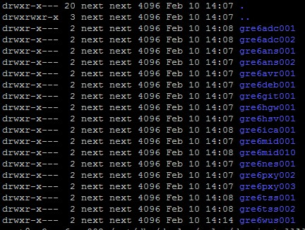  

Figure 1. Alcatraz - directory listing

## 2.5 Nessus Vulnerability scanning (ETA 15min)

**Description:**  
Management environment requires periodic vulnerability scans. Nessus Vulnerability Scanner has been chosen as a security scanner.

Make sure the plugins are up to date by performing following steps.
> Note: For updating the plugins, you will need Active License on the Nessus Server.

1. Browse where the nessus is installed.  (example cd /opt/nessus/sbin/ )
2. Run the command with superuser privileges: /opt/nessus/sbin/nessuscli update --plugins-only

  Nessus Plugins are now up-to-date and the changes will be automatically processed by Nessus.

**Execute:** (Deploy Phase)

```shell
ansible-playbook hardenRunNessusScan.yml
```

**Validate:**  
To check if Nessus reports have been successfully created:

1. SSH to Nessus server - nes001
2. Change directory
   `cd /opt/nessus/var/dhcReports/nessus`
3. List directory content  (Figure 2)
   `ls -al`
4. Check if folder contains report files ( file name format looks like Scan_<type>_<timestamp.csv>)

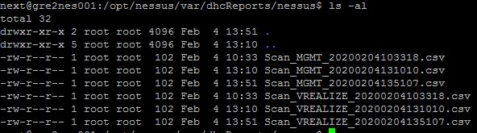  
Figure 2. Nessus - directory listing

## 2.6 WinRM transport mode (ETA 5min)

**Description:**  
During deploy phase WinRM uses Basic authentication. This is the simplest authentication option, which is recognized as the most insecure. To mitigate this during deploy phase HTTPS secure channel is used to secure communication. Also, it does not support domain accounts.

On the other hand, Kerberos in the recommended authentication option to use in a domain environment. It requires some additional setup on the Ansible host before it can be used properly.

>**IMPORTANT!**  
Kerberos does not support local accounts, thus since that point you won't be able to access windows hosts (from Ansible) by using local administrator account. For that purpose service account in windows domain has been created.

**Execute:** (Deploy Phase)

```shell
ansible-playbook hardenEnableAnsibleWinrmTransportKerberos.yml
```

**Validate:**

1. Before you validate please execute step 2.6 (it's later in the pipeline by purpose)
2. SSH to Ansible Core (ans001)
3. Execute *kinit* command followed by your *domain login*
   IMPORTANT: please use capital letters in realm name!
4. Execute *klist* command. As a result you should see valid kerberos ticket (Figure 3)

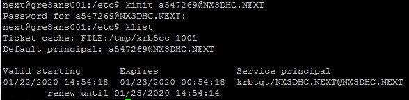  
Figure 3. Ansible - validate Kerberos configuration

## 2.7 Admin account creation in the management domain (ETA 2min per user)

**Description:**  
VCS environment is built using temporary password. Before TOP all passwords must be changed to new one with complexity and randomness.

>**IMPORTANT!**  
Do not ommit this step. Skipping user account creation may result in lost of ability to authenticate to VCS management stack after hardening phase.

Each CO admin must have a personal account. Working on generic accounts is prohibited by Atos security policy.
Rerun playbook as many time you want and create accounts for Cloud Operations team members.

**Execute:** (Deploy Phase)

```shell
ansible-playbook createDomainAdministratorAccount.yml
```

**Validate:**

Login as a created user to any windows system, i.e. tss001, adc001.

## 2.8 Active Directory Group Policy (ETA 2min)

**Description:**  
During deploy phase all windows servers are using local admin account named "administrator". As a security requirement it is important to rename this account name in production.

Bare in mind that this applies to all windows servers but not domain controllers as they don't have the Local Users and Groups databases once they're promoted to a Domain Controller.

**Execute:** (Deploy Phase)

```shell
ansible-playbook hardenGpoMemberServerBasic.yml
```

**Validate:**

1. Login to windows system, i.e. tss001, ica001
2. Navigate to: Control Panel -> System and Security -> Administrative Tools -> Computer Management
3. Confirm local "Administrator" account name has been changed to "c-kathos". (Figure 5)
4. If you still see "Administrator" account name (Figure 6) open command prompt and execute "gpupdate /force" comand (Figure 7). Verify "Administrator" account name has been changed.

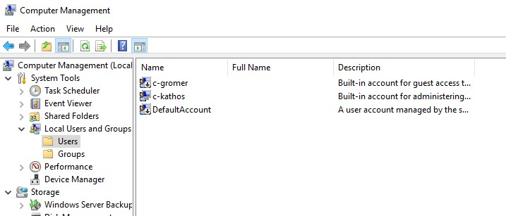  
Figure 5. Local Users and Groups - Expected result

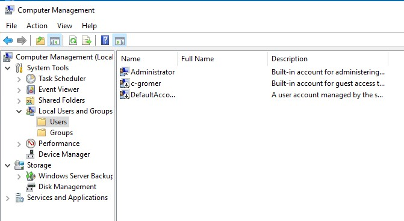  
Figure 6. Local Users and Groups - Unexpected result

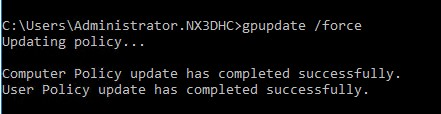  
Figure 7. Local Users and Groups - gpupdate

>NOTE: Generally, the MinPasswordLength requirement is set to 16 characters. Due to the limitation of GPO, where, at most, 14-character requirement can be set, the main.yml playbook for AD creation has been updated. It will apply a Fine-Grained Password policy to all the Role Groups enforcing the MinPasswordLength of 16 characters.

### 2.8.1 Enable computer and user accounts to be trusted for delegation

**Description:**  
Alcatraz compliance scanner identifies gap in GPO for the measure Enable computer and user accounts to be trusted for delegation during the scanning.

Bare in mind that this applies to all windows servers but not domain controllers as it is excempted.

**Execute:**

```shell
Follow the below manual steps
```

**Validate:**

1. Type gpmc.msc from run wizard to Open Group Policy Management Console where GPMC installed.
2. Locate Server OU's and Edit GPO that is linked to OU's under Server or child OU's
3. Edit GPO that is linked to OU's under Server or child OU's
4. Go to Policies >Computer Configuration> Windows Settings> Security Settings> Local Policies\User Rights Assignment> Enable computer and user accounts to be trusted for delegation and remove if there is any account existing(It should be blank).

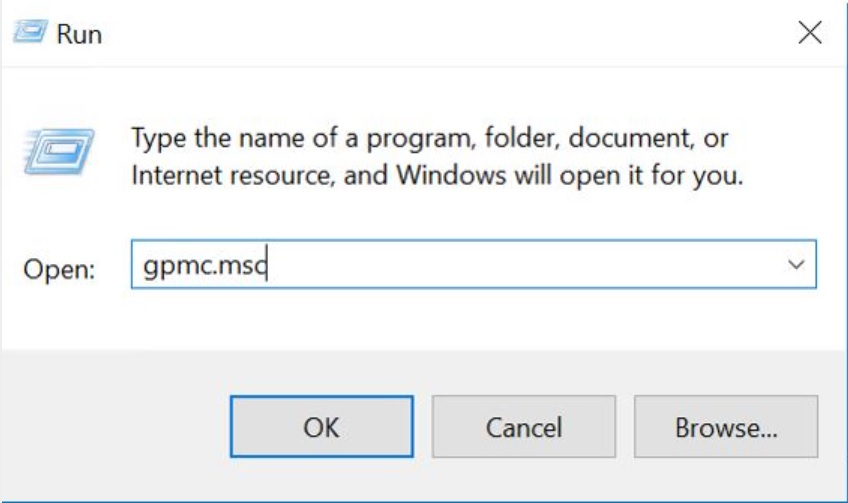

Figure 24. Open GPMC

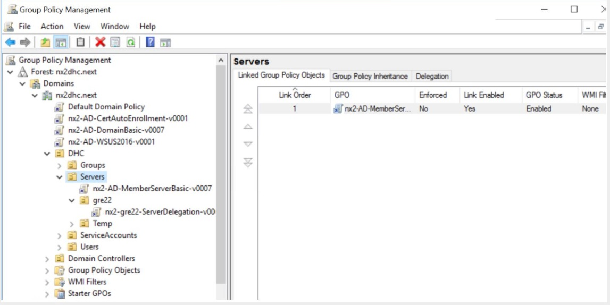

Figure 25. Locate OU's and Sub OU's in GPMC

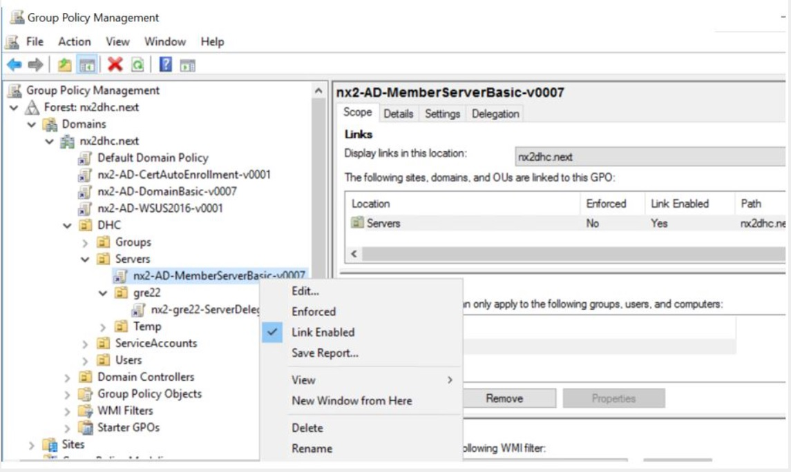

Figure 26. Edit GPO that is linked to OU's under Server or child OU's

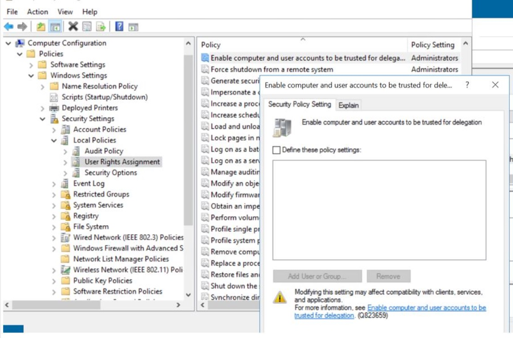

Figure 27. Modify GPO and apply

### 2.8.2 Minimum password length change in GPO through GPMC

**Description:**  
The requirement is to improve security and strengthen admin AD Admin password policy .

Note: This change applies to all users but not service accounts as that has already been managed by fine grained password policy.

**Execute:**

```text
Follow the below manual steps

    1) Type gpmc.msc from run wizard to Open Group Policy Management Console where GPMC installed.
    2) Locate <locationCode>-AD-DomainBasic-v0007 Group policy and Edit by right click on it.
    3) Go to Minimum password length (Policies->Security Settings->Account Policies ->Password Policy) and change characters from 8 to 14 and click apply.
  
```

**Validate:**

1) Go to command prompt/run wizard and type gpupdate /force to reflect changes.
2) Wait for few minutes and run Get-ADDefaultDomainPasswordPolicy via powershell to see status of password length.

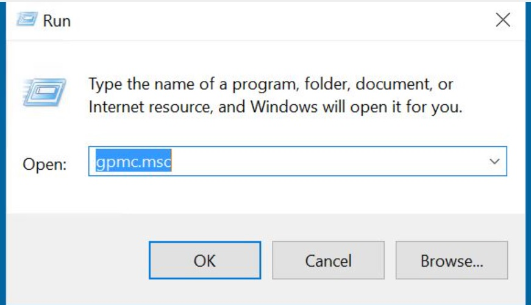

Figure 32. Open GPMC from Run wizard

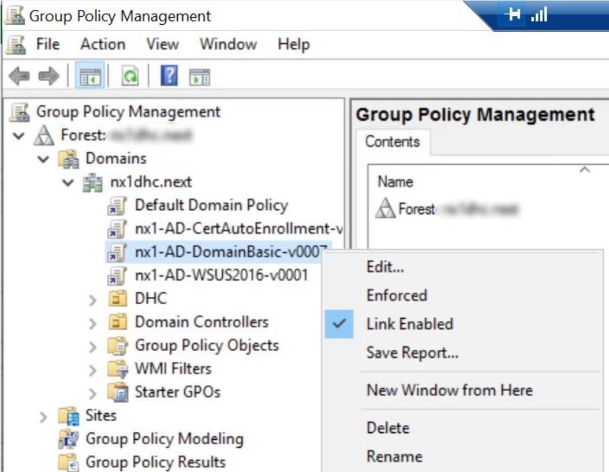

Figure 33. Locate gpo and Edit.

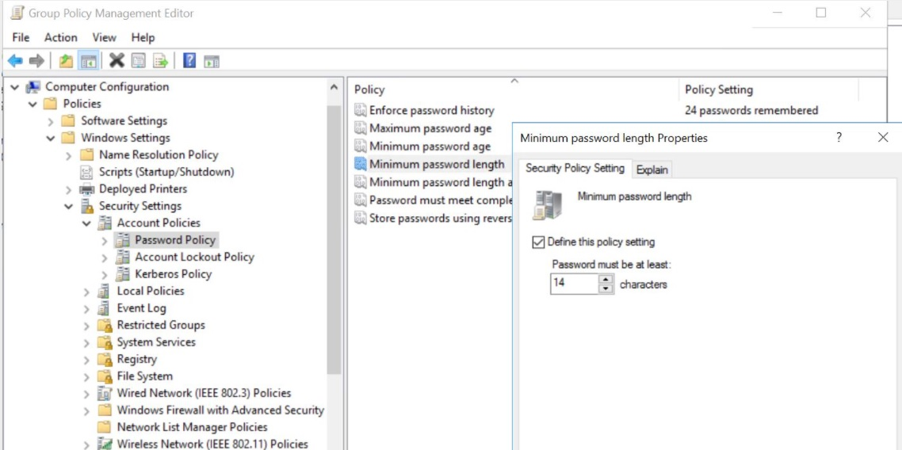

Figure 34. Edit GPO and apply characters to 14 in the minimum password length.

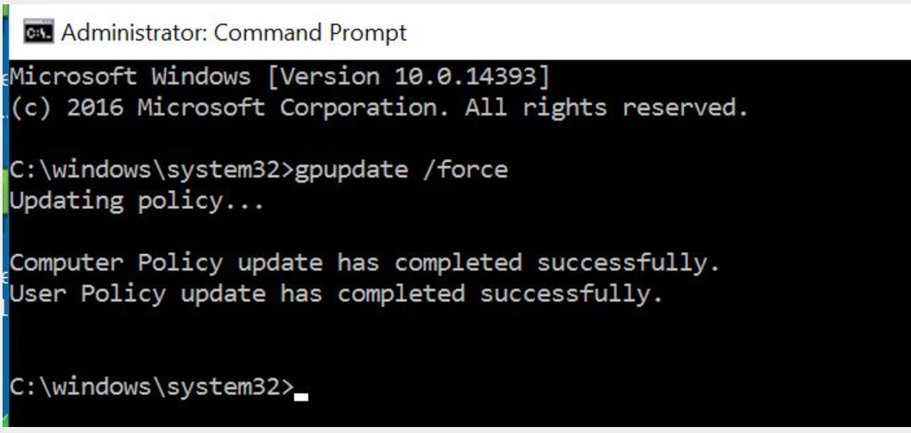

Figure 35. To run gpupdate force through command prompt.

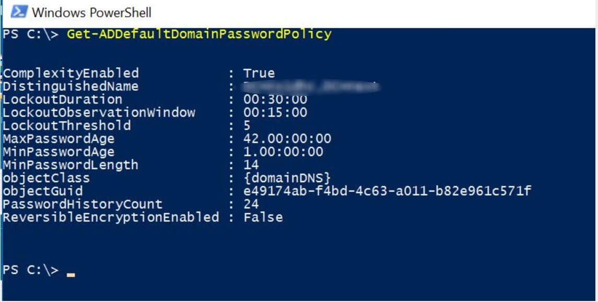

Figure 36. To view post policy update through powershell.

## 2.9 SDDC Manager

### 2.9.1 SDDC Manager (ETA 1-2h)

**Description:**  
In VCS, SDDC Manager manages several components, i.e. ESXi hosts, vCenters, PSC, NSX T, LCM. For a proper LCM process, SDDC Manager stores all passwords to these components locally. Cloud Operations team members are not allowed to change these passwords directly on managed systems. Instead this process must be run by using an ansible playbook (conditionally on SDDC Manager directly, with manual password update on password manager).

**IMPORTANT:**  

- In case VCF components password will be reset on the component and not through the SDDC Manager the LCM will fail.
- If password change fails it is the most likely it will fail in SDDC Manager GUI as well.
Please fix all issues related with password rotation.  
`Note: the process has a tendency to block subsequent requests. In such case, it waits for a retry/cancel action, which can be requested manually via SDDC Manager GUI.`

*hardenPrepareSddcManager* - SDDC Manager requires additional setup to allow system administrators to change SDDC Manager managed passwords to be rotated via ansible playbook or directly via management page.

*resetSddcManagerManagedPasswords* - this playbook rotates SDDC Manager managed passwords.

*resetSddcManagerUsersPasswords* - this playbook resets password for users admin (api), vcf (ssh), root (ssh) and ansible (ssh) on SDDC Manager appliance VM.  

`Note: resetSddcManagerManagedPasswords takes significant amount of time to complete - it can take even 2 hours.`

*updateVropsAdapters* - this playbook updates credentials under vROPS vCenter, NSX-T, vSAN and vIDM adapters. Additionally, this playbook updates vCenter plugin credentials in vRealize Orchestrator.

**Execute:** (Deploy Phase)

```shell
ansible-playbook hardenPrepareSddcManager.yml
ansible-playbook resetSddcManagerManagedPasswords.yml
ansible-playbook resetSddcManagerUsersPasswords.yml
ansible-playbook updateVropsAdapters.yml
```

**`Note: resetEsxiMgmtAccount.yml - Playbook NEED to be executed ONLY if infrastructure is VCS on VxRail and it rotates ESXi management account password
   and updates it in VxRail Manager in an encoded format also, updates it in vault.`**
  
```shell
ansible-playbook resetEsxiMgmtAccount.yml
```

**Validate:**  

1. Check *hardenPrepareSddcManager*

    **NOTE!** Next steps will not run correctly if this step failed

    1.1. Check vCenter configuration

      1. Login to < locationCode >vcs001 vCenter Server using `administrator@vsphere.local` account
      2. Open Administration -> Single Sign On -> Configuration -> Groups
      3. Select SDDCAdmins group.
      4. Check if svc-< locationCode >-vcf01 service account is a member of SDDCAdmins group.

    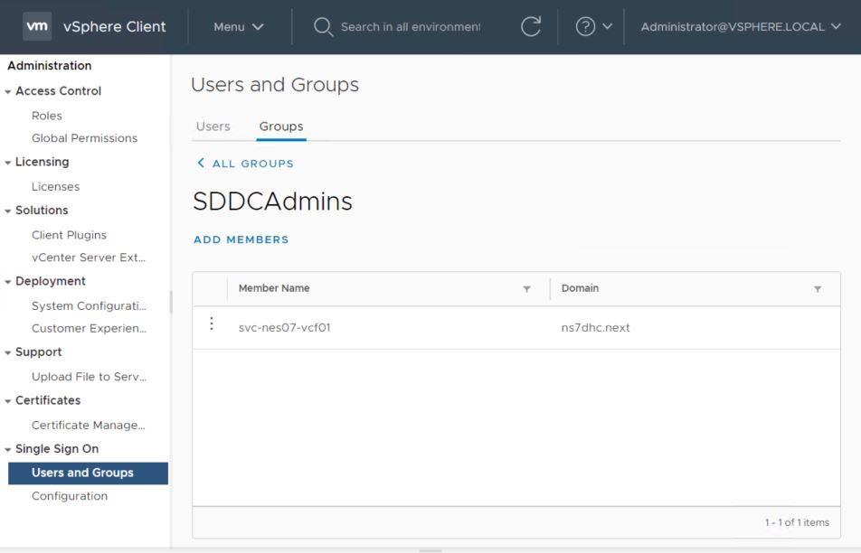  
    Figure 4. vCenter Server - vCenter SDDCAdmins group membership

    1.2. Check HashiCorp Vault entries

      1. Login to HashiCorp Vault < locationCode >hsv001
      2. Navigate to secret -> < customerCode > -> < locationCode > -> servers -> < locationCode >sdm001
      3. Confirm records for admin, ansible, root and vcf exist (Figure 8)

    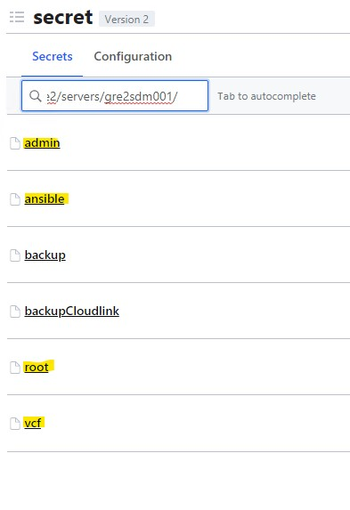

    Figure 8. HashiCorp Vault - sdm001 users

2. Check *resetSddcManagerManagedPasswords*

    2.1. Check HashiCorp Vault entries

      1. Login to HashiCorp Vault `https://< locationCode >hsv001`
      2. Navigate to secret -> < customerCode > -> < locationCode > -> servers
      3. Selectively confirm that records for < locationCode >mgt00*, < locationCode >cmp00*, < locationCode >vcs00*  exist

    NOTE! Since this point password to `administrator@vsphere.local` has been changed. You can find it in HashiCorp Vault under:

    secret -> < customerCode > -> < locationCode > -> servers -> < locationCode >vcs001
  
    *`NOTE! If Infrastructure is VCS on VxRail then check for VXRAIL mystic and root account rotation status as well.`*

    You can find account details in HashiCorp Vault under:
  
    secret -> < customerCode > -> < locationCode > -> servers -> < locationCode >VXM

    2.2. Check modification date on SDDC Manager GUI

      1. Login to SDDC Manager < locationCode >sdm001 using your account
      2. Navigate to Administration -> Security -> Password Management (Figure 9)
      3. In the right corner you can choose entityType  by selecting type in Component combo box (Figure 10 and Figure 11)
      4. Selectively confirm that records for < locationCode >mgt00*, < locationCode >cmp00*, < locationCode >vcs00* exist

    It is important that all passwords "Last Modified" field shows the the same date when you run a playbook.

    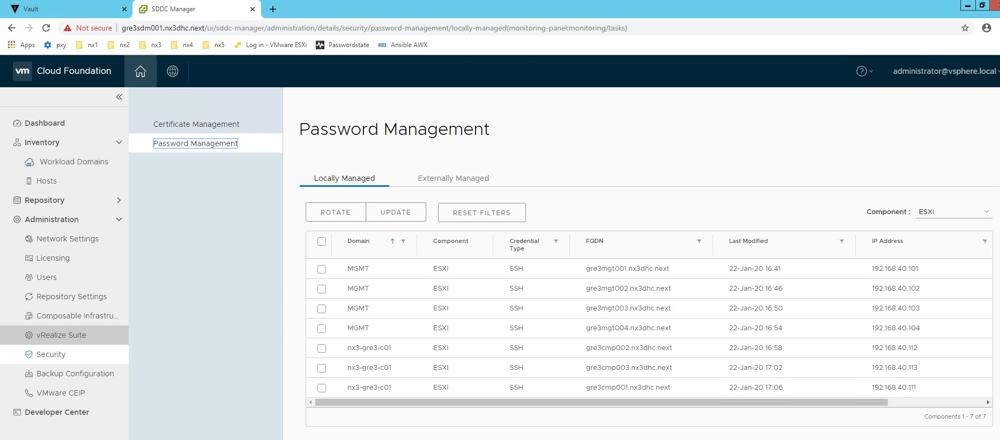

    Figure 9. SDDC Manager - Password Management Main Dashboard

    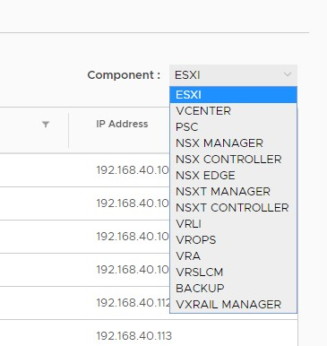

    Figure 10. SDDC Manager - Select component type

    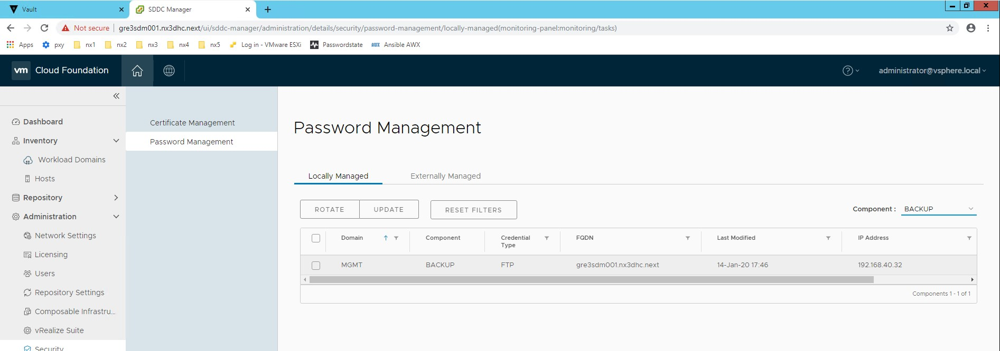

    Figure 11. SDDC Manager - Password Management Component View
  
   **`NOTE! If Infrastructure is VCS on VxRail then Validate ESXi management account password rotation.`**
  
   - Login to ESXi < locationCode >mgt00*, < locationCode >cmp00* using management account taken from vault.
   - Check if login is working with rotated management account
   - Login is working and ESXi invenotry is visible.
  
   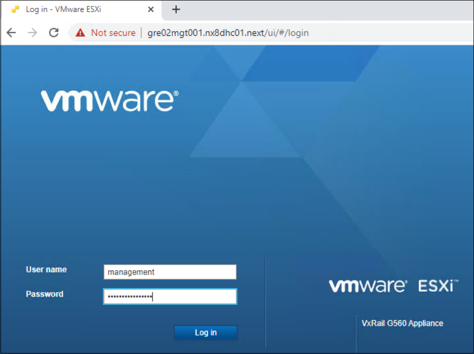
  
   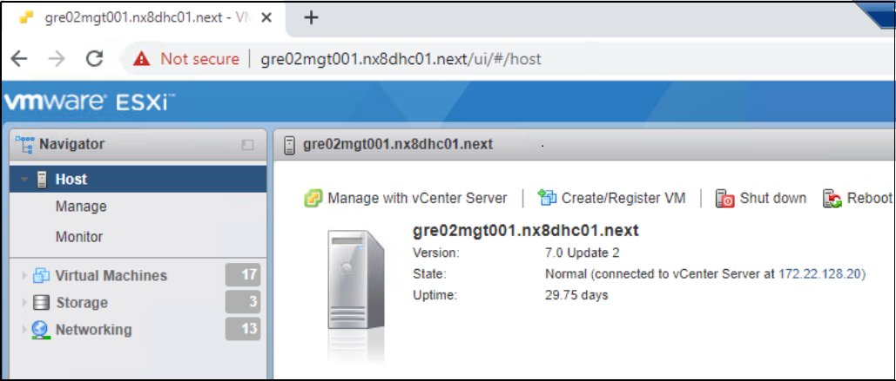

3. Check *resetSddcManagerUsersPasswords*

   3.1 Login to HashiCorp Vault

      Navigate to secret -> < customerCode > -> < locationCode > -> servers -> < locationCode >sdm001

      Confirm that records for admin, ansible, root and vcf have random passwords

   3.1 Login to SDDC Manager

      SSH to the server using vcf and ansible account to confirm that passwords are valid

      Switch user to root: run command "su". Provide password for user root.

4. check *updateVropsAdapters*

   Go to vRealize Operation Manager *`<locationCode>ops001`*  
   Navigate to *Administration->Cloud Accounts*  
   Check statuses of vCenters adapters.  
   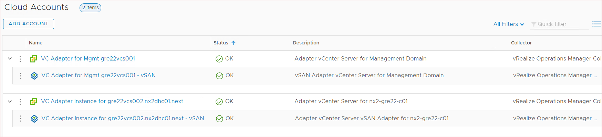  

   Navigate to *Administration->Other Accounts*  
   Check statuses of IDM, NSXT and SDDC adapters.  
   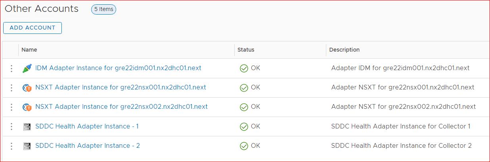
  
   **NOTE!** If Infrastructure is **VCS on VxRail** then Validate VXRAIL adapter in vRealize Operation Manager
  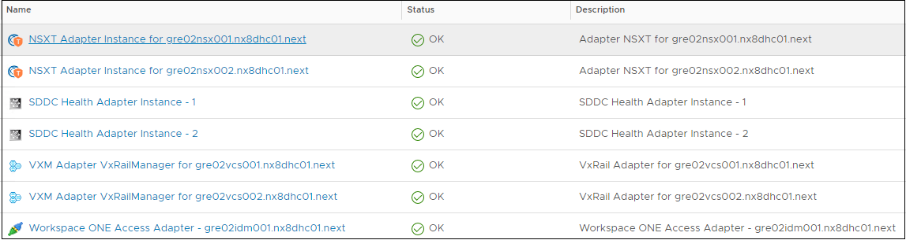

### 2.9.2 vRealize Network Insight (ETA 5m)

In order to update vRealize Network Insight data sources, please execute the following playbook from */opt/dhc/deploy* folder on *ans001*

**Execute:** (Deploy Phase)

```shell
ansible-playbook updateVniDataSources.yml
```

**Validate:**

1. login to vRealize Network Insight over https as admin@local.
2. go to Settings -> Accounts and Data Sources.  
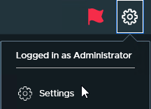
3. check that both NSX connections are working fine and that there are no errors about invalid credentials.  
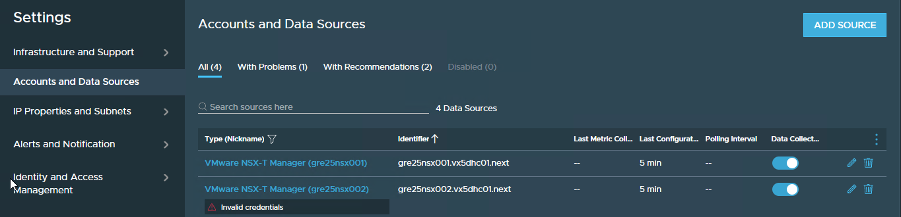

## 2.10 VCF backup configuration

   **Description:**  
   This playbook configures ans001 as external SFTP file-based backup server for VCF and components (vCenters, NSX-T Managers) and configures backup schedule jobs.  
   Playbook is available in */opt/dhc/deploy*

   **Requirements:**  
   Before first run, the playbook `resetSddcManagerManagedPasswords.yml` (which is also part of dhc-harden.yml) must be run first to create proper path structure for sdm001 vm in HashiVault.  

   **Execute:**

   ```shell
   ansible-playbook configureVcfExtBackup.yml
   ```

   **Validate:**  
   To validate VCF backup configuration from various places, go through the following steps:

   For SDDC Manager:

   1. Login to SDDC Manager
   2. In the navigation pane, click `Administration` -> `Backup`.
   3. `SDDC Manager Configurations` tab should display backup schedule and last backup status.

   For NSX-T (both, MGMT and VI workload domains):

   1. Login to NSX Manager as an administrator
   2. Click `System -> Utilities -> Backup`. Backup schedule should be displayed.

   For vCSA (both, MGMT and VI workload domains):

   1. Login to the vCenter server management interface `https:///vcsaFQDN:5480` as root.
   2. Click `Backup`. Information for scheduled backups is displayed in the `Activity` table.

## 2.11 Management Servers (ETA 10 min)

**Description:**  
As mentioned before, during deploy phase local admin accounts were used to setup and configure the VCS environment. From this moment, automation tasks in production are going to be handled by Active Directory service accounts.

Before TOP, it is important to change the passwords for all local linux automation accounts (user next), all local built-in windows administrator accounts and for VCS management domain built-in administrator account.

>**IMPORTANT!**  
Before you run hardenResetLinuxAdminAccount, validate if you're able to login to the linux system using your domain user account.

**Pre check - use your domain user account:**  
   Login to several linux systems using domain user account created in chapter "2.6 Admin account creation in the management domain"

   1. Using putty or mRemoteNG, login to selected linux systems (Figure 12)

   2. Make "sudo -i" to check if you're able to gain super user privileges

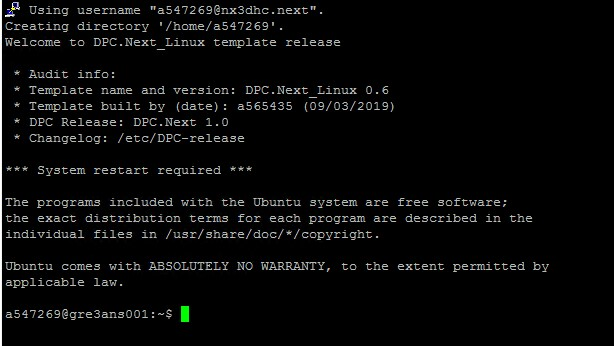  
Figure 12. Linux - Login using AD account

Execute these tree playbooks to change administrator accounts password:

*hardenResetLinuxAdminAccount* - resets user "next" password on all linux management servers  
*hardenAdBuiltinAdminPasswordReset* - resets built-in domain administrator account on domain controller  
*hardenResetBuiltinAdministratorAccount* - resets built-in administrator account on all windows management servers  

**Execute:** (Deploy Phase)

```shell
ansible-playbook hardenResetLinuxAdminAccount.yml
ansible-playbook hardenAdBuiltinAdminPasswordReset.yml
ansible-playbook hardenResetBuiltinAdministratorAccount.yml
```

>TIP: If, for some reason, password change on any host fails, after solving issue you can execute playbook limited to particular host by adding --limit host option to cli execution where host is a server name defined in ansible inventory (hosts file), example:

```shell
ansible-playbook hardenResetLinuxAdminAccount.yml --limit pxy002
```

**Validate:**

1. Login to linux system using local user "next" account

   1.1 Get user next password

      1. Login to HashiCorp Vault `https://< locationCode >hsv001`
      2. Navigate to secret -> < customerCode > -> < locationCode > -> servers -> < hostname > -> next

   Copy password by clicking "copy" icon.

   1.2 Login to several linux systems using local user "next" account

      1. Using putty or mRemoteNG login to several linux systems (Figure 13)
      2. Make "sudo -i" to check if you're able to gain super user privileges

   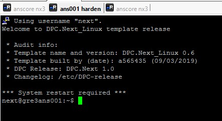  
   Figure 13. Linux - Login using local account (after password change)

2. Login to windows system using domain "administrator" account

   2.1 Login to HashiCorp Vault `https://< locationCode >hsv001`

      Navigate to secret -> < customerCode > -> < locationCode > -> activedirectory -> administrator (Figure 14)

    Copy password by clicking "copy" icon.

   2.2 Login to several windows systems using domain "administrator" account

      Using Remote Desktop Connection (mstsc.exe) or mRemoteNG login to several windows systems (Figure 15)

    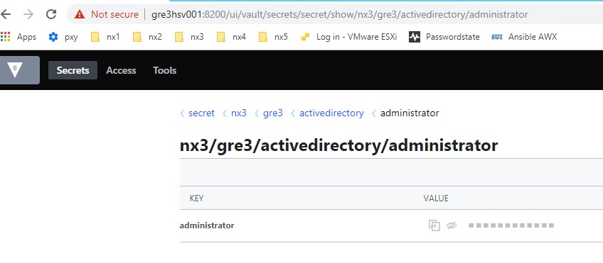  
    Figure 14. Windows - read domain administrator password in HashiCorp Vault

    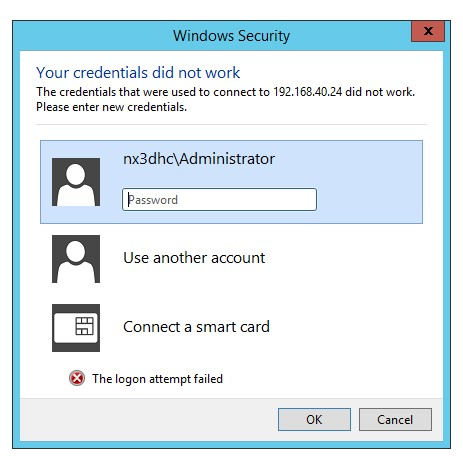  
    Figure 15. Windows - Login using domain administrator account (after password change)

3. Login to windows system using local admin account

   2.1 Get c-kathos user password

      1. Login to HashiCorp Vault `https://< locationCode >hsv001`
      2. Navigate to secret -> < customerCode > -> < locationCode > -> servers -> < hostname > -> c-kathos (Figure 16)
      3. Copy password by clicking "copy" icon.

   2.2 Check local user logons

      1. Login to windows system using local admin account
      2. Using Remote Desktop Connection (mstsc.exe) or mRemoteNG login to several windows system (Figure 17)

    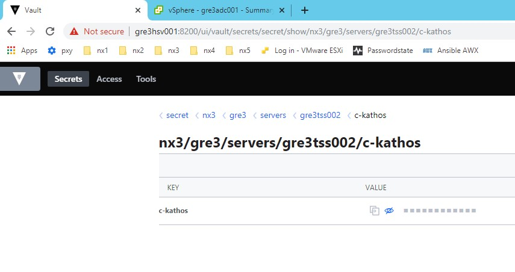  
    Figure 16. Windows - read local administrator password in HashiCorp Vault

    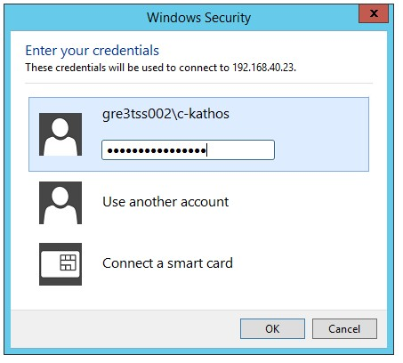  
    Figure 17. Windows - Login using local administrator account (after password change)

## 2.12 ESXi hosts domain join (ETA 5min)

**Description:**  
To enable access to ESXi hosts by using personal domain accounts, all ESXi hosts must be an Active Directory Domain members.

**Execute:** (Deploy Phase)

```shell
ansible-playbook hardenJoinAdEsxiHost.yml
```

**Validate:**  

When you run this playbook you can track progress through vCenter Server Recent Tasks panel. (Figure 18)

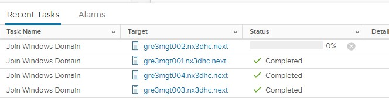  
Figure 18. vCenter - track "Join Windows Domain" tasks on vCenter

Once it's completed login to several ESXi hosts using domain account. (Figure 19 and Figure 20)

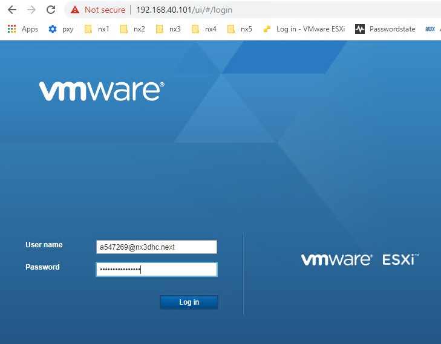  
Figure 19. ESXi - Login using domain user account

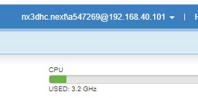  
Figure 20. ESXi - Logged as

## 2.13 ESXi hosts hardening (ETA 5min)

**Description:**  
Implements Technical Security Specifications for VMware ESXi 8.

**Execute:** (Deploy Phase)

```shell
ansible-playbook hardeningEsxi8.yml
```

## 2.14 vCenter hardening (ETA 5min)

**Description:**  
Implements Technical Security Specifications For Vmware Vcenter 8.0.

**Execute:** (Deploy Phase)

```shell
ansible-playbook remediateVcenterNonCompliantMeasures.yml
```

## 2.15 Out of band management - remote controller card

**Description:**  
Before TOP, access to out of band management components (iDRAC, Bulls SHC) must be secured by changing its default password.

DISCLAIMER: this playbook has been tested on iDRACs only. At the time of development Bulls SHCs firmware were outdated and did not support that feature.

**Prerequisite:**  

You need to create *group_vars/oobManagement.yml* file before you execute playbook.

**Execute:** (Deploy Phase, Manage Phase and Update Phase)

1) Login to *ans001* server with domain credentials
2) Edit the */opt/dhc/deploy/group_vars/oobManagement.yml* file with vi editor.

Below is an example of the *oobManagement.yml* file content with two entity items. Provide valid data that reflects ESXi hosts of your environment.

```yaml
---
oobEntity:
  - name: "< locationCode >mgt001"
    address: "192.168.100.60"
    username: "root"
    bull: true #defined ONLY if target server is Bull Sequana
  - name: "< locationCode >cmp002"
    address: "192.168.101.61"
    username: "root"
```

When executed for the 1st time, you must use extra variable `defaultPass` through command line. For Dell servers, well known initial passowrd is `calvin`.

```shell
ansible-playbook resetOobManagementPassword.yml -e defaultPass="calvin"
```

**Validate:**

1. Login to oob management system using local admin account

   1.1 Get user password

      1. Login to HashiCorp Vault `https://< locationCode >hsv001` with your user credentials
      2. Navigate to secret -> < customerCode > -> < locationCode > -> servers -> oob_< hostname > -> < username >
      3. Copy password by clicking "copy" icon.

   1.2 Login to several oob management systems

      1. Open web browser and navigate to oob management system login page. Login using credentials from HashiCorp Vault.

## 2.16 Ansible vars and inventory cleanup

**Description:**  
Before TOP, it is crucial to remove all hardcoded passwords and tokens from group_vars and hosts files. From this moment any sensitive data must not be available as variables. Credentials are secured in the password manager. Users must use personal account to access VCS components, including password manager.

**Execute:** (Deploy Phase)

```shell
ansible-playbook hardenCleanupStaticPasswords.yml
```

**Validate:**  

1. Login to ansible host

    1.1 SSH/SCP to ans001
    1.2 Use cat or your favourite text editor. Validate if:
      - /opt/dhc/deploy/hosts
      - /opt/dhc/deploy/group_vars/all
      - /opt/dhc/deploy/group_vars/nsxVars.yml

   do not contain passwords or tokens stored in clear text.

## 2.17 VCS Password Manager (ETA 2min)

**Description:**  
During deploy phase password manager uses highly privileged local automation account. Before TOP this setting must be disabled. From this moment access to password manager is available via active directory authentication only.

**Execute:** (Deploy Phase)

```shell
ansible-playbook hardenDeleteHashiVaultAutomationUser.yml
```

**Validate:**

1. Login to HashiCorp Vault password manager using domain user account

   1.1 Login to several oob management systems

      1. Open web browser and navigate to HashiCorp Vault (hsv001) system login page. Choose Other -> LDAP as a login method. Provide your user name ans password. Click Sign In. (Figure 23)

   1.2 Copy HashiCorp Vault keys out of ansible prereq.

    `During the deployment keys and root token are saved in JSON file located on ans002 in /opt/dhc/dhc-collections/ansible_collections/atos/dhc/roles/configureVault/files/unsealKeys/unsealKeys.json. Generated file needs to be moved outside of VCS and stored according to defined security procedures.`

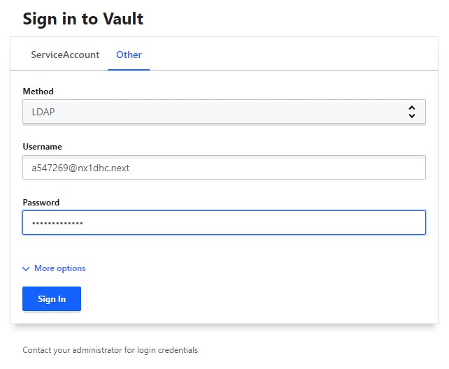  
Figure 23. HashiCorp - Vault login page

## 2.18 Alcatraz and Nessus Remediation

### 2.18.1 Disable TLS 1.0 and 1.1 and weak Ciphers

**Description:**  
Management environment requires periodic vulnerability scans. The playbook to disable the outdated TLS protocols and weak cipher algorithms has been created under the manage folder - *disableTLS1WeakCiphersOnLinux.yml.*
A role has been created to support the playbook to accomplish this task - dhc-disableTLS1WeakCiphersOnLinux.
This role is used to disable the outdated TLS protocols and weak cipher algorithms from the Linux server running Apache web server.

**Requirements**

No specific requirements are needed to run this role apart from Ansible.

**Execute:** (Manage Phase)

The playbook calling the role can be executed as shown below. Do note that as mentioned in the description, this playbook can be used to disable the outdated TLS protocols and weak cipher algorithms on a **Linux server running Apache web server**. For example, the deb001 repo server.

```shell
$ansible-playbook disableTls1WeakCiphersOnLinux.yml -e HOSTS=deb001
```

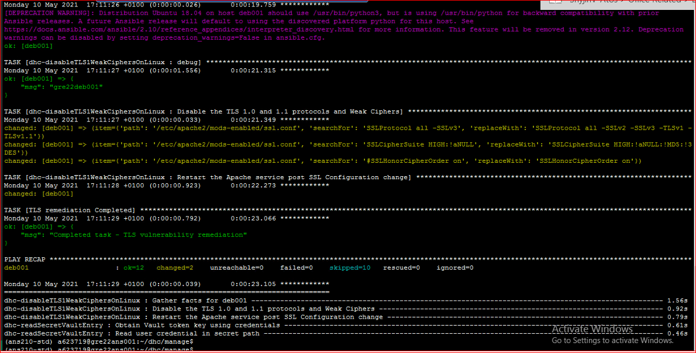  
Figure 37. Ansible playbook execution

### 2.18.2 Windows IIS Compliance Fixes

**Description:**

The playbook (complianceAlcatrazSecurityIIS.yml) applies remediation on IIS non-compliance measures for the below list.

- WI00007
- WI00016  
- WI00020
- WI00022
- WI00024
- WI00025
- WI00027
- WI00028

**Requirements:**

 This playbook affects the wus001 and ica001 servers that run IIS and fixes the non-compliant measure ids declared in defaults/main.yml.

**Execute:** (Manage Phase)

```shell
ansible-playbook complianceAlcatrazSecurityIIS.yml
```

### 2.18.3 Windows TSS Fixes

**Description:**

The playbook (complianceAlcatrazSecurityWindows.yml) applies remediation on the below non-compliant windows for the below list.

- SW00001
- SW00038
- SW00039
- SW00077

**Requirements:**

 This must be used only for VCS deployed windows VMs.

**Execute:** (Manage Phase)

```shell
ansible-playbook complianceAlcatrazSecurityWindows.yml
```

### 2.18.4 Update vCenter root password policy

**Description:**
This playbook configures root user password expiration on vCenter for 90 days and adds email id for notification. This task addresses **measure id 3VV00006** of the TSS guidelines for vCenter servers.

**Requirements:**

- Execute the playbook on ans001 server from /opt/dhc/manage folder once per vCenter.
- It will take input from user as: domain id, password, vCenter name from list and mailTo id.
- It will accept only one mailTo id for notification and one vCenter.

**Execute:** (Manage Phase)

```shell
ansible-playbook configureVcenterPasswordExpiration.yml
```

- Step 1.: Run Playbook
  

- Step 2.: Enter all required input fields values.
  
  
- Step 3.: Results after successfully execution of playbook.
  
  

### 2.18.5 Disable TLS 1.1 in NSX

   **Description:**
      According to [TLS Inspection Support](https://techdocs.broadcom.com/us/en/vmware-cis/nsx/vmware-nsx/4-2/administration-guide/security/gateway-firewall/tls-inspection/tls-inspection-support.html) TLS 1.1 support is deactivated by default

### 2.18.6 Fix vCenter non-compliance

   **Description:**  
      This playbook remediates the vulnerabilities which are found on the vCenter servers. These vulnerabilities are identified by their TSS measure ids. The playbook and its supporting role is an evolving piece of work and newer measure ids would be added to the playbook as and when found. Please refer to the role's README file at the path - "manage/roles/dhc-remediateVcenter/README.md" for the list of measure ids that are getting remediated.

   **Requirements:**  
      The playbook gives the user an option to provide tags as inputs during runtime (while executing the playbook) in case if the user intends to remediate a specific measure ID.

   **Execute:** (Manage Phase)

   **NOTE: skip if "2.14 vCenter hardening" was executed. Continue with validation.**

   ```shell
   ansible-playbook remediateVcenterNonCompliantMeasures.yml 
   ```  

   **OR (if provided tag needs to be executed)**  

   ```shell
   ansible-playbook remediateVcenterNonCompliantMeasures.yml --list-tags #to check available tags in the playbook
   ansible-playbook remediateVcenterNonCompliantMeasures.yml  --tags "1VV00001"
   ```

   **Validate:**  
      The following few examples shows the changes made after the playbook execution for a few of the vCenter measure ids.

1. TSS Measure ID **1VV00001**  
    
  

2. TSS Measure ID **1VV00002**  
  

3. TSS Measure ID **1VV00004**  
    
  
  
### 2.18.7 Fix NSX-T non-compliance  

   **Description:**
  The role creates dhc-mac-discovery-profile with mac-change settings as disabled and maps it to all the segments under Networking in NSX-T as per the Compliance document MSP-GAD-0278. In addition to improve functionality for clustered solutions in overlay networks a dhc-ip-discovery-profile is created and assigned. Executing this playbook is only valid for environments without having this implemented. Remediation and improvement is included into deploy phase already.
  
   **Execute:** (Manage Phase)

   ```shell
   ansible-playbook remediateNsxtNonCompliantMeasures.yml 
   ```  
  
   **Validate:**  
      The following image shows the changes made after the playbook execution in NSX-T
  
  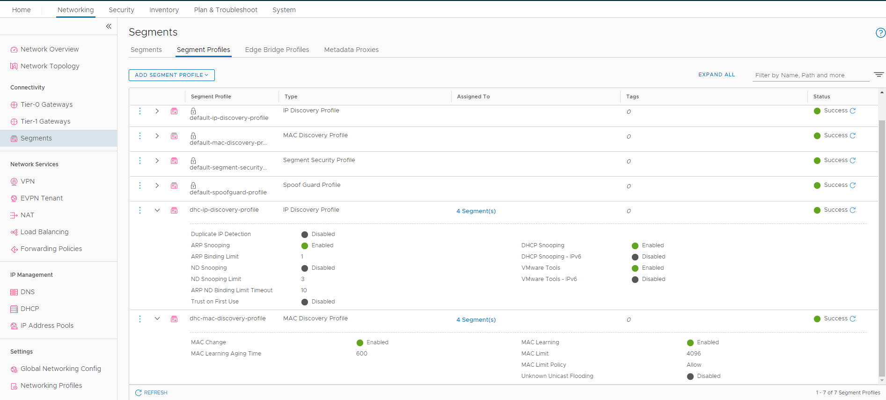
  
  
  
## 2.19 Using Compliance Overview

   **Description:**  
     There is a Compliance Overview document available at [wiComplianceOverview.md](wiComplianceOverview.md) which contains playbooks related to compliance that must be followed.

# 3 Post Hardening

>**After HARDENING all the playbooks in */opt/dhc/deploy* become OBSOLETE**

VCS delivers:

- Operational playbooks in the ***/opt/dhc/manage*** folder.
- Life Cycle Management playbooks in the ***/opt/dhc/update*** folder.

>Refer to [List of Operational Playbooks](operationalPlaybooks.md) that describes playbooks located in the */opt/dhc/manage* folder on *ans001* server.

**Return to [VCS Build Guide](dhcBuildGuide.md) procedure to continue the build**.
