# Integration of vIDM with Atos SSO

## Table of Contents

- [Integration of vIDM with Atos SSO](#integration-of-vidm-with-atos-sso)
  - [Table of Contents](#table-of-contents)
  - [Changelog](#changelog)
  - [Introduction](#introduction)
    - [Audience](#audience)
    - [Scope](#scope)
  - [Pre-requisite](#pre-requisite)
    - [Network requirements](#network-requirements)
  - [Technical application requirements](#technical-application-requirements)
  - [Login Flow](#login-flow)
  - [SSO Registration Request](#sso-registration-request)
  - [Configure vIDM with Atos SSO](#configure-vidm-with-atos-sso)
    - [Add Identity Provider](#add-identity-provider)
    - [Default policy conifugration](#default-policy-conifugration)
    - [Create a Group for SSO directory](#create-a-group-for-sso-directory)
    - [Additional Configuration](#additional-configuration)
  - [Login Process](#login-process)
  - [Assigning user roles](#assigning-user-roles)
  - [Internal SSO Contacts](#internal-sso-contacts)
  - [Known Issues](#known-issues)

## Changelog

| Date       | TOS     | Issue   |    Author         |    Description    |
| ---------- | ------- | ------- | ----------------- | ----------------- |
| 06-21-2023 | VCS 1.8 |   VCS-9837   | Divyaprakash J    |    Document creation |

## Introduction

This document describes step-by-step instructions to configure the vIDM with Atos SSO service for VRA On-Prem.

- It helps us to improve security based on Atos guidelines.
- The Atos SSO service is used to authenticate Atos employees using their DAS ID. Web applications can federate the authentication to this service by configuring it as an Identity Provider(IDP).

### Audience

VCS deployment engineers, Dev-Sec-Ops team

### Scope

The scope of this document is to cover the Integration of Atos SSO with vIDM in VCS.

## Pre-requisite

- SAML 2.0 Identity Provider will be used as authentication method.
- Connectivity should be created from vIDM to Atos SSO.

### Network requirements

- To connect ATOS SSO from VIDM, a proxy server is utilized
- To add a proxy configuration in IDM server , use the URL `https://< idm002 >:8443/cfg/setup`
- Use the local admin account to login . Refer to the screenshot below for further information.

  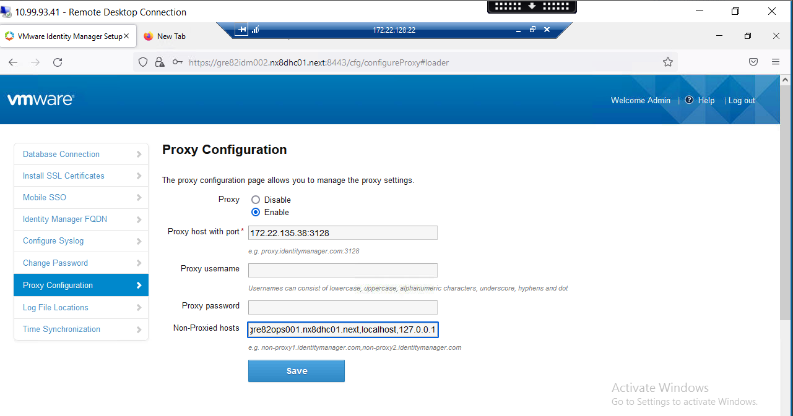

## Technical application requirements

For an application to be able to implement the federated trust for authentication, it needs to support, directly or indirectly a federated authentication protocol.

- WS-Federation: Is an identity federation protocol based on Web Services. The tokens follow the SAML message specification in an XML message format. **(Supported by Atos SSO system)**

  [Reference Link](http://docs.oasis-open.org/wsfed/federation/v1.2/ws-federation.html)

- SAML 2.0: Is a specification for federated authentication and uses the SAML message specification for the tokens in an XML message format. **(Supported by Atos SSO system)**

  [Reference Link](https://www.oasis-open.org/committees/download.php/56776/sstc-saml-core-errata-2.0-wd-07.pdf)

- OpenID Connect 1.0: Is a standard for a simple authentication layer on top of the OAuth 2.0 authorization framework. It uses RESTful API with JWT tokens in a JSON message format. **(In preparation)**

  [Reference Link](https://openid.net/connect/)

For integrating vIDM with AtosSSO, you will use SAML 2.0 authentication.

## Login Flow

  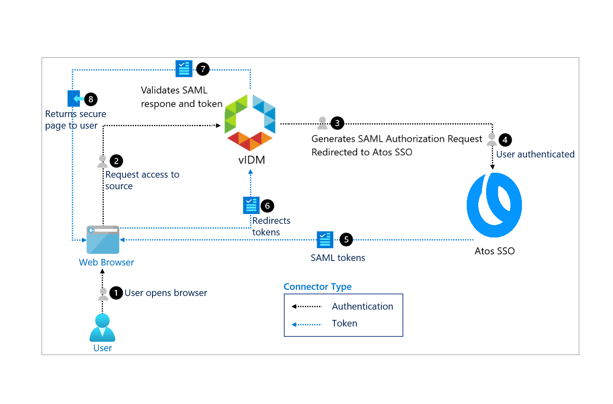

**Steps :-**

1. User tries to access the web application
2. The application sends back a response with SAML redirection request
3. User’s browser is redirected to Atos SSO system
4. User authenticates at Atos SSO system
5. The Atos SSO system sends back a response with a SAML token and redirection request back to the application
6. User’s browser is redirected to the application with the SAML token
7. The application checks the SAML token and grants access to the application

This flow is pure HTTP(S) communication and only requires connectivity from the user’s web browser towards the application and Atos SSO system on TCP port 80 and/or 443

## SSO Registration Request

- First , Create a PISA ticket to Atos Internal SSO team

  - Login to Atos Portal then select `Raise A Request`

  - Navigate to `Home` > `IT` > `Identity & Security` > `SSO (Login with PKI, OTP, DAS)` > `Add an application to the SSO system`

  - Refernce link - [PISA Portal](https://pisa.myatos.net/homeid=sc_cat_item&sys_id=884a1f051bd8e05014bd42eacd4bcbd6&sysparm_category=e6a90c4f1bc1c8107c1ddceacd4bcbb5&catalog_id=-1)

    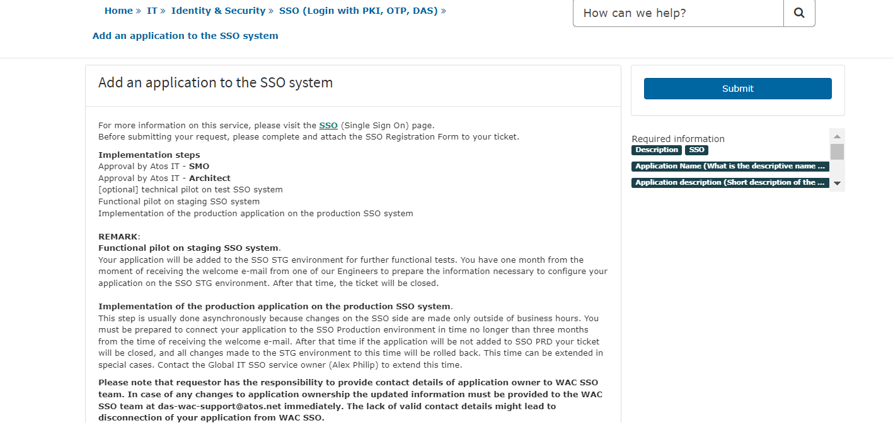

  - Please see the document below for further information on the registration process.

    [Registration Form Details](files/IntegratevIDMwithAtosSSO/SSO_RegistrationForm_template.docx)

  - Fill out the form and submit it.

- Following that, you will obtain metadata from the Internal SSO team via mail . You will use that **Metadata** to configure vIDM .

- Use the subsequent topics to configure vIDM

## Configure vIDM with Atos SSO

### Add Identity Provider

1. Login to vIDM via admin account and go to `Administrative Console`

2. Navigate to `Identity and Access Management` > `Identity Prioviders` > `Add Identity Provider` > `Create Third Party IDP`

   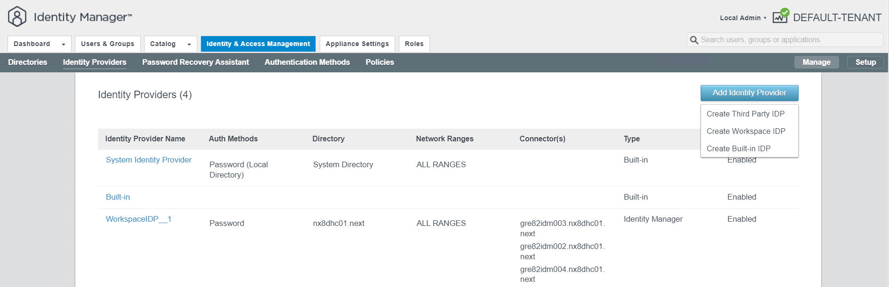

3. Mention IDP name and for Metadata paste the content that you got from ATOS SSO team which contains Entity ID , Assertion Consumer Service and Ceritificate etc.,

4. Process IDP Metadata , It will check the Metadata is valid or not , then select `SAML AuthN Request Binding` > `Select HTTP Redirect`

   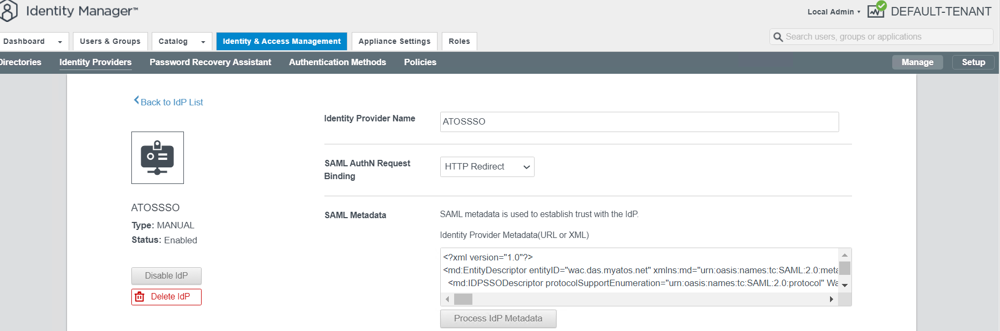

5. Provide the needed NameID format.

   The setup we utilized in our development environment is shown below.

   - `urn:oasis:names:tc:SAML:1.1:nameid-format:unspecified`  - userName
   - `urn:oasis:names:tc:SAML:1.1:nameid-format:emailAddress` - emails
   - `http://schemas.xmlsoap.org/ws/2005/05/identity/claims/givenname` - firstName
   - `http://schemas.xmlsoap.org/ws/2005/05/identity/claims/surname` - lastName

6. Provide NameID policy as shown below.

   

7. Enable Just-in-Time User Provisioning

   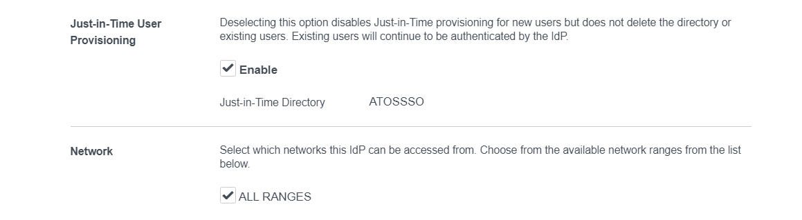

   After enabling JIT, it will prompt you for a directory name and domain, and it will then construct a directory for you.

8. Choose which networks can connect to this IdP. In general it uses ALL RANGES.

   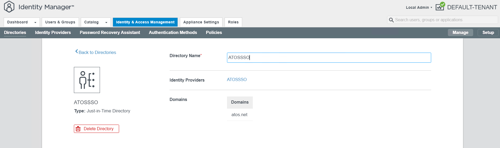

9. Select authentication method for ATOSSSO with the needed SAML configuration, as seen in the picture below.

   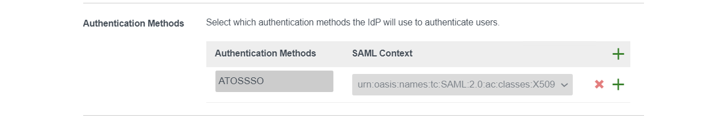

10. Enable Single Sign-out Configuration and, if necessary, provide the IDP Sign-out URL and IDP Redirect parameter.

    - IDP Sign-out URL - Give the URL (which should be our Atos Logout URL) that makes it easier for users to log out of an application.

    - IDP Redirect - Mention the URL that will reroute users to the login page; ideally, this is the IDM URL, which is `https://<locationCode>idm001.<domainName>`.

    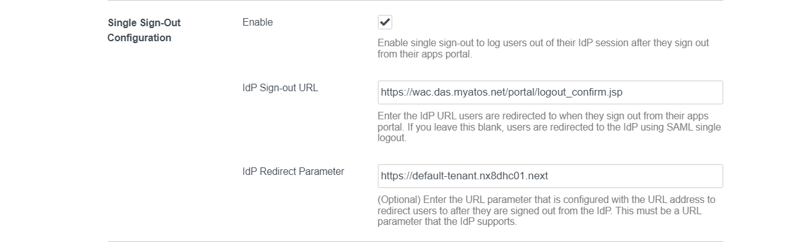

11. You will now receive a SAML Signing Certificate. Please copy and preserve that metadata, which you will need to submit to the AtosSSO team.

    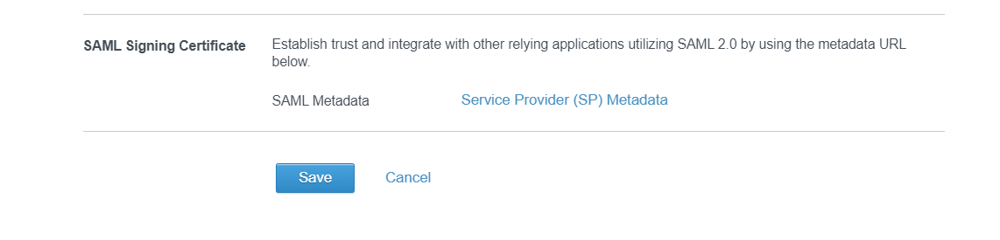

12. Save it . A new Identity provider will be added.

### Default policy conifugration

- Navigate to `Policies` > `default_access_policy_set` > `Edit`

- Then Select `Configuration` > `Add Policy Rule`

   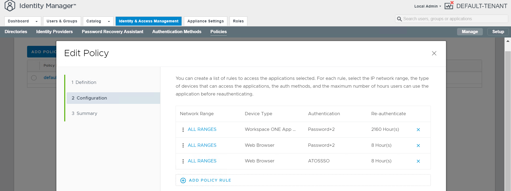
  
- Add a new policy rule for AtosSSO and the authentication method described previously when adding the Identity provider shown in the screenshot below.

  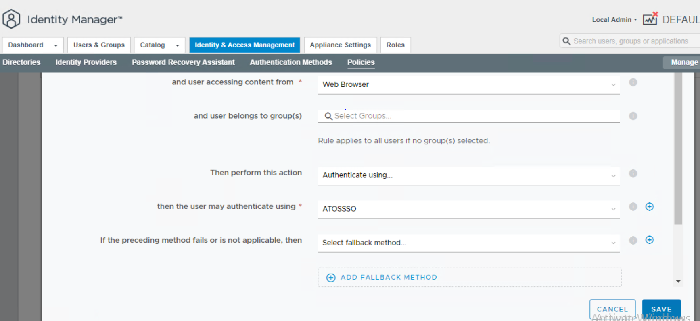

- Select `Workspace One App` > `Edit` . Add a new Fallback Method `If the preceding method fails or is not applicable, then`  as **ATOSSSO**.

  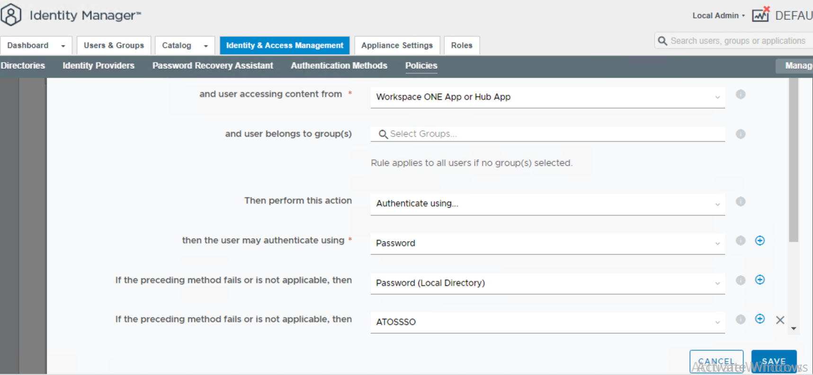

- In second policy ensure to configure the policy to try Password authentication first, then fall back towards the Atos SSO Identity Provider

  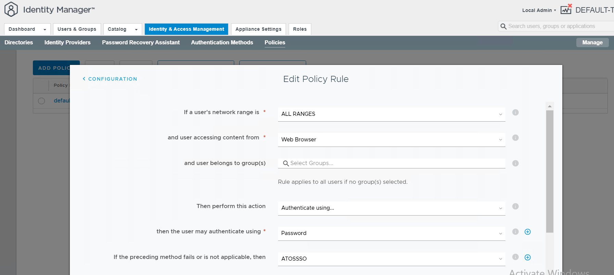

- Save the Default policy configuration

### Create a Group for SSO directory

- Create an Atos SSO directory group using  `Users&Groups` > `Groups` > `Add Group`

   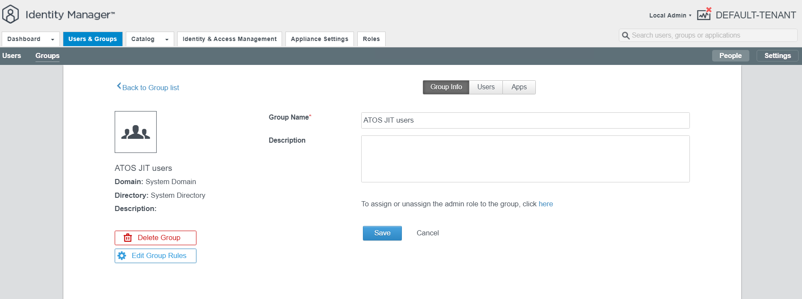

- Add the setup shown in the screenshot to Group rules.

  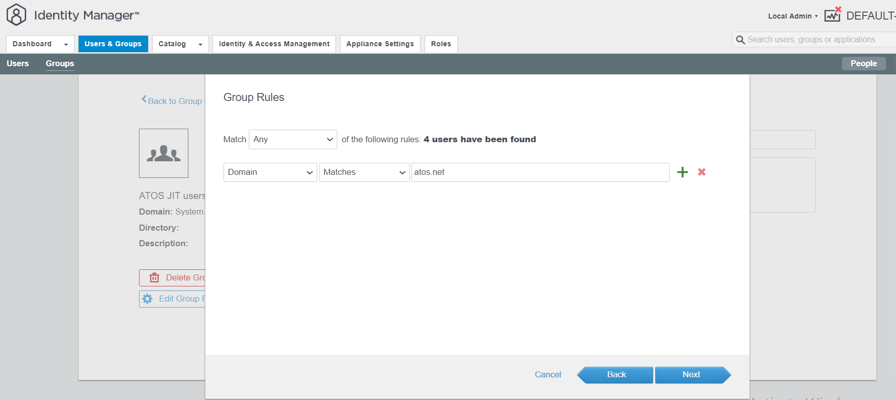

### Additional Configuration

- Navigate to `Identity&Access Management` > `Setup` > `Preferences`
- Under `User Sign-in Unique Identifier`give User Sign-in Unique Identifier as **userName**
- Enable `Show Domain Drop-Down Menu when required for Unique Identifier Login`

  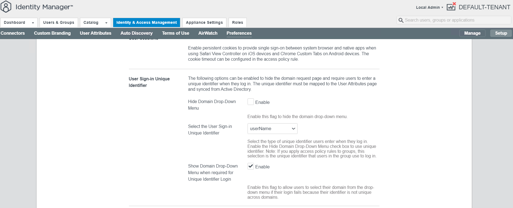

- Save and Close

## Login Process

- Login to VRA portal via web browser

- It will redirect to vIDM to select options like System Domain , AtosSSO

  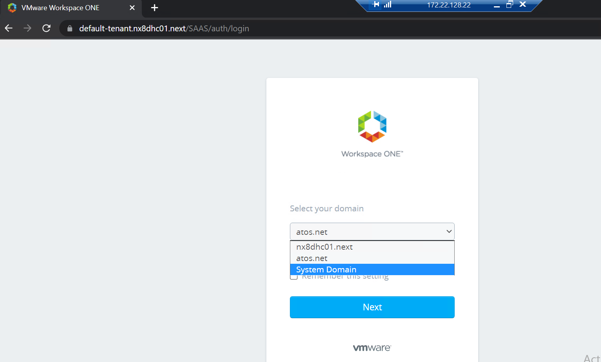

- Select AtosSSO it will redirect to Atos portal , you can use Dasid password and Auth code to login

  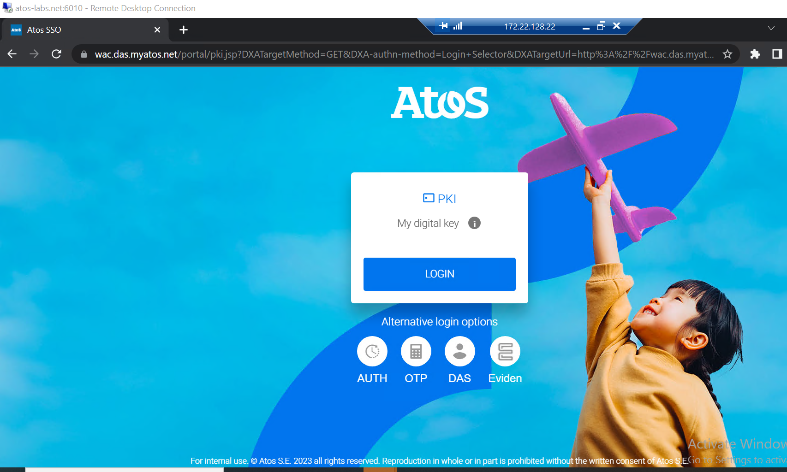

- If its successful it will redirect to VRA portal

  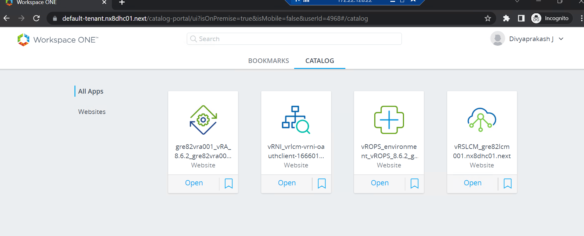

>[!NOTE]
>
>**Any reconfiguration will take place outside of business hours.**

## Assigning user roles

A user must be allocated certain roles in order to access VRA.

- By using the administrator account, we may provide the user roles.

- For the necessary domain, we must first establish a `group`. It's covered in the previous phases - [Create a Group for SSO directory](#create-a-group-for-sso-directory)

- Go to `Identity and Access Management` after logging in to VRA with the administrator account.

- To assign an organization role, click `Assign Roles` and choose an organization member, for example.

- Add roles for `services` as needed.

- Save, and the user can access VRA.

  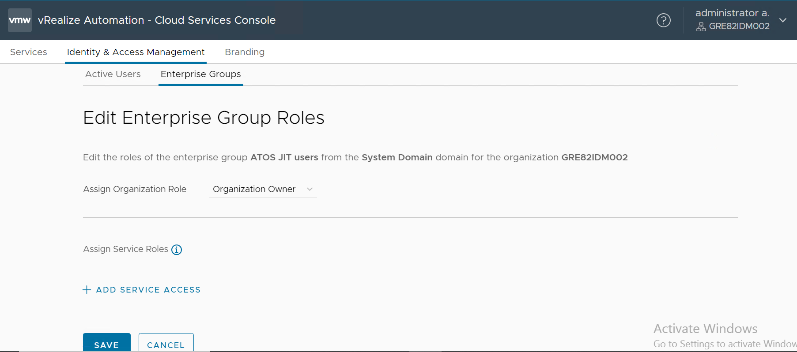

## Internal SSO Contacts

The following contacts for Internal SSO configurations:

| Contact Name | Contact Email |
|:------------:|:-------------:|
| Dominik Abu Nahia | `dominik.abunahia@atos.net` |

## Known Issues

1. Modify the SAML Attribute from the Internal SSO Side.
   - Because the vIDM Name ID Format for username cannot be modified, you must match this format in Internal SSO as well.
   - Instead of uid, you need to modify it to **userName** on the internal SSO side.

     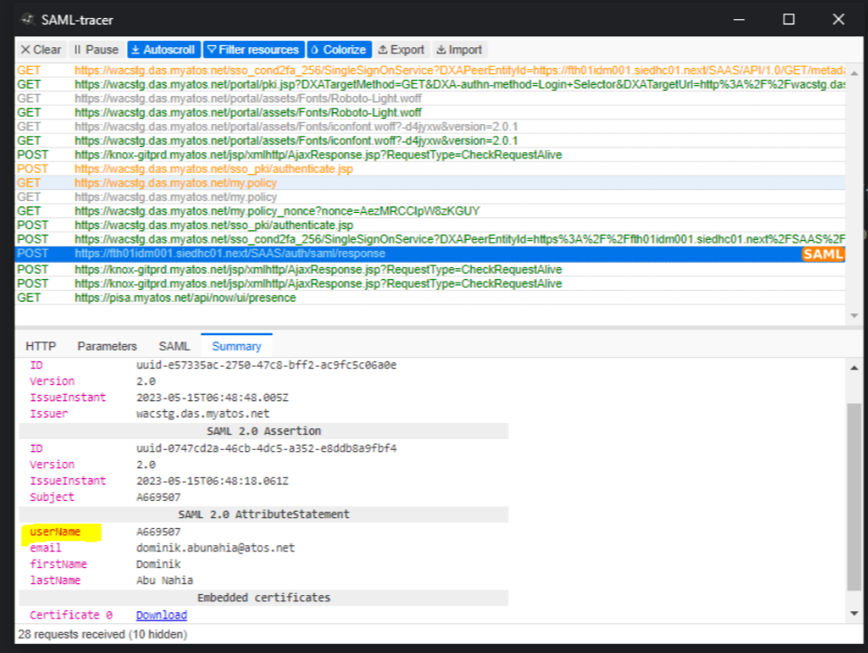

   - As a result, we must resolve it with the SSO contact listed above.
